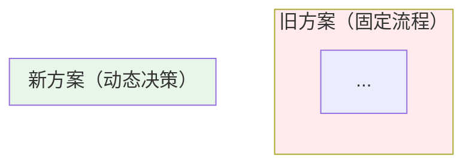
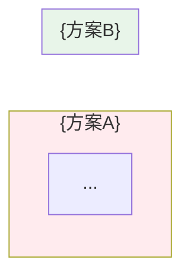

# 博客文档结构模板

> 本文件是 `blog-generator` Skill 的参考文件，在 Step 2 内容编写时加载。

## Frontmatter 模板

```yaml
---
title: {博客标题：含核心关键词，简洁权威，≤35字}
category: {人工智能 | 前端开发 | 后端开发 | DevOps | 数据库}
tags: [标签1, 标签2, 标签3]
description: {SEO 描述，100-160 字符，包含核心关键词，有引导点击的价值主张}
author: smallyoung
date: {YYYY-MM-DD}
dateModified: {YYYY-MM-DD}
keywords: [关键词1, 关键词2, 关键词3]
cover: //cdn.smallyoung.cn/smallyoung_blog/{主题简称}/1.png
---
```

**字段说明**：

| 字段 | 规则 | 示例 |
|------|------|------|
| `title` | 含核心关键词，≤60 字符 | `Agentic RAG：让 AI 主动检索的下一代架构` |
| `category` | 从五个预设值选一 | `人工智能` |
| `description` | 100-160 字符，回答"读完能得到什么" | `本文带你从零理解 Agentic RAG 的工作原理…` |
| `cover` | 固定 CDN 前缀 + 主题简称 | `//cdn.smallyoung.cn/smallyoung_blog/agentic-rag/1.png` |

## 正文结构模板

> **写作顺序**：先完成正文全部章节 → 再回填 MindMapFloat。

````markdown
# {文章标题}

> {导语：2-3 句话。第一句直接给出核心结论，第二句说明价值，第三句预告覆盖范围}
>
> 📌 **核心论文**：[论文标题](https://arxiv.org/abs/XXXX.XXXXX)（arXiv:XXXX.XXXXX）
> 📌 **适合人群**：{目标读者，如：AI 初学者、后端开发者}


<!--
  MindMapFloat 填写规范：
  - 节点是"知识维度/主题分类"，不是章节标题的复制
  - 通常 4-6 个一级节点，覆盖该主题的核心知识维度
  - 二级节点是每个维度下的关键要点（从正文中提炼，不能虚构）
  - 节点数 < 正文章节数（它是知识地图，不是目录）
  - 完成正文后再填写，禁止使用"要点1""原理2"等占位词
  示例（Agentic RAG）：
    ## 为什么需要    ← 不是章节名，是知识维度
    ## 核心架构
    ## 关键能力
    ## 主流实现
    ## 应用场景
-->
<MindMapFloat title="{主题}知识图谱">

```mindmap-data
# {主题名称}
## {知识维度1：回答"为什么"}
- {该维度下的关键要点}
- {该维度下的关键要点}
## {知识维度2：回答"是什么"}
- {该维度下的关键要点}
- {该维度下的关键要点}
  - {子要点}
## {知识维度3：回答"怎么运作"}
- {该维度下的关键要点}
- {该维度下的关键要点}
## {知识维度4：回答"怎么用"}
- {该维度下的关键要点}
- {该维度下的关键要点}
## {知识维度5：回答"注意什么"}
- {该维度下的关键要点}
- {该维度下的关键要点}
```

</MindMapFloat>

## 关于本文档

{2-3 句话说明本文的覆盖范围和阅读价值}

- ✅ {核心内容点1}
- ✅ {核心内容点2}
- ✅ {核心内容点3}
- ✅ {核心内容点4}
- ✅ {核心内容点5}

## 1. {痛点/背景章节：解释"为什么需要"}

### 1.1 {现有方案是怎么工作的？}

{介绍现有方案的工作机制，配 mermaid 图。让读者先理解基准线}

```mermaid
flowchart LR
    A[{步骤1}] --> B[{步骤2}] --> C[{步骤3}]
    style A fill:#e3f2fd
    style C fill:#e8f5e9
```

### 1.2 {现有方案的核心局限}

{用表格列出局限性，每行给出具体的真实场景反例}

| 局限 | 具体表现 | 真实案例 |
|------|----------|----------|
| {局限1} | {表现} | {案例} |
| {局限2} | {表现} | {案例} |

> [!IMPORTANT]
> {用一句话点明核心矛盾：现有方案是 X，但真实需求是 Y}

### 1.3 {新方案的核心思想}

{一句话概括新方案的本质。配对比 mermaid 图：旧方案 vs 新方案}



## 2. {核心架构/原理章节}

### 2.1 {整体架构概览}

{宏观视角描述整体结构，配分层架构 mermaid 图（subgraph 展示分层）}

```mermaid
flowchart TB
    subgraph 层1["🧠 {层1名称}"]
        {组件}
    end
    subgraph 层2["🔧 {层2名称}"]
        {组件}
    end
    层1 <--> 层2
    style 层1 fill:#e3f2fd
    style 层2 fill:#fff3e0
```

### 2.2 {核心机制/算法}

{深入讲解最核心的运作机制。如果有伪代码或示例，用代码块展示}

```
{核心机制的示意代码或步骤}
```

> [!NOTE]
> {机制来源：引用相关论文或标准}

### 2.3 {完整工作流程}

{用详细的 mermaid flowchart 展示端到端流程，包含判断节点和分支}

```mermaid
flowchart TB
    A[{起点}] --> B[{处理}]
    B --> C{判断}
    C -->|条件1| D[{分支1}]
    C -->|条件2| E[{分支2}]
    D --> F[{汇合点}]
    E --> F
    F --> G[{终点}]
    style A fill:#e3f2fd
    style G fill:#e8f5e9
```

## 3. {深层机制或核心变体章节（多个子类型/模式）}

### 3.1 {变体1名称}（最简单）

{描述定位、适用场景、优势、局限，配专属 mermaid 图}

```mermaid
flowchart LR
    {变体1的专属流程图}
```

**适用场景**：{具体场景}
**优势**：{优势}
**局限**：{局限}

### 3.2 {变体2名称}（中等复杂度）

{描述 + 专属图}

| 特点 | 说明 |
|------|------|
| {特点1} | {说明} |
| {特点2} | {说明} |

### 3.3 {变体3名称}（最强大）

{描述 + 专属图}

> [!TIP]
> {关于何时选择此变体的建议}

## 4. {进阶或扩展章节}

### 4.1 {为什么需要进阶方案？}

{在第3节基础上，说明更高复杂度场景的需求，用对比量化差距}

```mermaid
{并行 vs 串行 / 单体 vs 分布式 对比图，用 gantt 或 subgraph}
```

### 4.2 {进阶方案对比}

| 维度 | {方案A} | {方案B} |
|------|---------|---------|
| {维度1} | {值} | {值} |
| {维度2} | {值} | {值} |

> [!WARNING]
> {进阶方案的常见陷阱}

## 5. {横向对比章节（与相关技术/方案的全面对比）}

{配一个总结性 mermaid 对比图 + 一个详细对比表格}



| 对比维度 | {方案A} | {方案B} |
|----------|---------|---------|
| {维度1} | {描述} | {描述} |
| {维度2} | {描述} | {描述} |

> [!IMPORTANT]
> **何时选择{方案B}？**
> - ✅ {适合场景}
> - ❌ {不适合场景}

## 6. {实现/代码章节}

### 6.1 {框架A实现}

{框架背景一句话，然后完整可运行的代码，关键行有注释}

```python
# 说明：这段代码实现了什么
# 依赖：pip install {库名}

{完整代码，关键步骤之间有注释分隔}
```

### 6.2 {框架B实现}

{代码}

### 6.3 {框架选型对比}

| 框架 | 上手难度 | 灵活性 | 适合场景 |
|------|----------|--------|----------|
| {框架A} | ⭐⭐ | ⭐⭐⭐ | {场景} |
| {框架B} | ⭐⭐⭐⭐ | ⭐⭐⭐⭐⭐ | {场景} |

## 7. {最佳实践章节}

### 7.1 {实践点1}

{说明 + 对比代码（❌ 错误 vs ✅ 正确）}

### 7.2 {实践点2 / 常见问题}

| 问题 | 原因 | 解决方案 |
|------|------|----------|
| {问题1} | {原因} | {方案} |
| {问题2} | {原因} | {方案} |

> [!WARNING]
> {成本/性能/安全方面的重要警告}

## 8. {适用场景与局限章节（可选，视主题决定是否拆出）}

### 8.1 {最佳适用场景}

| 场景 | 为什么适合 | 实现要点 |
|------|-----------|----------|
| {场景1} | {原因} | {要点} |
| {场景2} | {原因} | {要点} |

### 8.2 {不适合的场景}

> [!CAUTION]
> {列出不适合使用的场景及原因}

## {N-1}. 总结

| 核心概念 | 一句话解释 |
|---------|-----------|
| {概念1} | {定义} |
| {概念2} | {定义} |

> [!TIP]
> **学习路径建议**：
> 1. {步骤1}
> 2. {步骤2}
> 3. {步骤3}

## {N}. 参考资料

### 核心论文

| 论文 | 作者/机构 | 年份 | 主要贡献 |
|------|-----------|------|----------|
| [{论文名}]({链接}) | {作者} | {年份} | {贡献} |

### 推荐资源

- [{文档/教程名}]({链接})
- [{文档/教程名}]({链接})
````

---

> **关于章节数量**：以上模板是参考骨架，不是强制章节清单。实际章节数和名称完全由主题决定——可多可少，名称必须贴合topic（如"三种核心Agent模式"），不得使用通用占位名（如"深入原理讲解"）。

## 论文引用规范详解

### arXiv 论文标准格式

所有 arXiv 论文统一使用以下格式（用于 llms.txt 自动提取管道）：

```markdown
[论文标题](https://arxiv.org/abs/XXXX.XXXXX)（arXiv:XXXX.XXXXX）
```

### 导语中的核心论文标记

只有在**导语区域**使用以下格式，才会被自动提取到 llms.txt：

```markdown
> 📌 **核心论文**：[Retrieval-Augmented Generation for Knowledge-Intensive NLP Tasks](https://arxiv.org/abs/2005.11401)（arXiv:2005.11401）
```

**提取条件**：
- 必须使用 `📌 **核心论文**` 或 `📌 **原始论文**` 作为标记（粗体格式不可省略）
- 必须出现在文档开头 **4000 字符以内**
- 链接文本必须是论文标题，不能是 arXiv ID

### 引用场景对照表

| 场景 | 格式 | 是否自动提取 |
|------|------|------------|
| 导语核心论文 | `> 📌 **核心论文**：[标题](url)（arXiv:ID）` | ✅ |
| 正文中引用 | `[标题](url)（arXiv:ID）` | ❌ |
| 参考资料表格 | `[标题](url)` | ❌ |

### 错误格式示例（禁止使用）

```markdown
❌ 论文 arXiv:2005.11401                        # 缺少标题和链接
❌ [arXiv:2005.11401](https://arxiv.org/...)    # 链接文本不应是 ID
❌ 📌 核心论文：[标题](url)                     # 缺少粗体标记 **核心论文**
```
