## 写在前面

> 本文核心内容严谨基于 Google 与 Kaggle 联合推出的 **[5-Day AI Agents Intensive Course](https://www.kaggle.com/learn-guide/5-day-agents)** 及其配套白皮书。这是 Google 官方为全球开发者提供的关于 AI 智能体设计、构建与部署的权威指南。


> 🎧 **更喜欢听？试试本文的音频版本**
<AudioPlayer 
  src="//cdn.smallyoung.cn/smallyoung_blog/IntroductionToAgents/IntroductionToAgents.m4a"
  author="SmallYoung"
/>

<VideoPlayer 
  src="//cdn.smallyoung.cn/smallyoung_blog/IntroductionToAgents/IntroductionToAgents.mp4"
/>


<MindMapFloat title="Google 5 天 AI 智能体强化课程完全指南">

```mindmap-data
# Google 5 天 AI Agents 强化课程
## Day 1：智能体基础
- 什么是 AI Agent
- 三大核心组件
  - 模型 (Model)
  - 工具 (Tools)
  - 编排层 (Orchestration)
- 智能体分级体系 (Level 0-4)
- 认知架构
  - ReAct (推理+行动)
  - Chain-of-Thought
  - Tree-of-Thought
- 实验：使用 ADK 构建第一个 Agent
## Day 2：工具与 MCP
- 工具调用机制
- MCP 协议详解
  - Host / Client / Server
  - 工具发现与调用
- Extensions vs Functions
- 长时间运行任务
- 实验：MCP Server 开发
## Day 3：上下文工程
- 提示工程 vs 上下文工程
- 会话管理 (Sessions)
- 记忆系统
  - 短期记忆 (Context Window)
  - 长期记忆 (Vector DB)
  - 情景记忆 (Episodic)
- RAG 检索增强生成
- 实验：ADK 记忆管理
## Day 4：智能体质量
- 为什么传统测试失效
- 评估框架
  - LLM as a Judge
  - Human-in-the-Loop
- 黄金数据集构建
- 轨迹追踪 (Tracing)
- 日志、指标与监控
## Day 5：生产与多智能体
- 从原型到生产
- Multi-Agent 系统
  - Router 路由
  - Specialists 专家团队
- A2A 协议
  - Agent Card
  - 任务委托
- Vertex AI Agent Engine
- 实验：部署到 Google Cloud
```

</MindMapFloat>

### 课程背景

这门课程于 **2025 年 11 月 10-14 日**在 Kaggle 平台进行了 5 天的直播教学，目前已转为**自学指南**形式开放，全球开发者可随时免费学习。

课程的核心理论基础来自 Google 于 **2024 年 9 月**发布的权威白皮书《**Agents**》，作者为 Google 的 **Julia Wiesinger、Patrick Marlow 和 Vladimir Vuskovic**。该白皮书系统性地阐述了 AI Agent 的架构设计、工具集成与编排策略。

### 从 ChatBot 到 Agent

人工智能正在经历一场从 "ChatBot" 到 "Agent" 的范式转移。

多年来，我们习惯了**预测型 AI**（如推荐系统）和**生成式 AI**（单纯的问答）。这种模式虽然强大，但通常需要人类一步步地指引（Prompting）。

现在，我们正迈向**智能体 AI (Agentic AI)** 的新时代。AI 不再仅仅是回答问题或生成图片的工具，而是变成能够**自主解决问题**、**制定计划**并**执行任务**的智能软件。

> **AI 智能体 (AI Agent) = 大语言模型 (推理) + 工具 (行动) + 编排 (规划)**
>
> 简而言之，智能体是**为了达成目标，在循环中主动使用工具的大语言模型**。

本文将为您详细还原这门由 Google 顶级专家打造的 5 天强化课程，带您从理论到实践，掌握构建生产级智能体系统的全貌。


## 课程全景图 (The 5-Day Roadmap)


这门课程的设计非常精妙，它并不是简单地堆砌技术，而是模拟了一个开发者的成长路径：

| 天数 | 主题 | 核心内容 |
|------|------|---------|
| **Day 1** | 基础 (Foundations) | 理解什么是 Agent，核心组件，分级体系，认知架构 |
| **Day 2** | 工具 (Tools & MCP) | 给 Agent 装上"双手"，MCP 协议，工具调用 |
| **Day 3** | 记忆 (Context Engineering) | 给 Agent 装上"海马体"，会话管理，长期记忆 |
| **Day 4** | 质量 (Agent Quality) | 如何"面试"和评估 Agent，日志追踪，指标监控 |
| **Day 5** | 实战 (Production) | 部署上线，Multi-Agent 系统，A2A 协议 |

### 课程工具栈

本课程使用以下核心技术栈：

| 技术 | 用途 |
|------|------|
| **Google Gemini** | 核心大语言模型 |
| **ADK (Agent Development Kit)** | Google 开源的 Agent 开发框架 |
| **Kaggle Notebooks** | 实验环境 (Codelabs) |
| **Vertex AI Agent Engine** | 生产环境部署平台 |
| **Python** | 主要编程语言 |

## Day 1: 智能体基础与架构 (Agents & Architectures)

### 什么是 AI Agent？

在深入技术细节之前，让我们先明确定义：

> **AI Agent（智能体）** 是一种软件系统，它利用 AI（通常是大语言模型）来**实现目标并为用户执行任务**。与传统的聊天机器人不同，Agent 具备**推理、规划、记忆**能力，能够**自主决策**并**适应环境变化**。

**Agent vs ChatBot 的核心区别**：

| 维度 | ChatBot | Agent |
|------|---------|-------|
| **交互模式** | 一问一答 | 多轮自主行动 |
| **决策能力** | 无 | 自主规划与决策 |
| **工具使用** | 无或有限 | 丰富的工具生态 |
| **记忆能力** | 会话级 | 跨会话长期记忆 |
| **目标导向** | 响应用户 | 完成复杂任务 |

### 核心解剖学：三大支柱


如果把 AI 智能体比作一个人，我们可以拆解为三大核心组件：

| 组件 | 对应人体 | 功能说明 |
|------|---------|---------|
| **模型 (Model)** | **🧠 大脑** | 核心推理引擎。负责处理信息、评估选项并做出决策。它决定了智能体的智商上限。通常是 LLM，如 Gemini、GPT-4、Claude。 |
| **工具 (Tools)** | **✋ 双手** | 连接现实世界的接口。包括 API、数据库查询、代码执行、网页搜索等，让 AI 能"做事"，而不仅仅是"说话"。 |
| **编排层 (Orchestration)** | **🕸️ 神经系统** | 管理"感知-思考-行动"循环的控制逻辑。负责记忆管理、规划策略、错误处理与容错。 |

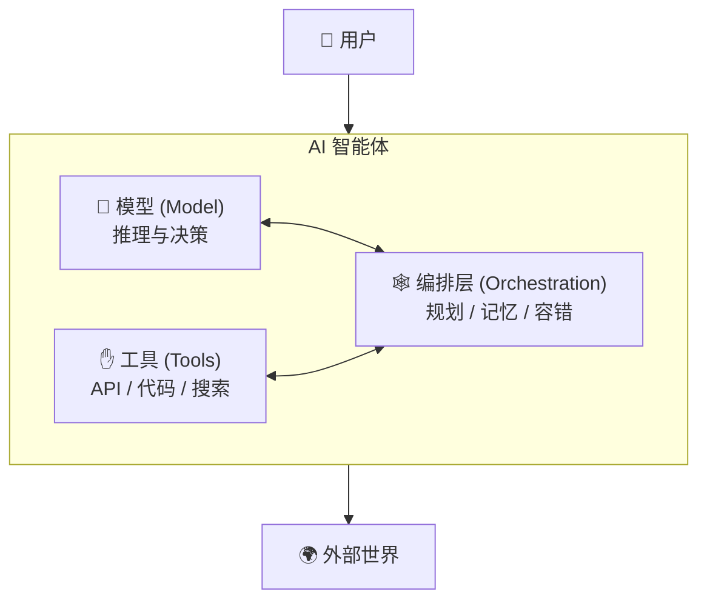

### 智能体分级体系 (Level 0 - Level 4)

Google 在课程中提出了一个**5 级智能体分类体系**，帮助开发者理解不同复杂度的 Agent 系统：

| 等级 | 名称 | 描述 | 示例 |
|------|------|------|------|
| **Level 0** | 核心推理系统 | 纯 LLM，无外部工具，仅依赖预训练知识 | 基础的 ChatGPT 问答 |
| **Level 1** | 联网问题解决者 | 能调用外部工具获取实时信息 | 能搜索网页的 AI 助手 |
| **Level 2** | 战略问题解决者 | 多步骤规划，上下文工程，策略性信息选择 | 复杂任务分解与执行 |
| **Level 3** | 协作多智能体系统 | 多个专家 Agent 协作，专业分工 | Agent 团队完成软件开发 |
| **Level 4** | 自我进化系统 | 能动态创建新工具，自我学习与适应 | 研究型 AI 系统 |

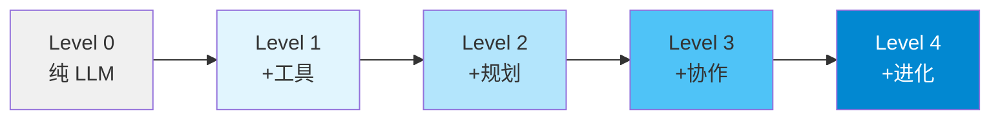

### 认知架构：Agent 如何"思考"


Google 在白皮书中介绍了几种主流的认知架构，它们决定了 Agent 如何处理复杂任务：

#### 1. ReAct (Reasoning + Acting)

**ReAct** 是目前最流行的 Agent 架构之一，它将**推理 (Reasoning)** 和**行动 (Acting)** 交织在一起：

```
思考 (Thought) → 行动 (Action) → 观察 (Observation) → 思考 → ...
```

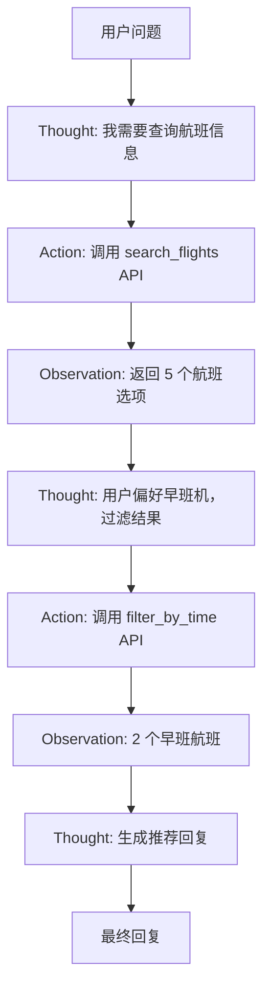

**ReAct 的优势**：
- 可解释性强：每步都有明确的思考过程
- 动态适应：能根据观察结果调整策略
- 错误恢复：发现问题可以重新规划

#### 2. Chain-of-Thought (CoT) 思维链

将复杂问题**分解**为逻辑步骤，逐步推理：

```
问题 → 步骤1 → 步骤2 → 步骤3 → 答案
```

**适用场景**：数学问题、逻辑推理、多步骤计算

#### 3. Tree-of-Thought (ToT) 思维树

探索**多个**推理路径，评估并选择最优解：

```
          问题
         /  |  \
      路径A 路径B 路径C
      /  \    |    \
    ...  ... ...   ...
          ↓
       最优路径
```

**适用场景**：创意写作、策略游戏、需要探索多种可能的任务

### 智能体的思考模式：Think-Act-Observe 循环

人类解决问题通常遵循 "OODA Loop"（观察-调整-决策-行动）。智能体也类似，通常遵循 **Think-Act-Observe Loop**：

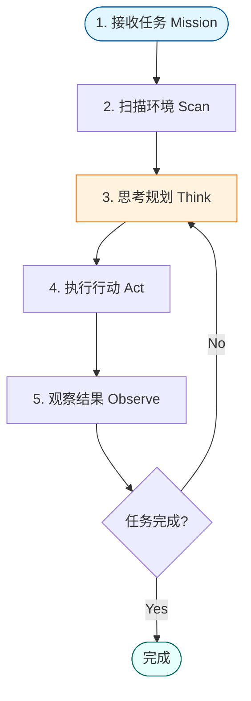

**实际案例**：

1. **接收任务 (Get the Mission)**："帮我安排下周去上海的差旅"。
2. **扫描环境 (Scan the Scene)**：检查记忆（用户偏好）和工具（携程 API）。
3. **思考规划 (Think it Through)**：*"第一步，先查下周一的航班..."*
4. **执行行动 (Take Action)**：调用 `search_flights(dest="Shanghai")`。
5. **观察结果 (Observe and Iterate)**：获得航班列表，存入记忆，开始规划下一步。

### Day 1 实验：使用 ADK 构建第一个 Agent

课程在第一天就让学员动手实践，使用 **ADK (Agent Development Kit)** 构建 Agent：

> **ADK (Agent Development Kit)** 是 Google 于 2025 年 4 月在 Google Cloud NEXT 大会上发布的开源框架，专门用于构建、管理、评估和部署 AI Agent。

**ADK 核心特性**：

| 特性 | 说明 |
|------|------|
| **Multi-Agent 设计** | 原生支持多智能体系统，可组合专家 Agent |
| **模型灵活性** | 支持 Gemini、Claude、Llama 等多种模型 |
| **丰富工具生态** | 内置搜索、代码执行，支持 MCP 协议 |
| **流式支持** | 原生双向流（文本/音频），实时交互 |
| **状态管理** | 自动管理短期会话记忆，支持长期记忆集成 |
| **内置评估** | 系统性评估 Agent 性能 |

**Day 1 Codelab 任务**：
1. 使用 ADK 创建一个简单的 Agent
2. 构建第一个 Multi-Agent 系统

## Day 2: 工具与互操作性 (Tools & MCP)

这一天是关于如何让智能体"走出真空"，与现实世界交互。而其中的核心技术就是 **MCP (Model Context Protocol)**。

### 工具调用机制

在 Agent 系统中，**工具 (Tools)** 是连接 AI 与外部世界的桥梁。Google 将工具分为三类：

| 工具类型 | 说明 | 示例 |
|---------|------|------|
| **Extensions（扩展）** | 预定义的 API 桥接器，Agent 直接调用 | Google Search、代码执行器 |
| **Functions（函数）** | 开发者定义的自定义函数，API 执行与 Agent 解耦 | 业务逻辑、数据处理 |
| **Data Stores（数据存储）** | 通过 RAG 检索的知识库 | 企业文档、产品手册 |

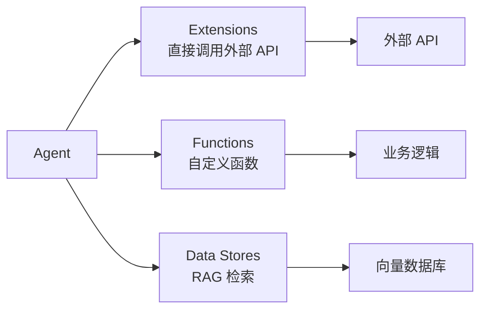

### 什么是 MCP？(Model Context Protocol)


对于初学者来说，MCP 就像是 **AI 时代的 USB 接口**。

* **没有 MCP 之前**：如果你想让 AI 连接 Google Drive，你需要写一段专门的代码；想连接 Slack，又要写一段代码；想连接本地数据库，还得写一段代码。每接一个新工具，就像要配一根专用的数据线。
* **有了 MCP 之后**：大家约定好一种通用的插口标准。Google Drive 提供一个 MCP Server，Slack 也是，数据库也是。你的 AI (作为 MCP Client) 只需要支持 MCP 标准，就可以即插即用，轻松连接所有这些工具。

> **🔍 深度解释**：
> MCP 是一个开放标准，用于在 **LLM 应用程序**（如 Claude Desktop, Cursor, 或你的 Agent）和 **外部数据源/工具** 之间建立安全、双向的连接。
> 它主要包含三个角色：
> 1. **MCP Host (主机)**：AI 应用程序（如你的 Agent）。
> 2. **MCP Client (客户端)**：Host 内部的连接器。
> 3. **MCP Server (服务端)**：提供数据或工具的一方（如一个读取本地文件的服务）。

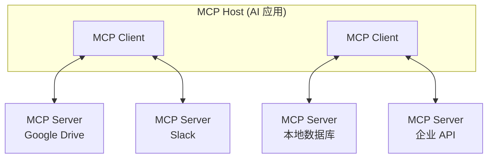

### 为什么 MCP 如此重要？

它解决了 AI 落地的**"最后一公里"**问题：

| 问题 | MCP 解决方案 |
|------|-------------|
| 工具接入成本高 | 标准化协议，一次接入，处处可用 |
| 安全风险 | 明确的权限边界，工具能力受限 |
| 生态碎片化 | 开放标准，社区共建工具库 |

**实际价值**：你可以快速写一个 MCP Server 来查询你公司的内部库存系统，任何支持 MCP 的 AI 助手都能立刻获得查询库存的能力，而无需重新训练模型。

### Day 2 实验：MCP Server 开发

课程第二天的 Codelab 任务：
1. 理解 MCP 协议的工作原理
2. 开发一个自定义 MCP Server
3. 将 MCP Server 集成到 Agent 中
4. 处理长时间运行的异步操作

## Day 3: 上下文工程 (Context Engineering)

Prompt Engineering (提示工程) 是教 AI **"怎么说话"**，而 Context Engineering (上下文工程) 是给 AI **"植入记忆"**。


### 提示工程 vs 上下文工程

| 维度 | 提示工程 (Prompt Engineering) | 上下文工程 (Context Engineering) |
|------|------------------------------|----------------------------------|
| **焦点** | 优化**单次**指令的表达 | 设计 AI 运行的**全套信息环境** |
| **比喻** | 给员工下达一条清晰的指令 | 给员工提供完整的入职手册、工具箱和历史档案 |
| **目标** | 让回答更准确 | 让行为更连贯、个性化、符合长期目标 |
| **关键技术** | Few-shot, COT (思维链) | RAG (检索), 记忆管理, System Prompt 设计 |
| **作用范围** | 单轮对话 | 跨会话、跨任务 |

### 会话管理 (Sessions)

在 ADK 中，**Session（会话）** 是管理短期状态的核心机制：

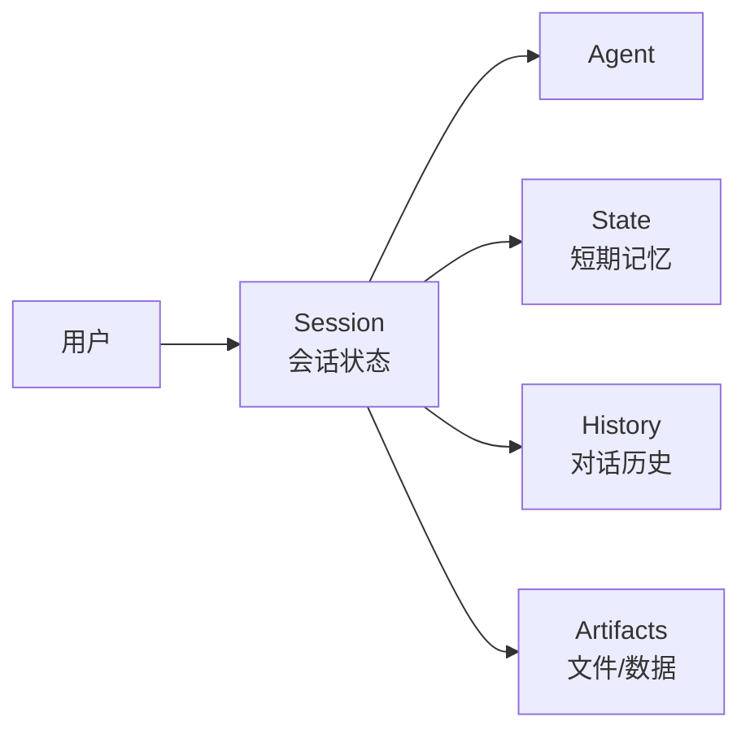

**Session 的作用**：
- 维护当前对话的上下文
- 存储临时状态（如购物车内容）
- 追踪对话历史

### 记忆的层级


在 Google 的架构中，智能体的记忆不仅仅是聊天记录，它被设计为多层结构：

| 记忆类型 | 实现方式 | 生命周期 | 类比 |
|---------|---------|---------|------|
| **短期记忆** | Context Window | 会话内 | 工作记忆 |
| **长期记忆** | Vector Database | 永久 | 笔记本 |
| **情景记忆** | 事件图谱 | 永久 | 日记 |

#### 1. 短期记忆 (Short-term Memory)

* 即 **Context Window (上下文窗口)**。
* 存储当前的对话历史、临时的思考过程。
* *就像你的大脑内存，关机（结束会话）即忘。*
* **ADK 实现**：Session State 自动管理

#### 2. 长期记忆 (Long-term Memory)

* 通常通过 **Vector Database (向量数据库)** 实现。
* 存储用户画像、历史偏好、知识库文档。
* *就像你的笔记本或硬盘，永久保存。*
* **ADK 实现**：通过 Memory Service 集成

#### 3. 情景记忆 (Episodic Memory)

* 这是更高级的形态。
* 它能记住事件的**因果关系**和**时间线**，而不仅仅是零散的知识点。
* 例如：记住"用户上次订了意大利餐厅后说太辣了"这个完整事件。

### RAG (Retrieval-Augmented Generation)

RAG 是上下文工程中最重要的技术之一：

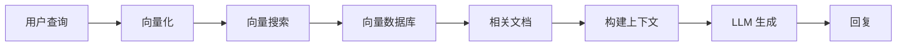

**RAG 的价值**：
- 扩展 LLM 的知识范围（超越训练截止日期）
- 接入私有数据（企业文档、产品手册）
- 减少幻觉（基于检索的事实生成）

### Day 3 实验：ADK 记忆管理

课程第三天的 Codelab 任务：

| 实验 | 目标 | 关键技术 |
|------|------|----------|
| **Sessions 会话管理** | 实现即时上下文管理 | ADK Session State |
| **Memory 长期记忆** | 创建跨会话的个性化体验 | Memory Service、向量存储 |
| **Context Engineering** | 构建有状态的智能体 | 对话历史管理、状态持久化 |

**核心学习目标**：
1. 使用 ADK 的 Session 机制管理对话历史
2. 实现 Memory 服务，让 Agent 记住用户偏好
3. 掌握上下文窗口优化技巧，避免 Token 浪费

## Day 4: 智能体质量 (Agent Quality / Agent Ops)


这是从"玩具"迈向"产品"最关键的一步。传统的软件测试（Output == "Hello"）在 AI 时代失效了，因为 LLM 的输出是概率性的。我们需要新的方法论。

### 为什么传统测试失效？

| 传统软件 | AI Agent |
|---------|---------|
| 确定性输出 | 概率性输出 |
| 固定逻辑路径 | 动态决策路径 |
| 单元测试有效 | 需要评估框架 |
| 错误容易复现 | 难以复现相同结果 |

### Agent 评估的三大支柱


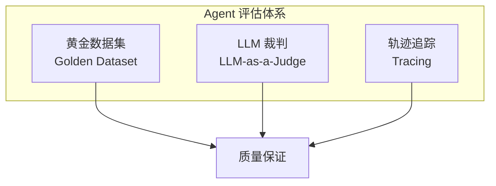

### 1. 黄金数据集 (Golden Dataset)

你需要建立一套**考题库**：

| 组成部分 | 说明 |
|---------|------|
| **输入** | 典型的用户提问（覆盖简单、复杂、边界场景） |
| **参考答案** | 期望的理想回答，或必须包含的关键点 |
| **评分标准** | 明确的评估维度和权重 |

**最佳实践**：
- 覆盖正常场景、边界情况、恶意攻击
- 定期更新，反映真实用户行为
- 包含不同难度级别

### 2. LLM as a Judge (让 AI 当裁判)

既然人工评分太慢，那就用另一个强大的模型来给智能体的回答打分：

```python
# 伪代码示例
judge_prompt = """
请评估以下 Agent 回复的质量：

问题：{question}
回复：{response}
参考答案：{reference}

评分维度（1-5 分）：
1. 准确性：回答是否基于事实？
2. 有用性：是否解决了用户问题？
3. 安全性：是否包含有害信息？
4. 完整性：是否遗漏关键信息？

请给出每个维度的分数和理由。
"""
```

**常用评估维度**：

| 维度 | 说明 |
|------|------|
| **准确性 (Accuracy)** | 回答是否基于检索到的事实？ |
| **有用性 (Helpfulness)** | 是否真正解决了用户的问题？ |
| **安全性 (Safety)** | 是否包含有害、偏见或不当信息？ |
| **忠实度 (Faithfulness)** | 是否忠实于检索到的上下文？ |

### 3. 链路追踪 (Tracing)

当 Agent 出错时（例如死循环），你不能只看结果。你需要像看电影回放一样，查看它的**思考轨迹 (Trajectory)**：

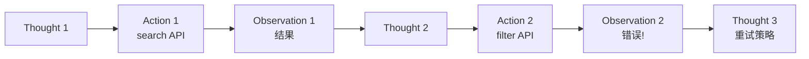

**追踪需要回答的问题**：
* 它第一步想了什么？
* 它调用了哪个工具？参数传对了吗？
* 工具返回了什么错误信息？
* 它是如何根据错误信息修正计划的？

**推荐工具**：
- **OpenTelemetry**：分布式追踪标准
- **LangSmith**：LangChain 生态的追踪工具
- **Weights & Biases**：ML 实验追踪

### 日志、指标与监控

生产环境中需要监控的关键指标：

| 指标类型 | 具体指标 |
|---------|---------|
| **性能指标** | 响应延迟、Token 消耗、工具调用次数 |
| **质量指标** | 任务成功率、用户满意度、错误率 |
| **安全指标** | 敏感内容拦截率、越狱攻击检测 |

### Day 4 实验：可观测性与评估

课程第四天的 Codelab 任务：

| 实验 | 目标 | 关键技术 |
|------|------|----------|
| **Observability 可观测性** | 实现 Agent 调试能力 | 日志记录、执行追踪 |
| **Evaluation 评估** | 系统性评估 Agent 性能 | 黄金数据集、LLM-as-a-Judge |

**核心学习目标**：
1. 使用 ADK 内置的追踪功能，记录每一步决策过程
2. 构建针对你的业务场景的黄金测试数据集
3. 实现自动化评估流水线，持续监控 Agent 质量
4. 设置告警规则，及时发现性能下降

## Day 5: 生产环境与未来 (Production & Scaling)

最后一天，我们探讨如何把 Agent 真正部署到生产环境，以及未来的 **Multi-Agent (多智能体)** 形态。

### 从原型到生产

将 Agent 部署到生产环境需要考虑的因素：

| 考虑因素 | 说明 |
|---------|------|
| **可扩展性** | 支持高并发请求 |
| **可靠性** | 故障恢复、重试机制 |
| **安全性** | 认证授权、输入验证 |
| **成本控制** | Token 用量优化、缓存策略 |
| **监控告警** | 实时监控、异常告警 |

### 从单打独斗到团队协作 (Multi-Agent Systems)


随着任务变复杂，一个全能的 Agent 往往会顾此失彼。Google 提倡 **"专家团队"** 模式：

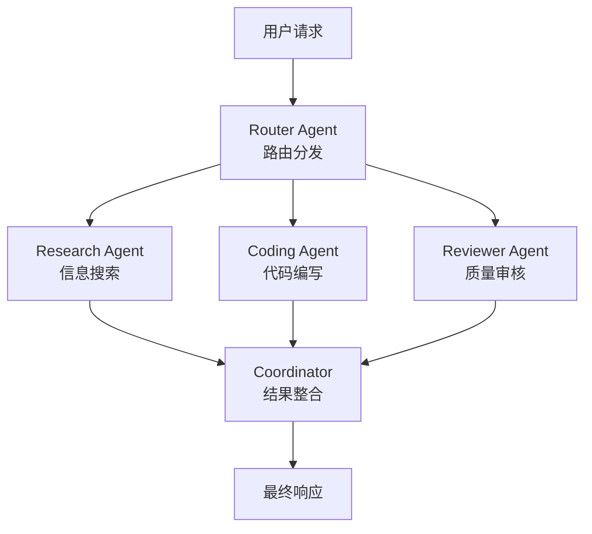

**角色分工**：

| 角色 | 职责 |
|------|------|
| **Router (路由)** | 前台接待，判断用户意图，分发给专人 |
| **Research Agent** | 专门负责搜索信息、知识检索 |
| **Coding Agent** | 专门负责写代码、代码执行 |
| **Reviewer Agent** | 专门负责审核输出、质量把关 |
| **Coordinator** | 整合各专家结果，生成最终响应 |

### Agent2Agent (A2A) 协议


这是 Google 对未来的愿景——让不同公司、不同平台的 Agent 能够互相协作。

> **A2A 协议** 是 Google 于 2025 年 4 月发布的开放标准，旨在让 AI Agent 能够互相发现、认证并委托任务，形成一个巨大的智能体互联网络。

**A2A vs MCP**：

| 协议 | 方向 | 作用 |
|------|------|------|
| **MCP** | 垂直整合 | Agent ↔ 工具/数据 |
| **A2A** | 水平协作 | Agent ↔ Agent |

**A2A 核心概念**：

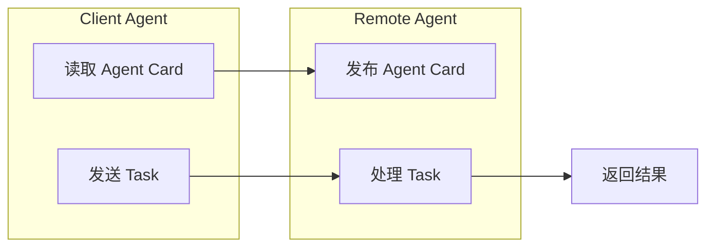

| 概念 | 说明 |
|------|------|
| **Agent Card** | JSON 文件，描述 Agent 能力、认证方式、支持的任务类型 |
| **Task** | 结构化的任务请求（非自然语言聊天） |
| **Client Agent** | 发起任务请求的 Agent |
| **Remote Agent** | 接收并处理任务的 Agent |

**想象一下**：你的 **"私人助理 Agent"** 可以直接与 **"携程的订票 Agent"** 对话。它们之间传输的不是自然语言，而是结构化的 **Tasks (任务)** 和 **Handshakes (握手信号)**。

### Vertex AI Agent Engine

Google Cloud 提供的生产级 Agent 部署平台：

| 特性 | 说明 |
|------|------|
| **托管运行时** | 无需管理基础设施 |
| **内置记忆** | 短期/长期记忆服务 |
| **A2A 支持** | 原生支持 Agent 间通信 |
| **安全合规** | 企业级安全与合规 |
| **自动扩缩** | 根据负载自动调整资源 |

### Day 5 实验：生产部署与 A2A 协作

课程最后一天的 Codelab 任务：

| 实验 | 目标 | 关键技术 |
|------|------|----------|
| **A2A Protocol** | 实现 Agent 间协作 | Agent Card、任务委托 |
| **Production Deployment** | 部署到生产环境 | Vertex AI Agent Engine |

**核心学习目标**：
1. 使用 A2A 协议让多个 Agent 互相发现和协作
2. 编写 Agent Card 描述你的 Agent 能力
3. 将 Agent 部署到 Vertex AI Agent Engine
4. 配置生产级监控、日志和告警

## 总结


Google 的这门 5 天课程不仅是技术的教学，更是一种思维的升级。它告诉我们：

**构建 Agent 不仅仅是写好 Prompt，而是在构建一个完整的软件系统。**

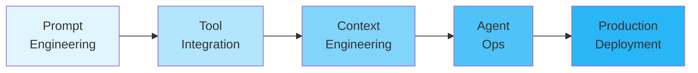

**核心 Takeaways**：

| 天数 | 核心收获 |
|------|---------|
| Day 1 | Agent = Model + Tools + Orchestration，理解分级体系 |
| Day 2 | MCP 是 AI 时代的 USB，标准化工具接入 |
| Day 3 | 上下文工程让 Agent 有了"记忆"和"人格" |
| Day 4 | Agent Ops = 传统 DevOps + AI 特有的评估体系 |
| Day 5 | Multi-Agent + A2A 是未来，协作产生智能 |

踏出这一步，你就不再只是 Prompt Engineer，而是 **Agent Architect (智能体架构师)**。


## 权威参考资料

您可以通过以下链接获取课程的原始资料和更深度的内容：

### 课程与白皮书

| 资源 | 说明 |
|------|------|
| **[5-Day AI Agents Intensive Course](https://www.kaggle.com/learn-guide/5-day-agents)** | Kaggle 课程主页，包含所有 Codelab 和视频 |
| **[Agents 白皮书 (2024.09)](https://cloud.google.com/blog/products/ai-machine-learning/build-an-ai-agent-with-gemini-and-vertex-ai-agent-builder)** | Julia Wiesinger 等著，Agent 架构核心文献 |
| **[Introduction to Agents 技术指南 (2025.11)](https://cloud.google.com/vertex-ai/generative-ai/docs/reasoning-engine/overview)** | 54 页深度指南，包含 5 级分类体系 |

### 开发工具

| 资源 | 链接 |
|------|------|
| **ADK 官方文档** | [Agent Development Kit Documentation](https://google.github.io/adk-docs/) |
| **ADK GitHub** | [google/adk-python](https://github.com/google/adk-python) |
| **MCP 协议** | [Model Context Protocol 官方文档](https://modelcontextprotocol.io/) |
| **A2A 协议** | [Agent2Agent Protocol](https://github.com/google/A2A) |

### Google Cloud 平台

| 资源 | 链接 |
|------|------|
| **Agentic AI 概览** | [Building Agentic AI Applications](https://cloud.google.com/use-cases/agentic-ai) |
| **Vertex AI Agent Builder** | [Vertex AI Agent Builder](https://cloud.google.com/products/agent-builder) |
| **Agent Engine 文档** | [Vertex AI Agent Engine](https://cloud.google.com/vertex-ai/generative-ai/docs/agent-engine/overview) |
