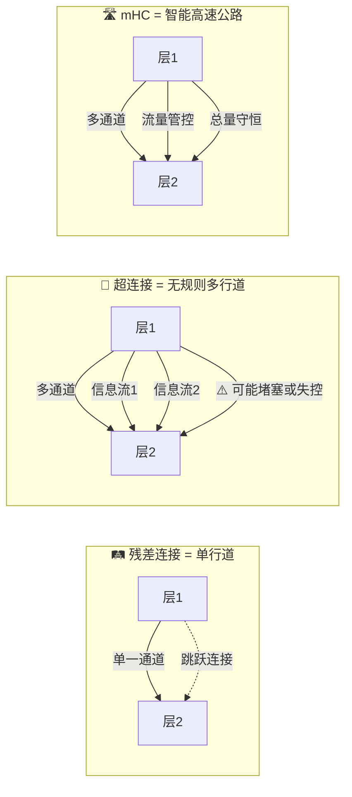
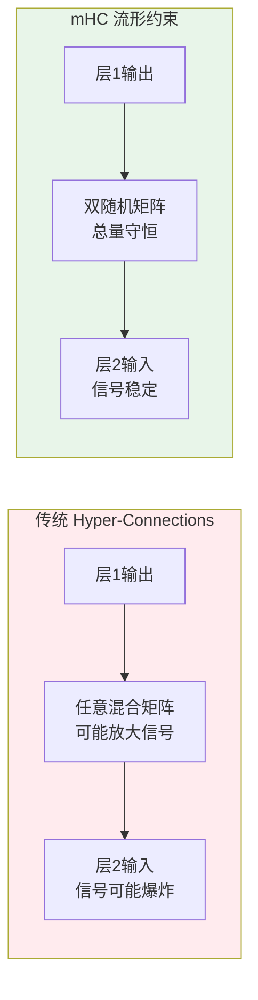
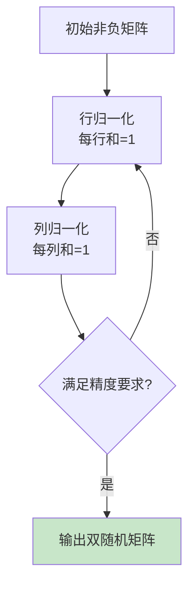
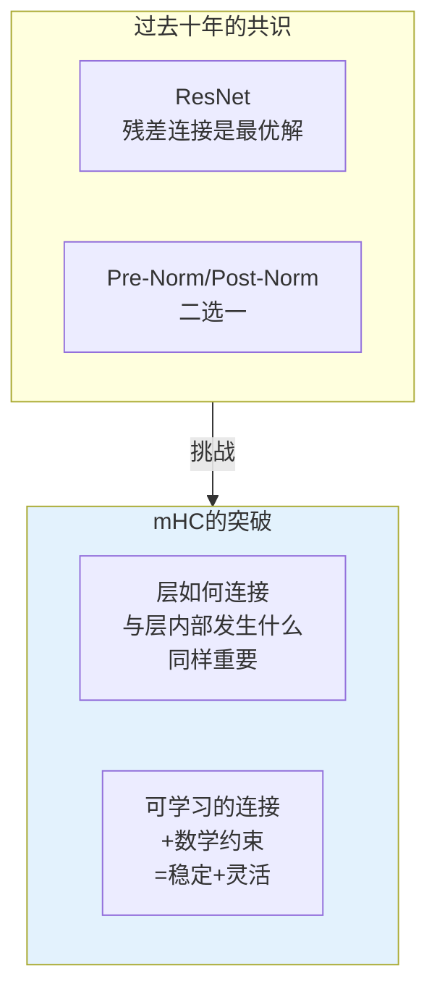

> 2026年新年第一天，DeepSeek悄然发布了一篇可能改变AI行业训练范式的论文——**mHC（Manifold-Constrained Hyper-Connections）**。这项被业界称为"惊人突破"的技术，通过优雅的数学约束解决了困扰大模型训练多年的稳定性难题。
>
> 📌 **核心论文**：[mHC: Manifold-Constrained Hyper-Connections](https://arxiv.org/abs/2512.24880)（arXiv:2512.24880）  
> 📌 **适合人群**：AI研究者、深度学习工程师、对大模型架构感兴趣的技术人员


<MindMapFloat title="mHC知识图谱">

```mindmap-data
# mHC 流形约束超连接
## 核心问题
- 深层网络训练不稳定
- 梯度爆炸/消失
- 规模化受限
## 技术方案
- 双随机矩阵约束
- Sinkhorn-Knopp算法
- 恒等映射恢复
## 关键优势
- 稳定性提升1875倍
- 仅6-7%额外开销
- 支持百亿参数规模
## 行业影响
- 挑战ResNet范式
- 指引架构演进
- 开源研究策略
```

</MindMapFloat>

## 1. 为什么mHC被吹捧到了天上？

要理解mHC为何引发行业震动，首先需要了解它解决了什么问题。

### 1.1 深层网络的"原罪"：训练不稳定


想象一下：你正在训练一个拥有**数百层**的神经网络。每一层都在对输入数据进行变换，而信息就像水流一样从第一层流向最后一层。问题是——随着层数增加，这股"水流"可能会：

- **越来越弱**（梯度消失）：信息传到后面几乎为零
- **越来越猛**（梯度爆炸）：数值飙升到计算机无法表示

这就是为什么2015年的ResNet提出了**残差连接（Residual Connections）**——让信息可以"抄近路"，直接从浅层跳到深层。这个简单的想法让训练上百层的网络成为可能。

### 1.2 残差连接的局限性


然而，经典残差连接并不完美。它存在两个主要变体：

| 变体 | 公式 | 优点 | 缺点 |
|------|------|------|------|
| **Post-Norm** | y = Norm(x + F(x)) | 训练稳定 | 仍有梯度消失风险 |
| **Pre-Norm** | y = x + F(Norm(x)) | 梯度流畅 | 导致"表征坍缩"—深层特征趋同 |

这就引出了**超连接（Hyper-Connections, HC）**的概念：不再是简单的"加法"，而是让网络**学习**如何混合各层的信息。听起来很美好，但问题来了——

### 1.3 一个形象的比喻：单行道 vs 多行道


理解残差连接、超连接和mHC的区别，可以用**道路系统**来类比：



| 架构 | 道路比喻 | 特点 |
|------|----------|------|
| **残差连接** | 🛤️ 单行道 | 简单可靠，但信息流动方式固定 |
| **超连接（HC）** | 🚗 无规则多行道 | 灵活但混乱——车辆（信号）可能越来越多，最终堵塞或失控 |
| **mHC** | 🛣️ 智能高速公路 | 多车道 + 流量管控——总车流量守恒，不会堵塞也不会失控 |

> [!NOTE]
> **mHC的核心洞察**：问题不在于"多行道"本身，而在于缺乏**交通规则**。双随机矩阵约束就像为多行道加上了"总流量守恒"的规则——无论车辆如何变道，总量不变，系统就不会失控。

### 1.4 超连接的致命缺陷


当研究者尝试将HC应用于大规模模型时，发现了一个惊人的现象：

> **信号放大高达3000倍！**

在一个深度网络中，如果每层的残差系数略大于1（比如1.01），经过几百层后：
- 1.01^300 ≈ **19.7**
- 1.05^300 ≈ **2,273,996**

这就导致了训练过程中的**损失尖峰**和**梯度爆炸**，使得HC在大规模模型上几乎无法使用。

## 2. mHC的核心创新：用数学"驯服"混乱


DeepSeek的解决方案优雅而强大：**将残差混合矩阵约束在一个特定的数学流形上**。

### 2.1 双随机矩阵：mHC的数学基石


mHC的核心约束是要求残差混合矩阵成为**双随机矩阵（Doubly Stochastic Matrix）**：

| 特性 | 说明 | 直观理解 |
|------|------|----------|
| **非负性** | 所有元素 ≥ 0 | 只有"混合"，没有"抵消" |
| **行和为1** | 每行元素之和 = 1 | 输出是输入的加权平均 |
| **列和为1** | 每列元素之和 = 1 | 总信息量守恒 |



> [!IMPORTANT]
> **关键洞察**：双随机矩阵本质上是在做"加权平均"。既然是平均，输出就不可能比最大的输入还大——从数学上彻底杜绝了信号爆炸的可能。

### 2.2 Sinkhorn-Knopp算法：如何实现约束


将任意矩阵变成双随机矩阵，DeepSeek采用了1967年提出的经典算法：**Sinkhorn-Knopp迭代**。

算法原理非常简单：

```python
def sinkhorn_knopp(matrix, iterations=20):
    """将非负矩阵转换为双随机矩阵
    
    论文中使用20次迭代，在精度和计算成本间取得平衡
    """
    A = matrix.clone()
    for _ in range(iterations):
        # 步骤1：行归一化（使每行和为1）
        A = A / A.sum(dim=1, keepdim=True)
        # 步骤2：列归一化（使每列和为1）  
        A = A / A.sum(dim=0, keepdim=True)
    return A
```



### 2.3 额外的稳定性约束

除了双随机矩阵，mHC还引入了两个辅助约束：

1. **单位增益约束（Unit Gain）**：确保信号方差保持稳定
   - 数学表达：Σ(α²) = 1
   
2. **恒等漂移控制（Identity Drift）**：初始化时让主对角线系数占主导
   - 效果：网络初期行为类似传统残差连接
   - 随着训练进行，逐步学习更复杂的混合模式

## 3. 实验结果：数据说话

DeepSeek在3B、9B、27B三个规模的模型上验证了mHC的效果：

### 3.1 稳定性对比


| 指标 | 传统HC | mHC | 改善幅度 |
|------|--------|-----|----------|
| 最大信号增益 | ~3000x | ~1.6x | **1875倍** |
| 训练损失曲线 | 剧烈波动 | 平滑稳定 | - |
| 梯度范数 | 频繁尖峰 | 恒定稳定 | - |

### 3.2 性能提升


在27B参数模型上的基准测试结果：

| 基准测试 | 基线模型 | mHC模型 | 提升 |
|----------|----------|---------|------|
| BBH | - | - | **+2.1%** |
| MMLU | - | - | **+4.4%** |
| DROP | - | - | **+4.6%** |
| 训练损失 | baseline | -0.021 | - |

### 3.3 计算开销


> [!TIP]
> **惊喜低开销**：尽管引入了复杂的数学约束和迭代算法，mHC的额外训练开销仅为**6-7%**（扩展率n=4时约6.7%）。

DeepSeek通过以下工程优化实现了这一目标：
- 定制化CUDA内核（Custom Kernels）
- 激活重计算（Activation Recomputation）
- 专用流水线并行（Pipeline Parallelism）
- 优化的内存访问模式

## 4. 为什么被称为"惊人突破"？

### 4.1 架构层面的根本创新


mHC的贡献不在于：
- ❌ 新的注意力机制
- ❌ 新的数据集
- ❌ 新的训练技巧

而是对神经网络**最基础的组件——残差连接**的根本性重新思考。



### 4.2 行业评价


| 来源 | 评价 |
|------|------|
| 行业分析师 | "**惊人的突破**——可能从根本上改变AI模型的训练和扩展方式" |
| 香港科技大学 | "这些发现对为LLM设计的Transformer架构**非常重要**" |
| 技术媒体 | "**直指终结ResNet时代**——预示底层架构的新变革" |
| 北京智源研究院 | DeepSeek展现了对同行"**温和的降维打击**" |

### 4.3 战略意义


DeepSeek创始人**梁文锋**亲自署名这篇论文，这在公司技术论文中极为罕见，凸显了mHC的战略重要性：

1. **开放研究策略**：将核心技术公开，展现中国AI公司的开放与自信
2. **技术领先宣言**：证明不依赖大规模计算资源也能构建强大AI模型
3. **未来模型基础**：mHC被认为将成为DeepSeek V4/R2等未来模型的核心架构

> [!CAUTION]
> **常见误解**：mHC并非简单的"小改进"，而是对深度学习十年来关于残差连接"绝对真理"的直接挑战。

## 5. 技术细节深入

### 5.1 数学定义

对于一个具有n个隐藏流的超连接层，残差混合可以表示为：

```
输出 = Σ(α_ij × 隐藏状态_j)  对于 j = 0 到 l
```

mHC约束要求权重矩阵 **A = [α_ij]** 必须是双随机的：
- 对所有i：Σ_j α_ij = 1（行和）
- 对所有j：Σ_i α_ij = 1（列和）
- 对所有i,j：α_ij ≥ 0（非负性）

### 5.2 Birkhoff多面体

双随机矩阵的集合形成了一个凸多面体，称为**Birkhoff多面体**。根据Birkhoff-von Neumann定理：

> 任何双随机矩阵都可以表示为置换矩阵的凸组合

这意味着mHC的权重空间是有界且结构良好的，从根本上避免了参数爆炸。

### 5.3 与最优传输的联系

值得注意的是，Sinkhorn-Knopp算法也是**最优传输（Optimal Transport）**问题中计算熵正则化传输计划的核心工具。mHC借用了这一成熟的数学工具，展现了DeepSeek团队扎实的数学功底。

## 6. 最佳实践与展望

### 6.1 对从业者的启示

| 启示 | 说明 |
|------|------|
| **重视基础组件** | 看似"已解决"的老问题可能仍有改进空间 |
| **数学约束有效** | 通过几何约束而非启发式规则来保证稳定性 |
| **工程不可忽视** | 好的想法需要极致的工程优化才能实用 |

### 6.2 未来研究方向

1. **扩展到其他架构**：mHC目前主要在Transformer上验证，是否适用于CNN、GNN？
2. **理论分析深化**：双随机约束与网络表达能力的关系？
3. **硬件协同设计**：是否可以设计专门优化mHC的AI芯片？

> [!TIP]
> **给初学者的建议**：理解mHC的核心在于理解两点——(1) 为什么需要约束，(2) 双随机矩阵为什么能解决问题。抓住这两点，论文的其他细节就容易理解了。

## 7. 总结


mHC的本质是用**优雅的数学约束**解决了一个**工程难题**——如何让信息在极深的网络中既自由流动，又不失控。

| 概念 | 一句话解释 |
|------|-----------|
| **残差连接** | 让信息"抄近路"，解决梯度消失 |
| **超连接（HC）** | 让网络"学习"如何混合信息，更灵活但不稳定 |
| **双随机矩阵** | 一种特殊矩阵，保证"总量守恒"，防止信号爆炸 |
| **mHC** | 用双随机矩阵约束超连接，兼得灵活性和稳定性 |
| **Sinkhorn-Knopp** | 将任意矩阵变成双随机矩阵的经典算法 |

DeepSeek用这篇论文证明了：**在AI领域，最深刻的创新往往来自对基础问题的重新思考**。

## 8. 参考资料

| 资料 | 作者/机构 | 说明 |
|------|-----------|------|
| [mHC: Manifold-Constrained Hyper-Connections](https://arxiv.org/abs/2512.24880) | DeepSeek | mHC原始论文，19位作者包括创始人梁文锋 |
| [Deep Residual Learning for Image Recognition](https://arxiv.org/abs/1512.03385) | He et al. | ResNet原始论文，残差连接的里程碑 |
| [Sinkhorn Distances: Lightspeed Computation of Optimal Transport](https://arxiv.org/abs/1306.0895) | Cuturi | Sinkhorn在最优传输中的应用 |
| [Hyper-Connections](https://arxiv.org/abs/2409.19606) | ByteDance | 超连接原始论文（ICLR 2025），DeepSeek mHC基于此改进 |
