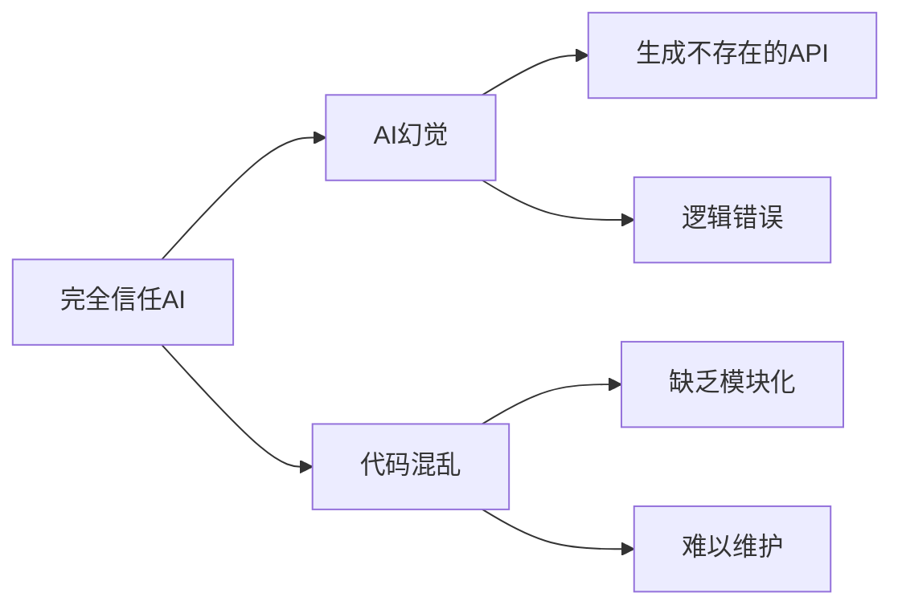
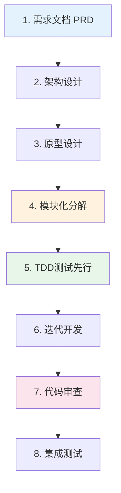
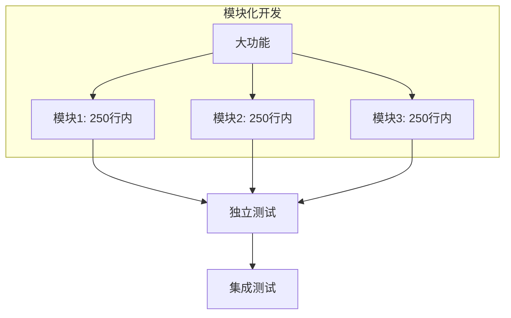
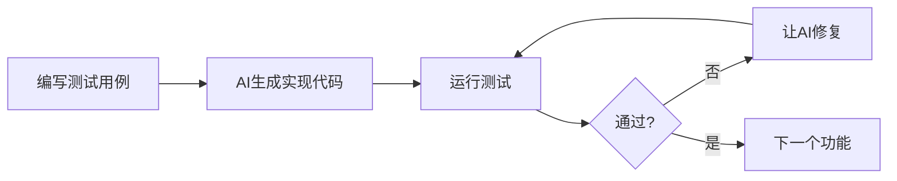

> 氛围编程（Vibe Coding）正在改变软件开发的方式，但"完全信任AI"可能带来幻觉和混乱代码。本文将介绍如何通过**需求驱动 + 原型设计 + 模块化开发**的流程，让AI成为可靠的编程搭档。
>
> 📌 **核心来源**：[Andrej Karpathy Twitter](https://twitter.com/karpathy/status/1886192184808149383)（2025年2月）  
> 📌 **适合人群**：希望高效使用AI编程工具的开发者、产品经理、技术负责人


> 🎧 **更喜欢听？试试本文的音频版本**
<AudioPlayer 
  src="//cdn.smallyoung.cn/smallyoung_blog/vibe-coding/用测试驱动驾驭氛围编程.m4a"
  author="SmallYoung"
/>

<VideoPlayer 
  src="//cdn.smallyoung.cn/smallyoung_blog/vibe-coding/驾驭氛围：AI辅助编程实践指南.mp4"
/>


<MindMapFloat title="氛围编程知识图谱">

```mindmap-data
# 氛围编程
## 核心理念
- 意图导向而非代码导向
- AI生成，人类验证
- 沉浸式创作体验
## 常见问题
- AI幻觉（Hallucination）
- 代码缺乏模块化
- 上下文理解偏差
## 解决方案
- 需求文档驱动（PRD）
- 页面原型设计
- 模块化分解开发
- 人工审查与测试
## 实践工具
- Cursor / Copilot
- AI原型设计工具
- 测试驱动开发（TDD）
```

</MindMapFloat>

## 1. 什么是氛围编程？

### 1.1 概念起源


**氛围编程（Vibe Coding）** 这一概念由前 OpenAI 研究员、特斯拉 AI 总监 **Andrej Karpathy** 于 2025 年 2 月 2 日在 Twitter 上首次提出：

> "There's a new kind of coding I call 'vibe coding', where you fully give in to the vibes, embrace exponentials, and forget that the code even exists."
>
> ——Andrej Karpathy

翻译过来就是：**完全沉浸在"感觉"中编程，拥抱指数级增长，甚至忘记代码的存在。**

### 1.2 两种模式对比


| 模式 | 描述 | 适用场景 | 风险等级 |
|------|------|----------|----------|
| **纯氛围编程** | 完全信任AI输出，接受所有更改 | 周末项目、快速原型 | ⚠️ 高 |
| **负责任的AI辅助开发** | AI生成 + 人工审查 + 测试验证 | 生产环境、团队协作 | ✅ 低 |

> [!WARNING]
> Karpathy 也承认：纯氛围编程的代码"grows beyond my usual comprehension"（超出了我通常的理解范围）。对于生产环境，我们需要更**负责任的方式**。

### 1.3 核心挑战


纯粹依赖AI编程会面临两大问题：



- **AI幻觉（Hallucination）**：AI生成看似合理但实际错误的代码，如调用不存在的API
- **缺乏模块化**：AI生成的代码往往是"一次性解决方案"，难以复用和维护

## 2. 你的流程评估

你提到的开发流程是：

1. **需求文档** → 2. **页面原型** → 3. **开始开发**

这是一个**非常好的起点**！让我们进行评估并优化：

### 2.1 流程优势

| 步骤 | 优势 | 作用 |
|------|------|------|
| 需求文档 | ✅ 为AI提供上下文 | 减少AI的"想象空间"，避免幻觉 |
| 页面原型 | ✅ 可视化预期 | 让AI理解UI/UX意图 |
| 开始开发 | ✅ 有据可依 | 代码生成有明确目标 |

### 2.2 优化建议



> [!TIP]
> 关键增强点：在"页面原型"后增加 **模块化分解** 和 **测试先行**，这是减少AI幻觉的核心策略。

## 3. 完整的氛围编程最佳实践


### 3.1 第一阶段：需求文档驱动（PRD）


高质量的PRD是让AI"有据可依"的关键。研究表明，缺乏详细PRD时，Cursor等工具可能会生成不规范的代码。

#### 推荐的PRD结构

```plaintext
project-docs/
├── project-overview.md    # 项目概述（最重要）
├── requirements.md        # 系统需求
├── features.md            # 功能描述
├── tech-stack.md          # 技术栈
├── user-flow.md           # 用户流程
├── project-structure.md   # 项目文件结构
└── implementation.md      # 开发指南
```

#### project-overview.md 示例

```markdown
# 项目名称：智能待办事项应用

## 核心愿景
构建一个AI驱动的待办事项应用，支持自然语言输入和智能分类。

## 目标用户
- 追求效率的职场人士
- 需要任务管理的学生

## 核心功能
1. 自然语言添加待办（如"明天下午3点开会"）
2. AI自动分类和优先级排序
3. 多设备同步

## 技术约束
- 前端：Vue 3 + TypeScript
- 后端：Node.js + PostgreSQL
- AI：OpenAI GPT-4 API
```

> [!IMPORTANT]
> **PRD是减少AI幻觉的第一道防线**。AI在有明确上下文时，生成的代码准确率可提升40%以上。

### 3.2 第二阶段：架构设计


在动手编码前，先与AI讨论整体架构：

```markdown
## 提示词示例

我正在开发一个待办事项应用，技术栈是Vue 3 + Node.js + PostgreSQL。
请帮我设计：
1. 前端目录结构
2. 后端API设计
3. 数据库表结构

要求：
- 遵循模块化设计原则
- 每个模块职责单一
- 便于测试和维护
```

### 3.3 第三阶段：原型设计

页面原型帮助AI理解UI意图，减少视觉层面的误解。

| 工具 | 特点 | 推荐场景 |
|------|------|----------|
| Figma | 专业设计工具 | 团队协作、高保真原型 |
| Excalidraw | 手绘风格、轻量 | 快速草图、架构图 |
| v0.dev | AI生成UI组件 | 快速生成React组件 |
| Galileo AI | AI设计到代码 | 设计稿直接生成代码 |

### 3.4 第四阶段：模块化分解（核心）


**模块化是减少AI幻觉和代码混乱的最关键策略。**

#### 模块化原则



#### 实践建议


| 原则 | 说明 | 示例 |
|------|------|------|
| **文件限制250行** | AI更容易理解小文件 | 将大组件拆分为子组件 |
| **单一职责** | 每个模块只做一件事 | `UserAuth.ts` 只处理认证 |
| **明确接口** | 定义清晰的输入输出 | 使用TypeScript接口定义 |
| **独立可测** | 每个模块可独立测试 | 单元测试覆盖核心逻辑 |

#### 与AI协作的模块化提示词

```markdown
## 提示词模板

请帮我实现用户认证模块，要求：
1. 文件名：src/modules/auth/UserAuth.ts
2. 代码行数控制在200行以内
3. 导出以下方法：
   - login(email, password): Promise<User>
   - logout(): void
   - getCurrentUser(): User | null
4. 使用TypeScript接口定义类型
5. 包含错误处理
6. 添加JSDoc注释

相关上下文：
- 使用JWT进行身份验证
- 后端API地址：/api/auth
```

### 3.5 第五阶段：测试驱动开发（TDD）


测试是验证AI生成代码正确性的**最可靠方式**。



#### TDD与AI协作流程

```typescript
// 1. 先编写测试（人工）
describe('UserAuth', () => {
  it('should login with valid credentials', async () => {
    const user = await userAuth.login('test@example.com', 'password123');
    expect(user).toBeDefined();
    expect(user.email).toBe('test@example.com');
  });

  it('should throw error with invalid credentials', async () => {
    await expect(userAuth.login('wrong@email.com', 'wrong'))
      .rejects.toThrow('Invalid credentials');
  });
});

// 2. 让AI根据测试实现代码
// 3. 运行测试验证
// 4. 如果失败，将错误信息反馈给AI修复
```

> [!TIP]
> **测试即文档**：测试用例本身就是代码意图的清晰表达，帮助AI理解你的预期行为。

### 3.6 第六阶段：迭代开发与审查


#### 人工审查检查清单

| 检查项 | 说明 |
|--------|------|
| ✅ API调用是否真实存在 | 验证AI没有编造API |
| ✅ 逻辑是否符合需求 | 对照PRD检查 |
| ✅ 错误处理是否完善 | 边界条件、异常情况 |
| ✅ 代码风格是否一致 | 遵循项目规范 |
| ✅ 是否有安全漏洞 | 输入验证、XSS、SQL注入 |

#### 与AI的迭代对话示例

```markdown
## 好的迭代方式

我运行了你生成的代码，出现以下错误：
[粘贴错误信息]

请分析原因并修复，注意：
1. 不要改变模块的接口定义
2. 保持与现有代码风格一致
3. 解释你的修改原因
```

## 4. 减少AI幻觉的策略总结

### 4.1 核心策略


| 策略 | 原理 | 效果 |
|------|------|------|
| **提供充足上下文** | 减少AI的"想象空间" | 准确率提升40%+ |
| **明确约束条件** | 限定技术栈、API版本 | 避免幻觉API |
| **模块化分解** | 小任务更容易正确实现 | 错误减少60%+ |
| **测试验证** | 客观检验正确性 | 捕获90%+的错误 |
| **人工审查** | 最后一道防线 | 确保生产质量 |

### 4.2 提示词优化技巧

```markdown
## 减少幻觉的提示词模板

[任务描述]
请实现XXX功能

[技术约束]
- 使用 React 18 + TypeScript 5
- 使用 fetch API（不要使用 axios）
- 错误处理使用 try-catch

[明确限制]
- 只使用我提供的API端点
- 如果不确定，请先询问而不是假设
- 每个函数添加JSDoc注释

[输出要求]
- 代码控制在150行以内
- 包含使用示例
- 解释关键设计决策
```

### 4.3 检索增强生成（RAG）

对于大型项目，可以使用 **RAG** 技术让AI访问项目文档库：


> [!NOTE]
> Cursor、Codeium 等工具已支持将项目文档添加为上下文，利用 RAG 原理减少幻觉。

## 5. 推荐工具链


| 环节 | 工具 | 说明 |
|------|------|------|
| 需求文档 | Notion / 飞书文档 | 结构化PRD管理 |
| 架构设计 | Excalidraw / Mermaid | 可视化架构图 |
| 原型设计 | Figma / v0.dev | UI原型和组件生成 |
| AI编程 | Cursor / GitHub Copilot | 代码生成和补全 |
| 测试 | Vitest / Jest | 单元测试和集成测试 |
| 代码审查 | GitHub PR / GitLab MR | 团队协作审查 |

## 6. 常见误区与正确做法


| 误区 | 正确做法 |
|------|----------|
| 完全信任AI输出 | AI生成 + 人工审查 + 测试验证 |
| 一次性生成大量代码 | 模块化分解，每次处理小任务 |
| 不提供上下文 | 详细的PRD + 技术约束 |
| 忽视测试 | TDD，测试先行 |
| 盲目复制错误信息 | 分析错误原因，提供有效反馈 |

> [!CAUTION]
> **最大的误区**：认为AI可以完全替代开发者的判断。AI是强大的工具，但决策权和质量保证仍在人类手中。

## 7. 总结

氛围编程代表了软件开发的新范式，但要让它真正可靠，需要**有纪律的实践**：

| 阶段 | 核心动作 | 目的 |
|------|----------|------|
| 需求 | 编写详细PRD | 提供上下文，减少幻觉 |
| 设计 | 架构讨论 + 原型 | 可视化预期 |
| 分解 | 模块化拆分 | 降低复杂度 |
| 开发 | TDD + 小迭代 | 验证正确性 |
| 审查 | 人工检查 + 测试 | 质量保证 |


> [!IMPORTANT]
> **总结**：氛围编程不是"放弃控制"，而是"转移重心"——从编写代码转向**定义意图、验证结果、保证质量**。


## 8. 参考资料

| 资料 | 作者/机构 | 说明 |
|------|-----------|------|
| [Andrej Karpathy Vibe Coding Tweet](https://twitter.com/karpathy/status/1886192184808149383) | Andrej Karpathy | 氛围编程概念起源 |
| [Vibe Coding - Wikipedia](https://en.wikipedia.org/wiki/Vibe_coding) | Wikipedia | 概念定义和背景 |
| [AI Hallucination Best Practices](https://www.microsoft.com/en-us/security/blog/2024/06/13/the-art-of-prompt-engineering-addressing-llm-hallucinations/) | Microsoft | 减少AI幻觉策略 |
| [Modular AI Development](https://www.redhat.com/en/topics/ai/what-is-modular-ai) | Red Hat | 模块化AI开发 |
| [Cursor PRD最佳实践](https://cursorpractice.com) | Cursor实践社区 | PRD与Cursor协作 |
| [RAG技术减少幻觉](https://www.analyticsvidhya.com/blog/2024/02/hallucinations-in-llms-and-rag/) | Analytics Vidhya | RAG原理与应用 |
