> **Agentic RAG** 是将 AI Agent 的自主决策能力与检索增强生成（RAG）深度融合的新一代技术范式。它让 AI 系统从「被动执行检索」进化为「主动规划、动态决策」——这不是一次小修小补，而是 RAG 的根本性范式升级。
>
> 📌 **核心论文**：[Retrieval-Augmented Generation for Knowledge-Intensive NLP Tasks](https://arxiv.org/abs/2005.11401)（奠基论文）  
> 📌 **相关论文**：[Self-RAG: Learning to Retrieve, Generate, and Critique](https://arxiv.org/abs/2310.11511)（自我反思机制）  
> 📌 **适合人群**：有 RAG 基础的 AI 开发者、后端工程师、AI 应用架构师


> 🎧 **更喜欢听？试试本文的音频版本**
<AudioPlayer 
  src="//cdn.smallyoung.cn/smallyoung_blog/agentic-rag/Agentic_RAG让AI学会自主思考.m4a"
  author="SmallYoung"
/>

<VideoPlayer 
  src="//cdn.smallyoung.cn/smallyoung_blog/agentic-rag/Agentic_RAG：当AI需要大脑而非图书馆.mp4"
/>


<MindMapFloat title="Agentic RAG 知识图谱">

```mindmap-data
# Agentic RAG
## 为什么需要
- 传统 RAG 的固定流程缺陷
- 复杂问题需要多步推理
- 动态决策与迭代检索
## 核心架构
- 单智能体 RAG
  - Router Agent
  - Planner Agent
  - Reflective Agent
- 多智能体 RAG
  - 主 Agent 编排
  - 专业子 Agent
  - 并行协作
## 关键能力
- 自主决策：决定是否检索
- 工具选择：选择数据源
- 迭代优化：评估并再检索
- 跨源整合：融合多源信息
## 主流实现
- LangChain ReAct Agent
- LlamaIndex AgentRunner
- AutoGen 多智能体
- LangGraph 状态机
## 应用场景
- 复杂知识问答
- 多源信息整合
- 企业级智能助手
- 科研辅助系统
```

</MindMapFloat>

## 关于本文档

本文档聚焦于 RAG 技术演进的最前沿——**Agentic RAG**，从传统 RAG 的局限出发，系统讲解智能体如何赋予 RAG 动态决策能力：

- ✅ 传统 RAG 的瓶颈与 Agentic RAG 的诞生背景
- ✅ Agentic RAG 的核心架构与运行机制
- ✅ 单智能体 vs. 多智能体 RAG 的架构对比
- ✅ 主流框架实现方案（LangChain / LlamaIndex / LangGraph）
- ✅ 现实场景的最佳实践与避坑指南

## 1. 传统 RAG 的局限：为什么需要 Agentic RAG？

### 1.1 传统 RAG 是怎么工作的？

在理解 Agentic RAG 之前，先回顾一下传统 RAG 的工作流程：

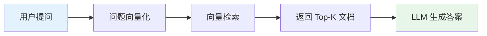

这个流程简洁优雅，对简单问题效果很好。但**当问题变复杂时**，它的固定流程就暴露出了根本性缺陷。

### 1.2 传统 RAG 的五大瓶颈

| 瓶颈 | 具体表现 | 真实案例 |
|------|----------|----------|
| **单次检索局限** | 一次检索无法满足复杂问题 | 「比较 A 公司和 B 公司 2024 年的财报差异」需多次检索 |
| **固定流程僵化** | 无论问题简单复杂，都走同一流程 | 「今天天气怎么样」也要检索知识库，资源浪费 |
| **无法自我纠错** | 检索质量差时无法补救 | 检索到不相关文档，直接影响答案质量 |
| **跨源整合困难** | 无法灵活调用不同类型数据源 | 问题需要结合向量库、SQL 数据库、实时 API 三者 |
| **多跳推理缺失** | 无法将多次检索结果关联推理 | 「A 的老板的母校在哪里？」需要链式推理 |


> [!IMPORTANT]
> **核心矛盾**：传统 RAG 是一个「固定管道」——输入问题，输出答案，中间流程不可变。但现实中的复杂问题需要的是「动态导航」——根据中间结果灵活调整策略。


### 1.3 让 AI 自己决定怎么检索

Agentic RAG 的核心思想只有一句话：

> **将检索的「控制权」从固定流程交给 AI Agent，让 Agent 自主决定「是否检索」「检索什么」「如何使用检索结果」。**

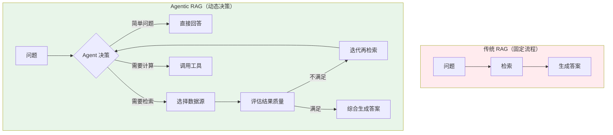

## 2. Agentic RAG 的核心架构

### 2.1 整体架构概览

Agentic RAG 系统由三个关键层次构成：

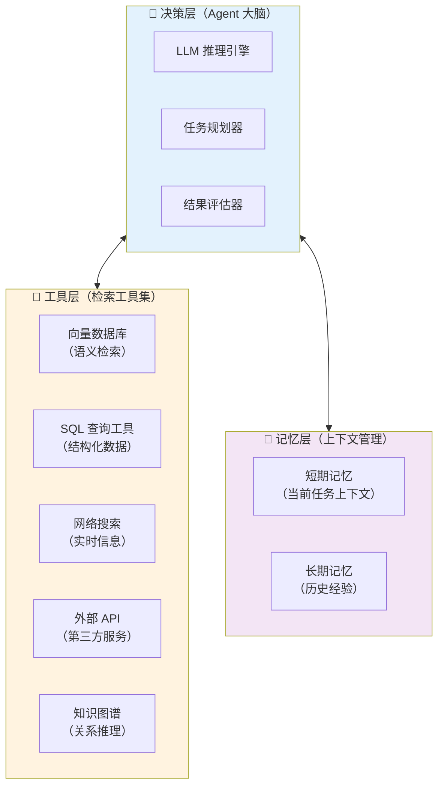

### 2.2 ReAct：Agentic RAG 的推理引擎

**ReAct（Reasoning + Acting）** 框架是 Agentic RAG 最核心的运行机制，它让 Agent 在**推理**和**行动**之间循环迭代：

```
Thought（思考）: 我需要分析这个问题，它要求我比较两个公司的财务状况
Action（行动）: search_vector_db("A公司2024年营收")
Observation（观察）: 找到了 A 公司营收数据：320 亿元，同比增长 15%
Thought（思考）: 需要继续检索 B 公司的数据才能做比较
Action（行动）: search_vector_db("B公司2024年营收")
Observation（观察）: 找到了 B 公司营收数据：280 亿元，同比增长 22%
Thought（思考）: 现在有了两份数据，可以进行对比分析了
Final Answer（最终答案）: [综合两次检索结果生成对比分析...]
```

> [!NOTE]
> ReAct 论文（[arxiv:2210.03629](https://arxiv.org/abs/2210.03629)）证明，推理与行动的交替循环比单独使用任一方式都能显著提升复杂任务的完成质量。


### 2.3 核心工作流程

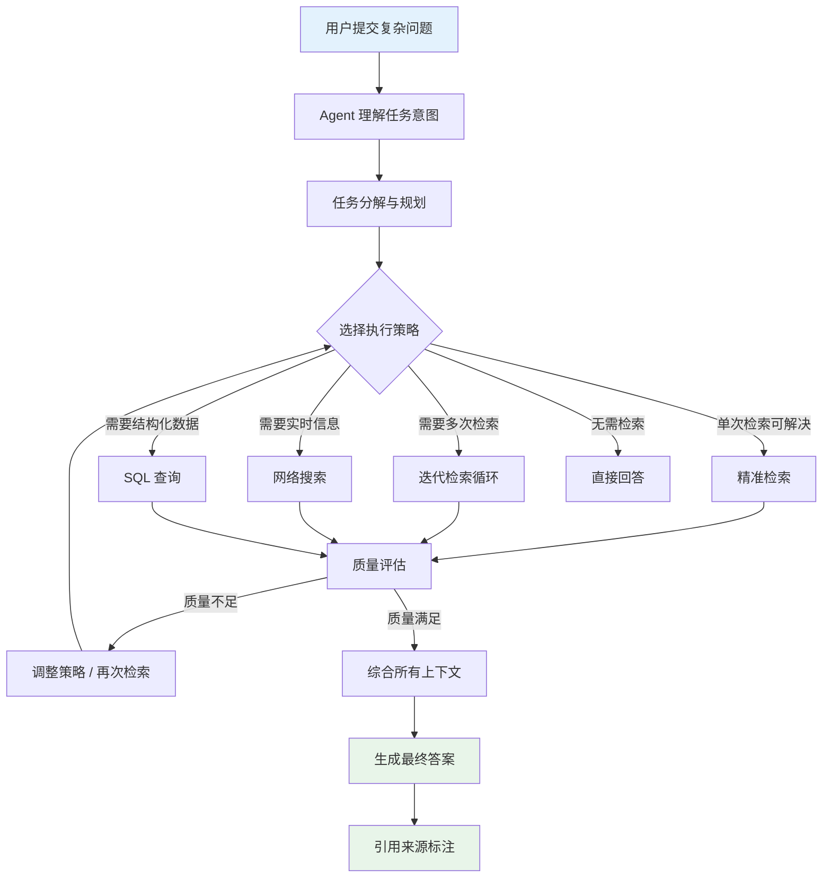

## 3. 三种核心 Agent 模式

### 3.1 Router Agent（路由智能体）

**最简单** 的 Agentic RAG 实现——Agent 充当智能路由器，根据问题类型选择最合适的检索源。

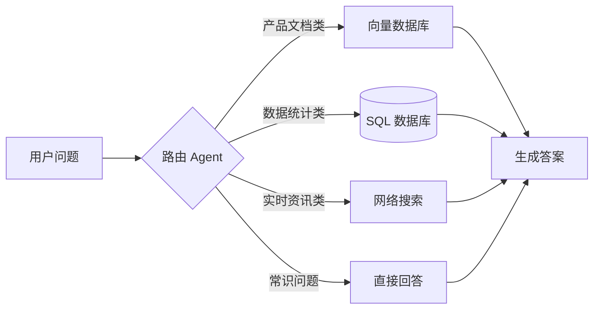

**适用场景**：知识源明确、问题类型可预判的企业知识库。

**优势**：低延迟、低成本、易维护。

**局限**：无法处理需要多源联合的问题。


### 3.2 Planner Agent（规划智能体）

**中等复杂度**——Agent 先制定完整执行计划，再按步骤执行，支持**多步骤串行检索**。

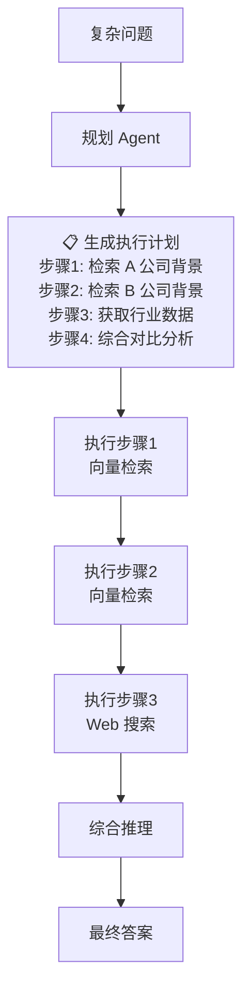

**适用场景**：需要多步骤、有依赖关系的复杂分析任务。

| 特点 | 说明 |
|------|------|
| **任务分解** | 将复杂问题拆解为有序子任务 |
| **依赖管理** | 上一步结果影响下一步策略 |
| **可审查性** | 执行计划可视化，便于调试 |


### 3.3 Reflective Agent（反思智能体）

**最强大**——Agent 在检索后具备**自我评估**能力，不满意则迭代优化，直到达到质量标准。

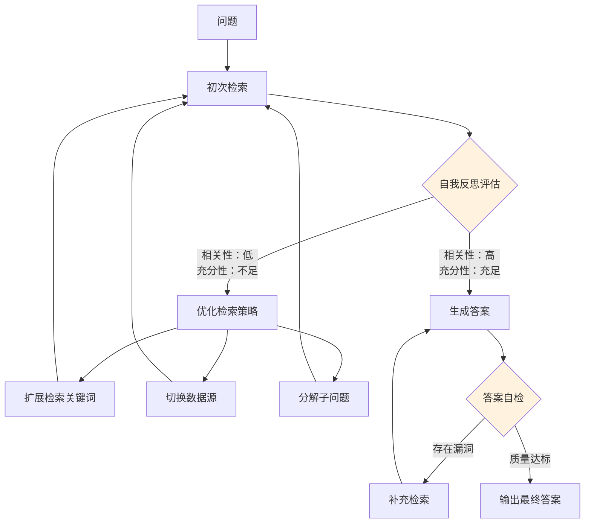

> [!TIP]
> Reflective Agent 正是 **SELF-RAG** 和 **CRAG** 的核心思路——让 AI 自我评估检索质量，而非盲目使用任何检索结果。


## 4. 多智能体 RAG 架构

### 4.1 为什么需要多智能体？

当任务复杂度进一步提升时，单个 Agent 难以高效处理所有问题。**多智能体 RAG** 引入了分工协作机制：

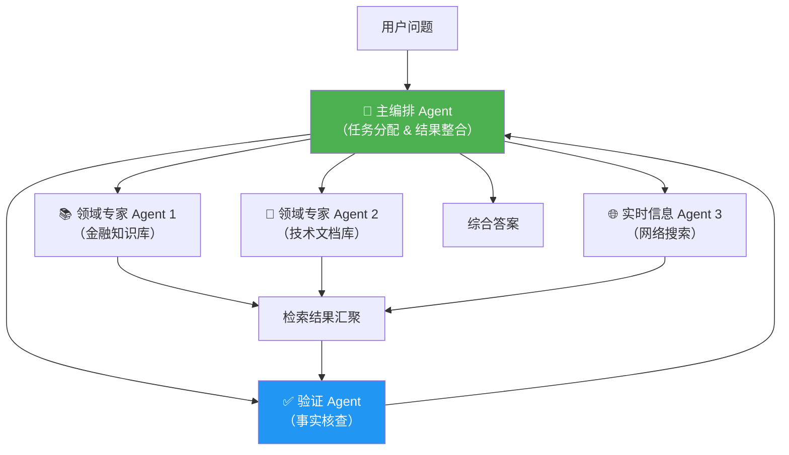

### 4.2 多智能体 vs. 单智能体对比

| 维度 | 单智能体 RAG | 多智能体 RAG |
|------|------------|------------|
| **适用任务** | 中等复杂度 | 高度复杂、跨域任务 |
| **执行方式** | 串行处理 | 并行协作 |
| **领域专业性** | 通用知识 | 各 Agent 深度专业化 |
| **延迟** | 较低 | 并行时更低，串行时更高 |
| **成本** | 低 | 高 |
| **容错性** | 单点故障 | 可互相验证 |
| **可扩展性** | 有限 | 高（按需增加专业 Agent） |

### 4.3 并行检索模式

多智能体架构的一大优势是**并行检索**——不同 Agent 同时检索不同数据源，大幅降低响应时间：

```mermaid
gantt
    title 并行 vs 串行检索时间对比（示意）
    dateFormat X
    axisFormat %s秒
    
    section 串行检索
    检索知识库    :0, 3
    查询数据库    :3, 6
    网络搜索      :6, 9
    综合生成      :9, 11
    
    section 并行检索
    检索知识库    :0, 3
    查询数据库    :0, 2
    网络搜索      :0, 4
    综合生成      :4, 6
```


## 5. 与传统 RAG 的全面对比

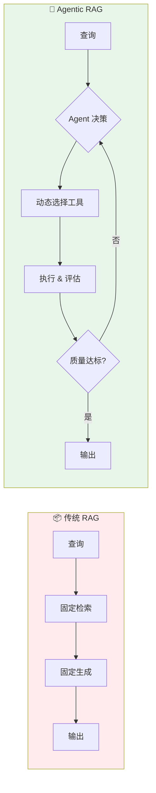

| 对比维度 | 传统 RAG | Agentic RAG |
|----------|---------|-------------|
| **检索策略** | 固定单次检索 | 动态多次迭代检索 |
| **决策能力** | 无决策，流程固定 | 自主决策检索时机和方式 |
| **数据源** | 通常单一向量数据库 | 多源（向量库 + SQL + API + Web） |
| **错误处理** | 无自动补救机制 | 自评估后迭代优化 |
| **多跳推理** | ❌ 不支持 | ✅ 原生支持 |
| **适用任务** | 简单问答 | 复杂分析、研究、多步推理 |
| **成本** | 低 | 中-高（多次 LLM 调用） |
| **响应延迟** | 低（秒级） | 中-高（可达分钟级） |
| **可解释性** | 低 | 高（可查看推理过程） |

> [!IMPORTANT]
> **何时选择 Agentic RAG？**
> 
> - ✅ 问题需要多步推理或跨文档关联
> - ✅ 需要整合多种类型数据源
> - ✅ 答案准确性要求极高，可接受较高延迟
> - ❌ 简单 FAQ / 单文档问答 → 用传统 RAG 更合适
> - ❌ 对延迟极度敏感（<1秒响应）→ 用传统 RAG 更合适


## 6. 主流框架实现

### 6.1 LangChain：ReAct Agent + RAG

LangChain 提供了最成熟的 Agentic RAG 实现方案：

```python
from langchain.agents import AgentExecutor, create_react_agent
from langchain.tools.retriever import create_retriever_tool
from langchain_community.vectorstores import Chroma
from langchain_openai import ChatOpenAI, OpenAIEmbeddings
from langchain import hub

# 1. 构建向量数据库检索器
embeddings = OpenAIEmbeddings()
vectorstore = Chroma(embedding_function=embeddings)
retriever = vectorstore.as_retriever(search_kwargs={"k": 5})

# 2. 将检索器包装为 Agent 工具
retriever_tool = create_retriever_tool(
    retriever,
    name="knowledge_base_search",
    description="搜索公司知识库。当需要查询产品信息、政策文档时使用此工具。"
)

# 3. 定义工具集（可以添加多个工具）
tools = [retriever_tool]

# 4. 使用 ReAct Prompt
prompt = hub.pull("hwchase17/react")

# 5. 创建 Agent
llm = ChatOpenAI(model="gpt-4o", temperature=0)
agent = create_react_agent(llm, tools, prompt)

# 6. 创建 Agent 执行器
agent_executor = AgentExecutor(
    agent=agent,
    tools=tools,
    verbose=True,         # 显示推理过程
    max_iterations=10,    # 最大迭代次数
    return_intermediate_steps=True  # 返回中间步骤
)

# 7. 运行 Agent
result = agent_executor.invoke({
    "input": "请比较我们产品 A 和产品 B 的核心差异，并给出选购建议"
})
```

### 6.2 LlamaIndex：AgentRunner

LlamaIndex 提供了更简洁的 Agent 封装：

```python
from llama_index.core.agent import ReActAgent
from llama_index.core.tools import QueryEngineTool, ToolMetadata
from llama_index.core import VectorStoreIndex, SimpleDirectoryReader
from llama_index.llms.openai import OpenAI

# 1. 构建两个独立的知识库索引
docs_a = SimpleDirectoryReader("./data/product_a").load_data()
docs_b = SimpleDirectoryReader("./data/product_b").load_data()

index_a = VectorStoreIndex.from_documents(docs_a)
index_b = VectorStoreIndex.from_documents(docs_b)

# 2. 将索引转换为查询引擎工具
tools = [
    QueryEngineTool(
        query_engine=index_a.as_query_engine(),
        metadata=ToolMetadata(
            name="product_a_docs",
            description="包含产品 A 的所有文档、规格和用户手册"
        ),
    ),
    QueryEngineTool(
        query_engine=index_b.as_query_engine(),
        metadata=ToolMetadata(
            name="product_b_docs",
            description="包含产品 B 的所有文档、规格和用户手册"
        ),
    ),
]

# 3. 创建 ReAct Agent
llm = OpenAI(model="gpt-4o")
agent = ReActAgent.from_tools(
    tools,
    llm=llm,
    verbose=True,
    max_iterations=15
)

# 4. 查询
response = agent.chat("比较产品 A 和产品 B 的电池续航和摄像头规格，哪个更适合摄影爱好者？")
```

### 6.3 LangGraph：状态机驱动的 Agentic RAG

LangGraph 是构建复杂 Agentic RAG 的利器，通过状态机实现精确的流程控制：

```python
from langgraph.graph import StateGraph, END
from typing import TypedDict, List, Annotated
import operator

# 1. 定义状态
class AgenticRAGState(TypedDict):
    question: str
    retrieved_docs: List[str]
    generation: str
    retry_count: int
    is_relevant: bool

# 2. 定义节点函数
def retrieve(state: AgenticRAGState):
    """检索相关文档"""
    docs = retriever.invoke(state["question"])
    return {"retrieved_docs": [doc.page_content for doc in docs]}

def evaluate_relevance(state: AgenticRAGState):
    """评估检索结果相关性"""
    # LLM 评估文档是否与问题相关
    evaluation = relevance_checker.invoke({
        "question": state["question"],
        "docs": state["retrieved_docs"]
    })
    return {"is_relevant": evaluation.is_relevant}

def rewrite_query(state: AgenticRAGState):
    """改写查询以获取更好的检索结果"""
    new_query = query_rewriter.invoke({"question": state["question"]})
    return {"question": new_query, "retry_count": state["retry_count"] + 1}

def generate(state: AgenticRAGState):
    """基于检索内容生成答案"""
    answer = rag_chain.invoke({
        "context": "\n".join(state["retrieved_docs"]),
        "question": state["question"]
    })
    return {"generation": answer}

# 3. 定义路由逻辑
def decide_to_regenerate(state: AgenticRAGState):
    if state["is_relevant"] or state["retry_count"] >= 3:
        return "generate"
    return "rewrite"

# 4. 构建状态图
workflow = StateGraph(AgenticRAGState)
workflow.add_node("retrieve", retrieve)
workflow.add_node("evaluate", evaluate_relevance)
workflow.add_node("rewrite", rewrite_query)
workflow.add_node("generate", generate)

workflow.set_entry_point("retrieve")
workflow.add_edge("retrieve", "evaluate")
workflow.add_conditional_edges("evaluate", decide_to_regenerate)
workflow.add_edge("rewrite", "retrieve")
workflow.add_edge("generate", END)

app = workflow.compile()
result = app.invoke({"question": "...", "retry_count": 0})
```

### 6.4 框架选型对比

| 框架 | 上手难度 | 灵活性 | 多 Agent 支持 | 适合场景 |
|------|----------|--------|--------------|----------|
| **LangChain ReAct** | ⭐⭐ | ⭐⭐⭐ | ⭐⭐ | 快速原型、标准 RAG |
| **LlamaIndex Agent** | ⭐⭐ | ⭐⭐⭐ | ⭐⭐ | 文档密集型任务 |
| **LangGraph** | ⭐⭐⭐⭐ | ⭐⭐⭐⭐⭐ | ⭐⭐⭐⭐ | 复杂流程、生产环境 |
| **AutoGen** | ⭐⭐⭐ | ⭐⭐⭐⭐ | ⭐⭐⭐⭐⭐ | 多 Agent 协作 |


## 7. 实战最佳实践

### 7.1 工具描述要精准

Agent 选择工具的关键在于工具描述的质量，描述越精准，选错工具的概率越低：

```python
# ❌ 模糊的工具描述
bad_tool = Tool(
    name="search",
    description="搜索信息"  # 太模糊，Agent 不知道何时用
)

# ✅ 精准的工具描述
good_tool = Tool(
    name="product_manual_search",
    description=(
        "搜索产品说明书和技术文档。"
        "当用户询问产品规格、操作步骤、故障排除时使用。"
        "不适用于价格查询或库存查询。"
    )
)
```

### 7.2 设置合理的迭代上限

防止 Agent 陷入无限循环，同时保证有足够的重试次数：

```python
agent_executor = AgentExecutor(
    agent=agent,
    tools=tools,
    max_iterations=8,          # 复杂任务建议 5-10 次
    max_execution_time=60,     # 超时限制（秒）
    early_stopping_method="generate"  # 超限后强制生成答案
)
```

### 7.3 实现检索质量自评估

```python
from langchain_core.prompts import ChatPromptTemplate
from pydantic import BaseModel, Field

class RelevanceScore(BaseModel):
    is_relevant: bool = Field(description="文档是否与问题相关")
    score: float = Field(description="相关性评分 0-1")
    reason: str = Field(description="判断理由")

relevance_evaluator = ChatPromptTemplate.from_messages([
    ("system", "你是一个检索质量评估专家。评估给定文档是否能帮助回答问题。"),
    ("human", "问题：{question}\n\n文档内容：{document}\n\n请评估相关性：")
]) | llm.with_structured_output(RelevanceScore)
```

### 7.4 常见问题与解决方案

| 问题 | 原因分析 | 解决方案 |
|------|----------|----------|
| Agent 反复调用同一工具 | 工具定义重叠或返回结果不够清晰 | 重新设计工具描述，返回结构化结果 |
| 推理过程陷入死循环 | 缺少退出条件 | 设置 max_iterations 和超时限制 |
| 答案忽略检索内容 | Prompt 对上下文强调不足 | 在 Prompt 中明确要求基于检索内容回答 |
| 响应时间过长 | 串行执行多次检索 | 引入并行工具调用，使用 async 模式 |
| 工具选择不准确 | 工具描述不够具体 | 详细说明每个工具的适用场景和禁用场景 |

> [!WARNING]
> **成本控制要点**：Agentic RAG 每次请求可能触发 3-10 次 LLM 调用。务必：
> - 设置 max_iterations 防止无限循环
> - 对重复问题启用结果缓存
> - 根据问题复杂度动态决定使用 Agentic RAG 还是传统 RAG


## 8. Agentic RAG 的五大核心优势

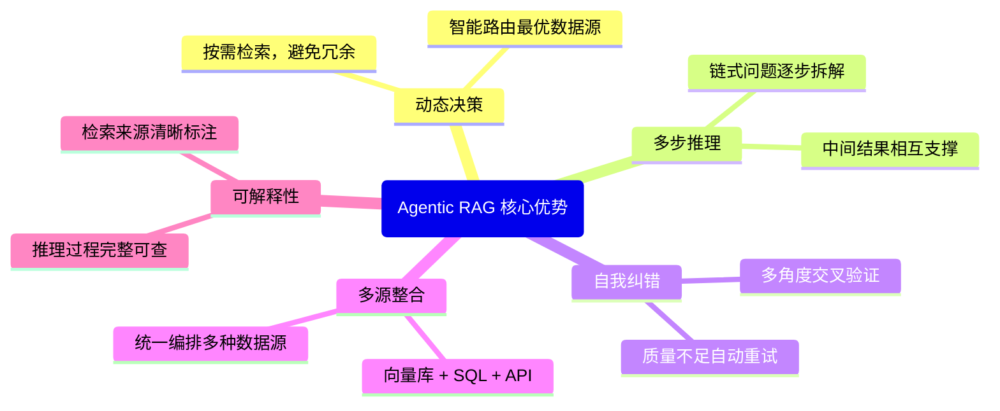

## 9. 适用场景与案例

### 9.1 最佳适用场景

| 场景 | 为什么适合 Agentic RAG | 实现要点 |
|------|----------------------|----------|
| **企业智能助手** | 需整合 HR、财务、销售等多个知识库 | 多 Agent 分域检索 |
| **科研文献分析** | 需跨多篇论文进行关联分析 | 迭代检索 + 知识图谱 |
| **法律文书审核** | 需对比多份合同条款，精度要求高 | Reflective Agent + 事实核查 |
| **金融分析报告** | 需结合实时行情、历史数据、研报 | 多源工具 + 并行检索 |
| **客户服务升级** | 复杂投诉需关联多个系统数据 | Router Agent + 工单系统集成 |


### 9.2 不适合的场景

> [!CAUTION]
> 以下场景使用 Agentic RAG **得不偿失**，应优先考虑传统 RAG：
> 
> - **简单 FAQ 问答**：问题简单、答案固定，引入 Agent 只会增加延迟和成本
> - **实时性要求极高**（< 1 秒响应）：Agent 的多次 LLM 调用难以满足
> - **预算极为有限**：Agentic RAG 的 API 调用成本是传统 RAG 的 3-10 倍


## 10. 未来展望

Agentic RAG 正在向更智能的方向快速演进：

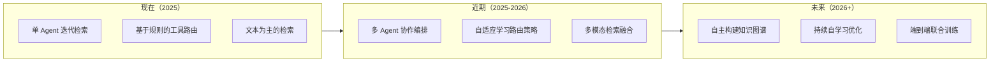

**五大演进方向**：

1. **长期记忆增强**：Agent 跨会话积累经验，持续优化检索策略
2. **主动知识获取**：Agent 识别知识库盲点，主动触发数据收集
3. **多模态统一检索**：文本、图像、音频、视频在同一智能体内无缝检索
4. **隐私保护检索**：联邦学习 + Agentic RAG，在保护数据的同时跨机构协作
5. **端到端优化**：检索器与生成器联合微调，彻底打通两端性能瓶颈


## 11. 总结

| 核心概念 | 一句话解释 |
|---------|-----------|
| **Agentic RAG** | 让 AI Agent 自主控制检索流程的新范式 |
| **ReAct 框架** | 推理与行动交替循环的核心机制 |
| **Router Agent** | 智能路由不同数据源的简单 Agent |
| **Planner Agent** | 制定多步骤执行计划的中级 Agent |
| **Reflective Agent** | 自我评估并迭代优化的高级 Agent |
| **多智能体 RAG** | 多个专业 Agent 并行协作处理复杂任务 |
| **工具描述** | Agent 选择工具的核心依据，精准度至关重要 |


> [!TIP]
> **学习路径建议**：
> 1. 先掌握传统 RAG 基础（向量检索、分块策略）
> 2. 理解 ReAct 推理框架，手动实现一个简单的 Router Agent
> 3. 使用 LangChain 或 LlamaIndex 构建多工具 Agent
> 4. 进阶到 LangGraph，实现精确的流程控制
> 5. 探索多智能体协作框架（AutoGen / CrewAI）

## 12. 参考资料

### 核心论文

| 论文 | 作者/机构 | 年份 | 主要贡献 |
|------|-----------|------|----------|
| *Retrieval-Augmented Generation for Knowledge-Intensive NLP Tasks* | Lewis et al. (Meta AI) | 2020 | RAG 奠基论文 |
| *ReAct: Synergizing Reasoning and Acting in Language Models* | Yao et al. (Princeton & Google) | 2022 | ReAct 推理框架 |
| *Self-RAG: Learning to Retrieve, Generate, and Critique* | Asai et al. (UW) | 2023 | 自我反思机制 |
| *Corrective Retrieval Augmented Generation (CRAG)* | Yan et al. | 2024 | 检索质量纠错 |
| *Agentic Retrieval-Augmented Generation: A Survey* | 多机构合作 | 2024 | Agentic RAG 综述 |

### 推荐资源

- [LangChain Agent 官方文档](https://python.langchain.com/docs/concepts/agents/)
- [LlamaIndex Agent 指南](https://docs.llamaindex.ai/en/stable/use_cases/agents/)
- [LangGraph 教程](https://langchain-ai.github.io/langgraph/)
- [RAG Survey 2024（arXiv:2312.10997）](https://arxiv.org/abs/2312.10997)
- [Agentic RAG 综述（arXiv:2501.09136）](https://arxiv.org/abs/2501.09136)
