> 残差连接自 2015 年 ResNet 诞生以来，始终是深度神经网络的"地基"，十年间几乎无人撼动。Kimi 团队在 2026 年 3 月发表的论文 *Attention Residuals* 正面挑战了这一惯例——用深度方向的 Softmax 注意力机制，替换掉"所有层等权相加"的固定残差累加，让每一层都能动态、按需地检索历史表征。在 48B 参数、1.4T Tokens 的工业级预训练验证下，Block AttnRes 等效于基线模型使用 1.25× 计算量的效果，GPQA-Diamond 推理基准提升 7.5 分。
>
> 📌 **核心论文**：[Attention Residuals](https://arxiv.org/abs/2603.15031)（arXiv:2603.15031）
>
> 📌 **适合人群**：对 Transformer 架构有基础认知的 AI 学习者、模型研究者、工程开发者


> 🎧 **更喜欢听？试试本文的音频版本**
<AudioPlayer 
  src="//cdn.smallyoung.cn/smallyoung_blog/attention-residuals/Kimi注意力残差找回25_算力.m4a"
  author="SmallYoung"
/>

<VideoPlayer 
  src="//cdn.smallyoung.cn/smallyoung_blog/attention-residuals/现代AI的隐藏缺陷.mp4"
/>

<MindMapFloat title="Attention Residuals 知识图谱">

```mindmap-data
# Attention Residuals
## 为什么残差连接需要被改造
- 固定等权累加导致隐状态无限膨胀
- PreNorm 稀释问题：深层贡献被淹没
- 梯度分布不均，训练不稳定
## 核心机制：深度方向的注意力
- 用 Softmax 注意力替代固定累加
- 每层持有可学习的伪查询向量 w_l
- RMSNorm 归一化的键值对
- 与 RNN→Transformer 的范式迁移同构
## Block AttnRes 的工程化实现
- 分块分组降低显存 O(Ld)→O(Nd)
- 缓存流水线通信消除冗余传输
- 两阶段推理策略摊薄计算开销
- 8 个块是效果与开销的最优甜蜜点
## 规模化验证：Kimi Linear 48B 上的实测
- 1.25× 计算等效优势
- GPQA-Diamond +7.5，HumanEval +3.1
- 输出量级周期有界，梯度分布更均匀
## AttnRes vs mHC：两条并行路线的本质差异
- mHC 扩宽管道：n 流并行 + Birkhoff 双随机约束
- AttnRes 换调度：单流保留 + 深度注意力检索
- 内存 I/O：34d（mHC）vs 5.5d（AttnRes）
- 历史跨距：仅相邻层（mHC）vs 任意历史块（AttnRes）
```

</MindMapFloat>

## 关于本文档

本文从"为什么十年不变的残差连接需要改造"出发，逐层拆解 Attention Residuals 的核心原理、工程化路径与真实性能表现，并与 DenseFormer、Hyper-Connections、mHC 等前沿方案横向对比，最后提供可运行的 PyTorch 代码供读者复现。

- ✅ 残差连接的工作原理与 PreNorm 稀释问题（PreNorm Dilution）的根因
- ✅ AttnRes 的核心数学公式与深度-序列二维对偶性直觉
- ✅ Block AttnRes 的工程化设计：分块、缓存流水线、两阶段推理
- ✅ mHC（DeepSeek）Birkhoff 流形投影原理与 AttnRes 的正面对决
- ✅ Kimi Linear 48B 实测 Benchmark 数据与扩展律分析

## 1. 十年不变的残差连接，到底隐藏着什么问题？

### 1.1 残差连接的工作原理：梯度的"高速公路"

2015 年，何恺明等人在 ResNet 论文中提出残差连接（Residual Connection），彻底解决了深层网络的梯度消失问题。其核心思想极其简洁：每一层的输出等于当前变换加上输入本身的直通项。

$$h_l = h_{l-1} + f_{l-1}(h_{l-1})$$

展开后，第 $l$ 层的隐状态其实是所有前驱层输出的累加：

$$h_l = h_0 + \sum_{i=1}^{l-1} f_i(h_i)$$

这条公式的关键在于：**每一项的权重都是固定的 1**。无论是第 1 层的输出还是第 99 层的输出，对当前隐状态的贡献权重完全相同，没有任何差异化。

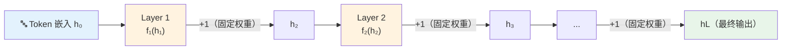

这一机制的优势显而易见：梯度可以从输出层直接流向输入层而无需经过任何变换，彻底消解了深层网络的训练困难。然而，正是这种简洁性，埋下了一个十年后才被充分重视的隐患。


### 1.2 PreNorm 稀释问题：深层信息的"鸡尾酒会"困境

现代大语言模型几乎都采用 **PreNorm 架构**：在每层变换 $f_l$ 之前先做归一化（LayerNorm 或 RMSNorm）。这本来是为了训练稳定性而设计的，但与残差累加叠加后，产生了一个不可忽视的副作用——**PreNorm Dilution（预归一化稀释问题）**。

问题的逻辑链条如下：

1. 随着层数增加，残差流 $h_l$ 是所有前层输出的等权和，**绝对量级随深度单调递增**（接近 $O(\sqrt{L})$ 的增长趋势）
2. PreNorm 在进入每层前对 $h_l$ 归一化到固定尺度，这意味着**归一化后的激活相对于原始嵌入 $h_0$ 在量级上越来越小**
3. 越深的层，其变换输出 $f_l$ 必须越大才能在残差流中产生可见影响
4. 深层输出被迫"大声喊叫"，浅层的精细特征被淹没在噪音中，**最终梯度分布高度不均匀，训练不稳定**

> [!IMPORTANT]
> PreNorm 稀释的核心矛盾：残差流的量级随深度无限增长，但每层的归一化输入尺度固定，导致深层贡献需要越来越大的输出幅度，形成不断恶化的正反馈。这不是调参能解决的问题，而是架构层面的结构性缺陷。

| 深度 $l$ | 残差流量级（粗估） | 深层贡献相对权重 | 结果 |
|----------|--------------------|-----------------|------|
| 10 层 | ~3× 初始量级 | 尚可接受 | 训练基本稳定 |
| 50 层 | ~7× 初始量级 | 明显稀释 | 深层梯度偏小 |
| 100 层 | ~10× 初始量级 | 严重稀释 | 训练不稳定，深层低效 |
| 200 层 | ~14× 初始量级 | 几乎失效 | 极深网络性能严重受损 |


### 1.3 时间轴 vs 深度轴：一个被忽视的对称性

Kimi 团队在论文中提出了一个极具洞察力的类比：**深度方向的残差累加，与序列方向的 RNN 递归，在数学结构上高度同构**。

回想历史：在 Transformer 出现之前，RNN 面临的核心问题是——处理第 100 个 token 时，必须将前 99 个 token 的信息压缩进一个固定大小的隐向量。长距离信息在传递过程中被逐渐稀释。**Transformer 通过引入 Self-Attention，让每个 token 都能直接"看"到序列中的任意位置，以输入依赖的权重检索最相关的历史信息，彻底解决了这一问题。**

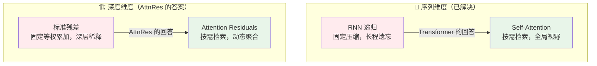

> [!NOTE]
> 这就是 Attention Residuals 的核心直觉：如果 Transformer 在序列维度上用注意力替代了 RNN，那么在深度维度上，同样可以用注意力替代固定的残差累加。这是一个理论上最自然的设计选择。


## 2. Attention Residuals 的核心原理

### 2.1 Full AttnRes：把残差累加变成深度注意力

Attention Residuals（AttnRes）的核心思想一句话即可概括：**让每一层以可学习的、输入依赖的注意力权重，对所有前驱层的输出进行加权聚合，而不是固定等权相加。**

数学形式如下：

$$\mathbf{h}_l = \sum_{i=0}^{l-1} \alpha_{i \to l} \cdot \mathbf{v}_i$$

其中注意力权重 $\alpha_{i \to l}$ 由 Softmax 归一化计算：

$$\alpha_{i \to l} = \frac{\exp(\mathbf{w}_l^\top \cdot \text{RMSNorm}(\mathbf{v}_i))}{\sum_{j=0}^{l-1} \exp(\mathbf{w}_l^\top \cdot \text{RMSNorm}(\mathbf{v}_j))}$$

这里几个关键设计值得仔细品味：

| 设计元素 | 具体做法 | 设计意图 |
|----------|----------|----------|
| **伪查询向量** $\mathbf{w}_l \in \mathbb{R}^d$ | 每层持有一个可学习的固定向量，不依赖当前输入 | 降低计算开销，保留内容依赖性（通过键的 RMSNorm） |
| **值向量** $\mathbf{v}_i$ | 第 $i$ 层的实际隐状态输出 | 覆盖全部历史层，无需压缩 |
| **键向量** $\text{RMSNorm}(\mathbf{v}_i)$ | 对历史隐状态归一化后作键 | 实现内容依赖的检索，使注意力权重受历史表征影响 |
| **零初始化** | $\mathbf{w}_l$ 初始化为全零 | 训练初期权重均匀分布，等价于等权累加，避免早期不稳定 |
| **Softmax 归一化** | 所有权重之和严格等于 1 | 控制隐状态量级，避免 PreNorm Dilution |

> [!TIP]
> 伪查询向量 $\mathbf{w}_l$ 的"伪"字很重要——它不依赖当前 token 的嵌入，因此在一个 Block 内的所有层，其查询向量都是已知的固定参数。这一特性是后续两阶段推理优化的关键基础。

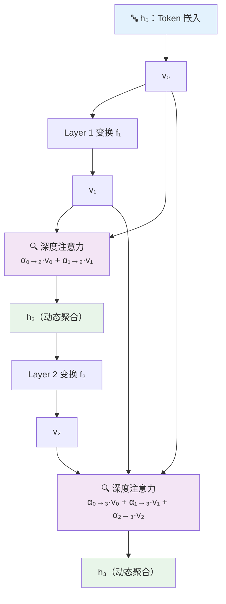


### 2.2 Full AttnRes 的显存瓶颈与 Block AttnRes 的解法

Full AttnRes 的优雅是有代价的。要对所有前驱层进行注意力计算，必须在内存中保留所有历史隐状态 $\{v_0, v_1, \ldots, v_{l-1}\}$，内存开销为 $O(L \cdot d)$——对于层数 $L$ 高达数百的大型模型，这几乎是不可接受的。


**Block AttnRes** 的解法是：将 $L$ 层分成 $N$ 个块（Block），每个块内部依然使用标准残差累加，跨块之间才使用注意力聚合。

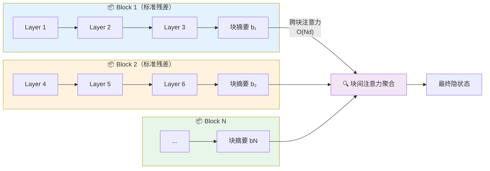

这一设计将内存开销从 $O(L \cdot d)$ 降低至 $O(N \cdot d)$，当 $N=8$（论文推荐默认值）时，即便有数百层，也只需维护 8 个块摘要向量——对工程实现而言完全可接受。

实验结果证实，块数 $N$ 对性能影响呈现"甜蜜点"特征：

| 块数 $N$ | 等价 | 验证损失 | 显存开销 |
|----------|------|----------|----------|
| 1 | 标准残差（下界） | 最高 | 最低 |
| 2 | — | 接近 Full AttnRes | 极低 |
| 4 | — | 接近 Full AttnRes | 低 |
| **8（推荐）** | — | **接近 Full AttnRes** | **可接受** |
| 16 | — | 开始退化 | 较高 |
| 32 | — | 明显退化 | 高 |
| $L$（层数） | Full AttnRes（上界） | 最低 | 最高 |

> [!IMPORTANT]
> 8 个块是目前实验发现的最优甜蜜点：性能几乎等同于 Full AttnRes，而内存和通信开销仅相当于存储 8 个隐向量，推理额外延迟控制在 2% 以内。


### 2.3 两阶段推理策略：把开销压到极致

在推理阶段，朴素实现方案会在每一层都重新计算跨块注意力，造成重复计算。Kimi 团队设计了**两阶段推理策略**来避免这一问题：

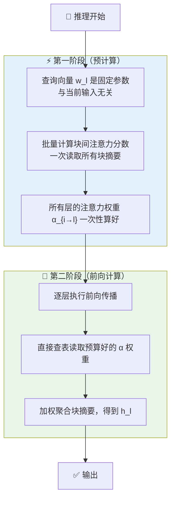

> [!NOTE]
> 两阶段策略的关键洞察：伪查询向量 $\mathbf{w}_l$ 是可学习参数而非输入激活，因此在推理时是固定已知的。这意味着所有的注意力分数计算可以在前向传播开始前一次性批量完成，完全避免了逐层重复计算的开销。


## 3. Full AttnRes 与 Block AttnRes 的变体详解

### 3.1 Full AttnRes：理论上限，研究价值高

Full AttnRes 是最纯粹的实现——每一层直接注意到所有前驱层的完整输出。

**适用场景**：中小规模实验、消融研究、验证理论性质。
**核心优势**：实现最简洁，提供理论性能上界，适合对比实验。
**核心局限**：内存开销 $O(L \cdot d)$，在大规模模型（如 48B 参数、54 层）上几乎不可行。

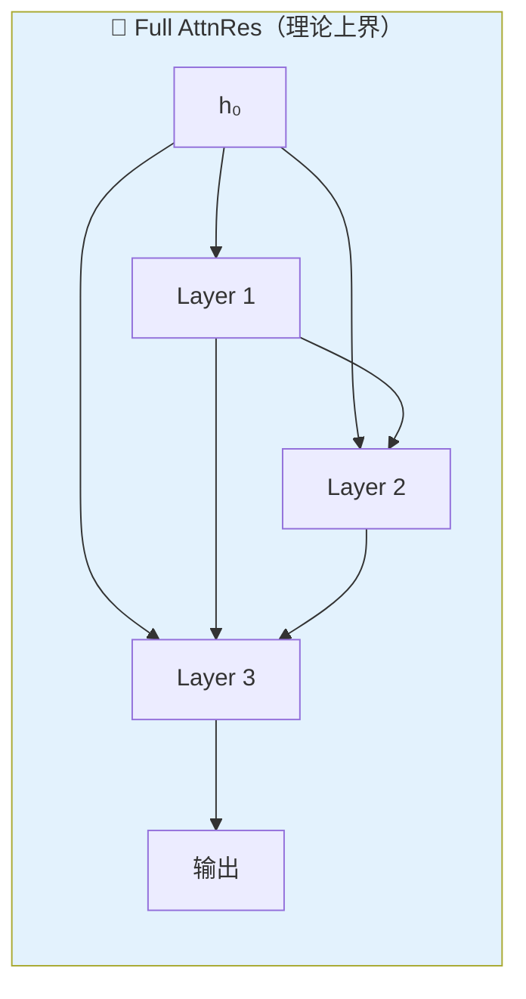

### 3.2 Block AttnRes：工程落地，性能保留

Block AttnRes 是实际部署的核心方案，通过分块分组平衡性能与效率。

| 特点 | 说明 |
|------|------|
| 块内机制 | 标准残差累加，向后兼容 |
| 块间机制 | Softmax 注意力，动态加权 |
| 推荐块数 | $N \approx 8$，覆盖大多数规模 |
| 内存复杂度 | $O(N \cdot d)$，与层数无关 |
| 推理延迟 | 额外开销 < 2% |

> [!TIP]
> Block AttnRes 的设计使其成为现有 Transformer 的"插件式"升级——只需替换残差连接模块，无需修改注意力头、前馈层、路由逻辑或其他任何组件，即可接入任何标准 Transformer 架构。

### 3.3 AttnRes 对 PreNorm Dilution 的根治机制

标准残差的隐状态量级随深度单调递增，而 AttnRes 通过 Softmax 归一化（权重和为 1）在每个聚合点重置了量级的累积。具体体现在：

- **块内**：依然是标准残差累加，量级在块内线性增长
- **块边界**：跨块注意力以 Softmax 权重进行凸组合，强制将量级"归位"到合理范围
- **整体效果**：输出量级呈现有界的周期性波动，而非单调增长

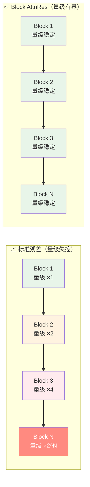

## 4. 规模化验证：Kimi Linear 48B 上的真实性能

### 4.1 扩展律实验：跨模型规模的一致性优势

Kimi 团队在 5 个不同规模的模型上进行了扩展律（Scaling Law）实验，每个规模分别训练 3 个变体：PreNorm 基线、Full AttnRes、Block AttnRes（≈8 blocks）。

拟合结果（验证损失 $L$ vs 计算量 $C$）：

| 变体 | 扩展律拟合 | 含义 |
|------|------------|------|
| 标准 PreNorm 基线 | $L = 1.891 \times C^{-0.057}$ | 基准线 |
| Block AttnRes | $L = 1.870 \times C^{-0.058}$ | 等效 1.25× 算力 |
| Full AttnRes | $L = 1.865 \times C^{-0.057}$ | 略优于 Block AttnRes |

在最大测试规模下，Block AttnRes 的验证损失为 1.692，而基线为 1.714，等效于**用同样的算力，获得了基线训练 1.25 倍算力才能达到的效果**。

> [!IMPORTANT]
> 1.25× 计算等效优势的含义：假设训练一个模型花费 100 万美元，引入 Block AttnRes 后，同等预算可获得相当于 125 万美元预算基线的模型性能。这是纯粹的架构改进带来的免费算力提升。


### 4.2 Kimi Linear 48B 下游任务全面提升

在 Kimi Linear MoE 架构（48B 总参数 / 3B 激活参数）、1.4T Tokens 预训练规模上，Block AttnRes 在所有评测基准上均优于或持平于基线：

| 基准类别 | 基准 | 基线 | Block AttnRes | 提升 |
|----------|------|------|---------------|------|
| 语言理解与推理 | MMLU | 73.5 | 74.6 | **+1.1** |
| 语言理解与推理 | GPQA-Diamond | 36.9 | 44.4 | **+7.5** ⭐ |
| 语言理解与推理 | BBH | 76.3 | 78.0 | **+1.7** |
| 语言理解与推理 | TriviaQA | 69.9 | 71.8 | **+1.9** |
| 数学与代码 | Math | 53.5 | 57.1 | **+3.6** |
| 数学与代码 | HumanEval | 59.1 | 62.2 | **+3.1** |
| 数学与代码 | MBPP | 72.0 | 73.9 | **+1.9** |
| 中文理解 | CMMLU | 82.0 | 82.9 | **+0.9** |
| 中文理解 | C-Eval | 79.6 | 82.5 | **+2.9** |

多步推理任务（GPQA-Diamond +7.5、Math +3.6）和代码生成任务（HumanEval +3.1）的提升最为显著，与"改善深度信息流后，后层能更精准地检索前层表征从而提升组合推理能力"的理论假设完全一致。


### 4.3 训练动态分析：为什么 AttnRes 更稳定？

在同等条件下，Kimi 团队对比了两个 48B 模型在 1T Tokens 训练过程中的动态指标：

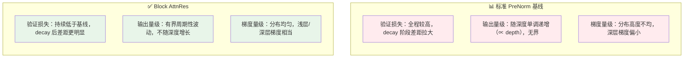

> [!NOTE]
> 梯度分布更均匀意味着网络的所有层都能有效学习，避免了"浅层梯度爆炸、深层梯度消失"的两极化现象，这对极深网络（如超过 100 层）尤其关键。

## 5. 残差连接进化史：AttnRes 与前辈方案的横向对比

### 5.1 残差连接家族谱系

过去十年，改造残差连接的尝试从未停止，但大多数方案在理论优雅性或工程可行性之间只能二选一：

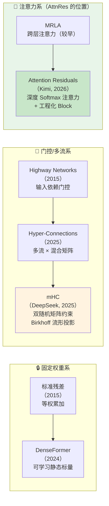

### 5.2 深度聚焦：mHC（DeepSeek）的原理与挑战

mHC 是与 AttnRes 最具可比性的同期方案，两者都在 2025-2026 年间直面"标准残差已不够用"的同一命题，却走出了截然不同的技术路径，值得深入拆解。

**Hyper-Connections 的出发点与暗伤**

Hyper-Connections（HC，字节跳动 Seed，2025）的核心思想是将单一残差流**扩展为 $n$ 条并行流**（默认 $n=4$），用三个可学习混合矩阵控制信息在流之间的路由：

$$\mathbf{x}_{l+1} = H_l^{res} \mathbf{x}_l + (H_l^{post})^\top \mathcal{F}(H_l^{pre} \mathbf{x}_l)$$

其中 $H_l^{res} \in \mathbb{R}^{n \times n}$ 控制残差流之间的混合，$H_l^{pre}$、$H_l^{post}$ 分别控制流的汇聚与分发。这一设计让网络拥有了更丰富的多流表征能力，在小规模实验中性能提升显著。

然而，HC 存在一个在扩展时才显现的致命缺陷：**混合矩阵 $H_l^{res}$ 是无约束的，谱范数可能大于 1**。在单层看来 1–7 倍的增益无害，但乘以 60 层后复合增益可达 $3^{60} \approx 10^{28}$，在 DeepSeek 内部实验中确实观察到约 3000× 的激活放大，导致训练在 12k 步左右出现损失 spike 和梯度范数骤增的灾难性发散。

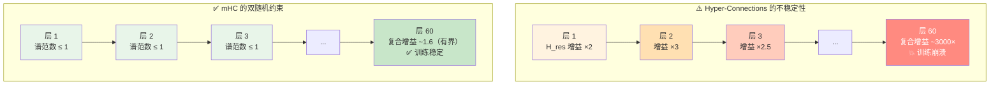


**mHC 的核心解法：Birkhoff 流形投影**

mHC 的解法出人意料地优雅——将混合矩阵 $H_l^{res}$ 投影到 **Birkhoff 多面体**（双随机矩阵流形）上。双随机矩阵满足两个约束：所有元素非负，且所有行和、列和均等于 1。

这一约束带来三重数学保证：

| 保证 | 数学意义 | 实际效果 |
|------|----------|----------|
| **谱范数有界** | $\|H_l^{res}\|_2 \leq 1$，映射非膨胀 | 任意深度的复合增益有界（实测最大 ~1.6） |
| **封闭性** | 双随机矩阵之积仍是双随机矩阵 | 任意深度堆叠均自动满足约束 |
| **凸组合解释** | Birkhoff 多面体是所有置换矩阵的凸包 | 混合操作等价于"软置换"，只重排不放大 |

投影通过 **Sinkhorn-Knopp 算法**在前向传播中实时完成：从任意正矩阵出发（对学习参数取指数），交替将行和归一化为 1，再将列和归一化为 1，迭代 20 次后收敛至双随机矩阵。

```python
# mHC 核心：Sinkhorn-Knopp 投影到 Birkhoff 多面体
# 依赖：pip install torch

def sinkhorn_projection(H_raw: torch.Tensor, iterations: int = 20) -> torch.Tensor:
    """
    将任意矩阵投影到双随机矩阵（Birkhoff 多面体）
    Args:
        H_raw: [n, n] 可学习参数矩阵（未约束）
        iterations: Sinkhorn-Knopp 迭代次数（论文使用 20）
    Returns:
        H_ds: [n, n] 双随机矩阵，所有行和列和均为 1，所有元素 ≥ 0
    """
    # 步骤 1：指数化以保证所有元素非负
    M = torch.exp(H_raw)  # [n, n], 所有元素 > 0
    # 步骤 2：交替归一化行和列（Sinkhorn-Knopp 核心迭代）
    for _ in range(iterations):
        M = M / M.sum(dim=1, keepdim=True)  # 行归一化：每行和 = 1
        M = M / M.sum(dim=0, keepdim=True)  # 列归一化：每列和 = 1
    # 迭代后 M 近似满足双随机约束（谱范数 ≤ 1）
    return M


# mHC 层更新（简化版，省略系统级优化）
class mHCLayer(nn.Module):
    def __init__(self, hidden_dim: int, n_streams: int = 4):
        super().__init__()
        self.n = n_streams
        # 三个混合矩阵的可学习参数（未约束原始值）
        self.H_res_raw = nn.Parameter(torch.eye(n_streams))    # 残差流混合
        self.H_pre_raw = nn.Parameter(torch.ones(1, n_streams) / n_streams)  # 流聚合
        self.H_post_raw = nn.Parameter(torch.ones(n_streams, 1))              # 流分发

    def forward(self, x: torch.Tensor, layer_fn) -> torch.Tensor:
        # 投影到双随机矩阵（保证训练稳定）
        H_res = sinkhorn_projection(self.H_res_raw)   # 双随机矩阵
        H_pre = torch.relu(self.H_pre_raw)            # 非负约束（简化）
        H_post = torch.relu(self.H_post_raw)          # 非负约束（简化）
        # mHC 层更新公式
        x_next = H_res @ x + H_post.T @ layer_fn(H_pre @ x)
        return x_next
```

> [!NOTE]
> Sinkhorn-Knopp 算法本是 1967 年为矩阵数值分析而提出的工具，DeepSeek 将其移植到神经网络前向传播中，成为深度学习中"数学约束 + 工程落地"的优雅案例。20 次迭代在 $n=4$ 的小矩阵上仅需微秒级计算，配合 TileLang 内核融合，额外训练开销仅为 6.7%。

**mHC 的验证规模与基准数据**

mHC 在 DeepSeek-V3 架构基础上，在 3B、9B、27B 三个规模上进行了系统验证：

| 基准 | 基线 | HC | mHC | mHC vs 基线 |
|------|------|-----|------|-------------|
| BBH（思维链推理） | 43.8 | 48.9 | **51.0** | **+7.2** |
| DROP（阅读理解） | 67.2 | 69.8 | **71.5** | **+4.3** |
| GSM8K（小学数学） | 71.3 | 75.6 | **77.9** | **+6.6** |
| MMLU（综合知识） | 68.4 | 70.1 | **71.8** | **+3.4** |

值得注意的是，mHC 不仅优于基线，还优于 HC——双随机约束在稳定训练的同时，通过强制凸组合混合，反而提升了特征融合的质量。

> [!WARNING]
> HC 在 DeepSeek 内部实验中曾在约 12,000 步时出现梯度范数骤增至 300+ 的训练崩溃，这是 mHC 提出的直接动机。在实际工程中，如果使用原始 HC 而未加双随机约束，建议配置梯度裁剪上限（如 1.0）作为保底措施。

### 5.3 AttnRes 与 mHC 的正面对决

两者同根同源（都从"标准残差不够用"出发），却代表了两种截然不同的设计哲学：

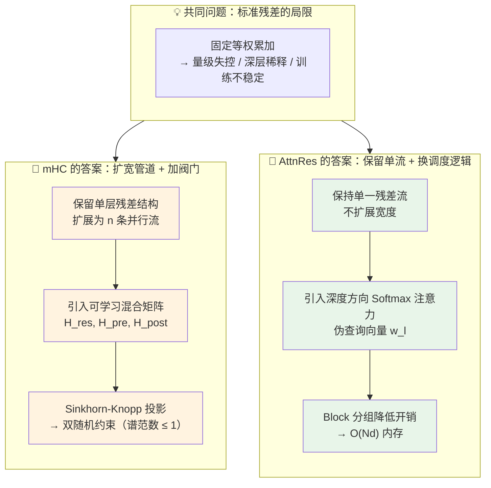

| 对比维度 | mHC（DeepSeek） | AttnRes（Kimi） | 胜出方 |
|----------|-----------------|-----------------|--------|
| **稳定性机制** | Birkhoff 流形投影（数学保证） | Softmax 归一化（权重和=1） | 平手（路径不同） |
| **表征多样性** | ✅ n 流并行，多角度特征 | ❌ 单流，依赖注意力选择 | mHC |
| **内存 I/O / 层** | $34d$（n=4 流） | $5.5d$（N=8 块） | **AttnRes（6× 优势）** |
| **推理延迟** | 较高（n 流前向） | < 2% | **AttnRes** |
| **最大验证规模** | 27B / 1T Tokens | **48B / 1.4T Tokens** | **AttnRes** |
| **工程实现难度** | ⭐⭐⭐⭐ 高（需 Sinkhorn 内核） | ⭐⭐ 低（插件式替换） | **AttnRes** |
| **历史层利用** | ❌ 仅利用相邻层 | ✅ 可检索任意历史块 | **AttnRes** |
| **训练额外开销** | 6.7% | 可忽略 | **AttnRes** |

> [!IMPORTANT]
> **如何在 mHC 和 AttnRes 之间选择？**
> - ✅ 选 **mHC**：你的任务需要丰富的多流并行表征，且有充足的显存预算（DeepSeek 系列架构 + 训练基础设施）
> - ✅ 选 **AttnRes**：你需要一个轻量插件式方案，对内存和推理延迟敏感，或希望在已有架构上以最小改动获得最大增益


### 5.4 全方案综合对比

| 对比维度 | 标准残差 | DenseFormer | HC（字节） | mHC（DeepSeek） | **AttnRes（Kimi）** |
|----------|----------|-------------|------------|-----------------|----------------------|
| 权重类型 | 固定 (=1) | 可学习静态标量 | 可学习动态矩阵 | 双随机约束矩阵 | **Softmax 动态注意力** |
| 输入依赖 | ❌ | ❌ | 部分 ✅ | 部分 ✅ | ✅ 完全内容依赖 |
| 内存 I/O / 层 | $d$ | $L \cdot d$ | $34d$ | $34d$ | **$5.5d$（N=8）** |
| 量级控制 | ❌ | ❌ | ❌（训练崩溃） | ✅ 双随机 | ✅ Softmax 归一化 |
| 历史层跨距 | 仅 -1 | 所有层 | 仅 -1 | 仅 -1 | **任意历史块** |
| 工程实践难度 | ⭐ 极低 | ⭐⭐ 低 | ⭐⭐⭐ 中 | ⭐⭐⭐⭐ 高 | ⭐⭐ 低（插件替换） |
| 大规模验证 | ✅（广泛） | ❌（小规模） | ✅（9B） | ✅（27B） | ✅（**48B, 1.4T Tokens**） |
| 推理额外开销 | 无 | 极小 | 较大 | 较大 | **< 2%** |

> [!IMPORTANT]
> **何时应该考虑 AttnRes？**
> - ✅ 正在训练超过 32 层的深度 Transformer 模型
> - ✅ 发现深层梯度明显弱于浅层，模型深度收益递减
> - ✅ 希望用架构改进替代部分算力投入，对内存/延迟敏感
> - ❌ 对延迟极度敏感（< 0.5%）的推理服务场景需谨慎评估
> - ❌ 模型层数较少（< 24 层）时，PreNorm Dilution 问题不突出，收益有限


## 6. 总结

Attention Residuals 的价值不仅在于提升了 Benchmark 数字，更在于它揭示了一个更深刻的规律：**深度方向的信息传递一直处于和序列方向 RNN 时代类似的局限中，而 AttnRes 完成了深度维度上的"Attention 化"**。

| 核心概念 | 一句话解释 |
|---------|-----------|
| **PreNorm Dilution** | 标准残差累加导致深层隐状态量级无限增长，稀释各层贡献 |
| **Full AttnRes** | 每层对所有前驱层做 Softmax 注意力聚合，理论上界 |
| **Block AttnRes** | 分块降低内存开销，性能接近 Full AttnRes，工程可行 |
| **伪查询向量** | 每层一个可学习固定参数，实现内容依赖的深度检索 |
| **1.25× 计算等效** | 架构改进等同于免费获得 25% 更多算力 |

> [!TIP]
> **学习路径建议**：
> 1. 先理解标准 Transformer 残差连接的原理（[Attention Is All You Need](https://arxiv.org/abs/1706.03762)）
> 2. 阅读 ResNet 原论文（arXiv:1512.03385）理解 PreNorm Dilution 的历史背景
> 3. 精读 Kimi AttnRes 论文（arXiv:2603.15031）重点关注扩展律实验与消融设计
> 4. 对比阅读 mHC（arXiv:2512.24880）理解两条技术路线的设计取舍
> 5. 关注后续工作（MUDDFormer、深度方向注意力的更多变体）


## 参考资料

### 核心论文

| 论文 | 作者/机构 | 年份 | 主要贡献 |
|------|-----------|------|----------|
| [Attention Residuals](https://arxiv.org/abs/2603.15031) | Kimi Team | 2026 | 深度方向 Softmax 注意力替代固定残差 |
| [Kimi Linear](https://arxiv.org/abs/2510.26692) | Kimi Team | 2025 | 高效线性注意力 MoE 架构（AttnRes 的集成基础） |
| [DenseFormer](https://arxiv.org/abs/2402.02622) | Pagliardini et al. | 2024 | 跨层密集连接 + 可学习静态标量权重 |
| [Hyper-Connections](https://arxiv.org/abs/2409.19606) | Zhu et al.（字节跳动 Seed） | 2025 | 多流残差扩展，ICLR 2025 |
| [mHC: Manifold-Constrained Hyper-Connections](https://arxiv.org/abs/2512.24880) | DeepSeek-AI（Zhenda Xie 等） | 2025 | Birkhoff 流形投影约束混合矩阵，解决 HC 训练崩溃问题 |
| [Deep Residual Learning](https://arxiv.org/abs/1512.03385) | He et al. | 2015 | 残差连接原始论文（ResNet） |

### 推荐资源

- [Attention Residuals 官方 GitHub](https://github.com/MoonshotAI/Attention-Residuals)
- [论文 PDF 全文（arXiv）](https://arxiv.org/pdf/2603.15031)
- [Kimi 官方 X 发布公告](https://x.com/Kimi_Moonshot/status/2033378587878072424)
