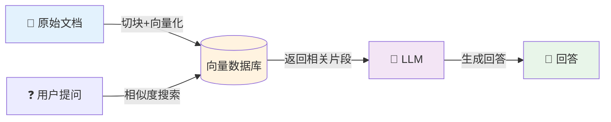
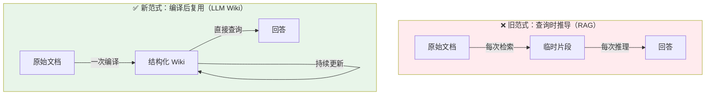
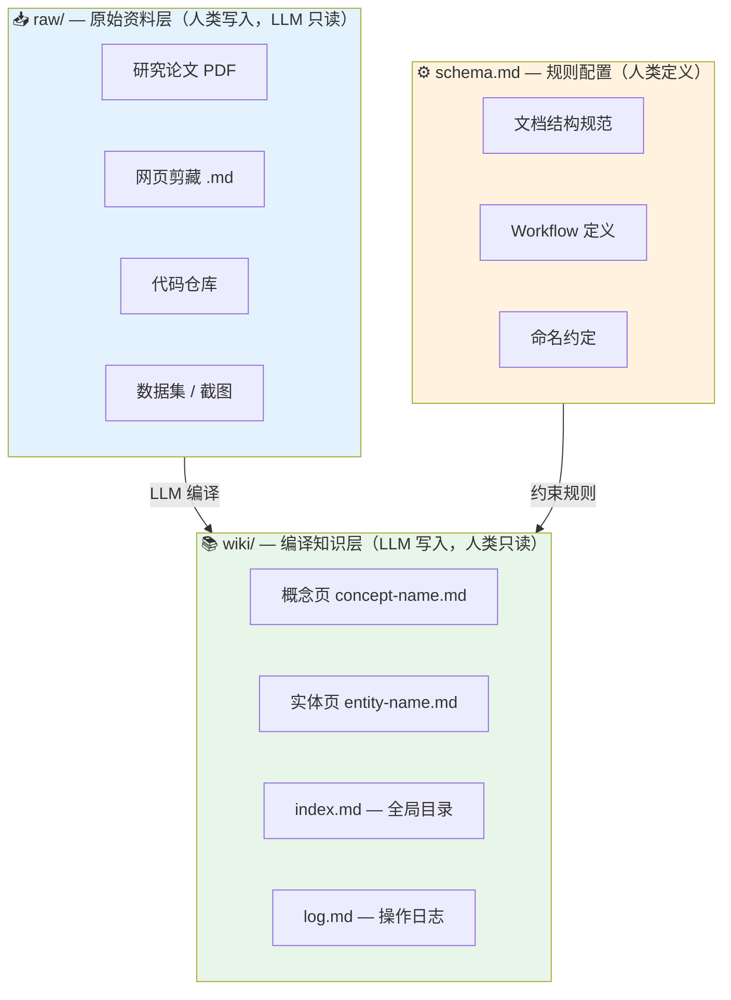
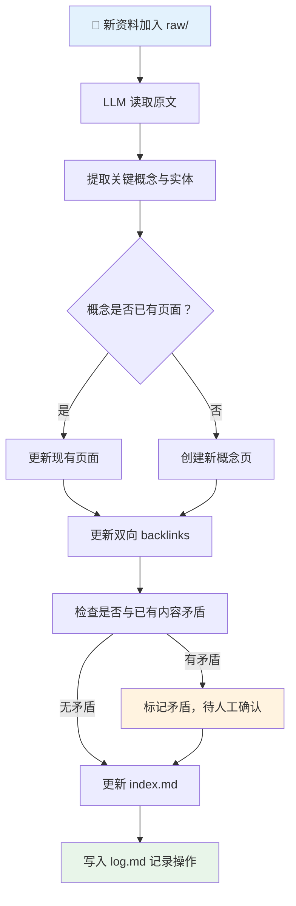
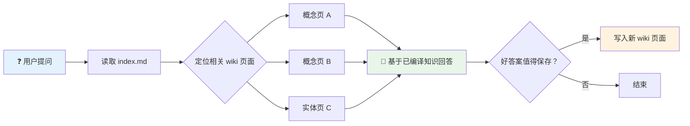
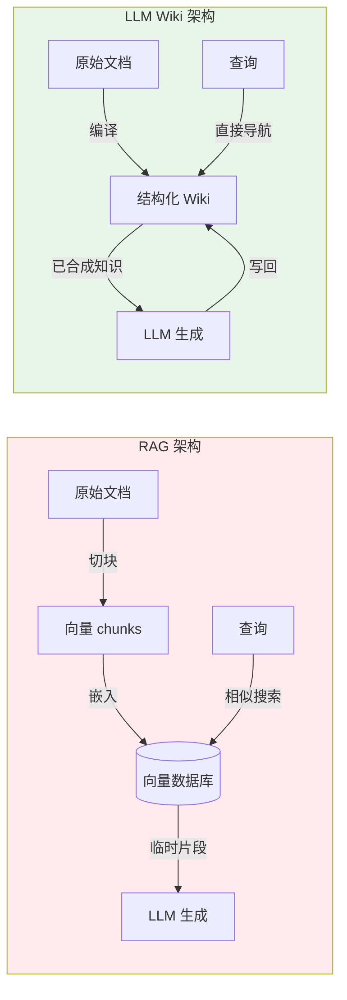
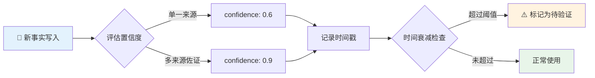

> RAG 每次查询都在从零重新推导知识，而 LLM Wiki 选择一次编译、永久复用。Karpathy 在 2026 年 4 月提出的这一范式，正在重新定义我们与 AI 协作管理知识的方式。本文将带你深入理解 LLM Wiki 的核心架构、运作机制与实现方案，并厘清它适合哪些场景、又在哪里有局限。
>
> 📌 **适合人群**：AI 初学者、研究人员、工程师、知识管理爱好者


<!--
  MindMapFloat 填写规范：
  - 节点是"知识维度/主题分类"，不是章节标题的复制
  - 完成正文后填写
-->
<MindMapFloat title="LLM Wiki 知识图谱">

```mindmap-data
# LLM Wiki
## 为什么需要
- RAG 无积累的根本缺陷
- 每次查询重新推导的成本
- 人工维护知识库的现实困境
## 核心架构
- raw/ 原始资料层（不可变）
- wiki/ 编译知识层（LLM 维护）
- schema 配置文件（规则约束）
## 运作机制
- 编译：读取并整合新资料
- 查询：直接从结构化知识检索
- 健康检查：自动发现矛盾与缺口
## 与 RAG 的本质差别
- 编译时 vs 查询时知识组装
- 有状态积累 vs 无状态重新推导
- 适用规模对比
## 局限与注意事项
- 幻觉固化风险
- 大规模场景的边界
- 知识生命周期管理
```

</MindMapFloat>

## 关于本文档

本文围绕 Karpathy 于 2026 年 4 月提出的 LLM Wiki 方案，从痛点出发，逐步拆解其架构与运作机制，并对比 RAG 的核心差异，给出可落地的实现代码与最佳实践建议。

- ✅ 深度解析 RAG 的根本局限与 LLM Wiki 的核心思想
- ✅ 三层目录架构（raw / wiki / schema）的完整拆解
- ✅ Ingest、Query、Lint 三大操作的运作流程图
- ✅ LLM Wiki vs RAG 的全维度对比与适用场景判断
- ✅ 可运行的 Python 实现代码与关键最佳实践

## 1. RAG 的根本困境：每次都在从零开始

### 1.1 RAG 是怎么工作的？

想象你雇了一位助理，但他每次上班都完全失忆。你今天告诉他公司架构，明天他还要重新问一遍。传统 RAG 知识系统就是这样：每次查询都从原始文档中临时检索片段，再交给 LLM 回答，没有任何知识被"记住"。



具体流程是：文档被切成任意大小的"块"，转为向量嵌入存入数据库；查询时做相似度搜索，找出最相关的块，塞进 LLM 上下文，然后生成答案。

### 1.2 RAG 的三大核心局限

| 局限 | 具体表现 | 真实案例 |
|------|----------|----------|
| **无积累性** | 每次查询都重新推导，没有任何知识被保留 | 今天问过的复杂问题，明天还要花同样的 token 重新推理 |
| **上下文丢失** | 会话结束即"失忆"，历史分析成果归零 | Vibe coding 过程中，切换 session 后 AI 完全不记得之前的架构决策 |
| **合成能力弱** | 需要跨 5 份以上文档综合推理时，片段检索极易遗漏 | 竞争对手分析需要从 20 份报告中提炼关系，RAG 只能找最相似的几块 |

> [!IMPORTANT]
> RAG 的核心矛盾：它擅长"找到某一处答案"，但无法做到"积累与理解知识体系"。知识始终是分散的原料，而非结构化的产品。


### 1.3 LLM Wiki 的核心思想：知识可以被编译

Karpathy 的洞察来自一个编程类比：**原始文档是源代码，Wiki 是编译产物**。

编译只做一次，之后所有程序都运行编译后的版本，而不是每次都重新编译。LLM Wiki 把这个逻辑应用到知识管理：LLM 读取原始资料后，主动构建一套结构化、相互关联的 Markdown 知识库，所有后续查询都基于这个已编译的知识库回答。




## 2. LLM Wiki 的三层架构

### 2.1 整体目录结构

整个系统只有三个核心组成部分，刻意保持极简，让任何 LLM Agent 都能无需定制工具直接操作：




### 2.2 三层的职责与边界

| 层级 | 目录 | 谁写入 | 谁读取 | 核心原则 |
|------|------|--------|--------|----------|
| **原始资料层** | `raw/` | 人类（只追加） | LLM（只读） | 不可变，永久保存原始来源 |
| **编译知识层** | `wiki/` | LLM（负责写）| 人类（负责读）| LLM 拥有写权限，人类不直接编辑 |
| **规则配置层** | `schema.md` | 人类定义 | LLM 遵循 | 规定格式、约定和 Workflow |

> [!NOTE]
> `raw/` 是不可变的事实来源。LLM 读取它但从不修改它——这是系统可信赖性的基础。所有追溯链条都终止在 `raw/` 中可以被人类直接阅读的 Markdown 文件。


### 2.3 schema.md：赋予 Wiki 记忆与规则

schema 文件是整个系统的"宪法"，定义了 LLM 如何构建和维护 Wiki。一个典型的 schema 包含：

```markdown
# Wiki Schema

## 文档结构
每个 wiki 页面必须包含：
- title: 条目名称
- summary: 2-3 句核心摘要
- tags: 主题标签列表
- related: 相关页面的 [[wiki-links]]
- sources: 引用的 raw/ 文件列表

## Workflow 定义

### ingest（摄入新资料）
1. 读取 raw/ 中的新文件
2. 提取关键概念和实体
3. 为每个新概念创建或更新 wiki 页面
4. 更新所有受影响页面的 related 字段
5. 记录操作到 log.md

### query（查询）
1. 先读取 index.md 定位相关页面
2. 加载相关 wiki 页面（不查 raw/）
3. 基于已编译的知识生成回答

### lint（健康检查）
检测：孤儿页面、断链、矛盾声明、过期信息
```

## 3. 三大核心操作

### 3.1 Ingest：知识的编译过程

Ingest 是 LLM Wiki 与 RAG 差距最大的地方。当一份新资料加入时，LLM 不是简单地做索引，而是执行完整的"编译"——理解、提炼、整合、建立关联。



一份资料的摄入可能触及 10-15 个 wiki 页面。比如加入一篇关于 Tesla 电池技术的论文：Tesla 公司页面被更新，电池技术页面被更新，固态电池页面被新建，充电效率页面建立了到电池技术的反向链接。


### 3.2 Query：从知识库直接检索

查询时，LLM 不再翻阅原始文档，而是在已经结构化的 Wiki 中导航，速度和质量都更高：



> [!TIP]
> **查询结果也可以成为新的 wiki 页面。** 一次好的分析探索，写回 Wiki 后会让下一次查询更快、更准确——这就是"知识复利"的来源。


### 3.3 Lint：Wiki 的自我修复

Karpathy 定期运行的"健康检查"让 Wiki 保持长期健康，自动发现四类问题：

| 问题类型 | 检测内容 | 处理方式 |
|----------|----------|----------|
| **孤儿页面** | 没有任何其他页面链接的 wiki 页 | 建议补充 related 链接或删除 |
| **断链** | [[wiki-links]] 指向不存在的页面 | 自动创建空页面或修复链接 |
| **矛盾声明** | 两个页面对同一事实有不同描述 | 标记 `⚠️ 矛盾` 待人工裁定 |
| **待创建页面** | 正文中引用了某概念但没有对应页面 | 列出建议创建清单 |


## 4. LLM Wiki vs RAG：本质差异对比

### 4.1 技术架构层面的根本差异



### 4.2 全维度对比表

| 对比维度 | RAG | LLM Wiki |
|----------|-----|----------|
| **知识组装时机** | 查询时（Query-time） | 摄入时（Compile-time） |
| **状态性** | 无状态，每次从零推导 | 有状态，知识持续积累 |
| **基础设施复杂度** | 高：向量数据库 + 嵌入管道 | 极低：仅文件系统 + Markdown |
| **可解释性** | 低：向量空间是黑盒 | 高：每条知识可追溯到具体文件 |
| **跨文档综合** | 弱：受限于检索精度 | 强：编译阶段已完成跨文档整合 |
| **适用规模** | 无上限（企业级） | ≤10 万 tokens 的中等规模最优 |
| **适合人群** | 企业级多用户系统 | 个人研究者、小团队 |
| **幻觉风险传播** | 限于单次回答 | 可能扩散到整个 Wiki |

> [!IMPORTANT]
> **何时选择 LLM Wiki？**
> - ✅ 个人研究项目（≤100 篇文章，≤40 万字）
> - ✅ 需要跨文档综合推理的知识密集型任务
> - ✅ 希望零基础设施、完全本地控制
> - ❌ 需要多用户协作、权限管理的企业场景
> - ❌ 知识库超过 10 万 tokens 且频繁增量更新


## 5. 实际应用场景与局限边界

### 5.1 最适合 LLM Wiki 的场景

| 场景 | 为什么适合 | 实现要点 |
|------|-----------|----------|
| **个人研究项目** | 知识需要跨论文综合，且作者自己是唯一用户 | 用 Obsidian Web Clipper 快速摄入网页文章 |
| **竞争分析** | 需要持续追踪多家公司、相互比对 | 为每家公司建一个实体页，Lint 发现矛盾更新 |
| **长期代码项目** | 架构决策、依赖关系需要跨 session 保留 | `wiki/` 保存决策记录，`CLAUDE.md` 引用 Wiki |
| **课程学习笔记** | 概念之间关联复杂，需要持续补充 | 每节课后摄入笔记，让 LLM 自动建立概念关联 |
| **尽职调查** | 多维度信息需要综合判断 | 为目标公司、竞争对手各建实体页 |


### 5.2 不适合的场景与替代建议

> [!CAUTION]
> **以下场景不建议使用 LLM Wiki：**
> - **超大规模知识库（>100 万 tokens）**：索引文件无法完整放入上下文窗口，此时应考虑 RAG 或 GraphRAG
> - **多用户协作场景**：缺乏访问控制和并发写入保护，需要引入 Git 工作流或企业级解决方案
> - **实时更新需求**：Ingest 需要一定时间，不适合毫秒级数据同步场景
> - **高度敏感数据**：若对本地存储有合规限制，纯文件系统方案需要额外加密层


## 6. 关键风险：幻觉固化与知识生命周期

### 6.1 幻觉固化的危险

LLM Wiki 最重要的风险是：**一旦 LLM 将错误信息编译进 Wiki，这个错误会随着交叉引用扩散到整个知识库**，而不像 RAG 那样仅影响单次回答。

| 风险 | 在 RAG 中的影响 | 在 LLM Wiki 中的影响 |
|------|----------------|---------------------|
| LLM 幻觉 | 仅影响单次回答 | 可能扩散到 10-15 个关联页面 |
| 错误来源文档 | 下次检索可能不召回 | 编译后永久影响概念理解 |
| 过期信息 | 新文档加入后自动稀释 | 旧结论可能长期保留 |

> [!WARNING]
> **缓解策略**：定期执行 Lint 检查矛盾声明；对关键结论建立 `confidence` 标注；为每个 wiki 页面保留 `sources` 字段，允许人类随时核查原始依据。


### 6.2 知识生命周期管理

社区在 Karpathy 原始方案基础上提出了 v2 改进：为每条关键事实增加**置信度得分**和**时间戳**，置信度随时间衰减、随多来源佐证而增强。这将 Wiki 从"平等权重的声明集合"升级为"有可信度层次的动态知识模型"。




## 7. 总结


| 核心概念 | 一句话解释 |
|---------|-----------|
| **LLM Wiki** | 让 LLM 主动编译和维护结构化知识库，而非每次查询时临时推导 |
| **编译 vs 检索** | 知识在摄入时整合一次，后续查询直接复用，不再重新推导 |
| **三层架构** | raw（原始来源）→ wiki（编译产物）→ schema（规则） |
| **Ingest** | 摄入新资料并触发跨页面更新的编译操作 |
| **Lint** | 定期扫描矛盾、断链、孤儿页面的健康检查操作 |
| **幻觉固化** | LLM 错误写入 Wiki 后会通过交叉引用扩散的风险 |

> [!TIP]
> **学习路径建议**：
> 1. 先从一个小主题（≤20 篇文章）开始，手动摄入几份资料，感受 Wiki 的积累效果
> 2. 用 Claude Code 或 Cursor 配置 `CLAUDE.md`，让 Agent 自动执行 Ingest 和 Lint
> 3. 积累到 50 页以上后，尝试用 Query 操作做跨文档综合分析，对比 RAG 的质量差异
> 4. 长期使用后，为关键页面引入 confidence 评分，防止知识腐烂


## 8. 参考资料

### 核心资料

| 来源 | 作者/机构 | 年份 | 主要内容 |
|------|-----------|------|----------|
| [LLM Knowledge Bases Gist](https://gist.github.com/karpathy/442a6bf555914893e9891c11519de94f) | Andrej Karpathy | 2026 | LLM Wiki 原始方案设计文档 |
| [LLM Wiki Open Source 实现](https://github.com/lucasastorian/llmwiki) | lucasastorian | 2026 | 完整的 Web 应用实现，支持 MCP 接入 Claude |
| [LLM Wiki v2 扩展方案](https://gist.github.com/rohitg00/2067ab416f7bbe447c1977edaaa681e2) | rohitg00 | 2026 | 生产环境经验：置信度评分、知识生命周期 |

### 推荐延伸阅读

- [VentureBeat：Karpathy LLM Knowledge Base 深度报道](https://venturebeat.com/data/karpathy-shares-llm-knowledge-base-architecture-that-bypasses-rag-with-an)
- [LLM Wiki vs RAG 企业级对比分析](https://atlan.com/know/llm-wiki-vs-rag-knowledge-base/)
- [MIT Technology Review 中文版报道](https://www.mittrchina.com/news/detail/16202)
