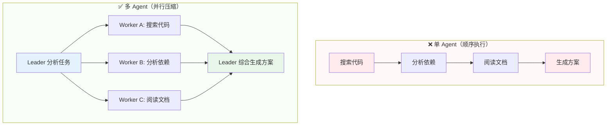
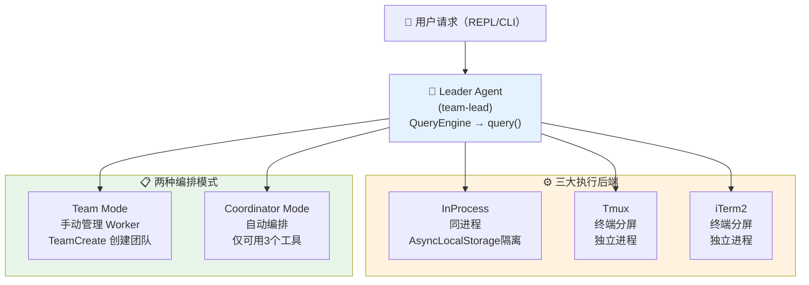
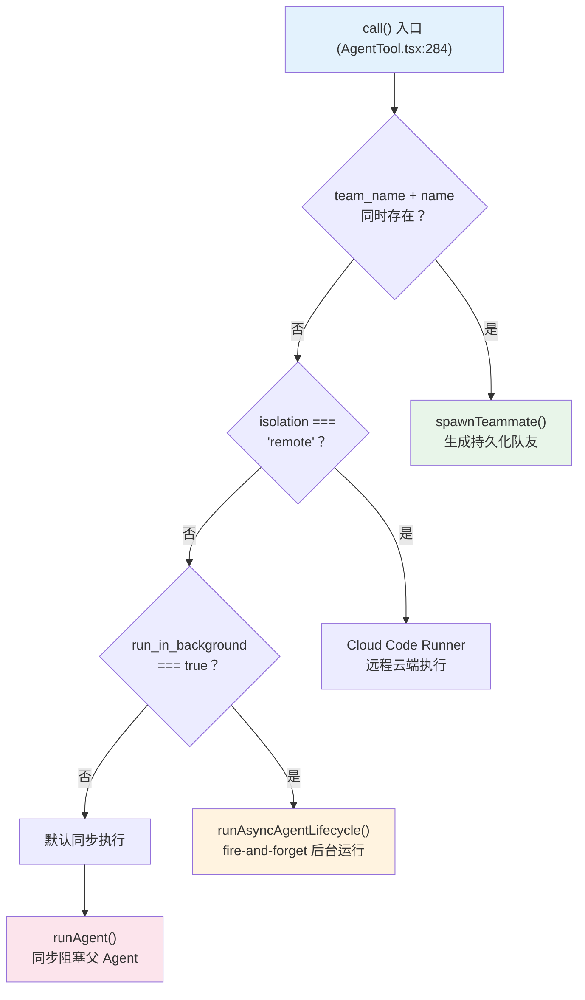
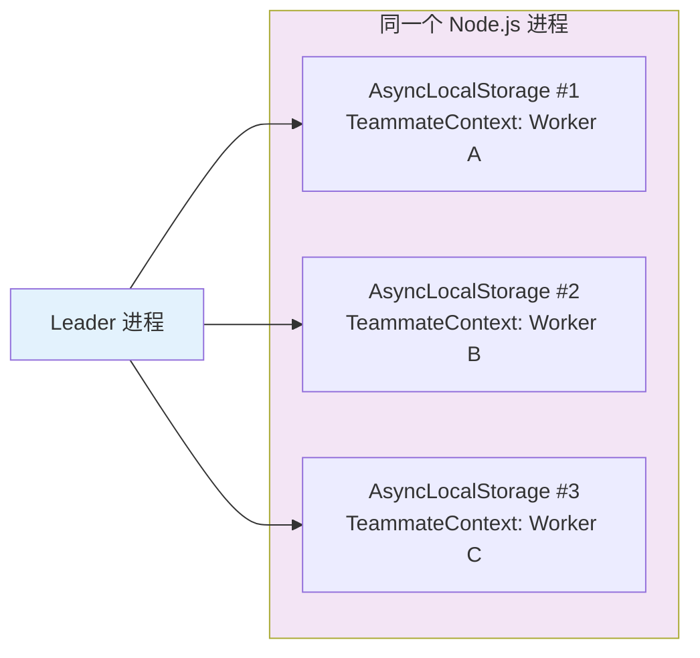
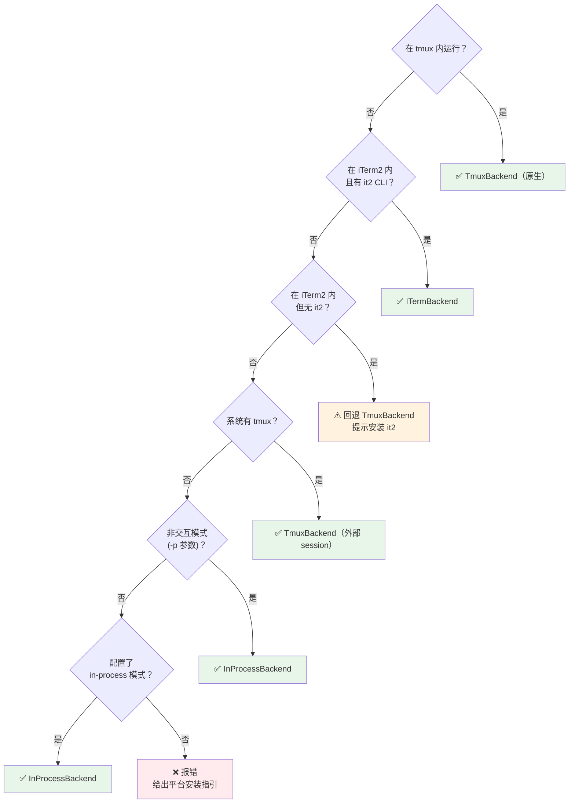
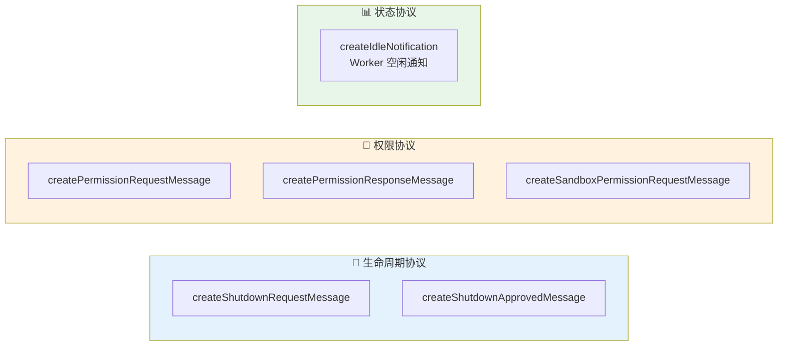
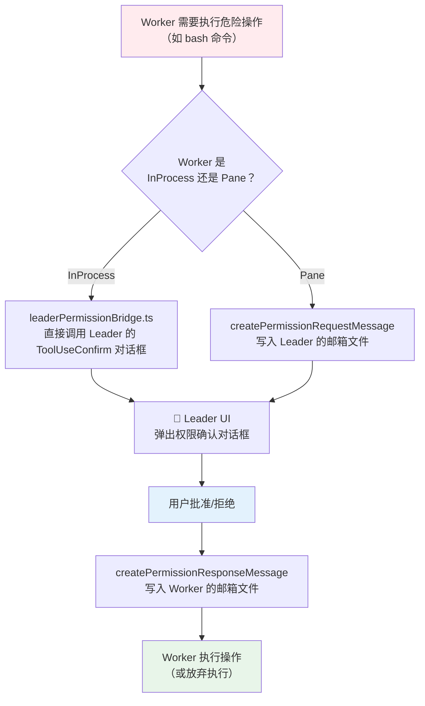
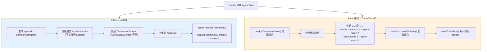
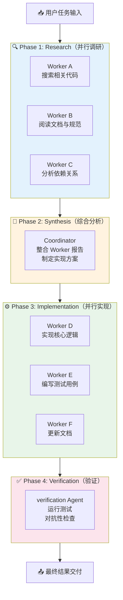
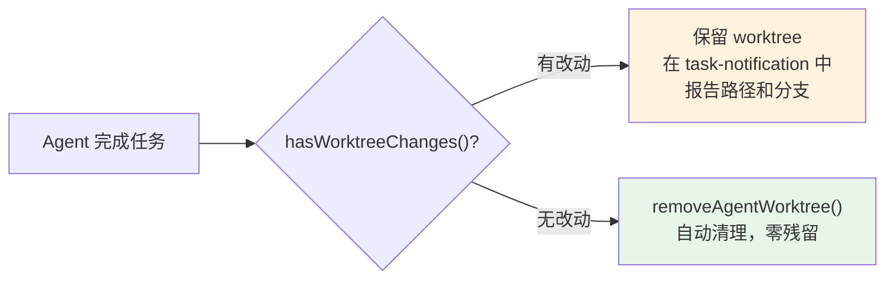

> 2026 年 3 月 31 日，Anthropic 因一行遗漏的 `.npmignore` 配置，意外将 Claude Code v2.1.88 的完整源码打包进 npm 包。512,000 行 TypeScript、1,884 个文件，数小时内被镜像到 GitHub，并在社区引发了 AI 工具史上规模最大的一次架构"考古"。本文基于泄露源码中与多 Agent 相关的约 **13,700 行核心代码**，系统还原 Claude Code 的 Leader-Worker 编排架构——从 Agent 定义加载、三大执行后端选择，到文件邮箱通信、权限委托链，直到 Coordinator 自动编排模式与 Git Worktree 隔离设计，力求做到"知其然，更知其所以然"。
>
> 📌 **核心参考**：[How we built our multi-agent research system](https://www.anthropic.com/engineering/multi-agent-research-system)（Anthropic Engineering Blog）
>
> 📌 **适合人群**：对 AI Agent 架构感兴趣的后端开发者、AI 应用工程师


<MindMapFloat title="Claude Code 多Agent知识图谱">

```mindmap-data
# Claude Code 多Agent架构
## 为什么需要多Agent
- 单 Agent 上下文窗口瓶颈
- 并行执行提升吞吐量
- 专业化角色分工更精准
## 核心编排模型
- Leader-Worker 模式
- Team Mode 持久化协作
- Coordinator Mode 自动编排
## 三大执行后端
- InProcess（AsyncLocalStorage隔离）
- Tmux（终端分屏独立进程）
- iTerm2（Python自动化控制）
## 通信与隔离机制
- 文件邮箱（JSON + 文件锁）
- SendMessage 路由逻辑
- Git Worktree 文件隔离
## 安全与权限设计
- 权限始终由人类把控
- 多层工具过滤机制
- 优雅降级与容错
```

</MindMapFloat>

## 关于本文档

本文系统解析 Claude Code 多 Agent 架构的设计全貌，所有分析均基于泄露源码中的实际函数、常量和类型定义，而非推测。无论你是要构建自己的多 Agent 系统，还是理解业界顶级 AI 编码工具的内部运作，都能从中获得第一手参考。

- ✅ Leader-Worker 架构的整体设计与两种编排模式（Team / Coordinator）
- ✅ AgentTool 的路由决策机制与 AgentDefinition 类型系统
- ✅ InProcess、Tmux、iTerm2 三大后端的实现原理与选择逻辑
- ✅ 文件邮箱通信协议与 SendMessage 的完整路由逻辑
- ✅ 权限委托链、Git Worktree 隔离与 Worker 完整生命周期

## 1. 为什么单 Agent 不够用？

### 1.1 单 Agent 的上下文窗口瓶颈

想象一下，你让一个员工同时负责市场调研、代码开发、测试验收和文档撰写。他会在各个任务之间频繁切换，大量注意力被"记住上下文"所消耗，真正用于思考的认知资源反而不足。大型语言模型的"上下文窗口"正是这种"工作记忆"的物理边界。

对于 Claude Code 要处理的真实任务——横跨多个文件的大型重构、跨模块的 Bug 修复、需要并行搜索代码库与文档的架构分析——单个 Agent 面临三个硬限制：

| 限制 | 具体表现 | 真实案例 |
|------|----------|----------|
| **上下文饱和** | 代码 + 历史对话 + 工具调用日志挤满窗口，中段内容被"遗忘" | 修改大型单体应用时，前半段的函数签名被忽略 |
| **顺序执行瓶颈** | 只能一步步完成，无法并行探索多个代码路径 | 同时搜索 3 个库的源码需要串行等待 |
| **工具过载** | 工具数量过多会增加系统提示词长度并降低路由准确率 | Agent 错误调用了相似名称的写入工具 |

> [!IMPORTANT]
> Anthropic 自己的多 Agent 研究系统实测数据显示：多 Agent 并行架构相比单 Agent 串行方案，在复杂信息检索任务上性能提升超过 **90%**。核心原因正是"分工并行"解放了上下文利用率。

### 1.2 并行即压缩：多 Agent 的本质

Anthropic 工程博客中有一句精辟的定义：

> "搜索的本质是压缩——从海量数据库中提取洞见。子 Agent 通过并行搜索问题的不同维度并压缩最重要的内容，实现了这种压缩。"

这里的"子 Agent"不是比喻，而是真实运行的、拥有独立上下文窗口的 Claude 实例。每个子 Agent 只看到自己负责的那片信息空间，Leader 负责统筹这些压缩后的洞见，输出最终结论。这就是 Claude Code 选择 Leader-Worker 架构的根本动机。




## 2. 整体架构：Leader-Worker + 两种编排模式

### 2.1 核心骨架一览

Claude Code 的多 Agent 系统以 **Leader-Worker 模型**为骨架。Leader 负责接收用户请求、拆解任务、派遣 Worker；Worker 负责执行具体子任务，通过通信机制向 Leader 汇报。整个系统有三种执行后端（InProcess、Tmux、iTerm2）和两种编排模式（Team Mode、Coordinator Mode）。




### 2.2 两种编排模式的定位差异

理解两种编排模式的区别，有助于知道什么场景下 Claude Code 如何"思考协作"。

| 维度 | Team Mode | Coordinator Mode |
|------|-----------|------------------|
| **启动方式** | `TeamCreate` + 手动派 Worker | 环境变量 `CLAUDE_CODE_COORDINATOR_MODE=1` |
| **控制权** | Leader 完全手动管理 | Coordinator 自动化编排 |
| **可用工具** | 全部工具 | 仅 `Agent`、`TaskStop`、`SendMessage` |
| **Worker 生命周期** | 手动启动/关闭 | 自动 spawn / 自动回收 |
| **适用场景** | 长期持久化协作团队 | 单次复杂任务自动分解执行 |
| **配置存储** | `~/.claude/teams/{name}/config.json` | 无持久化配置，按需创建 |

> [!TIP]
> **类比理解**：Team Mode 像"组建一支固定团队，每个人有自己的工位"；Coordinator Mode 像"临时招募外包团队，任务完成即解散"。


## 3. Agent Tool：所有子 Agent 的统一入口

`src/tools/AgentTool/AgentTool.tsx`（约 800 行）是整个多 Agent 系统的门卫，负责解析调用参数并路由到正确的执行路径。

### 3.1 AgentDefinition 类型系统

每一个 Agent（无论内置还是自定义）都遵循同一套类型约束。这个设计让 Agent 系统具备良好的扩展性：

```typescript
// src/tools/AgentTool/loadAgentsDir.ts
type AgentDefinition = {
  agentType: string           // 唯一标识，如 'Explore'、'verification'
  whenToUse: string           // 何时使用的描述（供 Leader 选型参考）
  tools: string[]             // 可用工具，['*'] 表示全部工具
  disallowedTools: string[]   // 明确禁用的工具列表
  model: string               // 模型选择，'haiku'|'sonnet'|'opus'|'inherit'
  permissionMode: string      // 权限模式，如 'plan'|'acceptEdits'
  maxTurns: number            // 最大对话轮次，防止 Agent 无限循环
  background: boolean         // 是否后台异步运行
  isolation: 'worktree'       // 文件系统隔离方式
  getSystemPrompt()           // 系统提示词生成函数
}
```

Agent 有三种来源，按以下优先级加载（后者覆盖前者）：

```
built-in < plugin < userSettings < projectSettings < flagSettings < policySettings
```

| 来源 | 位置 | 示例 |
|------|------|------|
| `BuiltInAgentDefinition` | 源码内置 | `Explore`、`Plan`、`verification` |
| `CustomAgentDefinition` | `.claude/agents/*.md` | 用户自定义专家 Agent |
| `PluginAgentDefinition` | 插件包提供 | 第三方扩展 Agent |

### 3.2 内置 Agent 类型全览

源码中预置了 7 种内置 Agent，各自有严格的工具权限和模型配置：

| Agent 类型 | 模型 | 工具权限 | 设计意图 |
|-----------|------|---------|---------|
| `general-purpose` | 默认 | `['*']` 全部 | 通用兜底 Agent |
| `Explore` | haiku | 只读工具 | 轻量代码探索，禁止嵌套 Agent |
| `Plan` | inherit | 只读工具 | 架构规划，禁止写入 |
| `verification` | inherit | 只读 | 后台对抗性测试（红色标识） |
| `statusline-setup` | sonnet | Read, Edit | 状态栏配置专用 |
| `fork`（合成） | inherit | `['*']` | 继承父上下文，权限冒泡 |
| `claude-code-guide` | — | 有限工具 | Claude Code 内置使用指南 |

> [!NOTE]
> `Explore` Agent 强制使用更轻量的 `haiku` 模型，这不是省钱的权宜之计，而是刻意的专业化设计——**探索型任务不需要大模型的推理深度，用小模型高并发探索效率更高**。


### 3.3 路由决策树：call() 入口的四条分叉路

AgentTool 收到调用后，按以下决策树将请求路由到不同的执行路径：



## 4. 三大执行后端：从同进程到终端分屏

这是 Claude Code 架构中最有工程美感的部分——同一套 Agent 逻辑，可以运行在三种完全不同的物理环境中，且自动降级到最优可用方案。

### 4.1 InProcess 后端：零 IPC 开销的同进程隔离

**文件**：`src/utils/swarm/backends/InProcessBackend.ts`（339 行）

InProcess 是最轻量的执行方式：所有 Worker 运行在**同一个 Node.js 进程**中，通过 `AsyncLocalStorage` 实现上下文隔离，无需任何进程间通信（IPC）。

```typescript
// src/utils/teammateContext.ts（96 行）
// AsyncLocalStorage 实现进程内零开销隔离
const teammateContextStorage = new AsyncLocalStorage<TeammateContext>()

// 每个 Worker 运行在独立的 async 上下文中
function runWithTeammateContext(context: TeammateContext, fn: () => T): T {
  return teammateContextStorage.run(context, fn)
}

// 任何层级的函数都可以查询"我是哪个 Worker"
function isInProcessTeammate(): boolean {
  return teammateContextStorage.getStore() !== undefined
}
```

**核心机制**：`AsyncLocalStorage` 是 Node.js 的原生 API，它让同一个异步调用栈上的所有函数共享同一个"上下文存储"，而不同调用栈之间完全隔离。效果类似线程局部存储（Thread Local Storage），但适用于 JavaScript 的异步模型。



**权限处理的特殊设计**：InProcess Worker 的危险操作权限请求，通过 `leaderPermissionBridge.ts` 直接转发到 Leader 的 UI 对话框，无需文件邮箱中转——这是性能与安全之间的精巧平衡。


### 4.2 Tmux 后端：真正的独立进程分屏

**文件**：`src/utils/swarm/backends/TmuxBackend.ts`（764 行）

每个 Worker 是一个**独立的 `claude` CLI 进程**，运行在 tmux 的独立 pane 中。这意味着每个 Worker 有自己的进程、内存空间和 Node.js 运行时——彻底的隔离，但也有 IPC 开销。

Tmux 后端支持两种布局：

```
【Leader 在 tmux 内】         【Leader 在 tmux 外】
┌──────────┬─────────┐       ┌─────────┬─────────┐
│          │Worker A │       │Worker A │Worker B │
│  Leader  ├─────────┤       ├─────────┼─────────┤
│  (30%)   │Worker B │       │Worker C │Worker D │
│          ├─────────┤       └─────────┴─────────┘
│          │Worker C │         tiled 布局
└──────────┴─────────┘         独立 session
  main-vertical 布局            claude-swarm-{pid}
```

几个值得关注的工程细节：

- **`acquirePaneCreationLock()`**：序列化并行 spawn 操作，防止多个 Worker 同时创建 pane 引发竞态条件
- **200ms 延迟**：等待 shell 的 rc 文件（`.bashrc`、`.zshrc`）完成加载，确保 PATH 等环境变量可用
- **`hidePane()`/`showPane()`**：通过 `break-pane`/`join-pane` 实现 Worker 的视觉隐藏与恢复

### 4.3 iTerm2 后端：macOS 原生终端控制

**文件**：`src/utils/swarm/backends/ITermBackend.ts`（370 行）

iTerm2 后端通过 `it2` CLI（Python 自动化工具）控制 iTerm2 的分屏行为。

| 特性 | Tmux 后端 | iTerm2 后端 |
|------|-----------|-------------|
| 首 Worker 布局 | main-vertical | 垂直分割 |
| 后续 Worker 布局 | 追加到右侧 | 水平分割 |
| 死会话恢复 | N/A | split 失败时验证并重试 |
| 隐藏/显示 pane | ✅ 支持 | ❌ `supportsHideShow = false` |
| 边框颜色 | 支持 | no-op（避免频繁启动 Python） |

> [!NOTE]
> iTerm2 后端的 `setPaneBorderColor` 和 `rebalancePanes` 被刻意实现为空操作（no-op）——因为每次调用都需要启动一个 Python 进程，频繁调用的性能代价远超视觉收益。这是务实的工程权衡。

### 4.4 后端自动选择：优雅降级的瀑布逻辑

`src/utils/swarm/backends/registry.ts` 的 `detectAndGetBackend()` 实现了一套"优雅降级"逻辑，自动选择当前环境中最合适的执行后端：




## 5. 核心通信机制：文件邮箱协议

Claude Code 选择了一个看起来"朴素"但极为可靠的通信方案——**基于 JSON 文件 + 文件锁的邮箱系统**。

### 5.1 邮箱的物理结构

每个 Agent 拥有一个专属的 JSON 邮箱文件：

```
~/.claude/teams/{team_name}/inboxes/{agent_name}.json
```

消息的数据结构非常简洁：

```typescript
// src/utils/teammateMailbox.ts（1,183 行）
type TeammateMessage = {
  from: string       // 发送者名称
  text: string       // 消息正文
  timestamp: string  // ISO 时间戳
  read: boolean      // 是否已读（轮询时过滤未读）
  color?: string     // 发送者 UI 颜色（用于终端着色）
  summary?: string   // 5-10 字摘要（用于 Coordinator 跟踪进度）
}
```

> [!TIP]
> 为什么不用 Redis 或消息队列？文件邮箱的优势在于：**零依赖**（不需要用户安装额外服务）、**天然持久化**（进程崩溃后消息不丢失）、**可调试**（开发者可以直接用文本编辑器查看消息内容）。


### 5.2 核心操作：原子写入与文件锁

| 函数 | 作用 | 关键实现 |
|------|------|----------|
| `writeToMailbox()` | 原子写入消息 | `proper-lockfile` 文件锁，10 次重试，5-100ms 随机退避 |
| `readMailbox()` | 读取所有消息 | 直接解析 JSON 文件 |
| `readUnreadMessages()` | 获取未读消息 | 过滤 `read === false` 的条目 |
| `markMessagesAsRead()` | 标记已读 | 原子写回，防止重复处理 |

`proper-lockfile` 的重试退避策略（5-100ms 随机抖动）可以有效避免多个 Worker 同时写入时的"惊群效应"——这是分布式系统的经典技巧，只不过在本地文件系统上实现。

### 5.3 结构化消息类型：不只是传文字

邮箱不仅承载文本消息，还定义了一套完整的**协议消息类型**，用于 Agent 间的行为协调：



### 5.4 SendMessage Tool：智能消息路由

`src/tools/SendMessageTool/SendMessageTool.ts`（917 行）是 Agent 主动发消息的唯一工具。它的路由逻辑根据接收者的类型和状态，选择不同的通道：

```
SendMessage.call() (line 741)
  ├── to: "bridge:<session-id>" → postInterClaudeMessage（跨机器 Remote Control）
  ├── to: "uds:<socket>"        → sendToUdsSocket（Unix Domain Socket 本地跨session）
  ├── to: "*"                   → 广播到所有团队成员邮箱
  └── to: "<agent-name>"       → 查 agentNameRegistry：
        ├── InProcess 运行中    → queuePendingMessage（内存队列，零文件 I/O）
        ├── InProcess 已停止    → resumeAgentBackground（自动唤醒！）
        └── Pane Agent         → writeToMailbox（文件邮箱）
```

这里有一个精妙的设计：**Agent 的纯文本输出对其他 Agent 不可见**——子 Agent 在终端打印的内容只给人类用户看，Agent 间的通信必须通过 `SendMessage` 显式发送。这个设计避免了消息的意外泄漏和误读。


## 6. 权限委托：无论多少层嵌套，人类始终掌控

多 Agent 系统最大的安全风险是"权限漂移"——层层委托的过程中，权限可能被无限放大。Claude Code 用一套清晰的委托架构彻底解决了这个问题。

### 6.1 权限委托的完整流程

`src/utils/swarm/permissionSync.ts`（928 行）定义了权限在 Leader 和 Worker 之间的传递规则：



> [!IMPORTANT]
> **核心设计原则**：权限链永远终止于人类。无论子 Agent 嵌套多少层（子 Agent 的子 Agent 的子 Agent），所有危险操作的最终裁决都路由到 Leader 所在终端，由用户交互式确认。这是 Claude Code 安全架构的基石。


### 6.2 多层工具过滤：白名单与黑名单并用

`filterToolsForAgent()`（`agentToolUtils.ts:70`）为不同类型的 Agent 维护不同的工具过滤规则：

| 过滤列表 | 适用范围 | 限制的工具 |
|----------|----------|-----------|
| `ALL_AGENT_DISALLOWED_TOOLS` | 所有 Agent | `TaskOutput`、`ExitPlanMode`、`EnterPlanMode`、`AskUserQuestion`、`TaskStop` |
| `CUSTOM_AGENT_DISALLOWED_TOOLS` | 自定义 Agent | 同上 + `AgentTool`（禁止非内置 Agent 嵌套子 Agent） |
| `ASYNC_AGENT_ALLOWED_TOOLS` | 后台 Agent | 白名单：`Read`、`Grep`、`Glob`、`Edit`、`Write`、`WebSearch` 等 |
| `COORDINATOR_MODE_ALLOWED_TOOLS` | Coordinator | 仅 `Agent`、`TaskStop`、`SendMessage`、`SyntheticOutput` |

## 7. Worker 完整生命周期：诞生、执行、通信、终止

### 7.1 Worker 诞生：InProcess vs Pane 的不同路径



**关键设计**：InProcess Worker 的 `AbortController` 刻意不链接到 Leader 的 Controller。这意味着用户按下 `Ctrl+C` 中断 Leader 的当前查询时，**Worker 不会被意外杀死**——它们会继续完成自己的子任务。只有明确调用 `killInProcessTeammate()` 才会终止 Worker。

### 7.2 执行核心：query() 循环的递归复用

`src/tools/AgentTool/runAgent.ts`（973 行）的 `runAgent()` 函数揭示了 Claude Code 最核心的设计理念：

```
runAgent() 完整执行流程:
  1. getAgentModel()         → 解析 Agent 的模型配置
  2. createSubagentContext() → 隔离的消息上下文（fork 父消息）
  3. initializeAgentMcpServers() → 初始化 Agent 专属的 MCP servers
  4. resolveAgentTools()     → 过滤并构建可用工具集
  5. 构建系统提示词          → Agent 角色提示 + 环境信息
  6. 注册 Perfetto 追踪      → 性能分析 hooks
  7. 调用 query()            ← 与主 REPL 完全相同的 agentic 循环！
  8. yield 消息流            → 将每条消息传回父 Agent
  9. 清理资源                → MCP servers、shell tasks、agent tracking
```

> [!IMPORTANT]
> **最重要的设计决策**：子 Agent 复用了与主 REPL **完全相同**的 `query()` 循环。这意味着子 Agent 天然具备完整的工具执行能力——可以继续 spawn 更深层的子 Agent，实现任意深度的递归编排。整个系统的复杂性由这一个递归实现撑起。

### 7.3 Worker 通信矩阵

| 通信方向 | InProcess 模式 | Pane 模式 |
|----------|---------------|-----------|
| Worker → Leader | `queuePendingMessage`（内存队列） | `writeToMailbox()` |
| Leader → Worker | 内存队列推送 | `writeToMailbox()` 或 `SendMessage` |
| Worker → Worker | `SendMessage` → 内存队列 或 邮箱 | `SendMessage` → `writeToMailbox()` |
| 广播 | `SendMessage(to: "*")` | 写入所有成员邮箱 |

### 7.4 Worker 终止：三条退出路径

| 终止方式 | 触发条件 | 执行流程 |
|----------|----------|----------|
| **优雅关闭** | 收到 `shutdown_request` 邮件 | Worker 处理完当前任务 → 发送 `idle notification` → 退出 |
| **强制终止（InProcess）** | Leader 调用 `killInProcessTeammate()` | 中断 AbortController → 更新 task 状态为 `killed` → 移出团队配置 |
| **强制终止（Pane）** | Leader 调用 `backend.killPane(paneId)` | 直接杀死 tmux/iTerm2 pane 进程 |

## 8. Coordinator Mode：四阶段自动编排

Coordinator Mode 是源码泄露中最引人注目的未发布功能之一，代表了 Anthropic 对"全自动多 Agent 编排"的完整答案。

### 8.1 激活方式与工具限制

```typescript
// src/coordinator/coordinatorMode.ts（369 行）
function isCoordinatorMode(): boolean {
  // 需要编译时 feature gate + 运行时环境变量双重激活
  return feature('COORDINATOR_MODE') && process.env.CLAUDE_CODE_COORDINATOR_MODE === '1'
}
```

Coordinator 被严格限制只能使用 3 个工具：

- `Agent`：派遣 Worker
- `SendMessage`：与 Worker 通信
- `TaskStop`：终止整个任务

这种"权力最小化"设计不是限制，而是**职责边界的清晰界定**——Coordinator 只负责编排决策，绝不直接操作文件系统或执行代码。

### 8.2 四阶段工作流



> [!WARNING]
> Coordinator Mode 目前仍在 Feature Gate 后面，外部构建会被编译期消除。`getCoordinatorSystemPrompt()` 生成的 369 行系统提示词明确禁止 Coordinator 说"根据你的发现"这类懒惰的委托语言——它必须读取实际结果并给出精确指令。


## 9. Git Worktree 隔离：并行不冲突

当多个 Worker 同时对同一个代码库进行修改时，最大的风险是文件冲突。Claude Code 通过 Git Worktree 机制从根本上消除了这个问题。

### 9.1 Worktree 创建流程

```
Agent spawn 时设置 isolation='worktree'
  → 生成 slug: agent-{agentId 前8字符}
  → validateWorktreeSlug()   — 拒绝路径穿越攻击，限制64字符
  → 创建路径: .claude/worktrees/<slug>
  → 创建分支: worktree-<slug>
  → git worktree add -B worktree-<slug>
  → performPostCreationSetup():
      - 复制 settings.local.json（保留本地配置）
      - 配置 git hooks
      - 符号链接共享目录
      - 按 .worktreeinclude 复制 .gitignore 文件（如 .env、credentials）
```

> [!NOTE]
> `.worktreeinclude` 文件解决了一个常被忽略的痛点：`.gitignore` 文件（如 `.env`、`config/master.key`）不会被 git worktree 自动复制，但 Agent 运行时需要这些凭证。通过显式声明，这些文件会被安全地复制到 worktree 中。

### 9.2 Worktree 清理策略

Agent 完成任务时，系统会检查 worktree 是否有实质性改动：



这套"按需保留"策略避免了两个极端：既不会因为自动清理而丢失 Agent 的实际成果，也不会让无用的 worktree 目录堆积占用磁盘空间。


## 10. Feature Gate 与未来路线图

源码泄露中最令人兴奋的部分，是那些尚未发布、藏在 Feature Gate 后面的能力。

### 10.1 当前已发布的多 Agent 能力

| Feature Flag | 控制内容 | 激活方式 |
|-------------|---------|---------|
| `BUILTIN_EXPLORE_PLAN_AGENTS` | Explore/Plan 内置 Agent | 编译时 + A/B 测试 `tengu_amber_stoat` |
| `VERIFICATION_AGENT` | 验证 Agent（后台对抗性测试） | 编译时 + gate `tengu_hive_evidence` |
| Agent Teams (Swarm) | 团队协作模式 | `CLAUDE_CODE_EXPERIMENTAL_AGENT_TEAMS` |

### 10.2 尚未发布的重量级功能

| 功能代号 | 设计意图 | 关键信号 |
|---------|---------|---------|
| **KAIROS** | 永远在线的守护进程，5 分钟心跳，跨 session 保持记忆，主动监控仓库 | 源码中出现 **150+ 次**，autoDream 记忆整合子系统 |
| **COORDINATOR_MODE** | 全自动四阶段多 Agent 编排 | 369 行系统提示词，完整实现 |
| **ULTRAPLAN** | 30 分钟远程规划模式，浏览器审批后执行 | Bridge 模式支持跨机器通信 |
| **FORK_SUBAGENT** | 继承父 Agent 完整上下文的 fork 模式 | 编译时 feature gate |

> [!CAUTION]
> 以上未发布功能均在外部构建中被编译期消除（compile to `false`）。基于泄露源码的第三方实现属于独立实现，不受 DMCA 限制，但使用时需注意合规风险。


## 11. 架构规模与设计理念

### 11.1 代码规模分布

| 模块层次 | 核心组件 | 代码规模 |
|---------|---------|---------|
| 入口层 | AgentTool | ~800 行 |
| 执行引擎 | runAgent + query() 循环 | ~2,700 行 |
| Agent 定义 | loadAgentsDir + builtInAgents | ~850 行 |
| 后端管理 | registry + 3 个后端实现 | ~1,800 行 |
| 通信系统 | teammateMailbox + SendMessageTool | ~2,100 行 |
| 权限委托 | permissionSync + leaderPermissionBridge | ~1,000 行 |
| 团队管理 | teamHelpers + spawnMultiAgent | ~1,800 行 |
| 上下文隔离 | agentContext + teammateContext | ~300 行 |
| Coordinator | coordinatorMode + workerAgent | ~400 行 |
| InProcess Runner | inProcessRunner | ~1,550 行 |
| **总计** | **37+ 文件** | **~13,700 行** |

### 11.2 六大核心设计理念

1. **`query()` 循环递归复用**：子 Agent 使用与主 REPL 完全相同的 agentic 循环，天然具备任意深度嵌套的能力，整个系统的复杂性由一个递归实现支撑

2. **AsyncLocalStorage 零开销隔离**：InProcess 模式下，通过 Node.js 原生 API 实现上下文隔离，无需任何 IPC 机制，性能代价接近零

3. **文件邮箱统一通信**：跨进程、跨后端使用同一套 JSON + 文件锁协议，牺牲极少的延迟换来零依赖、天然持久化和极强的可调试性

4. **权限始终由人类把控**：无论多少层 Agent 嵌套，所有危险操作的最终裁决都路由到 Leader UI，用户意图永远优先于自动化效率

5. **优雅降级**：后端选择遵循 `iTerm2 → tmux → InProcess` 的瀑布逻辑，在当前环境中自动选择最优可用方案，用户无需配置

6. **Fire-and-forget 异步**：后台 Agent 完成任务后，通过 `<task-notification>` XML 注入到父 Agent 的对话流，非侵入式、无需父 Agent 主动轮询


## 12. 总结

| 核心概念 | 一句话解释 |
|---------|-----------|
| Leader-Worker | 一个 Leader 协调多个 Worker，Leader 负责决策，Worker 负责执行 |
| AgentDefinition | Agent 的类型契约，定义模型、工具权限、隔离方式和系统提示词 |
| InProcess 后端 | 同进程多 Agent，AsyncLocalStorage 隔离，零 IPC 开销 |
| 文件邮箱 | JSON + 文件锁的 Agent 间通信协议，零依赖、可持久化 |
| SendMessage 路由 | 根据接收者状态自动选择内存队列/文件邮箱/Socket/远程通道 |
| 权限委托链 | 危险操作权限逐层上报，最终由人类在 Leader UI 确认 |
| Git Worktree 隔离 | 每个 Worker 独占一个 git worktree，彻底消除并行文件冲突 |
| Coordinator Mode | 自动四阶段编排（研究→综合→实现→验证），Coordinator 仅可用 3 个工具 |
| KAIROS | 尚未发布的跨 session 守护进程，代表 Agent 从"响应式"到"主动式"的演进 |

> [!TIP]
> **如何用这些知识构建自己的多 Agent 系统？**
> 1. **从文件邮箱开始**：不要过早引入 Redis/MQ，JSON 文件 + 文件锁足以支撑大多数本地 Agent 场景
> 2. **用 AsyncLocalStorage 替代参数传递**：跨层级的"Agent 身份信息"不应该侵入每个函数签名
> 3. **工具过滤优先于系统提示词限制**：在代码层面禁止工具比在提示词层面"请不要使用 X 工具"可靠得多
> 4. **权限边界要清晰**：Coordinator 只编排，Worker 只执行，Leader 只确权——职责混淆是多 Agent 系统的主要 Bug 来源

## 参考资料

### 核心文档

| 来源 | 说明 |
|------|------|
| [How we built our multi-agent research system](https://www.anthropic.com/engineering/multi-agent-research-system) | Anthropic Engineering Blog，多 Agent Research 系统官方解析 |
| [Claude Code Leaked Source Analysis](https://thenewstack.io/claude-code-source-leak/) | The New Stack，源码泄露事件的技术分析 |
| [How the Multi-Agent Swarm Actually Works](https://dev.to/oldeucryptoboi/how-the-multi-agent-swarm-actually-works-285n) | DEV.to，AsyncLocalStorage 隔离机制深度解读 |
| [Everything in Claude Code's Leaked Source](https://techsy.io/en/blog/claude-code-leaked-features-2026) | KAIROS、ULTRAPLAN、Coordinator Mode 功能全解 |
| [Claude Code Source Code Leak Explained](https://ai-stack.ai/en/claude-code-leak) | 512K 行代码泄露事件完整背景 |

### 相关论文

| 论文 | 机构 | 主要贡献 |
|------|------|---------|
| [Agents](https://arxiv.org/abs/2309.07864) | OpenAI | Agent 系统的基础能力框架 |
| [ReAct: Synergizing Reasoning and Acting in Language Models](https://arxiv.org/abs/2210.03629) | Google | ReAct 推理-行动循环，query() 的理论基础 |
