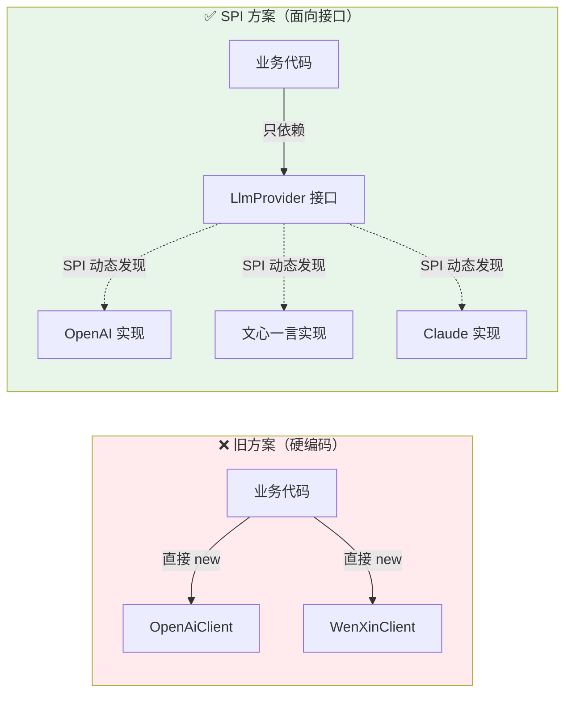
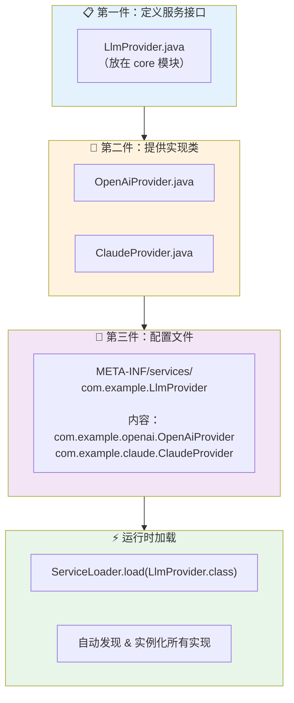
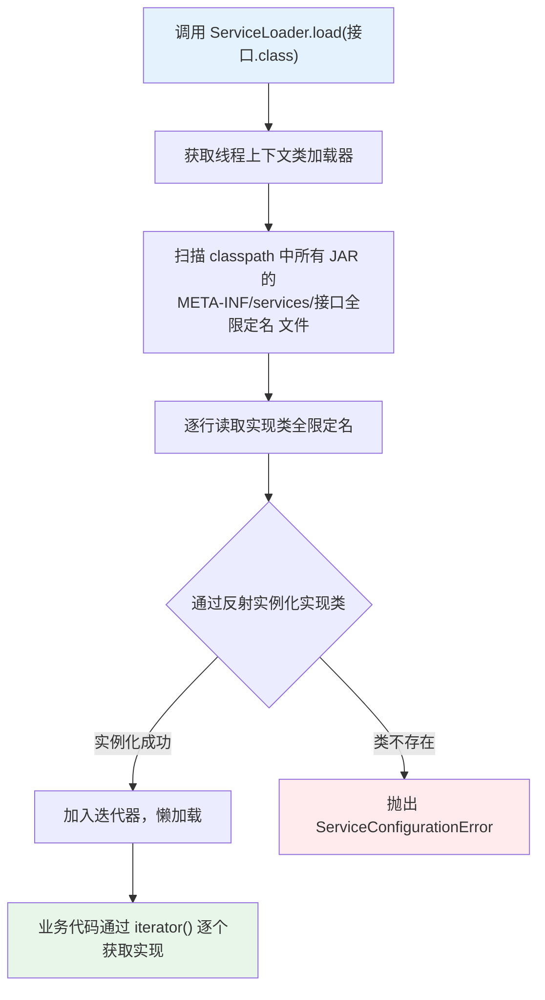
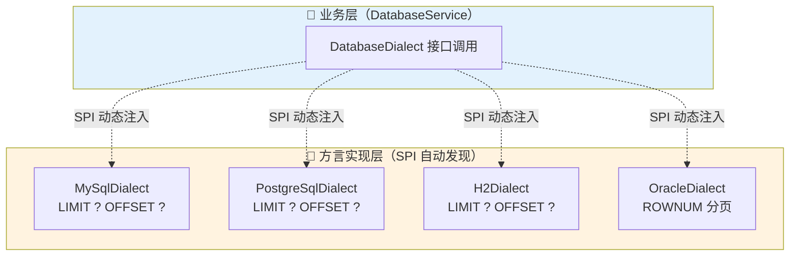
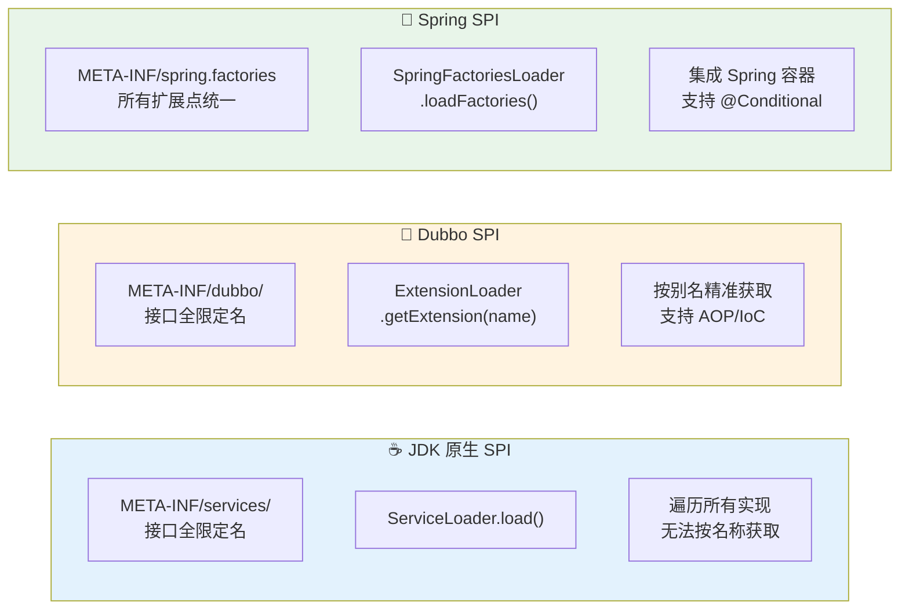

> Java SPI（Service Provider Interface）是 JDK 内置的服务发现机制，专为解耦接口定义与具体实现而生。掌握它，你就能像搭乐高积木一样，随时切换 LLM 模型、数据库驱动，而无需改动任何业务代码。本文覆盖 SPI 核心原理、ServiceLoader 运作流程、三大 SPI 方案对比，以及接入 OpenAI/Claude/文心一言和 MySQL/PostgreSQL 的完整 Java 代码示例。
>
> 📌 **适合人群**：有一定 Java 基础、希望设计可扩展系统的后端开发者


<!--
  MindMapFloat：完成正文后填写，节点为知识维度
-->
<MindMapFloat title="Java SPI 知识图谱">

```mindmap-data
# Java SPI 机制
## 为什么需要 SPI
- 硬编码的耦合之痛
- 多 LLM 模型切换难题
- JDBC 驱动自动发现的启示
## SPI 核心机制
- ServiceLoader 工作原理
- META-INF/services 配置约定
- 类加载器与双亲委派的关系
## 三大 SPI 方案
- JDK 原生 SPI（轻量标准）
- Dubbo SPI（按需加载+别名）
- Spring SPI（spring.factories）
## 真实接入案例
- 接入多 LLM 模型（OpenAI/Claude/文心）
- 接入多数据库（MySQL/PostgreSQL/H2）
## 避坑与最佳实践
- 懒加载 vs 全量加载
- 线程安全问题
- 何时用 SPI，何时用 DI
```

</MindMapFloat>

## 关于本文档

本文从一个真实的业务痛点出发——当你的 AI 应用需要同时支持多家 LLM 服务商时，如何不写死代码？带你系统学习 Java SPI 机制，并配合完整可运行的示例代码，让你在读完后能立刻动手实践。

- ✅ SPI 机制的本质原理与 ServiceLoader 内部运作流程
- ✅ 三步实现自己的 SPI 扩展点（接口 → 实现 → 配置文件）
- ✅ 接入 OpenAI、Claude、文心一言等不同 LLM 模型的完整代码
- ✅ 适配 MySQL、PostgreSQL、H2 多数据库的 SPI 实战
- ✅ JDK SPI、Dubbo SPI、Spring SPI 三者横向对比与选型建议

## 1. 硬编码的痛：为什么需要 SPI

### 1.1 从一个 AI 应用说起

2025 年，几乎每家公司都在上线 AI 功能。假设你开发了一个智能客服系统，最初接入的是 OpenAI GPT-4。某天老板说："国内合规要求，必须同时支持文心一言，而且要能随时切换"。

你打开代码，看到的是这样的情况：

```java
// ❌ 硬编码的噩梦——到处都是 OpenAI 的影子
public class ChatService {
    public String chat(String userMessage) {
        // 直接 new 具体实现类，完全无法切换
        OpenAiClient client = new OpenAiClient("sk-xxx");
        return client.complete(userMessage);
    }
}
```

要换成文心一言，你需要找出所有调用点，逐一修改。如果系统有 50 处调用，这就是一场噩梦。

### 1.2 传统解决方案的局限

面对这个问题，很多开发者会想到以下方案：

| 方案 | 做法 | 核心问题 |
|------|------|----------|
| if-else 分支 | `if (provider.equals("openai"))` | 每增加一个 LLM，就要改源码 |
| 工厂模式（硬编码） | `LlmFactory.create("openai")` | 工厂类仍然列举所有实现 |
| 配置文件 + 反射 | 手写反射加载逻辑 | 重复造轮子，缺乏标准 |
| 依赖注入（Spring） | `@Autowired List<LlmProvider>` | 引入 Spring 容器依赖，重量级 |

> [!IMPORTANT]
> 核心矛盾在于：**接口是稳定的（"聊天"这件事不会变），但实现是变化的（谁来提供聊天服务随时可换）**。我们需要一种机制，让调用方只面向接口，实现方由外部"插入"进来。

### 1.3 SPI 的核心思想：接口与实现彻底分离

Java SPI 的本质是**"基于接口的编程 + 策略模式 + 约定配置文件"**组合而成的动态加载机制。用一个类比来理解：

> 💡 **生活类比**：USB 接口就是 SPI 思想的完美体现。USB 标准（接口）由 USB-IF 组织定义，键盘、鼠标、U 盘（实现类）由各厂商提供。电脑（调用方）只认 USB 接口，完全不关心插进来的是哪家厂商的设备。



## 2. SPI 核心机制：ServiceLoader 如何运作

### 2.1 SPI 三要素：接口、实现、配置文件

JDK SPI 的使用只需要三步，用"三件套"来记忆：



### 2.2 ServiceLoader 内部加载流程

`ServiceLoader` 是 JDK 提供的工具类，位于 `java.util` 包，本身是 `final` 类且实现了 `Iterable<S>` 接口。它的核心秘密藏在一个常量里：

```java
// ServiceLoader 源码关键片段
public final class ServiceLoader<S> implements Iterable<S> {
    
    // 固定扫描路径——这就是为什么配置文件必须放在这里
    private static final String PREFIX = "META-INF/services/";
    
    public static <S> ServiceLoader<S> load(Class<S> service) {
        // 使用线程上下文类加载器（突破双亲委派限制的关键）
        ClassLoader cl = Thread.currentThread().getContextClassLoader();
        return new ServiceLoader<>(Reflection.getCallerClass(), service, cl);
    }
}
```

> [!NOTE]
> **为什么用线程上下文类加载器？** JDK 核心库（如 `java.sql.Driver` 接口）由 BootstrapClassLoader 加载，而 MySQL 驱动实现类在应用 classpath 中，由 AppClassLoader 加载。双亲委派模型中父加载器无法访问子加载器的类，线程上下文类加载器正是为了打破这一限制而设计的。参见 Oracle 官方文档：[ServiceLoader JavaDoc](https://docs.oracle.com/en/java/docs/api/java.base/java/util/ServiceLoader.html)

完整的加载流程如下：



### 2.3 JDBC 驱动：最经典的 SPI 落地案例

JDBC 4.0 之后，我们不再需要写 `Class.forName("com.mysql.cj.jdbc.Driver")` 来手动加载驱动，这背后正是 SPI 的功劳。

MySQL 驱动 JAR 包内部的结构：

```
mysql-connector-java-8.x.jar
└── META-INF/
    └── services/
        └── java.sql.Driver          ← 文件名 = 接口全限定名
            内容: com.mysql.cj.jdbc.Driver   ← 实现类全限定名
```

`DriverManager` 在静态初始化时会调用：

```java
// DriverManager 源码（简化版）
static {
    loadInitialDrivers();
}

private static void loadInitialDrivers() {
    // SPI 自动发现所有 Driver 实现
    ServiceLoader<Driver> loadedDrivers = ServiceLoader.load(Driver.class);
    Iterator<Driver> driversIterator = loadedDrivers.iterator();
    while (driversIterator.hasNext()) {
        driversIterator.next(); // 触发实例化，Driver 在 static 块中自动注册
    }
}
```

只要 MySQL 驱动 JAR 在 classpath，`getConnection()` 就能直接工作——这就是 SPI 的魔力。

## 3. 手写 SPI 实战：接入多 LLM 大模型

### 3.1 项目结构设计

我们设计一个支持多 LLM 提供商的对话系统，项目结构如下：

```
llm-spi-demo/
├── llm-core/           ← 定义接口（框架方维护）
│   └── src/main/java/com/example/spi/
│       └── LlmProvider.java
├── llm-openai/         ← OpenAI 实现（可单独打包成 JAR）
│   └── src/main/
│       ├── java/com/example/openai/OpenAiProvider.java
│       └── resources/META-INF/services/com.example.spi.LlmProvider
├── llm-claude/         ← Claude 实现
├── llm-wenxin/         ← 文心一言实现
└── llm-app/            ← 调用方（业务代码）
```

> [!TIP]
> 将接口模块（`llm-core`）单独打包，各实现模块只依赖 `llm-core`。这样新增一个 LLM 提供商时，只需新建模块并添加依赖，**核心代码零改动**。

### 3.2 Step 1：定义服务接口

```java
// llm-core/src/main/java/com/example/spi/LlmProvider.java
package com.example.spi;

/**
 * LLM 服务提供商统一接口
 * 所有 LLM 实现必须实现此接口，并提供无参构造函数
 */
public interface LlmProvider {

    /**
     * 返回提供商名称（用于日志、监控）
     * @return 如 "openai"、"claude"、"wenxin"
     */
    String name();

    /**
     * 发送消息并获取回复
     * @param systemPrompt 系统提示词
     * @param userMessage  用户消息
     * @return LLM 的回复文本
     */
    String chat(String systemPrompt, String userMessage);

    /**
     * 检查当前提供商是否可用（API Key 是否配置等）
     * @return true 表示可用
     */
    default boolean isAvailable() {
        return true;
    }
}
```

### 3.3 Step 2：实现各 LLM 提供商

**OpenAI 实现**：

```java
// llm-openai/src/main/java/com/example/openai/OpenAiProvider.java
package com.example.openai;

import com.example.spi.LlmProvider;
import java.net.URI;
import java.net.http.HttpClient;
import java.net.http.HttpRequest;
import java.net.http.HttpResponse;

/**
 * OpenAI GPT 系列模型接入实现
 * 依赖：无参构造，通过环境变量读取 API Key
 */
public class OpenAiProvider implements LlmProvider {

    // 从环境变量读取，避免硬编码 Key
    private static final String API_KEY = System.getenv("OPENAI_API_KEY");
    private static final String API_URL = "https://api.openai.com/v1/chat/completions";
    private static final String MODEL = "gpt-4o";

    private final HttpClient httpClient;

    // SPI 要求：必须有无参构造函数
    public OpenAiProvider() {
        this.httpClient = HttpClient.newHttpClient();
    }

    @Override
    public String name() {
        return "openai";
    }

    @Override
    public boolean isAvailable() {
        return API_KEY != null && !API_KEY.isEmpty();
    }

    @Override
    public String chat(String systemPrompt, String userMessage) {
        // 构造 OpenAI API 请求体（JSON 格式）
        String requestBody = String.format("""
                {
                  "model": "%s",
                  "messages": [
                    {"role": "system", "content": "%s"},
                    {"role": "user", "content": "%s"}
                  ]
                }
                """, MODEL,
                systemPrompt.replace("\"", "\\\""),
                userMessage.replace("\"", "\\\""));

        try {
            HttpRequest request = HttpRequest.newBuilder()
                    .uri(URI.create(API_URL))
                    .header("Content-Type", "application/json")
                    .header("Authorization", "Bearer " + API_KEY)
                    .POST(HttpRequest.BodyPublishers.ofString(requestBody))
                    .build();

            HttpResponse<String> response = httpClient.send(
                    request, HttpResponse.BodyHandlers.ofString());

            // 简单解析：提取 choices[0].message.content
            String body = response.body();
            int start = body.indexOf("\"content\":\"") + 11;
            int end = body.indexOf("\"", start);
            return body.substring(start, end);

        } catch (Exception e) {
            throw new RuntimeException("[OpenAI] 调用失败: " + e.getMessage(), e);
        }
    }
}
```

**Claude (Anthropic) 实现**：

```java
// llm-claude/src/main/java/com/example/claude/ClaudeProvider.java
package com.example.claude;

import com.example.spi.LlmProvider;
import java.net.URI;
import java.net.http.HttpClient;
import java.net.http.HttpRequest;
import java.net.http.HttpResponse;

/**
 * Anthropic Claude 系列模型接入实现
 */
public class ClaudeProvider implements LlmProvider {

    private static final String API_KEY = System.getenv("ANTHROPIC_API_KEY");
    private static final String API_URL = "https://api.anthropic.com/v1/messages";
    private static final String MODEL = "claude-sonnet-4-6";

    private final HttpClient httpClient;

    public ClaudeProvider() {
        this.httpClient = HttpClient.newHttpClient();
    }

    @Override
    public String name() {
        return "claude";
    }

    @Override
    public boolean isAvailable() {
        return API_KEY != null && !API_KEY.isEmpty();
    }

    @Override
    public String chat(String systemPrompt, String userMessage) {
        // Anthropic API 使用不同的请求格式
        String requestBody = String.format("""
                {
                  "model": "%s",
                  "max_tokens": 1024,
                  "system": "%s",
                  "messages": [
                    {"role": "user", "content": "%s"}
                  ]
                }
                """, MODEL,
                systemPrompt.replace("\"", "\\\""),
                userMessage.replace("\"", "\\\""));

        try {
            HttpRequest request = HttpRequest.newBuilder()
                    .uri(URI.create(API_URL))
                    .header("Content-Type", "application/json")
                    .header("x-api-key", API_KEY)
                    .header("anthropic-version", "2023-06-01")
                    .POST(HttpRequest.BodyPublishers.ofString(requestBody))
                    .build();

            HttpResponse<String> response = httpClient.send(
                    request, HttpResponse.BodyHandlers.ofString());

            // 解析 Claude 响应格式
            String body = response.body();
            int start = body.indexOf("\"text\":\"") + 8;
            int end = body.indexOf("\"", start);
            return body.substring(start, end);

        } catch (Exception e) {
            throw new RuntimeException("[Claude] 调用失败: " + e.getMessage(), e);
        }
    }
}
```

**文心一言实现**：

```java
// llm-wenxin/src/main/java/com/example/wenxin/WenXinProvider.java
package com.example.wenxin;

import com.example.spi.LlmProvider;
import java.net.URI;
import java.net.http.HttpClient;
import java.net.http.HttpRequest;
import java.net.http.HttpResponse;

/**
 * 百度文心一言大模型接入实现
 */
public class WenXinProvider implements LlmProvider {

    private static final String ACCESS_TOKEN = System.getenv("WENXIN_ACCESS_TOKEN");
    private static final String API_URL =
            "https://aip.baidubce.com/rpc/2.0/ai_custom/v1/wenxinworkshop/chat/completions_pro";

    private final HttpClient httpClient;

    public WenXinProvider() {
        this.httpClient = HttpClient.newHttpClient();
    }

    @Override
    public String name() {
        return "wenxin";
    }

    @Override
    public boolean isAvailable() {
        return ACCESS_TOKEN != null && !ACCESS_TOKEN.isEmpty();
    }

    @Override
    public String chat(String systemPrompt, String userMessage) {
        String requestBody = String.format("""
                {
                  "system": "%s",
                  "messages": [
                    {"role": "user", "content": "%s"}
                  ]
                }
                """, systemPrompt.replace("\"", "\\\""),
                userMessage.replace("\"", "\\\""));

        try {
            HttpRequest request = HttpRequest.newBuilder()
                    .uri(URI.create(API_URL + "?access_token=" + ACCESS_TOKEN))
                    .header("Content-Type", "application/json")
                    .POST(HttpRequest.BodyPublishers.ofString(requestBody))
                    .build();

            HttpResponse<String> response = httpClient.send(
                    request, HttpResponse.BodyHandlers.ofString());

            String body = response.body();
            int start = body.indexOf("\"result\":\"") + 10;
            int end = body.indexOf("\"", start);
            return body.substring(start, end);

        } catch (Exception e) {
            throw new RuntimeException("[文心一言] 调用失败: " + e.getMessage(), e);
        }
    }
}
```

### 3.4 Step 3：配置文件与业务调用

**SPI 配置文件**（每个实现模块各自维护自己的文件）：

```
# llm-openai/src/main/resources/META-INF/services/com.example.spi.LlmProvider
com.example.openai.OpenAiProvider

# llm-claude/src/main/resources/META-INF/services/com.example.spi.LlmProvider
com.example.claude.ClaudeProvider

# llm-wenxin/src/main/resources/META-INF/services/com.example.spi.LlmProvider
com.example.wenxin.WenXinProvider
```

**业务调用代码**（完全面向接口，与实现零耦合）：

```java
// llm-app/src/main/java/com/example/app/LlmManager.java
package com.example.app;

import com.example.spi.LlmProvider;
import java.util.*;

/**
 * LLM 管理器：通过 SPI 自动发现并管理所有可用的 LLM 提供商
 */
public class LlmManager {

    // 存储所有可用的提供商，key = name()，value = 实例
    private final Map<String, LlmProvider> providers = new LinkedHashMap<>();

    public LlmManager() {
        // 一行代码：自动发现所有在 classpath 中注册的 LLM 实现
        ServiceLoader<LlmProvider> loader = ServiceLoader.load(LlmProvider.class);

        for (LlmProvider provider : loader) {
            if (provider.isAvailable()) {
                providers.put(provider.name(), provider);
                System.out.println("✅ 已加载 LLM 提供商: " + provider.name());
            } else {
                System.out.println("⚠️  跳过不可用提供商: " + provider.name() + "（未配置 API Key）");
            }
        }
    }

    /**
     * 使用指定提供商发送消息
     * @param providerName 提供商名称，如 "openai"、"claude"
     */
    public String chat(String providerName, String systemPrompt, String userMessage) {
        LlmProvider provider = providers.get(providerName);
        if (provider == null) {
            throw new IllegalArgumentException("未找到提供商: " + providerName
                    + "，可用列表: " + providers.keySet());
        }
        return provider.chat(systemPrompt, userMessage);
    }

    /**
     * 使用第一个可用的提供商（兜底策略）
     */
    public String chatWithFallback(String systemPrompt, String userMessage) {
        return providers.values().stream()
                .findFirst()
                .map(p -> p.chat(systemPrompt, userMessage))
                .orElseThrow(() -> new RuntimeException("没有可用的 LLM 提供商"));
    }

    /** 列出所有已加载的提供商 */
    public Set<String> availableProviders() {
        return Collections.unmodifiableSet(providers.keySet());
    }
}
```

**主程序演示**：

```java
// llm-app/src/main/java/com/example/app/Main.java
package com.example.app;

public class Main {
    public static void main(String[] args) {
        LlmManager manager = new LlmManager();

        // 输出：✅ 已加载 LLM 提供商: openai
        //        ✅ 已加载 LLM 提供商: claude
        //        ✅ 已加载 LLM 提供商: wenxin

        System.out.println("可用提供商: " + manager.availableProviders());

        // 指定使用 Claude
        String reply = manager.chat("claude",
                "你是一个专业的 Java 架构师",
                "请解释一下 SPI 机制的核心优势");
        System.out.println("Claude 回复: " + reply);

        // 如果 claude 挂了，自动兜底到第一个可用的
        String fallbackReply = manager.chatWithFallback(
                "你是一个助手", "你好");
        System.out.println("兜底回复: " + fallbackReply);
    }
}
```

> [!IMPORTANT]
> **新增一个 LLM 提供商只需两步**：① 创建实现类 ② 添加配置文件。`LlmManager`、`Main` 等业务代码**一行不改**。这正是 SPI 机制"对扩展开放、对修改关闭"的开闭原则体现。

## 4. 多数据库适配：SPI 接入 MySQL / PostgreSQL / H2

### 4.1 为什么数据库也要用 SPI

在微服务和多租户场景下，同一套业务代码可能需要连接不同的数据库：

- **开发环境**：H2 内存数据库（启动快、零配置）
- **测试环境**：PostgreSQL（更接近生产）
- **生产环境**：MySQL / Oracle

传统方式是通过不同的配置文件来切换，但如果各数据库有**方言差异**（如分页语法、JSON 函数），就需要在代码里做判断。SPI 可以将方言逻辑封装到各自的实现中：



### 4.2 定义数据库方言接口

```java
// db-core/src/main/java/com/example/db/spi/DatabaseDialect.java
package com.example.db.spi;

/**
 * 数据库方言 SPI 接口
 * 封装各数据库在 SQL 语法上的差异
 */
public interface DatabaseDialect {

    /**
     * 返回数据库类型标识（对应 JDBC URL 中的数据库名）
     * @return 如 "mysql"、"postgresql"、"h2"
     */
    String databaseType();

    /**
     * 生成分页查询 SQL
     * @param baseSql  原始查询 SQL（不含分页）
     * @param offset   起始偏移量
     * @param limit    每页记录数
     * @return 带分页的完整 SQL
     */
    String buildPageSql(String baseSql, int offset, int limit);

    /**
     * 生成 UPSERT（插入或更新）SQL
     * @param tableName  表名
     * @param columns    列名数组
     * @param conflictKey 冲突键列名
     * @return UPSERT SQL 语句
     */
    String buildUpsertSql(String tableName, String[] columns, String conflictKey);

    /**
     * 获取当前时间戳的 SQL 函数
     * @return 如 "NOW()"、"CURRENT_TIMESTAMP"
     */
    default String currentTimestampFunction() {
        return "CURRENT_TIMESTAMP";
    }
}
```

### 4.3 各数据库方言实现

**MySQL 方言**：

```java
// db-mysql/src/main/java/com/example/db/mysql/MySqlDialect.java
package com.example.db.mysql;

import com.example.db.spi.DatabaseDialect;

/**
 * MySQL 数据库方言实现
 * 支持 MySQL 5.7+ 和 MySQL 8.x
 */
public class MySqlDialect implements DatabaseDialect {

    @Override
    public String databaseType() {
        return "mysql";
    }

    @Override
    public String buildPageSql(String baseSql, int offset, int limit) {
        // MySQL 使用 LIMIT offset, count 语法
        return baseSql + " LIMIT " + offset + ", " + limit;
    }

    @Override
    public String buildUpsertSql(String tableName, String[] columns, String conflictKey) {
        // MySQL 使用 INSERT ... ON DUPLICATE KEY UPDATE 语法
        StringBuilder sb = new StringBuilder();
        sb.append("INSERT INTO ").append(tableName).append(" (");
        sb.append(String.join(", ", columns));
        sb.append(") VALUES (");
        sb.append("?,".repeat(columns.length - 1)).append("?)");
        sb.append(" ON DUPLICATE KEY UPDATE ");

        // 排除主键，其他字段都参与更新
        for (String col : columns) {
            if (!col.equals(conflictKey)) {
                sb.append(col).append(" = VALUES(").append(col).append("), ");
            }
        }
        // 删除最后的逗号空格
        sb.setLength(sb.length() - 2);
        return sb.toString();
    }

    @Override
    public String currentTimestampFunction() {
        return "NOW()";
    }
}
```

**PostgreSQL 方言**：

```java
// db-postgresql/src/main/java/com/example/db/pg/PostgreSqlDialect.java
package com.example.db.pg;

import com.example.db.spi.DatabaseDialect;

/**
 * PostgreSQL 数据库方言实现
 * 支持 PostgreSQL 12+
 */
public class PostgreSqlDialect implements DatabaseDialect {

    @Override
    public String databaseType() {
        return "postgresql";
    }

    @Override
    public String buildPageSql(String baseSql, int offset, int limit) {
        // PostgreSQL 使用标准 SQL 的 LIMIT ... OFFSET 语法
        return baseSql + " LIMIT " + limit + " OFFSET " + offset;
    }

    @Override
    public String buildUpsertSql(String tableName, String[] columns, String conflictKey) {
        // PostgreSQL 使用 INSERT ... ON CONFLICT DO UPDATE 语法（更清晰）
        StringBuilder sb = new StringBuilder();
        sb.append("INSERT INTO ").append(tableName).append(" (");
        sb.append(String.join(", ", columns));
        sb.append(") VALUES (");
        sb.append("?,".repeat(columns.length - 1)).append("?)");
        sb.append(" ON CONFLICT (").append(conflictKey).append(") DO UPDATE SET ");

        for (String col : columns) {
            if (!col.equals(conflictKey)) {
                // PostgreSQL 使用 EXCLUDED 引用冲突时传入的新值
                sb.append(col).append(" = EXCLUDED.").append(col).append(", ");
            }
        }
        sb.setLength(sb.length() - 2);
        return sb.toString();
    }
}
```

**H2 内存数据库方言**：

```java
// db-h2/src/main/java/com/example/db/h2/H2Dialect.java
package com.example.db.h2;

import com.example.db.spi.DatabaseDialect;

/**
 * H2 内存数据库方言实现（兼容 MySQL 模式）
 * 主要用于本地开发和单元测试
 */
public class H2Dialect implements DatabaseDialect {

    @Override
    public String databaseType() {
        return "h2";
    }

    @Override
    public String buildPageSql(String baseSql, int offset, int limit) {
        // H2 支持标准 SQL 分页语法
        return baseSql + " LIMIT " + limit + " OFFSET " + offset;
    }

    @Override
    public String buildUpsertSql(String tableName, String[] columns, String conflictKey) {
        // H2 支持 MERGE INTO 语法
        StringBuilder sb = new StringBuilder();
        sb.append("MERGE INTO ").append(tableName).append(" (");
        sb.append(String.join(", ", columns));
        sb.append(") KEY (").append(conflictKey).append(") VALUES (");
        sb.append("?,".repeat(columns.length - 1)).append("?)");
        return sb.toString();
    }
}
```

**数据库方言管理器**（通过 SPI + JDBC URL 自动匹配）：

```java
// db-app/src/main/java/com/example/db/app/DialectManager.java
package com.example.db.app;

import com.example.db.spi.DatabaseDialect;
import java.util.*;

/**
 * 数据库方言管理器
 * 通过 SPI 加载所有方言实现，根据 JDBC URL 自动选择合适的方言
 */
public class DialectManager {

    private final Map<String, DatabaseDialect> dialectMap = new HashMap<>();

    public DialectManager() {
        // SPI 自动发现所有方言实现
        ServiceLoader<DatabaseDialect> loader = ServiceLoader.load(DatabaseDialect.class);
        for (DatabaseDialect dialect : loader) {
            dialectMap.put(dialect.databaseType().toLowerCase(), dialect);
            System.out.println("🗄️  注册数据库方言: " + dialect.databaseType());
        }
    }

    /**
     * 根据 JDBC URL 自动匹配方言
     * 例如 "jdbc:mysql://..." → MySqlDialect
     *      "jdbc:postgresql://..." → PostgreSqlDialect
     */
    public DatabaseDialect detectDialect(String jdbcUrl) {
        String lowerUrl = jdbcUrl.toLowerCase();
        return dialectMap.entrySet().stream()
                .filter(e -> lowerUrl.contains(e.getKey()))
                .map(Map.Entry::getValue)
                .findFirst()
                .orElseThrow(() -> new RuntimeException(
                        "无法识别的数据库类型，URL: " + jdbcUrl
                        + "，已知方言: " + dialectMap.keySet()));
    }

    /** 按名称获取方言 */
    public DatabaseDialect getDialect(String databaseType) {
        return Optional.ofNullable(dialectMap.get(databaseType.toLowerCase()))
                .orElseThrow(() -> new RuntimeException("未注册方言: " + databaseType));
    }
}
```

**SPI 配置文件**：

```
# db-mysql/src/main/resources/META-INF/services/com.example.db.spi.DatabaseDialect
com.example.db.mysql.MySqlDialect

# db-postgresql/src/main/resources/META-INF/services/com.example.db.spi.DatabaseDialect
com.example.db.pg.PostgreSqlDialect

# db-h2/src/main/resources/META-INF/services/com.example.db.spi.DatabaseDialect
com.example.db.h2.H2Dialect
```

**业务代码使用示例**：

```java
// 业务代码：完全不感知是哪种数据库
public class UserRepository {
    
    private final DatabaseDialect dialect;
    
    public UserRepository(String jdbcUrl) {
        DialectManager manager = new DialectManager();
        // 根据 JDBC URL 自动选择方言，无需任何 if-else
        this.dialect = manager.detectDialect(jdbcUrl);
    }
    
    public String buildUserPageQuery(int page, int size) {
        String baseSql = "SELECT * FROM users ORDER BY created_at DESC";
        int offset = (page - 1) * size;
        // 方言自动处理分页语法差异
        return dialect.buildPageSql(baseSql, offset, size);
    }
}
```

## 5. 三大 SPI 方案横向对比

### 5.1 JDK SPI、Dubbo SPI、Spring SPI 全面对比

在企业级开发中，除了 JDK 原生 SPI，Dubbo SPI 和 Spring SPI 也是常见选择。



| 对比维度 | JDK 原生 SPI | Dubbo SPI | Spring SPI |
|----------|-------------|-----------|------------|
| **配置文件位置** | `META-INF/services/接口名` | `META-INF/dubbo/接口名` | `META-INF/spring.factories` |
| **配置格式** | 每行一个实现类 | `key=实现类全限定名` | `接口名=实现类（逗号分隔）` |
| **按名称获取** | ❌ 不支持，只能遍历所有 | ✅ 支持别名精准获取 | ❌ 不支持 |
| **懒加载** | ✅ 迭代时才实例化 | ✅ 按需加载 | ❌ 全量加载 |
| **依赖注入** | ❌ 不支持 | ✅ 支持字段注入 | ✅ 与 Spring 容器整合 |
| **AOP 支持** | ❌ | ✅ Wrapper 机制 | ✅ Spring AOP |
| **默认实现** | ❌ | ✅ `@SPI("默认别名")` | ❌ |
| **额外依赖** | 无（JDK 内置） | Dubbo 框架 | Spring Framework |
| **适用场景** | 轻量插件化、JDBC、日志 | Dubbo 框架扩展 | Spring Boot 自动配置 |

### 5.2 Dubbo SPI 按名称加载示例

Dubbo SPI 最大的改进是支持**按别名精准获取**，解决了 JDK SPI "只能遍历全部"的问题：

```java
// Dubbo SPI 接口定义（需要加 @SPI 注解）
@SPI("openai")  // 默认使用 openai 实现
public interface LlmProvider {
    String chat(String systemPrompt, String userMessage);
}

// 配置文件：META-INF/dubbo/com.example.spi.LlmProvider
// openai=com.example.openai.OpenAiProvider
// claude=com.example.claude.ClaudeProvider
// wenxin=com.example.wenxin.WenXinProvider

// 调用方：按名称精准获取
ExtensionLoader<LlmProvider> loader = 
    ExtensionLoader.getExtensionLoader(LlmProvider.class);

// 获取默认实现（@SPI 注解指定的 "openai"）
LlmProvider defaultProvider = loader.getDefaultExtension();

// 按别名获取指定实现
LlmProvider claudeProvider = loader.getExtension("claude");
```

> [!TIP]
> **选型建议**：如果项目不依赖 Dubbo 或 Spring，优先用 JDK 原生 SPI——零依赖、JDK 内置；如果需要按名称精准获取或热加载，自己实现一个简单的注册表（参考 `LlmManager` 的 `Map<String, LlmProvider>`）比引入 Dubbo 更轻量。

### 5.3 SPI vs 依赖注入（DI）对比

很多同学会问：Spring 的 `@Autowired` 也能注入多实现，为什么还需要 SPI？

| 维度 | SPI | DI（Spring） |
|------|-----|-------------|
| **适用范围** | 跨模块、跨 JAR 的插件扩展 | 同一 Spring 应用内的组件装配 |
| **扩展方式** | 新 JAR + 配置文件，无需改代码 | 新 Bean，需在 Spring 上下文可见 |
| **运行环境** | 任意 JVM 环境 | 依赖 Spring 容器 |
| **学习成本** | 极低（3 步即可） | 需要理解 Spring 生命周期 |
| **典型场景** | JDBC 驱动、日志框架、插件系统 | 业务组件、Repository、Service |

> [!IMPORTANT]
> SPI 和 DI 并不互斥，很多框架同时使用两者。SPI 负责**框架层面的扩展点发现**，DI 负责**应用内部的组件装配**。

## 6. 生产环境最佳实践与常见陷阱

### 6.1 懒加载陷阱：不要一次性遍历所有实现

JDK SPI 的 `ServiceLoader` 是懒加载的，迭代时才实例化。但一个常见错误是在初始化时就强制遍历所有实现：

```java
// ❌ 错误：强制遍历导致所有实现被实例化（即使某些用不到）
ServiceLoader<LlmProvider> loader = ServiceLoader.load(LlmProvider.class);
List<LlmProvider> allProviders = new ArrayList<>();
loader.forEach(allProviders::add);  // 全量实例化，资源浪费

// ✅ 正确：按需获取，或者仅实例化 isAvailable() 的实现
ServiceLoader<LlmProvider> loader = ServiceLoader.load(LlmProvider.class);
for (LlmProvider provider : loader) {
    if (provider.isAvailable()) {  // 先检查可用性
        providers.put(provider.name(), provider);
    }
}
```

### 6.2 线程安全问题：ServiceLoader 不是线程安全的

```java
// ❌ 错误：多线程共享同一个 ServiceLoader 实例
public class LlmManager {
    // 危险！ServiceLoader 内部的迭代器不是线程安全的
    private static final ServiceLoader<LlmProvider> SHARED_LOADER =
            ServiceLoader.load(LlmProvider.class);
}

// ✅ 正确方案一：每个线程独立 load（有性能开销）
ServiceLoader<LlmProvider> loader = ServiceLoader.load(LlmProvider.class);

// ✅ 正确方案二：提前加载到线程安全的 Map 中（推荐）
private final ConcurrentHashMap<String, LlmProvider> providers = new ConcurrentHashMap<>();
// 在构造函数中一次性加载，之后只读
```

### 6.3 常见问题排查

| 问题现象 | 根本原因 | 解决方案 |
|----------|----------|----------|
| `ServiceLoader` 加载到空列表 | 配置文件路径错误或未打包进 JAR | 检查 `META-INF/services/` 文件是否在 classpath 中 |
| `ServiceConfigurationError` | 实现类缺少无参构造函数 | 为所有实现类添加 `public XxxImpl() {}` |
| 实现类被加载多次 | 多个 JAR 的同一配置文件重复注册 | 检查是否有多个模块注册了同一实现类 |
| 新增实现未被发现 | 忘记创建配置文件 | 配置文件名 = 接口的全限定名 |
| 加载顺序不固定 | SPI 不保证加载顺序 | 让实现类实现 `Comparable` 或增加 `order()` 方法 |

> [!WARNING]
> SPI 配置文件中，**实现类必须有无参构造函数**，这是 `ServiceLoader` 通过反射实例化的前提。如果需要有参数的初始化，可以使用工厂模式，让 SPI 加载工厂类而非直接加载实现类。

### 6.4 自定义排序：让 SPI 实现按优先级加载

```java
// 在接口中增加优先级方法
public interface LlmProvider {
    String name();
    String chat(String systemPrompt, String userMessage);
    
    /**
     * 优先级，数字越小优先级越高
     * 用于多个提供商可用时的选择顺序
     */
    default int priority() {
        return 100;
    }
}

// 加载时按优先级排序
public LlmManager() {
    ServiceLoader<LlmProvider> loader = ServiceLoader.load(LlmProvider.class);
    // 转换为 List 后排序
    List<LlmProvider> providerList = new ArrayList<>();
    loader.forEach(providerList::add);
    
    providerList.stream()
            .filter(LlmProvider::isAvailable)
            .sorted(Comparator.comparingInt(LlmProvider::priority))
            .forEach(p -> providers.put(p.name(), p));
}
```

## 7. SPI 适用场景与边界

### 7.1 SPI 最适合的场景

| 场景 | 为什么适合 SPI | 典型实例 |
|------|---------------|----------|
| **多厂商适配** | 不同厂商提供不同实现，框架保持中立 | JDBC Driver、云存储 SDK |
| **插件化系统** | 插件由第三方开发，主程序不感知实现 | IDE 插件、Maven Plugin |
| **AI 模型切换** | 不同 LLM API 格式各异，业务代码统一 | 本文 LLM 接入案例 |
| **多数据库支持** | SQL 方言差异由实现层封装，上层统一 | 本文数据库方言案例 |
| **日志框架桥接** | SLF4J 通过 SPI 发现具体日志实现 | SLF4J + Logback/Log4j2 |

### 7.2 不适合用 SPI 的场景

> [!CAUTION]
> 以下情况不建议使用 SPI，避免过度设计：
> - **只有一个实现且短期内不会扩展**：直接依赖具体类即可，SPI 增加理解成本
> - **需要有状态的初始化**：SPI 实现类通过无参构造创建，复杂初始化逻辑需要额外包装
> - **实现类之间有依赖关系**：SPI 不管理实现类间的依赖，此时应用 DI 框架
> - **需要热替换（不重启生效）**：标准 SPI 不支持运行时重新加载，需结合 OSGi 等框架

## 8. 总结

| 核心概念 | 一句话解释 |
|----------|-----------|
| **SPI（Service Provider Interface）** | Java 内置的服务发现机制，通过配置文件实现接口与实现的动态绑定 |
| **ServiceLoader** | JDK 提供的 SPI 加载工具，扫描 `META-INF/services/` 目录实现懒加载 |
| **三件套** | 定义接口 + 提供实现 + 配置文件，缺一不可 |
| **线程上下文类加载器** | 突破双亲委派限制，允许 BootstrapClassLoader 加载的核心类发现应用类 |
| **Dubbo SPI 优势** | 在 JDK SPI 基础上增加了别名、按需加载、IoC/AOP 等企业级能力 |
| **开闭原则** | SPI 使系统"对扩展开放（新增实现无需改代码），对修改关闭" |

> [!TIP]
> **学习路径建议**：
> 1. 先动手跑通本文的 LLM SPI Demo，感受"新增实现不改代码"的快感
> 2. 阅读 MySQL Connector/J 源码中 `META-INF/services/java.sql.Driver` 的实现，理解 JDBC 自动驱动发现
> 3. 如果项目使用 Dubbo，进一步学习 `ExtensionLoader` 的源码，掌握企业级 SPI 的完整能力

## 参考资料

### 官方文档

| 文档 | 机构 | 说明 |
|------|------|------|
| [ServiceLoader JavaDoc](https://docs.oracle.com/en/java/docs/api/java.base/java/util/ServiceLoader.html) | Oracle | JDK ServiceLoader 官方 API 文档 |
| [Introduction to the Service Provider Interfaces](https://docs.oracle.com/javase/tutorial/sound/SPI-intro.html) | Oracle | Oracle 官方 SPI 入门教程 |
| [Dubbo SPI 扩展机制](https://cn.dubbo.apache.org/zh-cn/overview/mannual/java-sdk/reference-manual/spi/description/) | Apache Dubbo | Dubbo SPI 官方文档 |
| [JavaGuide SPI 详解](https://javaguide.cn/java/basis/spi.html) | JavaGuide | 中文 SPI 权威参考，含 Java/Spring/Dubbo 三种 SPI 对比 |

### 推荐延伸阅读

- [JDK/Dubbo/Spring 三种 SPI 机制对比](https://juejin.cn/post/6950266942875779108)
- [JDBC 自动加载驱动的 SPI 机制详解](https://www.cnblogs.com/wanghongsen/p/12620168.html)
- [Java 类加载篇（三）SPI 动态加载机制总结](https://qidawu.github.io/posts/java-spi/)
