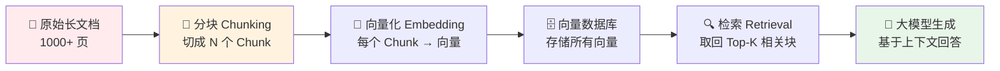
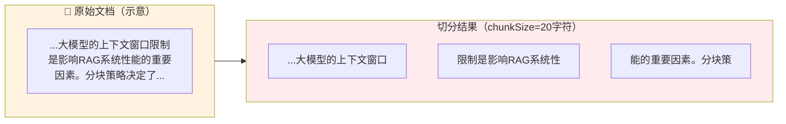
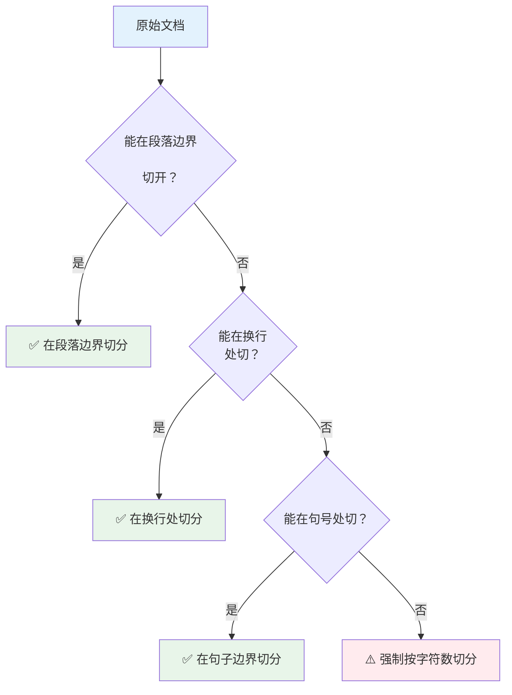
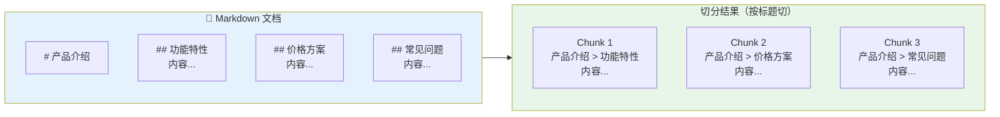
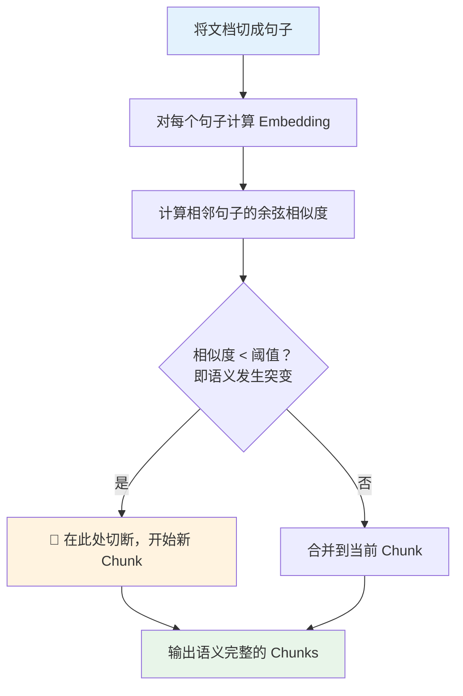
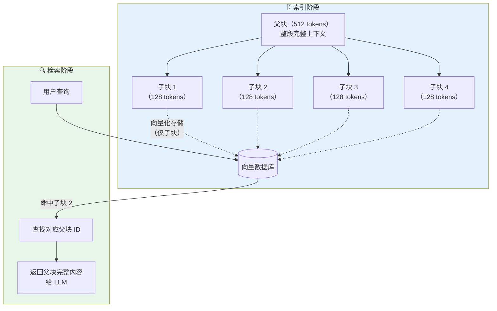
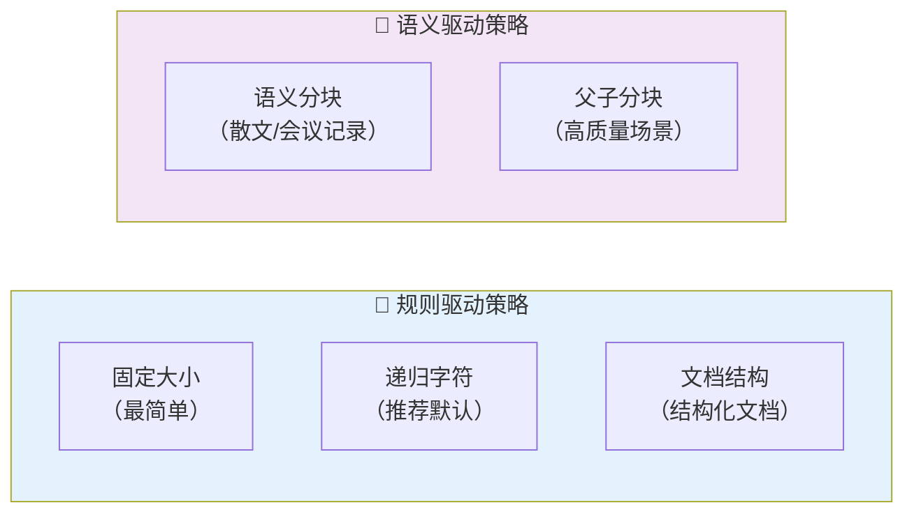
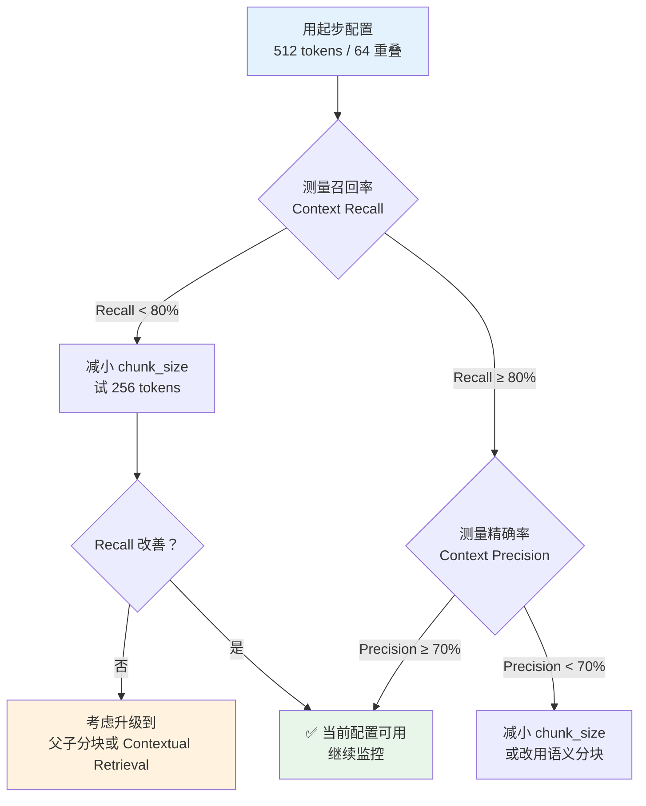

> 分块（Chunking）是 RAG 系统里最容易被忽视却影响最大的环节——同样的嵌入模型、同样的向量数据库，只是换了分块策略，检索召回率就能相差 9% 以上。本文从"为什么必须分块"出发，系统拆解 5 种主流策略的原理与适用场景，再结合 2026 年最新基准测试结论，给出可直接落地的 LangChain4j Java 实战代码与生产配置建议。
>
> 📌 **适合人群**：正在构建或优化 RAG 系统的 Java 后端开发者、AI 应用开发者

<!--
  MindMapFloat 填写规范：节点是知识维度，非章节复制。完成正文后填写。
-->
<MindMapFloat title="RAG Chunking 知识图谱">

```mindmap-data
# RAG 文档分块
## 为什么需要分块
- 上下文窗口硬限制
- 检索信噪比问题
- 嵌入质量与语义密度
## 五种核心策略
- 固定大小分块（最简单）
- 递归字符分块（最推荐）
- 文档结构分块（最精准）
- 语义分块（最智能）
- 父子分块（最灵活）
## 关键参数调优
- chunk_size：256-512 tokens
- overlap：10-20%（约 50-100 tokens）
- 分隔符优先级顺序
## 前沿技术
- Late Chunking（延迟分块）
- Contextual Retrieval（上下文检索）
- 2026 基准测试结论
## 生产避坑
- 块太小：碎片化，上下文不足
- 块太大：稀释相关性，召回率下降
- 边界截断：关键句被切断
```

</MindMapFloat>

## 关于本文档

本文覆盖 RAG 系统中文档分块的完整知识体系，从基础原理到生产代码，适合有 Java 基础的开发者直接落地使用。

- ✅ 理解大模型上下文窗口限制与分块的必要性
- ✅ 掌握 5 种主流分块策略的原理、优劣与适用场景
- ✅ 读懂 2026 年最新基准测试，做出有数据支撑的策略选择
- ✅ 掌握 LangChain4j `DocumentSplitters` API 的完整用法
- ✅ 获取生产环境参数调优指南与常见陷阱清单

## 1. 为什么必须分块：三个绕不开的约束

### 1.1 大模型有"阅读上限"

想象你需要让一名顾问回答问题，但每次只能给他看 3 页材料。整本 500 页的手册根本塞不进去，你必须先挑出最相关的几页递给他。

大语言模型面临同样的限制—— **上下文窗口（Context Window）** 规定了模型单次能"看到"的最大 Token 数量。即使是支持 200K Token 的长上下文模型，将整份文档原样塞入也会带来两个严重问题：推理成本随 Token 数量线性甚至超线性上涨；信息密度被大量无关内容稀释，模型更容易"找不到重点"。

分块（Chunking）的核心使命就是：**把长文档切成小片段，让检索阶段只取回最相关的那几块，再拼成精准的上下文喂给模型。**



### 1.2 检索信噪比：块太大或太小都是灾难

分块不只是"切开"这么简单，块的大小直接影响**检索精度**。来自 2026 年 Vecta 基准测试的数据揭示了两个典型失败模式：

| 失败模式 | 具体表现 | 根本原因 |
|---------|---------|---------|
| **块过小（< 50 tokens）** | 语义碎片化，端到端问答准确率仅 54% | 上下文不足，模型缺乏作答依据 |
| **块过大（> 2500 tokens）** | 无关内容稀释信号，相似度判别力下降 | 一块包含多个主题，向量无法精准表达 |
| **边界截断** | 关键定义被从中间切断 | 固定字符切分不考虑语义完整性 |

> [!IMPORTANT]
> 2026 年最新研究表明，实践中的最优区间是 **256 ~ 512 tokens**，重叠（overlap）设为 chunk_size 的 **10% ~ 20%**（约 50 ~ 100 tokens）。这一参数组合在多个独立基准测试中均排名前列。

### 1.3 分块策略的选择与嵌入模型同等重要

NAACL 2025 发布的同行评审研究（arXiv:2410.13070）对 25 种分块配置 × 48 种嵌入模型进行了系统测试，得出了一个令人意外的结论：**分块策略对检索质量的影响，与嵌入模型的选择相当甚至更大。** Chroma 的评测也印证了这一点——在相同语料上，最优与最差分块策略之间的召回率差距达到 9%。

这意味着：在优化嵌入模型之前，先把分块策略调好，性价比更高。

## 2. 五种核心分块策略详解

### 2.1 固定大小分块（Fixed-size Chunking）

这是最简单粗暴的策略：按照固定的字符数或 Token 数强制切割，不管是否切断了一个完整的句子。



| 维度 | 评价 |
|------|------|
| 实现难度 | ⭐（最简单，无需任何 NLP 能力） |
| 语义完整性 | ⭐⭐（容易截断句子，边界粗糙） |
| 计算成本 | ⭐⭐⭐⭐⭐（几乎零额外开销） |
| 适用场景 | 日志文件、数据导出、格式均匀的结构化文本 |

> [!CAUTION]
> 固定大小分块对**中文文档**尤其不友好，因为中文没有空格分隔词语，强制按字符数切分极易把一个词从中间截断，导致语义扭曲。

### 2.2 递归字符分块（Recursive Character Splitting）——生产首选

递归分块是目前**生产环境中最推荐的默认策略**。它的核心思想是：按分隔符优先级递归尝试，优先在"大段落边界"切，如果仍超过目标大小，再降级到"小段落 → 句子 → 词 → 字符"。



分隔符优先级（从高到低）：`"\n\n"` → `"\n"` → `"。！？"` → `" "` → `""`

**为什么递归分块更优秀？** 它尽可能保留了文档的语义结构，使得每个 Chunk 内部主题相对聚焦，相比固定大小分块，能显著提升向量检索的精度。2026 年 2 月 Vecta 对 50 篇学术论文的基准测试结果显示，递归 512-token 分块以 69% 的端到端准确率位列第一。

> [!TIP]
> 递归分块是大多数 RAG 项目的**起点策略**。先用它跑通流程，再根据实际检索指标（Precision/Recall）决定是否升级到更复杂的策略。

### 2.3 文档结构分块（Document-structure Chunking）

文档结构分块充分利用文档自带的格式标记——Markdown 的 `##` 标题、HTML 的 `<h2>` 标签、Word 的段落样式——将内容按照**逻辑章节**切分，而不是物理字符数。



| 特点 | 说明 |
|------|------|
| 语义完整性 | 极高，完整保留章节逻辑 |
| 块大小可控性 | 较差，章节长短不一可能导致大小悬殊 |
| 前提条件 | 文档必须有清晰的结构标记 |
| 最佳适用场景 | 技术文档、API 手册、产品说明书、Markdown 文档库 |

> [!NOTE]
> LangChain4j 提供了 `DocumentByParagraphSplitter`，可以按段落（双换行符）进行结构切分。对于 Markdown 文档，结合元数据注入标题路径，可以让检索结果自带"面包屑"信息，大幅提升答案的可追溯性。

### 2.4 语义分块（Semantic Chunking）

语义分块是最"智能"的策略：通过计算相邻句子之间的向量余弦相似度，**在语义发生突变（相似度骤降）的地方切断**，而不是在固定位置。



**优势**：对主题跳跃频繁、结构松散的文档（研究论文、会议记录、客服对话）效果显著，块内主题高度聚焦。

**代价**：需要为每个句子调用 Embedding 模型，计算成本高、处理速度慢。更严重的是，2026 年 Vecta 基准测试发现语义分块产生的碎片平均仅 43 tokens，对 LLM 生成答案而言上下文严重不足，导致端到端准确率（54%）反而低于递归分块（69%）。

| 对比维度 | 语义分块 | 递归字符分块 |
|---------|---------|------------|
| 块内语义聚焦度 | ⭐⭐⭐⭐⭐ | ⭐⭐⭐ |
| 计算成本 | 高（需调 Embedding） | 低 |
| 块大小稳定性 | 低（碎片风险） | 高 |
| 端到端准确率（2026 基准）| 54% | 69% |
| 推荐场景 | 知识库、会议记录、散文 | 绝大多数 RAG 场景 |

> [!WARNING]
> 使用语义分块时，务必设置 **最小 Chunk 大小下限**（建议 ≥ 100 tokens），避免产生过于碎片化的片段，否则 LLM 生成阶段会因信息量不足而增加幻觉风险。

### 2.5 父子分块（Parent-Document Chunking）

父子分块是一种"双层架构"策略：索引阶段存储的是**小块（子块）**，检索到匹配后返回给 LLM 的是**大块（父块）**。



这个策略的精妙之处在于：**用小块的"精准"完成检索，用大块的"完整"支撑生成**。小块向量更集中，召回精度高；父块上下文更丰富，LLM 答案更准确。

| 维度 | 说明 |
|------|------|
| 检索精度 | 高（小块向量语义集中） |
| 生成质量 | 高（父块提供完整上下文） |
| 实现复杂度 | 中等（需维护父子关系映射） |
| 存储开销 | 略高（父块和子块均需存储） |
| 适用场景 | 技术手册、合同、学术论文等需要高精度+高质量的场景 |

## 3. 2026 年前沿策略：Late Chunking 与 Contextual Retrieval

### 3.1 Late Chunking：在向量层做"延迟切分"

传统分块在**向量化之前**切割文档；Late Chunking 反其道而行之——先对**整篇文档**进行 Embedding，再在向量空间对表示进行切分。这样每个子向量天然携带了整篇文档的全局上下文信息，有效解决了传统分块中"割裂上下文"的问题。

> [!NOTE]
> 2025 年 4 月 arXiv 论文 [Reconstructing Context: Evaluating Advanced Chunking Strategies for Retrieval-Augmented Generation](https://arxiv.org/abs/2504.19754)（arXiv:2504.19754）对 Late Chunking 和 Contextual Retrieval 进行了严格对比，发现 Late Chunking 计算效率更高，但在语义相关性和完整性方面略逊于 Contextual Retrieval。

### 3.2 Contextual Retrieval：Anthropic 的上下文注入方案

Anthropic 提出的 Contextual Retrieval 策略在传统分块之上添加了一个额外步骤：将每个 Chunk 连同**整篇原始文档**一起发送给 LLM，让 LLM 为该 Chunk 生成一段简短的"上下文说明"（2-3 句话），然后将说明文字前置到 Chunk 正文中再进行向量化。

| 对比维度 | Late Chunking | Contextual Retrieval |
|---------|--------------|---------------------|
| 语义完整性保留 | 较好 | 最好 |
| 计算成本 | 较低（一次 Embedding） | 较高（额外 LLM 调用） |
| 实现复杂度 | 中（需支持长文档 Embedding） | 高（需管理预处理 LLM） |
| 2025 研究结论 | 效率优先 | 质量优先 |

> [!TIP]
> **何时值得升级到前沿策略？** 如果递归分块已实现 ≥ 85% 的上下文召回率，通常无需升级。当业务对答案质量要求极高（如法律、医疗、金融），且有足够的预算支付额外推理成本时，Contextual Retrieval 是值得投入的选项。

## 4. 五种策略横向对比



| 策略 | 实现难度 | 语义完整性 | 计算成本 | 2026 准确率参考 | 推荐场景 |
|------|---------|-----------|---------|----------------|---------|
| 固定大小 | ⭐ | ⭐⭐ | ⭐⭐⭐⭐⭐ | ~50% | 日志、数据导出 |
| 递归字符 | ⭐⭐ | ⭐⭐⭐⭐ | ⭐⭐⭐⭐ | **69%**（第一） | **绝大多数场景** |
| 文档结构 | ⭐⭐⭐ | ⭐⭐⭐⭐⭐ | ⭐⭐⭐⭐ | 因场景而异 | Markdown/HTML 文档 |
| 语义分块 | ⭐⭐⭐⭐ | ⭐⭐⭐⭐⭐ | ⭐⭐ | 54%（碎片风险） | 主题跳跃散文 |
| 父子分块 | ⭐⭐⭐⭐ | ⭐⭐⭐⭐ | ⭐⭐⭐ | 高（无直接基准） | 高精度生产场景 |

> [!IMPORTANT]
> **何时选择语义分块？**
> - ✅ 文档主题跳跃频繁、结构松散（客服记录、研究报告）
> - ✅ 已设置最小 Chunk 大小下限（≥ 100 tokens）
> - ✅ 有足够的 Embedding 调用预算
> - ❌ 对延迟敏感的在线系统（计算成本过高）
> - ❌ 文档已有清晰的 Markdown/HTML 结构（用文档结构分块更省力）

## 5. LangChain4j Java 完整实战

### 5.1 依赖配置

```xml
<!-- pom.xml -->
<dependency>
    <groupId>dev.langchain4j</groupId>
    <artifactId>langchain4j</artifactId>
    <version>0.36.2</version>
</dependency>
<dependency>
    <groupId>dev.langchain4j</groupId>
    <artifactId>langchain4j-open-ai</artifactId>
    <version>0.36.2</version>
</dependency>
```

### 5.2 策略一：递归分块（生产推荐）

`DocumentSplitters.recursive()` 是 LangChain4j 提供的递归分块实现，优先按段落，再降级到句子、词，直到满足大小约束。

```java
import dev.langchain4j.data.document.Document;
import dev.langchain4j.data.document.DocumentSplitter;
import dev.langchain4j.data.document.splitter.DocumentSplitters;
import dev.langchain4j.data.segment.TextSegment;
import dev.langchain4j.model.openai.OpenAiTokenizer;

import java.util.List;

public class RecursiveChunkingDemo {

    public static List<TextSegment> chunkDocumentRecursive(Document document) {
        // ✅ 使用 OpenAI tokenizer 进行精确 token 计数
        OpenAiTokenizer tokenizer = new OpenAiTokenizer("text-embedding-ada-002");

        // 构建递归分块器：最大 512 tokens，重叠 64 tokens（约 12.5%）
        DocumentSplitter splitter = DocumentSplitters.recursive(
            512,        // maxSegmentSizeInTokens：每块最多 512 tokens
            64,         // maxOverlapSizeInTokens：相邻块重叠 64 tokens，防止边界截断
            tokenizer   // 使用 token 计数而非字符计数，与嵌入模型对齐
        );

        // 执行分块，返回 TextSegment 列表
        List<TextSegment> segments = splitter.split(document);

        System.out.printf("原始文档切分完成，共生成 %d 个 Chunk%n", segments.size());
        return segments;
    }
}
```

### 5.3 策略二：按段落分块（结构化文档）

```java
import dev.langchain4j.data.document.splitter.DocumentByParagraphSplitter;
import dev.langchain4j.data.segment.TextSegment;

import java.util.List;

public class ParagraphChunkingDemo {

    public static List<TextSegment> chunkByParagraph(Document document) {
        // 按段落（双换行符 \n\n）切分，每块最多 500 字符，重叠 50 字符
        DocumentByParagraphSplitter splitter = new DocumentByParagraphSplitter(
            500,    // maxSegmentSizeInChars
            50      // maxOverlapSizeInChars
        );

        return splitter.split(document);
    }
}
```

### 5.4 策略三：按句子分块（中文语义保留）

```java
import dev.langchain4j.data.document.splitter.DocumentBySentenceSplitter;
import dev.langchain4j.data.segment.TextSegment;

import java.util.List;

public class SentenceChunkingDemo {

    public static List<TextSegment> chunkBySentence(Document document) {
        // 按句子（。！？.!?）切分，每块最多 200 tokens，重叠 20 tokens
        // 对中文文档更友好，不会切断完整句子
        DocumentBySentenceSplitter splitter = new DocumentBySentenceSplitter(
            200,    // maxSegmentSizeInTokens
            20      // maxOverlapSizeInTokens
        );

        return splitter.split(document);
    }
}
```

### 5.5 完整 RAG 摄入管道（含分块）

以下是一个完整的 RAG 文档摄入流水线，将分块、向量化、存储串联起来：

```java
import dev.langchain4j.data.document.Document;
import dev.langchain4j.data.document.DocumentSplitter;
import dev.langchain4j.data.document.loader.FileSystemDocumentLoader;
import dev.langchain4j.data.document.splitter.DocumentSplitters;
import dev.langchain4j.data.segment.TextSegment;
import dev.langchain4j.model.embedding.EmbeddingModel;
import dev.langchain4j.model.openai.OpenAiEmbeddingModel;
import dev.langchain4j.model.openai.OpenAiTokenizer;
import dev.langchain4j.store.embedding.EmbeddingStoreIngestor;
import dev.langchain4j.store.embedding.inmemory.InMemoryEmbeddingStore;

import java.nio.file.Path;
import java.util.List;

public class RagIngestionPipeline {

    // ===== 核心配置参数（基于 2026 年基准测试最优区间）=====
    private static final int CHUNK_SIZE_TOKENS = 512;  // 最优区间：256-512
    private static final int OVERLAP_TOKENS    = 64;   // 约 12.5%，在 10%-20% 范围内

    public static void ingestDocuments(List<Path> documentPaths) {
        // Step 1：加载文档（支持 PDF、TXT、DOCX 等格式）
        List<Document> documents = FileSystemDocumentLoader.loadDocuments(documentPaths);
        System.out.printf("加载文档完成，共 %d 份%n", documents.size());

        // Step 2：配置递归分块器（生产首选策略）
        OpenAiTokenizer tokenizer = new OpenAiTokenizer("text-embedding-3-small");
        DocumentSplitter splitter = DocumentSplitters.recursive(
            CHUNK_SIZE_TOKENS,
            OVERLAP_TOKENS,
            tokenizer
        );

        // Step 3：配置嵌入模型
        EmbeddingModel embeddingModel = OpenAiEmbeddingModel.builder()
            .apiKey(System.getenv("OPENAI_API_KEY"))
            .modelName("text-embedding-3-small")
            .build();

        // Step 4：配置向量存储（生产环境可替换为 Chroma / Qdrant / Milvus）
        InMemoryEmbeddingStore<TextSegment> embeddingStore = new InMemoryEmbeddingStore<>();

        // Step 5：构建摄入器，一键完成 分块 → 向量化 → 存储
        EmbeddingStoreIngestor ingestor = EmbeddingStoreIngestor.builder()
            .documentSplitter(splitter)       // 注入分块策略
            .embeddingModel(embeddingModel)   // 注入嵌入模型
            .embeddingStore(embeddingStore)   // 注入向量存储
            .build();

        // 执行摄入
        ingestor.ingest(documents);
        System.out.println("✅ 文档摄入完成，RAG 知识库已就绪");
    }
}
```

### 5.6 分块框架选型对比

| 框架 | 语言 | 上手难度 | Java 生态集成 | 推荐度 |
|------|------|---------|-------------|--------|
| **LangChain4j** | Java | ⭐⭐ | ⭐⭐⭐⭐⭐（Spring Boot 原生支持） | ✅ 首选 |
| **Spring AI** | Java | ⭐⭐ | ⭐⭐⭐⭐⭐（Spring 官方维护） | ✅ 备选 |
| LangChain | Python | ⭐⭐⭐ | ❌（需跨语言调用） | 仅 Python 项目 |
| LlamaIndex | Python | ⭐⭐⭐ | ❌（需跨语言调用） | 仅 Python 项目 |

## 6. 生产最佳实践

### 6.1 参数调优：从推荐值出发再迭代

**起步配置**（适合大多数业务场景）：

```java
// ✅ 推荐起步配置（基于 2026 年多个基准测试的最优区间）
DocumentSplitter splitter = DocumentSplitters.recursive(
    512,    // chunk_size：256-512 tokens 为甜点区间
    64,     // overlap：chunk_size 的 10-20%
    tokenizer
);
```

**调优决策流程**：



### 6.2 常见错误与解决方案

| 问题现象 | 根本原因 | 解决方案 |
|---------|---------|---------|
| 答案截半，关键定义不完整 | Chunk 边界切断了关键句 | 增大 overlap（设为 chunk_size 的 20%） |
| 答案"跑偏"，包含大量无关内容 | Chunk 过大，一块含多个主题 | 缩小 chunk_size，或改用语义分块 |
| 向量检索命中率低 | Chunk 过小（< 50 tokens），语义信息不足 | 设定最小 Chunk 大小下限 |
| PDF 表格/图片内容丢失 | 仅提取了纯文本，忽略了富媒体 | 使用带 OCR 能力的解析器（如 Tika + Tesseract） |
| 中文文档分块效果差 | 字符级切分切断词语 | 改用 Token 计数模式，或使用 `DocumentBySentenceSplitter` |

> [!WARNING]
> **不要用字符数代替 Token 数！** 中文字符通常对应 1-2 个 Token，英文单词对应 1-3 个 Token，用字符数设定 `chunkSize` 会导致实际 Chunk 大小与嵌入模型的 Token 限制严重不符，建议始终传入 `Tokenizer` 实例进行精确 Token 计数。

### 6.3 分块效果评估方法

评估分块策略效果，推荐使用 **RAGAS** 框架的两个核心指标：

```java
// 伪代码：评估分块策略
// 构建评估数据集：问题 + 标准答案 + 相关文档段落
EvaluationDataset dataset = EvaluationDataset.from("eval-questions.json");

// 指标1：Context Recall（召回率）
// = 标准答案中有多少事实被检索到的 Chunk 覆盖
// 目标：≥ 80%，低于此值说明分块过小或 Chunk 数量不足

// 指标2：Context Precision（精确率）
// = 检索到的 Chunk 中有多少是真正相关的
// 目标：≥ 70%，低于此值说明分块过大或向量检索噪声太多
```

| 指标 | 计算方式 | 目标值 | 低于目标的对策 |
|------|---------|--------|--------------|
| Context Recall（召回率） | 标准答案覆盖 / 全部事实 | ≥ 80% | 缩小 chunk_size，增大 overlap |
| Context Precision（精确率） | 相关 Chunk / 全部检索 Chunk | ≥ 70% | 缩小 chunk_size，或改为语义分块 |

## 7. 总结

| 核心概念 | 一句话解释 |
|---------|-----------|
| **Chunking** | 把长文档切成小片段，让检索阶段只取回最相关的块 |
| **chunk_size** | 每个 Chunk 的最大 Token 数，推荐起步值 256-512 |
| **overlap** | 相邻 Chunk 的重叠大小，设为 chunk_size 的 10-20% |
| **递归字符分块** | 按分隔符优先级递归切分，生产首选策略，2026 基准准确率 69% |
| **语义分块** | 按向量相似度在语义突变处切分，质量高但成本高、碎片风险大 |
| **父子分块** | 小块精准检索 + 大块完整上下文，兼顾精度与生成质量 |
| **Late Chunking** | 先整文 Embedding 再切分，每个子向量携带全局上下文 |

> [!TIP]
> **推荐学习路径**：
> 1. 用 LangChain4j `DocumentSplitters.recursive(512, 64, tokenizer)` 跑通第一个 RAG demo
> 2. 用 RAGAS 测量 Context Recall 和 Context Precision，建立基准线
> 3. 根据指标决定是否调整 chunk_size / overlap，或升级到父子分块
> 4. 当业务要求极高质量时，调研 Contextual Retrieval 的成本收益

## 8. 参考资料

### 核心论文

| 论文 | 作者/机构 | 年份 | 主要贡献 |
|------|-----------|------|----------|
| [Reconstructing Context: Evaluating Advanced Chunking Strategies for RAG](https://arxiv.org/abs/2504.19754) | Merola et al. | 2025 | Late Chunking vs Contextual Retrieval 严格对比 |
| [Chunking for RAG: NAACL 2025 Findings](https://arxiv.org/abs/2410.13070) | Vectara | 2025 | 25 种配置 × 48 嵌入模型大规模基准测试 |

### 推荐资源

- [LangChain4j 官方 RAG 文档](https://docs.langchain4j.dev/tutorials/rag)
- [LangChain4j DocumentSplitters API](https://docs.langchain4j.dev/apidocs/dev/langchain4j/data/document/splitter/DocumentSplitters.html)
- [Firecrawl RAG Chunking 2026 基准测试](https://www.firecrawl.dev/blog/best-chunking-strategies-rag)
- [Vectara NAACL 2025 Chunking Study](https://blog.premai.io/rag-chunking-strategies-the-2026-benchmark-guide/)
