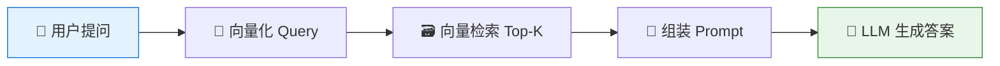
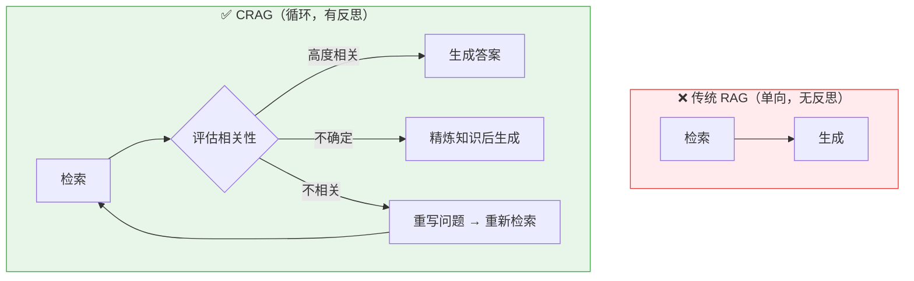
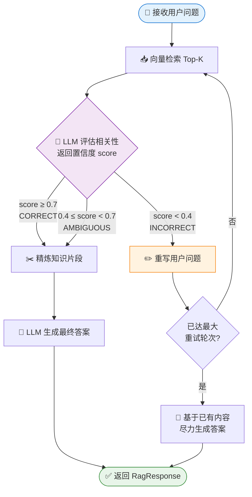
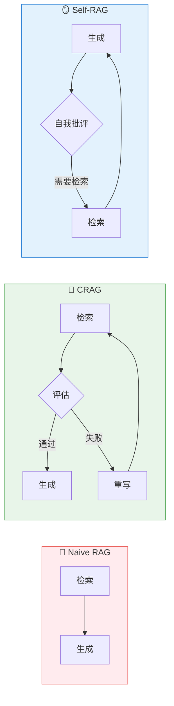

# 具有反思能力的 Agentic RAG 实战：用 LangChain4j 实现 CRAG 纠错检索

> 传统 RAG 是"听天由命"——检索到什么就回答什么，检索质量决定了答案质量。CRAG（Corrective RAG，纠错式检索增强）引入了自我反思和纠错循环，让 AI 像一个负责任的研究员：先找资料，再评估资料是否可靠，不行就换个思路重新找。本文从原理到实战，提供基于 Spring Boot 4 + LangChain4j 1.x 原生 API 的完整 Java 实现代码，可直接运行。
>
> 📌 **核心论文**：[Corrective Retrieval Augmented Generation](https://arxiv.org/abs/2401.15884)（arXiv:2401.15884）
> 📌 **适合人群**：有 RAG 基础的 Java 后端开发者、希望构建高可靠 AI 应用的架构师


<!--
  MindMapFloat 知识维度（完成正文后填写）
-->
<MindMapFloat title="CRAG Agentic RAG 知识图谱">

```mindmap-data
# CRAG Agentic RAG
## 为什么传统 RAG 不够用
- 一次检索就决定答案
- 检索噪声直接污染生成
- 问题措辞影响检索命中率
## 核心机制
- 轻量级检索评估器
- 相关性置信度打分
- 三条分支：CORRECT / AMBIGUOUS / INCORRECT
- 问题重写器（Query Rewriter）
## CRAG 状态机
- RETRIEVE → EVALUATE → 分支判断
- REWRITE 后重新进入 RETRIEVE
- 最多 N 轮防止无限循环
## LangChain4j 实现要点
- ChatModel 低层 API
- InMemoryEmbeddingStore 本地向量库
- EmbeddingStoreContentRetriever 检索器
- 纯 Java 状态机，不依赖 Spring 集成包
## 调优与生产注意事项
- 评估阈值设定建议
- 最大重试轮次权衡
- 问题重写策略
```

</MindMapFloat>

## 关于本文档

本文覆盖 CRAG 从概念到可运行代码的完整链路，使用 Spring Boot 4 + LangChain4j 1.x **原生工具包**（不引入 `langchain4j-spring-boot-starter`），所有 LLM 交互均通过标准 `ChatModel` 接口完成。

- ✅ 传统 RAG 的核心缺陷与 Agentic RAG 的解决思路
- ✅ CRAG 状态机的三条分支详解（CORRECT / AMBIGUOUS / INCORRECT）
- ✅ 基于 LangChain4j 1.x 原生 API 的完整 CRAG 流水线实现
- ✅ 可直接运行的 JUnit 5 集成测试（内嵌 Ollama 可切换 OpenAI）
- ✅ 评估阈值、重试轮次、问题重写的调优建议

## 1. 传统 RAG 的困境：为什么"一锤子买卖"不靠谱

### 1.1 传统 RAG 的工作流程

传统 RAG（Retrieval-Augmented Generation）的运作方式很简单：用户提问 → 把问题向量化 → 在向量库里找最相似的文本块 → 把这些文本块塞进 prompt → 让 LLM 生成答案。整个过程就像去图书馆找书：找到了就回去读，哪怕找错了也照样交作业。



### 1.2 传统 RAG 的三大硬伤

传统 RAG 的致命问题在于：它完全信任检索结果，没有任何"质检"环节。

| 硬伤 | 具体表现 | 真实案例 |
|------|----------|----------|
| 检索噪声无过滤 | 语义相似但主题无关的文档混入上下文 | 问"量子纠缠"，检索到"量子力学历史介绍"而非定义 |
| 问题措辞依赖性强 | 换一种说法就命中完全不同的文档 | "如何降低内存占用" vs "Java 堆内存优化" 检索结果差异极大 |
| 无法发现检索失败 | 文档库没有答案时 LLM 仍然"努力"生成 | 知识库只有产品 A 的文档，询问产品 B 时 LLM 产生幻觉 |
| 单轮不可恢复 | 第一次检索失败就直接生成错误答案 | 用户一旦问法不准确，RAG 就彻底失效 |

> [!IMPORTANT]
> 传统 RAG 的本质矛盾：检索质量是不可控的，但 LLM 却被要求基于不可控的输入产出可控的答案——这在数学上根本无法保证。

### 1.3 Agentic RAG：给 RAG 装上"大脑"

Agentic RAG 的核心思想是：不再把 RAG 当成一条单向流水线，而是引入**评估-决策-纠错**的循环。系统不仅能检索，还能判断检索结果是否可用，并在不可用时主动采取纠正行动。

CRAG（Corrective RAG）是这一思路的代表性实现，由 [Corrective Retrieval Augmented Generation](https://arxiv.org/abs/2401.15884)（arXiv:2401.15884）论文于 2024 年提出。



## 2. CRAG 的核心机制：状态机与三分支决策

### 2.1 轻量级检索评估器

CRAG 的灵魂是一个**轻量级检索评估器（Lightweight Retrieval Evaluator）**。它的工作是：针对每一个检索到的文档，给出一个 0.0～1.0 的**相关性置信度分数**，然后据此触发不同的知识获取动作。

类比来说，这就像是你请了一位助理去图书馆找资料：

- 助理找到资料后，不是直接交给你，而是先自己快速扫一眼
- 如果内容明显相关，就直接给你
- 如果感觉相关性存疑，就标记一下，给你但同时说"你自己再看看"
- 如果明显跑题，就把你的问题重新整理后再去找一遍

> [!NOTE]
> 论文中的评估器是一个微调过的 T5-large 模型，但在工程实践中，用 LLM 直接做相关性打分同样有效，且无需额外训练。

### 2.2 CRAG 的三条分支详解

CRAG 的核心状态机基于三个判断分支，整个流水线围绕它们展开：

| 分支 | 触发条件 | 置信度区间（示例） | 系统行为 |
|------|----------|-------------------|----------|
| **CORRECT** | 检索内容高度相关 | ≥ 0.7 | 直接用检索内容生成答案 |
| **AMBIGUOUS** | 相关性不确定 | 0.4 ~ 0.7 | 精炼内容（提取核心片段）后生成 |
| **INCORRECT** | 检索内容不相关 | < 0.4 | 重写问题 → 重新检索（最多 N 轮） |

### 2.3 CRAG 完整状态机流程



## 3. LangChain4j 1.x 原生 API：核心组件速查

### 3.1 关键类与接口一览

在正式写 CRAG 代码之前，我们先理清 LangChain4j 1.x 中会用到的核心 API。注意：本文**只使用 `langchain4j` 原生包**，不引入 `langchain4j-spring-boot-starter` 或 `langchain4j-openai-spring-boot-starter`。

| 类 / 接口 | 包路径 | 用途 |
|-----------|--------|------|
| `ChatModel` | `dev.langchain4j.model.chat` | 所有 LLM 的统一接口，核心入口 |
| `UserMessage` | `dev.langchain4j.data.message` | 构造用户消息（低层 API） |
| `SystemMessage` | `dev.langchain4j.data.message` | 构造系统消息 |
| `InMemoryEmbeddingStore` | `dev.langchain4j.store.embedding.inmemory` | 内存向量库，无需外部依赖 |
| `AllMiniLmL6V2EmbeddingModel` | `dev.langchain4j.model.embedding.onnx.allminilml6v2` | 本地嵌入模型，无需 API Key |
| `EmbeddingStoreContentRetriever` | `dev.langchain4j.rag.content.retriever` | 基于向量库的内容检索器 |
| `TextSegment` | `dev.langchain4j.data.segment` | 文本片段，向量库的存储单元 |

### 3.2 LangChain4j 低层 Chat API 的正确用法

很多同学直接跳到 `AiServices` 高层 API，对低层 `ChatModel` 反而不熟。CRAG 的评估和重写步骤需要精确控制 prompt，所以我们使用低层 API：

```java
// LangChain4j 1.x 低层调用方式
// 不用 AiServices，直接调 model.chat()

ChatModel model = OpenAiChatModel.builder()
        .apiKey(System.getenv("OPENAI_API_KEY"))
        .modelName("gpt-4o-mini")
        .temperature(0.0)   // 评估任务需要确定性输出
        .build();

// 构造消息列表（支持 System + User 多条消息）
List<ChatMessage> messages = List.of(
        SystemMessage.from("你是一个相关性评估助手，只输出 0.0 到 1.0 的浮点数。"),
        UserMessage.from("问题：" + query + "\n文档：" + doc)
);

// 发送并获取响应
ChatResponse response = model.chat(messages);
String scoreText = response.aiMessage().text().trim();
double score = Double.parseDouble(scoreText);
```

> [!TIP]
> `model.chat(ChatMessage...)` 是 LangChain4j 1.x 的标准低层调用方式。返回的 `ChatResponse` 包含 `aiMessage()`，通过 `.text()` 获取文本内容。

## 4. 项目搭建：Maven 配置与依赖引入

### 4.1 pom.xml 依赖配置

使用原生 `langchain4j`，**不引入任何 Spring 集成包**。Spring Boot 4 仅用于提供 IoC 容器和测试基础设施。

```xml
<?xml version="1.0" encoding="UTF-8"?>
<project xmlns="http://maven.apache.org/POM/4.0.0"
         xmlns:xsi="http://www.w3.org/2001/XMLSchema-instance"
         xsi:schemaLocation="http://maven.apache.org/POM/4.0.0
         http://maven.apache.org/xsd/maven-4.0.0.xsd">
    <modelVersion>4.0.0</modelVersion>

    <parent>
        <groupId>org.springframework.boot</groupId>
        <artifactId>spring-boot-starter-parent</artifactId>
        <!-- Spring Boot 4 要求 Java 21+ -->
        <version>4.0.0</version>
        <relativePath/>
    </parent>

    <groupId>cn.smallyoung</groupId>
    <artifactId>agentic-rag-crag</artifactId>
    <version>1.0.0</version>
    <name>Agentic RAG - CRAG Demo</name>

    <properties>
        <java.version>21</java.version>
        <!--
          LangChain4j 版本说明：官方 1.x GA 从 1.0.0 开始发布，后续有 1.0.1、1.1.0 等迭代。
          本文基于 1.0.0 编写，如需更新只需修改此处。最新版本查看：
          https://github.com/langchain4j/langchain4j/releases
          注意：禁止引入 langchain4j-spring-boot-starter 等 Spring 集成包
        -->
        <langchain4j.version>1.13.1</langchain4j.version>
    </properties>

    <dependencies>
        <!-- Spring Boot Web（仅用于 IoC，不用 AI 自动配置） -->
        <dependency>
            <groupId>org.springframework.boot</groupId>
            <artifactId>spring-boot-starter-web</artifactId>
        </dependency>

        <!-- ✅ LangChain4j 核心包（原生） -->
        <dependency>
            <groupId>dev.langchain4j</groupId>
            <artifactId>langchain4j</artifactId>
            <version>${langchain4j.version}</version>
        </dependency>

        <!-- ✅ OpenAI 集成（原生，不是 spring starter） -->
        <dependency>
            <groupId>dev.langchain4j</groupId>
            <artifactId>langchain4j-open-ai</artifactId>
            <version>${langchain4j.version}</version>
        </dependency>

        <!-- ✅ 本地 ONNX 嵌入模型（无需 API Key，纯 Java 运行） -->
        <dependency>
            <groupId>dev.langchain4j</groupId>
            <artifactId>langchain4j-embeddings-all-minilm-l6-v2</artifactId>
            <version>${langchain4j.version}</version>
        </dependency>

        <!-- ✅ Spring Boot Test -->
        <dependency>
            <groupId>org.springframework.boot</groupId>
            <artifactId>spring-boot-starter-test</artifactId>
            <scope>test</scope>
        </dependency>
    </dependencies>
</project>
```

### 4.2 手动配置 LangChain4j Bean（不使用自动配置）

因为不用 `langchain4j-spring-boot-starter`，所有 Bean 需要手动在 `@Configuration` 类中声明：

```java
package cn.smallyoung.config;

import dev.langchain4j.data.segment.TextSegment;
import dev.langchain4j.model.chat.ChatModel;
import dev.langchain4j.model.embedding.EmbeddingModel;
import dev.langchain4j.model.embedding.onnx.allminilml6v2.AllMiniLmL6V2EmbeddingModel;
import dev.langchain4j.model.openai.OpenAiChatModel;
import dev.langchain4j.rag.content.retriever.ContentRetriever;
import dev.langchain4j.rag.content.retriever.EmbeddingStoreContentRetriever;
import dev.langchain4j.store.embedding.EmbeddingStore;
import dev.langchain4j.store.embedding.inmemory.InMemoryEmbeddingStore;
import org.springframework.context.annotation.Bean;
import org.springframework.context.annotation.Configuration;

/**
 * LangChain4j 原生 Bean 配置
 * 全部手动装配，不依赖任何 langchain4j-spring 自动配置
 */
@Configuration
public class LangChain4jConfig {

    /**
     * 核心 LLM：使用 OpenAI gpt-4o-mini
     * 也可替换为 OllamaChatModel（本地运行，无需 API Key）
     */
    @Bean
    public ChatModel chatModel() {
        return OpenAiChatModel.builder()
                .apiKey(System.getenv("OPENAI_API_KEY"))
                .modelName("gpt-4o-mini")
                // 评估任务要求输出稳定，temperature 设为 0
                .temperature(0.0)
                .build();
    }

    /**
     * 本地嵌入模型（AllMiniLm-L6-v2，纯 ONNX，JVM 内运行，无网络请求）
     */
    @Bean
    public EmbeddingModel embeddingModel() {
        return new AllMiniLmL6V2EmbeddingModel();
    }

    /**
     * 内存向量库，适合演示和单元测试
     * 生产环境可替换为 QdrantEmbeddingStore / PgVectorEmbeddingStore 等
     */
    @Bean
    public EmbeddingStore<TextSegment> embeddingStore() {
        return new InMemoryEmbeddingStore<>();
    }

    /**
     * 内容检索器：基于向量相似度，返回 Top-5 最相关片段
     */
    @Bean
    public ContentRetriever contentRetriever(
            EmbeddingStore<TextSegment> embeddingStore,
            EmbeddingModel embeddingModel) {
        return EmbeddingStoreContentRetriever.builder()
                .embeddingStore(embeddingStore)
                .embeddingModel(embeddingModel)
                .maxResults(5)      // 每次检索最多返回 5 个片段
                .minScore(0.3)      // 低于 0.3 的片段过滤掉
                .build();
    }
}
```

## 5. CRAG 核心实现：带反思循环的 RAG 流水线

### 5.1 请求/响应数据模型

```java
package cn.smallyoung.model;

/**
 * RAG 请求封装
 */
public record RagRequest(String query) {
    public static RagRequest of(String query) {
        return new RagRequest(query);
    }
}
```

```java
package cn.smallyoung.model;

/**
 * RAG 响应封装
 * cragRounds: 实际经历的反思轮次（0 表示第一轮就成功）
 * finalQuery: 最终实际使用的查询（经过重写后可能与原始问题不同）
 * answer: 最终生成的答案
 */
public record RagResponse(
        String answer,
        int cragRounds,
        String finalQuery,
        double lastEvaluationScore
) {
    public static RagResponse of(String answer, int rounds,
                                  String finalQuery, double score) {
        return new RagResponse(answer, rounds, finalQuery, score);
    }
}
```

### 5.2 CRAG 状态枚举

```java
package cn.smallyoung.model;

/**
 * CRAG 评估状态（对应论文中的三分支决策）
 * CORRECT:    检索内容高度相关，直接生成
 * AMBIGUOUS:  相关性不确定，精炼后生成
 * INCORRECT:  不相关，需要重写问题并重新检索
 */
public enum CragEvalState {
    CORRECT,
    AMBIGUOUS,
    INCORRECT
}
```

### 5.3 CRAG 核心流水线实现

这是整个文章最核心的部分。`AgenticRagPipeline` 实现了带反思循环的 CRAG 状态机，每一步都使用 LangChain4j 原生 API。

```java
package cn.smallyoung.pipeline;

import cn.smallyoung.model.CragEvalState;
import cn.smallyoung.model.RagRequest;
import cn.smallyoung.model.RagResponse;
import dev.langchain4j.data.message.ChatMessage;
import dev.langchain4j.data.message.SystemMessage;
import dev.langchain4j.data.message.UserMessage;
import dev.langchain4j.data.segment.TextSegment;
import dev.langchain4j.model.chat.ChatModel;
import dev.langchain4j.rag.content.Content;
import dev.langchain4j.rag.content.retriever.ContentRetriever;
import dev.langchain4j.rag.query.Query;
import org.slf4j.Logger;
import org.slf4j.LoggerFactory;

import java.util.List;
import java.util.stream.Collectors;

/**
 * CRAG（Corrective RAG）流水线
 *
 * 流程：
 * 1. 检索（Retrieve）
 * 2. 评估相关性（Evaluate），返回 0.0~1.0 置信度
 * 3. 分支决策：CORRECT → 生成; AMBIGUOUS → 精炼后生成;
 *             INCORRECT → 重写问题 → 回到步骤 1（最多 maxRounds 次）
 */
public class AgenticRagPipeline {

    private static final Logger log = LoggerFactory.getLogger(AgenticRagPipeline.class);

    private final ContentRetriever retriever;
    private final ChatModel chatModel;
    private final double evaluationThreshold;   // CORRECT 的置信度下限，默认 0.7
    private final double ambiguousThreshold;    // AMBIGUOUS 下限，默认 0.4
    private final int maxRounds;                // 最多允许反思重试几次

    private AgenticRagPipeline(Builder builder) {
        this.retriever = builder.retriever;
        this.chatModel = builder.chatModel;
        this.evaluationThreshold = builder.evaluationThreshold;
        this.ambiguousThreshold = builder.ambiguousThreshold;
        this.maxRounds = builder.maxRounds;
    }

    // ─────────────────────────────────────────────
    // 公共入口
    // ─────────────────────────────────────────────

    /**
     * 执行 CRAG 流水线
     * @param request 用户请求
     * @return 包含答案和元数据的 RagResponse
     */
    public RagResponse execute(RagRequest request) {
        String currentQuery = request.query();
        // rounds = 问题重写次数（不含首次检索）
        // 例：第一轮检索通过 → rounds=0；重写一次后通过 → rounds=1
        int rounds = 0;
        double lastScore = 0.0;
        List<Content> contents = List.of();

        // ── 反思循环 ──────────────────────────────────
        while (rounds <= maxRounds) {
            log.info("[CRAG] 第 {} 轮检索，当前查询：{}", rounds + 1, currentQuery);

            // Step 1: 检索
            contents = retriever.retrieve(Query.from(currentQuery));
            String retrievedText = mergeContents(contents);

            if (retrievedText.isBlank()) {
                log.warn("[CRAG] 检索结果为空，跳出循环直接生成");
                break;
            }

            // Step 2: 评估相关性
            lastScore = evaluateRelevance(currentQuery, retrievedText);
            CragEvalState state = classify(lastScore);
            log.info("[CRAG] 相关性评分：{}，状态：{}", lastScore, state);

            // Step 3: 分支决策
            if (state == CragEvalState.CORRECT || state == CragEvalState.AMBIGUOUS) {
                // 相关性足够或可接受，退出循环
                break;
            }

            // INCORRECT 分支：重写问题并继续循环
            if (rounds >= maxRounds) {
                log.warn("[CRAG] 已达最大重试轮次 {}，使用当前内容生成答案", maxRounds);
                break;
            }

            // 重写问题
            currentQuery = rewriteQuery(request.query(), currentQuery, retrievedText);
            log.info("[CRAG] 问题重写为：{}", currentQuery);
            rounds++;
        }

        // Step 4: 生成答案
        String answer = generateAnswer(request.query(), mergeContents(contents));

        return RagResponse.of(answer, rounds, currentQuery, lastScore);
    }

    // ─────────────────────────────────────────────
    // 私有方法：评估 / 重写 / 生成
    // ─────────────────────────────────────────────

    /**
     * 使用 LLM 评估检索内容与问题的相关性
     * 返回 0.0 ~ 1.0 的置信度分数
     */
    private double evaluateRelevance(String query, String retrievedText) {
        // 使用 LangChain4j 低层 API 直接调用
        List<ChatMessage> messages = List.of(
            SystemMessage.from("""
                你是一个检索相关性评估专家。
                你的任务是评估检索到的文档片段与用户问题的相关性。
                
                评分规则：
                - 1.0：文档直接、完整地回答了问题
                - 0.7~0.9：文档高度相关，包含核心信息
                - 0.4~0.6：文档部分相关，包含一些有用信息
                - 0.1~0.3：文档基本不相关，仅有极少相关内容
                - 0.0：完全不相关
                
                只输出一个 0.0 到 1.0 之间的浮点数，不要输出任何其他内容。
                """),
            UserMessage.from("""
                用户问题：%s
                
                检索到的文档内容：
                %s
                
                请输出相关性评分（0.0~1.0）：
                """.formatted(query, truncate(retrievedText, 2000)))
        );

        try {
            String scoreText = chatModel.chat(messages)
                                        .aiMessage()
                                        .text()
                                        .trim();
            return Double.parseDouble(scoreText);
        } catch (NumberFormatException e) {
            log.warn("[CRAG] 评分解析失败，返回默认值 0.5");
            return 0.5;
        }
    }

    /**
     * 使用 LLM 重写用户问题
     * 保留原始意图，换一种表达方式以提高检索命中率
     */
    private String rewriteQuery(String originalQuery,
                                 String currentQuery,
                                 String failedRetrievalText) {
        List<ChatMessage> messages = List.of(
            SystemMessage.from("""
                你是一个查询优化专家。
                用户的问题在当前知识库中检索效果不佳，需要你重写问题。
                
                重写原则：
                1. 保留原始问题的核心意图
                2. 使用更通用、更精确的术语
                3. 尝试不同的表达角度
                4. 只输出重写后的问题，不要任何解释
                """),
            UserMessage.from("""
                原始问题：%s
                当前查询（已尝试过）：%s
                检索到的内容（不相关）：%s
                
                请重写问题（只输出新问题）：
                """.formatted(originalQuery, currentQuery,
                               truncate(failedRetrievalText, 500)))
        );

        return chatModel.chat(messages).aiMessage().text().trim();
    }

    /**
     * 最终答案生成
     * 将检索内容作为上下文，让 LLM 基于证据回答问题
     */
    private String generateAnswer(String originalQuery, String context) {
        List<ChatMessage> messages = List.of(
            SystemMessage.from("""
                你是一个专业的知识问答助手。
                请基于提供的上下文信息回答用户问题。
                如果上下文信息不足以完整回答问题，请明确说明哪些部分无法从上下文获取。
                不要编造上下文中没有的信息。
                """),
            UserMessage.from("""
                上下文信息：
                %s
                
                用户问题：%s
                
                请基于上下文回答：
                """.formatted(context, originalQuery))
        );

        return chatModel.chat(messages).aiMessage().text().trim();
    }

    // ─────────────────────────────────────────────
    // 工具方法
    // ─────────────────────────────────────────────

    /** 根据置信度分数确定 CRAG 状态 */
    private CragEvalState classify(double score) {
        if (score >= evaluationThreshold) return CragEvalState.CORRECT;
        if (score >= ambiguousThreshold)  return CragEvalState.AMBIGUOUS;
        return CragEvalState.INCORRECT;
    }

    /** 将多个 Content 合并为一段文本 */
    private String mergeContents(List<Content> contents) {
        return contents.stream()
                .map(c -> c.textSegment().text())
                .collect(Collectors.joining("\n\n---\n\n"));
    }

    /** 截断过长的文本，避免超出 Token 限制 */
    private String truncate(String text, int maxLen) {
        return text.length() > maxLen ? text.substring(0, maxLen) + "..." : text;
    }

    // ─────────────────────────────────────────────
    // Builder
    // ─────────────────────────────────────────────

    public static Builder builder() {
        return new Builder();
    }

    public static class Builder {
        private ContentRetriever retriever;
        private ChatModel chatModel;
        private double evaluationThreshold = 0.7;
        private double ambiguousThreshold = 0.4;
        private int maxRounds = 3;

        public Builder retriever(ContentRetriever retriever) {
            this.retriever = retriever;
            return this;
        }

        public Builder chatModel(ChatModel chatModel) {
            this.chatModel = chatModel;
            return this;
        }

        /** 设置 CORRECT 分支的置信度下限（默认 0.7） */
        public Builder evaluationThreshold(double threshold) {
            this.evaluationThreshold = threshold;
            return this;
        }

        /** 设置 AMBIGUOUS 分支的置信度下限（默认 0.4） */
        public Builder ambiguousThreshold(double threshold) {
            this.ambiguousThreshold = threshold;
            return this;
        }

        /** 设置最大重试轮次（默认 3） */
        public Builder maxRounds(int maxRounds) {
            this.maxRounds = maxRounds;
            return this;
        }

        public AgenticRagPipeline build() {
            if (retriever == null) throw new IllegalArgumentException("retriever 不能为 null");
            if (chatModel == null) throw new IllegalArgumentException("chatModel 不能为 null");
            return new AgenticRagPipeline(this);
        }
    }
}
```

### 5.4 Spring 集成入口：注册 Pipeline Bean

```java
package cn.smallyoung.config;

import cn.smallyoung.pipeline.AgenticRagPipeline;
import dev.langchain4j.model.chat.ChatModel;
import dev.langchain4j.rag.content.retriever.ContentRetriever;
import org.springframework.context.annotation.Bean;
import org.springframework.context.annotation.Configuration;

/**
 * 将 AgenticRagPipeline 注册为 Spring Bean
 * 所有依赖均来自 LangChain4jConfig（手动声明的原生 Bean）
 */
@Configuration
public class CragPipelineConfig {

    @Bean
    public AgenticRagPipeline agenticRagPipeline(
            ContentRetriever contentRetriever,
            ChatModel chatModel) {
        return AgenticRagPipeline.builder()
                .retriever(contentRetriever)
                .chatModel(chatModel)
                .evaluationThreshold(0.7)  // 置信度 >= 0.7 视为相关
                .ambiguousThreshold(0.4)   // 置信度 >= 0.4 视为模糊
                .maxRounds(3)              // 最多允许反思重试 3 轮
                .build();
    }
}
```

## 6. 知识库预热：向量库数据灌入

CRAG 的前提是有一个预先填充好的向量库。以下是知识库初始化的标准做法：

```java
package cn.smallyoung.service;

import dev.langchain4j.data.document.Document;
import dev.langchain4j.data.document.DocumentSplitter;
import dev.langchain4j.data.document.splitter.DocumentSplitters;
import dev.langchain4j.data.embedding.Embedding;
import dev.langchain4j.data.segment.TextSegment;
import dev.langchain4j.model.embedding.EmbeddingModel;
import dev.langchain4j.store.embedding.EmbeddingStore;
import dev.langchain4j.store.embedding.EmbeddingStoreIngestor;
import org.springframework.stereotype.Service;

import java.util.List;

/**
 * 知识库初始化 Service
 * 负责将原始文本分割并灌入向量库
 */
@Service
public class KnowledgeBaseService {

    private final EmbeddingModel embeddingModel;
    private final EmbeddingStore<TextSegment> embeddingStore;

    public KnowledgeBaseService(EmbeddingModel embeddingModel,
                                 EmbeddingStore<TextSegment> embeddingStore) {
        this.embeddingModel = embeddingModel;
        this.embeddingStore = embeddingStore;
    }

    /**
     * 将文档列表灌入向量库
     * 使用 EmbeddingStoreIngestor 自动完成：切片 → 嵌入 → 存储
     *
     * @param rawTexts 原始文本列表（每条文本代表一篇文档）
     */
    public void ingest(List<String> rawTexts) {
        // 配置文档分割器：按 300 tokens 一片，50 tokens 重叠
        DocumentSplitter splitter = DocumentSplitters.recursive(300, 50);

        // EmbeddingStoreIngestor 是 LangChain4j 提供的数据灌入工具
        EmbeddingStoreIngestor ingestor = EmbeddingStoreIngestor.builder()
                .documentSplitter(splitter)
                .embeddingModel(embeddingModel)
                .embeddingStore(embeddingStore)
                .build();

        // 将字符串转为 Document，批量灌入
        List<Document> documents = rawTexts.stream()
                .map(Document::from)
                .toList();

        ingestor.ingest(documents);
    }

    /**
     * 手动嵌入并存储单条文本片段（用于精细控制）
     */
    public void addSegment(String text) {
        TextSegment segment = TextSegment.from(text);
        Embedding embedding = embeddingModel.embed(segment).content();
        embeddingStore.add(embedding, segment);
    }
}
```

## 7. 可运行测试代码：JUnit 5 集成测试

### 7.1 完整测试类

```java
package cn.smallyoung;

import cn.smallyoung.model.RagRequest;
import cn.smallyoung.model.RagResponse;
import cn.smallyoung.pipeline.AgenticRagPipeline;
import cn.smallyoung.service.KnowledgeBaseService;
import org.junit.jupiter.api.*;
import org.springframework.beans.factory.annotation.Autowired;
import org.springframework.boot.test.context.SpringBootTest;

import java.util.List;

import static org.assertj.core.api.Assertions.*;

/**
 * CRAG 流水线集成测试
 *
 * 运行前提：
 * 方式 A（推荐）：设置环境变量 OPENAI_API_KEY
 * 方式 B（本地）：将 LangChain4jConfig 中的 OpenAiChatModel 替换为 OllamaChatModel
 *                并在本地启动 Ollama（ollama serve + ollama pull qwen2.5:7b）
 */
@SpringBootTest
@TestMethodOrder(MethodOrderer.OrderAnnotation.class)
class AgenticRagPipelineIntegrationTest {

    @Autowired
    private AgenticRagPipeline pipeline;

    @Autowired
    private KnowledgeBaseService knowledgeBaseService;

    // ─────────────────────────────────────────────
    // 测试数据：量子物理领域知识库
    // ─────────────────────────────────────────────
    private static final List<String> PHYSICS_KNOWLEDGE = List.of(
        """
        量子纠缠（Quantum Entanglement）是量子力学中的一种现象。
        当两个粒子处于纠缠态时，对其中一个粒子的测量会瞬间影响另一个粒子的状态，
        无论它们相距多远。爱因斯坦称其为"鬼魅般的超距作用"。
        量子纠缠是量子通信和量子计算的核心资源。
        2022年，阿兰·阿斯佩、约翰·克劳泽和安东·蔡林格因量子纠缠实验研究荣获诺贝尔物理学奖。
        """,
        """
        薛定谔的猫是薛定谔于1935年提出的思想实验。
        一只猫被放在一个密封箱子里，箱子里有一个放射性原子。
        如果原子衰变，毒药会被释放，猫会死亡。
        根据量子叠加原理，在观测之前，原子处于"衰变"和"未衰变"的叠加态，
        因此猫也处于"死"和"活"的叠加态，直到有人打开箱子观察。
        这个实验说明量子力学从微观向宏观延伸时遇到的测量问题。
        """,
        """
        海森堡不确定性原理（Heisenberg Uncertainty Principle）指出：
        粒子的位置和动量不能同时被精确测量。
        位置测量得越精确，动量就越不确定，反之亦然。
        数学表达式为：Δx·Δp ≥ ℏ/2
        这不是测量技术的局限，而是自然界的基本属性。
        """,
        """
        量子计算机利用量子叠加和量子纠缠来处理信息。
        量子比特（Qubit）可以同时处于 0 和 1 的叠加状态，
        理论上能够并行处理大量计算。
        2023年，谷歌、IBM 等公司在量子霸权验证上取得重要进展。
        量子计算机在密码学、药物发现和优化问题上有巨大潜力。
        """
    );

    @BeforeEach
    void setUp() {
        // 每个测试前灌入知识库
        knowledgeBaseService.ingest(PHYSICS_KNOWLEDGE);
    }

    // ─────────────────────────────────────────────
    // 测试场景 1：正常命中（第一轮就相关）
    // ─────────────────────────────────────────────

    @Test
    @Order(1)
    @DisplayName("场景1：直接命中 - 量子纠缠定义查询")
    void whenQueryDirectlyMatchesKnowledgeBase_thenFirstRoundSucceeds() {
        // Given: 一个明确的、知识库中有答案的问题
        RagRequest request = RagRequest.of("什么是量子纠缠？");

        // When
        RagResponse response = pipeline.execute(request);

        // Then
        System.out.println("=== 测试1：直接命中 ===");
        System.out.println("答案：" + response.answer());
        System.out.println("反思轮次：" + response.cragRounds());
        System.out.println("最终评分：" + response.lastEvaluationScore());

        assertThat(response.answer()).isNotBlank();
        // 直接命中时，反思轮次应为 0（第一轮就通过评估）
        assertThat(response.cragRounds()).isLessThanOrEqualTo(1);
        assertThat(response.lastEvaluationScore()).isGreaterThan(0.4);
    }

    // ─────────────────────────────────────────────
    // 测试场景 2：需要问题重写（模糊问法）
    // ─────────────────────────────────────────────

    @Test
    @Order(2)
    @DisplayName("场景2：问题重写 - 模糊表达触发 CRAG 反思")
    void whenQueryIsAmbiguous_thenCragRewritesAndRetrieves() {
        // Given: 一个描述性表达而非直接问法的问题
        // "那个关于猫咪的量子实验" 可能不会直接命中 "薛定谔的猫"
        RagRequest request = RagRequest.of("那个关于猫咪死活的量子实验是什么？");

        // When
        RagResponse response = pipeline.execute(request);

        // Then
        System.out.println("=== 测试2：问题重写 ===");
        System.out.println("原始问题：" + request.query());
        System.out.println("最终查询：" + response.finalQuery());
        System.out.println("反思轮次：" + response.cragRounds());
        System.out.println("答案摘要：" + response.answer().substring(0, Math.min(100, response.answer().length())));

        assertThat(response.answer()).isNotBlank();
        // 答案应该提到薛定谔
        assertThat(response.answer()).containsIgnoringCase("薛定谔");
        // 反思轮次不超过 maxRounds
        assertThat(response.cragRounds()).isLessThanOrEqualTo(3);
    }

    // ─────────────────────────────────────────────
    // 测试场景 3：知识库完全不包含的问题
    // ─────────────────────────────────────────────

    @Test
    @Order(3)
    @DisplayName("场景3：超出知识库范围 - 验证最大重试后的优雅降级")
    void whenQueryIsOutOfScope_thenPipelineGracefullyDegrades() {
        // Given: 知识库只有量子物理内容，询问完全不相关的话题
        RagRequest request = RagRequest.of("Java 21 虚拟线程的实现原理是什么？");

        // When
        RagResponse response = pipeline.execute(request);

        // Then
        System.out.println("=== 测试3：超出范围 ===");
        System.out.println("答案：" + response.answer());
        System.out.println("总反思轮次：" + response.cragRounds());
        System.out.println("最终评分：" + response.lastEvaluationScore());

        // 即使超出范围，系统也应该返回一个答案（优雅降级），而不是抛出异常
        assertThat(response.answer()).isNotBlank();
        // 最终评分应该较低（表明知识库不包含相关内容）
        assertThat(response.lastEvaluationScore()).isLessThan(0.7);
    }

    // ─────────────────────────────────────────────
    // 测试场景 4：验证 Builder 参数配置
    // ─────────────────────────────────────────────

    @Test
    @Order(4)
    @DisplayName("场景4：自定义参数 - 验证 evaluationThreshold 和 maxRounds 生效")
    void whenCustomThresholdSet_thenPipelineRespectsConfiguration(
            @Autowired dev.langchain4j.model.chat.ChatModel chatModel,
            @Autowired dev.langchain4j.rag.content.retriever.ContentRetriever contentRetriever) {

        // Given: 创建一个高阈值的 Pipeline（更挑剔的评估标准）
        AgenticRagPipeline strictPipeline = AgenticRagPipeline.builder()
                .retriever(contentRetriever)
                .chatModel(chatModel)
                .evaluationThreshold(0.9)  // 非常严格：90% 以上才算 CORRECT
                .ambiguousThreshold(0.6)
                .maxRounds(1)              // 只允许 1 次重试
                .build();

        RagRequest request = RagRequest.of("不确定性原理的数学表达式");

        // When
        RagResponse response = strictPipeline.execute(request);

        // Then
        System.out.println("=== 测试4：严格阈值 ===");
        System.out.println("答案：" + response.answer());
        System.out.println("实际评分：" + response.lastEvaluationScore());

        assertThat(response.answer()).isNotBlank();
        // 严格阈值下，反思轮次可能更多（但受 maxRounds=1 限制）
        assertThat(response.cragRounds()).isLessThanOrEqualTo(1);
    }
}
```

### 7.2 本地运行配置（切换 Ollama，无需 API Key）

如果你没有 OpenAI API Key，只需修改 `LangChain4jConfig` 中的 `chatModel` Bean：

```java
// 将 OpenAiChatModel 替换为 OllamaChatModel
// 需要先在本地启动 Ollama：https://ollama.com
// 然后拉取模型：ollama pull qwen2.5:7b

@Bean
public ChatModel chatModel() {
    return OllamaChatModel.builder()
            .baseUrl("http://localhost:11434")
            .modelName("qwen2.5:7b")      // 或 llama3.2, mistral 等
            .temperature(0.0)
            .build();
}
```

> [!NOTE]
> `langchain4j-ollama` 依赖需要额外引入：
> ```xml
> <dependency>
>     <groupId>dev.langchain4j</groupId>
>     <artifactId>langchain4j-ollama</artifactId>
>     <version>${langchain4j.version}</version>
> </dependency>
> ```

## 8. 最佳实践：调优 CRAG 的三个核心参数

### 8.1 evaluationThreshold 与 ambiguousThreshold 的设定策略

评估阈值是 CRAG 的最关键参数，直接影响反思频率和系统成本：

| 应用场景 | 推荐 evaluationThreshold | 推荐 ambiguousThreshold | 理由 |
|----------|--------------------------|------------------------|------|
| 医疗/法律（高准确性要求） | 0.85 | 0.6 | 宁可多反思，不接受低质量内容 |
| 企业知识库（均衡型） | 0.7 | 0.4 | 平衡准确性与 API 调用成本 |
| 客服机器人（高响应速度要求） | 0.6 | 0.35 | 减少重试，优先速度 |
| 开放式问答（探索型） | 0.5 | 0.3 | 接受模糊结果，减少等待 |

### 8.2 maxRounds 的权衡

> [!WARNING]
> `maxRounds` 不是越大越好。每一轮重试都会多消耗 2-3 次 LLM 调用（评估 + 重写）。在生产环境中，建议不超过 3 轮。

| maxRounds 值 | 额外 LLM 调用次数（最坏情况） | 适用场景 |
|-------------|-------------------------------|----------|
| 1 | +2 次 | 成本敏感、延迟敏感 |
| 2 | +4 次 | 通用生产环境推荐 |
| 3 | +6 次 | 准确性优先，成本次要 |
| 5+ | +10 次以上 | ⚠️ 不推荐，成本激增，收益递减 |

### 8.3 问题重写的常见错误与修复

> [!CAUTION]
> **常见错误**：让 LLM 完全自由重写问题，导致重写后偏离用户原始意图。

```java
// ❌ 错误示例：没有约束重写边界
UserMessage.from("请重写这个问题让它更容易检索：" + query);

// ✅ 正确示例：明确保留意图约束 + 提供失败上下文
UserMessage.from("""
    原始问题：%s
    当前查询（已失败）：%s
    检索到的内容（不相关）：%s
    
    重写规则：
    1. 必须保留原始问题的核心意图
    2. 使用行业通用术语替换口语化表达
    3. 只输出重写后的问题，不要解释
    """.formatted(originalQuery, currentQuery, failedContent));
```

## 9. CRAG vs 相关技术方案横向对比

### 9.1 Agentic RAG 主要实现方式对比



| 对比维度 | Naive RAG | CRAG | Self-RAG | Agentic RAG（多 Agent） |
|----------|-----------|------|----------|------------------------|
| 反思能力 | ❌ 无 | ✅ 检索前评估 | ✅ 生成后自我批评 | ✅✅ 多层次反思 |
| 实现复杂度 | ⭐ 极简 | ⭐⭐⭐ 中等 | ⭐⭐⭐⭐ 较复杂 | ⭐⭐⭐⭐⭐ 复杂 |
| LLM 额外调用 | 0 次 | 2-6 次 | 2-8 次 | 不定 |
| 延迟影响 | 基准 | +50%~200% | +100%~300% | +200%+ |
| 幻觉减少效果 | 基准 | 显著改善 | 显著改善 | 最佳 |
| 适合场景 | 简单 QA | 企业知识库 | 长文本生成 | 复杂多步骤任务 |

> [!IMPORTANT]
> **何时选择 CRAG？**
> - ✅ 知识库内容质量参差不齐，需要过滤低质量检索结果
> - ✅ 用户提问方式多样化，同一问题有多种表达形式
> - ✅ 对答案准确性要求高，幻觉是不可接受的
> - ❌ 不适合：实时性要求极强（<200ms 响应），因为 CRAG 的多次 LLM 调用会增加延迟

## 10. 总结

> [!NOTE]
> **2026 年现状**：截至 2026 年，LangChain4j 已发布 1.x GA 正式版，CRAG 等 Agentic RAG 模式已成为企业级 Java AI 应用架构的主流选择。Spring Boot 4 对 Java 21 虚拟线程的原生支持，也让多轮 CRAG 反思循环的并发性能得到显著提升。

| 核心概念 | 一句话解释 |
|---------|-----------|
| **Agentic RAG** | 赋予 RAG 流水线自主决策和自我纠错能力的架构范式 |
| **CRAG** | 通过检索评估 + 问题重写循环提升 RAG 鲁棒性的具体实现 |
| **检索评估器** | 对检索结果打 0~1 置信度分，决定是否需要纠错 |
| **问题重写器** | INCORRECT 分支下，用 LLM 重新措辞以提高检索命中率 |
| **evaluationThreshold** | 判定 CORRECT 的置信度门槛，越高则越挑剔 |
| **maxRounds** | 反思循环上限，防止无限重试和成本失控 |

> [!TIP]
> **学习路径建议**：
> 1. 先跑通本文的测试用例，用 Ollama 本地模型零成本验证
> 2. 替换为生产级向量库（Qdrant / PgVector），灌入真实业务文档
> 3. 在评估 prompt 中加入领域专业知识，提高评分精准度
> 4. 结合监控指标（平均反思轮次、最终评分分布）持续调优阈值参数

## 11. 参考资料

### 核心论文

| 论文 | 作者/机构 | 年份 | 主要贡献 |
|------|-----------|------|----------|
| [Corrective Retrieval Augmented Generation](https://arxiv.org/abs/2401.15884) | Yan Shi 等 | 2024 | 提出 CRAG 框架，引入轻量级检索评估器 |
| [Self-RAG: Learning to Retrieve, Generate, and Critique](https://arxiv.org/abs/2310.11511) | Asai 等 | 2024 | 生成时自我批评的 RAG 变体 |
| [Retrieval-Augmented Generation for Knowledge-Intensive NLP Tasks](https://arxiv.org/abs/2005.11401) | Lewis 等 | 2020 | RAG 原始论文，奠定检索增强生成基础 |

### 推荐资源

- [LangChain4j 官方文档](https://docs.langchain4j.dev/)
- [LangChain4j GitHub 仓库](https://github.com/langchain4j/langchain4j)
- [CRAG 原始论文 PDF](https://arxiv.org/pdf/2401.15884)
- [LangGraph4j - Java 状态图框架（适合更复杂的 Agentic 场景）](https://github.com/langgraph4j/langgraph4j)
