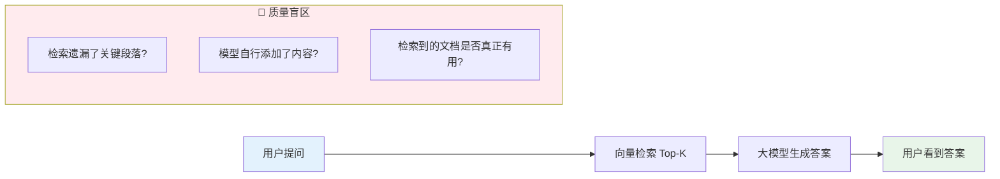
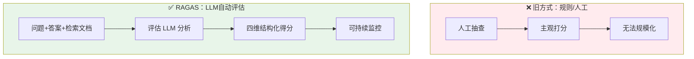
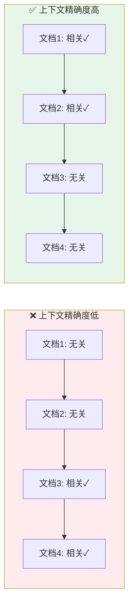

> 你上线了一个 RAG 系统，用户体验似乎还不错——但"感觉不错"不是工程答案。RAGAS 框架用四个可量化的维度，像阅卷老师一样给你的 RAG 系统全面打分，让质量有据可查。本文基于 Spring Boot 3.4 + LangChain4j 1.13.1，提供一套从评估逻辑、API 调用到 Micrometer 监控的完整 Java 实现。
>
> 📌 **核心论文**：[Ragas: Automated Evaluation of Retrieval Augmented Generation](https://arxiv.org/abs/2309.15217)（arXiv:2309.15217）
>
> 📌 **适合人群**：Java/Spring Boot 开发者，有 RAG 基础，想建立系统性质量评估体系


<!--
  MindMapFloat 节点是知识维度，完成正文后填写
-->
<MindMapFloat title="RAG质量评估知识图谱">

```mindmap-data
# RAG 质量评估
## 为什么要评估
- 幻觉无处不在
- 检索质量难以感知
- 生产环境需要持续监控
## 四大评估维度
- 忠实度：答案有没有超出检索内容
- 答案相关性：是否直接回答了问题
- 上下文召回：有没有漏掉关键信息
- 上下文精确：有用信息是否排在前面
## LLM-as-Judge 原理
- 用大模型评估大模型
- 声明式分解 + 蕴含判断
- 无需人工标注
## Java 实现路径
- OpenAI 兼容接口对接 DeepSeek/通义
- 评估结果结构化解析
- 调和平均综合得分
## 生产级监控
- Micrometer 指标埋点
- SSE 流式实时推送
- Token 消耗与延迟追踪
```

</MindMapFloat>

## 关于本文档

RAG 系统上线只是起点，如何持续保证它的"聪明程度"才是挑战。本文从评估动机出发，系统讲解 RAGAS 框架的工作原理，并提供基于 Spring Boot 3.4 + LangChain4j 1.13.1 的完整 Java 可运行实现。

- ✅ RAGAS 四大核心指标的含义与计算逻辑
- ✅ LLM-as-Judge 评估原理深度解析
- ✅ DeepSeek / 通义千问 API 对接完整配置
- ✅ 自动化评估服务 + JUnit 5 可运行测试代码
- ✅ Micrometer 指标监控 + SSE 实时推送集成

## 1. 你的 RAG 系统出了什么问题？

### 1.1 RAG 的"感觉好"陷阱

大多数团队上线 RAG 系统后，靠两种方式判断质量：人工抽查几条对话，或者收集用户投诉。这两种方式都有根本性缺陷——前者无法覆盖长尾场景，后者是事后止损。

更糟的是，RAG 系统的问题往往隐而不发。大模型天生擅长"看起来很有道理"的回答，即使它悄悄混入了检索文档里没有的内容（幻觉），用户短期内也很难察觉。



### 1.2 传统指标为什么不够用

工程师们尝试过 BLEU、ROUGE 等 NLP 指标，但这些指标在 RAG 场景下有严重局限。

| 指标 | 设计目标 | RAG 场景局限 | 真实问题 |
|------|---------|-------------|---------|
| BLEU | 机器翻译 n-gram 重合度 | 表面词汇匹配，不理解语义 | 同义改写被判为错误 |
| ROUGE | 文本摘要召回率 | 忽略答案的事实准确性 | 错误内容也能拿高分 |
| 人工评审 | 专家主观打分 | 无法规模化，成本高 | 上线后无法持续监控 |
| 准确率/F1 | 分类任务 | 开放式问答无标准答案 | 评估结果无意义 |

> [!IMPORTANT]
> 核心矛盾：RAG 系统的质量由**检索质量**和**生成质量**共同决定，传统指标只能评估生成文本的表面形态，无法衡量"答案是否忠于检索内容"这一 RAG 特有的核心问题。

### 1.3 RAGAS 的解法：用 LLM 评估 LLM

RAGAS（Retrieval Augmented Generation Assessment）由 Es et al. 在 2023 年提出，核心思想是将评估本身也交给大语言模型来做——即 **LLM-as-Judge** 模式。这样做有几个优势：无需人工标注的黄金答案、可以理解语义而非仅匹配词汇、可以大规模自动化执行。



## 2. RAGAS 四大核心指标深度解析

RAGAS 从检索和生成两个维度各拆出两个指标，构成一个 2×2 的评估矩阵。

### 2.1 忠实度（Faithfulness）——大模型有没有"加戏"？

**生活类比**：就像法庭上要求证人"只陈述你亲眼所见"，忠实度要求 RAG 的答案"只来自检索到的内容"。

**计算逻辑**：

1. 将生成的答案拆解成多个独立的**声明（Claims）**
2. 对每条声明，判断检索文档是否支持它（蕴含判断）
3. 忠实度 = 被支持的声明数 / 总声明数

$$\text{Faithfulness} = \frac{|\text{支持的声明}|}{|\text{总声明数}|}$$

| 场景 | 答案 | 检索文档说了什么 | 忠实度 |
|------|------|----------------|-------|
| ✅ 高忠实度 | "量子纠缠描述的是两粒子间的关联" | 文档中明确提及 | 1.0 |
| ❌ 低忠实度 | "量子纠缠可用于即时通信" | 文档中未提及此结论 | 0.5 |

> [!WARNING]
> 忠实度不等于正确性！一个声明可能在检索文档中有支持，但检索文档本身是错误的。忠实度衡量的是"答案与检索内容的一致性"，而非答案的客观真实性。

### 2.2 答案相关性（Answer Relevancy）——有没有答非所问？

**生活类比**：你问"最近的地铁站在哪"，对方回答"地铁系统建于1970年代"——内容是真的，但没有回答你的问题。

**计算逻辑**：

1. 用评估 LLM 根据生成的答案**反推**出若干个可能的问题
2. 计算这些反推问题与原始问题的语义相似度
3. 取平均值作为答案相关性得分

这种"反向生成"的方式巧妙地避免了直接比较难题，高分意味着答案直接、专注地解决了原问题。

### 2.3 上下文召回（Context Recall）——检索有没有漏掉关键信息？

**生活类比**：标准答案里有 5 个要点，而你检索出的文档只覆盖了其中 3 个——召回率是 60%。

**计算逻辑**（需要参考答案）：

1. 将参考答案（Ground Truth）拆解成多个句子
2. 判断每个句子是否能被检索到的文档支撑
3. 上下文召回 = 被文档支撑的句子数 / 总句子数

这是唯一需要人工提供参考答案的指标，但在有黄金标准数据集的场景中非常有价值。

### 2.4 上下文精确（Context Precision）——有用内容是否优先排序？

**生活类比**：你检索出 5 段文字，但真正有用的都在第 4、5 位——前面全是噪音。大模型在处理长上下文时更关注前面的内容，所以排序本身就影响结果质量。

**计算逻辑**：

对检索结果的每个位置 k，计算 Precision@k，然后加权平均：

$$\text{Context Precision} = \frac{\sum_{k=1}^{K} \text{Precision@k} \times \text{rel}(k)}{|\text{相关文档总数}|}$$

其中 rel(k) 表示第 k 个文档是否相关。



### 2.5 四维指标总览

| 指标 | 评估对象 | 是否需要参考答案 | 分值范围 | 反映的问题 |
|------|---------|---------------|---------|-----------|
| 忠实度 | 生成器 | 否 | 0~1 | 大模型幻觉程度 |
| 答案相关性 | 生成器 | 否 | 0~1 | 答非所问程度 |
| 上下文召回 | 检索器 | **是** | 0~1 | 检索遗漏程度 |
| 上下文精确 | 检索器 | 否（可选） | 0~1 | 排序噪音程度 |
| **RAGAS综合分** | 全链路 | 可选 | 0~1 | 整体质量调和均值 |

> [!NOTE]
> RAGAS 综合分是四个指标的**调和平均数**（Harmonic Mean），调和平均对低分更敏感——任何一个维度有明显缺陷，综合分都会被拉低，这正是我们希望的行为。

## 3. 项目搭建：Spring Boot 3.4 + LangChain4j 1.13.1

### 3.1 Maven 依赖配置

```xml
<?xml version="1.0" encoding="UTF-8"?>
<project xmlns="http://maven.apache.org/POM/4.0.0"
         xmlns:xsi="http://www.w3.org/2001/XMLSchema-instance"
         xsi:schemaLocation="http://maven.apache.org/POM/4.0.0
         http://maven.apache.org/xsd/maven-4.0.0.xsd">
    <modelVersion>4.0.0</modelVersion>

    <groupId>cn.smallyoung</groupId>
    <artifactId>ragas-eval</artifactId>
    <version>1.0.0</version>
    <packaging>jar</packaging>

    <parent>
        <groupId>org.springframework.boot</groupId>
        <artifactId>spring-boot-starter-parent</artifactId>
        <version>3.4.0</version>
    </parent>

    <properties>
        <java.version>21</java.version>
        <!-- LangChain4j BOM 统一管理版本 -->
        <langchain4j.version>1.13.1</langchain4j.version>
    </properties>

    <dependencyManagement>
        <dependencies>
            <dependency>
                <groupId>dev.langchain4j</groupId>
                <artifactId>langchain4j-bom</artifactId>
                <version>${langchain4j.version}</version>
                <type>pom</type>
                <scope>import</scope>
            </dependency>
        </dependencies>
    </dependencyManagement>

    <dependencies>
        <!-- Spring Boot Web（含 SSE 支持） -->
        <dependency>
            <groupId>org.springframework.boot</groupId>
            <artifactId>spring-boot-starter-web</artifactId>
        </dependency>
        <!-- Spring Boot WebFlux（Flux<String> SSE 流式推送） -->
        <dependency>
            <groupId>org.springframework.boot</groupId>
            <artifactId>spring-boot-starter-webflux</artifactId>
        </dependency>

        <!-- LangChain4j 核心 + Spring Boot Starter -->
        <dependency>
            <groupId>dev.langchain4j</groupId>
            <artifactId>langchain4j-spring-boot-starter</artifactId>
        </dependency>
        <!-- OpenAI 兼容接口（DeepSeek / 通义千问均兼容此协议） -->
        <dependency>
            <groupId>dev.langchain4j</groupId>
            <artifactId>langchain4j-open-ai-spring-boot-starter</artifactId>
        </dependency>

        <!-- Micrometer + Prometheus（指标监控） -->
        <dependency>
            <groupId>org.springframework.boot</groupId>
            <artifactId>spring-boot-starter-actuator</artifactId>
        </dependency>
        <dependency>
            <groupId>io.micrometer</groupId>
            <artifactId>micrometer-registry-prometheus</artifactId>
        </dependency>

        <!-- 工具类 -->
        <dependency>
            <groupId>org.projectlombok</groupId>
            <artifactId>lombok</artifactId>
            <optional>true</optional>
        </dependency>

        <!-- 测试依赖 -->
        <dependency>
            <groupId>org.springframework.boot</groupId>
            <artifactId>spring-boot-starter-test</artifactId>
            <scope>test</scope>
        </dependency>
        <dependency>
            <groupId>io.projectreactor</groupId>
            <artifactId>reactor-test</artifactId>
            <scope>test</scope>
        </dependency>
    </dependencies>
</project>
```

### 3.2 多模型配置（DeepSeek 优先，通义千问备用）

```yaml
# application.yml
spring:
  application:
    name: ragas-eval-service
  main:
    # 允许 Bean 定义覆盖（因为我们手动定义了 ChatModel，可能与 Starter 自动配置冲突）
    allow-bean-definition-overriding: true

# LangChain4j 相关配置
langchain4j:
  open-ai:
    chat-model:
      base-url: https://api.deepseek.com/v1
      api-key: ${DEEPSEEK_API_KEY}
      model-name: deepseek-chat

# Actuator 暴露所有端点（生产环境按需收紧）
management:
  endpoints:
    web:
      exposure:
        include: "health,info,prometheus,metrics"
  metrics:
    tags:
      application: ${spring.application.name}
```

## 4. RAGAS 评估器核心实现

LangChain4j 目前没有内置 RAGAS 评估模块，但通过 **LLM-as-Judge** 模式，我们可以用几个精心设计的 Prompt 完整实现四维评估逻辑。

### 4.1 数据模型定义

```java
// RagasMetrics.java
package cn.smallyoung.ragas.model;

/**
 * RAGAS 四维评估结果数据模型
 * 包含忠实度、答案相关性、上下文召回、上下文精确以及综合调和平均分
 * 
 * @param faithfulness      忠实度：衡量答案是否仅基于检索到的上下文生成
 * @param answerRelevancy   答案相关性：衡量答案是否直接回答了用户的问题
 * @param contextRecall     上下文召回：衡量检索到的内容是否覆盖了参考答案的关键点（需提供 groundTruth）
 * @param contextPrecision  上下文精确：衡量有用的内容在检索结果中的排名是否靠前
 * @param harmonicMean       综合得分：各维度指标的调和平均数，对低分项更敏感
 */
public record RagasMetrics(
        double faithfulness,
        double answerRelevancy,
        double contextRecall,
        double contextPrecision,
        double harmonicMean
) {
    /**
     * 计算多个分值的调和平均数
     * 调和平均数公式：H = n / (∑ 1/x_i)
     */
    public static double computeHarmonicMean(double... scores) {
        double sum = 0.0;
        int count = 0;
        for (double s : scores) {
            // 只计算有效的分数（大于 0 且非未评估项 -1）
            if (s > 0) {
                sum += 1.0 / s;
                count++;
            }
        }
        return count == 0 ? 0.0 : count / sum;
    }
}
```

```java
// EvaluationRequest.java
package cn.smallyoung.ragas.model;

import java.util.List;

/**
 * RAGAS 评估请求对象
 * 封装了评估一个 RAG 系统回答所需的所有核心要素
 *
 * @param question    用户提交的原始问题
 * @param answer      RAG 系统生成并展示给用户的答案
 * @param contexts    RAG 系统在检索阶段获取的上下文文档片段列表
 * @param groundTruth 标准参考答案（可选。如果提供，将启用 Context Recall 评估维度）
 */
public record EvaluationRequest(
        String question,
        String answer,
        List<String> contexts,
        String groundTruth
) {
    /** 无需参考答案的简化构造 */
    public EvaluationRequest(String question, String answer, List<String> contexts) {
        this(question, answer, contexts, null);
    }
}
```

### 4.2 LangChain4j 大模型组件配置

在 RAGAS 评估场景中，评估模型作为“评委”必须设置 `Temperature=0` 以保证评估结果的确定性。

```java
// LlmConfig.java
package cn.smallyoung.ragas.config;

import dev.langchain4j.model.chat.ChatModel;
import dev.langchain4j.model.openai.OpenAiChatModel;
import org.springframework.beans.factory.annotation.Value;
import org.springframework.context.annotation.Bean;
import org.springframework.context.annotation.Configuration;
import org.springframework.context.annotation.Primary;
import java.time.Duration;

@Configuration
public class LlmConfig {

    @Value("${langchain4j.open-ai.chat-model.base-url}")
    private String baseUrl;

    @Value("${langchain4j.open-ai.chat-model.api-key}")
    private String apiKey;

    @Value("${langchain4j.open-ai.chat-model.model-name}")
    private String modelName;

    @Bean
    @Primary
    public ChatModel chatModel() {
        return OpenAiChatModel.builder()
                .baseUrl(baseUrl)
                .apiKey(apiKey)
                .modelName(modelName)
                .temperature(0.7)
                .timeout(Duration.ofSeconds(60))
                .build();
    }

    @Bean(name = "evaluationChatModel")
    public ChatModel evaluationChatModel() {
        return OpenAiChatModel.builder()
                .baseUrl(baseUrl)
                .apiKey(apiKey)
                .modelName(modelName)
                .temperature(0.0) // 核心点：评估模型必须设为 0
                .timeout(Duration.ofSeconds(120))
                .logRequests(true)
                .logResponses(true)
                .build();
    }
}
```

### 4.3 LLM-as-Judge 评估器实现

```java
// RagasEvaluator.java
package cn.smallyoung.ragas.service;

import cn.smallyoung.ragas.model.EvaluationRequest;
import cn.smallyoung.ragas.model.RagasMetrics;
import dev.langchain4j.model.chat.ChatModel;
import org.slf4j.Logger;
import org.slf4j.LoggerFactory;
import org.springframework.beans.factory.annotation.Qualifier;
import org.springframework.stereotype.Service;

import java.util.List;
import java.util.regex.Matcher;
import java.util.regex.Pattern;

/**
 * RAGAS 自动化评估器
 * 基于 LLM-as-Judge 模式，通过多轮 Prompt 交互实现 RAG 质量的量化评分。
 */
@Service
public class RagasEvaluator {

    private static final Logger log = LoggerFactory.getLogger(RagasEvaluator.class);

    private final ChatModel chatModel;

    public RagasEvaluator(@Qualifier("evaluationChatModel") ChatModel chatModel) {
        this.chatModel = chatModel;
    }

    // ─────────────────────────────────────────────────────────
    // Prompt 模板：忠实度评估
    // ─────────────────────────────────────────────────────────
    private static final String FAITHFULNESS_PROMPT = """
            你是一个严格的 RAG 系统评估专家。请评估以下 RAG 系统回答的忠实度（Faithfulness）。

            【用户问题】：{{question}}
            【检索到的上下文】：{{contexts}}
            【RAG系统的回答】：{{answer}}

            【评估任务】：
            1. 将回答拆解为独立的原子声明（每行一条）。
            2. 对每条声明，判断上下文是否明确支持（SUPPORTED）或不支持（NOT_SUPPORTED）。
            3. 忠实度 = SUPPORTED 数量 / 总声明数量。

            请严格按以下格式输出，不要包含任何多余文字：
            CLAIMS:
            - [声明1] -> SUPPORTED/NOT_SUPPORTED
            - [声明2] -> SUPPORTED/NOT_SUPPORTED
            FAITHFULNESS_SCORE: 0.XX
            """;

    private static final String ANSWER_RELEVANCY_PROMPT = """
            你是一个严格的 RAG 系统评估专家。请评估以下回答的答案相关性（Answer Relevancy）。

            【原始用户问题】：{{question}}
            【RAG系统的回答】：{{answer}}

            【评估任务】：
            1. 根据提供的回答，反向推导出 3 个可能的用户问题。
            2. 计算每个推导出的问题与原始问题的语义相似度（0.0 到 1.0）。
            3. 答案相关性 = 平均语义相似度。

            请严格按以下格式输出：
            GENERATED_QUESTIONS:
            - [问题1]（相似度: 0.XX）
            - [问题2]（相似度: 0.XX）
            - [问题3]（相似度: 0.XX）
            ANSWER_RELEVANCY_SCORE: 0.XX
            """;

    private static final String CONTEXT_RECALL_PROMPT = """
            你是一个严格的 RAG 系统评估专家。请评估上下文召回率（Context Recall）。

            【用户问题】：{{question}}
            【标准参考答案】：{{ground_truth}}
            【检索到的上下文】：{{contexts}}

            【评估任务】：
            1. 将标准参考答案拆解为独立的句子。
            2. 对每个句子，判断检索到的上下文是否包含能够支撑该句子的信息。
            3. 上下文召回率 = 被支持的句子数 / 总句子数。

            请严格按以下格式输出：
            SENTENCES:
            - [句子1] -> SUPPORTED/NOT_SUPPORTED
            - [句子2] -> SUPPORTED/NOT_SUPPORTED
            CONTEXT_RECALL_SCORE: 0.XX
            """;

    private static final String CONTEXT_PRECISION_PROMPT = """
            你是一个严格的 RAG 系统评估专家。请评估上下文精确度（Context Precision）。

            【用户问题】：{{question}}
            【检索到的上下文（按排名顺序）】：
            {{contexts_with_index}}
            【RAG系统的回答】：{{answer}}

            【评估任务】：
            判断每一段上下文是否与回答该问题相关（RELEVANT/NOT_RELEVANT）。
            计算相关文档在排名中的精确度分布，得出加权得分。

            请严格按以下格式输出：
            RELEVANCE:
            - [位置1] -> RELEVANT/NOT_RELEVANT
            - [位置2] -> RELEVANT/NOT_RELEVANT
            CONTEXT_PRECISION_SCORE: 0.XX
            """;

    public RagasMetrics evaluate(EvaluationRequest request) {
        log.info("开始执行 RAGAS 评估流程，问题：[{}]", request.question());

        double faithfulness = runEvaluation(FAITHFULNESS_PROMPT, request, "FAITHFULNESS_SCORE");
        double answerRelevancy = runEvaluation(ANSWER_RELEVANCY_PROMPT, request, "ANSWER_RELEVANCY_SCORE");
        double contextRecall = (request.groundTruth() != null && !request.groundTruth().isBlank())
                ? runEvaluation(CONTEXT_RECALL_PROMPT, request, "CONTEXT_RECALL_SCORE")
                : -1.0;
        double contextPrecision = runEvaluation(CONTEXT_PRECISION_PROMPT, request, "CONTEXT_PRECISION_SCORE");

        double harmonicMean = contextRecall >= 0
                ? RagasMetrics.computeHarmonicMean(faithfulness, answerRelevancy, contextRecall, contextPrecision)
                : RagasMetrics.computeHarmonicMean(faithfulness, answerRelevancy, contextPrecision);

        RagasMetrics result = new RagasMetrics(faithfulness, answerRelevancy, contextRecall, contextPrecision, harmonicMean);

        log.info("评估完成 | 综合分：{} | 忠实度：{} | 相关性：{} | 精确度：{}", 
                String.format("%.2f", harmonicMean), String.format("%.2f", faithfulness),
                String.format("%.2f", answerRelevancy), String.format("%.2f", contextPrecision));

        return result;
    }

    private double runEvaluation(String template, EvaluationRequest req, String scoreKey) {
        String contextsText = String.join("\n---\n", req.contexts());
        StringBuilder indexedContexts = new StringBuilder();
        for (int i = 0; i < req.contexts().size(); i++) {
            indexedContexts.append("[位置").append(i + 1).append("]\n")
                    .append(req.contexts().get(i)).append("\n\n");
        }

        String prompt = template
                .replace("{{question}}", req.question())
                .replace("{{answer}}", req.answer())
                .replace("{{contexts}}", contextsText)
                .replace("{{contexts_with_index}}", indexedContexts.toString())
                .replace("{{ground_truth}}", req.groundTruth() != null ? req.groundTruth() : "");

        try {
            String response = chatModel.chat(prompt);
            return parseScore(response, scoreKey);
        } catch (Exception e) {
            log.error("调用 LLM 评估 [{}] 时发生异常: {}", scoreKey, e.getMessage());
            return 0.5;
        }
    }

    private double parseScore(String response, String scoreKey) {
        Pattern pattern = Pattern.compile(scoreKey + ":\\s*([0-9.]+)");
        Matcher matcher = pattern.matcher(response);
        if (matcher.find()) {
            try {
                double score = Double.parseDouble(matcher.group(1));
                return Math.max(0.0, Math.min(1.0, score));
            } catch (NumberFormatException e) {
                log.warn("无法解析分值: {}", scoreKey);
            }
        }
        return 0.5;
    }
}
```

### 4.3 Micrometer 指标监控集成

```java
// RagasMetricsRecorder.java
package cn.smallyoung.ragas.monitor;

import cn.smallyoung.ragas.model.RagasMetrics;
import io.micrometer.core.instrument.Gauge;
import io.micrometer.core.instrument.MeterRegistry;
import io.micrometer.core.instrument.Timer;
import org.springframework.stereotype.Component;
import java.util.concurrent.atomic.AtomicReference;

/**
 * RAGAS 指标记录器
 */
@Component
public class RagasMetricsRecorder {

    private final MeterRegistry meterRegistry;

    private final AtomicReference<Double> latestFaithfulness = new AtomicReference<>(0.0);
    private final AtomicReference<Double> latestAnswerRelevancy = new AtomicReference<>(0.0);
    private final AtomicReference<Double> latestContextRecall = new AtomicReference<>(0.0);
    private final AtomicReference<Double> latestContextPrecision = new AtomicReference<>(0.0);
    private final AtomicReference<Double> latestHarmonicMean = new AtomicReference<>(0.0);

    public RagasMetricsRecorder(MeterRegistry meterRegistry) {
        this.meterRegistry = meterRegistry;

        Gauge.builder("ragas.faithfulness", latestFaithfulness, AtomicReference::get)
                .description("忠实度得分")
                .tag("component", "generator")
                .register(meterRegistry);

        Gauge.builder("ragas.answer_relevancy", latestAnswerRelevancy, AtomicReference::get)
                .description("答案相关性得分")
                .tag("component", "generator")
                .register(meterRegistry);

        Gauge.builder("ragas.context_recall", latestContextRecall, AtomicReference::get)
                .description("上下文召回得分")
                .tag("component", "retriever")
                .register(meterRegistry);

        Gauge.builder("ragas.context_precision", latestContextPrecision, AtomicReference::get)
                .description("上下文精确得分")
                .tag("component", "retriever")
                .register(meterRegistry);

        Gauge.builder("ragas.harmonic_mean", latestHarmonicMean, AtomicReference::get)
                .description("综合得分")
                .register(meterRegistry);
    }

    public void record(RagasMetrics metrics) {
        latestFaithfulness.set(metrics.faithfulness());
        latestAnswerRelevancy.set(metrics.answerRelevancy());
        if (metrics.contextRecall() >= 0) {
            latestContextRecall.set(metrics.contextRecall());
        }
        latestContextPrecision.set(metrics.contextPrecision());
        latestHarmonicMean.set(metrics.harmonicMean());
        meterRegistry.counter("ragas.evaluation.total").increment();
    }

    public Timer.Sample startTimer() {
        return Timer.start(meterRegistry);
    }

    public void stopTimer(Timer.Sample sample, String tag) {
        sample.stop(Timer.builder("ragas.evaluation.latency")
                .tag("type", tag)
                .register(meterRegistry));
    }
}
```

## 5. SSE 流式评估接口

在实际生产中，RAGAS 评估可能耗时数秒（需要多次 LLM 调用）。通过 **SSE（Server-Sent Events）** 流式推送，可以让前端实时看到每个维度的计算进度，而不是等待全部完成。

```java
// RagasEvaluationController.java
package cn.smallyoung.ragas.controller;

import cn.smallyoung.ragas.model.EvaluationRequest;
import cn.smallyoung.ragas.model.RagasMetrics;
import cn.smallyoung.ragas.monitor.RagasMetricsRecorder;
import cn.smallyoung.ragas.service.RagasEvaluator;
import io.micrometer.core.instrument.Timer;
import org.springframework.http.MediaType;
import org.springframework.web.bind.annotation.*;
import reactor.core.publisher.Flux;
import reactor.core.scheduler.Schedulers;
import java.util.List;

@RestController
@RequestMapping("/api/ragas")
public class RagasEvaluationController {

    private final RagasEvaluator evaluator;
    private final RagasMetricsRecorder metricsRecorder;

    public RagasEvaluationController(RagasEvaluator evaluator, RagasMetricsRecorder metricsRecorder) {
        this.evaluator = evaluator;
        this.metricsRecorder = metricsRecorder;
    }

    @PostMapping("/evaluate")
    public RagasMetrics evaluate(@RequestBody EvaluationRequest request) {
        Timer.Sample sample = metricsRecorder.startTimer();
        try {
            RagasMetrics metrics = evaluator.evaluate(request);
            metricsRecorder.record(metrics);
            return metrics;
        } finally {
            metricsRecorder.stopTimer(sample, "sync");
        }
    }

    @GetMapping(value = "/evaluate/stream", produces = MediaType.TEXT_EVENT_STREAM_VALUE)
    public Flux<String> evaluateStream(
            @RequestParam String question,
            @RequestParam String answer,
            @RequestParam List<String> contexts,
            @RequestParam(required = false) String groundTruth) {

        EvaluationRequest request = new EvaluationRequest(question, answer, contexts, groundTruth);

        return Flux.<String>create(sink -> {
            try {
                sink.next("{\"status\":\"processing\", \"message\":\"评估任务初始化...\"}");
                RagasMetrics metrics = evaluator.evaluate(request);
                metricsRecorder.record(metrics);

                sink.next("{\"metric\":\"faithfulness\", \"score\":" + metrics.faithfulness() + "}");
                sink.next("{\"metric\":\"answer_relevancy\", \"score\":" + metrics.answerRelevancy() + "}");
                if (metrics.contextRecall() >= 0) {
                    sink.next("{\"metric\":\"context_recall\", \"score\":" + metrics.contextRecall() + "}");
                }
                sink.next("{\"metric\":\"context_precision\", \"score\":" + metrics.contextPrecision() + "}");
                sink.next("{\"metric\":\"harmonic_mean\", \"score\":" + metrics.harmonicMean() + "}");
                sink.next("{\"status\":\"completed\", \"message\":\"评估完成\"}");
                sink.complete();
            } catch (Exception e) {
                sink.next("{\"status\":\"error\", \"message\":\"" + e.getMessage() + "\"}");
                sink.error(e);
            }
        })
        .subscribeOn(Schedulers.boundedElastic())
        .map(data -> "data: " + data + "\n\n");
    }
}
```

## 6. 完整可运行测试代码

### 6.1 单元测试：Mock LLM 验证评估逻辑

```java
// RagasEvaluatorTest.java
package cn.smallyoung.ragas;

import cn.smallyoung.ragas.model.EvaluationRequest;
import cn.smallyoung.ragas.model.RagasMetrics;
import cn.smallyoung.ragas.service.RagasEvaluator;
import dev.langchain4j.model.chat.ChatModel;
import org.junit.jupiter.api.BeforeEach;
import org.junit.jupiter.api.DisplayName;
import org.junit.jupiter.api.Test;
import org.junit.jupiter.api.extension.ExtendWith;
import org.mockito.Mock;
import org.mockito.junit.jupiter.MockitoExtension;
import java.util.List;
import static org.assertj.core.api.Assertions.assertThat;
import static org.mockito.ArgumentMatchers.anyString;
import static org.mockito.Mockito.when;

@ExtendWith(MockitoExtension.class)
class RagasEvaluatorTest {

    @Mock
    private ChatModel chatModel;

    private RagasEvaluator evaluator;

    @BeforeEach
    void setUp() {
        evaluator = new RagasEvaluator(chatModel);
    }

    @Test
    @DisplayName("验证高质量回答的评估解析")
    void testHighQualityEvaluation() {
        when(chatModel.chat(anyString()))
                .thenReturn("CLAIMS:\n- S1 -> SUPPORTED\nFAITHFULNESS_SCORE: 1.0")
                .thenReturn("ANSWER_RELEVANCY_SCORE: 0.95")
                .thenReturn("CONTEXT_PRECISION_SCORE: 0.90");

        EvaluationRequest request = new EvaluationRequest(
                "什么是量子纠缠？",
                "量子纠缠是粒子间的量子力学现象。",
                List.of("量子纠缠描述了粒子间的量子力学现象。")
        );

        RagasMetrics metrics = evaluator.evaluate(request);

        assertThat(metrics.faithfulness()).isEqualTo(1.0);
        assertThat(metrics.answerRelevancy()).isEqualTo(0.95);
        assertThat(metrics.contextPrecision()).isEqualTo(0.90);
    }

    @Test
    @DisplayName("验证幻觉检测场景的解析")
    void testHallucinationDetection() {
        when(chatModel.chat(anyString()))
                .thenReturn("CLAIMS:\n- S1 -> NOT_SUPPORTED\nFAITHFULNESS_SCORE: 0.1")
                .thenReturn("ANSWER_RELEVANCY_SCORE: 0.8")
                .thenReturn("CONTEXT_PRECISION_SCORE: 0.7");

        EvaluationRequest request = new EvaluationRequest("Q", "A", List.of("C"));
        RagasMetrics metrics = evaluator.evaluate(request);

        assertThat(metrics.faithfulness()).isEqualTo(0.1);
        assertThat(metrics.harmonicMean()).isLessThan(0.3);
    }
}
```

### 6.2 集成测试：真实 API 调用（需配置 API Key）

```java
// RagasIntegrationTest.java
package cn.smallyoung.ragas;

import cn.smallyoung.ragas.model.EvaluationRequest;
import cn.smallyoung.ragas.model.RagasMetrics;
import cn.smallyoung.ragas.service.RagasEvaluator;
import org.junit.jupiter.api.Test;
import org.junit.jupiter.api.condition.EnabledIfEnvironmentVariable;
import org.springframework.beans.factory.annotation.Autowired;
import org.springframework.boot.test.context.SpringBootTest;

import java.util.List;

import static org.assertj.core.api.Assertions.assertThat;

/**
 * RAGAS 集成测试（真实 API 调用）
 * <p>
 * 运行前需要设置环境变量：
 * - DEEPSEEK_API_KEY=your-key（使用 DeepSeek）
 * - 或 DASHSCOPE_API_KEY=your-key（使用通义千问，需修改 application.yml）
 *
 * 使用 @EnabledIfEnvironmentVariable 注解，无环境变量时自动跳过，不影响 CI
 */
@SpringBootTest
@EnabledIfEnvironmentVariable(named = "DEEPSEEK_API_KEY", matches = ".+")
class RagasIntegrationTest {

    @Autowired
    private RagasEvaluator evaluator;

    @Test
    @EnabledIfEnvironmentVariable(named = "DEEPSEEK_API_KEY", matches = ".+")
    void testRealApiEvaluation() {
        // 准备测试数据：一个标准的量子物理问答
        EvaluationRequest request = new EvaluationRequest(
                "量子纠缠是什么，它有什么应用？",
                // RAG 系统生成的答案
                """
                量子纠缠是量子力学中一种特殊的关联现象，当两个粒子发生纠缠后，
                无论相距多远，对其中一个粒子的测量会立即影响另一个粒子的状态。
                量子纠缠的主要应用包括量子密钥分发（QKD）、量子隐形传态和量子计算。
                """,
                // 检索到的上下文
                List.of(
                        """
                        量子纠缠（Quantum Entanglement）是量子力学中两个或多个粒子之间存在的
                        一种特殊关联。当粒子对或粒子群以某种方式产生、相互作用或共享空间时，
                        每个粒子的量子态不能独立于其他粒子的状态来描述，即使粒子被大距离分离时也是如此。
                        """,
                        """
                        量子纠缠的应用领域包括：
                        1. 量子密钥分发（QKD）：利用纠缠粒子实现理论上无法破解的加密通信。
                        2. 量子隐形传态：传输量子态信息（非经典信息）。
                        3. 量子计算：纠缠是量子计算机算力超越经典计算机的关键资源。
                        """
                ),
                // 可选参考答案
                """
                量子纠缠是量子力学中两粒子间的特殊关联现象，测量一个粒子会立即影响另一个。
                应用包括量子密钥分发、量子隐形传态和量子计算。
                """
        );

        System.out.println("🚀 开始真实 API 评估（DeepSeek）...");
        long startTime = System.currentTimeMillis();

        RagasMetrics metrics = evaluator.evaluate(request);

        long elapsed = System.currentTimeMillis() - startTime;

        System.out.println("\n📊 RAGAS 评估结果");
        System.out.println("=".repeat(40));
        System.out.printf("忠实度：         %.2f%n", metrics.faithfulness());
        System.out.printf("答案相关性：     %.2f%n", metrics.answerRelevancy());
        System.out.printf("上下文召回：     %.2f%n", metrics.contextRecall());
        System.out.printf("上下文精确：     %.2f%n", metrics.contextPrecision());
        System.out.println("-".repeat(40));
        System.out.printf("综合得分（HM）：  %.2f%n", metrics.harmonicMean());
        System.out.printf("评估耗时：       %d ms%n", elapsed);
        System.out.println("=".repeat(40));

        // 断言：这是一个高质量答案，各维度应该在合理范围
        assertThat(metrics.faithfulness()).isGreaterThan(0.7)
                .withFailMessage("忠实度过低，可能存在幻觉");
        assertThat(metrics.answerRelevancy()).isGreaterThan(0.7)
                .withFailMessage("答案相关性过低，可能答非所问");
        assertThat(metrics.harmonicMean()).isGreaterThan(0.6)
                .withFailMessage("综合得分过低，RAG 系统质量不达标");
    }
}
```

## 7. 最佳实践与生产建议

### 7.1 评估时机与频率选择

生产环境中，不需要对每次请求都执行完整 RAGAS 评估——这会产生额外的 LLM 调用成本（每次完整评估约消耗 3-4 次 LLM 调用）。

| 评估时机 | 适用场景 | 推荐策略 |
|---------|---------|---------|
| **CI/CD 流水线** | 每次模型/检索参数变更 | 运行 50-100 条黄金测试集 |
| **定期抽样** | 生产环境持续监控 | 对 1-5% 的请求随机评估 |
| **用户反馈触发** | 用户点击"不满意"后 | 立即评估该条请求 |
| **压测验证** | 大规模更新前 | 完整评估数百条样本 |

> [!TIP]
> 建议维护一个**黄金数据集（Golden Dataset）**：从真实用户问题中精选 50-200 条，覆盖各种问题类型，并标注参考答案。每次更新 RAG 参数后，在这个数据集上跑 RAGAS，对比前后分数变化。

### 7.2 评估 LLM 与生产 LLM 的选型

建议在生产环境中使用独立的评估模型。

```java
// LlmConfig.java 已经在第 4 节提供完整实现
```

### 7.3 常见问题与排查

| 问题 | 可能原因 | 解决方案 |
|------|---------|---------|
| 忠实度持续偏低 | RAG 的 Prompt 没有明确限制"只从上下文回答" | 在 System Prompt 中加入"请只根据以下材料回答，不要添加材料中没有的内容" |
| 上下文精确偏低 | 向量检索 Top-K 过大，引入大量噪音文档 | 减小 K 值，或引入重排序（Reranker）过滤噪音 |
| 答案相关性偏低 | 模型倾向于"扩展回答"而非直接作答 | 调整 Prompt 风格，或降低 temperature |
| 上下文召回偏低 | 文档分块策略不合理，关键信息被切断 | 优化 chunk_size 和 chunk_overlap 参数 |
| RAGAS 评估结果不稳定 | 评估 LLM temperature 未设为 0 | 确保 evaluationChatModel 的 temperature=0.0 |

> [!CAUTION]
> RAGAS 本身也依赖 LLM 评估，因此存在"评估者偏差"。当评估 LLM 与生产 LLM 是同一个模型时，可能会出现评估者对自己生成的内容更宽容的情况。建议**使用不同的模型**分别承担生产和评估角色（例如生产用 deepseek-chat，评估用 qwen-max）。

## 8. 总结

| 核心概念 | 一句话解释 |
|---------|-----------|
| 忠实度（Faithfulness） | 答案中每个声明都能在检索文档中找到支撑，分值越高幻觉越少 |
| 答案相关性（Answer Relevancy） | 答案是否直接解决了用户的问题，而非答非所问 |
| 上下文召回（Context Recall） | 检索到的内容是否覆盖了标准答案中的所有关键信息 |
| 上下文精确（Context Precision） | 有用的文档是否排在检索结果的前面，而非被噪音淹没 |
| RAGAS 综合分 | 四维指标的调和平均，任一短板都会显著拉低综合分 |
| LLM-as-Judge | 用大模型自动执行评估，无需人工标注，可大规模运行 |

> [!TIP]
> **2026 年 RAG 评估学习路径**：
> 1. **先建立黄金数据集**：从真实用户问题中选 50 条，人工标注参考答案
> 2. **跑通四维评估**：用本文代码对黄金数据集执行一次基线评估，记录分数
> 3. **CI 集成**：将 RAGAS 评估加入 GitHub Actions，每次 PR 自动对比分数变化
> 4. **生产监控**：接入 Prometheus + Grafana，建立实时质量仪表盘
> 5. **迭代优化**：根据低分维度定向优化（召回低 → 优化检索，忠实度低 → 优化 Prompt）

## 9. 参考资料

### 核心论文

| 论文 | 作者/机构 | 年份 | 主要贡献 |
|------|-----------|------|----------|
| [Ragas: Automated Evaluation of Retrieval Augmented Generation](https://arxiv.org/abs/2309.15217) | Es et al. / Exploding Gradients | 2023 | 提出 RAGAS 框架和四维评估指标体系 |
| [ARES: An Automated Evaluation Framework for RAG Systems](https://arxiv.org/abs/2311.09476) | Saad-Falcon et al. / Stanford | 2023 | 提出置信区间 PPI 评估方法，RAGAS 重要对比工作 |

### 推荐资源

- [RAGAS 官方文档](https://docs.ragas.io/)
- [LangChain4j 官方文档](https://docs.langchain4j.dev/)
- [LangChain4j 可观测性指南](https://github.com/langchain4j/langchain4j/blob/main/docs/docs/tutorials/observability.md)
- [DeepSeek API 文档](https://platform.deepseek.com/docs)
- [通义千问 API 文档（DashScope）](https://dashscope.aliyun.com/docs)
