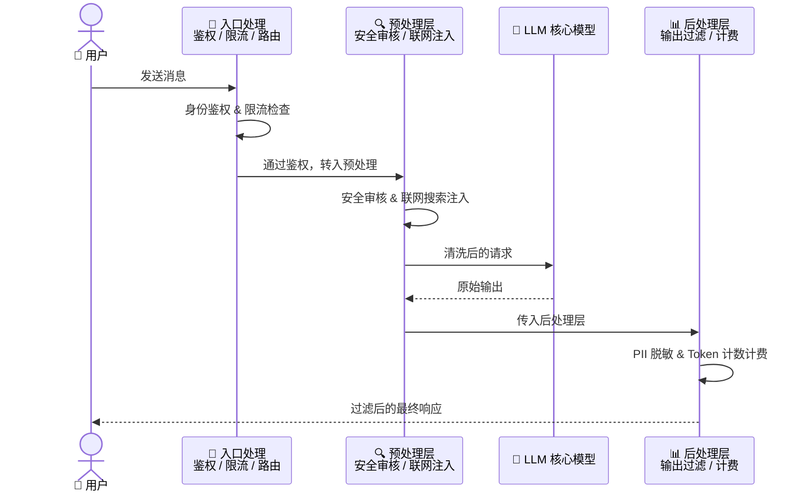
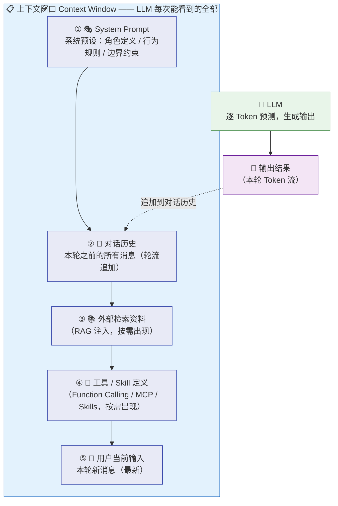
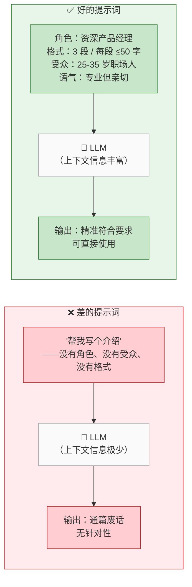
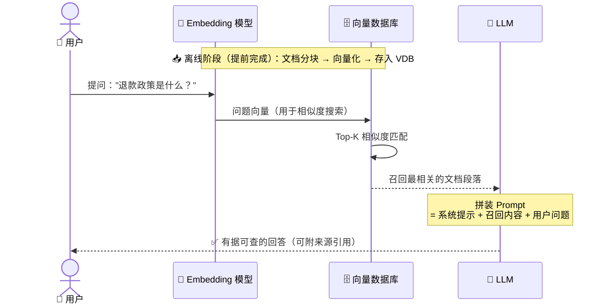
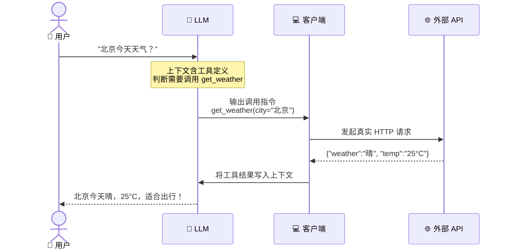
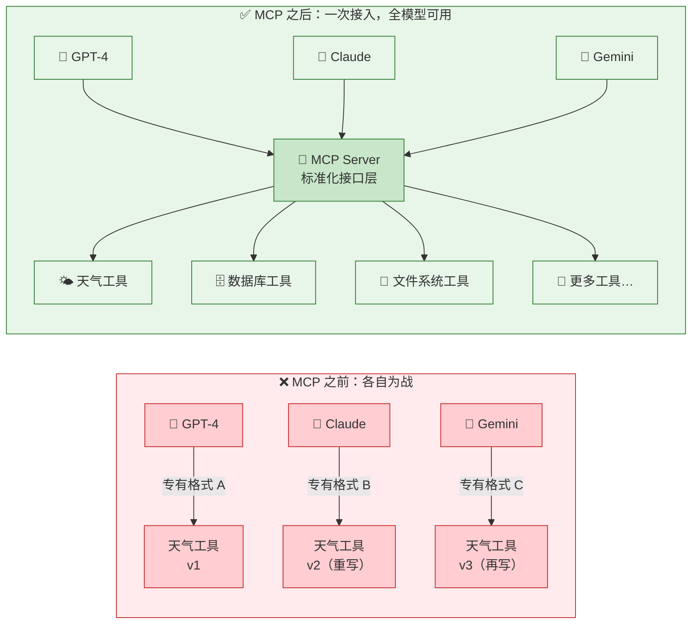
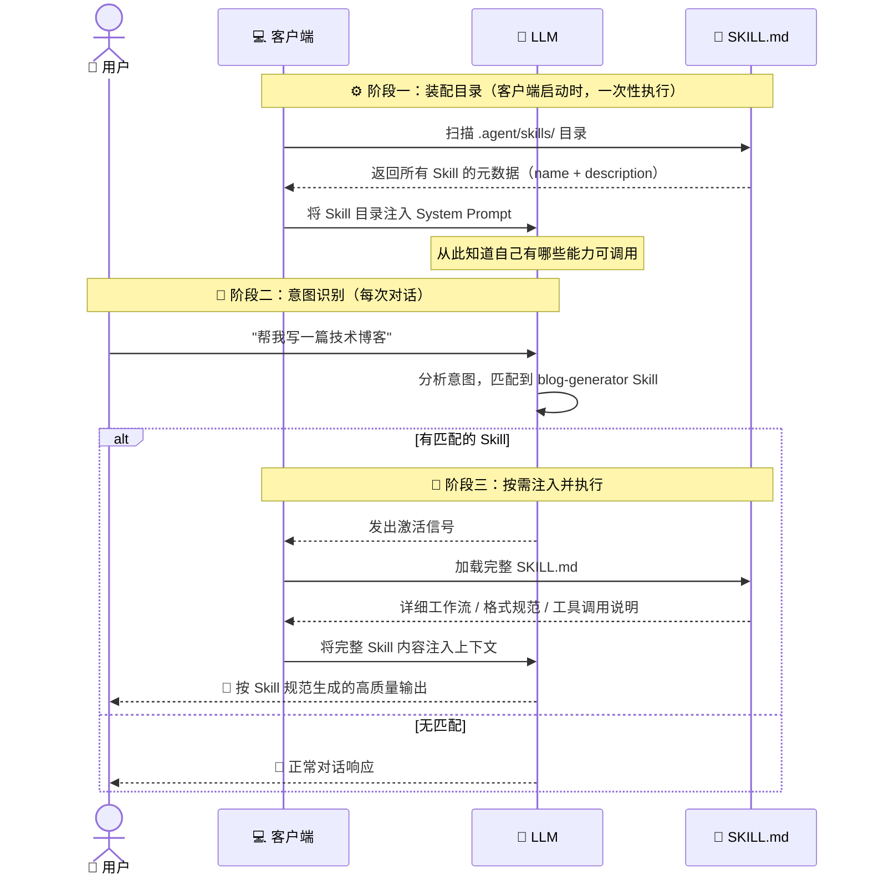
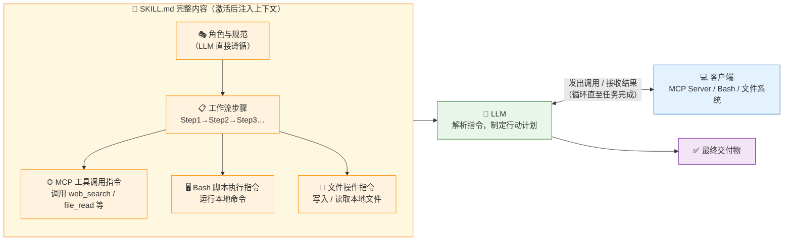
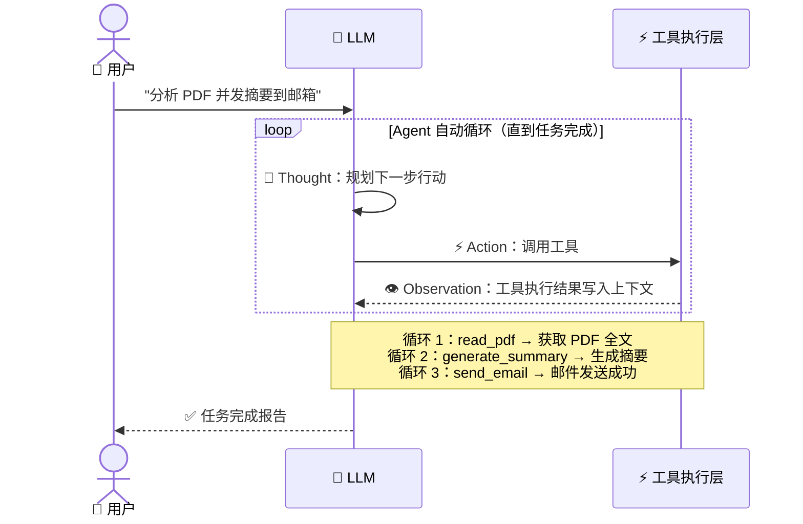
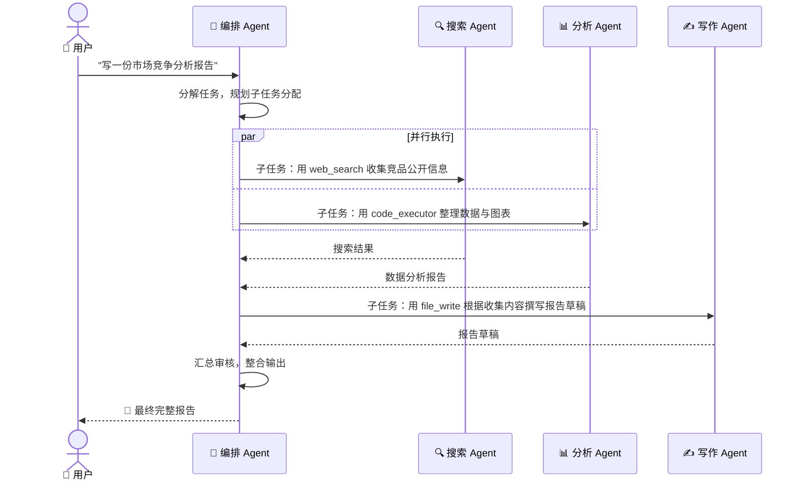

> 当你向 Claude 或 ChatGPT 提问时，它真的"理解"了你的意思吗？答案可能颠覆你的认知——LLM 的本质是一台精密的概率预测机器，而非具备理解能力的智慧体。理解这一点，你才能真正看懂当前所有 AI 热词背后的运作逻辑。本文将从 LLM 的底层原理出发，串联讲解 Prompt Engineering、RAG、Function Calling、MCP、Agent 等核心概念，帮你建立一套贯通的 AI 认知体系。
>
> 📌 **适合人群**：AI 初学者、对 AI 概念感到困惑的开发者和产品经理

<MindMapFloat title="LLM 核心知识图谱">

```mindmap-data
# LLM 大语言模型
## 本质认知
- 概率预测，而非真正理解
- Token 是处理的最小单元
- 训练即在海量文本上学习概率分布
## AI 产品架构
- 网关层：输入输出过滤
- 实时能力扩展：联网搜索
- 安全审核与身份鉴权
## 唯一沟通窗口
- 上下文窗口是 LLM 的全部感知
- 输入什么，决定输出什么
- 窗口大小等于模型的工作记忆
## 热词底层逻辑
- 提示词工程：手工优化上下文
- 上下文工程：系统化管理上下文
- 检索增强生成：检索后塞入上下文
- 函数调用：模型输出指令，客户端执行
- 模型上下文协议：标准化工具接入
- Skills：元数据常驻，指令体按需激活
- 智能体：多轮循环的自动化框架
## 统一视角
- 所有 AI 技术等于上下文填充加客户端执行
- 模型本身不变，变的是上下文质量
```

</MindMapFloat>

## 关于本文档

本文以"LLM 是什么"为起点，层层拆解 AI 产品的真实运行结构，最终归纳出一个统一的底层视角：当前几乎所有 AI 相关概念，本质上都是在围绕"如何更好地填充上下文窗口"做文章。

- ✅ LLM 的本质：概率预测机器，而非"理解"语言
- ✅ Claude、Gemini、DeepSeek 等产品背后的网关架构
- ✅ 上下文窗口：LLM 感知世界的唯一通道
- ✅ 提示词工程、上下文工程的底层原理
- ✅ RAG、Function Calling、MCP、Agent 的统一解释框架

## 1. 大多数人对 LLM 的误解

### 1.1 "它真的理解我的问题吗？"

很多人第一次使用 ChatGPT 或 Claude 时，会产生一种强烈的错觉：这个模型似乎"懂"我在说什么。它能回答复杂问题、写代码、讲故事，甚至能感受到情绪。

但如果你去问"它是怎么工作的"，大多数人的答案都是模糊的——"大数据训练的""很智能的神经网络"……这些说法并没有错，但太笼统，导致后续学习 RAG、MCP、Agent 等概念时，总觉得"听懂了但没完全懂"。

根本原因在于：**没有先搞清楚 LLM 的底层本质**。

### 1.2 一个让人清醒的类比：超级文字接龙机器

想象你在玩文字接龙游戏，规则是：给你一段话，你来猜下一个字最可能是什么。

LLM 做的事，本质上就是这个——只不过它接受了人类历史上几乎所有的文字材料作为训练素材，并且拥有数以千亿计的参数来存储"在各种语境下，下一个词出现的概率分布"。

当你输入"今天天气真"时，模型并不是"知道"天气好不好，而是在计算：在它见过的所有文字中，"今天天气真"后面接"好""热""棒""糟糕"各自出现的概率，然后按照这个概率分布选出最合理的下一个词。

> [!IMPORTANT]
> LLM 的每一次输出，都是在做**概率采样**，而不是"检索答案"或"理解语义"。它不存储事实，它存储的是**词与词之间的统计关联关系**。

### 1.3 "概率文件"的精准比喻

把 LLM 想象成一个巨型"压缩了全人类知识的概率文件"，是个很好的入门心智模型：

| 维度 | 传统数据库 | LLM |
|------|------------|-----|
| 存储方式 | 精确的键值对 | 模糊的概率权重 |
| 查询方式 | 精确匹配 | 语义相似度匹配 |
| 输出特征 | 固定、可复现 | 随机、有温度系数 |
| 知识来源 | 手动录入 | 从文本中学习 |
| 能否"理解" | 不能 | 也不能，但能"模拟"得很像 |

这也解释了为什么 LLM 会"幻觉"（Hallucination）：当它被问到训练数据中几乎没有出现过的信息时，它仍会按照"最高概率"输出一个听起来合理的答案，哪怕那个答案完全是错的。

## 2. 你使用的 AI 产品，不只是一个 LLM

### 2.1 从 LLM 到 AI 产品：中间多了什么？

你打开 claude.ai、gemini.google.com 或 chat.deepseek.com，这些网页背后并不是你直接和裸的 LLM 对话。在你和模型之间，还有一层重要的基础设施——**网关（Gateway）**。



### 2.2 网关层做了哪些事？

网关（Gateway）是 AI 产品与底层 LLM 之间的中间层，承担着多项关键职责：

| 网关职责 | 具体行为 | 用户感知 |
|----------|----------|----------|
| **输入安全审核** | 检测并拦截违禁内容、攻击性提示词 | "很抱歉，我无法回答这个问题" |
| **实时联网搜索** | 在调用 LLM 前，先查询最新信息并注入上下文 | 能回答"今天的新闻" |
| **身份鉴权** | 验证 API Key、账号权限、请求来源 | 未登录无法使用 |
| **输出内容过滤** | 过滤模型输出中的敏感信息（如个人隐私） | 某些内容被星号遮挡 |
| **用量计费** | 统计每次对话消耗的 Token 数量 | 账单按量计费 |
| **负载均衡** | 将请求路由到不同的模型实例 | 高并发下仍流畅使用 |

> [!NOTE]
> 这就是为什么同一个底层模型，在不同产品上的"性格"和"能力边界"可能差异显著。Claude.ai 的 Claude 和通过企业 API 接入的 Claude，在网关层的配置上可能完全不同，导致表现迥异。

### 2.3 System Prompt：网关塑造 AI "性格" 的手段

网关层除了做安全过滤，还会在用户的每次对话开始前，向 LLM 注入一段**系统提示词（System Prompt）**。这段"幕后指令"是普通用户看不到的，但它深刻影响着 AI 的回答风格、拒绝边界和角色定位。

你在 claude.ai 感受到的 Claude"有礼貌、有边界感"，本质上是 Anthropic 在系统提示词里设定好的——模型本身并没有内置"善良"，是上下文告诉它该如何表现。

## 3. 上下文窗口：LLM 感知世界的唯一通道

### 3.1 什么是上下文窗口？

这是理解所有 AI 概念的核心前提，必须先吃透。

**上下文窗口（Context Window）**是 LLM 每次推理时能"看到"的全部信息的总和。你可以把它想象成模型的"工作桌面"——放在桌面上的东西，它才能看见；没放上来的，它完全不知道存在。



> [!IMPORTANT]
> **LLM 没有"记忆"**。每次对话，模型都是从零开始，只能看到当前上下文窗口里的内容。你以为它"记得"上一轮对话，是因为系统把历史消息也一并放进了窗口里。

### 3.2 上下文窗口的大小意味着什么？

窗口大小通常以 Token 为单位（Token 是模型处理文本的最小单元，中文大约每个字是 1-2 个 Token，英文每个单词约是 1 个 Token）。

| 模型 | 上下文窗口 | 大约能装多少字 |
|------|------------|----------------|
| 早期 GPT-3 | 4K tokens | 约 6,000 字 |
| GPT-4 Turbo | 128K tokens | 约 200,000 字 |
| Claude 3.5 系列 | 200K tokens | 约 300,000 字（约一本长篇小说） |
| Gemini 1.5 Pro | 1M tokens | 约 1,500,000 字 |
| 2026 年主流旗舰 | 200K–1M tokens | 持续增长中 |

> [!TIP]
> 上下文窗口越大，意味着模型在一次对话中能处理的信息越多——可以放入更长的文档、更多的历史对话、更复杂的工具定义。这正是为什么"长上下文"成为 2025-2026 年模型竞争的核心指标之一。

### 3.3 一个颠覆认知的推论

既然 LLM 唯一能感知的是上下文窗口，那么一个强有力的推论就成立了：

**你给模型的上下文越丰富、越精准，模型的输出就越好。**

这听起来像废话，但它的深意是：**当前几乎所有的 AI 技术和产品创新，本质上都在解决同一个问题——"如何更好地填充这个上下文窗口"。**

接下来，我们逐一验证这个论断。

## 4. 提示词工程与上下文工程：手动 vs 系统化填充上下文

### 4.1 提示词工程：用人工精心设计输入

**提示词工程（Prompt Engineering）**是最直接的"填充上下文"方式——通过精心设计输入的措辞、结构和示例，让模型理解你真正的意图。



常见提示词技巧总结：

| 技巧 | 作用 | 示例 |
|------|------|------|
| **角色扮演** | 激活特定知识域的概率权重 | "你是一位 10 年经验的 Java 架构师" |
| **少样本示例** | 用案例让模型理解输出格式 | 给 3 个"输入→输出"的例子 |
| **思维链（CoT）** | 让模型逐步推理，减少跳跃 | "请一步一步思考" |
| **约束条件** | 限定输出边界 | "不超过 200 字""用 Markdown 表格" |
| **负面示例** | 告诉模型"不要这样" | "不要使用专业术语" |

### 4.2 上下文工程：系统化管理整个上下文窗口

随着 AI 应用复杂度提升，"写好一条提示词"已经不够用了。**上下文工程（Context Engineering）**是 2025 年兴起的更宏观的学科——它关注的是如何**系统性地设计、组织和管理**整个上下文窗口里的所有信息。

> [!NOTE]
> 2025 年，"上下文工程"开始取代"提示词工程"成为 AI 工程领域的核心议题。《大语言模型上下文工程综述》指出：LLM 已从简单的指令遵循系统演进为复杂多元化应用的核心推理引擎，"提示词工程"这一术语已无法完全涵盖现代 AI 系统的全部需求。

两者的区别在于：

| 维度 | 提示词工程 | 上下文工程 |
|------|------------|------------|
| **关注范围** | 单条提示词的措辞 | 整个上下文窗口的设计 |
| **操作对象** | 用户输入 | System Prompt + 历史 + 工具 + 检索结果 |
| **适用场景** | 一次性对话 | 复杂 AI 应用、Agent 系统 |
| **核心问题** | "怎么问才能得到好答案" | "上下文里该放什么、放多少、何时更新" |

## 5. RAG：先去图书馆查资料，再告诉模型

### 5.1 为什么需要 RAG？

LLM 有个无法回避的问题：**知识截止日期（Knowledge Cutoff）**。它只知道训练数据截止前的信息，对之后发生的事情一无所知。

此外，LLM 也不知道你公司内部的知识、你个人的文档、实时更新的数据库。

RAG 就是为了解决这个问题而生的。

### 5.2 RAG 的工作流程

**RAG（Retrieval-Augmented Generation，检索增强生成）**的逻辑非常直白：在把问题交给 LLM 之前，先去知识库里检索相关资料，然后把资料和问题一起塞进上下文窗口。



> [!NOTE]
> **什么是"向量检索"？** 把文字转成向量，可以理解为给每段文字打上一组"语义坐标"——语义相近的内容，坐标也相近。检索时不是搜关键词，而是"找语义最接近的坐标"，所以即使用词不同，也能找到相关内容。

> [!IMPORTANT]
> RAG 的本质仍然是**向上下文窗口里塞入更多信息**。模型并没有去学习新知识，它只是在本次对话中"看到了"这些资料，然后基于这些资料生成答案。对话结束后，模型对这些内容毫无记忆。

RAG 的核心优势与局限：

| 维度 | 说明 |
|------|------|
| ✅ **实时性** | 知识库可随时更新，不需要重新训练模型 |
| ✅ **可溯源** | 能标注答案来自哪个文档 |
| ✅ **降低幻觉** | 有实际资料作为依据，减少模型"瞎编" |
| ❌ **质量依赖检索** | 检索不准，塞进去的资料是错的，答案也会出错 |
| ❌ **窗口限制** | 召回内容太多可能撑爆上下文窗口 |

## 6. Function Calling 与 MCP：让模型能"动手做事"

### 6.1 Function Calling：模型输出指令，客户端执行操作

LLM 有个先天限制：它只能生成文字，**没有能力直接访问互联网、查询数据库、发送邮件**。

但如果我们在上下文里告诉它"你现在有以下工具可以使用……"，模型就能输出一段**结构化的调用指令**，由客户端来真正执行这个操作，再把结果放回上下文，让模型继续生成最终答案。

这就是 **Function Calling（函数调用）**。



> [!IMPORTANT]
> Function Calling 的核心在于：**LLM 只负责"决策"和"语言生成"，实际的操作由客户端代码来执行**。模型不直接调用 API，它只是输出了一个"我要调用这个函数，参数是这些"的文本指令，客户端解析后去做真正的事情。

### 6.2 MCP：Function Calling 的标准化协议

Function Calling 出现后，各家模型厂商定义工具的方式五花八门，没有统一标准，导致每集成一个新工具都要重写适配代码。

2024 年 11 月，Anthropic 推出了 **MCP（Model Context Protocol，模型上下文协议）**，旨在解决这个碎片化问题——让任何模型都能通过统一接口连接任意外部工具或数据源。



MCP 与 Function Calling 的关系：

| 维度 | Function Calling | MCP |
|------|-----------------|-----|
| **定位** | 一种能力/机制 | 一套通信标准/协议 |
| **解决的问题** | 让模型能调用外部工具 | 让工具接入方式标准化 |
| **类比** | "我会打电话" | "使用统一规格的电话接口" |
| **生态现状（2026）** | 各厂商各有实现 | 已被广泛采纳，成为事实标准 |

> [!NOTE]
> 截至 2026 年，MCP 已加入 Linux 基金会，迅速成为智能体类 LLM 系统在工具和数据访问方面的事实标准。

## 7. Skills：按需激活的智能指令集

### 7.1 Skills 究竟是什么？从一个直觉开始

在理解 Skills 之前，先想一个场景：

你雇了一位全能助理，他身上带着一本厚厚的"操作手册"——里面写着"如何写博客""如何审查代码""如何生成 PPT"等几十套完整的工作流程。但这本手册太厚，你不可能每次开口说话前都把整本手册塞给他看一遍。

实际的做法是：你的桌上摆着一张**目录卡片**（只有几行字，写着每个手册章节的标题和一句话简介）。助理每次接到任务时，先扫一眼目录卡——如果发现任务匹配某个章节，才去翻出那个章节的完整内容来执行。

**这就是 Skills 的工作方式。**

**Skills** 是一种**按需激活的结构化指令集**，每个 Skill 通常由两部分组成：

| 组成部分 | 内容 | 何时注入上下文 |
|----------|------|----------------|
| **元数据（Metadata）** | 名称、触发描述（几行字） | **始终在上下文中**，供 LLM 判断是否需要激活 |
| **完整指令体（SKILL.md）** | 详细的操作规范、工作流、格式要求、工具调用说明 | **仅当 LLM 判断需要激活时**，才由客户端加载并注入 |

### 7.2 Skills 的完整激活流程

这是 Skills 与其他"直接塞入上下文"的方案最根本的区别——**延迟加载（Lazy Loading）**。



整个流程分为三个阶段：

**阶段一：装配目录（客户端启动时）**

客户端扫描本地所有 Skill 文件，读取每个 Skill 的元数据（包含 `name` 和 `description` 字段），将这份"轻量级目录"注入 System Prompt。LLM 从此知道"我有哪些能力可以调用"。

**阶段二：意图识别（LLM 判断）**

用户发送请求后，LLM 基于上下文中的 Skill 目录，判断当前任务是否匹配某个 Skill。匹配到了，就输出激活指令；没匹配到，就正常对话。

**阶段三：按需注入（客户端执行）**

客户端收到 LLM 的激活信号后，将对应 SKILL.md 的完整内容加载进上下文，LLM 随即按照详细指令执行任务。

> [!IMPORTANT]
> Skill 的元数据始终在上下文中，但完整指令体只在需要时才加载。这个设计避免了把所有 Skill 的完整内容都塞进上下文，节省了大量 Token，同时保持了"模型知道自己有什么能力"的感知。

### 7.3 Skills 能做什么：不只是"提示词模板"

许多人最初以为 Skills 只是"把一段固定提示词存起来复用"，这是一种严重低估。**Skills 可以包含完整的工具调用链**，和 Function Calling、MCP、脚本执行等能力深度集成。

一个典型的 Skill 指令体（SKILL.md）可能包含：

| 指令内容类型 | 举例 | 执行方 |
|-------------|------|--------|
| **角色与规范** | "你是资深技术博客作者，风格……" | LLM 直接遵循 |
| **工作流步骤** | "Step1 先搜索，Step2 再写作，Step3 优化 SEO" | LLM 按步骤执行 |
| **MCP 工具调用** | "调用 web_search 工具搜索 ≥4 次" | 客户端通过 MCP 执行 |
| **本地脚本命令** | "用 bash_tool 运行 `pip install` 安装依赖" | 客户端执行 Bash 命令 |
| **文件操作** | "用 create_file 将输出保存到 /outputs/" | 客户端执行文件写入 |
| **输出格式规范** | "必须包含 Frontmatter、MindMapFloat、mermaid 图" | LLM 按格式生成 |



> [!NOTE]
> 从这个视角看，一个复杂的 Skill 本质上是一个**轻量级 Agent**——它定义了一套多步骤的工作流，其中某些步骤是 LLM 直接生成内容，另一些步骤需要客户端调用工具（MCP、Bash、文件系统）来执行，并把结果反馈给 LLM。

### 7.4 Skills 与其他概念的区别

Skills 处于整个 AI 技术栈中一个独特的位置，理解它与其他概念的边界，有助于选择正确的方案：

| 对比维度 | 提示词工程 | RAG | Function Calling | Skills |
|----------|------------|-----|-----------------|--------|
| **触发方式** | 每次手动输入 | 每次检索注入 | LLM 输出调用指令 | LLM 识别意图后激活 |
| **内容来源** | 人工编写 | 知识库检索 | 工具定义 | 预制的结构化工作流 |
| **是否延迟加载** | ❌ 始终在上下文 | ❌ 检索即注入 | ❌ 工具定义始终在 | ✅ 仅激活时加载完整内容 |
| **能否调用外部工具** | ❌ 否 | ❌ 否 | ✅ 是（核心能力） | ✅ 是（可包含工具调用指令） |
| **适合场景** | 一次性任务优化 | 知识问答增强 | 外部系统交互 | 复杂、可复用的标准化工作流 |

> [!TIP]
> **什么时候该用 Skills？** 当你有一套需要反复使用的、包含多个步骤的工作流，且这套流程足够复杂到写一次提示词放不下时——比如"生成技术博客的标准流程"、"代码审查的完整规范"——就值得封装成一个 Skill。

## 8. Agent：多轮循环的自动化上下文管理器

### 8.1 Agent 到底是什么？

**Agent（智能体）**是当前最火热也最容易被误解的 AI 概念。

简单来说，Agent 是一个**自动化循环框架**：它让 LLM 不只生成一次答案就结束，而是在一个循环中反复决策——思考→调用工具→获取结果→思考→再调用工具……直到任务完成。



> [!IMPORTANT]
> **Agent 的本质是：用代码控制"上下文窗口的动态更新"**。每一轮循环结束后，工具的执行结果被追加到上下文里，模型"看到"新的上下文后做出下一个决策。整个过程中，模型本身没有任何改变，变化的只是每轮传入的上下文内容。

### 8.2 ReAct：Agent 最主流的思维框架

目前最流行的 Agent 思维框架是 **ReAct（Reason + Act）**，强制模型在每步操作前先输出推理过程：

| 步骤 | 模型输出内容 | 示例 |
|------|--------------|------|
| **Thought（思考）** | 我目前知道什么，下一步要做什么 | "我需要查询北京的天气" |
| **Action（行动）** | 调用哪个工具，参数是什么 | `get_weather(city="北京")` |
| **Observation（观察）** | 工具返回了什么 | "晴，25°C" |
| **Thought（再思考）** | 基于结果继续规划 | "已有天气数据，可以生成回答了" |
| **Final Answer** | 最终输出给用户 | "北京今天晴，25°C，适合出行" |

### 8.3 多 Agent 系统：任务分解与协作

当任务复杂到单个 Agent 难以处理时，可以构建**多 Agent 系统**，让不同 Agent 各司其职：



## 9. 统一视角：所有 AI 概念的本质归纳

### 9.1 一张表，看懂所有 AI 热词

经过前面的逐一拆解，现在可以用一个统一的视角来总结所有这些概念：

| AI 概念 | 本质操作 | 是否需要客户端执行 | 主要解决的问题 |
|---------|----------|-------------------|----------------|
| **提示词工程** | 手工优化写入上下文的文字 | ❌ 否 | 提高单次对话质量 |
| **上下文工程** | 系统化设计整个上下文窗口 | ❌ 否 | 复杂应用的上下文架构 |
| **RAG** | 检索外部内容，注入上下文 | ✅ 是（检索+注入） | 知识实时性、减少幻觉 |
| **Function Calling** | 模型输出结构化指令 | ✅ 是（执行函数） | 让模型能与外部系统交互 |
| **MCP** | 标准化工具接入协议 | ✅ 是（规范化执行） | 工具生态碎片化问题 |
| **Skills** | 元数据常驻上下文，完整指令体按需激活；可包含 MCP/Bash/文件操作指令 | ✅ 是（激活后可调工具/脚本） | 复杂可复用工作流的标准化封装 |
| **Agent** | 自动化多轮上下文更新循环 | ✅ 是（循环调用） | 复杂多步骤任务自动化 |
| **System Prompt** | 产品方预设的上下文 | ❌ 否 | 定义模型角色和边界 |

> [!TIP]
> **记住这个核心公式**：
> 
> **AI 能力 = LLM 的基础概率知识 + 上下文窗口里的信息质量 + 客户端的执行能力**
> 
> 提升 AI 能力的方式，要么升级 LLM 本身（改变基础概率权重），要么优化上下文（提示词工程/上下文工程），要么增强客户端执行能力（RAG/Function Calling/MCP）。

### 9.2 为什么这个视角很重要？

理解了"所有 AI 技术都是在围绕上下文窗口做文章"，你就能：

**判断新概念是否真有价值**：下一次看到又一个新的 AI 框架或产品，你可以直接问自己：它在上下文这个维度上解决了什么问题？如果回答不清楚，大概率是在炒概念。

**看懂 AI 产品的本质差异**：同样基于 Claude 或 GPT 的两个产品，差距往往不在模型，而在上下文设计——谁的 System Prompt 更精准，谁的 RAG 召回质量更高，谁的 Function Calling 工具更丰富。

**做出更合理的技术选型**：面对 RAG vs 微调、Function Calling vs MCP 等选型问题，可以从"我的核心问题是上下文不足，还是模型能力不足，还是工具生态问题"出发，做出有依据的判断。

> [!CAUTION]
> 最常见的误解：以为升级了模型就能解决所有问题。实际上，很多 AI 表现差的案例，问题出在上下文设计上——给了模糊的提示词、没有给足背景信息、检索到了错误的文档——换一个更好的模型，同样的问题还会出现。

### 9.3 2026 年的趋势：上下文窗口正在"吞噬"RAG

一个值得关注的趋势是：随着模型上下文窗口越来越大（已达百万 Token），传统 RAG 的部分应用场景正在被"长上下文"直接替代——与其检索+注入相关段落，不如把整个文档都塞进去。

但这并不意味着 RAG 会消亡。在实时性强、知识库超大、需要精确溯源的场景下，RAG 仍然是最优解。

## 9. 总结

| 核心概念 | 一句话解释 |
|---------|-----------|
| **LLM 本质** | 基于海量文本训练的概率预测机器，每次输出都是 Token 级别的概率采样 |
| **网关层** | AI 产品与底层模型之间的中间层，负责安全过滤、联网增强、身份鉴权 |
| **上下文窗口** | LLM 每次推理时能"看到"的全部信息，是模型感知世界的唯一通道 |
| **提示词工程** | 通过优化输入措辞，手工提升进入上下文的信息质量 |
| **上下文工程** | 系统化设计和管理整个上下文窗口的学科 |
| **RAG** | 检索外部知识并注入上下文，解决知识截止和私有知识问题 |
| **Function Calling** | 模型输出结构化调用指令，客户端执行后将结果反馈回上下文 |
| **MCP** | 标准化 LLM 与外部工具交互的通信协议，解决工具接入碎片化 |
| **Skills** | 元数据常驻上下文供 LLM 感知，完整指令体按需激活；激活后可驱动 MCP/Bash/文件等客户端操作 |
| **Agent** | 自动化多轮上下文更新的循环框架，实现复杂多步骤任务自动化 |

> [!TIP]
> **初学者学习路径建议**：
> 1. **先理解 LLM 本质**：弄清楚"概率预测"和"上下文窗口"这两个核心概念
> 2. **动手体验提示词工程**：用同一个问题，写 5 种不同质量的提示词，感受输出差异
> 3. **理解 RAG 和 Function Calling 的工作流**：画出数据流向图，理解客户端和模型各自做什么
> 4. **尝试使用或搭建一个简单 Agent**：感受"多轮循环"与"单次对话"的本质区别
> 5. **关注上下文工程**：这是 2026 年最值得深入的方向，决定了 AI 应用的天花板

## 10. 参考资料

### 核心论文与文档

| 资源 | 机构 | 主要贡献 |
|------|------|----------|
| [Attention Is All You Need](https://arxiv.org/abs/1706.03762)（arXiv:1706.03762） | Google | Transformer 架构原始论文，LLM 的基础 |
| [Retrieval-Augmented Generation for Knowledge-Intensive NLP Tasks](https://arxiv.org/abs/2005.11401)（arXiv:2005.11401） | Facebook AI Research | RAG 原始论文 |
| [ReAct: Synergizing Reasoning and Acting in Language Models](https://arxiv.org/abs/2210.03629)（arXiv:2210.03629） | Google Research | ReAct Agent 框架原始论文 |
| [MCP 官方文档](https://modelcontextprotocol.io) | Anthropic | Model Context Protocol 规范 |

### 推荐延伸阅读

- [大语言模型上下文工程综述](https://zhuanlan.zhihu.com/p/1934605504165950750) — 系统梳理上下文工程方法论
- [LLM 研究进展与趋势报告（2026）](https://www.cnblogs.com/sddai/p/19758552) — 最新技术动态综述
- [深入解析 AI Gateway](https://zhuanlan.zhihu.com/p/1923437404385163210) — 网关层架构详解