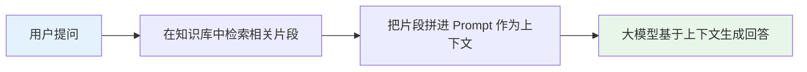
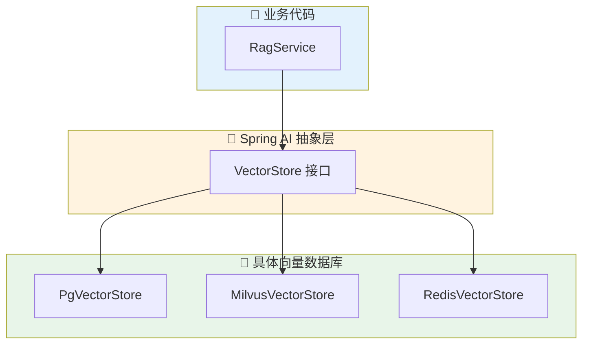
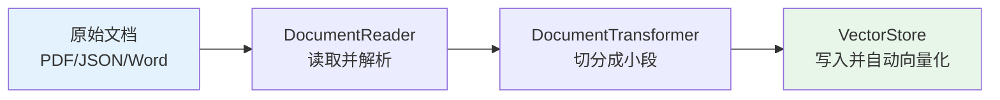

# Spring AI 2.0 VectorStore 实战指南：从原理到生产级 RAG

> Spring AI 2.0 通过 `VectorStore` 接口，把 Milvus、PGVector、Redis 等 20 多种向量数据库统一成了一套增删查改 API，业务代码不再被某一家厂商绑死。本文从接口设计讲到批量写入、相似性检索、元数据过滤，最后演示如何用 `QuestionAnswerAdvisor` 几行代码接出一个能用的 RAG 系统。
>
> 📌 **适合人群**：使用 Spring Boot 做后端开发、正在或即将接入大模型知识库（RAG）能力的 Java 工程师


<MindMapFloat title="Spring AI VectorStore知识图谱">

```mindmap-data
# Spring AI VectorStore
## 为什么需要它
- 大模型不认识私有数据
- 相似性搜索 ≠ 关键字精确匹配
- 一套接口屏蔽20+种向量库差异
## 核心接口设计
- VectorStore 继承 DocumentWriter + VectorStoreRetriever
- VectorStoreRetriever 只读、函数式、最小权限
- delete 在 1.0.0-M6 后改为无返回值，失败直接抛异常
## 数据写入链路
- Document 封装文本与元数据
- EmbeddingModel 负责把文本转成向量，VectorStore 本身不生成向量
- BatchingStrategy 控制批量写入避免 Token 超限
## 检索与过滤能力
- SearchRequest 的 topK / similarityThreshold
- Filter.Expression 与 FilterExpressionBuilder
- 类 SQL 字符串过滤表达式跨数据库可移植
## 工程落地建议
- 开发期用 SimpleVectorStore，生产期换 PGVector/Milvus
- QuestionAnswerAdvisor 一行代码接入 RAG
- 删除要分批、要 try-catch、按 ID 删除优先于按过滤删除
```

</MindMapFloat>

## 关于本文档

本文以 Spring AI 2.0（基于 Spring Boot 4.0 GA / Spring Framework 7.0，要求 Java 21+）为基准，系统梳理 `VectorStore` 模块的接口设计与实战用法。读完本文你将能够：

- ✅ 理解 `VectorStore` 与 `VectorStoreRetriever` 的接口分工，知道何时该依赖哪一个
- ✅ 掌握从 `Document` 写入到向量库落地的完整链路，包括批处理策略
- ✅ 熟练使用 `SearchRequest`、`Filter.Expression` 完成带元数据过滤的相似性检索
- ✅ 能对比 SimpleVectorStore / PGVector / Milvus 等实现，按场景做出选型
- ✅ 用 `QuestionAnswerAdvisor` 在几分钟内搭出一个可用的 RAG 问答接口

## 1. 为什么 AI 应用离不开 VectorStore

### 1.1 大模型的私有数据困境

ChatGPT、DeepSeek 这类大语言模型在预训练阶段就已经"定型"——它们认识维基百科，但不认识你公司昨天发布的产品手册，也不认识用户上周提交的工单。如果直接问模型"我们的退货政策是什么"，得到的大概率是一段似是而非的"幻觉"回答。

要让模型回答得准，常见做法是把相关资料一起塞进 Prompt。但企业知识库动辄几万篇文档，不可能每次都把全部内容喂给模型——这正是检索增强生成（RAG，Retrieval-Augmented Generation）要解决的问题：先从知识库里"捞"出最相关的几段，再连同问题一起交给模型。




### 1.2 关键字检索为什么不够用

传统做法是用 MySQL 的 `LIKE` 或 Elasticsearch 的全文检索做"捞片段"，但它们本质上是字面匹配，对语义无能为力。

| 检索方式 | 匹配原理 | 典型短板 | 真实案例 |
|------|----------|----------|----------|
| SQL LIKE / 全文检索 | 关键词字面匹配 | 同义词、近义表达识别不了 | 用户问"怎么退钱"，文档写的是"退款流程"，命中率低 |
| 倒排索引（ES） | 分词后的词频统计 | 无法理解上下文语义 | "苹果"在水果文档和手机文档中权重一样 |
| 向量相似性检索 | 语义向量的距离计算 | 需要额外的 Embedding 成本 | "怎么退钱"与"退款流程"在向量空间中距离很近，能被检索到 |

> [!IMPORTANT]
> 核心矛盾在于：关键字检索匹配的是"字面"，而用户提问匹配的是"意图"。向量数据库把文本转换成高维向量后做相似性搜索，本质上是在语义空间里找"意思相近"的内容，而不是"字面相同"的内容。


### 1.3 VectorStore：屏蔽底层差异的统一适配器

向量数据库赛道厂商众多——Milvus、Pinecone、Weaviate、PGVector、Redis、Elasticsearch 都能做向量检索，但各家的客户端 API、查询语法千差万别。Spring AI 的做法和它对 ChatModel 的处理一脉相承：定义一个 `VectorStore` 接口，所有实现都遵循同一套契约。



今天用 Redis 做开发验证，明天想换 Milvus 上生产，业务代码完全不用改，只需要换一个 Bean 的实现类和对应的 YAML 配置。

## 2. VectorStore 的核心接口设计

### 2.1 VectorStore 接口：增删查改的统一契约

Spring AI 2.0 中 `VectorStore` 接口定义如下（在 1.0.0-M6 之后，`delete` 已统一为无返回值，失败时直接抛异常，不再用 `Optional<Boolean>` 让调用方猜测结果）：

```java
// VectorStore 接口定义：org.springframework.ai.vectorstore.VectorStore
public interface VectorStore extends DocumentWriter, VectorStoreRetriever {

    // 向量库实现名称，默认取类名
    default String getName() {
        return this.getClass().getSimpleName();
    }

    // 写入文档：内部会自动调用 EmbeddingModel 计算向量
    void add(List<Document> documents);

    // 按文档 ID 批量删除
    void delete(List<String> idList);

    // 按结构化的元数据过滤表达式删除
    void delete(Filter.Expression filterExpression);

    // 按类 SQL 字符串过滤表达式删除（内部会转换成 Filter.Expression）
    default void delete(String filterExpression) {
        // 具体实现见各 VectorStore 子类
    }

    // 相似性搜索由父接口 VectorStoreRetriever 提供
    // 获取底层原生客户端，用于使用某个向量库特有的能力
    default <T> Optional<T> getNativeClient() {
        return Optional.empty();
    }
}
```

`VectorStore` 继承了 `DocumentWriter`（统一文档写入入口，方便接入 ETL 管道）和 `VectorStoreRetriever`（统一检索入口），自身只新增"写"和"删"的能力。

### 2.2 VectorStoreRetriever：只读检索的最小权限设计

2.0 把"只读检索"单独抽成了一个函数式接口 `VectorStoreRetriever`，这是典型的接口隔离原则（ISP）落地：

```java
// 只读检索接口：org.springframework.ai.vectorstore.VectorStoreRetriever
@FunctionalInterface
public interface VectorStoreRetriever {

    // 核心方法：基于 SearchRequest 做相似性搜索
    List<Document> similaritySearch(SearchRequest request);

    // 便捷方法：直接传查询字符串
    default List<Document> similaritySearch(String query) {
        return this.similaritySearch(SearchRequest.builder().query(query).build());
    }
}
```

> [!TIP]
> 如果你写的服务只负责"查资料"、不负责"写资料"（比如一个纯检索的 RAG 查询服务），建议注入 `VectorStoreRetriever` 而不是完整的 `VectorStore`。这样代码读起来就能一眼看出"这个组件不会修改底层数据"，也减少了误调用 `add`/`delete` 的风险。

| 设计目标 | VectorStore | VectorStoreRetriever |
|------|----------|----------|
| 职责范围 | 增、删、查（全权限） | 仅查（只读） |
| 接口类型 | 普通接口 | 函数式接口（可用 Lambda 实现） |
| 典型使用场景 | 数据写入批处理、知识库管理后台 | RAG 在线问答、纯检索型微服务 |
| 依赖复杂度 | 需要完整的向量库实现 | 可以只暴露一个检索方法的轻量适配 |


### 2.3 Document 与 EmbeddingModel：写入前的两道工序

要把数据塞进 `VectorStore`，先要封装成 `Document` 对象：

```java
// Document 封装文本内容 + 元数据
Document doc = new Document(
    "退款流程：用户在订单完成后 7 天内可申请退款……", // 正文内容
    Map.of("category", "售后", "version", "2.0")       // 元数据，用于后续过滤
);
```

> [!NOTE]
> `VectorStore` 本身不负责"生成"向量，它依赖注入的 `EmbeddingModel` 把文本转换成 `float[]` 数值数组。调用 `add()` 时，向量库实现会在内部自动调用 `EmbeddingModel.embed(...)`，业务代码完全感知不到这一步。


## 3. 数据写入：从 Document 到向量的完整链路

### 3.1 最小可用示例：SimpleVectorStore

开发调试阶段不想依赖外部数据库，可以用纯内存实现 `SimpleVectorStore` 快速验证逻辑：

```java
@Configuration
public class DevVectorStoreConfig {

    // 开发环境使用内存向量库，应用重启数据即丢失，仅用于本地验证
    @Bean
    public VectorStore vectorStore(EmbeddingModel embeddingModel) {
        return SimpleVectorStore.builder(embeddingModel).build();
    }
}

@Service
public class KnowledgeService {

    private final VectorStore vectorStore;

    public KnowledgeService(VectorStore vectorStore) {
        this.vectorStore = vectorStore;
    }

    public void importFaq() {
        // 1. 构造待写入文档
        List<Document> documents = List.of(
            new Document("退款流程：订单完成 7 天内可申请退款", Map.of("category", "售后")),
            new Document("发货时效：付款后 48 小时内发货", Map.of("category", "物流"))
        );
        // 2. 写入向量库，EmbeddingModel 会被自动调用计算向量
        this.vectorStore.add(documents);
    }
}
```

### 3.2 BatchingStrategy：避免单次写入超出 Token 限制

大批量导入文档时，如果一次性把所有文本塞给 Embedding 模型，很容易超出模型的单次 Token 上限。`BatchingStrategy` 就是用来解决这个问题的批处理策略：

```java
@Configuration
public class BatchingConfig {

    // 按 Token 数自动分批，避免单批文本超出 Embedding 模型的输入上限
    @Bean
    public BatchingStrategy batchingStrategy() {
        return new TokenCountBatchingStrategy(
            EncodingType.CL100K_BASE, // 分词编码方式，需与模型匹配
            8000,                     // 单批最大 Token 数
            0.1                       // 预留 10% 安全余量
        );
    }

    @Bean
    public VectorStore vectorStore(JdbcTemplate jdbcTemplate,
                                    EmbeddingModel embeddingModel,
                                    BatchingStrategy batchingStrategy) {
        return PgVectorStore.builder(jdbcTemplate, embeddingModel)
            .batchingStrategy(batchingStrategy) // 注入批处理策略
            .build();
    }
}
```

| 批处理参数 | 作用 | 调整建议 |
|------|----------|----------|
| EncodingType | 指定分词编码方式 | 需与所用 Embedding 模型的分词器对齐，否则计数会失真 |
| maxInputTokenCount | 单批最大 Token 数 | 设置为目标 Embedding 模型支持上限的 80%~90% |
| reservePercentage | 预留比例 | 给特殊字符、多语言分词膨胀留余量，通常 5%~15% |

### 3.3 完整 ETL 流程：从文件读取到批量入库

实际项目里，数据多来自 PDF、Word、JSON 等源文件，需要先经过"读取 → 切分 → 写入"三道工序，这正是 Spring AI ETL 管道（`DocumentReader` → `DocumentTransformer` → `DocumentWriter`）要解决的事：



```java
@Component
public class FaqImportJob {

    private final VectorStore vectorStore;

    public FaqImportJob(VectorStore vectorStore) {
        this.vectorStore = vectorStore;
    }

    public void importFromJson(String sourceFile) {
        // 1. 读取 JSON 文件中指定字段
        JsonReader jsonReader = new JsonReader(
            new FileSystemResource(sourceFile),
            "title", "content", "category"
        );
        List<Document> rawDocuments = jsonReader.get();

        // 2. 按 Token 数切分长文本，避免单条 Document 过长
        TokenTextSplitter splitter = new TokenTextSplitter();
        List<Document> chunks = splitter.apply(rawDocuments);

        // 3. 写入向量库，VectorStore 实现内部自动完成 Embedding 计算
        this.vectorStore.add(chunks);
    }
}
```


## 4. 检索数据：相似性搜索与元数据过滤

### 4.1 SearchRequest：topK 与相似度阈值

`similaritySearch` 的核心参数封装在 `SearchRequest` 里：

```java
// 基础检索：返回最相关的 5 条结果
List<Document> results = vectorStore.similaritySearch(
    SearchRequest.builder()
        .query("退款需要多久到账")
        .topK(5)                    // 只取最相似的 5 条
        .similarityThreshold(0.75)  // 相似度低于 0.75 的直接过滤掉
        .build()
);
```

| 参数 | 类型 | 含义 | 默认值 |
|------|------|------|------|
| query | String | 用户的原始查询文本 | 必填 |
| topK | int | 返回结果的最大条数（即"Top K 最近邻"） | 4 |
| similarityThreshold | double | 0~1，越接近 1 要求相似度越高 | 0.0（不过滤） |
| filterExpression | String/Filter.Expression | 基于元数据的过滤条件 | 无 |

### 4.2 Filter.Expression：跨数据库可移植的元数据过滤 DSL

如果知识库里混杂着"售后""物流""营销"等多个类别的文档，检索时往往只想在某个类别里找。Spring AI 提供了两种写法：

```java
// 写法一：类 SQL 字符串表达式，简洁直观
List<Document> afterSaleDocs = vectorStore.similaritySearch(
    SearchRequest.builder()
        .query("退款需要多久到账")
        .filterExpression("category == '售后' && version == '2.0'")
        .build()
);

// 写法二：FilterExpressionBuilder 编程式构建，适合动态拼接条件
FilterExpressionBuilder b = new FilterExpressionBuilder();
Filter.Expression expr = b.and(
    b.eq("category", "售后"),
    b.in("author", "john", "jill")
).build();

List<Document> docs = vectorStore.similaritySearch(
    SearchRequest.builder().query("退款流程").filterExpression(expr).build()
);
```

> [!NOTE]
> 过滤表达式基于 ANTLR4 语法解析，支持 `==`、`!=`、`>`、`>=`、`<`、`<=`、`in`、`&&`、`||` 等运算符，且这套语法在 PGVector、Milvus、Redis 等不同实现间是可移植的——各实现内部会把它翻译成自己的原生查询（比如 PGVector 翻译成 JSON 路径表达式）。

### 4.3 只读场景：用 VectorStoreRetriever 收窄依赖

如果一个 Service 只负责"根据问题找资料"，把依赖类型从 `VectorStore` 收窄为 `VectorStoreRetriever`，能让代码意图更清晰：

```java
@Service
public class RagRetrievalService {

    private final VectorStoreRetriever retriever;

    // 只依赖只读接口，明确表示该服务不会修改向量库
    public RagRetrievalService(VectorStoreRetriever retriever) {
        this.retriever = retriever;
    }

    public String buildContext(String userQuery) {
        List<Document> relevantDocs = retriever.similaritySearch(userQuery);
        // 把检索到的文档拼接成上下文文本，供后续 Prompt 使用
        return relevantDocs.stream()
            .map(Document::getText)
            .collect(Collectors.joining("\n\n"));
    }
}
```


## 5. 实现选型：从 SimpleVectorStore 到生产级方案

Spring AI 2.0 内置了 20 多种向量库实现，没必要全部记住，按数据规模和团队熟悉度挑选即可。

### 5.1 三档典型选型

| 实现 | 定位 | 数据规模建议 | 优势 | 局限 |
|------|------|------|------|------|
| SimpleVectorStore | 内存/本地文件 | 千级以下 | 零依赖，启动快，适合开发调试 | 无持久化能力（仅可手动落本地 JSON），不支持集群 |
| PgVectorStore | PostgreSQL 扩展 | 百万级以下 | 团队通常已熟悉 PostgreSQL，运维成本低 | 大规模高并发检索性能弱于专用向量库 |
| MilvusVectorStore | 专用向量数据库 | 千万级以上 | 原生支持 HNSW/IVF 等多种索引，水平扩展能力强 | 需要独立部署运维，学习成本更高 |

### 5.2 配置示例对比

```yaml
# PGVector 配置：适合中小规模，团队已有 PostgreSQL 运维经验
spring:
  datasource:
    url: jdbc:postgresql://localhost:5432/vectordb
    username: postgres
    password: your-password
  ai:
    vectorstore:
      pgvector:
        index-type: HNSW
        distance-type: COSINE_DISTANCE
        dimensions: 1536
        initialize-schema: true   # 2.0 默认 false，需显式开启自动建表

---
# Milvus 配置：适合百万级以上数据规模、需要水平扩展的生产环境
spring:
  ai:
    vectorstore:
      milvus:
        host: localhost
        port: 19530
        collection-name: knowledge_base
        embedding-dimension: 1536
        index-type: IVF_FLAT
        metric-type: COSINE
```

> [!WARNING]
> Spring AI 2.0 中各 `VectorStore` 实现已迁移到独立包名（例如 PGVector 实现位于 `org.springframework.ai.pgvector.vectorstore`），且大多数实现的构造函数已弃用，必须通过 `builder()` 方法创建实例；同时 `initialize-schema` 默认值已改为 `false`，升级旧项目时如果忘记显式开启，启动后会因为表不存在而报错。

### 5.3 手动构建 PgVectorStore Bean

除了自动配置，也可以手动构建，方便细粒度控制：

```java
@Configuration
public class PgVectorConfig {

    @Bean
    public VectorStore vectorStore(JdbcTemplate jdbcTemplate, EmbeddingModel embeddingModel) {
        return PgVectorStore.builder(jdbcTemplate, embeddingModel)
            .dimensions(1536)                 // 需与 Embedding 模型输出维度一致
            .distanceType(PgDistanceType.COSINE_DISTANCE)
            .indexType(PgIndexType.HNSW)
            .initializeSchema(true)           // 应用启动时自动建表建索引
            .vectorTableName("vector_store")  // 自定义表名
            .maxDocumentBatchSize(10000)      // 单批最大写入文档数
            .build();
    }
}
```


## 6. 接入 RAG：用 Advisor 一行代码做检索增强

### 6.1 QuestionAnswerAdvisor：最快的接入方式

有了 `VectorStore`，剩下的工作是把"检索"和"生成"串起来。Spring AI 提供的 `QuestionAnswerAdvisor` 让这一步只需几行代码：

```java
@RestController
public class RagController {

    private final ChatClient chatClient;

    public RagController(ChatClient.Builder builder, VectorStore vectorStore) {
        // 构建时就把 RAG 能力注册为默认 Advisor，所有请求自动生效
        this.chatClient = builder
            .defaultAdvisors(
                QuestionAnswerAdvisor.builder(vectorStore)
                    .searchRequest(SearchRequest.builder().topK(5).similarityThreshold(0.7).build())
                    .build()
            )
            .build();
    }

    @GetMapping("/rag/chat")
    public String chat(@RequestParam String question) {
        // Advisor 在背后自动完成：检索 → 拼接上下文 → 调用模型
        return chatClient.prompt().user(question).call().content();
    }
}
```

> [!TIP]
> 使用 `QuestionAnswerAdvisor` 需要额外引入 `spring-ai-advisors-vector-store` 依赖。它默认对整个向量库做最近邻搜索，如果想限制检索范围，记得配置 `searchRequest` 里的 `filterExpression`。

### 6.2 动态过滤表达式：运行时按需收窄检索范围

```java
// 在固定的 Advisor 基础上，每次请求动态调整过滤条件
String answer = chatClient.prompt()
    .user("退款多久能到账")
    .advisors(a -> a.param(QuestionAnswerAdvisor.FILTER_EXPRESSION, "category == '售后'"))
    .call()
    .content();
```

### 6.3 RetrievalAugmentationAdvisor：模块化 RAG 的进阶方案

`QuestionAnswerAdvisor` 适合快速上手，但流程是固定的"一步到位"。如果要做查询重写、多路检索等更复杂的 RAG 流程，可以用模块化的 `RetrievalAugmentationAdvisor`：

```java
Advisor ragAdvisor = RetrievalAugmentationAdvisor.builder()
    .documentRetriever(
        VectorStoreDocumentRetriever.builder()
            .vectorStore(vectorStore)
            .similarityThreshold(0.7)
            .topK(3)
            .build()
    )
    // 可选：在检索前先对用户问题做改写，提升召回质量
    .queryTransformers(RewriteQueryTransformer.builder().chatClientBuilder(chatClientBuilder).build())
    .build();

String response = chatClient.prompt()
    .user("退款多久能到账")
    .advisors(ragAdvisor)
    .call()
    .content();
```

| 维度 | QuestionAnswerAdvisor | RetrievalAugmentationAdvisor |
|------|---------|---------|
| 上手难度 | ⭐⭐ 一行代码即可 | ⭐⭐⭐⭐ 需要组装多个模块 |
| 灵活性 | 流程固定 | 支持查询重写、查询扩展等可插拔模块 |
| 适合场景 | 中小型知识库问答、原型验证 | 对召回质量要求高的生产级 RAG 系统 |

### 6.4 进阶用法：用 VectorStore 做工具动态发现

2.0 还把 `VectorStore` 用到了工具调用场景——当 Agent 注册了成百上千个工具时，没必要一次性把所有工具定义都塞进 Prompt，而是用向量检索按需挑选最相关的几个：

```java
@Configuration
public class ToolDiscoveryConfig {

    // 把工具定义存入向量库，模型根据用户问题动态检索相关工具，而不是全量加载
    @Bean
    public ToolSearchToolCallingAdvisor toolSearchAdvisor(VectorStore vectorStore) {
        return ToolSearchToolCallingAdvisor.builder(vectorStore)
            .similarityThreshold(0.75)
            .topK(3) // 每次最多动态加载 3 个相关工具
            .build();
    }
}
```


## 7. 最佳实践与避坑指南

### 7.1 文档版本管理：先删旧版本再写新版本

知识库内容更新是常态，常见做法是用过滤表达式删除旧版本、再写入新版本，避免新旧内容同时被检索到：

```java
// 1. 写入旧版本文档
Document v1 = new Document(
    "退款流程 v1：7 天内可申请",
    Map.of("docId", "REFUND-001", "version", "1.0")
);
vectorStore.add(List.of(v1));

// 2. 业务更新后，先删除旧版本
vectorStore.delete("docId == 'REFUND-001' AND version == '1.0'");

// 3. 再写入新版本
Document v2 = new Document(
    "退款流程 v2：15 天内可申请，且支持部分退款",
    Map.of("docId", "REFUND-001", "version", "2.0")
);
vectorStore.add(List.of(v2));
```

### 7.2 删除操作要包一层 try-catch

由于 2.0 中 `delete` 失败会直接抛异常（而不是返回布尔值），生产代码必须显式捕获：

```java
try {
    vectorStore.delete("category == 'deprecated'");
} catch (Exception e) {
    // 过滤表达式语法错误、底层连接异常等都会在这里捕获到
    logger.error("删除向量库文档失败，过滤表达式可能不合法", e);
}
```

### 7.3 常见问题排查表

| 问题现象 | 常见原因 | 解决方案 |
|------|------|----------|
| 写入报错"维度不匹配" | `dimensions` 配置与 Embedding 模型实际输出维度不一致 | 检查模型文档确认输出维度，与向量库配置保持一致 |
| 检索总是返回空结果 | `similarityThreshold` 设置过高 | 先调到 0 验证链路通畅，再逐步上调阈值 |
| 启动报错"表不存在" | 2.0 默认 `initialize-schema: false` | 首次部署时显式设置为 `true`，或手动建表后关闭 |
| 大批量导入很慢甚至超时 | 未配置 `BatchingStrategy`，单批 Token 超限被拒 | 按 4.2 节配置合理的批处理策略 |
| 过滤表达式报语法错误 | 字符串内嵌引号未正确转义 | 优先使用 `FilterExpressionBuilder` 编程式构建，规避手写字符串拼接 |

> [!CAUTION]
> 大批量删除操作（比如清空某个失效类目的全部文档）不要一次性执行，应该分批进行，否则容易把向量库的连接池或索引重建机制压垂——尤其是在 PGVector 这类依赖 HNSW 索引实时维护的实现上。

## 8. 版本演进与适用场景

### 8.1 从 1.x 到 2.0 的关键变化

Spring AI 2.x 不是渐进式迭代，而是一次面向 AI 原生时代的架构重构：底层从 Spring Boot 3.x 全面迁移到 Spring Boot 4.0 GA / Spring Framework 7.0，最低要求 Java 21；API 层面引入 JSpecify 空安全注解，`VectorStore` 相关构造方法进一步统一为 Builder 模式。

| 版本阶段 | 关键变化 | 对 VectorStore 使用的影响 |
|------|------|----------|
| 1.0.0-M6 | `delete` 由 `Optional<Boolean>` 改为 void，失败直接抛异常 | 删除逻辑必须显式 try-catch |
| 1.0 GA | 跨向量库可移植的元数据过滤 API 定型 | 过滤表达式写法在各实现间统一 |
| 1.1.x | `VectorStoreRetriever` 只读接口引入 | 纯检索场景可以收窄依赖类型 |
| 2.0 | 底层升级到 Spring Boot 4.0 / Java 21；`VectorStore` 开始被用于工具动态发现等新场景 | 升级前务必确认 JDK 与 Spring Boot 版本兼容 |

> [!WARNING]
> 由于底层架构重构，Spring AI 2.x 与 Spring Boot 3.x 不兼容，不可混用。如果你的旧项目仍在 Spring Boot 3.x 上，建议先评估迁移成本，做一轮集中适配测试后再升级，不要边改边上线。

### 8.2 适用场景与不适用场景

| 场景 | 是否适合用 VectorStore | 说明 |
|------|-----------|----------|
| 企业内部知识库问答 | ✅ 非常适合 | 经典 RAG 场景，文档量适中，元数据过滤需求明确 |
| 客服工单语义检索 | ✅ 适合 | 可结合 `category`、`status` 等元数据过滤 |
| 工具/函数动态发现（Agent 场景多工具） | ✅ 2.0 新场景 | 用 `ToolSearchToolCallingAdvisor` 按需检索相关工具 |
| 精确数值统计、报表查询 | ❌ 不适合 | 向量检索做的是"相似性排序"，不是精确聚合计算，应该用关系型数据库 |
| 实时性要求极高的高频交易型查询 | ❌ 需谨慎 | 向量检索通常有额外的 Embedding 与索引开销，不适合纳秒级响应场景 |

## 9. 总结

| 核心概念 | 一句话解释 |
|---------|-----------|
| VectorStore | Spring AI 统一 20+ 种向量数据库的增删查改接口 |
| VectorStoreRetriever | VectorStore 的只读子集，专注相似性检索，遵循最小权限原则 |
| Document | 封装文本内容与元数据的最小写入单元 |
| EmbeddingModel | 负责把文本转换成向量，与 VectorStore 配合使用 |
| SearchRequest | 封装 topK、相似度阈值、过滤表达式的检索请求对象 |
| QuestionAnswerAdvisor | 把 VectorStore 检索结果自动注入 Prompt 的 RAG 一站式 Advisor |

> [!TIP]
> **学习路径建议**：
> 1. 先用 `SimpleVectorStore` 跑通"写入 → 检索"的最小闭环，理解 `Document`、`EmbeddingModel`、`SearchRequest` 三者的关系
> 2. 换成 PGVector 或 Milvus，结合 `BatchingStrategy` 完成真实数据量的批量导入
> 3. 用 `QuestionAnswerAdvisor` 接出一个可用的 RAG 问答接口，再逐步过渡到 `RetrievalAugmentationAdvisor` 做查询重写等进阶优化

## 10. 参考资料

### 推荐资源

- [Spring AI 官方参考文档 - 向量数据库](https://docs.springframework.org.cn/spring-ai/reference/api/vectordbs.html)
- [Spring AI VectorStore API（Javadoc）](https://docs.spring.io/spring-ai/docs/current/api/org/springframework/ai/vectorstore/VectorStore.html)
- [Spring AI 升级说明](https://springdoc.cn/spring-ai/upgrade-notes.html)
