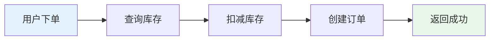
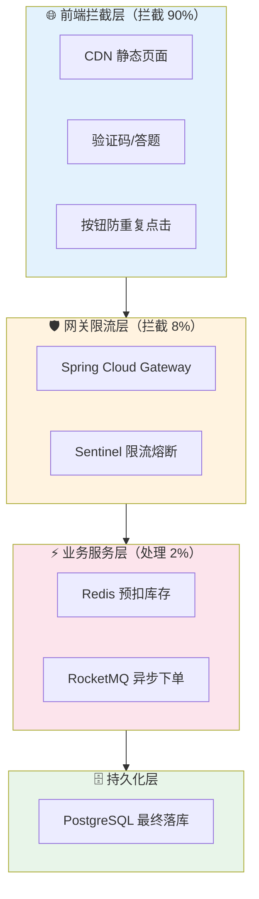
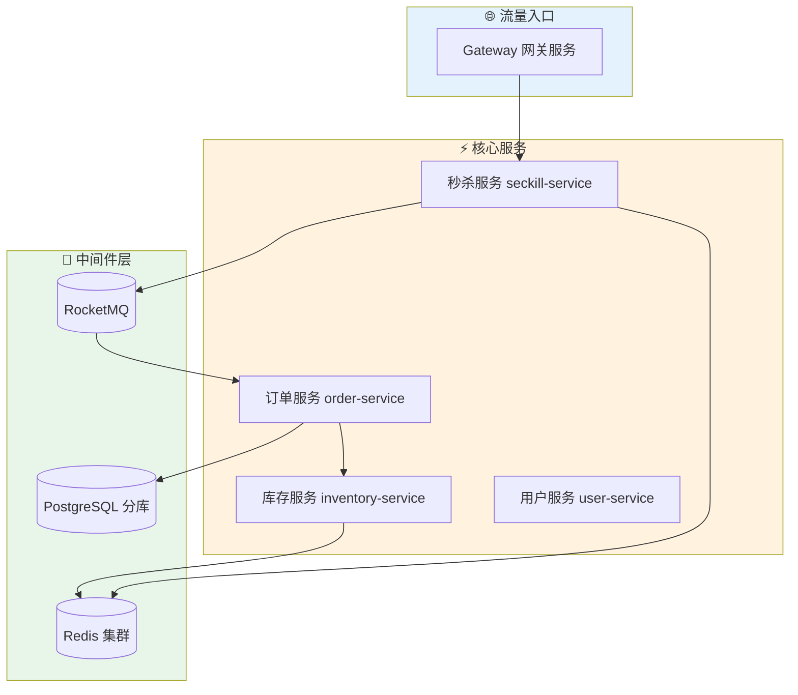
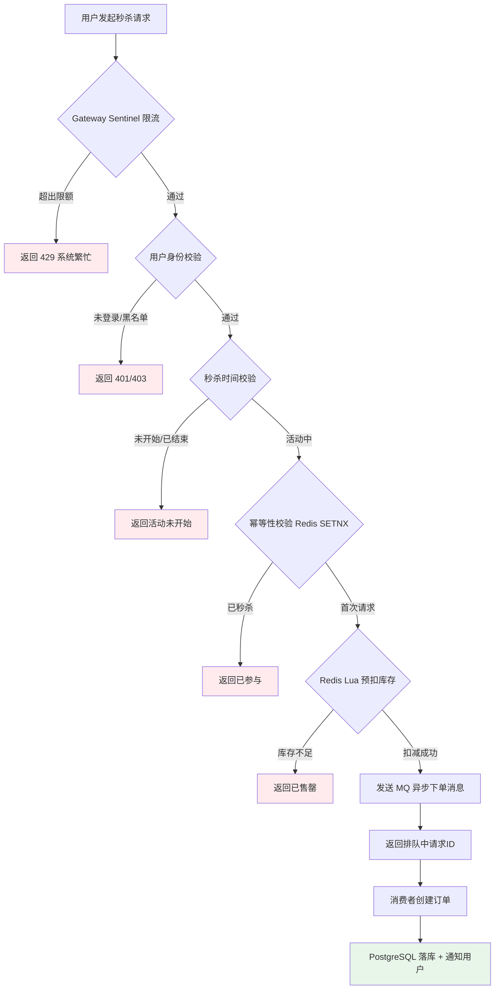

> 双十一零点整，10 万用户同时疯抢 1000 件商品——这不是压测脚本，这是真实的电商战场。一套设计不当的秒杀系统会在 3 秒内把数据库打崩、库存超卖到负数、用户收到成功提示却等不到货。本文基于 Spring Cloud Alibaba 技术栈，从请求进门到订单落库，拆解每一个"炸点"并给出可直接落地的解决方案。
>
> 📌 **适合人群**：有 Spring Boot 基础、想系统学习高并发设计的后端开发者


<!--
  MindMapFloat 节点说明：先完成正文后填写
-->
<MindMapFloat title="秒杀系统知识图谱">

```mindmap-data
# Spring Cloud 秒杀系统
## 为什么难
- 瞬时流量洪峰：10万QPS vs 正常100QPS
- 超卖风险：多线程并发扣减库存
- 数据一致性：Redis与PostgreSQL状态同步
## 架构分层
- CDN + 静态化：拦截90%前端流量
- Gateway网关：统一限流熔断入口
- 秒杀微服务：业务逻辑核心
- MQ异步层：削峰解耦
## 防超卖核心
- Redis Lua脚本原子扣减
- 乐观锁 vs 悲观锁选型
- 分布式幂等去重
## 限流与熔断
- Sentinel QPS/线程数规则
- 令牌桶 vs 漏桶算法
- 降级兜底策略
## 数据一致性
- 最终一致性设计
- 消息补偿机制
- 定时库存校对任务
```

</MindMapFloat>

## 关于本文档

本文覆盖一套生产级 Spring Cloud 秒杀系统的完整设计，从架构选型到代码实现，每个环节均附有 Java 可运行示例和最佳实践对比。

- ✅ 秒杀系统的核心挑战与分层防护思路
- ✅ Spring Cloud Gateway + Sentinel 网关限流配置
- ✅ Redis Lua 脚本实现原子预扣库存（防超卖）
- ✅ RocketMQ 异步下单削峰填谷完整链路
- ✅ 最终一致性保障：消息补偿 + 定时校对

## 1. 为什么秒杀系统这么难做

### 1.1 普通下单流程是怎么工作的

正常的电商下单流程是这样的：用户点击购买 → 查询库存 → 扣减库存 → 创建订单 → 返回结果。这个流程在日常 100 QPS 的场景下完全没问题，数据库一条 UPDATE 语句配合行级锁就能保证数据安全。



### 1.2 秒杀场景的三大炸弹

当流量从 100 QPS 瞬间冲到 100,000 QPS，原本的设计全面崩溃：

| 问题 | 具体表现 | 危害等级 |
|------|----------|---------|
| 数据库宕机 | 行锁竞争积压，连接池耗尽 | ⭐⭐⭐⭐⭐ |
| 库存超卖 | 并发读库存均 > 0，同时扣减导致负数 | ⭐⭐⭐⭐⭐ |
| 重复下单 | 用户多次点击或网络重试，同一商品下多笔单 | ⭐⭐⭐⭐ |
| 系统雪崩 | 订单服务超时拖垮库存服务，连锁崩溃 | ⭐⭐⭐⭐⭐ |

> [!IMPORTANT]
> 秒杀系统的本质矛盾是：**流量是爆发式的，而资源（数据库连接、CPU、库存）是有限的**。解决这个矛盾的核心思路只有三个字：**拦、缓、异**——在前置层拦截无效流量，用缓存替代数据库，把同步变成异步。


### 1.3 分层防护的核心思想

秒杀系统的设计思路不是"让系统扛住所有请求"，而是"让绝大多数无效请求在最前面就被挡掉"。一个 1000 库存的秒杀活动，后端真正需要处理的有效请求只有 1000 个，其余的 99,000 个请求都应该在入口层被快速拒绝。




## 2. Spring Cloud 秒杀系统整体架构

### 2.1 技术选型总览

本文使用的是 Spring Cloud Alibaba 技术栈，2026 年的主流选型如下：

| 组件 | 选型 | 版本 | 职责 |
|------|------|------|------|
| 核心框架 | Spring Boot | 3.2.4 | 提供基础的微服务环境 |
| 微服务框架 | Spring Cloud | 2023.0.1 | 提供微服务治理基础组件 |
| 阿里微服务 | Spring Cloud Alibaba | 2023.0.1.0 | 提供流量控制、服务注册等核心组件 |
| 服务注册发现 | Nacos 2.x | 2.x | 服务注册、配置中心 |
| API 网关 | Spring Cloud Gateway | 4.x | 统一入口、路由、限流 |
| 流量控制 | Sentinel 2.x | 2.0.0 | 限流、熔断、降级 |
| 缓存 | Redis | 7.x | 库存预热、预扣 |
| 消息队列 | RocketMQ 5.x | 2.3.1 (Starter) | 异步下单、削峰填谷 |
| 数据库 | PostgreSQL | 8.x | 订单持久化 |


### 2.2 微服务拆分方案

秒杀系统应独立部署，与主站业务彻底隔离，避免秒杀流量冲垮其他服务。核心服务拆分如下：



### 2.3 项目 Maven 依赖配置

```xml
<!-- pom.xml 核心依赖 -->
<dependencyManagement>
    <dependencies>
        <!-- Spring Boot -->
        <dependency>
            <groupId>org.springframework.boot</groupId>
            <artifactId>spring-boot-dependencies</artifactId>
            <version>3.2.4</version>
            <type>pom</type>
            <scope>import</scope>
        </dependency>
        <!-- Spring Cloud -->
        <dependency>
            <groupId>org.springframework.cloud</groupId>
            <artifactId>spring-cloud-dependencies</artifactId>
            <version>2023.0.1</version>
            <type>pom</type>
            <scope>import</scope>
        </dependency>
        <!-- Spring Cloud Alibaba -->
        <dependency>
            <groupId>com.alibaba.cloud</groupId>
            <artifactId>spring-cloud-alibaba-dependencies</artifactId>
            <version>2023.0.1.0</version>
            <type>pom</type>
            <scope>import</scope>
        </dependency>
    </dependencies>
</dependencyManagement>

<dependencies>
    <!-- Spring Cloud Gateway 网关 -->
    <dependency>
        <groupId>org.springframework.cloud</groupId>
        <artifactId>spring-cloud-starter-gateway</artifactId>
    </dependency>

    <!-- Sentinel 流量控制 -->
    <dependency>
        <groupId>com.alibaba.cloud</groupId>
        <artifactId>spring-cloud-starter-alibaba-sentinel</artifactId>
    </dependency>

    <!-- Gateway 整合 Sentinel -->
    <dependency>
        <groupId>com.alibaba.cloud</groupId>
        <artifactId>spring-cloud-alibaba-sentinel-gateway</artifactId>
    </dependency>

    <!-- Nacos 服务发现 -->
    <dependency>
        <groupId>com.alibaba.cloud</groupId>
        <artifactId>spring-cloud-starter-alibaba-nacos-discovery</artifactId>
    </dependency>

    <!-- RocketMQ -->
    <dependency>
        <groupId>org.apache.rocketmq</groupId>
        <artifactId>rocketmq-spring-boot-starter</artifactId>
        <version>2.3.1</version>
    </dependency>

    <!-- Redis -->
    <dependency>
        <groupId>org.springframework.boot</groupId>
        <artifactId>spring-boot-starter-data-redis</artifactId>
    </dependency>
</dependencies>
```

## 3. 网关层：Sentinel 限流把第一道关

### 3.1 为什么限流必须前置

很多文章把限流放在订单服务里，这是一个常见的架构误区。订单服务做限流时，请求已经穿过了网关、经过了服务发现、占用了线程池——此时再拒绝，无效消耗已经发生。**限流一定要在流量最前端的网关层执行。**

> [!CAUTION]
> **错误做法**：在 `OrderService.createOrder()` 方法上加 `@SentinelResource` 限流。此时请求已消耗网络资源和线程，拒绝太晚。
>
> **正确做法**：在 Spring Cloud Gateway 上整合 Sentinel，在请求路由前就完成限流判断。


### 3.2 Gateway 整合 Sentinel 限流配置

`application.yml` 配置秒杀路由并开启 Sentinel：

```yaml
# gateway-service/src/main/resources/application.yml
spring:
  cloud:
    gateway:
      routes:
        # 秒杀服务路由
        - id: seckill-route
          uri: lb://seckill-service
          predicates:
            - Path=/seckill/**
          filters:
            # 去掉路径前缀
            - StripPrefix=1
    sentinel:
      transport:
        # Sentinel 控制台地址
        dashboard: localhost:9000
      # 开启 Gateway 适配
      scg:
        fallback:
          mode: response
          response-status: 429
          response-body: '{"code":429,"msg":"系统繁忙，请稍后重试"}'
```

用 Java 代码动态注册 Sentinel 网关限流规则：

```java
/**
 * 秒杀网关限流规则配置
 * 在 Gateway 服务启动时注册 Sentinel 规则
 */
@Configuration
public class SentinelGatewayConfig {

    @PostConstruct
    public void initGatewayRules() {
        Set<GatewayFlowRule> rules = new HashSet<>();

        // 规则1：秒杀接口整体 QPS 限制为 5000/s
        GatewayFlowRule seckillRule = new GatewayFlowRule("seckill-route")
                .setCount(5000)                    // 阈值：5000 QPS
                .setIntervalSec(1)                 // 统计窗口：1秒
                .setControlBehavior(RuleConstant.CONTROL_BEHAVIOR_DEFAULT); // 快速失败

        // 规则2：单个 IP 每秒最多 10 次秒杀请求（防刷）
        GatewayFlowRule ipRule = new GatewayFlowRule("seckill-route")
                .setCount(10)
                .setIntervalSec(1)
                .setParamItem(
                    new GatewayParamFlowItem()
                        .setParseStrategy(SentinelGatewayConstants.PARAM_PARSE_STRATEGY_CLIENT_IP)
                );

        rules.add(seckillRule);
        rules.add(ipRule);

        // 注册规则到 Sentinel
        GatewayRuleManager.loadRules(rules);
    }
}
```

### 3.3 Sentinel 限流算法对比

Sentinel 支持三种控制策略，选型时根据业务场景判断：

| 控制策略 | 算法原理 | 适用场景 | 秒杀推荐 |
|---------|---------|---------|---------|
| 快速失败（默认） | 超阈值直接拒绝 | 纯限流，不排队 | ✅ 首选 |
| Warm Up（预热） | 冷启动时慢慢放量 | 服务启动初期 | ✅ 次选 |
| 排队等待 | 匀速放行，多余排队 | 削峰填谷场景 | ⚠️ 不推荐 |

> [!TIP]
> 秒杀场景推荐使用**快速失败 + Warm Up** 组合：预热期 (Warm Up) 让服务逐步承载流量，高峰期切换为快速失败直接拒绝，保护下游服务。


## 4. 库存服务：Redis Lua 脚本防超卖

### 4.1 超卖问题的根本原因

超卖问题本质上是**查询与扣减之间存在时间窗口**。在并发场景下，多个线程同时读到库存为 1，然后都执行扣减操作，导致库存变成负数。

```java
// ❌ 错误示例：非原子操作，高并发下必超卖
public boolean deductStock(Long skuId) {
    Integer stock = stockMapper.getStock(skuId);  // 步骤1：读库存
    if (stock > 0) {
        stockMapper.deductStock(skuId, 1);         // 步骤2：扣库存
        return true;                               // 步骤1和2之间存在竞态条件！
    }
    return false;
}
```

### 4.2 Redis + Lua 脚本原子扣减（推荐方案）

Redis 是单线程模型，配合 Lua 脚本可以保证"查询 + 扣减"两个操作的原子性，彻底消灭超卖：

```java
/**
 * Redis Lua 脚本预扣库存
 * Lua 脚本在 Redis 服务端原子执行，不会被其他命令插入
 */
@Service
public class StockRedisService {

    @Autowired
    private StringRedisTemplate redisTemplate;

    /**
     * Lua 脚本：原子扣减库存
     * 返回值：1 表示扣减成功，0 表示库存不足，-1 表示商品不存在
     */
    private static final String DEDUCT_STOCK_LUA =
            "local stock = tonumber(redis.call('HGET', KEYS[1], 'stock')) \n" +
            "if stock == nil then return -1 end \n" +           // 商品不存在
            "if stock <= 0 then return 0 end \n" +              // 库存不足
            "redis.call('HINCRBY', KEYS[1], 'stock', -1) \n" + // 原子扣减 1
            "return 1";                                         // 扣减成功

    private final RedisScript<Long> deductScript =
            new DefaultRedisScript<>(DEDUCT_STOCK_LUA, Long.class);

    /**
     * 预扣 Redis 库存
     * @param skuId 商品 ID
     * @return 1 扣减成功，0 库存不足，-1 商品不存在
     */
    public Long preDeductStock(Long skuId) {
        String key = "seckill:stock:" + skuId;
        return redisTemplate.execute(
            deductScript,
            Collections.singletonList(key)
        );
    }

    /**
     * 秒杀活动开始前预热库存到 Redis
     * 通常由定时任务在活动开始前 5 分钟执行
     */
    public void warmUpStock(Long skuId, int stock) {
        String key = "seckill:stock:" + skuId;
        Map<String, String> stockInfo = new HashMap<>();
        stockInfo.put("stock", String.valueOf(stock));
        stockInfo.put("skuId", String.valueOf(skuId));
        // 设置 2 小时过期，避免活动结束后 Redis 数据残留
        redisTemplate.opsForHash().putAll(key, stockInfo);
        redisTemplate.expire(key, 2, TimeUnit.HOURS);
    }

    /**
     * 回滚 Redis 库存（MQ 发送失败时调用）
     */
    public void rollbackStock(Long skuId) {
        String key = "seckill:stock:" + skuId;
        redisTemplate.opsForHash().increment(key, "stock", 1);
    }

    /**
     * 获取 Redis 当前库存
     */
    public int getStock(Long skuId) {
        String key = "seckill:stock:" + skuId;
        Object val = redisTemplate.opsForHash().get(key, "stock");
        return val == null ? 0 : Integer.parseInt(val.toString());
    }

    /**
     * 重置 Redis 库存（以 PostgreSQL 为准，用于定时校对）
     */
    public void resetStock(Long skuId, int stock) {
        String key = "seckill:stock:" + skuId;
        redisTemplate.opsForHash().put(key, "stock", String.valueOf(stock));
    }
}
```

### 4.3 乐观锁方案（PostgreSQL 兜底）

当 Redis 不可用时，PostgreSQL 乐观锁方案作为降级兜底：

```java
/**
 * PostgreSQL 乐观锁扣减库存（降级兜底方案）
 * 使用 WHERE stock > 0 条件防止超卖，无需显式加锁
 */
@Mapper
public interface StockMapper {

    /**
     * SQL: UPDATE seckill_stock
     *      SET stock = stock - #{count}
     *      WHERE sku_id = #{skuId} AND stock >= #{count}
     * 返回受影响行数：1 = 扣减成功，0 = 库存不足
     */
    @Update("UPDATE seckill_stock SET stock = stock - #{count} " +
            "WHERE sku_id = #{skuId} AND stock >= #{count}")
    int deductStockWithOptimisticLock(
        @Param("skuId") Long skuId,
        @Param("count") int count
    );
}
```

> [!NOTE]
> PostgreSQL 的 `WHERE stock >= count` 利用了数据库自身的行级锁保证原子性。这比应用层先查后改要安全，但并发吞吐量远低于 Redis 方案，仅作降级使用。


## 5. 秒杀服务核心链路：从请求到队列

### 5.1 完整秒杀请求处理流程



### 5.2 秒杀服务核心代码

```java
/**
 * 秒杀核心服务
 * 职责：校验 → 预扣库存 → 发送 MQ 消息
 */
@Service
@Slf4j
public class SeckillService {

    @Autowired
    private StockRedisService stockRedisService;

    @Autowired
    private RocketMQTemplate rocketMQTemplate;

    @Autowired
    private StringRedisTemplate redisTemplate;

    /**
     * 执行秒杀操作
     * @param userId  用户 ID
     * @param skuId   商品 ID
     * @return 秒杀结果（排队 requestId 或失败原因）
     */
    @SentinelResource(value = "seckill", blockHandler = "seckillBlockHandler")
    public SeckillResult doSeckill(Long userId, Long skuId) {

        // ① 幂等性检查：同一用户同一商品只能秒杀一次
        String userKey = "seckill:user:" + userId + ":" + skuId;
        Boolean isFirst = redisTemplate.opsForValue()
            .setIfAbsent(userKey, "1", 24, TimeUnit.HOURS);
        if (Boolean.FALSE.equals(isFirst)) {
            return SeckillResult.fail("您已参与过该活动");
        }

        // ② Redis Lua 脚本原子预扣库存
        Long deducted = stockRedisService.preDeductStock(skuId);
        if (deducted == null || deducted == -1L) {
            // 扣减失败说明商品不存在或未预热，回滚幂等标记
            redisTemplate.delete(userKey);
            return SeckillResult.fail("商品不存在或未预热");
        } else if (deducted == 0L) {
            // 扣减失败说明库存不足，回滚幂等标记
            redisTemplate.delete(userKey);
            return SeckillResult.fail("商品已售罄");
        }

        // ③ 生成唯一请求 ID，异步追踪订单结果
        String requestId = UUID.randomUUID().toString().replace("-", "");

        // ④ 发送 MQ 消息，异步创建订单
        SeckillOrderMessage msg = SeckillOrderMessage.builder()
            .requestId(requestId)
            .userId(userId)
            .skuId(skuId)
            .createTime(System.currentTimeMillis())
            .build();

        rocketMQTemplate.asyncSendOrderly(
            "seckill-order-topic",
            msg,
            String.valueOf(skuId),
            new SendCallback() {
                @Override
                public void onSuccess(SendResult sendResult) {
                    log.info("MQ 发送成功，requestId={}", requestId);
                }
                @Override
                public void onException(Throwable e) {
                    // MQ 发送失败，需要回滚 Redis 库存！
                    log.error("MQ 发送失败，回滚库存 skuId={}", skuId, e);
                    stockRedisService.rollbackStock(skuId);
                    redisTemplate.delete(userKey);
                }
            }
        );

        return SeckillResult.queuing(requestId);
    }

    /**
     * Sentinel 限流降级处理
     * 当 QPS 超限时触发，返回友好提示
     */
    public SeckillResult seckillBlockHandler(Long userId, Long skuId, BlockException ex) {
        log.warn("秒杀接口被限流, userId={}, skuId={}", userId, skuId);
        return SeckillResult.fail("系统繁忙，请稍后重试");
    }
}
```

### 5.3 关键数据模型设计

```java
/**
 * 秒杀结果返回对象
 */
@Data
@Builder
@NoArgsConstructor
@AllArgsConstructor
public class SeckillResult {
    // 状态：SUCCESS(成功) / FAIL(失败) / QUEUING(排队中)
    private String status;
    private String message;
    // 排队时的请求 ID，用于轮询订单结果
    private String requestId;

    public static SeckillResult queuing(String requestId) {
        return SeckillResult.builder()
            .status("QUEUING")
            .message("秒杀成功，正在创建订单...")
            .requestId(requestId)
            .build();
    }

    public static SeckillResult fail(String message) {
        return SeckillResult.builder()
            .status("FAIL")
            .message(message)
            .build();
    }
}

/**
 * MQ 异步下单消息体
 */
@Data
@Builder
@NoArgsConstructor
@AllArgsConstructor
public class SeckillOrderMessage implements Serializable {
    private String requestId;   // 唯一请求 ID（用于幂等消费）
    private Long userId;
    private Long skuId;
    private long createTime;

    public static SeckillOrderMessage fromRecord(SeckillRecord record) {
        return SeckillOrderMessage.builder()
            .requestId(record.getRequestId())
            .userId(record.getUserId())
            .skuId(record.getSkuId())
            .createTime(record.getCreateTime())
            .build();
    }
}
```

## 6. RocketMQ 异步下单：削峰填谷

### 6.1 为什么秒杀需要消息队列

秒杀的流量曲线是"脉冲型"的：0 点整的那一秒可能涌入 10 万请求，之后瞬间回落到正常水平。如果把订单写入 PostgreSQL 这个耗时操作放在主流程里，数据库在那一秒会被打崩。

消息队列的作用是把这一秒的 10 万个请求"存起来"，然后以数据库能承受的速度（比如 5000 TPS）慢慢消费——这就是**削峰填谷**，如同水库蓄洪。

```mermaid
gantt
    title 有无 MQ 的数据库压力对比
    dateFormat  X
    axisFormat %s秒

    section 无 MQ（直接写库）
    峰值压力 100,000 TPS : crit, 0, 1
    正常压力 100 TPS    : 1, 60

    section 有 MQ（异步削峰）
    MQ 暂存请求       : active, 0, 1
    平稳消费 5000 TPS : 0, 20
```




### 6.2 RocketMQ 消费者实现

```java
/**
 * 秒杀订单消费者
 * 监听 seckill-order-topic，异步创建订单并更新 PostgreSQL 库存
 */
@RocketMQMessageListener(
    topic = "seckill-order-topic",
    consumerGroup = "seckill-order-consumer-group",
    // 顺序消费（保证同一 skuId 的订单按顺序处理）
    consumeMode = ConsumeMode.ORDERLY,
    messageModel = MessageModel.CLUSTERING
)
@Service
@Slf4j
public class SeckillOrderConsumer implements RocketMQListener<SeckillOrderMessage> {

    @Autowired
    private OrderService orderService;

    @Autowired
    private StockMapper stockMapper;

    @Autowired
    private StringRedisTemplate redisTemplate;

    @Override
    @Transactional(rollbackFor = Exception.class)
    public void onMessage(SeckillOrderMessage msg) {
        log.info("收到秒杀订单消息, requestId={}", msg.getRequestId());

        // ① 幂等性检查：防止 MQ 重复投递（消费者宕机重启后可能重投）
        String consumeKey = "seckill:consumed:" + msg.getRequestId();
        Boolean isFirst = redisTemplate.opsForValue()
            .setIfAbsent(consumeKey, "1", 24, TimeUnit.HOURS);
        if (Boolean.FALSE.equals(isFirst)) {
            log.warn("重复消费，跳过 requestId={}", msg.getRequestId());
            return;
        }

        try {
            // ② 扣减 PostgreSQL 实际库存（最终持久化）
            int affected = stockMapper.deductStockWithOptimisticLock(msg.getSkuId(), 1);
            if (affected == 0) {
                // PostgreSQL 扣减失败（极端情况下 Redis 放行但 DB 无库存），抛出异常让消息进入重试/死信队列，人工排查不一致原因
                log.error("PostgreSQL 库存扣减失败, skuId={}", msg.getSkuId());
                throw new RuntimeException("库存扣减失败");
            }

            // ③ 创建订单并持久化
            Order order = orderService.createSeckillOrder(
                msg.getUserId(),
                msg.getSkuId(),
                msg.getRequestId()
            );

            // ④ 更新请求状态到 Redis，供前端轮询
            redisTemplate.opsForValue().set(
                "seckill:result:" + msg.getRequestId(),
                "ORDER_CREATED:" + order.getOrderNo(),
                1, TimeUnit.HOURS
            );

            log.info("订单创建成功, orderId={}", order.getOrderNo());

        } catch (Exception e) {
            // 消费失败时删除幂等标记，让 MQ 重试
            redisTemplate.delete(consumeKey);
            throw e;
        }
    }
}
```

### 6.3 前端轮询查询订单结果

用户秒杀成功后拿到 `requestId`，通过轮询接口查询最终订单状态：

```java
/**
 * 查询秒杀结果接口
 * 前端每隔 1 秒轮询一次，直到获取到订单 ID 或超时
 */
@GetMapping("/seckill/result/{requestId}")
public ResponseEntity<SeckillResult> querySeckillResult(@PathVariable String requestId) {
    String key = "seckill:result:" + requestId;
    String result = redisTemplate.opsForValue().get(key);

    if (result == null) {
        // 订单还在处理中
        return ResponseEntity.ok(SeckillResult.builder()
            .status("PROCESSING").message("订单处理中...").build());
    }

    if (result.startsWith("ORDER_CREATED:")) {
        // 订单创建成功
        String orderNo = result.substring("ORDER_CREATED:".length());
        return ResponseEntity.ok(SeckillResult.builder()
            .status("SUCCESS").message("下单成功，订单号：" + orderNo).build());
    }

    return ResponseEntity.ok(SeckillResult.fail(result));
}
```

## 7. 数据一致性：Redis 与 PostgreSQL 的最终同步

### 7.1 一致性挑战：三个可能失败的环节

预扣库存 → 发送 MQ → 消费创建订单，任何一环失败都会导致不一致：

| 失败场景 | 结果 | 处理方案 |
|---------|------|---------|
| Redis 扣减成功，MQ 发送失败 | Redis 少了库存，订单没创建（少卖） | MQ 失败回调回滚 Redis |
| MQ 消费成功，PostgreSQL 写入失败 | Redis 库存已扣，数据库未落库 | 消费者事务 + MQ 重试 |
| PostgreSQL 落库成功，通知失败 | 订单已创建，用户未收到通知 | 定时任务补推 |

> [!IMPORTANT]
> 秒杀系统选择**最终一致性**而非强一致性（分布式事务），因为强一致性（如 Seata AT 模式）会带来大量锁等待，在秒杀高并发场景下是性能杀手。

### 7.2 定时任务校对库存（兜底保障）

```java
/**
 * 库存校对定时任务
 * 每 5 分钟检查 Redis 库存与 PostgreSQL 库存是否一致
 * 兜底保障，应对极端情况下的数据不一致
 */
@Component
@Slf4j
public class StockSyncTask {

    @Autowired
    private StockMapper stockMapper;

    @Autowired
    private StockRedisService stockRedisService;

    @Scheduled(fixedDelay = 5 * 60 * 1000)  // 每 5 分钟执行一次
    public void syncStock() {
        // 获取所有进行中的秒杀活动商品
        List<Long> activeSkuIds = stockMapper.findActiveSeckillSkuIds();

        for (Long skuId : activeSkuIds) {
            // 查询 PostgreSQL 实际库存
            int dbStock = stockMapper.getStock(skuId);
            // 查询 Redis 缓存库存
            int redisStock = stockRedisService.getStock(skuId);

            if (dbStock != redisStock) {
                log.warn("库存不一致 skuId={}, DB={}, Redis={}", skuId, dbStock, redisStock);
                // 以 PostgreSQL 为准，修复 Redis
                stockRedisService.resetStock(skuId, dbStock);
            }
        }
    }
}
```

### 7.3 消息补偿机制

```java
/**
 * 消息补偿任务
 * 扫描超过 30 分钟未完成的秒杀请求，重新发送 MQ
 */
@Slf4j
@Component
public class SeckillCompensationTask {

    @Autowired
    private SeckillRecordMapper seckillRecordMapper;

    @Autowired
    private StringRedisTemplate redisTemplate;

    @Autowired
    private RocketMQTemplate rocketMQTemplate;

    @Scheduled(fixedDelay = 10 * 60 * 1000) // 每 10 分钟执行
    public void compensate() {
        // 查询超时未完成的秒杀记录（状态 = PROCESSING 且创建时间 > 30min）
        List<SeckillRecord> pendingList = seckillRecordMapper
            .findPendingTimeout(30);

        for (SeckillRecord record : pendingList) {
            // 检查 Redis 结果是否存在
            String result = redisTemplate.opsForValue()
                .get("seckill:result:" + record.getRequestId());

            if (result == null) {
                // 结果不存在，重新投递 MQ
                log.info("补偿发送 MQ requestId={}", record.getRequestId());
                rocketMQTemplate.syncSendOrderly(
                    "seckill-order-topic",
                    SeckillOrderMessage.fromRecord(record),
                    String.valueOf(record.getSkuId())  // 与生产者保持一致
                );
            }
        }
    }
}
```


## 8. 最佳实践与常见坑

### 8.1 库存预热：活动前提前加载

> [!WARNING]
> 秒杀活动开始瞬间，如果商品数据不在 Redis 中，大量请求会穿透到 PostgreSQL 查询，数据库在活动开始的第一秒就宕机——这叫**缓存击穿**。必须提前预热！

```java
/**
 * 秒杀商品库存预热
 * 在活动开始前 5 分钟，由 Spring Scheduler 触发
 */
@Component
@Slf4j
public class SeckillStockWarmUpTask {

    @Autowired
    private ActivityMapper activityMapper;

    @Autowired
    private StockRedisService stockRedisService;

    @Scheduled(cron = "0 55 * * * *")  // 每小时第 55 分钟执行（提前 5 分钟）
    public void preheatSeckillStock() {
        List<SeckillActivity> activities = activityMapper
            .findActivitiesStartingIn(5); // 5分钟内开始的活动

        for (SeckillActivity activity : activities) {
            // 将库存写入 Redis，有效期设为活动时长 + 1小时
            stockRedisService.warmUpStock(
                activity.getSkuId(),
                activity.getStock()
            );
            log.info("库存预热完成 skuId={}, stock={}",
                activity.getSkuId(), activity.getStock());
        }
    }
}
```

### 8.2 防刷与黑名单

| 攻击类型 | 防护手段 | 实现位置 |
|---------|---------|---------|
| 脚本高频刷请求 | IP 级别限流（Sentinel） | Gateway 层 |
| 多账号同时抢 | 设备指纹 + 账号年龄校验 | 用户服务 |
| 预测 URL 绕过 | 秒杀 URL 加随机 Token | 前端 + 秒杀服务 |
| 重复下单 | Redis SETNX 幂等 | 秒杀服务 |

```java
// 秒杀 URL 动态 Token 校验
// 在活动开始时，才把正确 Token 下发到前端页面
@GetMapping("/seckill/token/{activityId}")
public String getSeckillToken(@PathVariable Long activityId,
                               @RequestParam Long userId) {
    // 验证活动状态和用户资格
    validateUserQualification(userId, activityId);

    // 生成随机 Token 并存入 Redis（5分钟有效期）
    String token = UUID.randomUUID().toString();
    redisTemplate.opsForValue().set(
        "seckill:token:" + activityId + ":" + userId,
        token, 5, TimeUnit.MINUTES
    );
    return token;
}
```


### 8.3 常见问题排查手册

| 问题现象 | 排查方向 | 解决方案 |
|---------|---------|---------|
| 库存变负数 | Redis 未用 Lua 脚本 | 改用原子 Lua 脚本 |
| 用户多次下单 | 幂等 Key 设置不对 | 用 userId+skuId+活动ID 做 Key |
| MQ 消息重复消费 | 消费者重启 | requestId 做幂等 Key |
| Redis 库存与 DB 不一致 | 无补偿机制 | 加定时校对任务 |
| 活动开始时系统卡顿 | 未预热 Redis | 提前 5 分钟预热库存 |
| 秒杀接口被刷爆 | 无前置限流 | 在 Gateway 加 Sentinel 限流规则 |

> [!CAUTION]
> **绝对不能用 `synchronized` 解决秒杀超卖问题！** 单机 JVM 锁在分布式多实例部署时完全无效，只有同一 JVM 进程内的线程才会互斥，不同机器上的请求根本感知不到这把锁。


## 9. 方案对比：小厂 vs 大厂秒杀架构

不同体量的业务，秒杀方案也不同，不要过度设计：

| 维度 | 小型（< 1万 QPS） | 中型（1万~10万 QPS） | 大型（> 10万 QPS） |
|------|---------|---------|---------|
| 库存扣减 | PostgreSQL + WHERE stock > 0 | Redis Lua 脚本 | Redis Cluster Lua |
| 限流 | Nginx 限流 | Sentinel 网关限流 | Sentinel 集群限流 |
| 下单方式 | 同步写 PostgreSQL | RocketMQ 异步 | RocketMQ 顺序消息 |
| 服务部署 | 单体应用 | 微服务 | 微服务 + 热点隔离 |
| 一致性方案 | 数据库事务 | Redis + MQ 最终一致 | 自研补偿框架 |

> [!TIP]
> **选型建议**：流量小于 1 万 QPS 的活动用 PostgreSQL 方案即可，不要为了技术而技术。只有真正达到 Redis 单节点性能瓶颈（约 10 万 QPS）时，才需要引入集群和顺序消息等复杂方案。


## 10. 总结

| 核心环节 | 关键技术 | 解决的问题 |
|---------|---------|---------|
| 前置拦截 | CDN + 静态化 | 90% 前端流量不到后端 |
| 网关限流 | Gateway + Sentinel | 保护后端服务不过载 |
| 防超卖 | Redis + Lua 原子脚本 | 库存不变负数 |
| 异步削峰 | RocketMQ 异步下单 | 数据库不被瞬时压垮 |
| 幂等控制 | Redis SETNX | 同一用户不重复下单 |
| 最终一致 | 定时校对 + 消息补偿 | Redis 与 PostgreSQL 数据同步 |

> [!TIP]
> **学习路径建议**：
> 1. 先在单体 Spring Boot 中实现 Redis Lua 预扣库存，理解原子操作
> 2. 引入 RocketMQ，把下单流程改为异步，理解削峰原理
> 3. 接入 Spring Cloud Gateway + Sentinel，实现前置限流
> 4. 加入定时任务和消息补偿，完善一致性保障
> 5. 压测验证：用 JMeter 模拟 10 万并发，验证超卖问题是否真正消失


## 11. 参考资料

### 官方文档

| 文档 | 链接 |
|------|------|
| Spring Cloud Alibaba 官方文档 | https://sca.aliyun.com/docs/2023/overview/what-is-sca/ |
| Sentinel 官方文档 | https://sentinelguard.io/zh-cn/docs/introduction.html |
| RocketMQ 5.x 官方文档 | https://rocketmq.apache.org/zh/docs/ |
| 阿里云秒杀系统实践 | https://help.aliyun.com/zh/document_detail/2860128.html |

### 推荐延伸阅读

- [Sentinel 网关限流官方 Wiki](https://github.com/alibaba/Sentinel/wiki/网关限流)
- [本文配套实战 Demo 源码 (GitHub)](https://github.com/yjiace/spring-cloud-seckill)：包含文档中涉及的微服务架构、Redis预扣减、RocketMQ异步下单等核心代码实现，可供本地运行与参考测试。
