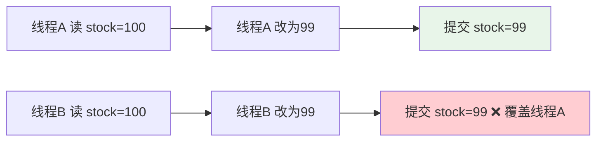
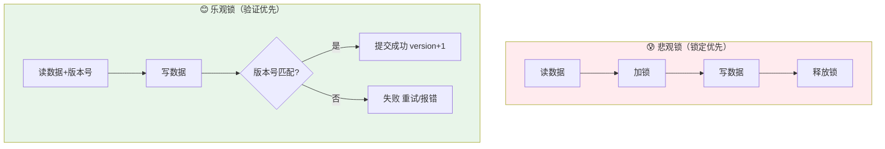
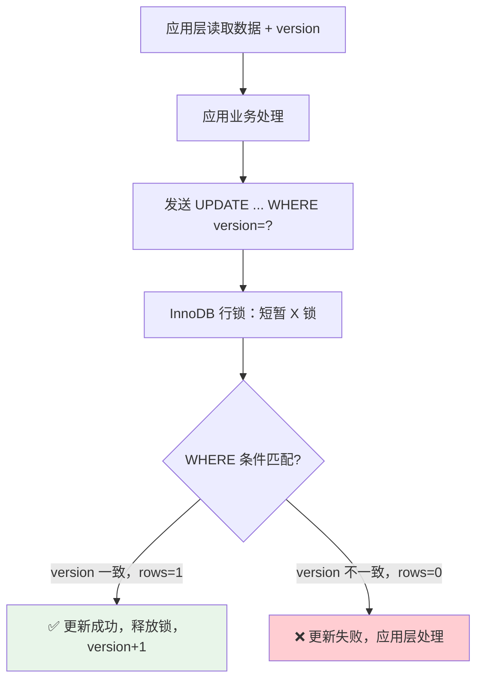
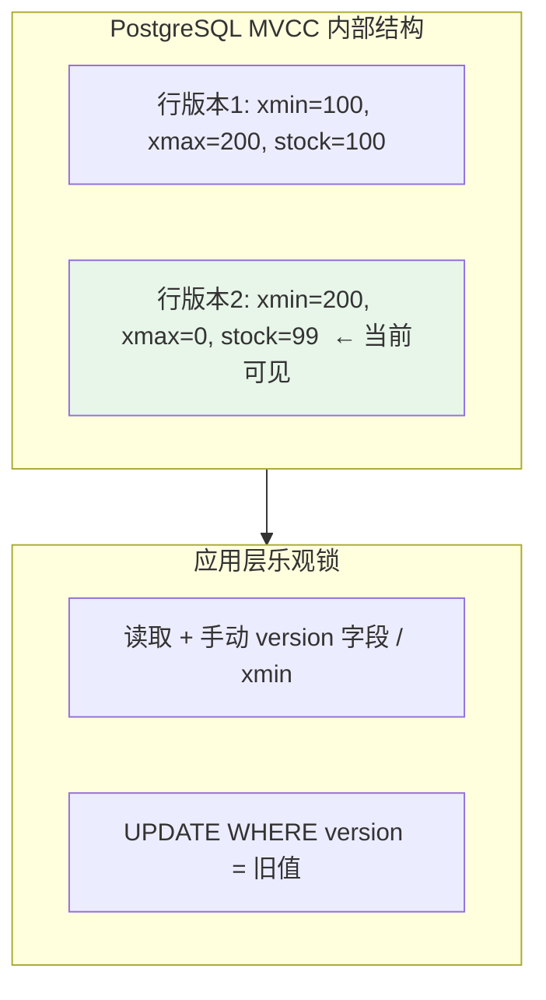

> 银行转账超发、电商库存超卖、票务系统重复下单——这些高并发下的经典数据一致性噩梦，都指向同一个根源：并发写入时没有可靠的冲突检测。乐观锁以"不加锁、提交时验证"的思路，在读多写少的场景下优雅解决这一问题。本文从原理出发，重点剖析 MySQL 和 PostgreSQL 的乐观锁实现，兼顾其他主流数据库，并提供 Spring Boot + JPA/MyBatis-Plus 的完整落地方案。
>
> 📌 **适合人群**：后端开发者、了解基础 SQL 和 Spring Boot 的初中级工程师


<!--
  MindMapFloat 节点说明（正文完成后填写）
-->
<MindMapFloat title="数据库乐观锁知识图谱">

```mindmap-data
# 数据库乐观锁
## 为什么需要乐观锁
- 并发写入的"丢失更新"问题
- 悲观锁的性能瓶颈
- 读多写少场景的最优解
## 核心实现机制
- 版本号（version）字段
- 时间戳（timestamp）方式
- CAS 原生值比较
## 主流数据库实现
- MySQL：应用层版本号
- PostgreSQL：MVCC + xmin / 版本号
- Oracle、MongoDB、Redis 等
## Spring Boot 集成
- JPA @Version 注解
- MyBatis-Plus @Version + 插件
- 异常处理与重试机制
## 最佳实践与避坑
- 冲突率阈值选型
- 重试策略设计
- 不适用场景识别
```

</MindMapFloat>

## 关于本文档

本文围绕"高并发下如何保证数据更新不冲突"展开，从并发写入的痛点出发，逐步深入乐观锁的实现原理和各数据库差异，重点结合 Spring Boot 给出可直接复用的代码。

- ✅ 乐观锁 vs 悲观锁的核心区别与选型依据
- ✅ MySQL 版本号机制的 SQL 实现原理与陷阱
- ✅ PostgreSQL MVCC 与乐观锁的深度结合
- ✅ Oracle、MongoDB、Redis 乐观锁简明对比
- ✅ Spring Boot JPA (@Version) 完整实战代码
- ✅ MyBatis-Plus 乐观锁插件配置与实战
- ✅ 冲突异常处理、重试机制与最佳实践

## 1. 并发写入的噩梦：为什么需要乐观锁

### 1.1 丢失更新：真实发生的数据灾难

想象一个电商库存场景：商品 A 的库存为 100 件，同时有两个下单请求到达后台。

```
请求1（线程A）：SELECT stock FROM products WHERE id=1;  → 读到 stock=100
请求2（线程B）：SELECT stock FROM products WHERE id=1;  → 读到 stock=100
请求1（线程A）：UPDATE products SET stock=99 WHERE id=1; → 更新成功
请求2（线程B）：UPDATE products SET stock=99 WHERE id=1; → 更新成功（覆盖了线程A！）
```

实际卖出 **2 件**，库存却只减少了 **1 件**——这就是典型的"丢失更新"（Lost Update）问题，也是超卖的根源。




### 1.2 悲观锁的代价：阻塞换一致性

最直觉的解法是悲观锁（`SELECT ... FOR UPDATE`）：读数据时直接加排他锁，其他事务必须等待。

```sql
-- 悲观锁写法（MySQL/PostgreSQL 通用）
BEGIN;
SELECT stock FROM products WHERE id=1 FOR UPDATE;  -- 锁住这一行
-- 业务逻辑...
UPDATE products SET stock = stock - 1 WHERE id=1;
COMMIT;
```

悲观锁能解决问题，但代价明显：

| 问题 | 具体表现 | 影响 |
|------|----------|------|
| 阻塞等待 | 高并发时大量请求排队 | 吞吐量断崖式下降 |
| 死锁风险 | 多表/多行操作时易死锁 | 系统异常 + 回滚开销 |
| 长事务危害 | 锁持有时间长 → 锁升级 | 级联阻塞，雪崩 |
| 连接耗尽 | 等待中的连接占用资源 | 数据库连接池满 |

> [!IMPORTANT]
> **阿里巴巴 Java 开发手册**规定：如果每次访问冲突概率小于 20%，推荐使用乐观锁；否则使用悲观锁，且乐观锁的重试次数不得小于 3 次。

### 1.3 乐观锁的核心思想：验证而非阻塞

乐观锁不在读取时加锁，而是在**提交更新时检查数据是否被他人修改**。就像超市结账：你把商品放入购物车时不锁库存，只在付款时确认库存是否还在。




## 2. 乐观锁的两种核心机制

### 2.1 版本号（Version）机制：最推荐的方式

在数据表中新增一个整数类型的 `version` 字段，初始值为 0 或 1。每次更新数据时，将 `version` 值 +1，并在 `WHERE` 条件中加入版本号比对。

**核心 SQL 模板：**

```sql
-- 读取数据，同时获取版本号
SELECT id, name, stock, version FROM products WHERE id = 1;
-- 假设读到：stock=100, version=5

-- 更新时携带版本号，只有版本匹配才能更新
UPDATE products
SET stock = stock - 1,
    version = version + 1          -- 版本号自增
WHERE id = 1
  AND version = 5;                 -- 携带读取时的版本号

-- 检查 UPDATE 影响的行数：
--   rows_affected = 1 → 成功（无冲突）
--   rows_affected = 0 → 失败（已被他人修改）
```

**为什么这样能防止丢失更新？**

| 时刻 | 线程A | 线程B | version |
|------|-------|-------|---------|
| T1 | 读到 version=5 | 读到 version=5 | 5 |
| T2 | UPDATE ... WHERE version=5 → **成功** | - | 6 |
| T3 | - | UPDATE ... WHERE version=5 → **失败（0行受影响）** | 6 |

线程 B 的更新因为版本号已从 5 变成 6 而无法匹配，数据不会被覆盖。


### 2.2 时间戳（Timestamp）机制

用 `updated_at` 时间戳替代整数 version，原理相同，但存在精度风险。

```sql
-- 时间戳乐观锁
UPDATE orders
SET status = 2,
    updated_at = NOW()
WHERE id = 1001
  AND updated_at = '2026-06-30 10:00:00.123';  -- 毫秒级精度
```

> [!WARNING]
> 时间戳精度在高并发场景下可能产生问题。如果两个事务在同一毫秒内完成读取，时间戳相同，乐观锁将失效。**推荐优先使用整数 version 字段**，时间戳仅作为辅助审计字段使用。

### 2.3 CAS 原始值比较：无额外字段

某些简单场景下，直接比对"更新前的业务字段值"也能实现乐观锁效果，无需额外字段。

```sql
-- 无 version 字段的 CAS 写法：扣减库存
UPDATE products
SET stock = stock - 1
WHERE id = 1
  AND stock = 100;    -- 直接比对读取时的原始库存值
```

| 方式 | 额外字段 | 精度 | 推荐度 | 适用场景 |
|------|----------|------|--------|----------|
| 整数 version | 需要 | 高 | ⭐⭐⭐⭐⭐ | 所有场景 |
| 时间戳 | 不需要（复用审计字段）| 中（毫秒） | ⭐⭐⭐ | 并发不极高的场景 |
| CAS 原值比较 | 不需要 | 取决于字段 | ⭐⭐ | 字段类型简单、单字段更新 |


## 3. MySQL 乐观锁：原理与实践

### 3.1 MySQL 乐观锁的底层原理

MySQL 本身不提供内置的乐观锁机制，乐观锁完全是**应用层实现**。MySQL 的 InnoDB 引擎在执行 `UPDATE` 语句时，会在行级别加一个短暂的写锁（X 锁）用于完成这次更新，然后立即释放。真正的"版本比对"逻辑由 `WHERE version = ?` 条件完成。



> [!NOTE]
> MySQL 的 `UPDATE` 执行后，应用层通过 `JDBC` 的 `executeUpdate()` 返回值（affected rows）来判断是否成功。返回 1 代表成功，返回 0 代表版本冲突。

### 3.2 MySQL 建表与基础 SQL 实现

```sql
-- 建表：添加 version 字段
CREATE TABLE `products` (
  `id`         BIGINT     NOT NULL AUTO_INCREMENT PRIMARY KEY,
  `name`       VARCHAR(100) NOT NULL,
  `stock`      INT        NOT NULL DEFAULT 0,
  `version`    INT        NOT NULL DEFAULT 0,   -- 乐观锁版本号
  `updated_at` DATETIME   NOT NULL DEFAULT CURRENT_TIMESTAMP ON UPDATE CURRENT_TIMESTAMP,
  INDEX `idx_id` (`id`)
) ENGINE=InnoDB DEFAULT CHARSET=utf8mb4;

-- 初始数据
INSERT INTO products (name, stock, version) VALUES ('商品A', 100, 0);
```

```sql
-- 步骤1：读取数据（含 version）
SELECT id, name, stock, version FROM products WHERE id = 1;
-- 结果：id=1, name='商品A', stock=100, version=0

-- 步骤2：更新（携带版本号，失败时 rows_affected=0）
UPDATE products
SET   stock   = stock - 1,
      version = version + 1
WHERE id      = 1
  AND version = 0;       -- 读取时拿到的版本号

-- 步骤3：判断是否成功（Java JDBC / MyBatis）
-- int rows = jdbcTemplate.update(...);
-- if (rows == 0) { throw new OptimisticLockException("数据已被修改，请重试"); }
```

### 3.3 MySQL 乐观锁注意事项

> [!CAUTION]
> **常见陷阱一：version 字段没有索引**
> 若 WHERE 条件中只有 `version` 而没有主键/唯一索引，可能触发全表扫描。务必确保 `WHERE id = ? AND version = ?` 中 `id` 是主键或有索引。

> [!CAUTION]
> **常见陷阱二：在循环重试中忘记重新查询**
> 乐观锁失败后，必须重新查询最新数据（含新 version），再发起更新，不能用旧数据重试。

```java
// ❌ 错误：用旧的 version 重试
while (rows == 0) {
    rows = update(entity.getVersion());  // version 永远是旧值，死循环
}

// ✅ 正确：失败后重新查询
int maxRetry = 3;
for (int i = 0; i < maxRetry; i++) {
    Product latest = productRepo.findById(id);   // 重新查询最新数据
    int rows = productMapper.updateWithVersion(latest.getVersion(), ...);
    if (rows > 0) break;
    if (i == maxRetry - 1) throw new BusinessException("操作失败，请稍后重试");
}
```

## 4. PostgreSQL 乐观锁：MVCC 加持的更强选项

### 4.1 PostgreSQL 的 MVCC 与乐观锁天然契合

PostgreSQL 的并发控制基于多版本并发控制（MVCC，Multi-Version Concurrency Control）。每一行数据在 PostgreSQL 内部都有系统隐藏列 `xmin`（插入/更新该行的事务 ID）和 `xmax`（删除该行的事务 ID）。

这意味着 PostgreSQL 本身就在行级别维护了版本信息，这是其与 MySQL 最显著的底层差异。



### 4.2 方法一：与 MySQL 相同的 version 字段方案

PostgreSQL 完全支持与 MySQL 相同的 version 字段方案，SQL 语法几乎一致：

```sql
-- 建表（PostgreSQL 语法）
CREATE TABLE products (
    id         BIGSERIAL    PRIMARY KEY,
    name       VARCHAR(100) NOT NULL,
    stock      INTEGER      NOT NULL DEFAULT 0,
    version    INTEGER      NOT NULL DEFAULT 0,   -- 乐观锁版本号
    updated_at TIMESTAMPTZ  NOT NULL DEFAULT NOW()
);

-- 创建商品
INSERT INTO products (name, stock, version) VALUES ('商品A', 100, 0);

-- 乐观锁更新（与 MySQL 相同逻辑）
UPDATE products
SET   stock   = stock - 1,
      version = version + 1,
      updated_at = NOW()
WHERE id      = 1
  AND version = 0;     -- 携带读取时的版本号
-- 检查 RETURNING 或 rowcount 来判断是否成功
```

PostgreSQL 支持 `RETURNING` 子句，可以更优雅地判断更新结果：

```sql
-- PostgreSQL 专属写法：RETURNING 确认更新结果
UPDATE products
SET   stock   = stock - 1,
      version = version + 1
WHERE id      = 1
  AND version = 0
RETURNING id, stock, version;
-- 如果没有返回行，说明乐观锁冲突
```

### 4.3 方法二：利用 PostgreSQL 内置 xmin 系统列

PostgreSQL 独有的 `xmin` 系统列天然记录了最后修改该行的事务 ID，可以直接作为乐观锁的版本依据，**无需额外 version 字段**。

```sql
-- 读取数据时同时获取 xmin（强制转换为文本便于传输）
SELECT id, name, stock, xmin::TEXT AS row_version
FROM products
WHERE id = 1;
-- 结果：id=1, stock=100, row_version='12345'

-- 更新时通过 xmin 比对（注意 xmin 不能直接出现在 UPDATE 的 SET 中）
UPDATE products
SET   stock = stock - 1
WHERE id    = 1
  AND xmin  = '12345'::xid;   -- 与读取时的 xmin 对比
-- 如果 xmin 已变化（其他事务更新过），该条件不满足，rows_affected=0
```

> [!NOTE]
> **xmin 方案的优点**：无需额外字段，适合改造旧表；**缺点**：xmin 是 32 位事务 ID，存在回绕问题（超过 20 亿次事务后可能出现 ID 复用），生产环境需谨慎评估，大多数场景下推荐使用显式 version 字段。

### 4.4 PostgreSQL 的 Serializable 隔离级别：自动冲突检测

PostgreSQL 的 `SERIALIZABLE` 隔离级别通过谓词锁（Predicate Locking）自动检测读写冲突，无需手动维护 version 字段，是最彻底的乐观并发控制（OCC）实现。

```sql
-- 使用 SERIALIZABLE 隔离级别
BEGIN ISOLATION LEVEL SERIALIZABLE;
SELECT stock FROM products WHERE id = 1;
-- 业务处理...
UPDATE products SET stock = stock - 1 WHERE id = 1;
COMMIT;
-- 如果并发事务发生了读写冲突，PostgreSQL 自动抛出：
-- ERROR: could not serialize access due to concurrent update
```

| 方案 | 额外字段 | 适用场景 | 性能 |
|------|----------|----------|------|
| version 字段 | 需要 | 所有场景，推荐首选 | 高 |
| xmin 系统列 | 不需要 | 旧表改造，低频更新 | 高 |
| SERIALIZABLE | 不需要 | 复杂业务逻辑，强一致要求 | 中（冲突率高时下降明显） |


## 5. 其他数据库的乐观锁实现简介

### 5.1 Oracle：ORA_ROWSCN 与 version 字段

Oracle 提供了 `ORA_ROWSCN` 伪列（System Change Number），记录最后修改行的 SCN，类似 PostgreSQL 的 `xmin`。实践中通常仍使用 version 字段方案，逻辑与 MySQL 完全相同。

```sql
-- Oracle：通过 ORA_ROWSCN 实现乐观锁
SELECT id, name, stock, ORA_ROWSCN AS row_scn
FROM products WHERE id = 1;

-- 更新时比对 SCN
UPDATE products SET stock = stock - 1
WHERE id = 1 AND ORA_ROWSCN = :row_scn;
```

### 5.2 MongoDB：findOneAndUpdate 的原子操作

MongoDB 天然支持通过 `findOneAndUpdate` + version 字段的乐观锁。由于 MongoDB 的单文档操作是原子的，这种方式非常高效。

```javascript
// MongoDB 乐观锁：通过 version 字段
db.products.findOneAndUpdate(
  { _id: ObjectId("..."), version: 5 },    // 查询条件包含版本号
  {
    $inc: { stock: -1, version: 1 }        // 扣减库存同时版本+1
  },
  { returnDocument: "after" }
);
// 如果返回 null，说明版本已变，更新失败
```

### 5.3 Redis：WATCH + MULTI/EXEC 实现乐观锁

Redis 通过 `WATCH` 命令监视一个或多个 key，如果在执行 `EXEC` 之前被监视的 key 发生了变化，整个事务将被取消（返回 nil），以此实现乐观锁。

```bash
# Redis 乐观锁示例：扣减库存
WATCH product:1:stock         # 监视库存 key
stock = GET product:1:stock   # 读取当前值

MULTI                         # 开启事务
DECRBY product:1:stock 1      # 扣减
EXEC                          # 执行：如果 stock key 在 WATCH 后被修改，返回 nil（失败）
```

### 5.4 各数据库乐观锁横向对比

| 数据库 | 实现方式 | 内置支持 | 额外字段 | 推荐度 |
|--------|----------|----------|----------|--------|
| MySQL | 应用层 version 字段 | ❌ 纯应用层 | 需要 | ⭐⭐⭐⭐⭐ |
| PostgreSQL | version 字段 / xmin / SERIALIZABLE | ✅ xmin + SERIALIZABLE | 可选 | ⭐⭐⭐⭐⭐ |
| Oracle | version 字段 / ORA_ROWSCN | ✅ ORA_ROWSCN | 可选 | ⭐⭐⭐⭐ |
| MongoDB | version 字段 + 原子 findOneAndUpdate | ❌ 应用层 | 需要 | ⭐⭐⭐⭐ |
| Redis | WATCH + MULTI/EXEC | ✅ WATCH 命令 | 不需要 | ⭐⭐⭐ |
| SQL Server | rowversion / timestamp 列 | ✅ rowversion 列 | 需要 | ⭐⭐⭐⭐ |


## 6. Spring Boot 集成：JPA @Version 实战

### 6.1 JPA @Version 注解原理

Spring Data JPA 通过 `@Version` 注解提供开箱即用的乐观锁支持。Hibernate 在执行 `save()` 时，会自动将 version 字段加入 `WHERE` 条件，并在提交成功后自增 version。如果更新行数为 0，则抛出 `OptimisticLockException`，Spring 将其包装为 `ObjectOptimisticLockingFailureException`。

**完整代码示例：库存管理系统（MySQL + Spring Boot 3.x）**

#### 项目依赖（pom.xml）

```xml
<!-- Spring Boot 3.x 依赖 -->
<dependency>
    <groupId>org.springframework.boot</groupId>
    <artifactId>spring-boot-starter-data-jpa</artifactId>
</dependency>
<dependency>
    <groupId>com.mysql</groupId>
    <artifactId>mysql-connector-j</artifactId>
    <scope>runtime</scope>
</dependency>
<!-- PostgreSQL 可替换为：-->
<!-- <groupId>org.postgresql</groupId> -->
<!-- <artifactId>postgresql</artifactId> -->
```

#### 实体类（Entity）

```java
package com.example.demo.entity;

import jakarta.persistence.*;
import lombok.Data;
import java.time.LocalDateTime;

@Data
@Entity
@Table(name = "products")
public class Product {

    @Id
    @GeneratedValue(strategy = GenerationType.IDENTITY)
    private Long id;

    @Column(nullable = false)
    private String name;

    @Column(nullable = false)
    private Integer stock;

    /**
     * 乐观锁版本号字段
     * JPA 会自动在 UPDATE 的 WHERE 中加入版本比对，并在成功后自动 +1
     * 支持类型：int, Integer, long, Long, Timestamp
     */
    @Version
    @Column(nullable = false)
    private Integer version;

    @Column(name = "updated_at")
    private LocalDateTime updatedAt;

    @PrePersist
    @PreUpdate
    public void onUpdate() {
        this.updatedAt = LocalDateTime.now();
    }
}
```

#### Repository

```java
package com.example.demo.repository;

import com.example.demo.entity.Product;
import org.springframework.data.jpa.repository.JpaRepository;

public interface ProductRepository extends JpaRepository<Product, Long> {
}
```

#### Service：业务逻辑 + 异常处理

```java
package com.example.demo.service;

import com.example.demo.entity.Product;
import com.example.demo.repository.ProductRepository;
import lombok.RequiredArgsConstructor;
import lombok.extern.slf4j.Slf4j;
import org.springframework.dao.DataIntegrityViolationException;
import org.springframework.orm.ObjectOptimisticLockingFailureException;
import org.springframework.retry.annotation.Backoff;
import org.springframework.retry.annotation.Retryable;
import org.springframework.stereotype.Service;
import org.springframework.transaction.annotation.Transactional;

@Slf4j
@Service
@RequiredArgsConstructor
public class ProductService {

    private final ProductRepository productRepository;

    /**
     * 扣减库存（JPA @Version 乐观锁）
     * @Retryable：检测到乐观锁冲突后，最多重试 3 次，指数退避
     */
    @Transactional
    @Retryable(
        retryFor = ObjectOptimisticLockingFailureException.class,
        maxAttempts = 3,
        backoff = @Backoff(delay = 100, multiplier = 2)  // 100ms, 200ms, 400ms
    )
    public void decreaseStock(Long productId, int quantity) {
        // 1. 读取实体（含 version 字段）
        Product product = productRepository.findById(productId)
            .orElseThrow(() -> new RuntimeException("商品不存在: " + productId));

        // 2. 校验库存
        if (product.getStock() < quantity) {
            throw new RuntimeException("库存不足，当前库存: " + product.getStock());
        }

        // 3. 修改库存（version 由 JPA 自动管理，无需手动修改）
        product.setStock(product.getStock() - quantity);

        // 4. 保存时 Hibernate 生成：
        //    UPDATE products SET stock=?, version=? WHERE id=? AND version=?
        //    若 version 不匹配，抛出 ObjectOptimisticLockingFailureException
        productRepository.save(product);

        log.info("库存扣减成功：productId={}, quantity={}, newStock={}, version={}",
            productId, quantity, product.getStock(), product.getVersion());
    }
}
```

> [!TIP]
> 使用 Spring Retry 的 `@Retryable` 注解需要在启动类或配置类上添加 `@EnableRetry`，并引入 `spring-retry` 依赖。这是实现乐观锁自动重试的最优雅方式。

#### 添加 Spring Retry 依赖

```xml
<dependency>
    <groupId>org.springframework.retry</groupId>
    <artifactId>spring-retry</artifactId>
</dependency>
<dependency>
    <groupId>org.springframework</groupId>
    <artifactId>spring-aspects</artifactId>
</dependency>
```

#### 启动类

```java
@SpringBootApplication
@EnableRetry   // 启用 Spring Retry
public class DemoApplication {
    public static void main(String[] args) {
        SpringApplication.run(DemoApplication.class, args);
    }
}
```

### 6.2 Hibernate 生成的实际 SQL

开启 SQL 日志后（`spring.jpa.show-sql=true`），可以看到 Hibernate 自动生成的乐观锁 SQL：

```sql
-- 第一次更新（version=0，成功）
UPDATE products SET stock=99, version=1, updated_at='...' WHERE id=1 AND version=0;
-- affected rows: 1 ✅

-- 并发时第二个请求（version 已变为 1，失败）
UPDATE products SET stock=99, version=1, updated_at='...' WHERE id=1 AND version=0;
-- affected rows: 0 → 抛出 ObjectOptimisticLockingFailureException
```

### 6.3 全局异常处理

```java
package com.example.demo.exception;

import org.springframework.http.HttpStatus;
import org.springframework.orm.ObjectOptimisticLockingFailureException;
import org.springframework.web.bind.annotation.ExceptionHandler;
import org.springframework.web.bind.annotation.ResponseStatus;
import org.springframework.web.bind.annotation.RestControllerAdvice;

import java.util.Map;

@RestControllerAdvice
public class GlobalExceptionHandler {

    /**
     * 乐观锁冲突异常处理：重试次数耗尽后的兜底响应
     */
    @ExceptionHandler(ObjectOptimisticLockingFailureException.class)
    @ResponseStatus(HttpStatus.CONFLICT)
    public Map<String, Object> handleOptimisticLock(ObjectOptimisticLockingFailureException e) {
        return Map.of(
            "code", 409,
            "message", "操作繁忙，请稍后重试",
            "detail", "数据版本冲突：" + e.getIdentifier()
        );
    }
}
```

## 7. Spring Boot 集成：MyBatis-Plus @Version 实战

### 7.1 MyBatis-Plus 乐观锁插件配置

MyBatis-Plus 通过 `OptimisticLockerInnerInterceptor` 插件实现乐观锁，配置简洁，对业务代码无侵入。

```java
package com.example.demo.config;

import com.baomidou.mybatisplus.extension.plugins.MybatisPlusInterceptor;
import com.baomidou.mybatisplus.extension.plugins.inner.OptimisticLockerInnerInterceptor;
import org.springframework.context.annotation.Bean;
import org.springframework.context.annotation.Configuration;

@Configuration
public class MybatisPlusConfig {

    @Bean
    public MybatisPlusInterceptor mybatisPlusInterceptor() {
        MybatisPlusInterceptor interceptor = new MybatisPlusInterceptor();
        // 注意插件顺序（官方推荐）：多租户 → 分页 → 乐观锁 → 防全表更新删除
        interceptor.addInnerInterceptor(new OptimisticLockerInnerInterceptor());
        return interceptor;
    }
}
```

### 7.2 实体类配置

```java
package com.example.demo.entity;

import com.baomidou.mybatisplus.annotation.*;
import lombok.Data;
import java.time.LocalDateTime;

@Data
@TableName("products")
public class Product {

    @TableId(type = IdType.AUTO)
    private Long id;

    private String name;

    private Integer stock;

    /**
     * MyBatis-Plus 乐观锁注解
     * 支持类型：int, Integer, long, Long, Date, Timestamp, LocalDateTime
     * 注意：仅支持 updateById(entity) 和 update(entity, wrapper) 方法触发乐观锁
     */
    @Version
    private Integer version;

    @TableField(fill = FieldFill.INSERT_UPDATE)
    private LocalDateTime updatedAt;
}
```

### 7.3 Mapper 与 Service

```java
// Mapper
@Mapper
public interface ProductMapper extends BaseMapper<Product> {
}
```

```java
package com.example.demo.service;

import com.baomidou.mybatisplus.extension.service.impl.ServiceImpl;
import com.example.demo.entity.Product;
import com.example.demo.mapper.ProductMapper;
import lombok.extern.slf4j.Slf4j;
import org.springframework.stereotype.Service;
import org.springframework.transaction.annotation.Transactional;

@Slf4j
@Service
public class ProductService extends ServiceImpl<ProductMapper, Product> {

    /**
     * 扣减库存（MyBatis-Plus 乐观锁）
     * OptimisticLockerInnerInterceptor 会自动在 SQL 中加入 version 比对
     */
    @Transactional
    public boolean decreaseStock(Long productId, int quantity) {
        // 1. 必须先查询（获取 version）
        Product product = getById(productId);
        if (product == null || product.getStock() < quantity) {
            return false;
        }

        // 2. 修改数据
        product.setStock(product.getStock() - quantity);

        // 3. 调用 updateById：
        //    MP 自动生成：UPDATE products SET stock=?,version=? WHERE id=? AND version=?
        boolean success = updateById(product);

        if (!success) {
            log.warn("乐观锁冲突：productId={}, 当前version={}", productId, product.getVersion());
        }
        return success;
    }
}
```

### 7.4 MyBatis-Plus 自动生成的 SQL

```sql
-- updateById(product) 实际执行的 SQL（自动添加 AND version=旧值）
UPDATE products
SET stock = 99, version = 1, updated_at = '2026-06-30 10:00:00'
WHERE id = 1
  AND version = 0;   -- ← MP 自动注入的版本比对条件
```

> [!IMPORTANT]
> **MyBatis-Plus 乐观锁的重要限制：**
> - 只有 `updateById(entity)` 和 `update(entity, wrapper)` 两个方法会触发乐观锁
> - 在 `update(entity, wrapper)` 方法中，`wrapper` 不能复用（每次需新建）
> - `updateBatchById()` 批量更新**不触发**乐观锁

## 8. JPA vs MyBatis-Plus 乐观锁选型对比

### 8.1 框架选型对比

| 对比维度 | Spring Data JPA + @Version | MyBatis-Plus + @Version |
|----------|---------------------------|------------------------|
| 配置复杂度 | ⭐⭐（仅加注解）| ⭐⭐（注解 + 插件注册）|
| 代码侵入性 | 极低（注解即可）| 极低（注解即可）|
| 自动重试 | 需配合 @Retryable | 需手动处理返回值 |
| 冲突识别 | 抛出异常（强感知）| 返回 false（弱感知）|
| 自定义 SQL | 较难结合乐观锁 | 支持（自定义 Mapper 需手动处理）|
| 适合场景 | 实体操作为主，面向对象风格 | 复杂 SQL，灵活查询场景 |

### 8.2 最佳实践：AOP + 自定义注解实现通用重试

```java
// 自定义注解
@Target(ElementType.METHOD)
@Retention(RetentionPolicy.RUNTIME)
public @interface OptimisticRetry {
    int maxAttempts() default 3;
}

// AOP 切面
@Aspect
@Component
@Slf4j
public class OptimisticRetryAspect {

    @Around("@annotation(optimisticRetry)")
    public Object retry(ProceedingJoinPoint pjp, OptimisticRetry optimisticRetry) throws Throwable {
        int maxAttempts = optimisticRetry.maxAttempts();
        Exception lastException = null;

        for (int attempt = 1; attempt <= maxAttempts; attempt++) {
            try {
                return pjp.proceed();
            } catch (ObjectOptimisticLockingFailureException e) {
                lastException = e;
                log.warn("乐观锁冲突，第 {}/{} 次重试", attempt, maxAttempts);
                if (attempt < maxAttempts) {
                    Thread.sleep(50L * attempt);   // 简单退避
                }
            }
        }
        throw new BusinessException("操作失败，请稍后重试", lastException);
    }
}

// 使用：只需加注解
@OptimisticRetry(maxAttempts = 3)
@Transactional
public void placeOrder(Long productId, int quantity) {
    // 业务代码不需要感知乐观锁细节
    productService.decreaseStock(productId, quantity);
}
```

## 9. 最佳实践：正确使用乐观锁的 7 条原则

### 9.1 冲突率判断与选型

| 场景特征 | 建议方案 | 原因 |
|----------|----------|------|
| 冲突率 < 20%，读多写少 | 乐观锁 | 无锁开销，高吞吐 |
| 冲突率 > 20%，写密集 | 悲观锁 | 避免大量重试浪费 |
| 写入极度密集（秒杀） | 悲观锁 + 队列 + 限流 | 乐观锁重试会放大 DB 压力 |
| 分布式系统 | 分布式锁（Redis/Zookeeper）| 单节点乐观锁无法跨进程 |


### 9.2 重试策略设计

```java
// ✅ 推荐：指数退避重试（避免惊群效应）
@Retryable(
    retryFor = ObjectOptimisticLockingFailureException.class,
    maxAttempts = 3,
    backoff = @Backoff(delay = 100, multiplier = 2, random = true) // 加随机因子
)

// ❌ 错误：固定间隔且间隔为 0
@Retryable(maxAttempts = 10, backoff = @Backoff(delay = 0))  // 10 次无间隔重试，瞬间压垮 DB
```

### 9.3 避免的常见错误

| 错误 | 后果 | 正确做法 |
|------|------|----------|
| 重试时不重新查询 | 死循环或永久失败 | 每次重试前必须重新 findById |
| 对批量更新用乐观锁 | 性能极差 | 批量更新用悲观锁或分批处理 |
| version 字段允许为 null | 乐观锁失效 | 设置 NOT NULL DEFAULT 0 |
| 跨微服务使用乐观锁 | 无法防止分布式冲突 | 改用分布式锁 |
| 重试次数过多 | 放大 DB 压力 | 最多 3-5 次，超出返回友好提示 |

> [!WARNING]
> **乐观锁不适用于以下场景：**
> - 高冲突率写入场景（冲突 > 20%）
> - 跨微服务/跨数据库的数据一致性
> - 需要强事务保证的金融清算
> - 批量数据更新（百万行级别）

## 10. 总结

| 核心概念 | 一句话解释 |
|---------|-----------|
| 乐观锁 | 读不加锁，提交时验证版本号是否被修改 |
| version 字段 | 数据库行中的整数字段，每次更新自动 +1 |
| CAS | Compare And Swap，比较并交换，乐观锁的底层思想 |
| OptimisticLockException | JPA 在版本冲突时抛出的异常，需捕获并重试 |
| xmin（PostgreSQL） | PG 内置行版本标识，可替代 version 字段 |
| @Retryable | Spring Retry 注解，自动重试乐观锁冲突 |
| 冲突率 20% | 阿里巴巴推荐的乐观锁/悲观锁切换阈值 |

> [!TIP]
> **学习路径建议（2026 年）：**
> 1. 先手写 MySQL version 字段乐观锁的 SQL，感受"影响行数=0"的失败逻辑
> 2. 用 Spring Boot JPA + `@Version` 搭一个并发扣减库存的 Demo，模拟冲突
> 3. 对比 MyBatis-Plus 的 `OptimisticLockerInnerInterceptor`，理解两者的差异
> 4. 实现 AOP + `@Retryable` 的通用重试机制，让乐观锁对业务透明
> 5. 在生产中监控乐观锁冲突率，超过 20% 及时切换方案

## 11. 参考资料

### 推荐资源

- [MyBatis-Plus 乐观锁插件官方文档](https://baomidou.com/en/plugins/optimistic-locker/)
- [PostgreSQL 并发控制官方文档（Chapter 13）](https://www.postgresql.org/docs/current/mvcc.html)
- [Spring Data JPA @Version 官方说明](https://docs.spring.io/spring-data/jpa/docs/current/reference/html/)
- [Spring Retry 官方文档](https://github.com/spring-projects/spring-retry)
- 《阿里巴巴 Java 开发手册》并发处理章节（乐观锁选型建议）
