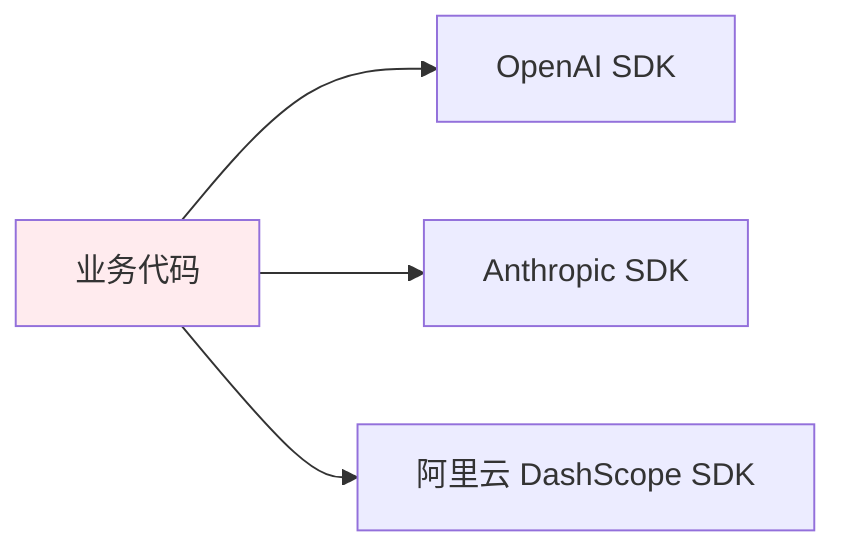
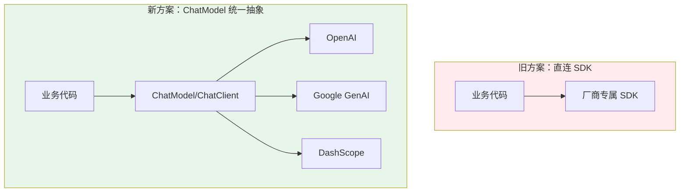
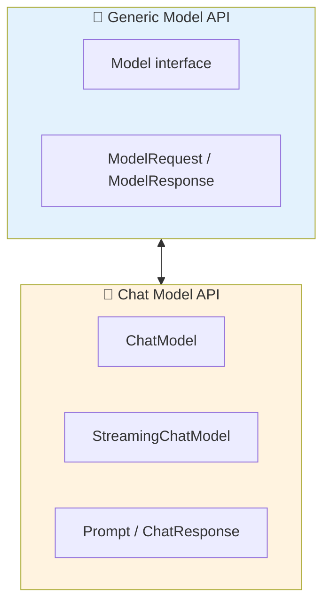
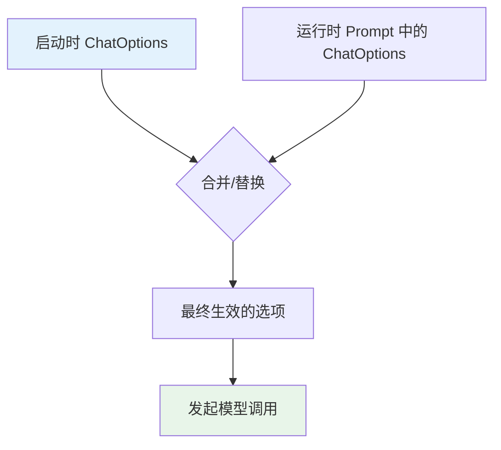
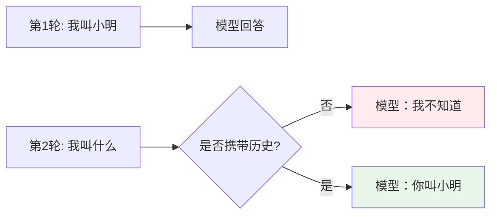
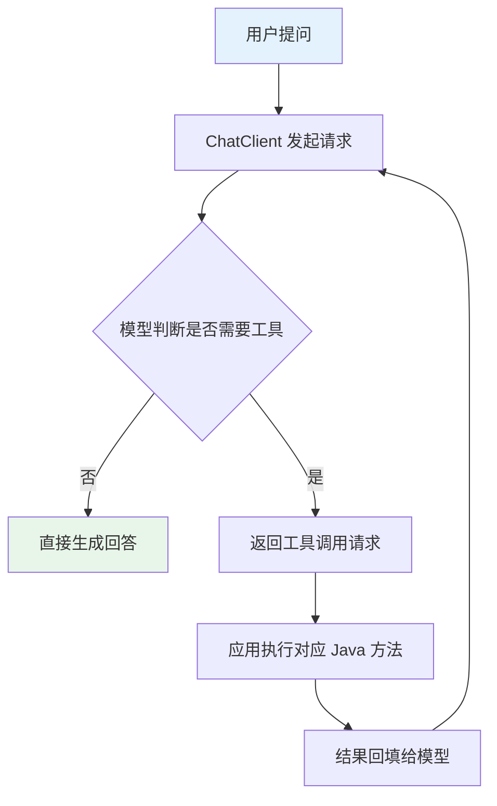
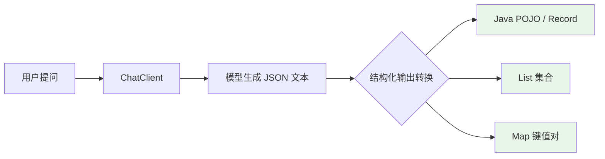

---
# ── 平台推荐标题（人工选用后删除其余）──
title:    Spring AI 2.0 ChatModel 全解析：注入、提示词、多模态与工具调用
category: 后端开发
tags: [Spring AI, ChatModel, Java, 大模型, Tool Calling]
description: Spring AI 2.0 正式发布后 ChatModel 接口如何使用？本文系统讲解多 Bean 注入、系统提示词、多模态、多轮对话与工具调用，附可运行 Java 代码，帮你少踩坑快速上手。
author: smallyoung
date: 2026-07-03
dateModified: 2026-07-03
keywords: [Spring AI 2.0, ChatModel, ChatClient, Tool Calling, 多模态, ChatMemory, Spring Boot AI]
cover: //pub.smallyoung.cn/cdn-cgi/image/quality=60/course_slidev/spring-ai-chatmodel/cover.png
---

> Spring AI 2.0 已于 2026 年 6 月正式 GA，ChatModel 仍是所有大模型交互的底层引擎，但围绕它的依赖注入方式、工具调用循环、多模态输入等细节在 2.0 中都发生了实质性变化。本文用可运行的 Java 代码，把 ChatModel 相关的每一个核心接口和常见场景讲清楚，读完即可直接用于项目。
>
> 📌 **适合人群**：有 Spring Boot 基础、正在或准备用 Spring AI 2.0 做大模型应用开发的 Java 后端工程师


<MindMapFloat title="Spring AI 2.0 ChatModel 知识图谱">

```mindmap-data
# Spring AI 2.0 ChatModel
## 为什么需要统一抽象
- 大模型接口各家不同，切换成本高
- ChatModel 是"发动机"，ChatClient 是"驾驶舱"
- Model<Prompt, ChatResponse> 是所有模型的公共基座
## 核心接口体系
- ChatModel / StreamingChatModel
- Prompt、Message（System/User/Assistant/Tool）
- ChatResponse、Generation、ChatOptions
## 依赖注入方式
- 单模型自动注入 ChatModel/ChatClient
- 多个 ChatModel Bean + @Qualifier/@Primary
- 手动定义第二个 Provider 的 ChatModel Bean
## 提示词与多模态
- SystemMessage/PromptTemplate 动态变量
- Media + UserMessage 实现图片/音频输入
- ChatClient.Builder 的 defaultSystem
## 多轮对话与记忆
- ChatMemory 与 ChatMemoryRepository 分离
- MessageChatMemoryAdvisor vs VectorStoreChatMemoryAdvisor
- 会话隔离 conversationId
## Tool Calling 工具调用
- @Tool 声明式注解
- FunctionToolCallback 函数式
- MethodToolCallback 编程式
- 2.0 的 ToolCallingAdvisor 统一循环
## 结构化输出
- .entity() 直接映射 POJO/Record
- BeanOutputConverter / MapOutputConverter / ListOutputConverter
- useProviderStructuredOutput() + validateSchema()
## 2.0 迁移与陷阱
- 选项合并策略变为替换策略
- PromptChatMemoryAdvisor 被移除
- Jackson 3 包名迁移
```

</MindMapFloat>

## 关于本文档

本文围绕 Spring AI 2.0 中 `ChatModel` 及其配套体系展开，覆盖从底层接口到实战代码的完整链路，帮助你在真实项目中少走弯路。

- ✅ ChatModel / ChatClient / StreamingChatModel 的接口设计与相互关系
- ✅ 单模型与多模型场景下的 4 种依赖注入写法（含 `@Qualifier`、`@Primary`）
- ✅ 系统提示词、`PromptTemplate` 动态参数化的完整用法
- ✅ 图片、音频等多模态输入的 `Media` API 实战
- ✅ 基于 `ChatMemory` 的多轮对话记忆管理三种 Advisor 对比
- ✅ `@Tool` 注解、函数式、编程式三种 Tool Calling 定义方式
- ✅ Spring AI 2.0 相对 1.x 的关键变化与升级注意事项

## 1. 为什么 ChatModel 值得单独搞懂

### 1.1 不用统一抽象会遇到什么问题

如果直接对接各家大模型的原生 SDK，团队很快会遇到三个现实问题：每个供应商的请求体结构不同、返回结构不同、流式协议也不同。业务代码一旦和某个 SDK 深度耦合，后续想换模型或者做多模型路由，几乎要重写整个调用层。



### 1.2 现有方案的核心局限

| 局限 | 具体表现 | 真实案例 |
|------|----------|----------|
| 供应商锁定 | 业务代码直接依赖某厂商 SDK 的请求/响应类型 | 从 OpenAI 切到国产模型需要重写整个 Service 层 |
| 流式处理不统一 | 各家 SSE 协议、chunk 结构不一致 | 前端流式展示逻辑要为每个模型单独适配 |
| 工具调用各自为政 | 1.x 中每个 `ChatModel` 内部各自实现工具调用循环 | 不同模型的工具调用行为存在细微差异，难以统一测试 |

> [!IMPORTANT]
> 现有方案的核心矛盾是：业务只想要"发一条消息、拿到一个回答"，但底层却要求开发者去理解十几种模型各自的 API 细节。

### 1.3 ChatModel 的核心思想

Spring AI 参照 JDBC 对数据库的抽象思路，把不同厂商的大模型统一封装到 `ChatModel` 接口之下。开发者面向接口编程，切换底层模型时业务代码基本不需要改动（注：Spring AI ChatModel API 被设计为与各种 AI 模型交互的简单可移植接口，切换模型时代码变更最小化，参见 Spring AI Alibaba 官方文档）。



## 2. ChatModel 核心接口与整体架构

### 2.1 接口分层概览

Spring AI 先定义了一个与业务无关的 `Generic Model API`，`ChatModel` 是在其基础上针对聊天场景做的具体化实现，这样未来新增图像模型、语音模型时可以复用同一套设计范式。



`ChatModel` 接口本身非常克制，核心只有两个方法：

```java
// ChatModel 是所有聊天模型的统一入口
public interface ChatModel extends Model<Prompt, ChatResponse> {

    // 简化用法：传字符串直接拿字符串回答
    default String call(String message) {
        // 内部会把 message 包装成 Prompt 再调用下面的方法
        ...
    }

    // 标准用法：接收 Prompt，返回结构化的 ChatResponse
    @Override
    ChatResponse call(Prompt prompt);
}
```

流式场景则由 `StreamingChatModel` 负责，返回响应式的 `Flux`：

```java
// 流式接口专门处理逐 token 输出的场景
public interface StreamingChatModel extends StreamingModel<Prompt, ChatResponse> {

    default Flux<String> stream(String message) { ... }

    @Override
    Flux<ChatResponse> stream(Prompt prompt);
}
```

### 2.2 Prompt / Message / ChatResponse 三件套

`Prompt` 封装了一次请求的全部输入：消息列表 + 可选的运行时参数。`Message` 有 4 种角色实现，分别对应对话中不同的发言者。

| 消息类型 | 对应角色 | 典型用途 |
|----------|----------|----------|
| `SystemMessage` | system | 设定人设、规则、回答风格 |
| `UserMessage` | user | 用户输入的问题，可携带多模态 `Media` |
| `AssistantMessage` | assistant | 模型的历史回复，用于多轮对话回放 |
| `ToolResponseMessage` | tool | 工具执行结果，回填给模型继续推理 |

模型返回结果由 `ChatResponse` 承载，其中 `Generation` 表示一次候选输出（可能有多个，如 `n>1`）：

```java
ChatResponse response = chatModel.call(new Prompt("给我讲个 Java 冷笑话"));

// getResult() 取第一个候选输出
String text = response.getResult().getOutput().getContent();

// getMetadata() 可以拿到 token 消耗等元数据（注意返回类型是 Integer，不是 Long）
Integer totalTokens = response.getMetadata().getUsage().getTotalTokens();
```

### 2.3 启动配置与运行时配置的合并流程

每个模型实现都有自己的 `ChatOptions` 子类（如 `OpenAiChatOptions` 包含 `logitBias`、`seed` 等专属参数）。Spring AI 允许在应用启动时设置默认选项，也允许在每次请求时通过 `Prompt` 覆盖，此外还支持通过 `ChatClient` 进行流式配置：



> [!WARNING]
> 2.0.0-RC2 把这一步的策略从"合并"改回了"替换"：运行时只要传了 `ChatOptions`，就会整体替换启动时的默认配置，而不是逐字段合并。升级时如果发现某些默认参数（如 `temperature`）"消失"了，先检查这里。

## 3. 依赖注入方式全解析（含多个 Bean 场景）

这是实战中最容易踩坑的部分：单模型时"注入即用"，一旦项目里出现两个及以上的 `ChatModel`，Spring 容器就会因为候选者过多而报错。

### 3.1 单模型场景：直接注入即可

只要 classpath 下只有一个模型的 Starter（比如只引入了 `spring-ai-starter-model-openai`），Spring Boot 的自动配置会创建唯一的 `ChatModel` Bean 和对应的 `ChatClient.Builder` 原型 Bean，直接注入使用：

```java
@RestController
@RequestMapping("/ai")
public class SimpleAiController {

    // 单模型场景，Spring Boot 已自动配置好，直接注入
    private final ChatModel chatModel;

    public SimpleAiController(ChatModel chatModel) {
        this.chatModel = chatModel;
    }

    @GetMapping("/simple")
    public String simple(@RequestParam String message) {
        // call(String) 是最简写法，内部会自动包装为 Prompt
        return chatModel.call(message);
    }
}
```

如果更偏好使用 `ChatClient` 的链式 API，同样可以直接注入自动配置好的 `ChatClient.Builder`：

```java
@RestController
public class ChatClientController {

    private final ChatClient chatClient;

    // 注入自动配置的 Builder，在构造函数里 build 出可复用的 ChatClient
    public ChatClientController(ChatClient.Builder builder) {
        this.chatClient = builder
                .defaultSystem("你是一位专业的 Java 开发助手")
                .build();
    }

    @GetMapping("/ai/simple")
    public String chat(@RequestParam String message) {
        return chatClient.prompt().user(message).call().content();
    }
}
```

### 3.2 多个 ChatModel Bean：@Qualifier 精确注入

当项目同时接入了多个供应商（例如国内主用阿里云百炼、海外备用 OpenAI），classpath 下会存在多个 `ChatModel` 自动配置 Bean，此时不加限定符注入会直接抛出 `NoUniqueBeanDefinitionException`：

```
No qualifying bean of type 'org.springframework.ai.chat.model.ChatModel'
available: expected single matching bean but found 2
```

推荐的做法是为每个模型分别定义一个 `ChatClient` Bean，再用 `@Qualifier` 精确注入：

```java
@Configuration
public class ChatClientConfig {

    // 基于 OpenAiChatModel 自动配置好的 Bean 创建专属 ChatClient
    @Bean
    public ChatClient openAiChatClient(OpenAiChatModel chatModel) {
        return ChatClient.create(chatModel);
    }

    // 基于 googleGenAiChatClient（google）创建另一个 ChatClient
    @Bean
    public ChatClient googleGenAiChatClient(GoogleGenAiChatModel chatModel) {
        return ChatClient.create(chatModel);
    }
}
```

在业务组件中通过 Bean 名称精确注入：

```java
@Service
public class ModelRouterService {

    private final ChatClient openAiChatClient;
    private final ChatClient googleGenAiChatClient;

    public ModelRouterService(
            @Qualifier("openAiChatClient") ChatClient openAiChatClient,
            @Qualifier("googleGenAiChatClient") ChatClient googleGenAiChatClient) {
        this.openAiChatClient = openAiChatClient;
        this.googleGenAiChatClient = googleGenAiChatClient;
    }

    public String askByProvider(String provider, String message) {
        // 简单的路由逻辑：按需求选择不同模型
        ChatClient target = "openai".equals(provider) ? openAiChatClient : googleGenAiChatClient;
        return target.prompt().user(message).call().content();
    }
}
```

### 3.3 用 @Primary 指定默认模型

如果大多数场景都用同一个模型，只有个别功能需要切换到另一个模型，可以给主模型标记 `@Primary`，这样不写 `@Qualifier` 时会自动注入它：

```java
@Configuration
public class AiConfig {

    // @Primary：没有指定 Qualifier 时优先注入这个 ChatClient
    @Bean
    @Primary
    public ChatClient chatClient(ChatClient.Builder builder) {
        return builder.defaultSystem("You are a helpful assistant.").build();
    }

    // 专属场景使用的第二个 ChatClient，集中配置工具和顾问
    @Bean
    public ChatClient weatherChatClient(ChatClient.Builder builder) {
        return builder
                .defaultSystem("你是一个专业的气象助手。")
                .defaultTools(new WeatherTool())
                .build();
    }
}
```

### 3.4 同一供应商配置多个模型实例

有时需要给同一家供应商配置多个模型（比如主模型 + 兜底模型），Spring AI 的自动配置每个供应商只会生成一个 `ChatModel` Bean，额外的模型需要手动定义：

```java
@Configuration
public class MultiModelConfig {

    /**
     * 手动构造第二个 OpenAI 模型的 ChatModel（同一 API Key，不同模型规格）。
     *
     * Spring AI 2.0 中，通过 OpenAiChatOptions 传入 apiKey / model，
     * OpenAiChatModel 内部会基于 Options 字段自动构造专属的 OpenAIClient，
     * 无需手动 new OpenAIClient，也不依赖任何内部工具类。
     */
    @Bean
    public ChatModel secondaryChatModel(
            @Value("${spring.ai.openai.api-key}") String apiKey,
            @Value("${SECONDARY_LLM}") String secondaryModelName) {

        OpenAiChatOptions options = OpenAiChatOptions.builder()
                .apiKey(apiKey)           // 指定 API Key，框架据此创建专属客户端
                .model(secondaryModelName) // 指定模型名称，例如 "gpt-4o-mini"
                .build();

        return OpenAiChatModel.builder()
                .options(options)
                .build();
    }

    @Bean
    public ChatClient secondaryChatClient(@Qualifier("secondaryChatModel") ChatModel chatModel) {
        return ChatClient.create(chatModel);
    }
}
```


### 3.5 四种注入方式对比

| 场景 | 推荐方式 | 关键注解 | 适用情况 |
|------|----------|----------|----------|
| 单模型 | 直接注入 `ChatModel`/`ChatClient.Builder` | 无 | 项目只接一家模型 |
| 多供应商 | 每模型一个 `ChatClient` Bean | `@Qualifier` | 需要按业务路由到不同厂商 |
| 主备模型 | 主模型标记默认 | `@Primary` | 大多数代码用同一模型，个别场景切换 |
| 同厂商多实例 | 手动构造 `ChatModel` | `@Bean` + 复用 Options | 需要同一供应商下的多个模型规格 |

> [!TIP]
> 团队协作中建议把 `ChatClient` 的 Bean 名称和业务语义绑定（如 `weatherChatClient`、`customerServiceChatClient`），而不是用 `chatClient1`、`chatClient2` 这类无意义命名，`@Qualifier` 报错信息也会更易读。

## 4. 系统提示词与 Prompt 模板

### 4.1 三种设置系统提示词的方式

系统提示词（System Prompt）用来设定模型的人设、边界和输出规则，是提示工程中最基础也最重要的一环。

```java
// 方式一：ChatClient.Builder 设置全局默认系统提示词
ChatClient chatClient = ChatClient.builder(chatModel)
        .defaultSystem("你是一位专业的 Java 开发助手，擅长使用 Spring 框架")
        .build();

// 方式二：单次请求内联设置系统提示词
String answer = chatClient.prompt()
        .system("请用简洁的语言回答，不超过 100 字")
        .user("什么是依赖注入？")
        .call()
        .content();

// 方式三：使用 Message 对象手动组装 Prompt
Message systemMessage = new SystemMessage("你是一名严谨的技术评审员");
Message userMessage = new UserMessage("评审这段代码是否有并发问题");
Prompt prompt = new Prompt(List.of(systemMessage, userMessage));
ChatResponse response = chatModel.call(prompt);
```

### 4.2 用 PromptTemplate 做动态参数化

当系统提示词或用户提示词需要根据运行时变量变化时，用 `PromptTemplate`（或专用的 `SystemPromptTemplate`）比字符串拼接更安全、更易维护：

```java
// {voice} 是占位符，运行时才决定用什么语气回答
String systemText = """
        You are a helpful AI assistant that helps people find information.
        Your name is {name}
        You should reply to the user's request in the style of a {voice}.
        """;

SystemPromptTemplate systemPromptTemplate = new SystemPromptTemplate(systemText);
Message systemMessage = systemPromptTemplate.createMessage(
        Map.of("name", "小艾", "voice", "海盗"));

Prompt prompt = new Prompt(List.of(systemMessage, new UserMessage("介绍一下你自己")));
ChatResponse response = chatModel.call(prompt);
```

`ChatClient` 也支持在 `system()` 方法里直接传参数化模板，写法更紧凑：

```java
// defaultSystem 里预留了 {voice} 占位符
ChatClient chatClient = ChatClient.builder(chatModel)
        .defaultSystem("You are a friendly chat bot that answers in the voice of a {voice}")
        .build();

// 每次请求时动态填充 voice 参数
String result = chatClient.prompt()
        .system(sp -> sp.param("voice", "幽默的段子手"))
        .user("讲个程序员笑话")
        .call()
        .content();
```

### 4.3 模板变量分隔符冲突的处理

`PromptTemplate` 默认使用 `{}` 作为占位符语法，如果提示词内容本身就包含 JSON（大量花括号），会与模板语法冲突。此时可以自定义分隔符：

> [!IMPORTANT]
> `StTemplateRenderer` 位于独立模块 `spring-ai-template-st`，需要额外引入依赖，否则编译时会报 `ClassNotFoundException`：
> ```xml
> <dependency>
>     <groupId>org.springframework.ai</groupId>
>     <artifactId>spring-ai-template-st</artifactId>
> </dependency>
> ```

```java
// 把默认的 {} 换成 <>，避免和提示词里的 JSON 花括号冲突
String answer = ChatClient.create(chatModel).prompt()
        .user(u -> u.text("Tell me the names of 5 movies whose soundtrack was composed by <composer>")
                .param("composer", "John Williams"))
        .templateRenderer(StTemplateRenderer.builder()
                .startDelimiterToken('<')
                .endDelimiterToken('>')
                .build())
        .call()
        .content();
```

> [!NOTE]
> `TemplateRenderer` 底层默认基于 StringTemplate（ST4）引擎实现变量替换，这是 Spring AI Prompt 模板体系的技术基础，也是官方文档中反复强调的"可替换"扩展点（注：`TemplateRenderer` 默认基于开源 StringTemplate 引擎实现变量渲染，支持自定义分隔符，参见 Spring AI 官方 Prompts 文档）。

## 5. 多模态输入：让 ChatModel "看懂"图片和音频

### 5.1 Media 类型是多模态的核心抽象

多模态大模型（如 GPT-4o、Gemini 系列、通义千问-VL）能同时理解文本与图像等信息。Spring AI 通过在 `UserMessage` 上新增 `media` 字段来承载这些非文本内容，`Media` 类型内部结合了 Spring 的 `MimeType` 与 `Resource` 抽象来描述附件的类型和数据来源（注：`Media` 类型结合 `org.springframework.util.MimeType` 与 `org.springframework.core.io.Resource` 描述多模态附件，参见 Spring AI 多模态 API 文档）。

> [!NOTE]
> `media` 字段只对 `UserMessage`（用户输入）有效，`SystemMessage` 不支持携带媒体；`AssistantMessage`（模型返回）目前也只提供纯文本内容，若要生成图片/语音等非文本输出，需要使用专门的 `ImageModel`/`AudioModel`。

### 5.2 图片理解实战

```java
@RestController
@RequestMapping("/ai")
public class MultiModalController {

    private final ChatClient chatClient;

    public MultiModalController(ChatClient.Builder builder) {
        this.chatClient = builder.build();
    }

    @GetMapping("/vision")
    public String explainImage() {
        // 从 classpath 加载图片资源
        Resource imageResource = new ClassPathResource("/static/image/product.png");

        return chatClient.prompt()
                .user(u -> u.text("请描述这张图片中的商品，并给出适合电商标题的关键词")
                        // 指定图片的 MimeType 和资源来源
                        .media(MimeTypeUtils.IMAGE_PNG, imageResource))
                .call()
                .content();
    }
}
```

也可以直接使用图片 URL，无需先下载到本地：

```java
// 使用远程图片 URL 作为多模态输入
UserMessage userMessage = UserMessage.builder()
        .text("这张图片里有几只香蕉？")
        .media(new Media(MimeTypeUtils.IMAGE_PNG,
                URI.create("https://example.com/fruit-bowl.png")))
        .build();

ChatResponse response = chatModel.call(new Prompt(userMessage));
```

### 5.3 音频输入实战

部分模型（如 `gpt-4o-audio-preview`）支持直接接收音频文件并结合文本一起推理：

```java
// 加载本地音频文件作为多模态输入
Resource audioResource = new ClassPathResource("speech1.mp3");

UserMessage userMessage = new UserMessage(
        "这段录音在讲什么内容？请总结成 3 个要点",
        // 注意：MP3 的标准 MIME 类型是 audio/mpeg（RFC 3003），而非非标准写法 audio/mp3
        List.of(new Media(MimeTypeUtils.parseMimeType("audio/mpeg"), audioResource)));

// Spring AI 2.0 已移除 OpenAiApi 类，使用字符串指定模型名
ChatResponse response = chatModel.call(new Prompt(
        List.of(userMessage),
        OpenAiChatOptions.builder().model("gpt-4o-audio-preview").build()));
```

### 5.4 常见多模态模型能力对比

| 模型 | 流式支持 | 多模态支持 | 工具调用支持 |
|------|----------|------------|--------------|
| OpenAI GPT-4o 系列 | ✅ | ✅（图像/音频） | ✅ |
| Google GenAI Gemini 系列 | ✅ | ✅（图像/视频/音频） | ✅ |
| Ollama 本地模型 | ✅ | ✅（视模型而定） | ✅ |
| Hugging Face | ❌ | 视具体模型而定 | 视具体模型而定 |

> [!WARNING]
> 并不是所有模型都支持多模态输入。用纯文本模型（如部分 `qwen-plus` 系列）接收图片请求，通常会直接报错或静默忽略图片内容，调用前务必确认所选模型的多模态能力清单。

## 6. 多轮对话与记忆管理

### 6.1 为什么大模型天生"没有记忆"

大模型的推理本质上是无状态的：每次调用只基于当前请求中的消息列表进行推理，不会自动记住上一轮说过什么。要实现连续对话，必须由应用层把历史消息重新拼接进请求。



### 6.2 手动维护历史消息

最基础的做法是自己在 Service 层维护一个消息列表：

```java
@Service
public class ManualMemoryChatService {

    private final ChatClient chatClient;
    // 简化示例：实际生产环境应按会话 ID 隔离并落库/落缓存
    private final Map<String, List<Message>> sessionHistory = new ConcurrentHashMap<>();

    public ManualMemoryChatService(ChatClient.Builder builder) {
        this.chatClient = builder.build();
    }

    public String chat(String sessionId, String userInput) {
        List<Message> history = sessionHistory.computeIfAbsent(sessionId, k -> new ArrayList<>());

        // 把新的用户消息加入历史
        history.add(new UserMessage(userInput));

        // 把完整历史一并发给模型
        ChatResponse response = chatClient.prompt(new Prompt(history)).call().chatResponse();
        Message assistantMessage = response.getResult().getOutput();

        // 把模型的回复也存入历史，供下一轮使用
        history.add(assistantMessage);
        return assistantMessage.getText();
    }
}
```

### 6.3 用 ChatMemory + Advisor 自动管理记忆

Spring AI 把"存储"和"注入方式"拆成了两个概念：`ChatMemoryRepository` 负责持久化存储（内存、JDBC、Cassandra、Neo4j 等实现），`ChatMemory` 在其之上做窗口管理，`ChatMemoryAdvisor` 则负责在每次请求前自动把历史注入 Prompt。

```java
@Configuration
public class ChatMemoryConfig {

    // 存储实现：这里用内存版，生产环境建议换成 JDBC 或 Redis
    @Bean
    public ChatMemoryRepository chatMemoryRepository() {
        return new InMemoryChatMemoryRepository();
    }

    // 窗口管理：只保留最近 20 条消息，超出后自动淘汰旧消息
    @Bean
    public ChatMemory chatMemory(ChatMemoryRepository repository) {
        return MessageWindowChatMemory.builder()
                .chatMemoryRepository(repository)
                .maxMessages(20)
                .build();
    }

    // 把记忆能力以 Advisor 形式挂载到 ChatClient 上
    @Bean
    public ChatClient memoryChatClient(ChatClient.Builder builder, ChatMemory chatMemory) {
        return builder
                .defaultAdvisors(MessageChatMemoryAdvisor.builder(chatMemory).build())
                .build();
    }
}
```

调用时通过 `conversationId` 区分不同会话，实现多用户互不干扰：

```java
@RestController
@RequestMapping("/ai")
public class MemoryController {

    private final ChatClient chatClient;

    public MemoryController(ChatClient memoryChatClient) {
        this.chatClient = memoryChatClient;
    }

    @GetMapping("/chat")
    public String chat(@RequestParam String sessionId, @RequestParam String message) {
        return chatClient.prompt()
                // 通过 conversationId 区分不同用户/会话的历史
                .advisors(a -> a.param(ChatMemory.CONVERSATION_ID, sessionId))
                .user(message)
                .call()
                .content();
    }
}
```

### 6.4 三种记忆 Advisor 对比

| Advisor | 注入方式 | 优点 | 适用场景 |
|---------|----------|------|----------|
| `MessageChatMemoryAdvisor` | 历史以完整消息列表形式加入 Prompt | 保留原始对话结构，模型理解上下文更准确 | 绝大多数常规多轮对话场景，官方推荐首选 |
| `PromptChatMemoryAdvisor` | 历史拼接成文本塞入系统提示词 | 实现简单，不额外消耗消息条数 | 早期版本的轻量场景（**2.0 GA 已移除该 Advisor**） |
| `VectorStoreChatMemoryAdvisor` | 基于向量库检索相关历史片段 | 支持超长会话的语义检索式召回 | 客服知识库、长期陪伴类应用等历史极长的场景 |

> [!CAUTION]
> `PromptChatMemoryAdvisor` 已在 Spring AI 2.0.0 GA 中被移除，1.x 项目升级到 2.0 时如果用到它，需要迁移为 `MessageChatMemoryAdvisor` 或自定义实现，否则编译会直接失败。

> [!WARNING]
> **JDBC 存储用户注意**：若使用 `JdbcChatMemoryRepository`，从 1.x 升级到 2.0 时必须对数据库表执行 Schema 变更——2.0 在 `SPRING_AI_CHAT_MEMORY` 表中新增了 `sequence_id BIGINT` 列来保证消息顺序的可靠性（旧版依赖 `timestamp` 精度不足，在 MySQL/MariaDB 等数据库上存在排序混乱问题）。如果使用 Flyway/Liquibase 管理迁移，需将 `spring.ai.chat.memory.repository.jdbc.initialize-schema` 设置为 `never` 并手动执行 `ALTER TABLE` 语句。

## 7. Tool Calling：让模型调用真实业务逻辑

### 7.1 工具调用的基本流程

工具调用（Function Calling / Tool Calling）让大模型可以"请求"应用执行一个具体方法（查天气、查库存、下单等），再把结果回填给模型继续生成最终回答。



### 7.2 声明式：@Tool 注解（首选方式）

最简单也是官方推荐的方式，直接在方法上加 `@Tool` 注解：

```java
@Component
public class WeatherTools {

    // description 至关重要，模型靠它判断何时该调用这个方法
    @Tool(description = "查询指定城市的当前天气")
    public String getCurrentWeather(
            @ToolParam(description = "城市名称，例如：北京") String city) {
        // 真实场景这里应调用天气服务 API
        return "北京当前晴，气温 26 摄氏度";
    }
}
```

在 `ChatClient` 中注册工具类实例即可：

```java
@RestController
public class ToolCallingController {

    private final ChatClient chatClient;
    private final WeatherTools weatherTools;

    public ToolCallingController(ChatClient.Builder builder, WeatherTools weatherTools) {
        this.weatherTools = weatherTools;
        // defaultTools 注册为默认工具，所有请求都可用
        this.chatClient = builder.defaultTools(weatherTools).build();
    }

    @GetMapping("/ai/weather")
    public String ask(@RequestParam String question) {
        return chatClient.prompt().user(question).call().content();
    }
}
```

### 7.3 函数式：FunctionToolCallback

不想引入注解，或者工具逻辑已经是标准 `Function` 接口实现时，可以用 `FunctionToolCallback` 包装：

```java
// 定义输入输出的强类型 record
record WeatherRequest(String city, String unit) {}
record WeatherResponse(double temperature, String unit) {}

// 用标准 JDK 函数式接口实现业务逻辑
class WeatherService implements Function<WeatherRequest, WeatherResponse> {
    @Override
    public WeatherResponse apply(WeatherRequest request) {
        return new WeatherResponse(25.5, request.unit());
    }
}

// 将 Function 包装为 ToolCallback
ToolCallback weatherTool = FunctionToolCallback.builder("currentWeather", new WeatherService())
        .description("获取指定城市的实时天气")
        .inputType(WeatherRequest.class)
        .build();

String result = chatClient.prompt()
        .user("长沙今天天气怎么样？")
        .tools(weatherTool)
        .call()
        .content();
```

### 7.4 编程式：MethodToolCallback

需要对工具的元数据（名称、Schema）做精细控制时，可以绕过注解直接构造 `MethodToolCallback`：

```java
Method method = ReflectionUtils.findMethod(CalcTools.class, "add", int.class, int.class);

ToolDefinition definition = ToolDefinition.builder()
        .name("add")
        .description("计算两个整数的和")
        .inputSchema("""
                {
                  "type": "object",
                  "properties": {
                    "a": {"type": "integer", "description": "第一个数字"},
                    "b": {"type": "integer", "description": "第二个数字"}
                  },
                  "required": ["a", "b"]
                }
                """)
        .build();

ToolCallback callback = MethodToolCallback.builder()
        .toolDefinition(definition)
        .toolMethod(method)
        .toolObject(new CalcTools())
        .build();

String content = chatClient.prompt()
        .user("100 加 1000 等于多少？")
        .tools(callback)
        .call()
        .content();
```

### 7.5 三种工具定义方式对比

| 方式 | 代码量 | 灵活性 | 适合场景 |
|------|--------|--------|----------|
| `@Tool` 声明式注解 | ⭐ 最少 | ⭐⭐⭐ | 常规业务方法直接暴露给模型，官方首选 |
| `FunctionToolCallback` 函数式 | ⭐⭐ | ⭐⭐⭐⭐ | 已有 `Function`/`Supplier` 实现，或需要动态构造工具 |
| `MethodToolCallback` 编程式 | ⭐⭐⭐⭐ | ⭐⭐⭐⭐⭐ | 需要自定义 Schema、结果转换器等底层细节 |

### 7.6 Spring AI 2.0 的工具调用循环重构

1.x 中每个 `ChatModel` 实现内部各自维护自己的工具调用循环，不同模型之间行为存在细微差异。2.0 把这一循环统一收敛到 `ChatClient` 的 Advisor 链中，由框架自动注册的 `ToolCallingAdvisor` 驱动完整的"调用—执行—回填"往返流程，开发者不再需要关心某个具体模型内部是怎么跑循环的（注：Spring AI 2.0 将工具调用循环统一收敛到 `ChatClient` 的 Advisor 链中，由自动注册的 `ToolCallingAdvisor` 驱动完整往返流程，参见腾讯云开发者社区《Spring AI 2.0 正式发布：Java 程序员必须关注的 8 个升级清单》）。

```java
// 2.0 中默认即可完整闭环，无需手动处理工具调用往返
String answer = chatClient.prompt()
        .user("帮我查一下上海天气，并换算成华氏度")
        .tools(new WeatherTools())
        .call()
        .content();
```

如果工具数量很多（比如超过 20 个），一次性把所有工具描述塞进 Prompt 会显著推高 token 消耗。2.0 新增的 `ToolSearchToolAdvisor` 把"全量塞入"改成了"按需检索"——它依赖向量库对工具描述做语义索引，每次请求时只取最相关的若干个工具下发给模型。

使用前需额外引入 `spring-ai-tool-search-tool` 依赖并配置 `VectorStore`：

```java
@Configuration
public class ToolSearchConfig {

    // 基于向量库对工具描述做语义索引
    @Bean
    public ToolIndex vectorToolIndex(VectorStore vectorStore) {
        return new VectorToolIndex(vectorStore);
    }

    @Bean
    public ToolSearchToolAdvisor toolSearchToolAdvisor(ToolIndex toolIndex) {
        return ToolSearchToolAdvisor.builder()
                .toolSearcher(toolIndex)
                .build();
    }
}

// 将 Advisor 挂载到 ChatClient，不再需要手动传入所有工具
@Bean
public ChatClient chatClient(ChatClient.Builder builder, ToolSearchToolAdvisor advisor) {
    return builder.defaultAdvisors(advisor).build();
}
```

> [!TIP]
> 工具数量较多的 Agent 类应用强烈建议接入 `ToolSearchToolAdvisor`，它是 2.0 版本针对"工具爆炸导致 Prompt 过长"问题给出的官方解法。实测可减少 60–90% 的工具相关 token 消耗。

## 8. 结构化输出：让模型直接返回 Java 对象

### 8.1 为什么需要结构化输出

大模型的原始输出是自由文本，但业务代码往往需要的是强类型对象（如订单信息、用户档案、分析报表）。如果每次都靠手写正则或 JSON 解析来处理模型回包，既脆弱又费时。Spring AI 提供了一套结构化输出机制，能把这个过程收敛到框架层。



### 8.2 .entity()：最简单的映射方式

`ChatClient` 的 `.entity()` 方法是官方推荐的首选入口，框架会自动完成 JSON Schema 生成、Prompt 扩充和反序列化三步，开发者只需要定义好目标类型：

```java
// 定义目标 Record（Java 16+），用于接收模型返回的结构化数据
record ActorFilms(String actor, List<String> movies) {}

// 方式一：映射到单个 POJO / Record
ActorFilms result = chatClient.prompt()
        .user("生成一位随机演员的代表作品列表")
        .call()
        .entity(ActorFilms.class);

System.out.println(result.actor());  // 例如："周润发"
System.out.println(result.movies()); // 例如：["英雄本色", "赌神", ...]
```

如果需要返回多条记录，用 `ParameterizedTypeReference` 指定泛型集合类型：

```java
// 方式二：映射到泛型集合
List<ActorFilms> films = chatClient.prompt()
        .user("分别生成三位不同演员的代表作品列表")
        .call()
        .entity(new ParameterizedTypeReference<List<ActorFilms>>() {});
```

### 8.3 2.0 新增的可靠性增强

Spring AI 2.0 对 `.entity()` 方法新增了两个可组合使用的增强选项，专门应对模型输出不稳定的场景：

```java
ActorFilms result = chatClient.prompt()
        .user("生成一位随机演员的代表作品列表")
        .call()
        .entity(ActorFilms.class, spec -> spec
                // 启用模型原生结构化输出（需模型 API 本身支持该能力）
                .useProviderStructuredOutput()
                // 启用 Schema 校验：输出不符合则自动重试，默认最多重试 3 次
                .validateSchema());
```

| 增强选项 | 作用 | 适用场景 |
|---------|------|----------|
| `useProviderStructuredOutput()` | 调用模型原生 API 的结构化输出能力（如 OpenAI 的 `response_format`），而非仅靠 Prompt 引导 | 对输出格式要求严格、模型支持原生结构化输出时 |
| `validateSchema()` | 输出与 Schema 不符时将错误信息回填给模型重试 | 模型时常输出多余文本或漏字段时的保底兜底 |

> [!TIP]
> 两个选项可以同时启用，形成双重保障：先用原生结构化输出降低出错概率，再用 Schema 校验兜底。但每次重试都会额外消耗 token，不宜对实时性要求高的接口无脑开启。

### 8.4 低层 Converter：BeanOutputConverter、MapOutputConverter、ListOutputConverter

如果你使用的是底层 `ChatModel` API，或者需要对转换过程做精细控制，可以直接使用各种 `StructuredOutputConverter`。

**`BeanOutputConverter`**：最常用，用于将模型输出映射为任意 Java 类：

```java
// 自动根据 ActorFilms 的字段生成 JSON Schema，并将其注入提示词
BeanOutputConverter<ActorFilms> converter = new BeanOutputConverter<>(ActorFilms.class);

// getFormat() 返回需要追加到提示词中的格式指令
String formatInstructions = converter.getFormat();

PromptTemplate template = new PromptTemplate(
        "生成演员 {actor} 的代表作品列表。{format}",
        Map.of("actor", "成龙", "format", formatInstructions));

Generation generation = chatModel.call(template.create()).getResult();

// convert() 负责把模型返回的 JSON 字符串反序列化为 Java 对象
ActorFilms actorFilms = converter.convert(generation.getOutput().getContent());
```

**`MapOutputConverter`** 和 **`ListOutputConverter`**：适合无法预先定义 POJO 的场景：

```java
// MapOutputConverter：让模型返回 JSON 键值对，解析为 Map
Map<String, Object> info = ChatClient.create(chatModel).prompt()
        .user("以 JSON 格式提供法国的首都和人口")
        .call()
        .entity(new MapOutputConverter());
// 结果形如：{"首都": "巴黎", "人口": 67000000}

// ListOutputConverter：让模型返回逗号分隔的列表，解析为 List
var listConverter = new ListOutputConverter(new DefaultConversionService());
List<String> flavors = ChatClient.create(chatModel).prompt()
        .user(u -> u.text("列出 5 种 {subject}")
                .param("subject", "冰淇淋口味"))
        .call()
        .entity(listConverter);
```

### 8.5 三种 Converter 对比

| Converter | 输出格式 | 适用场景 | 是否支持 2.0 增强 |
|-----------|---------|----------|-----------------|
| `BeanOutputConverter` | 完整 JSON 对象 | 有明确 POJO 定义的业务实体 | ✅（实现了 `getJsonSchema()`） |
| `MapOutputConverter` | JSON 键值对 | 字段动态、不需要固定类型 | ✅ |
| `ListOutputConverter` | 逗号分隔列表 | 简单列表枚举，无嵌套结构 | ⚠️（格式较简单，建议优先使用 `.entity(new ParameterizedTypeReference<List<String>>() {})` 代替） |

> [!NOTE]
> 优先选择 `.entity()` 方式（ChatClient 的高层 API），它会自动帮你选择合适的 Converter 并处理 Prompt 扩充；只有在使用底层 `ChatModel` 或需要高度自定义转换逻辑时，才需要手动操作 Converter。

## 9. Spring AI 2.0 相较 1.x 的关键变化

### 9.1 版本升级速览

Spring AI 2.0.0 GA 于 2026 年 6 月 12 日正式发布，距离首个里程碑版本（2025 年 12 月 11 日）历时半年，期间共发布 8 个 Milestone 和 2 个 RC 版本。它硬依赖 Spring Boot 4.1，同时把 MCP SDK 升级到了 2.0，最低支持 Java 17（推荐 21）。

| 变化项 | 1.x 行为 | 2.0 行为 |
|--------|----------|----------|
| 工具调用循环 | 各 `ChatModel` 内部各自实现 | 统一由 `ChatClient` 的 `ToolCallingAdvisor` 驱动 |
| 启动/运行时选项 | 合并策略（运行时逐字段覆盖） | 替换策略（运行时整体替换默认选项） |
| `PromptChatMemoryAdvisor` | 可用 | 已移除，需迁移到 `MessageChatMemoryAdvisor` |
| JSON 库 | Jackson 2 | Jackson 3（涉及包名迁移） |
| 空安全 | 无统一规范 | 引入 `JSpecify` 空安全注解 |

### 9.2 从 1.x 升级到 2.0 的注意事项

> [!WARNING]
> 升级前建议重点自查三处：`options` 相关的 setter 方法是否被删除、`PromptChatMemoryAdvisor` 的使用是否需要替换、自定义的 `MiniMaxChatModel` 等第三方模型实现是否有新的替代方案。这些是社区反馈的高频迁移痛点。

由于 Spring Boot 3.5 / Spring Framework 6.2 已进入生命周期终点，继续停留在 Spring AI 1.1.x 意味着无法获得后续安全更新，因此对生产项目而言，升级到 2.0 GA 基本是必选项而非可选项。

## 10. 最佳实践与常见问题

### 10.1 依赖注入的常见坑

```java
// ❌ 错误：多模型场景下裸注入，容器无法确定用哪个 Bean
@Autowired
private ChatModel chatModel;

// ✅ 正确：明确指定 Qualifier，意图清晰、编译期可追溯
@Autowired
@Qualifier("dashScopeChatModel")
private ChatModel chatModel;
```

### 10.2 常见问题排查表

| 问题 | 原因 | 解决方案 |
|------|------|----------|
| `NoUniqueBeanDefinitionException` | 项目中存在多个 `ChatModel` 实现 Bean | 用 `@Qualifier` 精确指定，或给主模型加 `@Primary` |
| 多模态请求报错或被忽略 | 所选模型不支持该模态输入 | 调用前确认模型能力清单，切换到支持多模态的模型 |
| 多轮对话模型"失忆" | 未接入 `ChatMemory`，或忘记传 `conversationId` | 挂载 `MessageChatMemoryAdvisor` 并统一传递会话 ID |
| 工具没有被模型调用 | `@Tool` 的 `description` 描述不够清晰 | 用更具体的自然语言描述工具的用途和触发条件 |
| 升级 2.0 后默认参数"消失" | 选项合并策略变为替换策略 | 运行时 `ChatOptions` 需要显式携带所有需要生效的字段 |

> [!WARNING]
> 工具方法的返回值最终会被序列化后再发回模型，避免在工具方法里返回过大的对象（如完整数据库记录集），否则会显著推高单次调用的 token 消耗和延迟。

## 11. 总结

| 核心概念 | 一句话解释 |
|---------|-----------|
| `ChatModel` | 面向各家大模型的统一底层接口，只有 `call`/`stream` 两类核心方法 |
| `ChatClient` | 基于 `ChatModel` 封装的链式 Fluent API，日常开发首选入口 |
| `@Qualifier`/`@Primary` | 多个 `ChatModel`/`ChatClient` Bean 共存时的精确注入手段 |
| `Media` | 多模态输入的统一载体，结合 `MimeType` 与 `Resource` 描述附件 |
| `ChatMemory` | 多轮对话记忆的存储与窗口管理抽象，配合 Advisor 自动注入历史 |
| `ToolCallback` | 工具调用的最小单元，支持注解、函数式、编程式三种构造方式 |
| `BeanOutputConverter` | 结构化输出的核心转换器，自动生成 JSON Schema 并将模型输出反序列化为 Java 对象 |

> [!TIP]
> **学习路径建议**：
> 1. 先用单模型场景把 `ChatClient` 的基础问答、系统提示词跑通
> 2. 再引入 `ChatMemory` 实现多轮对话，理解 Advisor 链的执行顺序
> 3. 接入 `@Tool` 工具调用，把业务方法暴露给模型
> 4. 有多模型/多模态需求后，再回头处理 `@Qualifier` 注入和 `Media` 输入
> 5. 用 `.entity()` 结构化输出把模型回包直接映射为 Java 对象，消除手写解析的脆弱性
> 6. 项目升级到 2.0 前，先对照第 9 章的变化清单逐项自查

## 12. 参考资料

### 权威文档

| 文档 | 来源 | 主要内容 |
|------|------|----------|
| [聊天模型 API](https://docs.spring.io/spring-ai/reference/api/chatmodel.html) | Spring 官方文档 | `ChatModel`/`StreamingChatModel` 接口设计 |
| [Tool Calling](https://docs.spring.io/spring-ai/reference/api/tools.html) | Spring 官方文档 | `ToolCallback` 体系与三种工具定义方式 |
| [多模态 API](https://docs.springjava.cn/spring-ai/reference/api/multimodality.html) | Spring AI 参考文档镜像 | `Media` 类型与多模态输入用法 |
| [结构化输出](https://docs.spring.io/spring-ai/reference/api/structured-output-converter.html) | Spring 官方文档 | `BeanOutputConverter` 及 `.entity()` 方法全解 |

### 推荐资源

- [Spring AI 2.x 全面指南：架构升级、高效的工具调用、多模型生态与实战示例](https://www.cnblogs.com/yangykaifa/p/19745500)
- [如何在 Spring AI 中配置多个 LLM 客户端](https://didispace.com/posts/451)
- [Spring AI 聊天记忆功能实战：从接口设计到生产实践](https://www.cnblogs.com/cyanty/p/18935807)
