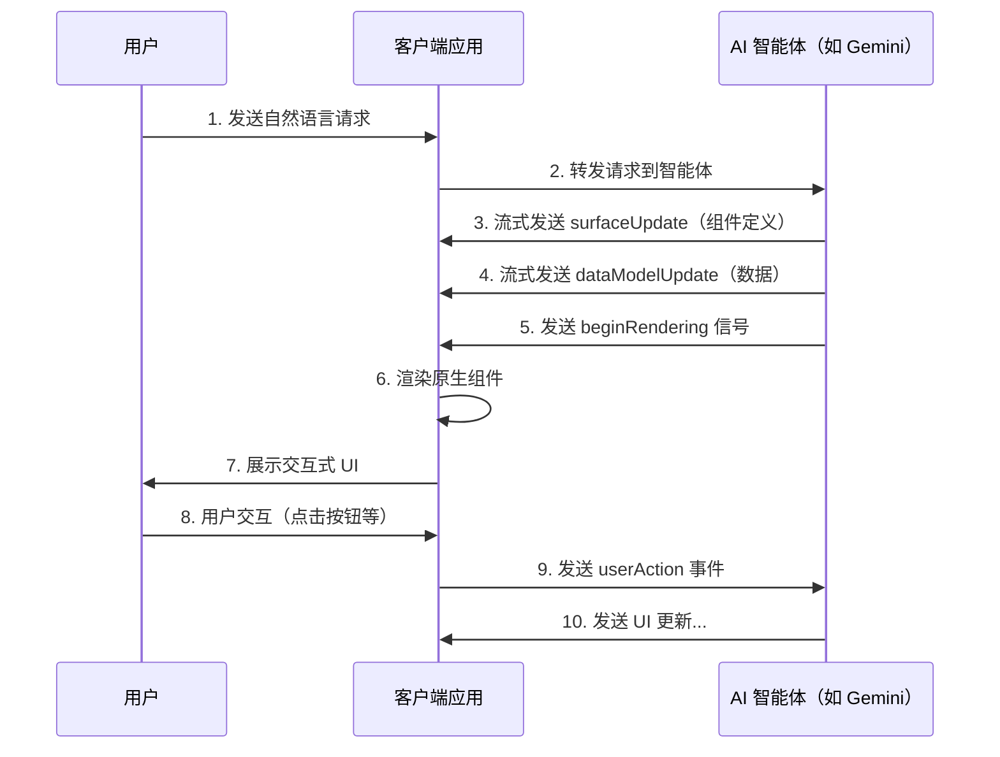
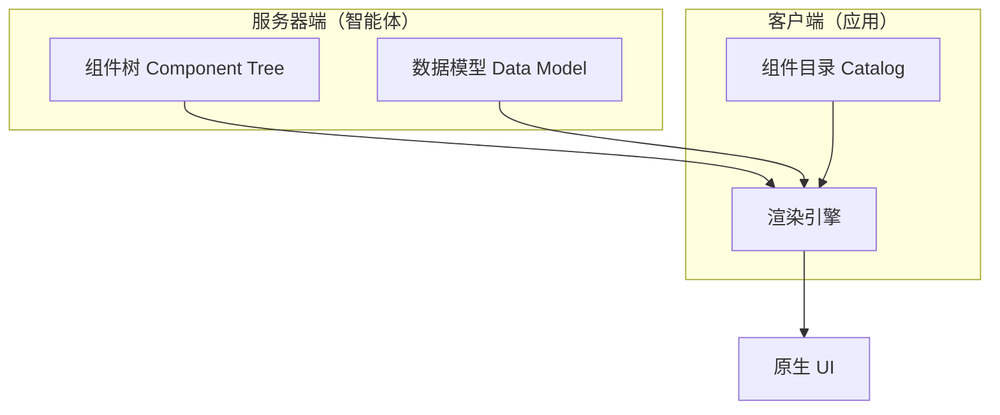
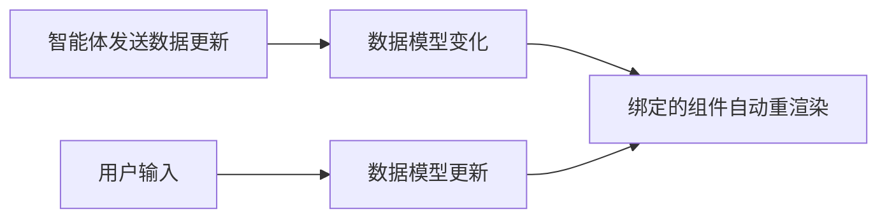
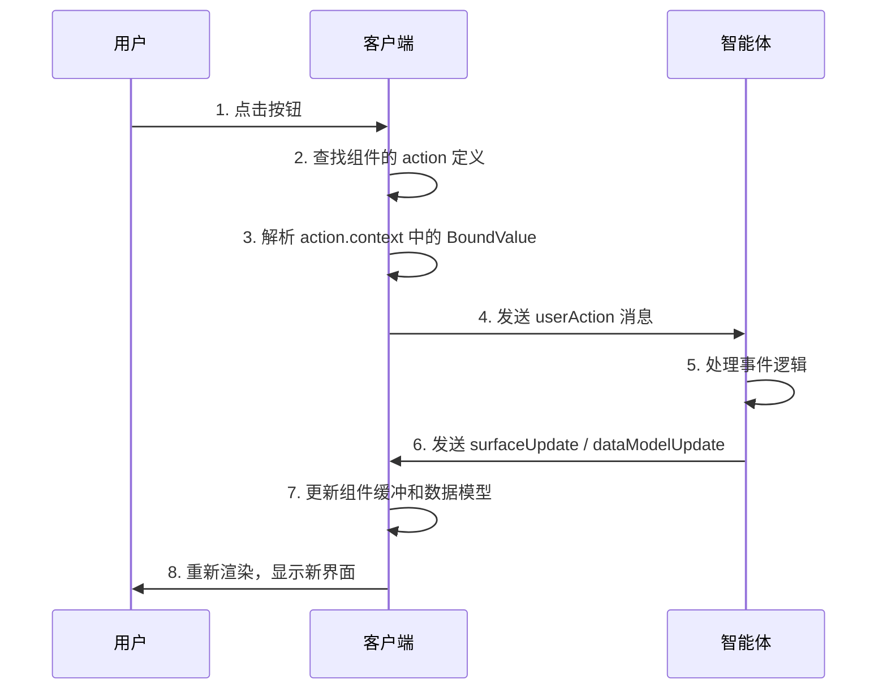

# A2UI 协议完全指南 | Google AI智能体界面协议教程

> **A2UI (Agent to UI)** 是由 Google 创建的声明式 UI 协议，用于智能体驱动的界面。它允许 AI 智能体生成丰富的、交互式的用户界面，这些界面可以在 Web、移动端和桌面等不同平台上以原生方式渲染，而无需执行任意代码。
> 
> 📌 **Demo演示地址**: https://a2ui.smallyoung.cn  
> 📌 **官方网站**：https://a2ui.org  
> 📌 **GitHub**：https://github.com/google/A2UI  
> 📌 **协议版本**：v0.8 (Stable) | v0.9 (Draft)  
> 📌 **许可证**：Apache 2.0
## 关于本文档

本文档是 **A2UI 协议的中文权威指南**，基于 Google 官方文档整理，覆盖以下核心知识：

- ✅ A2UI 协议的设计理念与工作原理
- ✅ 四种核心消息类型详解（surfaceUpdate、dataModelUpdate、beginRendering、deleteSurface）
- ✅ JSONL 流式传输与 SSE 实现
- ✅ 邻接列表组件模型（Adjacency List Model）
- ✅ BoundValue 数据绑定机制
- ✅ 事件处理与用户交互
- ✅ 5分钟快速入门实战
- ✅ 完整代码示例

**适合人群**：前端开发者、AI 应用开发者、智能体开发者、对 LLM 生成式 UI 感兴趣的技术人员。

**关键词**：A2UI、Agent to UI、Google A2UI、AI UI 协议、LLM UI、智能体界面、声明式 UI、JSONL、流式渲染、React A2UI、Flutter A2UI、Angular A2UI


> 🎧 **更喜欢听？试试本文的音频版本**
<AudioPlayer 
  src="//pub.smallyoung.cn/course_slidev/a2ui/A2UI_%E5%AE%89%E5%85%A8%E7%94%9F%E6%88%90%E4%BA%A4%E4%BA%92%E5%BC%8F_AI_%E7%95%8C%E9%9D%A2.m4a"
  author="SmallYoung"
/>

<VideoPlayer 
  src="//pub.smallyoung.cn/course_slidev/a2ui/A2UI%EF%BC%9AAI_%E7%95%8C%E9%9D%A2%E7%9A%84%E9%80%9A%E7%94%A8%E8%AF%AD%E8%A8%80.mp4"
/>

<MindMapFloat title="让 AI 生成 UI：A2UI 协议完全指南">

```mindmap-data
# A2UI 协议完全指南
## 协议概述
- 定义: Google 创建的声明式 UI 协议
- 核心目标: AI 智能体安全生成交互式界面
- 核心优势: 安全、跨平台、流式渲染、LLM 友好
- 对比: 与 A2A、MCP、AG-UI 的定位区别
  - 流式消息 (Streaming Messages)
## 核心概念
- 三大思想
  - 声明式组件 (Declarative Components)
  - 数据绑定 (Data Binding)
- 三大解耦元素
  - 组件树 (结构/服务器)
  - 数据模型 (状态/服务器)
- Surface (独立渲染表面)
  - 组件目录 (实现/客户端)
## 消息类型
- 服务器到客户端
  - surfaceUpdate (定义组件)
  - dataModelUpdate (更新数据)
  - beginRendering (开始渲染信号)
  - deleteSurface (移除表面)
- 客户端到服务器
  - userAction (用户交互事件)
  - error (错误报告)
## 组件模型
- 邻接列表模型 (扁平化 ID 引用)
  - 基础: Text, Button, Image
- 常用组件类型
  - 布局: Row, Column, List, Card
- 子元素定义: explicitList 或 template
  - 表单: TextField, Checkbox, Dropdown
## 数据绑定与交互
- BoundValue 方式
  - 字面量 (静态)
  - 路径 (动态绑定)
- 数据流向: 支持双向绑定
  - 初始化简写 (路径+字面量)
## 技术实现
- 传输协议: JSONL + SSE
- 渲染流程: 缓冲 -> 信号 -> 实例化原生组件
- 支持框架: React, Flutter, Angular, Lit

```

</MindMapFloat>


## 协议概述

### 什么是 A2UI 协议？

**A2UI（Agent to UI）协议**是 Google 于 2025 年发布的开源协议（规范创建于 2025年9月19日[^1]），解决了一个核心问题：

> **如何让 AI 智能体安全地向客户端发送丰富的用户界面，而不执行任意代码？**

#### 传统方案的局限


| 方案 | 问题 |
|------|------|
| 纯文本响应 | 表达能力有限，无法展示交互式组件 |
| 执行任意代码 | 存在严重的安全风险（代码注入、XSS 攻击等） |
| 预定义模板 | 灵活性不足，难以满足动态需求 |

#### A2UI 的解决方案

A2UI 让智能体发送**声明式组件描述**（JSON 格式），客户端使用自己的原生组件库进行渲染。这就像让智能体说一种"通用 UI 语言"，客户端负责翻译和展示。


**核心优势**：
- 智能体只能使用预先批准的组件，无法执行任意代码
- 客户端保持对 UI 渲染的完全控制权
- 支持跨平台（Web、iOS、Android、桌面）统一协议

### A2UI 与相关技术的对比

| 技术 | 类型 | 主要用途 |
|------|------|---------|
| **A2UI** | UI 生成协议 | AI 智能体生成声明式 UI |
| **A2A** | 智能体通信协议 | 智能体之间的消息传递 |
| **MCP** | 上下文协议 | LLM 与工具的上下文共享 |
| **AG-UI** | 用户交互协议 | 用户与智能体的交互规范 |

### 协议特点


| 特点 | 详细说明 |
|------|---------|
| **🔒 安全设计** | 声明式数据格式，非可执行代码。智能体只能使用预先批准的组件——无 UI 注入攻击风险 |
| **🤖 LLM 友好** | 扁平化、流式 JSON 结构，易于 LLM 增量生成。无需一次性生成完美 JSON |
| **🌐 框架无关** | 同一响应可在 Angular、Flutter、React 或原生移动端使用你自己的组件渲染 |
| **⚡ 渐进式渲染** | 实时流式 UI 更新。用户看到界面逐步构建，而非等待完整响应 |
| **📦 开源免费** | Apache 2.0 许可证，可商用 |

### 工作原理详解



### 数据流的六个阶段


| 阶段 | 描述 | 关键操作 |
|------|------|---------|
| **1. 服务器流** | 服务器通过 SSE 连接开始发送 JSONL 流 | 建立 SSE 连接 |
| **2. 组件缓冲** | 客户端接收 `surfaceUpdate` 消息 | 存储到 `Map<String, Component>` |
| **3. 数据缓冲** | 客户端接收 `dataModelUpdate` 消息 | 构建 JSON 数据模型 |
| **4. 渲染信号** | 服务器发送 `beginRendering` 消息 | 防止"不完整内容闪烁" |
| **5. UI 渲染** | 客户端开始渲染 | 递归遍历组件树，实例化原生组件 |
| **6. 交互处理** | 用户交互触发事件 | 构造并发送 `userAction` 消息 |
## 核心概念

### 三大核心思想

A2UI 协议围绕三个核心思想构建，这是理解整个协议的基础：

| 核心思想 | 英文 | 详细说明 |
|---------|------|---------|
| **流式消息** | Streaming Messages | UI 更新以 JSON 消息序列的形式从智能体流向客户端，支持渐进式渲染 |
| **声明式组件** | Declarative Components | UI 被描述为数据结构，而非可执行代码，由客户端负责翻译为原生组件 |
| **数据绑定** | Data Binding | UI 结构与应用状态分离，通过 JSON Pointer 路径连接，支持响应式更新 |

### 三大解耦元素


A2UI 的核心设计哲学是**解耦**——将 UI 生成过程中的三个关键元素分离：



| 元素 | 英文 | 来源 | 定义方式 |
|------|------|------|---------|
| **组件树（结构）** | Component Tree | 服务器 | 通过 `surfaceUpdate` 消息定义 |
| **数据模型（状态）** | Data Model | 服务器 | 通过 `dataModelUpdate` 消息管理 |
| **组件目录（实现）** | Widget Catalog | 客户端 | 将类型名映射到原生组件实现 |

**为什么要解耦？**

1. **安全**：智能体只能引用组件类型名，无法控制实际渲染逻辑
2. **灵活**：同一组件描述可在不同平台渲染为不同原生组件
3. **高效**：只需发送变更的组件或数据，无需重传整个 UI

### Surface（渲染表面）

**Surface** 是 A2UI 中的核心概念，代表可以渲染 UI 的独立屏幕区域。

| 特性 | 说明 |
|------|------|
| **唯一标识** | 通过 `surfaceId` 唯一标识 |
| **独立组件树** | 每个 Surface 有独立的根组件和组件层级 |
| **独立数据模型** | 每个 Surface 有独立的数据模型（避免键名冲突） |
| **并行管理** | 单个 A2UI 流可同时控制多个 Surface |

**使用场景示例**：

```
┌─────────────────────────────────────────────┐
│  聊天应用                                    │
│  ┌──────────────────────┐ ┌──────────────┐  │
│  │  Surface: chat_main  │ │ Surface:     │  │
│  │  ┌────────────────┐  │ │ side_panel   │  │
│  │  │ AI 响应 1      │  │ │ ┌──────────┐ │  │
│  │  └────────────────┘  │ │ │ 相关信息 │ │  │
│  │  ┌────────────────┐  │ │ └──────────┘ │  │
│  │  │ AI 响应 2      │  │ │ ┌──────────┐ │  │
│  │  │ (动态 UI)      │  │ │ │ 推荐链接 │ │  │
│  │  └────────────────┘  │ │ └──────────┘ │  │
│  └──────────────────────┘ └──────────────┘  │
└─────────────────────────────────────────────┘
```
## 消息类型


A2UI 使用 **JSONL（JSON Lines）** 格式传输消息，每行是一个独立的 JSON 对象。通常通过 **SSE（Server-Sent Events）** 进行传输。

### 消息类型一览

#### 服务器到客户端（4种）

| 消息类型 | 用途 | 必需 |
|---------|------|------|
| `surfaceUpdate` | 定义或更新 UI 组件 | ✅ |
| `dataModelUpdate` | 更新应用状态数据 | ✅ |
| `beginRendering` | 通知客户端开始渲染 | ✅ |
| `deleteSurface` | 移除 UI 表面 | ❌ |

#### 客户端到服务器（2种）

| 消息类型 | 用途 | 触发条件 |
|---------|------|---------|
| `userAction` | 报告用户交互事件 | 用户点击按钮等 |
| `error` | 报告客户端错误 | 渲染错误、绑定错误等 |
### surfaceUpdate 消息详解

`surfaceUpdate` 是最核心的消息类型，用于定义 UI 的结构。

```json
{
  "surfaceUpdate": {
    "surfaceId": "main_content",
    "components": [
      {
        "id": "root",
        "component": {
          "Column": {
            "children": {
              "explicitList": ["header", "content", "footer"]
            }
          }
        }
      },
      {
        "id": "header",
        "component": {
          "Text": {
            "text": { "literalString": "欢迎使用 A2UI 协议" },
            "usageHint": "h1"
          }
        }
      },
      {
        "id": "content",
        "component": {
          "Text": {
            "text": { "path": "/user/welcomeMessage" }
          }
        }
      }
    ]
  }
}
```

**字段说明**：

| 字段 | 类型 | 必需 | 说明 |
|------|------|------|------|
| `surfaceId` | string | ❌ | UI 表面的唯一标识符（省略则使用默认表面） |
| `components` | array | ✅ | 组件定义数组 |
| `components[].id` | string | ✅ | 组件实例的唯一 ID（用于父子引用） |
| `components[].component` | object | ✅ | 组件类型和属性的定义 |
### dataModelUpdate 消息详解

`dataModelUpdate` 是修改客户端数据模型的**唯一方式**。数据模型中的值可通过数据绑定反映到 UI 上。

```json
{
  "dataModelUpdate": {
    "surfaceId": "main_content",
    "path": "/user",
    "contents": [
      { "key": "name", "valueString": "张三" },
      { "key": "age", "valueNumber": 28 },
      { "key": "isVerified", "valueBoolean": true },
      {
        "key": "address",
        "valueMap": [
          { "key": "city", "valueString": "北京" },
          { "key": "district", "valueString": "海淀区" },
          { "key": "street", "valueString": "中关村大街1号" }
        ]
      },
      {
        "key": "tags",
        "valueArray": [
          { "valueString": "开发者" },
          { "valueString": "AI爱好者" }
        ]
      }
    ]
  }
}
```

**字段说明**：

| 字段 | 类型 | 必需 | 说明 |
|------|------|------|------|
| `surfaceId` | string | ❌ | 目标 UI 表面 |
| `path` | string | ❌ | 数据模型中的位置路径（如 `/user/name`），省略则更新根节点 |
| `contents` | array | ✅ | 邻接列表格式的数据条目 |

**支持的值类型**：

| 类型 | 字段名 | JSON 示例 |
|------|--------|---------|
| 字符串 | `valueString` | `{ "key": "name", "valueString": "张三" }` |
| 数字 | `valueNumber` | `{ "key": "age", "valueNumber": 28 }` |
| 布尔值 | `valueBoolean` | `{ "key": "active", "valueBoolean": true }` |
| 对象 | `valueMap` | 嵌套的邻接列表数组 |
| 数组 | `valueArray` | 值对象数组 |
### beginRendering 消息详解


`beginRendering` 消息通知客户端已有足够信息进行初始渲染。

```json
{
  "beginRendering": {
    "surfaceId": "main_content",
    "root": "root_component_id",
    "catalog": "material-design-v1"
  }
}
```

**字段说明**：

| 字段 | 类型 | 必需 | 说明 |
|------|------|------|------|
| `surfaceId` | string | ❌ | 目标 UI 表面 |
| `root` | string | ✅ | 根组件的 ID |
| `catalog` | string | ❌ | 使用的组件目录名称 |

> **💡 为什么需要 beginRendering？**  
> 
> 这是防止**"不完整内容闪烁"**的关键设计。客户端接收组件和数据后先缓冲，等待此信号后才开始渲染，确保用户看到的初始视图是完整的。
### deleteSurface 消息详解

`deleteSurface` 消息显式移除一个 Surface 及其所有内容。

```json
{
  "deleteSurface": {
    "surfaceId": "popup_dialog"
  }
}
```

**使用场景**：
- 关闭弹窗或对话框
- 清理不再需要的 UI 区域
- 会话结束时清理资源
## 组件模型

### 邻接列表模型（Adjacency List Model）


A2UI 使用**邻接列表模型**定义 UI——将整个 UI 定义为**扁平的组件列表**，通过 ID 引用隐式构建树形结构。

#### 为什么使用扁平列表而非嵌套树？

| 优势 | 详细说明 |
|------|---------|
| **🤖 LLM 友好** | LLM 可以增量生成组件，无需维护完美的嵌套结构 |
| **🔀 顺序无关** | 服务器可以按任意顺序发送组件定义 |
| **⚡ 高效更新** | 只需发送变更的组件，无需重发整棵树 |
| **🔧 易于调试** | 每个组件独立定义，便于查找和调试 |

#### 模型对比

```
❌ 嵌套模型（难以流式生成）：
{
  "Column": {
    "children": [
      { "Text": { "text": "标题" } },
      { "Row": {
        "children": [
          { "Button": { "label": "确定" } },
          { "Button": { "label": "取消" } }
        ]
      }}
    ]
  }
}

✅ 邻接列表模型（易于增量生成）：
{ "id": "root", "component": { "Column": { "children": { "explicitList": ["title", "buttons"] }}}}
{ "id": "title", "component": { "Text": { "text": { "literalString": "标题" }}}}
{ "id": "buttons", "component": { "Row": { "children": { "explicitList": ["ok_btn", "cancel_btn"] }}}}
{ "id": "ok_btn", "component": { "Button": { "label": { "literalString": "确定" }}}}
{ "id": "cancel_btn", "component": { "Button": { "label": { "literalString": "取消" }}}}
```

### 组件对象结构

每个组件定义由两部分组成：

```json
{
  "id": "my_component",
  "component": {
    "ComponentType": {
      "property1": "value1",
      "property2": "value2"
    }
  }
}
```

| 字段 | 说明 |
|------|------|
| `id` | 唯一标识符，用于父子引用（如 `header`、`submit_btn`） |
| `component` | 包装对象，包含**恰好一个键**表示组件类型（如 `Text`、`Button`） |

### 容器组件的子元素定义

容器组件（Row、Column、List 等）通过 `children` 对象定义子元素，支持两种方式：

#### 1. explicitList - 静态子元素列表

用于预先知道所有子元素的场景：

```json
{
  "Column": {
    "children": {
      "explicitList": ["header", "content", "footer"]
    }
  }
}
```

#### 2. template - 动态列表渲染

用于从数据模型动态生成子元素的场景：

```json
{
  "List": {
    "children": {
      "template": {
        "dataBinding": "/items",
        "componentId": "item_template"
      }
    }
  }
}
```

### 常用组件类型参考

> 💡 **注意**：具体可用组件由客户端的 **Catalog（组件目录）** 决定。以下是官方 Catalog 中的常见组件：

| 组件类型 | 用途 | 主要属性 |
|---------|------|---------|
| `Text` | 文本显示 | `text`、`usageHint`（h1/h2/h3/body） |
| `Button` | 可点击按钮 | `label`、`action`、`child` |
| `Row` | 水平布局容器 | `children`、`alignment` |
| `Column` | 垂直布局容器 | `children`、`alignment` |
| `Card` | 卡片容器 | `child` |
| `Image` | 图片显示 | `url`、`alt` |
| `List` | 列表容器 | `children`（支持 template） |
| `DateTimeInput` | 日期时间输入 | `label`、`value`、`enableDate` |
| `TextField` | 文本输入框 | `label`、`value`、`placeholder` |
| `Checkbox` | 复选框 | `label`、`value` |
| `Dropdown` | 下拉选择 | `label`、`options`、`value` |

**Text 组件示例**：

```json
{
  "id": "page_title",
  "component": {
    "Text": {
      "text": { "literalString": "A2UI 协议入门教程" },
      "usageHint": "h1"
    }
  }
}
```

**Button 组件示例**（带交互动作）：

```json
{
  "id": "submit_btn",
  "component": {
    "Button": {
      "child": "btn_label",
      "action": {
        "name": "submit_form",
        "context": [
          { "key": "formData", "value": { "path": "/form" } }
        ]
      }
    }
  }
}
```
## 数据绑定

### BoundValue 对象详解

数据绑定是 A2UI 实现响应式 UI 的核心机制。组件属性通过 `BoundValue` 对象连接到数据模型。

### 三种绑定方式


#### 方式 1：仅字面量值（静态）

直接使用固定值，不与数据模型关联：

```json
"text": { "literalString": "这是静态文本" }
"count": { "literalNumber": 42 }
"enabled": { "literalBoolean": true }
```

#### 方式 2：仅路径（动态绑定）

从数据模型的指定路径获取值，数据变化时自动更新：

```json
"text": { "path": "/user/name" }
"count": { "path": "/cart/itemCount" }
"visible": { "path": "/ui/showPanel" }
```

#### 方式 3：路径 + 字面量（初始化简写）

同时设置默认值并建立绑定——**推荐用于表单初始值**：

```json
"text": {
  "path": "/user/nickname",
  "literalString": "新用户"
}
```

客户端处理逻辑：
1. 用字面量值更新数据模型的 `/user/nickname` 路径
2. 将组件属性绑定到该路径

### 支持的字面量类型

| 类型 | 字段名 | 示例 |
|------|--------|------|
| 字符串 | `literalString` | `"Hello, World!"` |
| 数字 | `literalNumber` | `3.14159` |
| 布尔值 | `literalBoolean` | `true` / `false` |
| 数组 | `literalArray` | `[1, 2, 3]` |

### 数据绑定的优势



| 优势 | 说明 |
|------|------|
| **响应式 UI** | 数据变化自动反映到 UI，无需手动刷新 |
| **双向绑定** | 输入组件可写入数据模型（如 TextField） |
| **状态共享** | 多个组件可绑定同一数据，保持同步 |
| **高效更新** | 只需发送数据变更，无需重发 UI 结构 |
## 事件处理

### userAction 消息详解


当用户与定义了 `action` 属性的组件交互时，客户端发送 `userAction` 消息。

```json
{
  "userAction": {
    "name": "confirm_booking",
    "surfaceId": "reservation_form",
    "sourceComponentId": "submit_btn",
    "timestamp": "2024-12-20T08:00:00Z",
    "context": {
      "date": "2024-12-25",
      "guests": 4,
      "specialRequests": "靠窗座位"
    }
  }
}
```

**字段说明**：

| 字段 | 类型 | 必需 | 说明 |
|------|------|------|------|
| `name` | string | ✅ | 动作名称，取自组件的 `action.name` |
| `surfaceId` | string | ✅ | 事件来源的 Surface ID |
| `sourceComponentId` | string | ✅ | 触发事件的组件 ID |
| `timestamp` | string | ✅ | ISO 8601 格式的时间戳 |
| `context` | object | ✅ | 动作上下文（解析所有 BoundValue 后的数据） |

### 事件流程图解



### error 消息详解

客户端遇到无法处理的错误时发送：

```json
{
  "error": {
    "code": "BINDING_ERROR",
    "message": "无法解析路径 /user/undefined",
    "surfaceId": "main_content",
    "componentId": "broken_component"
  }
}
```

**常见错误类型**：

| 错误码 | 说明 |
|--------|------|
| `BINDING_ERROR` | 数据绑定路径无效 |
| `COMPONENT_NOT_FOUND` | 引用了不存在的组件 ID |
| `CATALOG_ERROR` | 未知的组件类型 |
| `RENDER_ERROR` | 渲染过程中发生异常 |

## 快速入门


### 5分钟运行 A2UI Demo

按照以下步骤，您可以在 5 分钟内运行官方的 A2UI 演示应用。

### 环境准备

| 依赖 | 版本要求 | 获取方式 |
|------|---------|---------|
| Node.js | v18+ | https://nodejs.org/ |
| Gemini API Key | - | https://aistudio.google.com/apikey（免费） |

### 步骤 1：克隆官方仓库

```bash
git clone https://github.com/google/a2ui.git
cd a2ui
```

### 步骤 2：设置 Gemini API 密钥

**Linux / macOS：**
```bash
export GEMINI_API_KEY="your_gemini_api_key_here"
```

**Windows PowerShell：**
```powershell
$env:GEMINI_API_KEY="your_gemini_api_key_here"
```

**Windows CMD：**
```cmd
set GEMINI_API_KEY=your_gemini_api_key_here
```

### 步骤 3：进入 Lit 客户端目录

```bash
cd samples/client/lit
```

### 步骤 4：安装依赖并启动

```bash
npm install
npm run demo:all
```

**此命令将自动完成**：
1. 安装所有依赖
2. 构建 A2UI Lit 渲染器
3. 启动 Python 后端（AI 智能体）
4. 启动开发服务器
5. 自动打开浏览器访问 `http://localhost:5173`

### 步骤 5：尝试交互

在 Web 应用中尝试以下提示：

| 提示 | 预期效果 |
|------|---------|
| "预订一张 2 人桌" | 观察智能体生成预约表单 |
| "查找附近的意大利餐厅" | 查看动态搜索结果卡片 |
| "你们的营业时间是？" | 体验不同的 UI 布局 |

### 故障排除

| 问题 | 解决方案 |
|------|---------|
| 端口被占用 | 修改 `vite.config.js` 中的端口配置 |
| API Key 无效 | 确认密钥正确，检查是否有访问限制 |
| Python 依赖缺失 | 在 `samples/agents/` 目录运行 `pip install -r requirements.txt` |
## 完整示例

### 示例 1：用户资料卡片


以下是渲染用户资料卡片的完整 JSONL 流：

```jsonl
{"surfaceUpdate": {"components": [{"id": "root", "component": {"Column": {"children": {"explicitList": ["profile_card"]}}}}]}}
{"surfaceUpdate": {"components": [{"id": "profile_card", "component": {"Card": {"child": "card_content"}}}]}}
{"surfaceUpdate": {"components": [{"id": "card_content", "component": {"Column": {"children": {"explicitList": ["header_row", "bio_text", "action_row"]}}}}]}}
{"surfaceUpdate": {"components": [{"id": "header_row", "component": {"Row": {"alignment": "center", "children": {"explicitList": ["avatar", "name_column"]}}}}]}}
{"surfaceUpdate": {"components": [{"id": "avatar", "component": {"Image": {"url": {"literalString": "https://example.com/avatar.jpg"}}}}]}}
{"surfaceUpdate": {"components": [{"id": "name_column", "component": {"Column": {"alignment": "start", "children": {"explicitList": ["name_text", "handle_text"]}}}}]}}
{"surfaceUpdate": {"components": [{"id": "name_text", "component": {"Text": {"usageHint": "h3", "text": {"literalString": "A2UI 开发者"}}}}]}}
{"surfaceUpdate": {"components": [{"id": "handle_text", "component": {"Text": {"text": {"literalString": "@a2ui_developer"}}}}]}}
{"surfaceUpdate": {"components": [{"id": "bio_text", "component": {"Text": {"text": {"literalString": "专注于 AI 驱动的用户界面开发，热爱开源技术。"}}}}]}}
{"surfaceUpdate": {"components": [{"id": "action_row", "component": {"Row": {"children": {"explicitList": ["follow_btn", "message_btn"]}}}}]}}
{"surfaceUpdate": {"components": [{"id": "follow_btn", "component": {"Button": {"child": "follow_text", "action": {"name": "follow_user"}}}}]}}
{"surfaceUpdate": {"components": [{"id": "follow_text", "component": {"Text": {"text": {"literalString": "关注"}}}}]}}
{"surfaceUpdate": {"components": [{"id": "message_btn", "component": {"Button": {"child": "message_text", "action": {"name": "send_message"}}}}]}}
{"surfaceUpdate": {"components": [{"id": "message_text", "component": {"Text": {"text": {"literalString": "发消息"}}}}]}}
{"dataModelUpdate": {"contents": []}}
{"beginRendering": {"root": "root"}}
```

**渲染效果示意**：

```
┌────────────────────────────────────────────┐
│  ┌──────────────────────────────────────┐  │
│  │  ┌────────┐  A2UI 开发者             │  │
│  │  │ 头像   │  @a2ui_developer         │  │
│  │  └────────┘                          │  │
│  │                                      │  │
│  │  专注于 AI 驱动的用户界面开发，        │  │
│  │  热爱开源技术。                       │  │
│  │                                      │  │
│  │  ┌──────────┐  ┌──────────┐          │  │
│  │  │   关注   │  │  发消息  │          │  │
│  │  └──────────┘  └──────────┘          │  │
│  └──────────────────────────────────────┘  │
└────────────────────────────────────────────┘
```

### 示例 2：带数据绑定的预约表单

```jsonl
{"surfaceUpdate": {"surfaceId": "booking", "components": [{"id": "form_root", "component": {"Column": {"children": {"explicitList": ["title", "date_input", "guest_input", "submit_btn"]}}}}]}}
{"surfaceUpdate": {"surfaceId": "booking", "components": [{"id": "title", "component": {"Text": {"text": {"literalString": "餐厅预订"}, "usageHint": "h1"}}}]}}
{"surfaceUpdate": {"surfaceId": "booking", "components": [{"id": "date_input", "component": {"DateTimeInput": {"label": {"literalString": "选择日期"}, "value": {"path": "/booking/date"}, "enableDate": true}}}]}}
{"surfaceUpdate": {"surfaceId": "booking", "components": [{"id": "guest_input", "component": {"TextField": {"label": {"literalString": "用餐人数"}, "value": {"path": "/booking/guests", "literalString": "2"}}}}]}}
{"surfaceUpdate": {"surfaceId": "booking", "components": [{"id": "submit_btn", "component": {"Button": {"child": "submit_text", "action": {"name": "confirm_booking", "context": [{"key": "date", "value": {"path": "/booking/date"}}, {"key": "guests", "value": {"path": "/booking/guests"}}]}}}}]}}
{"surfaceUpdate": {"surfaceId": "booking", "components": [{"id": "submit_text", "component": {"Text": {"text": {"literalString": "确认预订"}}}}]}}
{"dataModelUpdate": {"surfaceId": "booking", "contents": [{"key": "booking", "valueMap": [{"key": "date", "valueString": "2024-12-25"}, {"key": "guests", "valueString": "2"}]}]}}
{"beginRendering": {"surfaceId": "booking", "root": "form_root"}}
```
## 常见问题


### Q1: A2UI 与传统 UI 框架（如 React）有什么区别？

**A2UI 是协议，不是框架**。它定义了智能体如何描述 UI，而 React/Flutter/Angular 等是用于**渲染**这些描述的框架。A2UI 可以与任何框架配合使用。

### Q2: 为什么使用 JSONL 格式而非单个 JSON？

JSONL 支持**流式传输**——智能体可以边生成边发送，客户端渐进式渲染。用户无需等待完整响应，体验更流畅。

### Q3: 如何添加自定义组件？

1. **在客户端定义组件**：使用你选择的框架创建原生组件实现
2. **注册到 Catalog**：将组件类型名（如 `MyCustomChart`）映射到实现
3. **通知智能体**：在系统提示中说明可用的组件类型和属性

### Q4: Surface 和普通容器组件有什么区别？

**Surface** 是完全独立的 UI 区域，有独立的组件树和数据模型。**容器组件**（如 Column、Row）只是组件层级中的一层，共享所属 Surface 的数据模型。

### Q5: 如何处理渲染错误？

- 客户端应发送 `error` 消息通知服务器
- 可选择显示友好的错误提示或回退到默认 UI
- 服务器可根据错误信息发送修复后的 UI

### Q6: A2UI 支持哪些传输方式？

| 传输方式 | 说明 |
|---------|------|
| **SSE（推荐）** | Server-Sent Events，最常用的流式传输方式 |
| **WebSocket** | 支持双向通信的场景 |
| **A2A 消息** | 通过 A2A 协议嵌入 A2UI 消息 |


## 学习资源

### 官方资源

| 资源 | 链接 | 说明 |
|------|------|------|
| 🌐 官方网站 | https://a2ui.org | 最新文档和公告 |
| 📦 GitHub 仓库 | https://github.com/google/A2UI | 源码和示例 |
| 📋 协议规范 v0.8 | https://a2ui.org/specification/v0.8-a2ui/ | 稳定版规范 |
| 📋 协议规范 v0.9 | https://a2ui.org/specification/v0.9-a2ui/ | 草案（新特性） |
| 📚 核心概念 | https://a2ui.org/concepts/overview/ | 概念详解 |
| 🚀 快速入门 | https://a2ui.org/quickstart/ | 5分钟入门 |
| 🧩 组件参考 | https://a2ui.org/reference/components/ | 组件文档 |
| 📨 消息参考 | https://a2ui.org/reference/messages/ | 消息格式 |

### 相关技术

| 技术 | 链接 | 关系 |
|------|------|------|
| A2A 协议 | https://github.com/google/A2A | 智能体间通信 |
| MCP | https://modelcontextprotocol.io | LLM 上下文协议 |
| Gemini API | https://ai.google.dev | 官方 Demo 使用的 AI 模型 |
## 版本历史

| 版本 | 状态 | 发布日期 | 说明 |
|------|------|---------|------|
| v0.8 | Stable | 2025-09（规范创建）/ 2025-11（更新）[^1] | 首个稳定版本，推荐生产使用 |
| v0.9 | Draft | 进行中 | 新增模块化 Catalog、增强数据绑定 |
## 许可证

A2UI 协议由 Google 创建，采用 **Apache 2.0** 许可证开源，可免费商用。
## 官方引用来源

本文档内容基于以下官方资源整理，所有技术描述均有官方文档支撑：

| 引用编号 | 来源 | 引用内容 |
|---------|------|----------|
| [^1] | [A2UI Protocol v0.8 Specification](https://a2ui.org/specification/v0.8-a2ui/) | 协议规范、消息类型、组件模型、数据绑定 |
| [^2] | [A2UI Core Concepts](https://a2ui.org/concepts/overview/) | 三大核心思想、数据流、消息类型概述 |
| [^3] | [A2UI Quickstart Guide](https://a2ui.org/quickstart/) | 快速入门步骤、Demo 运行指南 |
| [^4] | [A2UI GitHub Repository](https://github.com/google/A2UI) | 源码、示例、许可证 |
| [^5] | [A2UI Official Website](https://a2ui.org/) | 协议特点、官方公告、渲染器文档 |

**引用说明**：
- 本文所有技术术语（如 surfaceUpdate、dataModelUpdate、BoundValue 等）均直接引用自官方规范[^1]
- 设计原则和设计要求引用自官方规范的 Design Requirements 章节[^1]
- 代码示例格式参考自官方规范的 Full Stream Example[^1]
- 快速入门步骤完整引用自官方 Quickstart 页面[^3]

