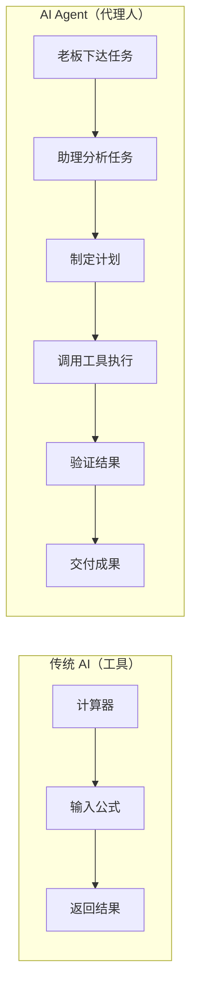
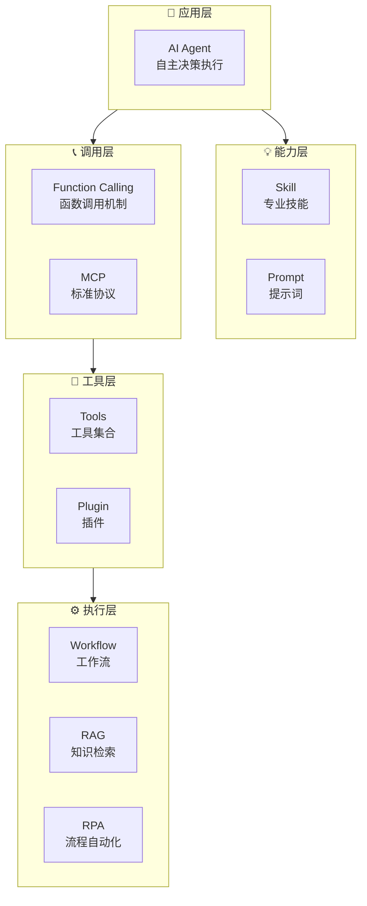
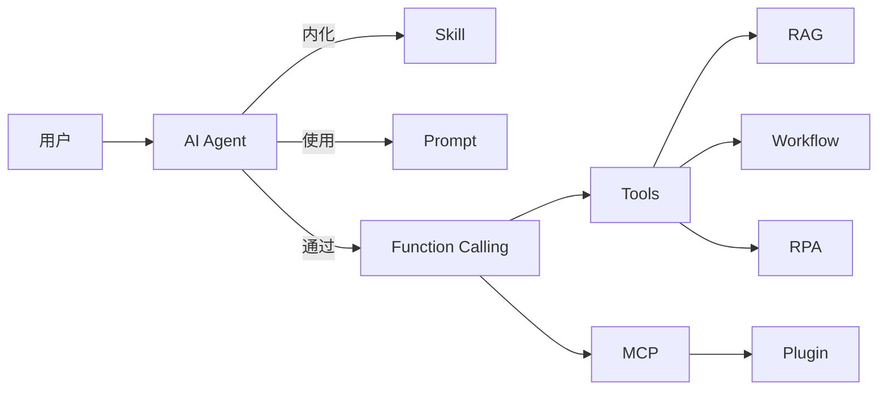
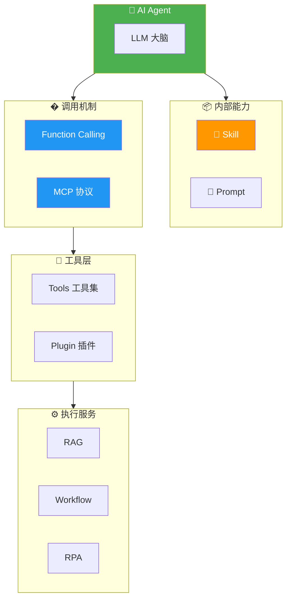
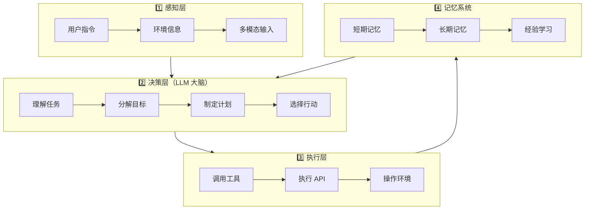
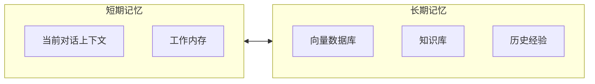
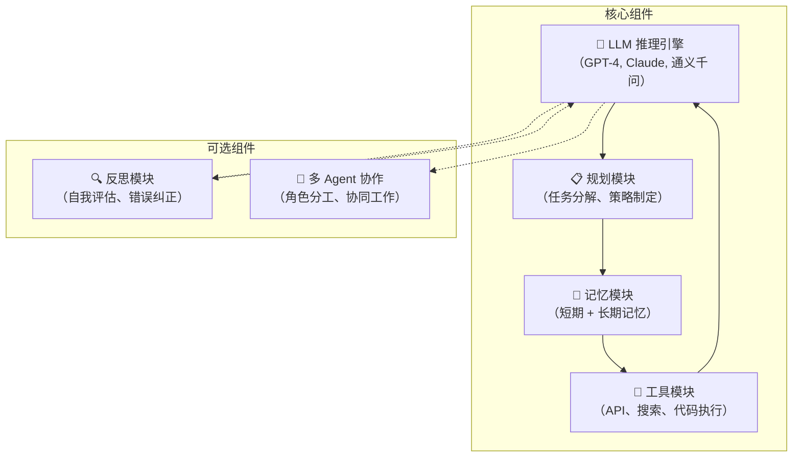
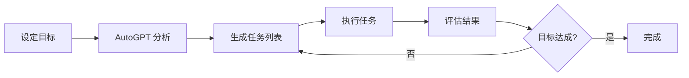
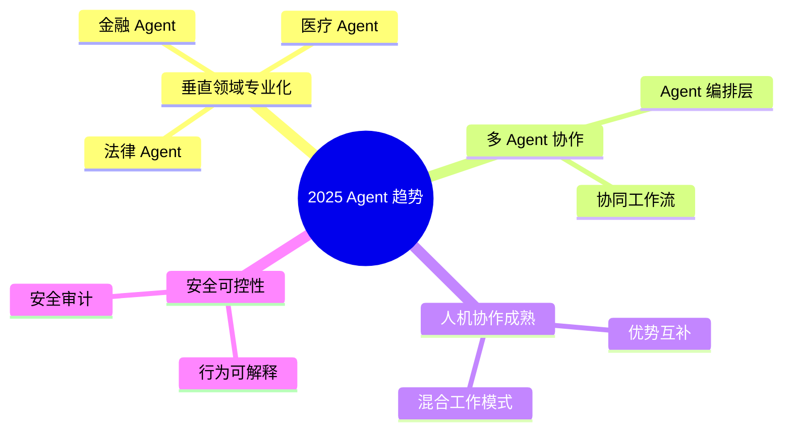
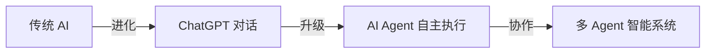

# AI Agent 入门指南：从概念到实践的完整解读

> 本文将带你深入理解 AI Agent（智能体）的核心原理，从"是什么"到"怎么用"，帮助你掌握这一改变 AI 应用范式的关键技术。
>
> 📌 **核心论文**：[A Survey on Large Language Model based Autonomous Agents](https://arxiv.org/abs/2308.11432)（arXiv:2308.11432）  
> 📌 **适合人群**：AI 初学者、后端开发者、对智能应用感兴趣的技术人员


> 🎧 **更喜欢听？试试本文的音频版本**
<AudioPlayer 
  src="//pub.smallyoung.cn/course_slidev/ai-agent/AI_Agent：数字员工如何自主工作2.m4a"
  author="SmallYoung"
/>

<VideoPlayer 
  src="//pub.smallyoung.cn/course_slidev/ai-agent/AI_智能体：深入解读.mp4"
/>

<MindMapFloat title="AI Agent 知识图谱">

```mindmap-data
# AI Agent
## 核心概念
- 自主性 (Autonomy)
- 感知能力 (Perception)
- 决策推理 (Reasoning)
- 行动执行 (Action)
- 学习适应 (Learning)
## 关键组件
- LLM 大脑
- 规划模块
- 记忆系统
- 工具调用
## 主流框架
- LangChain
- AutoGPT
- AutoGen
- Dify
## 应用场景
- 智能客服
- 自动化办公
- 代码助手
- 研究分析
```

</MindMapFloat>

## 1. 为什么需要 AI Agent？

想象一下这样的场景：你需要完成一份市场调研报告。传统的做法是：打开浏览器搜索资料、阅读整理、打开 Excel 分析数据、再用 Word 撰写报告。每一步都需要你亲自操作。

**如果有一个"数字员工"能帮你完成这一切呢？**

你只需要说："帮我调研 2025 年 AI Agent 市场规模，并生成一份分析报告"。它就能自己搜索资料、整理数据、生成图表、撰写报告——这就是 AI Agent 的愿景。

> [!IMPORTANT]
> **AI Agent 的核心价值**：从"人指挥 AI"转变为"AI 自主完成"。传统 AI 是被动响应，Agent 是主动规划和执行。


与传统 ChatGPT 对话的区别：

| 维度 | 传统 ChatGPT | AI Agent |
|------|-------------|----------|
| 交互模式 | 一问一答 | 持续自主执行 |
| 任务范围 | 单轮对话 | 多步骤复杂任务 |
| 工具使用 | 有限 | 可调用多种外部工具和 API |
| 记忆能力 | 上下文有限 | 长期记忆持久化 |
| 执行能力 | 仅生成文本 | 可执行实际操作 |

## 2. 什么是 AI Agent？

### 2.1 核心定义


**AI Agent（人工智能代理）** 是一种能够 **感知环境**、**自主决策** 并 **采取行动** 以实现特定目标的智能实体。

用一个生活化的类比来理解：



**传统 AI 像一个计算器**：你告诉它 `1+1`，它返回 `2`。
**AI Agent 像一个能干的助理**：你说"帮我规划出差行程"，它会自己查航班、订酒店、安排会议，最后给你一份完整方案。

### 2.2 AI Agent 的核心特性


| 特性 | 定义 | 生活类比 |
|------|------|----------|
| **自主性** (Autonomy) | 无需人持续干预，独立决策执行 | 自动驾驶汽车 |
| **感知能力** (Perception) | 收集和理解环境信息 | 眼睛和耳朵 |
| **推理决策** (Reasoning) | 基于信息做出逻辑判断 | 大脑思考 |
| **行动执行** (Action) | 与环境交互，完成操作 | 手和脚 |
| **学习适应** (Learning) | 从经验中学习并优化行为 | 积累工作经验 |
| **目标导向** (Goal-oriented) | 所有行为围绕目标展开 | 任务驱动的员工 |
| **记忆能力** (Memory) | 存储和检索过往经验 | 记事本和经验库 |

### 2.3 AI Agent 与相似概念的区别

在 AI 领域，有很多概念容易与 AI Agent 混淆。理解它们的区别，有助于准确把握 Agent 的定位。


#### 多维度综合对比表

| 概念 | 本质定义 | 自主性 | 与 Agent 关系 | 一句话类比 |
|------|----------|--------|---------------|------------|
| **AI Agent** | 自主智能体，能感知、决策、执行 | ⭐⭐⭐⭐⭐ | — | 能干的项目经理 |
| **工作流 Workflow** | 预定义的固定流程 | ⭐⭐ | Agent 可调用 | 照着菜谱做菜 |
| **提示词 Prompt** | 优化 LLM 输入的技巧 | ⭐ | Agent 的组成部分 | 教 AI 怎么回答 |
| **RAG** | 检索知识增强生成 | ⭐⭐ | Agent 的工具 | 带搜索的问答机 |
| **RPA** | 规则驱动的流程自动化 | ⭐⭐ | Agent 可调用 | 按脚本点按钮 |
| **MCP** | 工具连接的标准协议 | — | Agent 的接口标准 | USB-C 充电口 |
| **Skill** | 封装的专业执行方法 | ⭐⭐ | Agent 的能力库 | 敏捷开发方法论 |
| **Plugin** | 外部功能扩展接口 | ⭐ | Agent 的工具 | Jira、Slack 软件 |
| **Tools** | LLM 可调用的外部函数集合 | ⭐ | Agent 的执行器 | 工具箱里的工具 |
| **Function Calling** | LLM 调用外部函数的机制 | — | Agent 的调用方式 | 电话拨号方式 |

#### 分层架构图



#### 按维度深入对比

**1. 自主性维度**


| 等级 | 概念 | 说明 |
|------|------|------|
| 🔴 无自主 | Prompt、Plugin、Tools、Function Calling、MCP | 完全依赖调用 |
| 🟡 低自主 | Workflow、RAG、RPA、Skill | 按预设规则执行 |
| 🔵 高自主 | AI Agent | 自主规划、决策、执行 |

**2. 层级维度**

| 层级 | 概念 | 作用 |
|------|------|------|
| **应用层** | AI Agent | 面向用户的智能系统 |
| **能力层** | Skill、Prompt | 定义如何执行任务 |
| **调用层** | Function Calling、MCP | 调用外部功能的方式 |
| **工具层** | Tools、Plugin | 具体功能模块 |
| **执行层** | Workflow、RAG、RPA | 底层执行服务 |

**3. 关系维度**



#### 常见混淆澄清


> [!IMPORTANT]
> **三个最常见的混淆**：
> 
> 1. **Agent ≠ Workflow**  
>    Workflow 是"固定路线"，Agent 是"根据情况选路线"
>    
> 2. **Skill ≠ Plugin**  
>    Skill 是"内功心法"（内部方法论），Plugin 是"外挂武器"（外部工具）
>    
> 3. **Tools ≠ Function Calling**  
>    Tools 是"工具本身"，Function Calling 是"使用工具的方式"

#### 一图看懂所有关系



> [!TIP]
> **总结**：AI Agent 是智能中枢，内部通过 **Skill** 和 **Prompt** 定义能力，通过 **Function Calling** 和 **MCP** 调用 **Tools** 和 **Plugin**，最终执行 **Workflow、RAG、RPA** 等底层服务。

## 3. AI Agent 是如何工作的？


AI Agent 的工作原理围绕一个 **"感知-规划-行动-记忆"** 的闭环架构展开：



### 3.1 感知层 (Perception Layer)

Agent 通过多种方式获取信息：
- **自然语言**：理解用户的文字指令
- **图像识别**：理解视觉内容
- **API 数据**：获取实时信息（如天气、股价）
- **文件读取**：解析文档内容

### 3.2 决策层 (Decision Layer)


这是 Agent 的"大脑"，通常由 **大型语言模型 (LLM)** 驱动：

1. **任务理解**：分析用户意图
2. **目标分解**：将复杂任务拆解为子任务
3. **策略规划**：确定执行顺序和方法
4. **推理判断**：选择最优行动方案

> [!TIP]
> **为什么 LLM 是 Agent 的核心？** LLM 提供了强大的自然语言理解、推理和规划能力，使 Agent 能够处理开放式、模糊的任务指令。

### 3.3 执行层 (Execution Layer)


Agent 通过 **工具调用** 与外部世界交互：

| 工具类型 | 示例 | 能力 |
|----------|------|------|
| 搜索工具 | Google, Bing | 获取实时信息 |
| 代码执行 | Python, Shell | 数据处理、计算 |
| API 调用 | 天气、股票、邮件 | 外部服务集成 |
| 文件操作 | 读写文件 | 持久化存储 |
| 数据库 | SQL, Vector DB | 数据查询存储 |

### 3.4 记忆系统 (Memory System)



- **短期记忆**：当前任务的上下文信息，类似人的工作记忆
- **长期记忆**：通过向量数据库持久化存储，支持语义检索

## 4. AI Agent 的架构组成

一个完整的 AI Agent 系统通常包含以下核心组件：



### 4.1 LLM 与传统 Agent 的区别

| 对比项 | 仅 LLM | LLM + Agent |
|--------|--------|-------------|
| 能力边界 | 仅生成文本 | 执行实际操作 |
| 实时性 | 训练数据截止 | 可获取实时信息 |
| 幻觉问题 | 容易产生幻觉 | 可通过工具验证 |
| 复杂任务 | 单轮处理 | 多步骤迭代 |
| 专业能力 | 通用知识 | 可集成专业工具 |

> [!IMPORTANT]
> **Agent = LLM + 规划 + 记忆 + 工具使用**  
> LLM 是"大脑"，Agent 是拥有"手脚"的完整智能体。

## 5. 主流 AI Agent 框架


### 5.1 LangChain

LangChain 是目前最流行的 LLM 应用开发框架，提供了构建 Agent 的完整工具链：

```python
from langchain.agents import initialize_agent, Tool
from langchain.llms import OpenAI
from langchain.tools import DuckDuckGoSearchRun

# 初始化 LLM
llm = OpenAI(temperature=0)

# 定义工具
search = DuckDuckGoSearchRun()
tools = [
    Tool(
        name="Search",
        func=search.run,
        description="用于搜索互联网上的实时信息"
    )
]

# 创建 Agent
agent = initialize_agent(
    tools, 
    llm, 
    agent="zero-shot-react-description",
    verbose=True
)

# 执行任务
result = agent.run("2025年AI Agent市场规模是多少？")
```

**LangChain 核心特点**：
- 模块化设计，组件可复用
- 支持多种 LLM 后端
- 丰富的工具集成
- 完善的记忆管理

### 5.2 AutoGPT

AutoGPT 是一个开创性的全自主 Agent 实现，展示了 Agent 的完全自主能力：



**AutoGPT 特点**：
- 完全自主执行，无需人工干预
- 自我纠正能力
- 处理多步骤长期任务
- 通过 GPT-4 驱动

### 5.3 其他主流框架


| 框架 | 特点 | 适用场景 |
|------|------|----------|
| **AutoGen** (Microsoft) | 多 Agent 对话协作 | 复杂任务分工 |
| **Dify** | 低代码可视化开发 | 快速原型搭建 |
| **MetaGPT** | 模拟软件公司协作 | 代码生成项目 |
| **CrewAI** | 角色扮演多 Agent | 团队协作模拟 |

## 6. 2025 年 AI Agent 发展趋势


根据 Gartner 预测，**代理型 AI（Agentic AI）** 是 2025 年最重要的技术趋势之一。

### 6.1 市场现状

| 指标 | 数据 |
|------|------|
| 2024 年市场规模 | 超过 500 亿美元 |
| 增长率 | 超过 200% |
| 企业采用率 | 预计 60%+ 企业将部署 AI Agent |
| 生产力提升 | 15-40% |

### 6.2 核心趋势



> [!NOTE]
> **关键洞察**：2025 年被认为是 AI Agent 商业爆发的元年，从概念验证走向大规模应用。

## 7. 最佳实践与常见误区


### 7.1 构建 Agent 的最佳实践

| 实践 | 说明 |
|------|------|
| **模块化设计** | 将任务分解为可复用组件 |
| **响应缓存** | 对重复请求缓存结果，降低成本 |
| **流式输出** | 长任务实时返回进度，提升体验 |
| **错误处理** | 设置超时和异常捕获机制 |
| **状态持久化** | 合理管理记忆，支持长期任务 |
| **提示工程** | 精心设计 Prompt，优化推理效果 |

### 7.2 常见误区

| 误区 | 正确理解 |
|------|----------|
| Agent 能完全替代人类 | Agent 是增强工具，人机协作最优 |
| 越自主越好 | 关键节点需要人类审核把关 |
| Agent 不会犯错 | 需要设计验证和纠错机制 |
| 一个 Agent 搞定一切 | 复杂任务需要多 Agent 协作 |

> [!WARNING]
> **安全提醒**：赋予 Agent 执行权限时，务必设置边界和审核机制，避免误操作带来风险。

## 8. 总结


AI Agent 代表了人工智能应用的新范式，从"人机对话"迈向"人机协作"。

**核心要点回顾**：

| 概念 | 一句话解释 |
|------|-----------|
| AI Agent | 能自主感知、决策、执行的智能实体 |
| 感知层 | 获取环境信息的"眼睛耳朵" |
| 决策层 | LLM 驱动的"大脑" |
| 执行层 | 调用工具的"手脚" |
| 记忆系统 | 存储经验的"笔记本" |
| 工具调用 | Agent 与外界交互的桥梁 |
| 多 Agent | 分工协作，处理复杂任务 |



> [!TIP]
> **下一步学习建议**：
> 1. 动手尝试 LangChain 构建简单 Agent
> 2. 阅读核心论文理解原理
> 3. 关注主流框架更新动态

## 9. 参考资料

| 资料 | 作者/机构 | 说明 |
|------|-----------|------|
| [A Survey on Large Language Model based Autonomous Agents](https://arxiv.org/abs/2308.11432) | 复旦大学 | 基于 LLM 的自主 Agent 综述 |
| [Agent AI: Surveying the Horizons of Multimodal Interaction](https://arxiv.org/abs/2401.03568) | 多机构合作 | 多模态交互 Agent 研究 |
| [LangChain 官方文档](https://python.langchain.com/) | LangChain | Agent 开发框架指南 |
| [AutoGPT 项目](https://github.com/Significant-Gravitas/AutoGPT) | 开源社区 | 自主 Agent 开源实现 |
| [Gartner 2025 技术趋势报告](https://www.gartner.com/) | Gartner | 行业趋势分析 |
