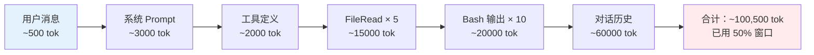
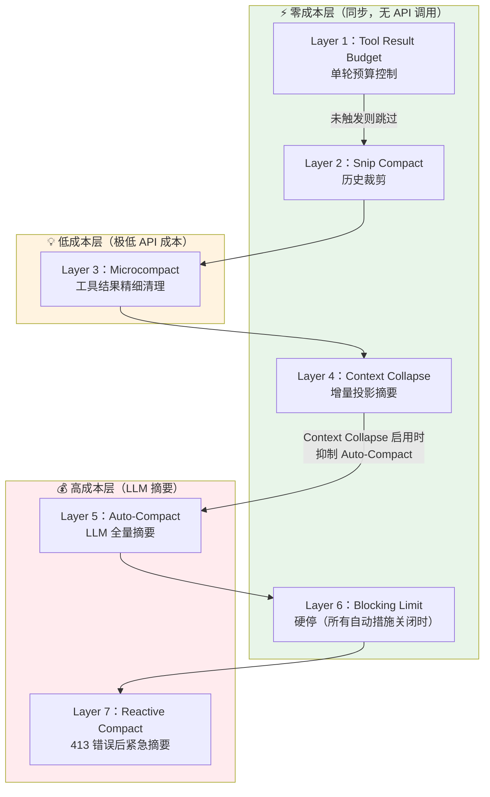
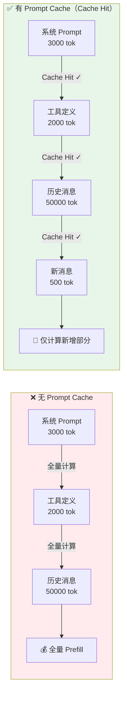
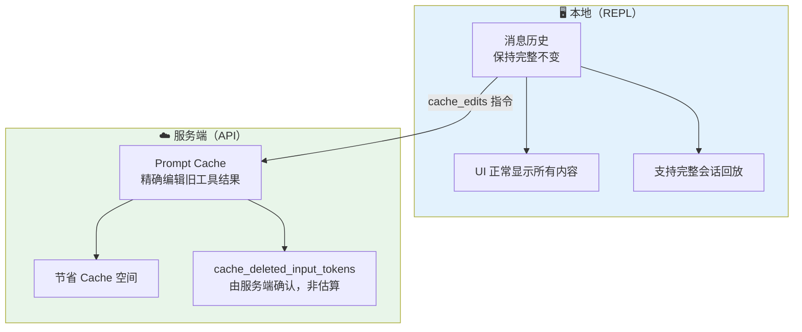
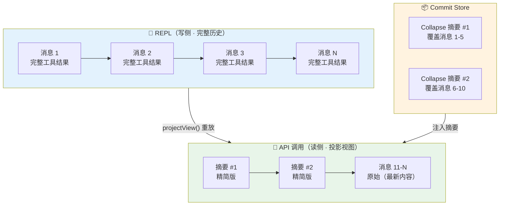
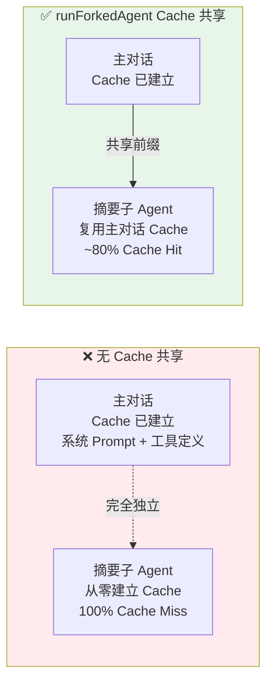
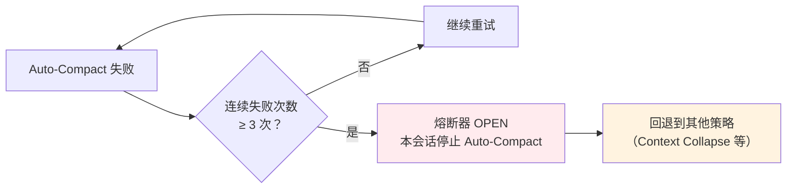
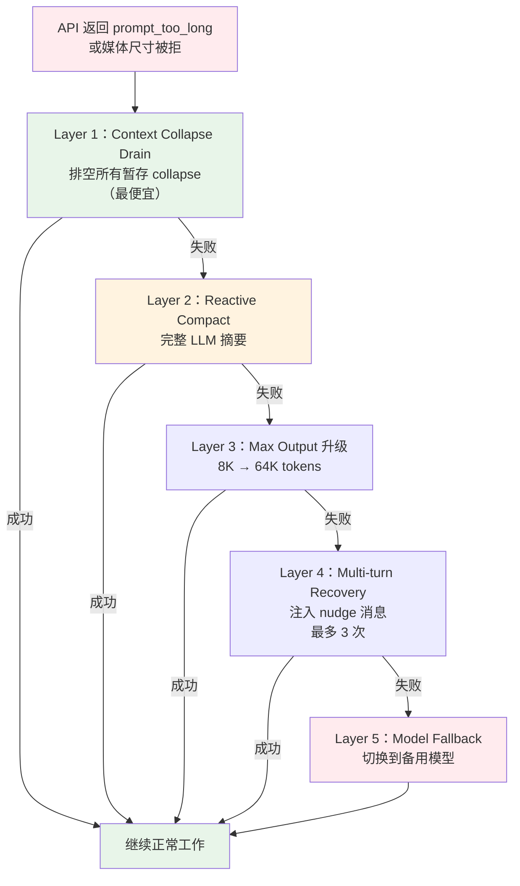
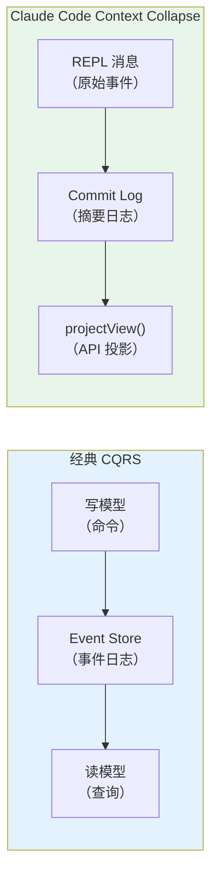

# Claude Code 上下文管理算法深度解析：7 层递进式防御体系

> Claude Code 的上下文管理不是一个开关，而是一套由 7 层机制构成的递进式防御体系——从零 API 调用的廉价裁剪，到耗费算力的 LLM 全量摘要，每一层都在尽力阻止下一层被触发。本文基于 Claude Code 源码快照（2026-03-31，核心文件 `src/query.ts`、`src/services/compact/`、`src/utils/toolResultStorage.ts`），逐层拆解这套架构的设计决策与工程智慧。
>
> 📌 **适合人群**：AI Agent 开发者、对 LLM 系统工程感兴趣的后端工程师、希望理解生产级 AI 工具内部机制的技术读者


<MindMapFloat title="Claude Code 上下文管理知识图谱">

```mindmap-data
# Claude Code 上下文管理
## 为什么上下文是瓶颈
- 工具调用爆炸式增长
- LLM 性能随填充率下降
- Prompt Cache 稳定性代价
## 7 层防御架构
- 从便宜到昂贵递进
- 互斥门控防竞争
- 每层阻止下一层触发
## Prompt Cache 优先哲学
- frozen 分区永不替换
- 字节级一致性保证
- 读写分离设计
## CQRS 双视图模式
- REPL 保留完整历史
- API 看到投影视图
- commit log 增量摘要
## 错误恢复与熔断
- 5 层错误级联
- 熔断器防无限重试
- 错误扣留延迟暴露
```

</MindMapFloat>

## 关于本文档

这篇文章将带你系统理解 Claude Code 如何在长会话中管理有限的上下文窗口——从最便宜的同步操作，到最昂贵的 LLM 摘要，每一层机制背后都有深刻的工程取舍。

- ✅ 7 层递进式防御体系的完整工作流程
- ✅ Tool Result Budget 三分区算法与 Prompt Cache 优先哲学
- ✅ Context Collapse 的 CQRS 式双视图设计
- ✅ Auto-Compact 的 Prompt Cache 共享优化与熔断器模式
- ✅ 5 层错误恢复级联与错误扣留（Error Withholding）模式
- ✅ 8 个可直接借鉴的系统设计原则

## 1. 为什么上下文管理是 AI Agent 的核心挑战

### 1.1 LLM 的"工作记忆"是如何被耗尽的

如果你用过 Claude Code 做过一次复杂的调试或代码重构，你很可能遇到过这种体验：工具跑得好好的，突然感觉 Claude 开始"变笨"——忘记之前的决策，给出泛化的回答，甚至自相矛盾。这不是模型变差了，而是**上下文窗口快满了**。

上下文窗口（Context Window）是 LLM 的"工作记忆"。Claude Sonnet 4.5 的上下文窗口约为 200,000 tokens，看起来很大，但在 agentic 工作流中消耗极快：每一条消息、每个工具调用的输入输出、每次读取的文件内容，都在累积。



研究一致表明，随着上下文填充率上升，LLM 性能会显著下降。"Lost in the Middle"效应（Liu et al., 2024）表明，当相关信息处于长上下文的中间位置时，准确率可下降 30% 以上。这意味着**上下文不仅是数量问题，更是质量问题**。


### 1.2 朴素方案的局限

| 朴素方案 | 表现 | 真实问题 |
|----------|------|----------|
| 直接截断旧消息 | 简单快速 | 破坏 tool_use/tool_result 对，引发 API 错误 |
| 全量 LLM 摘要 | 效果好 | 每次都贵，且 cache miss 率近 100% |
| 固定阈值触发清理 | 可预测 | 可能在任务执行中途打断，破坏一致性 |
| 什么都不做 | 零成本 | 超出 token 限制后 API 直接返回 413 |

> [!IMPORTANT]
> 核心矛盾：上下文管理需要在**节省空间**与**保护 Prompt Cache 稳定性**之间做精确权衡。每一次对历史消息的修改，都可能让之前昂贵缓存的 KV 张量失效，造成更大的额外成本。


### 1.3 Claude Code 的解法：7 层递进式防御

Claude Code 的答案是一套按"成本从低到高"排列的 7 层防御体系，每一层成功消化压力，就可能阻止更昂贵的下一层被触发：




## 2. Layer 1 & 2：预算控制与历史裁剪

### 2.1 Tool Result Budget — 三分区算法

**问题场景**：你让 Claude Code 并行执行 10 个工具（读文件、执行命令、搜索等），这 10 个结果可能在同一轮对话中集体产生超大上下文。

Tool Result Budget 用一个**三分区算法**在发送 API 之前就把问题扼杀：

| 分区名 | 含义 | 处理策略 |
|--------|------|----------|
| `mustReapply` | 之前已被替换过的结果 | 直接重用缓存的替换字符串（零 I/O，字节级一致） |
| `frozen` | 之前见过但没替换过 | 永不替换（保护 Prompt Cache） |
| `fresh` | 本轮新产生的结果 | 参与预算分配 |

**关键阈值**（远程可配置）：

- 总预算：200K 字符/消息
- 单工具上限：50K 字符（默认）
- 超出时：保留前 ~2KB 预览 + 持久化到磁盘，模型可用 `Read` 工具按需读取

`frozen` 分区是这里最精妙的设计。它宁可浪费一点上下文空间，也绝不去修改已经进入 Prompt Cache 的内容——因为 Prompt Cache 的工作原理是对 Token 序列的前缀做哈希匹配，任何修改都会导致 Cache Miss，带来约 90% 的额外 token 重计算成本。

> [!IMPORTANT]
> **Prompt Cache 稳定性高于空间效率**——这是贯穿整个上下文管理体系的第一优先级原则。


### 2.2 Prompt Cache 为什么如此重要

Prompt Cache（提示词缓存）在 LLM API 层面工作：当一次请求的 token 序列前缀与之前处理过的前缀完全匹配时，服务器可以跳过这段前缀的 Prefill 计算，直接复用缓存的 KV（Key-Value）张量。



在 Claude Code 实际运行时，Prompt Cache 的命中率可达 92%，带来约 81% 的成本降低。**这就是为什么 Frozen 分区宁可占用空间也不动已缓存内容的根本原因**。


### 2.3 Snip Compact — 零成本历史裁剪

Snip Compact 是最轻量的历史清理手段：直接从消息列表中删除旧消息，零 API 调用。

但它有一个精巧的协调机制：`snipTokensFreed` 值会被显式传递给下游层。这是因为 `tokenCountWithEstimation` 读取的是上一轮 API 返回的 `input_tokens`（反映 snip **前**的数值），如果不手动减去 snip 释放的量，下游层会基于过时的 token 数做判断，可能错误地触发更昂贵的操作。

> [!NOTE]
> **双视图设计**：REPL（用户界面层）保留被 snip 的消息用于 UI 回滚，但 API 调用前会通过投影层过滤掉它们。这个"读写分离"思想贯穿整个架构。

## 3. Layer 3：Microcompact — 三种精细清理路径

Microcompact 是第 3 层，提供三种各具特色的精细清理策略，成本从极低到接近零。

### 3.1 基于时间的清理 — 搭 Cache TTL 过期的"免费顺风车"

```
触发条件：距上次助手消息 > 60 分钟（= 服务端 Prompt Cache TTL）
逻辑：cache 已自然过期 → 整个前缀无论如何都要重建 → 趁机清理旧工具结果
行为：替换为 "[Old tool result content cleared]"
保留：最近 5 个结果（保持短期一致性）
```

这个设计体现了一个精妙的工程思维：**利用系统中已经确定会发生的事件（Cache TTL 过期），搭便车执行本来要付出额外成本的清理操作**。既然前缀必须重建，就把脏活一起干了，不产生任何额外的 Cache 破坏。

### 3.2 Cache Editing — 最精妙的读写分离设计

这是整套架构中最具创造性的一环：

```
触发条件：可压缩工具结果数超过阈值
关键创新：不修改本地消息列表！
          使用 API 的 cache_edits / cache_reference 机制
效果：服务端缓存被精确编辑，本地消息保持不变
确认方式：用 API 返回的 cache_deleted_input_tokens（非客户端估算）
操作范围：仅主线程，仅特定工具（FileRead, Bash, Grep, Glob 等）
```



**洞察**：这是一种真正意义上的读写分离。本地消息不变，保证重放一致性；服务端缓存被精确编辑，节省实际 token 开销。客户端对"节省了多少"的判断来自服务端权威数据，而非客户端估算。

### 3.3 API 原生上下文管理 — 极端场景下的大刀阔斧

| 策略 | 触发条件 | 行为 |
|------|----------|------|
| `clear_tool_uses` | 输入超 180K tokens | 清理历史工具调用记录 |
| `clear_thinking` | 输入超 180K tokens | 清理历史思考块 |
| 思考块保留策略 | Cache 冷（>1h）时 | 仅保留最后一轮思考，其余丢弃 |

目标是将上下文压缩到最近 40K tokens 的核心内容，让接下来的操作重新获得足够的工作空间。


## 4. Layer 4：Context Collapse — CQRS 式增量投影摘要

### 4.1 核心思想：Commit Log + Project View

Context Collapse 是整个架构中设计最精巧的一层，它借鉴了软件架构中的 **CQRS（命令查询职责分离）**思想：

- **写侧（REPL）**：保留完整的消息历史，永不破坏性修改
- **读侧（API）**：每次发送 API 请求前，通过 `projectView()` 重放 Commit Log，生成压缩后的投影视图



### 4.2 三个关键 API 的协同

```typescript
// 三个核心方法的职责
applyCollapsesIfNeeded()  // 投影压缩视图 + 可选提交新 collapse
recoverFromOverflow()     // 413 时排空所有暂存 collapse（第一道防线）
projectView()             // 每轮重放提交日志，生成 API 可见的投影视图
```

**触发阈值**：

| 阈值 | 行为 |
|------|------|
| 90% 上下文窗口 | 开始提交 collapse |
| 95% 上下文窗口 | 阻塞新 spawn（防止子任务进一步消耗空间） |
| ~93% 位置 | Context Collapse 抑制 Auto-Compact（防止两者竞争） |

### 4.3 为什么不破坏性修改原始消息

Context Collapse 的 Commit Store 中存储的摘要独立于 REPL 消息数组。这意味着：

- **会话恢复**：从 commits + snapshot 重建状态，无需重跑历史
- **UI 回滚**：用户仍可看到完整的操作历史
- **调试一致性**：同一会话在不同时间点的"重放"得到相同结果

> [!TIP]
> 这正是经典 CQRS + Event Sourcing 模式的精华：写侧追加事件日志（Commit），读侧通过重放（projectView）得到当前视图。两侧可以独立优化，互不干扰。


## 5. Layer 5：Auto-Compact — 带熔断器的 LLM 全量摘要

### 5.1 触发条件与摘要结构

当 `tokenCount > contextWindow - 13,000` 时，Auto-Compact 启动，调用 LLM 生成当前会话的摘要。摘要 Prompt 分为两部分：

```xml
<!-- 内部草稿：生成后丢弃，不计入最终摘要 -->
<analysis>
  LLM 在这里自由分析当前会话的关键信息
</analysis>

<!-- 最终摘要：保留的精华内容 -->
<summary>
  1. Primary Request / Intent（主要目标）
  2. Key Technical Concepts（核心技术概念）
  3. Files / Code（涉及的文件和代码）
  4. Errors / Fixes（错误与解决方案）
  5. Problem Solving（问题解决过程）
  6. All User Messages（用户说过的每句话都完整保留）
  7. Pending Tasks（待完成任务）
  8. Current Work（当前工作状态）
  9. Optional Next Step（可选下一步）
</summary>
```

> [!NOTE]
> 第 6 项"All User Messages"单独列出，体现了一个重要设计决策：**用户的意图永远不能丢失**。LLM 可以压缩工具结果和中间步骤，但用户说过的每一句话必须原文保留在摘要中。

### 5.2 Prompt Cache 共享优化 — 一个影响全局的细节

摘要子 Agent 通过 `runForkedAgent` 复用主对话的 Prompt Cache 前缀。

**没有这个优化时会发生什么**：摘要子 Agent 每次都是一次全新的对话，必须重新建立 Cache，Cache Miss 率约 98%。按 Anthropic 内部数据，这会每天浪费约 38B tokens 的 Cache 创建开销。



### 5.3 PTL（Prompt-Too-Long）重试机制

如果 Auto-Compact 本身的输入也太长，会触发 PTL 重试：

```
最多重试 3 次：
  Step 1：按 API 轮次分组（groupMessagesByApiRound）
  Step 2：丢弃最老的组以覆盖 token 缺口
  Step 3：无法精确计算时，fallback 丢弃 20% 的组
  Step 4：所有图片/文档块替换为 [image]/[document] 标记后发送
```

这是一个典型的**优雅降级**设计：先尝试最精确的策略，失败后逐步降级到粗粒度策略，始终保证操作可以完成。


### 5.4 熔断器（Circuit Breaker）— 用真实数据驱动的决策

```
MAX_CONSECUTIVE_AUTOCOMPACT_FAILURES = 3
触发后：本会话剩余时间完全停止 Auto-Compact 尝试
```

为什么需要熔断器？来自 Anthropic 内部数据：**约 1,279 个会话曾出现 50 次以上的连续 Auto-Compact 失败，最高达 3,272 次连续失败，每天因此浪费约 250K 次 API 调用**。



熔断器模式（Circuit Breaker）来自微服务架构：当下游服务持续失败时，立即停止调用，给系统恢复时间，避免无效请求堆积拖垮整个系统。Claude Code 将这个模式精准地应用到了 LLM 摘要失败场景。

### 5.5 Post-Compact 恢复清单 — 不从零开始的摘要后重建

摘要完成后，系统按固定预算精心恢复关键上下文，而不是丢弃一切或全量恢复：

| 恢复项 | 预算上限 | 说明 |
|--------|----------|------|
| 最近读取的文件 | 5 个，每个 ≤ 5K tokens，总计 ≤ 50K | 最可能被继续引用的文件 |
| Skill 附件 | 每个 5K，总计 ≤ 25K | 项目级别的配置和约定 |
| Plan 状态 | 完整恢复 | 任务规划不能丢失 |
| Deferred tools | 完整恢复 | 待执行的工具调用 |
| Agent 列表 | 完整恢复 | 子 Agent 状态 |
| MCP 指令 | 完整恢复 | 外部工具集成配置 |


## 6. Layer 6 & 7：硬停与紧急摘要

### 6.1 五层错误恢复级联

当 API 返回 `prompt_too_long` 或媒体尺寸被拒时，系统并不直接报错，而是触发一套五层错误恢复级联——从最便宜到最昂贵依次尝试：



### 6.2 错误扣留（Error Withholding）模式

这是一个值得单独关注的设计模式：

```
流式传输期间，可恢复错误不立即 yield 给调用者
  → 推入 assistantMessages 供恢复检查
  → 防止 SDK 消费者终止会话
  → 所有恢复手段都失败后，才将错误暴露给用户
```

类比：这像是一个优秀的项目经理——遇到问题先在内部消化，尝试所有能解决的手段，只有真正无法处理时才向上汇报。这个模式可以推广到任何有多层 Fallback 的系统设计中。

防循环守卫：`hasAttemptedReactiveCompact` 标志位确保同一轮不会无限重试 Reactive Compact。


## 7. Query Loop 状态机与 Token Budget Continuation

### 7.1 while(true) + 显式状态转移

整个 Query Loop 不是递归调用，而是 `while(true)` + 显式状态转移：

```typescript
// 状态机结构
State = {
  messages,
  toolUseContext,
  autoCompactTracking,          // 熔断计数
  maxOutputTokensRecoveryCount, // 输出恢复计数
  hasAttemptedReactiveCompact,  // 防循环守卫
  maxOutputTokensOverride,      // 8K → 64K 升级标志
  pendingToolUseSummary,
  stopHookActive,
  turnCount,
  transition                    // 状态转移原因
}

// 状态转移类型
type Transition =
  | "collapse_drain_retry"
  | "reactive_compact_retry"
  | "max_output_tokens_escalate"
  | "max_output_tokens_recovery"
  | "stop_hook_blocking"
  | "token_budget_continuation"
```

使用 `while(true)` 而非递归的原因：**长会话中的深层递归会导致调用栈溢出**。显式状态转移不仅避免了这个问题，还让每次循环的原因清晰可追踪。

### 7.2 Token Budget Continuation — 输出预算跟踪

这是一个附加机制，用于控制长任务的自动续跑（不是上下文管理，是输出预算管理）：

```
完成阈值：输出 < 预算 90% → 继续执行
递减检测：连续 3+ 次续跑 且 最近两次增量 < 500 tokens → 判断为停滞，停止
每次续跑注入 nudge 消息，告知模型当前进度百分比
```

这个机制解决了 LLM 在长任务中"提前收工"的问题，同时通过递减检测防止无意义的重复续跑。


## 8. 从这套架构里能学到什么

### 8.1 八个可借鉴的设计原则

这套上下文管理体系中提炼的设计原则，远超 AI 领域，可广泛应用于任何需要资源管理的系统：

| 原则 | Claude Code 中的体现 | 可迁移的场景 |
|------|---------------------|------------|
| **缓存稳定性高于空间效率** | Frozen 分区永不修改已缓存内容 | 任何有 KV Cache 的分布式系统 |
| **分层防御，从便宜到昂贵** | 7 层递进，互斥门控 | 数据库查询优化、网络请求降级 |
| **错误扣留 + 延迟暴露** | 流式传输中不立即暴露可恢复错误 | 任何有多层 Fallback 的系统 |
| **CQRS 式双视图** | REPL 完整历史 + API 投影视图 | 审计日志系统、调试工具 |
| **熔断器模式** | 连续失败 3 次后本会话停止重试 | 微服务架构、外部 API 调用 |
| **搭 TTL 过期的顺风车** | Cache 60min 后清理旧结果 | 任何有定期失效机制的系统 |
| **摘要后精心恢复，不从零开始** | 明确 token 预算分配各类上下文 | 系统重启恢复、数据库 Checkpoint |
| **不变量保护无处不在** | tool_use/tool_result 对永不拆分 | 事务系统、流式处理管道 |


### 8.2 Context Collapse 的 CQRS 思想深解

值得单独展开的是 Context Collapse 对 CQRS 的运用。经典 CQRS 由 Greg Young 在 2010 年提出，核心是**写操作和读操作使用不同的数据模型**：



两者的映射关系清晰：REPL 消息 = 写侧原始事件；Commit Log = Event Store；`projectView()` = 读模型的物化视图。这种设计使得历史回放、UI 显示、API 调用三者完全解耦，可以独立演进。

### 8.3 在自己的 AI Agent 中应用这些原则

```python
# 示例：在自定义 Agent 中实现分层上下文管理

class LayeredContextManager:
    """
    参考 Claude Code 7 层防御体系的简化实现
    """
    
    def __init__(self, max_tokens: int = 200_000):
        self.max_tokens = max_tokens
        self.messages = []
        self.collapse_commits = []  # CQRS commit log
        self.compact_failures = 0  # 熔断器计数
        self.MAX_FAILURES = 3       # 熔断阈值
    
    def manage_context(self, new_message: dict) -> list:
        """
        按优先级依次尝试各层策略
        """
        self.messages.append(new_message)
        token_count = self._estimate_tokens(self.messages)
        
        # Layer 1：预算控制（零成本）
        self.messages = self._apply_tool_budget(self.messages, budget=200_000)
        
        # Layer 2：历史裁剪（零成本）
        if token_count > self.max_tokens * 0.7:
            freed = self._snip_old_messages()
            token_count -= freed  # 关键：手动更新 token 计数
        
        # Layer 3：LLM 摘要（有成本）—— 熔断器保护
        if token_count > self.max_tokens * 0.9:
            if self.compact_failures < self.MAX_FAILURES:
                try:
                    self._auto_compact()
                    self.compact_failures = 0  # 成功则重置
                except Exception:
                    self.compact_failures += 1
                    # 熔断器触发后回退到保守策略
                    self._aggressive_snip()
        
        # 返回 projectView：CQRS 式投影
        return self._project_view()
    
    def _project_view(self) -> list:
        """
        CQRS 读侧：重放 commit log，生成 API 可见的投影视图
        """
        projected = []
        for commit in self.collapse_commits:
            projected.append({"role": "assistant", "content": commit["summary"]})
        # 追加最新的原始消息
        projected.extend(self.messages[-20:])  # 保留最近 20 条
        return projected
    
    def _estimate_tokens(self, messages: list) -> int:
        # 简化估算：平均每条消息 500 tokens
        return len(messages) * 500
    
    def _apply_tool_budget(self, messages: list, budget: int) -> list:
        # 对工具结果应用预算限制，超出则截断并附上提示
        return messages  # 实际实现略
    
    def _snip_old_messages(self) -> int:
        # 删除旧消息，返回释放的 token 估算
        removed = self.messages[:5]
        self.messages = self.messages[5:]
        return len(removed) * 500
    
    def _auto_compact(self):
        # 调用 LLM 生成摘要，存入 commit log
        summary = "... LLM 生成的会话摘要 ..."
        self.collapse_commits.append({"summary": summary})
        self.messages = []  # 摘要后清空历史
    
    def _aggressive_snip(self):
        # 熔断后的保守策略：只保留最近 10 条消息
        self.messages = self.messages[-10:]
```

> [!WARNING]
> 上述代码是概念示意，省略了 Prompt Cache 稳定性保护、不变量检查（tool_use/result 对不拆分）等生产级细节。在实际系统中，这些细节往往决定了稳定性的上下界。

## 9. 总结

| 核心概念 | 一句话解释 |
|---------|-----------|
| Tool Result Budget 三分区 | mustReapply / frozen / fresh，优先保护已缓存内容 |
| Snip Compact | 零成本历史裁剪，显式传递释放量防止下游误判 |
| Microcompact Cache Editing | 服务端缓存精确编辑，本地消息不变，真正的读写分离 |
| Context Collapse | CQRS 式 Commit Log + projectView，双视图解耦 |
| Auto-Compact 熔断器 | 连续失败 3 次停止重试，用真实数据驱动阈值决策 |
| 错误扣留模式 | 流式中扣留可恢复错误，给恢复机制留空间 |
| 7 层递进防御 | 从便宜到昂贵，互斥门控防竞争，每层尽力阻止下一层 |


> [!TIP]
> **进一步学习建议**：
> 1. 先理解 Prompt Cache 的工作原理（KV 张量缓存），再看 Frozen 分区的设计决策，你会发现两者的逻辑完全自洽
> 2. 阅读 Martin Fowler 关于 CQRS 的原文，再对照 Context Collapse 的实现，会有"恍然大悟"的体验
> 3. 如果你在构建自己的 AI Agent，从熔断器和错误扣留模式开始改造，这两个模式的 ROI 最高

## 10. 参考资料

### 核心文档与论文

| 来源 | 机构 | 主要贡献 |
|------|------|----------|
| [Effective context engineering for AI agents](https://www.anthropic.com/engineering/effective-context-engineering-for-ai-agents) | Anthropic | 官方上下文工程最佳实践 |
| [Context windows - Claude API Docs](https://platform.claude.com/docs/en/build-with-claude/context-windows) | Anthropic | 上下文窗口 Token 管理官方文档 |
| [CQRS Pattern](https://learn.microsoft.com/en-us/azure/architecture/patterns/cqrs) | Microsoft Azure | CQRS 架构模式权威说明 |
| Lost in the Middle (Liu et al., 2024) | Stanford/UC Berkeley | 长上下文中段信息遗忘效应，30%+ 准确率下降 |
| Context Length Alone Hurts LLM Performance (Du et al., 2025) | — | 输入长度增加导致 13.9%–85% 性能下降 |
| [bliki: CQRS](https://martinfowler.com/bliki/CQRS.html) | Martin Fowler | CQRS 模式原始定义与适用场景分析 |

### 推荐延伸阅读

- [Best Practices for Claude Code](https://code.claude.com/docs/en/best-practices) — 官方最佳实践，含 `/compact`、`/clear` 使用场景
- [How Claude Code Got Better by Protecting More Context](https://hyperdev.matsuoka.com/p/how-claude-code-got-better-by-protecting) — 上下文保护策略演进的社区分析
- [Prompt Caching Explained](https://www.digitalocean.com/community/tutorials/prompt-caching-explained) — Prompt Cache 机制深度解析
