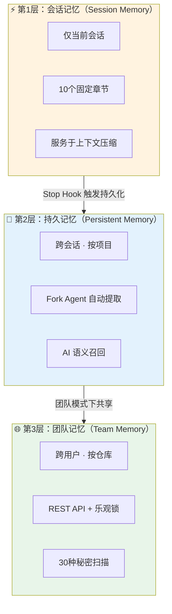
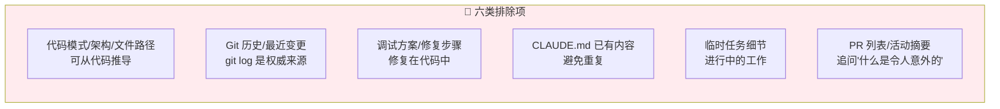
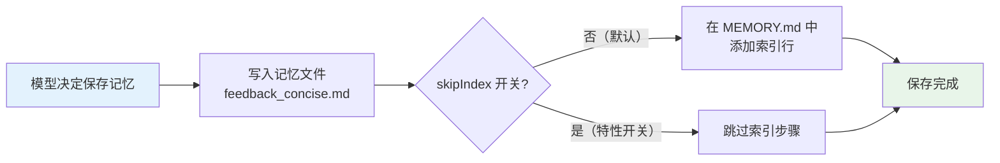
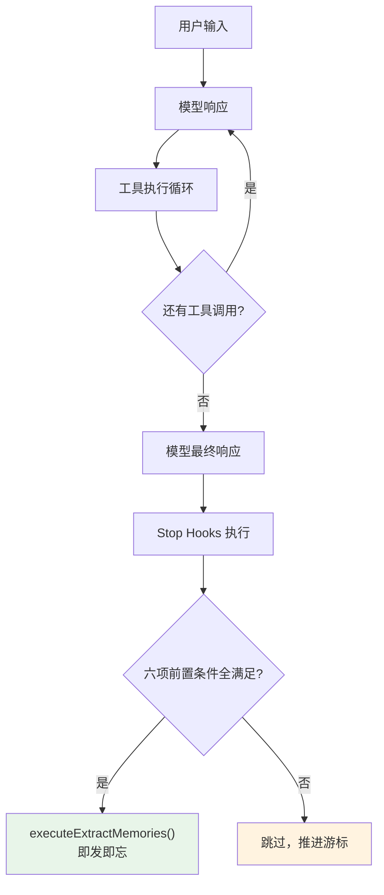
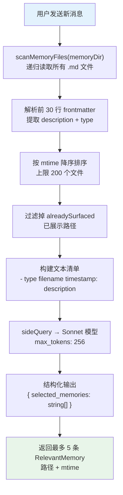
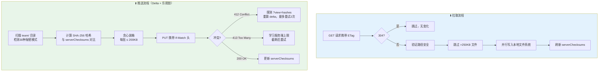
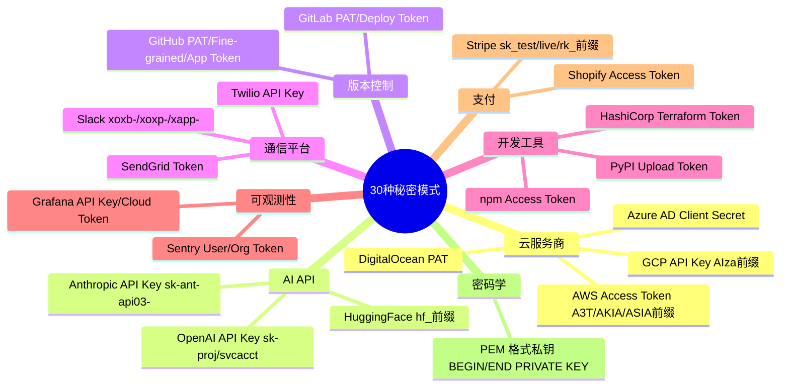
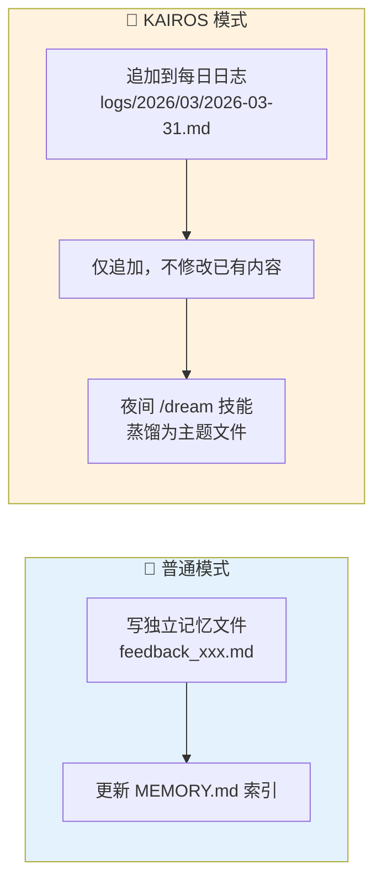
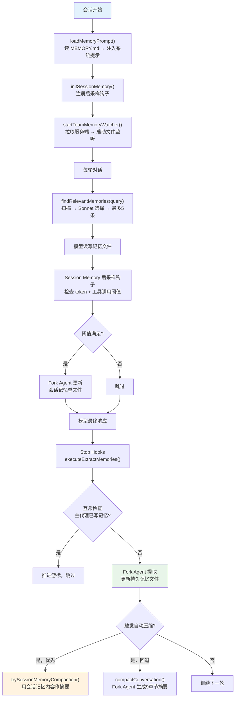

# Claude Code 记忆系统深度分析：基于源码泄露的三层架构解密

> Claude Code 不是一个有记忆的聊天机器人——它是一个拥有**三层递进知识管理体系**的工程级 AI Agent。2026 年 3 月 31 日，Anthropic 因 npm 打包失误意外泄露了完整的 Claude Code 源码（约 512,000 行 TypeScript），让外界首次得以窥见其记忆系统的全貌。本文基于 `src/memdir/`、`src/services/extractMemories/`、`src/services/SessionMemory/`、`src/services/teamMemorySync/` 等核心模块，逐层拆解这套"会话记忆 → 持久记忆 → 团队记忆"的完整架构。
>
> 📌 **适合人群**：AI 工程师、Claude Code 重度用户、对 LLM Agent 记忆机制感兴趣的开发者


<!--
  MindMapFloat 知识维度地图（完成正文后填写）
-->
<MindMapFloat title="Claude Code 记忆系统知识图谱">

```mindmap-data
# Claude Code 记忆系统
## 为什么需要记忆系统
- LLM 上下文窗口的根本限制
- 跨会话知识丢失问题
- 多人协作的知识共享需求
## 三层架构设计
- 会话记忆：服务于上下文压缩
- 持久记忆：跨会话知识沉淀
- 团队记忆：跨用户知识共享
## 自动化提取机制
- Stop Hook 触发时机
- Fork Agent 隔离执行
- 互斥检查防冲突
## 智能召回策略
- Sonnet 语义相关性排序
- 新鲜度感知标注
- 召回前验证要求
## 安全防护设计
- 多层路径遍历防护
- 30种秘密模式扫描
- 本地优先冲突策略
```

</MindMapFloat>

## 关于本文档

本文以 2026-03-31 快照的 Claude Code 源码为基础，系统梳理其记忆子系统的完整实现。如果你曾经好奇"Claude Code 是怎么记住你的偏好的"或"团队共享的上下文是怎么同步的"，这篇文章会给你一个从代码层面出发的完整答案。

- ✅ 三层记忆架构（会话/持久/团队）的设计动机与触发机制
- ✅ 自动记忆提取的 Fork Agent 实现细节与互斥保护
- ✅ AI 驱动的语义召回与新鲜度感知机制
- ✅ 团队记忆同步协议：Delta 上传、乐观锁与冲突解决
- ✅ 30 种秘密扫描规则与多层路径安全防护设计

---

## 1. 源码泄露事件与记忆系统的核心问题

### 1.1 一次意外的"透明化"

2026 年 3 月 31 日凌晨，安全研究员 Chaofan Shou 在 X（原推特）发帖，指出 `@anthropic-ai/claude-code@2.1.88` 的 npm 包中附带了一个 59.8 MB 的 `cli.js.map` 文件，其中包含完整的、未混淆的 TypeScript 源代码——约 512,000 行，涵盖 1,906 个文件。这条帖子迅速获得了超过 2800 万次浏览，代码库在数小时内被镜像到 GitHub 并被数万次 fork。

这次泄露暴露的不是模型权重，而是更具工程价值的东西：Claude Code 的"大脑皮层"——完整的 Agent 编排逻辑，包括 Hooks 系统、多 Agent 协调、提示词缓存管理，以及本文的主角——**记忆系统**。

> [!IMPORTANT]
> 泄露的源码证实 Claude Code 并非简单的聊天包装器，而是一个包含自我修复记忆机制的工程级 AI Agent。其记忆系统解决的核心问题是：**如何在有限的上下文窗口内，跨越时间和用户边界地保存与召回知识。**

### 1.2 LLM 记忆的根本困境

所有 LLM 产品都面临同一个工程难题：

| 困境 | 具体表现 | 影响 |
|------|----------|------|
| 上下文窗口有限 | 即使 Claude Sonnet 4.6 拥有百万 token 上下文，长期项目仍会超限 | 历史信息丢失 |
| 无跨会话记忆 | 每次新会话 AI 从零开始，用户需要反复介绍项目背景 | 重复劳动 |
| 多人协作割裂 | 不同用户积累的知识孤岛化，无法形成团队共识 | 协作低效 |
| 过期信息污染 | 旧的记忆被当作事实引用，导致错误决策 | 准确性下降 |

Claude Code 的解法是构建一个**三层递进的知识管理体系**，每一层解决不同时间维度和作用范围的问题。

### 1.3 三层架构的设计哲学



三层设计的本质是**时间维度的知识分层**：会话记忆管"今天"，持久记忆管"这个项目"，团队记忆管"整个团队"。

---

## 2. 持久记忆系统：跨会话知识的核心载体

持久记忆是整个记忆系统中最复杂、最精密的一层，也是源码中代码量最多的部分。

### 2.1 记忆文件格式：Markdown + YAML Frontmatter

与直觉相反，Claude Code 没有使用数据库或向量存储——每条记忆是一个独立的 `.md` 文件，带有 YAML frontmatter：

```markdown
---
name: 用户偏好-简洁回复
description: 用户不希望在每次回复末尾加总结
type: feedback
---

不要在回复末尾总结刚做了什么，用户能看到 diff。

**Why:** 用户明确要求过 "stop summarizing what you just did"
**How to apply:** 所有回复结束时，直接结束，不加回顾性总结。
```

这个设计选择并非偶然——源码注释明确说明了原因：**用户可以直接用任何文本编辑器查看、编辑、删除记忆文件，Git 可以追踪变更，跨工具使用零摩擦**。这是一种"人类可读优先"的工程哲学。

> [!TIP]
> 在终端运行 `/memory` 命令，可以打开记忆文件选择器，查看 Claude Code 为你保存的所有记忆文件。路径在 `~/.claude/projects/<项目>/memory/` 下。

### 2.2 四种记忆类型的精确定义

源码中硬编码了四种记忆类型，每种都有明确的触发时机和隐私作用域：

```typescript
const MEMORY_TYPES = ['user', 'feedback', 'project', 'reference'] as const
```

| 类型 | 核心用途 | 典型内容 | 团队模式作用域 |
|------|----------|----------|:------------:|
| **user** | 用户角色、目标、知识背景 | "深度 Go 经验，React 新手——用后端类比解释前端概念" | 始终私有 |
| **feedback** | 用户对工作方式的指导 | "不要在回复末尾加总结" | 默认私有 |
| **project** | 项目进展、目标、里程碑 | "3月5日起移动端发布冻结至4月" | 偏向团队共享 |
| **reference** | 外部系统指针 | "线上告警看板: https://grafana/xxx" | 通常团队共享 |

`feedback` 和 `project` 类型有一个强制结构要求：必须包含 `**Why:**` 和 `**How to apply:**` 两行。这不是风格建议，而是系统提示词中的硬性规定——没有上下文的结论容易被错误地应用。

### 2.3 明确不保存的内容：六类排除项

源码中同样硬编码了六类即使用户明确要求也不保存的信息，这些设计决策体现了对"什么应该是记忆，什么不应该"的深层思考：



> [!IMPORTANT]
> 这六类排除项的共同逻辑是：**凡是可以从代码仓库本身推导出的信息，不应该存进记忆**。记忆保存的是"人"的知识（偏好、背景、决策原因），而不是"代码"的知识（架构、实现细节）。

### 2.4 MEMORY.md 索引机制：索引而非记忆本身

MEMORY.md 是整个持久记忆系统的"目录页"，而非记忆内容本身。这个设计防止了单文件膨胀：

```markdown
- [用户偏好-简洁回复](feedback_concise.md) — 不在回复末尾加总结
- [项目-合并冻结](project_freeze.md) — 3月5日起移动端发布冻结
- [参考-线上告警](reference_grafana.md) — Grafana 面板链接
```

源码中定义了严格的上限：

| 限制项 | 值 | 触发行为 |
|--------|-----|----------|
| 最大行数 (`MAX_ENTRYPOINT_LINES`) | 200 行 | 追加截断警告 |
| 最大字节数 (`MAX_ENTRYPOINT_BYTES`) | 25,000 字节 | 追加截断警告 |
| 截断方式 | 按行边界 | 不会切断一行中间 |

**保存记忆的两步流程：**



### 2.5 存储目录结构：路径规则与 Git 集成

```
~/.claude/
  projects/
    -Users-charlesqin-Desktop-myproject/   ← sanitizePath(项目根目录)
      memory/
        MEMORY.md                           ← 索引文件（每次会话开始时注入系统提示）
        user_role.md                        ← 私有记忆
        feedback_testing.md
        project_deadline.md
        reference_linear.md
        team/                               ← 团队记忆子目录（需开启团队模式）
          MEMORY.md
          project_api_migration.md
        logs/                               ← KAIROS 每日日志（未公开功能）
          2026/03/2026-03-31.md
```

> [!NOTE]
> Git worktree 场景下，所有 worktree 共享主仓库的记忆目录（通过 Git 根规范化实现），避免了记忆目录的碎片化。

### 2.6 路径安全机制：防御恶意仓库的多层验证

`paths.ts` 包含针对路径安全的多层防护，这是整个记忆系统中安全意识最集中的体现：

| 安全层 | 检查内容 | 防御目标 |
|--------|----------|----------|
| 绝对路径检查 | 拒绝相对路径 | 路径遍历攻击 |
| 根路径检查 | 拒绝长度 < 3 的路径 | 写入系统根目录 |
| UNC 路径检查 | 拒绝 `\\server\share` 和 `//server/share` | NTLM 凭证泄露 |
| Null 字节检查 | 拒绝包含 `\0` 的路径 | 路径截断攻击 |
| Tilde 展开限制 | 拒绝 `~`、`~/`、`~/.`、`~/..` | 匹配整个 HOME 目录 |
| **项目设置排除** | `.claude/settings.json` 不能设 `autoMemoryDirectory` | **恶意仓库写入 `~/.ssh`** |
| NFC 规范化 | Unicode NFC 标准化 | macOS 路径不一致性 |

最关键的一条安全设计体现在以下源码注释中：

```typescript
// SECURITY: projectSettings is intentionally excluded —
// a malicious repo could set autoMemoryDirectory: "~/.ssh"
// and gain write access to sensitive directories
```

这意味着即使攻击者控制了一个仓库并在 `.claude/settings.json` 中设置了恶意路径，Claude Code 也不会将其用作记忆目录。

---

## 3. 自动记忆提取：Fork Agent 的隔离执行

"记忆应该如何产生"是整个系统最有趣的工程问题之一。Claude Code 的答案是：**在每轮对话结束后，悄悄 fork 一个子 Agent 来提取记忆，绝不阻塞主对话流程。**

### 3.1 触发时机：Stop Hook 与前置条件



六项前置条件**必须全部满足**才会触发提取：

| # | 条件 | 说明 |
|---|------|------|
| 1 | `EXTRACT_MEMORIES` 编译时开关开启 | 功能可用 |
| 2 | `isExtractModeActive()` = true | GrowthBook 开关 `tengu_passport_quail` |
| 3 | `isAutoMemoryEnabled()` = true | 用户未禁用自动记忆 |
| 4 | 非子代理 (`!toolUseContext.agentId`) | 只有主 Agent 提取 |
| 5 | 非 bare 模式 | 完整 UI 模式下才提取 |
| 6 | 自上次提取以来有新的模型可见消息 | 避免重复提取空对话 |

### 3.2 互斥机制：防止覆盖用户显式保存的记忆

这是一个容易被忽略但极其重要的设计：

```typescript
// 如果主代理在对话中已经直接写了记忆文件，跳过自动提取
if (hasMemoryWritesSince(lastMemoryMessageUuid)) {
  // 推进游标但不执行提取——避免覆盖用户显式保存的记忆
  lastMemoryMessageUuid = messages[messages.length - 1].uuid
  return
}
```

当用户明确告诉 Claude Code "记住这件事"，模型会直接写记忆文件；此时 Stop Hook 检测到已有写入，**主动放弃自动提取**，防止自动化逻辑覆盖用户的主动意图。

### 3.3 Fork Agent 的工具权限白名单

Fork Agent 以"最小权限"原则运行，工具集受到严格限制：

```typescript
const result = await runForkedAgent({
  messages: conversationMessages,
  system: extractionPrompt,
  maxTurns: 5,           // 硬上限：读1轮 + 写1-4轮
  canUseTool: createAutoMemCanUseTool(autoMemPath),
  // 共享主会话的 prompt cache，降低成本
})
```

| 工具 | 权限 | 原因 |
|------|------|------|
| FileRead | ✅ 允许（无限制） | 需要读取已有记忆 |
| Grep / Glob | ✅ 允许（无限制） | 需要搜索记忆文件 |
| Bash | ⚠️ 仅只读命令（ls, find, grep, cat, stat, wc, head, tail） | 防止副作用 |
| FileEdit / FileWrite | ⚠️ 仅限 `autoMemPath` 内 | 严格边界隔离 |
| MCP / 写入型 Bash | 🚫 全部禁止 | 防止越权操作 |

> [!CAUTION]
> Fork Agent 最多执行 5 轮交互（1 轮读取 + 最多 4 轮写入）。这个上限是为了防止记忆提取子任务无限消耗 API 调用。源码注释中记录了一个真实生产问题：曾经有会话产生 3,272 次连续失败，每天浪费约 25 万次 API 调用。

### 3.4 提取节流与提取后通知

```typescript
// 每 N 轮查询才执行一次提取（N 由 GrowthBook 远程控制，默认=1）
const turnsBeforeExtraction = getFeatureValue('tengu_bramble_lintel', 1)

if (turnsSinceLastExtraction < turnsBeforeExtraction) {
  turnsSinceLastExtraction++
  return
}
```

提取成功后，写入的文件路径列表会以 `SystemMemorySavedMessage` 的形式追加到主对话中。这样主 Agent 在下一轮对话时能感知到"记忆已更新"，而不需要重新读取整个目录。

---

## 4. AI 驱动的语义召回：findRelevantMemories

存记忆是第一步，更难的是"在正确的时机，召回正确的记忆"。Claude Code 用一次轻量级的 Sonnet 调用解决这个问题。

### 4.1 完整召回流程



关键设计决策：**用 Sonnet 而非 Haiku**。源码注释解释了原因：记忆召回需要理解语义相关性，Haiku 的推理能力不足以准确判断哪些记忆真正与当前查询相关。

### 4.2 召回选择提示词的关键规则

系统提示词中有三条值得关注的规则，体现了细腻的工程判断：

```
规则1：最多返回 5 个文件名（防止上下文污染）
规则2：要有选择性和辨别力；如果不确定，不要包含（宁缺毋滥）
规则3：如果提供了最近使用的工具列表：
  ✗ 不要选择这些工具的 API 文档（已经在用了）
  ✓ 仍然选择这些工具的警告/陷阱/已知问题（这才是记忆的价值所在）
```

第三条规则尤为精妙：当 Claude Code 正在使用某个工具时，它的 API 文档已经在上下文中了——此时把记忆中的文档再召回一遍毫无价值；但"这个工具的已知坑"是上下文中没有的，正是应该召回的。

### 4.3 记忆新鲜度感知：用相对时间触发模型推理

```typescript
function memoryAge(mtimeMs: number): string {
  const days = memoryAgeDays(mtimeMs)
  if (days === 0) return 'today'
  if (days === 1) return 'yesterday'
  return `${days} days ago`
}

function memoryFreshnessText(mtimeMs: number): string {
  if (memoryAgeDays(mtimeMs) <= 1) return ''  // 新鲜记忆不加警告
  return `This memory is ${days} days old.
Memories are point-in-time observations, not live state —
claims about code behavior or file:line citations may be outdated.
Verify against current code before asserting as fact.`
}
```

源码注释记录了这个设计的直接动机：**用户报告过过期的记忆被模型当作当前事实断言**。工程师的解法是在展示旧记忆时，附加一段明确的"这是历史快照，不是当前状态"警告。

更妙的是选择"47 days ago"而非 ISO 时间戳：实验表明，模型对相对时间的过期推理能力显著强于对绝对日期的推理——"47 天前"更能让模型自动产生"这可能已经过时了"的判断。

### 4.4 召回前的强制验证要求

系统提示词中注入了明确的验证义务，防止记忆被盲目信任：

| 记忆内容 | 要求的验证动作 |
|----------|---------------|
| 提到文件路径 | 检查文件是否存在 |
| 提到函数或标志 | grep 搜索确认存在 |
| 用户即将根据建议行动 | 先验证，再建议 |
| 架构快照/活动日志 | 优先使用 `git log` |

> [!WARNING]
> "记忆说 X 存在"不等于"X 现在存在"。这是记忆系统设计文档中最重要的一句话。记忆是某个时间点的观察，不是实时状态。

---

## 5. 会话记忆：专为上下文压缩而生

会话记忆是三层体系中最容易被误解的一层——很多人以为它是持久记忆的简化版，但实际上它们是完全不同的东西，解决的是完全不同的问题。

### 5.1 会话记忆 vs 持久记忆：本质区别

| 维度 | 会话记忆 | 持久记忆 |
|------|----------|----------|
| **生命周期** | 当前会话 | 跨会话永久 |
| **文件数量** | 1 个固定文件 | 多个独立文件 |
| **触发时机** | 后采样钩子（需满足 token + 工具调用阈值） | 每轮查询结束（Stop Hook） |
| **主要用途** | **服务于上下文压缩（compaction）** | 跨会话知识保留 |
| **格式** | 10 个固定章节 | 自由格式 + frontmatter |
| **提取工具权限** | 仅 FileEdit | Read/Write/Edit/Grep |

会话记忆的存在意义：当对话上下文即将被压缩时，Claude Code 会优先使用已有的会话记忆内容作为摘要基础，而不是让 Fork Agent 重新生成——这是一条**优先路径（preferred path）**。

### 5.2 精确的触发阈值设计

```typescript
// 默认配置（可通过 GrowthBook 远程调整）
const defaults = {
  minimumMessageTokensToInit: 10_000,   // 上下文达到 10K tokens 才激活
  minimumTokensBetweenUpdate: 5_000,    // 每增长 5K tokens 更新一次
  toolCallsBetweenUpdates: 3,           // 且至少 3 次工具调用
}

// 触发逻辑：
// (token 阈值满足 AND 工具调用阈值满足)
// OR (token 阈值满足 AND 最后一轮无工具调用)
```

这个双重阈值设计（token + 工具调用次数）的意图很清晰：**只在会话真正"变重"时才更新记忆**，避免对每次简单问答都触发一次开销不小的记忆写入。

### 5.3 会话记忆的 10 个固定章节

会话记忆使用的是强结构化模板，而非自由格式：

```markdown
# Session Memory

## Session Title        — 本次会话在做什么
## Current State        — 当前工作状态
## Task specification   — 当前任务的详细要求
## Files and Functions  — 正在处理的关键文件和函数
## Workflow             — 正在遵循的步骤或流程
## Errors & Corrections — 遇到的错误及解决方式
## Codebase and System Documentation — 重要的代码库规范和系统行为
## Learnings            — 本次会话的洞察
## Key results          — 重要输出、测量值或成果
## Worklog              — 按时间顺序记录的操作日志
```

这 10 个章节的结构保证了压缩时的信息完整性：一个 Fork Agent 在压缩时，不需要从零理解上下文，只需要读取这份结构化摘要即可快速恢复状态。

---

## 6. 团队记忆同步：分布式知识的工程挑战

团队记忆是三层体系中工程复杂度最高的一层，涉及网络同步、冲突解决和安全隔离等多个维度。

### 6.1 REST API 接口设计

团队记忆通过 Anthropic 的服务端 API 同步，接口极简：

| HTTP 方法 | 参数 | 用途 | 关键状态码 |
|-----------|------|------|:----------:|
| GET | `repo={slug}` | 拉取全部团队记忆 | 200 / 304 / 404 |
| GET | `repo={slug}&view=hashes` | 仅拉取哈希（轻量探测） | 200 / 404 |
| PUT | `repo={slug}` | 上传记忆条目（upsert） | 200 / 412 / 413 |

认证使用 OAuth Bearer Token。304（Not Modified）的支持意味着当内容未变化时，客户端可以直接跳过同步，节省带宽。

### 6.2 同步协议：Delta 上传 + 乐观锁



冲突解决策略是**本地优先（local-wins）**：当本地内容与服务端冲突时，本地版本获胜。源码注释的解释简洁有力："当前用户正在编辑的内容 = 最新意图"。

### 6.3 文件监听器：2 秒去抖的实时同步

```typescript
// watcher.ts
fs.watch(teamMemDir, { recursive: true })
// macOS: FSEvents（O(1) 文件描述符，系统级高效）
// Linux: inotify（O(子目录数)，随层级加深开销增加）

// 2 秒去抖：最后一次变更后 2 秒才触发推送
// 防止保存文件时的连续写入事件引发大量推送请求
```

当推送遭遇永久失败（无 OAuth 令牌、非 409/429 的 4xx 错误），推送器会进入**抑制状态**，直到检测到文件删除（视为用户的主动恢复动作）或会话重启才恢复。这防止了网络错误导致的无限重试风暴。

### 6.4 团队 vs 私有的作用域划分

系统提示词用 XML 标签明确标注每种记忆类型的隐私级别：

```xml
<type>
  <n>user</n>
  <scope>always private</scope>
</type>

<type>
  <n>project</n>
  <scope>strongly bias toward team</scope>
</type>

<type>
  <n>reference</n>
  <scope>usually team</scope>
</type>
```

额外的安全硬性要求直接写进系统提示词：`MUST avoid saving sensitive data within shared team memories`。

---

## 7. 秘密扫描保护：30 种凭证检测规则

团队记忆的共享属性带来了一个严峻问题：**如果 API Key 意外进入记忆文件，它会同步到服务端并对整个团队可见**。Claude Code 构建了双层防护来解决这个问题。

### 7.1 双层防护架构

| 防护层 | 触发时机 | 实现文件 | 行为 |
|--------|----------|----------|------|
| 写入时拦截 | FileWrite/FileEdit 调用时 | `teamMemSecretGuard.ts` | 阻止写入，返回错误信息 |
| 上传前扫描 | pushTeamMemory 读取本地文件时 | `secretScanner.ts` | 跳过该文件，不上传至服务端 |

### 7.2 检测的 30 种秘密模式

秘密扫描规则覆盖了主流的云服务、AI API、版本控制和支付平台：



### 7.3 一个精妙的自引用安全设计

源码中有一处值得单独拿出来讲的细节：

```typescript
// Anthropic API key 前缀在运行时拼接，避免匹配自身的 excluded-strings 检查：
const prefix = ['sk', 'ant', 'api'].join('-')
```

秘密扫描代码本身需要包含 Anthropic API Key 的前缀模式（`sk-ant-api03-`），但如果将这个字符串直接硬编码在源文件中，代码本身就会被自己的秘密扫描器误报。工程师的解法是在**运行时动态拼接**这个前缀，避免了这个自引用悖论。

> [!NOTE]
> 设计原则：**匹配到的秘密值永远不被记录或返回——只返回规则 ID 和人类可读标签**。即使扫描到了泄露的凭证，系统也不会在日志中记录凭证内容本身。

---

## 8. KAIROS 模式：夜间蒸馏与未来方向

### 8.1 KAIROS 的记忆范式转变

源码中有超过 150 处对 `KAIROS` 的引用。这是一个尚未公开的自主后台 Agent 模式，其记忆范式与普通模式有根本区别：



**日志文件的设计约束：**
- 只追加（append-only），不编辑已有内容
- 每日一个文件，按 `YYYY/MM/YYYY-MM-DD.md` 路径组织
- 提示词使用 `YYYY-MM-DD` **占位符**而非实际日期——因为提示词会被缓存，如果嵌入真实日期，每天都会触发缓存失效，产生额外成本

### 8.2 autoDream：AI 的"REM 睡眠"

autoDream 是 KAIROS 的核心组件，类似人类睡眠时的记忆巩固过程。它在后台：

1. 合并分散的观察到已有主题文件（避免近似重复）
2. 将相对日期（"昨天"）转换为绝对日期（"2026-03-30"）
3. 删除被当天调查证伪的旧记忆
4. 修剪 MEMORY.md 保持在 200 行以内

> [!TIP]
> 根据泄露代码中的注释，KAIROS 的完整公开发布计划是：2026 年 4 月 1-7 日小范围测试，5 月开始从 Anthropic 内部员工开始灰度放量。

---

## 9. 记忆系统的生命周期全景

把所有组件放在一起，一次完整的 Claude Code 会话中，记忆系统的运作时序如下：



---

## 10. 关键设计决策总结

这些设计决策共同构成了 Claude Code 记忆系统的工程哲学：

| 设计决策 | 工程原因 |
|----------|----------|
| 记忆文件是独立 .md，不是数据库 | 用户可直接编辑，Git 可追踪，跨工具零摩擦 |
| MEMORY.md 是索引不是记忆 | 防止单文件膨胀，支持截断而不丢失核心内容 |
| 自动提取在 Stop Hook 中即发即忘 | 不阻塞主对话循环，用户感知不到延迟 |
| 互斥检查（主代理 vs 自动提取） | 防止自动化逻辑覆盖用户的主动意图 |
| 召回用 Sonnet 不用 Haiku | 语义相关性判断需要更强的推理能力 |
| 新鲜度用"X days ago"不用 ISO 时间 | 模型对相对时间的推理比绝对时间更准确 |
| 项目设置排除 autoMemoryDirectory | 防止恶意仓库劫持写入路径（如 `~/.ssh`） |
| 团队记忆双重路径验证 | 字符串级验证 + 符号链接级验证，防止所有路径遍历变体 |
| 秘密前缀运行时拼接 | 防止扫描代码匹配自身 |
| 本地优先的冲突策略 | "正在编辑的用户 = 最新意图"，简单且合理 |
| 断路器 MAX_CONFLICT_RETRIES = 2 | 防止冲突的无限重试风暴 |

> [!TIP]
> **学习路径建议**：
> 1. 先从 `/memory` 命令开始，感受记忆文件的实际内容和格式
> 2. 阅读 `~/.claude/projects/<项目>/memory/MEMORY.md`，理解索引与文件的分层结构
> 3. 了解四种记忆类型的边界，练习区分哪些信息属于哪种类型
> 4. 如果使用团队模式，阅读官方文档中关于团队记忆作用域的说明，避免意外共享敏感信息

---

## 11. 参考资料

### 核心来源

| 来源 | 机构/作者 | 年份 | 主要内容 |
|------|-----------|------|----------|
| [Claude Code 官方记忆文档](https://code.claude.com/docs/en/memory) | Anthropic | 2026 | CLAUDE.md 与 Auto Memory 的官方说明 |
| [Memory Tool - Claude API Docs](https://platform.claude.com/docs/en/agents-and-tools/tool-use/memory-tool) | Anthropic | 2026 | 记忆工具的 API 设计与安全建议 |
| [Claude Code 源码泄露分析 - VentureBeat](https://venturebeat.com/technology/claude-codes-source-code-appears-to-have-leaked-heres-what-we-know) | VentureBeat | 2026 | 泄露事件背景与战略影响分析 |
| [Identifying a persistent memory compromise in Claude Code](https://blogs.cisco.com/ai/identifying-and-remediating-a-persistent-memory-compromise-in-claude-code) | Cisco | 2026 | 记忆系统安全漏洞研究 |
| [Claude Code Source Leak - Claude Code Source Leak Analysis](https://claudefa.st/blog/guide/mechanics/claude-code-source-leak) | ClaudeFa.st | 2026 | 源码泄露技术细节深度分析 |

### 推荐延伸阅读

- [Auto Memory 用户指南](https://claudefa.st/blog/guide/mechanics/auto-memory) — 持久记忆的实际使用技巧
- [Auto Dream 工作原理](https://claudefa.st/blog/guide/mechanics/auto-dream) — KAIROS 夜间记忆蒸馏机制详解
- [Claude Code 源码泄露技术摘要](https://alex000kim.com/posts/2026-03-31-claude-code-source-leak/) — 独立研究者的源码解析
- [The Architecture of Persistent Memory for Claude Code](https://dev.to/suede/the-architecture-of-persistent-memory-for-claude-code-17d) — 社区对记忆架构的实践分析
