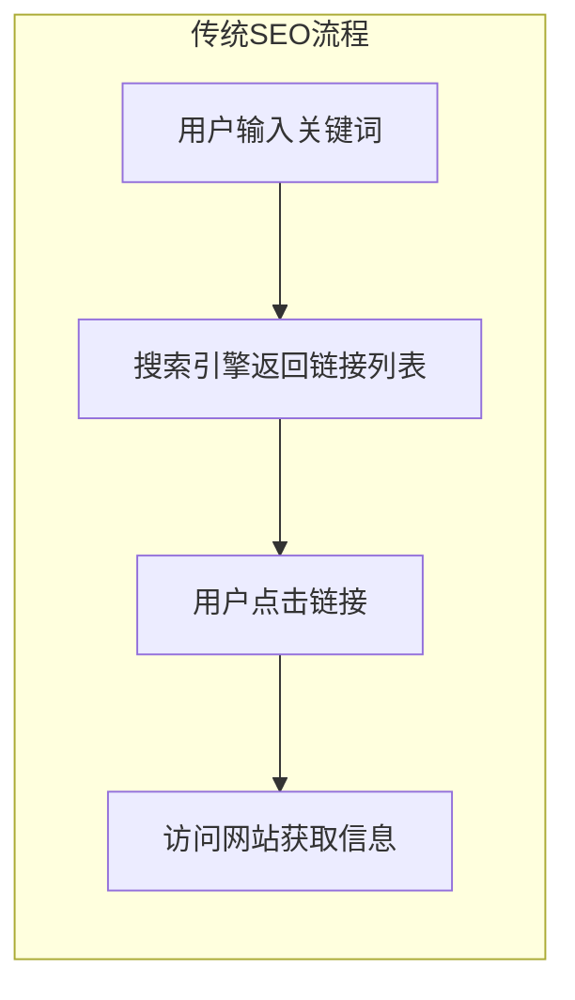
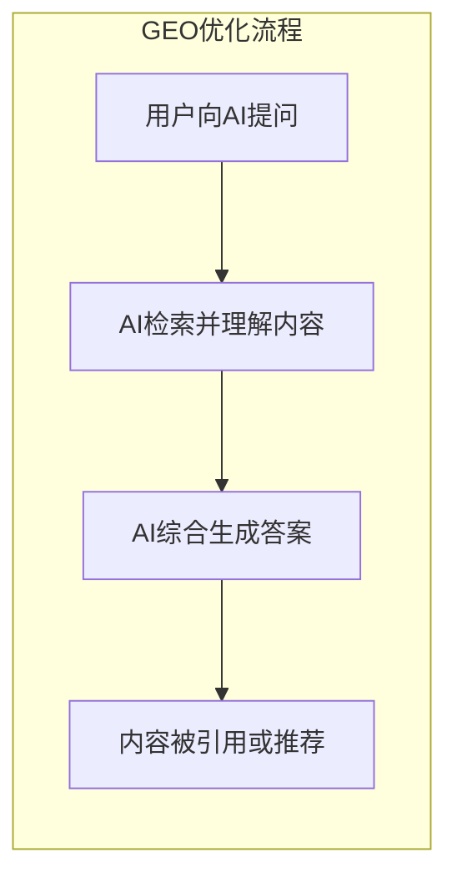
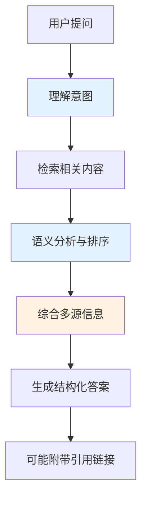
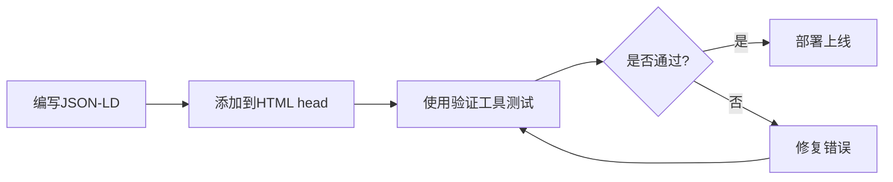
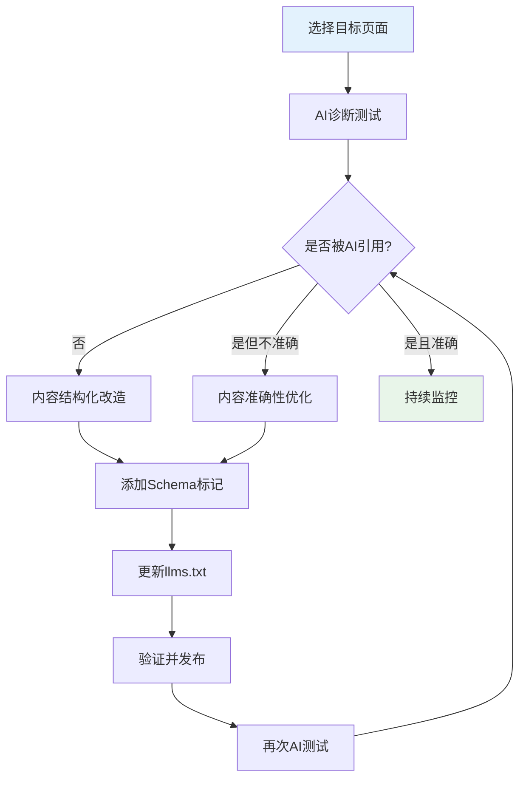
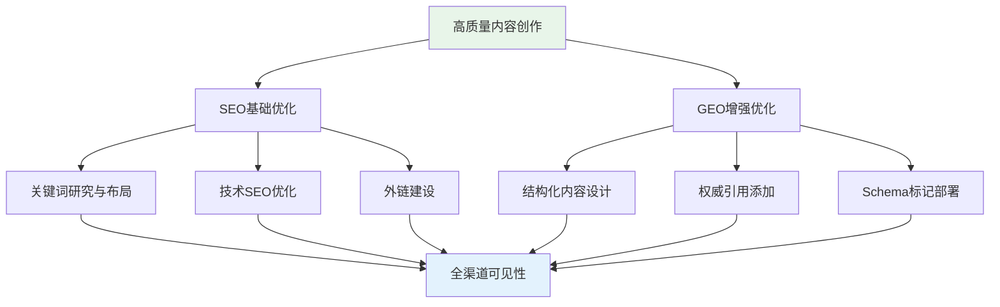

# 从SEO到GEO：AI时代的生成式引擎优化新范式

> 当用户从"搜索关键词点击链接"转向"直接向AI提问获取答案"，传统SEO正在被一种全新的优化思维所补充——GEO（生成式引擎优化）。本文将深入解析两者的核心差异与协同策略，帮助你在AI时代保持内容竞争力。
>
> 📌 **核心论文**：[GEO: Generative Engine Optimization](https://arxiv.org/abs/2311.09735)（arXiv:2311.09735）  
> 📌 **适合人群**：内容创作者、SEO从业者、数字营销人员


> 🎧 **更喜欢听？试试本文的音频版本**
<AudioPlayer 
  src="//pub.smallyoung.cn/course_slidev/geo-seo/零点击时代内容新玩法：SEO到GEO.m4a"
  \author="SmallYoung"
/>

<VideoPlayer 
  src="//pub.smallyoung.cn/course_slidev/geo-seo/SEO已死，GEO永生：AI搜索指南.mp4"
/>


<MindMapFloat title="GEO与SEO知识图谱">

```mindmap-data
# GEO与SEO
## SEO（搜索引擎优化）
- 目标：搜索排名
- 平台：Google/百度/Bing
- 核心：关键词与链接
- 指标：点击率与流量
## GEO（生成式引擎优化）
- 目标：AI引用推荐
- 平台：ChatGPT/Perplexity/Gemini
- 核心：结构化与权威性
- 指标：引用率与提及
## 两者关系
- GEO是SEO的延伸
- 共同基础：高质量内容
- 协同策略：双轨优化
```

</MindMapFloat>

## 1. 为什么你需要关注GEO？


想象一下这个场景：用户问ChatGPT"如何选择向量数据库？"，AI直接给出了详细的对比分析和推荐建议。用户满意地获得了答案，**但没有点击任何链接进入你的网站**。

这就是所谓的"零点击搜索"（Zero-Click Search）现象。根据研究数据，随着AI搜索引擎的普及，这种现象正在急剧增加：

| 搜索行为变化 | 影响 |
|-------------|------|
| 用户直接获取AI答案 | 传统网站流量下降 |
| AI综合多个来源生成回答 | 单一排名第一不再决定一切 |
| 对话式查询取代关键词搜索 | 长尾内容价值提升 |


> [!IMPORTANT]
> **核心问题**：如果你的内容不能被AI"看见"并引用，即使SEO做得再好，也可能在AI时代失去大量曝光机会。

这就是GEO（Generative Engine Optimization，生成式引擎优化）诞生的背景。

## 2. 基础概念：SEO与GEO的本质差异


### 2.1 什么是SEO？

**SEO（Search Engine Optimization，搜索引擎优化）** 是针对传统搜索引擎（如Google、百度、Bing）优化网站内容和结构的策略，目标是在搜索结果页面（SERP）中获得更高排名，吸引用户点击访问网站。



### 2.2 什么是GEO？

**GEO（Generative Engine Optimization，生成式引擎优化）** 是针对AI驱动的生成式搜索引擎（如ChatGPT、Perplexity、Google AI Overviews、Gemini）优化内容的策略，目标是让内容被AI理解、引用和推荐，直接出现在AI生成的答案中。




> [!NOTE]
> GEO这一概念首次由普林斯顿大学、乔治亚理工学院等机构的研究人员在2023年的论文《GEO: Generative Engine Optimization》中系统提出，论文证明GEO方法可以将内容在AI搜索中的可见性提升高达40%。

### 2.3 核心对比表


| 维度 | SEO（搜索引擎优化） | GEO（生成式引擎优化） |
|------|---------------------|----------------------|
| **优化目标** | 提高搜索排名，获取点击 | 被AI引用、整合到答案中 |
| **目标平台** | Google、百度、Bing等传统搜索引擎 | ChatGPT、Perplexity、Gemini等AI引擎 |
| **内容呈现** | 搜索结果显示链接列表 | AI直接生成结构化答案 |
| **价值信号** | 关键词密度、反向链接、技术健康度 | 内容质量(E-E-A-T)、语义理解、结构化数据 |
| **用户行为** | 点击链接 → 浏览网页 | 直接获取答案，可能不点击 |
| **核心指标** | 排名、有机流量、点击率(CTR) | AI引用频率、品牌提及率 |

## 3. 深入原理：AI如何"消费"你的内容

要做好GEO优化，首先需要理解AI搜索引擎处理内容的方式。

### 3.1 AI搜索的工作原理




与传统搜索引擎的"关键词匹配+链接排名"不同，AI搜索引擎具有以下特点：

| 处理方式 | 传统搜索引擎 | AI生成式引擎 |
|----------|-------------|-------------|
| 理解方式 | 关键词匹配 | 语义理解+上下文分析 |
| 内容使用 | 索引并排序展示 | 分块理解后综合生成 |
| 结果形式 | 链接列表 | 自然语言答案 |
| 来源处理 | 单独展示每个来源 | 融合多个来源生成新内容 |

### 3.2 AI引用内容的关键因素


根据研究论文和业界实践，AI倾向于引用具有以下特征的内容：

1. **权威性（Authority）**：来自可信来源、有充分证据支撑的内容
2. **结构化（Structure）**：清晰的标题层级、列表、表格，便于AI解析
3. **语义明确（Semantic Clarity）**：直接回答问题，无歧义表述
4. **专业术语（Technical Accuracy）**：使用行业标准术语
5. **时效性（Freshness）**：包含最新信息和数据

> [!TIP]
> **简单类比**：如果说SEO是让你的店铺在商业街上更显眼（排名靠前），那么GEO就是让AI导购员在推荐商品时优先提到你的品牌。

## 4. GEO优化的实战策略

以下是经过验证的GEO优化核心策略：

### 4.1 内容结构化优化


```markdown
# 好的结构化示例

## 问题：什么是向量数据库？

向量数据库是专门用于存储和检索向量（高维数值数组）的数据库系统。

### 核心特点
- **高效相似性搜索**：支持毫秒级的近似最近邻查询
- **多维度索引**：使用HNSW、IVF等专用索引算法
- **规模化存储**：支持数十亿级向量存储

### 典型应用场景
| 场景 | 说明 |
|------|------|
| 语义搜索 | 基于内容含义而非关键词匹配 |
| 推荐系统 | 计算用户与物品的相似度 |
| RAG应用 | 为LLM提供外部知识检索 |
```

### 4.2 权威性建设

| 策略 | 具体做法 |
|------|----------|
| 引用权威来源 | 链接到学术论文、官方文档、行业标准 |
| 添加统计数据 | 引用具体数字和研究结果 |
| 专家背书 | 引用行业专家观点或评论 |
| E-E-A-T优化 | 展示作者经验、专业资质 |

### 4.3 语义优化技巧

```python
# GEO优化的内容写作思路（伪代码示例）

def geo_optimized_content(topic):
    # 1. 开篇直接回答核心问题
    answer = f"简而言之，{topic}是..."
    
    # 2. 提供结构化的详细解释
    explanation = {
        "定义": "...",
        "工作原理": "...",
        "核心优势": ["优势1", "优势2", "优势3"],
        "应用场景": ["场景1", "场景2"]
    }
    
    # 3. 使用对比表格增强理解
    comparison_table = create_comparison_table()
    
    # 4. 添加权威引用
    citations = ["论文A (arXiv:xxxx)", "官方文档B"]
    
    return combine(answer, explanation, comparison_table, citations)
```

### 4.4 技术层面优化


| 技术手段 | 作用 |
|----------|------|
| Schema.org 结构化数据 | 帮助AI理解页面内容类型 |
| FAQ Schema | 标记问答对，方便AI提取 |
| HowTo Schema | 标记步骤说明内容 |
| llms.txt 文件 | 专门为LLM提供网站内容摘要 |

#### 4.4.1 Schema Markup 实现步骤

Schema.org 结构化数据是GEO优化的关键技术手段，通过JSON-LD格式帮助AI理解页面内容类型。

**Step 1: 选择合适的Schema类型**

| Schema类型 | 适用场景 | 说明 |
|------------|----------|------|
| `Article` | 博客文章、新闻 | 标记文章标题、作者、发布日期 |
| `FAQPage` | 常见问题页面 | 标记问答对，是GEO最有效的Schema之一 |
| `HowTo` | 教程、步骤指南 | 标记操作步骤，便于AI提取流程 |
| `Product` | 产品页面 | 标记产品信息、价格、评价 |
| `Organization` | 企业官网 | 标记公司信息，建立品牌实体 |

**Step 2: 编写JSON-LD代码**

以下是常用Schema的完整代码示例：

```html
<!-- FAQ Schema - 最适合GEO优化的Schema类型 -->
<script type="application/ld+json">
{
  "@context": "https://schema.org",
  "@type": "FAQPage",
  "mainEntity": [
    {
      "@type": "Question",
      "name": "什么是GEO（生成式引擎优化）？",
      "acceptedAnswer": {
        "@type": "Answer",
        "text": "GEO是Generative Engine Optimization的缩写，指针对AI驱动的生成式搜索引擎（如ChatGPT、Perplexity）优化内容的策略，目标是让内容被AI理解、引用和推荐。"
      }
    },
    {
      "@type": "Question",
      "name": "GEO和SEO有什么区别？",
      "acceptedAnswer": {
        "@type": "Answer",
        "text": "SEO关注传统搜索引擎排名和点击，GEO关注被AI引用和推荐。SEO侧重关键词和外链，GEO侧重内容结构化和权威性。"
      }
    }
  ]
}
</script>
```

```html
<!-- Article Schema - 适用于博客和技术文档 -->
<script type="application/ld+json">
{
  "@context": "https://schema.org",
  "@type": "Article",
  "headline": "GEO与SEO：从搜索引擎到AI引擎的内容优化新范式",
  "author": {
    "@type": "Person",
    "name": "SmallYoung",
    "url": "https://example.com/author/smallyoung"
  },
  "datePublished": "2026-01-04",
  "dateModified": "2026-01-04",
  "publisher": {
    "@type": "Organization",
    "name": "Your Website",
    "logo": {
      "@type": "ImageObject",
      "url": "https://example.com/logo.png"
    }
  },
  "description": "全面解析GEO与SEO的区别与联系，掌握AI时代内容优化的核心策略",
  "mainEntityOfPage": {
    "@type": "WebPage",
    "@id": "https://example.com/geo-seo-guide"
  }
}
</script>
```

```html
<!-- HowTo Schema - 适用于操作教程 -->
<script type="application/ld+json">
{
  "@context": "https://schema.org",
  "@type": "HowTo",
  "name": "如何进行GEO优化",
  "description": "通过5个步骤实现网站的GEO优化，提升AI搜索可见性",
  "step": [
    {
      "@type": "HowToStep",
      "name": "内容结构化",
      "text": "使用清晰的H2/H3标题层级，添加列表和表格"
    },
    {
      "@type": "HowToStep",
      "name": "添加Schema标记",
      "text": "为页面添加FAQPage、Article等结构化数据"
    },
    {
      "@type": "HowToStep",
      "name": "创建llms.txt",
      "text": "在网站根目录创建llms.txt文件，为AI提供内容索引"
    }
  ]
}
</script>
```

**Step 3: 部署并验证**



**验证工具推荐**：
- [Google Rich Results Test](https://search.google.com/test/rich-results) - 官方验证工具
- [Schema Markup Validator](https://validator.schema.org/) - Schema.org官方验证器

#### 4.4.2 llms.txt 配置指南


`llms.txt` 是一种新兴标准，类似于 `robots.txt`，专门为LLM提供网站内容索引和访问指引。

**Step 1: 创建文件**

在网站根目录创建 `llms.txt` 文件：

```bash
# 文件路径示例
https://yourdomain.com/llms.txt
```

**Step 2: 编写内容**

```markdown
# llms.txt - LLM Content Index
# 网站：example.com
# 更新日期：2026-01-04

## 网站概述
本站是一个技术博客，专注于AI、大模型和软件开发领域的技术分享。

## 核心内容索引

### 热门文章
- /docs/geo-seo-guide - GEO与SEO完整指南，适合数字营销人员
- /docs/rag-vector-database - 为什么RAG要使用向量数据库
- /docs/ai-agent-guide - AI Agent开发入门指南

### 主题分类
- 人工智能：/category/ai
- 大模型：/category/llm
- 向量数据库：/category/vector-db

## 权威来源声明
本站内容均基于学术论文、官方文档和实际项目经验编写。

## 联系方式
如需引用本站内容，请注明出处。
技术问题：contact@example.com
```

**Step 3: 扩展版本 llms-full.txt（可选）**

对于重要页面，可以提供完整的Markdown版本内容：

```markdown
# llms-full.txt
# 包含完整页面内容的版本

## /docs/geo-seo-guide

### 页面标题
GEO与SEO：从搜索引擎到AI引擎的内容优化新范式

### 核心内容摘要
GEO（生成式引擎优化）是针对AI搜索引擎的优化策略。
与传统SEO的主要区别：
- SEO关注排名，GEO关注AI引用
- SEO侧重关键词，GEO侧重结构化
- SEO追求点击，GEO追求推荐

### 关键定义
- GEO: Generative Engine Optimization
- 目标平台: ChatGPT, Perplexity, Google AI Overviews
- 核心论文: arXiv:2311.09735
```

> [!TIP]
> **实践建议**：目前 `llms.txt` 还是新兴标准，主要AI平台的支持程度不同。建议先创建基础版本，随着标准发展再逐步完善。

### 4.5 内容诊断与优化工具实操


在动手优化之前，先诊断现有内容的AI友好程度。

#### 4.5.1 AI可读性诊断步骤

**Step 1: 用AI测试你的内容**

直接向ChatGPT、Perplexity等AI询问与你内容相关的问题，观察：

```
测试问题示例：
- "什么是[你的核心主题]？"
- "[你的主题]的最佳实践有哪些？"
- "[产品A]和[产品B]有什么区别？"

观察要点：
✅ AI回答中是否提及你的品牌或内容？
✅ 引用的信息是否准确？
✅ 是否有来源链接指向你的网站？
```

**Step 2: 内容结构化评估**

| 评估项 | 优秀 | 及格 | 需改进 |
|--------|------|------|--------|
| 标题层级 | H1→H2→H3 清晰有序 | 基本有层级 | 无层级或混乱 |
| 核心答案 | 开篇即回答问题 | 中段才回答 | 需通读全文 |
| 列表使用 | ≥5个结构化列表 | 2-4个列表 | 几乎无列表 |
| 表格使用 | ≥3个对比表格 | 1-2个表格 | 无表格 |
| 代码示例 | 可运行+有注释 | 有代码 | 无代码 |

**Step 3: 权威性检查清单**

```markdown
## 权威性自查

### 引用来源（至少勾选2项）
- [ ] 学术论文（arXiv、IEEE等）
- [ ] 官方文档（产品官方文档）
- [ ] 行业报告（Gartner、McKinsey等）
- [ ] 权威媒体（技术博客、官方Blog）

### 作者信息
- [ ] 显示作者姓名
- [ ] 提供作者简介或资质
- [ ] 链接到作者主页

### 时效性
- [ ] 包含当前年份信息
- [ ] 数据标注来源和时间
- [ ] 定期更新过时内容
```

#### 4.5.2 实用工具推荐

| 工具 | 用途 | 费用 |
|------|------|------|
| **Perplexity** | 测试内容在AI搜索中的表现 | 免费/Pro |
| **ChatGPT** | 测试内容被AI理解的程度 | 免费/Plus |
| **Google Rich Results Test** | 验证Schema标记 | 免费 |
| **Screaming Frog** | 批量检查页面结构化数据 | 免费(500页)/付费 |
| **Ahrefs/SEMrush** | 监控传统SEO表现 | 付费 |

### 4.6 从零开始的GEO优化实操流程


以下是一个完整的GEO优化工作流程：



**具体操作步骤**：

| 步骤 | 操作 | 产出 |
|------|------|------|
| 1. 选择目标 | 选择高价值页面（流量大或转化重要） | 优化页面清单 |
| 2. AI诊断 | 向AI提问相关问题，记录回答 | 诊断报告 |
| 3. 内容改造 | 重构标题层级，添加表格和列表 | 优化后的内容 |
| 4. 权威性增强 | 添加权威引用和数据来源 | 增强版内容 |
| 5. Schema部署 | 添加JSON-LD结构化数据 | 结构化标记代码 |
| 6. llms.txt更新 | 在索引文件中添加该页面 | 更新的llms.txt |
| 7. 验证测试 | 使用Google工具验证Schema | 验证通过截图 |
| 8. 效果追踪 | 定期用AI测试，记录变化 | 追踪报告 |

> [!IMPORTANT]
> **核心原则**：GEO优化不是一次性工作，而是持续迭代的过程。建议每月至少进行一次AI可见性检测，并根据AI平台的更新调整策略。

## 5. 最佳实践与常见误区

### 5.1 GEO优化检查清单

| 检查项 | 要求 | 自查 |
|--------|------|------|
| 开篇直接回答 | 在导语中明确回答核心问题 | ☐ |
| 权威引用 | 至少2个学术论文或官方文档引用 | ☐ |
| 结构化元素 | 包含表格、列表、步骤（至少5个） | ☐ |
| 信息密度 | 每段都有实质内容，无水文 | ☐ |
| 专业术语 | 使用行业标准术语 | ☐ |
| 时效性 | 包含最新年份的信息（如2025年数据） | ☐ |
| Schema标记 | 至少添加一种结构化数据 | ☐ |
| AI测试 | 用AI搜索验证过内容可见性 | ☐ |

### 5.2 常见误区与正确做法


| 误区 | 正确做法 |
|------|----------|
| 为了GEO牺牲内容准确性 | 质量永远第一，AI能识别低质量内容 |
| 关键词堆砌 | 注重语义自然，AI理解上下文而非关键词密度 |
| 只关注GEO忽略SEO | 两者应协同，强大的SEO基础有利于GEO |
| 忽视负面信息管理 | AI倾向平衡呈现，需主动回应质疑 |
| 一次优化永久有效 | 持续更新内容，保持时效性 |
| 只添加Schema不优化内容 | Schema是锦上添花，优质内容才是根本 |

> [!CAUTION]
> **重要提醒**：AI模型能够识别操纵行为。过度优化（如隐藏关键词、内容农场策略）不仅无效，还可能被AI系统降权。

### 5.3 SEO与GEO的协同策略



> [!TIP]
> **实践建议**：不要将GEO视为SEO的替代品，而是将其作为补充。一个拥有强大SEO基础的网站，在GEO优化方面往往也更容易取得成功。

## 6. 总结：AI时代的内容优化新思维


GEO并非要取代SEO，而是在AI搜索时代对传统优化策略的必要延伸。核心转变在于：

| 从 | 到 |
|----|----|
| 以排名为中心 | 以被推荐为目标 |
| 关键词匹配思维 | 语义理解思维 |
| 追求点击流量 | 追求品牌曝光与引用 |
| 单一平台优化 | 多平台全渠道优化 |

**一句话总结各核心概念**：

| 概念 | 一句话解释 |
|------|-----------|
| SEO | 让搜索引擎更容易找到并展示你的内容链接 |
| GEO | 让AI引擎更容易理解、引用和推荐你的内容 |
| E-E-A-T | 内容的经验、专业、权威、可信四大质量维度 |
| 零点击搜索 | 用户直接从AI获取答案而不访问原网站 |
| 结构化数据 | 帮助机器理解内容类型和含义的标准化标记 |
| llms.txt | 专门为LLM提供网站内容索引的新兴标准文件 |

> [!IMPORTANT]
> **行动建议**：现在就开始审视你的核心内容，问自己：这篇内容能被AI理解吗？AI会在回答用户问题时引用它吗？如果答案是否定的，是时候开始GEO优化了。

## 7. 参考资料

| 资料 | 作者/机构 | 说明 |
|------|-----------|------|
| [GEO: Generative Engine Optimization](https://arxiv.org/abs/2311.09735) | Murahari et al. (普林斯顿大学等) | GEO概念的奠基性论文，证明GEO方法可提升40%可见性 |
| [What is Generative Engine Optimization](https://neilpatel.com/blog/generative-engine-optimization/) | Neil Patel | 知名SEO专家的GEO入门指南 |
| [GEO: A Complete Guide](https://aioseo.com/generative-engine-optimization/) | AIOSEO | 全面的GEO实操教程，包含工具推荐 |
| [Schema.org 官方文档](https://schema.org/) | Schema.org | 结构化数据标准规范 |
| [Google Structured Data Guidelines](https://developers.google.com/search/docs/appearance/structured-data/intro-structured-data) | Google | Google官方结构化数据指南 |
| [llms.txt 标准提案](https://llmstxt.org/) | 社区项目 | llms.txt文件标准说明 |

