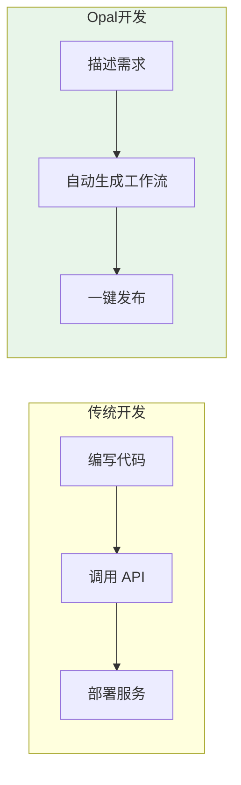
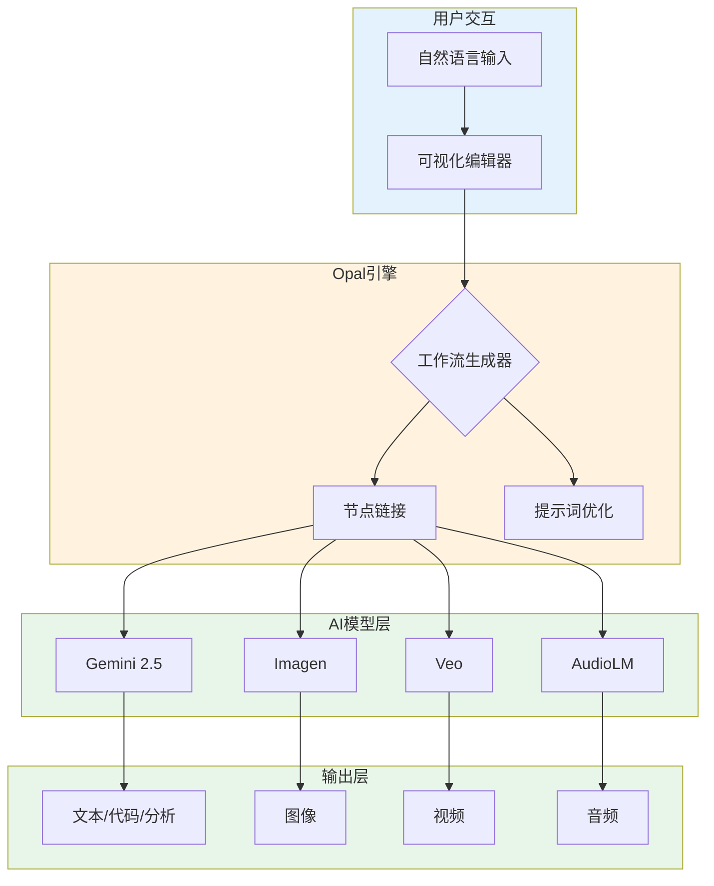
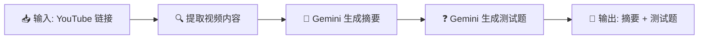
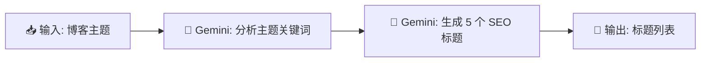
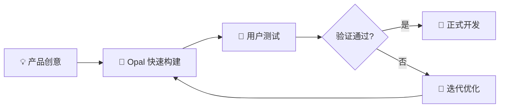
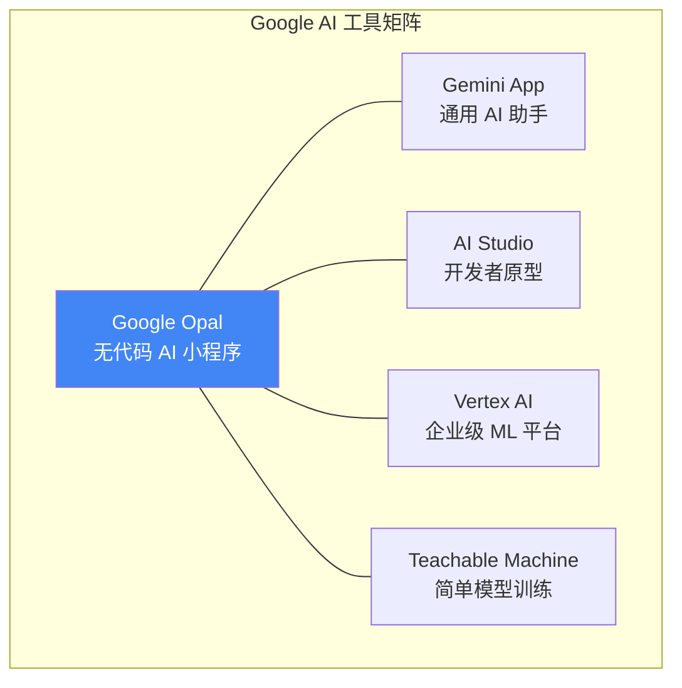
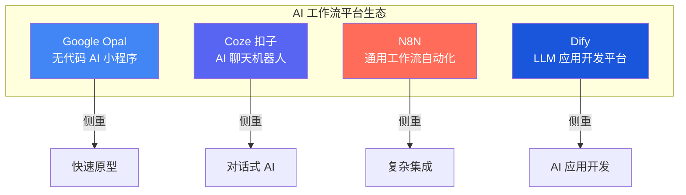
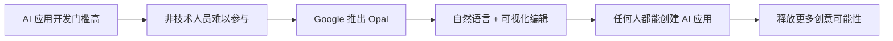

# Google Opal 入门指南：零代码构建 AI 应用的完整教程

> 想用 AI 创建一个自动生成营销文案的工具，却不会写代码？Google Opal 让你用自然语言描述需求，几分钟就能构建出实用的 AI 小程序。
>
> 📌 **官方来源**：[Google Labs Opal](https://labs.google/)  
> 📌 **适合人群**：AI 初学者、内容创作者、营销人员、小型企业主


> 🎧 **更喜欢听？试试本文的音频版本**
<AudioPlayer 
  src="//pub.smallyoung.cn/course_slidev/google-opal/用聊天创建AI应用_Opal.m4a"
  author="SmallYoung"
/>

<VideoPlayer 
  src="//pub.smallyoung.cn/course_slidev/google-opal/Google_Opal_入门指南.mp4"
/>

<MindMapFloat title="Google Opal 知识图谱">

```mindmap-data
# Google Opal
## 核心概念
- 无代码 AI 应用构建器
- 自然语言交互（Vibe Coding）
- 可视化工作流编辑器
## 底层技术
- Gemini（文本/多模态）
- Imagen（图像生成）
- Veo（视频生成）
## 核心功能
- 拖拽式流程设计
- 模板库与 Remix
- 即时发布与分享
## 应用场景
- 内容自动生成
- 工作效率提升
- 快速原型验证
```

</MindMapFloat>

## 1. 为什么需要了解 Google Opal？


想象这样一个场景：你是一名自媒体博主，每天需要为 YouTube 视频撰写 SEO 优化的描述文案、生成社交媒体推广图片、总结视频内容要点。这些工作重复且耗时，你希望有一个 AI 工具能帮你自动完成——但你不会编程。

传统上，实现这样的自动化流程需要：
- 学习 Python 或 JavaScript 编程
- 了解 API 调用和数据处理
- 部署服务器或使用云平台


**而 Google Opal 的出现改变了这一切**。它让你只需要用日常语言描述需求，就能创建出功能完整的 AI 小程序。

## 2. 什么是 Google Opal？


Google Opal 是 Google Labs 于 **2025 年 7 月**推出的实验性**无代码 AI 应用构建平台**。它的核心理念是：**让任何人都能用自然语言创建 AI 驱动的应用程序**。

### 2.1 核心概念对比


| 概念 | 定义 | 生活类比 |
|------|------|----------|
| **无代码开发** | 无需编写代码即可创建应用 | 像用乐高积木搭建，而非自己铸造零件 |
| **Vibe Coding** | 用自然语言描述应用逻辑 | 像向助手口述需求，而非撰写详细说明书 |
| **可视化工作流** | 将应用逻辑以流程图形式展示 | 像思维导图一样直观呈现处理步骤 |

### 2.2 Opal 与其他工具的区别



| 工具类型 | 代表产品 | 技术门槛 | 适用场景 |
|----------|----------|----------|----------|
| **传统编程** | Python, JavaScript | 高 | 复杂企业级应用 |
| **低代码平台** | Bubble, AppSheet | 中 | 标准化业务应用 |
| **Opal（无代码 AI）** | Google Opal | 低 | AI 驱动的小程序和工作流 |
| **专业 ML 平台** | Vertex AI | 高 | 机器学习模型训练和部署 |

> [!IMPORTANT]
> Google Opal 的定位是**快速创建 AI 小程序和工作流原型**，而非构建上架应用商店的完整 App。它更适合验证创意、内部工具和自动化流程。

## 3. Google Opal 的工作原理


### 3.1 核心架构

Google Opal 的底层由 Google 强大的 AI 模型驱动，形成了一个完整的多模态 AI 工作流引擎。



### 3.2 工作流程详解

当你使用 Google Opal 时，背后发生的是：

**第一步：自然语言解析**
```
用户输入：「创建一个工具，用户输入 YouTube 链接后，生成视频摘要和 5 道测试题」
```

**第二步：Opal 自动生成工作流**


**第三步：用户可视化编辑**
- 点击任意节点修改提示词
- 拖拽添加新节点（如生成 PDF）
- 调整节点连接顺序

**第四步：即时测试和发布**
- 输入测试数据验证结果
- 生成分享链接，设置访问权限

> [!TIP]
> Opal 会自动保存编辑历史，你可以随时回溯到之前的版本。

## 4. 实战：创建你的第一个 Opal 应用

### 4.1 访问 Google Opal

1. 打开浏览器，访问 [opal.google](https://opal.google) 或 [opal.withgoogle.com](https://opal.withgoogle.com)
2. 使用 Google 账户登录
3. 注意：Opal 已向全球 160+ 个国家开放（截至 2025 年 11 月）

### 4.2 创建内容生成工具


**目标**：创建一个博客标题生成器，输入主题后自动生成 5 个 SEO 优化的标题。

**第一步：开始创建**
```
点击 "Create New" 或选择 Gallery 中的模板 → 点击 "Remix" 自定义
```

**第二步：描述应用功能**
```
在提示框中输入：
「创建一个博客标题生成器。用户输入一个主题后，生成 5 个符合 SEO 最佳实践的
博客标题。每个标题需要包含数字、引发好奇心、且长度在 60 字符以内。」
```

**第三步：查看和编辑工作流**

Opal 会自动生成如下工作流：



**第四步：测试应用**

在右侧面板输入测试数据：
```
测试输入：人工智能在教育中的应用
```

预期输出：
```
1. 5 个 AI 正在重塑课堂的方式，第 3 个最惊人
2. 2026 年教育工作者必知的 7 大 AI 工具
3. AI 助教 vs 真人老师：谁更能提高学生成绩？
4. 从零开始：3 步用 AI 打造个性化学习体验
5. 为什么 85% 的学校正在引入 AI？真相揭秘
```

**第五步：发布和分享**

1. 点击 "Share app" 或 "Publish"
2. 选择访问权限：公开 或 限制特定 Google 账户
3. 复制分享链接，发送给需要使用的人

### 4.3 代码示例：理解 Opal 工作流的等效代码

虽然 Opal 无需编程，但了解等效代码有助于理解其工作原理：

```python
# Opal 工作流的等效 Python 代码（使用 Gemini API）
from google.generativeai import GenerativeModel

def generate_blog_titles(topic: str) -> list[str]:
    """
    使用 Gemini 生成 SEO 优化的博客标题
    
    Args:
        topic: 博客主题
    
    Returns:
        5 个 SEO 优化的标题列表
    """
    model = GenerativeModel("gemini-2.5-flash")
    
    prompt = f"""
    为以下主题生成 5 个符合 SEO 最佳实践的博客标题：
    主题：{topic}
    
    要求：
    - 包含数字
    - 引发好奇心
    - 长度在 60 字符以内
    """
    
    response = model.generate_content(prompt)
    titles = response.text.split("\n")
    return titles

# 使用示例
if __name__ == "__main__":
    titles = generate_blog_titles("人工智能在教育中的应用")
    for title in titles:
        print(title)
```

> [!NOTE]
> Opal 的价值在于将上述代码逻辑抽象为可视化节点，让非程序员也能构建类似功能。

## 5. 典型应用场景

### 5.1 内容创作自动化


| 应用类型 | 功能描述 | 使用的 AI 模型 |
|----------|----------|----------------|
| YouTube 描述生成器 | 自动生成 SEO 优化的视频描述 | Gemini |
| 社交媒体配图 | 根据文案生成匹配的宣传图 | Gemini + Imagen |
| 博客文章草稿 | 从大纲自动扩展为完整文章 | Gemini |
| Newsletter 编辑器 | 汇总本周新闻生成简报 | Gemini |

### 5.2 工作效率提升


| 应用类型 | 功能描述 | 使用的 AI 模型 |
|----------|----------|----------------|
| 邮件草稿生成器 | 根据要点自动撰写正式邮件 | Gemini |
| 会议纪要总结 | 从录音/文本提取关键决策和待办 | Gemini |
| 文档审阅助手 | 检查文档风格一致性和语法错误 | Gemini |
| 销售话术生成器 | 根据产品特性生成销售脚本 | Gemini |

### 5.3 快速原型验证



> [!TIP]
> 使用 Opal 进行原型验证，可以在投入大量开发资源前快速获取用户反馈。

## 6. 最佳实践与常见误区


### 6.1 使用最佳实践

| 序号 | 最佳实践 | 说明 |
|------|----------|------|
| ① | **描述要具体** | 「生成 5 个标题，每个 60 字以内」优于「生成一些标题」 |
| ② | **分步骤设计** | 复杂任务拆分为多个节点，便于调试和优化 |
| ③| **善用模板** | 从 Gallery 中选择相似模板，在此基础上 Remix |
| ④ | **迭代测试** | 每修改一次就测试，快速发现问题 |
| ⑤ | **设置访问权限** | 涉及敏感数据时，限制分享范围 |

### 6.2 常见误区纠正

| 误区 | 正确理解 |
|------|----------|
| Opal 可以开发完整 App | Opal 定位是小程序和工作流，不适合上架应用商店的复杂应用 |
| Vibe Coding 可以替代编程 | Vibe Coding 是快速原型工具，生产级应用仍需专业开发 |
| Opal 生成的内容一定准确 | AI 生成内容需要人工审核，特别是专业领域信息 |
| 工作流越复杂越好 | 保持简洁，复杂逻辑可能导致不可预测的输出 |

> [!CAUTION]
> Google Opal 目前仍处于**实验阶段（Beta）**，功能和稳定性可能随时变化。不建议用于关键业务流程。

## 7. Google Opal 与其他 AI 工具的对比


### 7.1 Google 生态系统内的定位



| 工具 | 目标用户 | 技术门槛 | 核心能力 |
|------|----------|----------|----------|
| **Google Opal** | 创作者、营销人员 | 无 | 无代码 AI 工作流构建 |
| **Gemini App** | 所有用户 | 无 | 通用对话和任务处理 |
| **AI Studio** | 开发者 | 低-中 | API 测试和原型开发 |
| **Vertex AI** | 数据科学家、ML 工程师 | 高 | 端到端 ML 生命周期管理 |
| **Teachable Machine** | 教育者、初学者 | 无 | 简单图像/声音/姿态分类 |

### 7.2 与 AI 工作流构建平台对比

除了 Google 生态系统内的工具，市面上还有多个优秀的 AI 工作流构建平台。以下是 Google Opal 与 **Coze**、**N8N**、**Dify** 等主流平台的详细对比。

#### 平台定位与核心特点



| 平台 | 开发商 | 核心定位 | 开源情况 |
|------|--------|----------|----------|
| **Google Opal** | Google Labs | 无代码 AI 小程序构建器 | 闭源（Beta） |
| **Coze（扣子）** | 字节跳动 | AI 聊天机器人创建平台 | 2025 年部分开源 |
| **N8N** | N8N GmbH | 通用工作流自动化平台 | 开源（Fair-code） |
| **Dify** | LangGenius | LLM 应用开发平台 | 开源（Apache 2.0） |

#### 功能维度对比

| 功能维度 | Google Opal | Coze | N8N | Dify |
|----------|-------------|------|-----|------|
| **自然语言创建** | ✅ Vibe Coding | ✅ 提示词配置 | ✅ AI 工作流构建器 | ⚠️ 有限支持 |
| **可视化工作流** | ✅ 节点式流程图 | ✅ 拖拽式画布 | ✅ 节点式编辑器 | ✅ 可视化编排 |
| **多模态 AI** | ✅ 文本/图像/视频/音频 | ✅ 文本/图像 | ⚠️ 通过集成实现 | ⚠️ 主要文本 |
| **知识库（RAG）** | ❌ 暂不支持 | ✅ 内置支持 | ⚠️ 需配置 | ✅ 原生支持 |
| **多 Agent 协作** | ❌ 暂不支持 | ✅ 支持 | ✅ LangChain 集成 | ✅ 支持 |
| **自定义代码** | ❌ 不支持 | ⚠️ 插件形式 | ✅ JS/Python | ✅ 代码节点 |
| **自托管部署** | ❌ 仅云端 | ⚠️ 企业版 | ✅ 完全支持 | ✅ Docker/K8s |
| **API 发布** | ⚠️ 分享链接 | ✅ API/多平台 | ✅ Webhook/API | ✅ API 端点 |

> [!NOTE]
> ✅ = 完全支持 | ⚠️ = 部分支持或需额外配置 | ❌ = 不支持

#### 技术门槛与目标用户

| 平台 | 技术门槛 | 最适合用户 | 典型用例 |
|------|----------|------------|----------|
| **Google Opal** | ⭐ 极低 | 内容创作者、营销人员 | 内容生成器、快速原型 |
| **Coze** | ⭐⭐ 低 | 产品经理、运营人员 | 客服机器人、对话式应用 |
| **N8N** | ⭐⭐⭐⭐ 较高 | 开发者、技术团队 | 复杂业务流程自动化 |
| **Dify** | ⭐⭐⭐ 中等 | 开发者、AI 产品经理 | LLM 驱动的生产级应用 |

#### 收费模式对比

| 平台 | 免费额度 | 收费模式 | 成本特点 |
|------|----------|----------|----------|
| **Google Opal** | 免费使用（Beta） | 未定价 | 当前完全免费 |
| **Coze** | 免费额度较高 | 按用量计费 | 入门成本低 |
| **N8N** | 自托管免费 | 执行次数计费 | 复杂流程成本优势明显 |
| **Dify** | 自托管免费 | Token/API 调用 | 自托管成本可控 |

#### 各平台核心优势


**Google Opal 的独特优势**：
- 🎯 **极致简单**：真正的"说即得"体验，无需理解任何技术概念
- 🤖 **Google AI 全家桶**：原生集成 Gemini、Imagen、Veo 等最新模型
- ⚡ **秒级发布**：从创意到可分享应用只需几分钟

**Coze 的独特优势**：
- 💬 **对话式 AI 专精**：为聊天机器人场景深度优化
- 🔌 **丰富插件生态**：400+ 预构建插件，扩展能力强
- 📱 **多平台发布**：一键部署到微信、Discord、Telegram 等

**N8N 的独特优势**：
- 🔧 **极致灵活**：支持自定义代码，可集成任何 API
- 🏠 **完全自托管**：数据完全自主可控
- 💰 **成本优势**：复杂流程按执行次数计费，而非步骤数

**Dify 的独特优势**：
- 🏗️ **生产级就绪**：为构建正式产品而设计
- 📊 **完善的可观测性**：内置日志、监控、调试工具
- 🔄 **RAG 原生支持**：知识库管理开箱即用


> [!TIP]
> **如何选择？**
> - 需要**快速验证 AI 创意** → Google Opal
> - 需要**构建对话机器人** → Coze
> - 需要**复杂业务自动化** → N8N
> - 需要**生产级 LLM 应用** → Dify

### 7.3 与其他无代码工具对比

| 工具 | 核心优势 | 局限性 |
|------|----------|--------|
| **Google Opal** | 深度集成 Google AI 模型，多模态能力强 | 仍在 Beta，功能相对基础 |
| **Zapier** | 连接 8000+ 应用，自动化能力强 | AI 能力相对弱，侧重流程自动化 |
| **Bubble** | 可构建完整 Web 应用 | 学习曲线较陡，侧重应用开发 |
| **Glide** | 数据驱动开发，上手快 | AI 能力有限，依赖表格数据 |

## 8. 总结


> **一句话理解 Google Opal**：它是用自然语言"说"出你的 AI 应用，而不是"写"出代码。

### 核心要点回顾

| 概念 | 一句话解释 |
|------|------------|
| **Google Opal** | Google Labs 推出的无代码 AI 小程序构建平台 |
| **Vibe Coding** | 用自然语言描述应用逻辑的开发方式 |
| **可视化工作流** | 将 AI 处理步骤以流程图形式展示和编辑 |
| **Remix** | 基于现有模板修改创建自己的应用 |
| **多模态 AI** | 支持文本、图像、视频、音频等多种 AI 能力 |

### 因果链条




## 9. 参考资料

| 资料 | 作者/机构 | 说明 |
|------|-----------|------|
| [Google Labs Opal 官方页面](https://labs.google/) | Google | Opal 产品主页和入口 |
| [Google Opal 发布博客](https://developers.googleblog.com/) | Google Developers | 官方发布公告和更新 |
| [Opal 使用教程 - DataCamp](https://www.datacamp.com/) | DataCamp | 详细的入门教程 |
| [What is Google Opal - InfoQ](https://www.infoq.com/) | InfoQ | 技术解读和分析 |
| [Gemini 模型文档](https://ai.google.dev/docs) | Google AI | Opal 底层模型的技术文档 |

---

> **下一步行动**：访问 [opal.google](https://opal.google) 开始创建你的第一个 AI 小程序！
