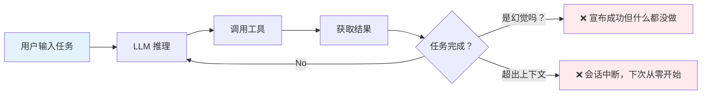
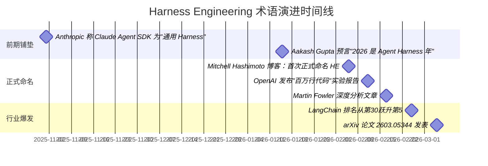
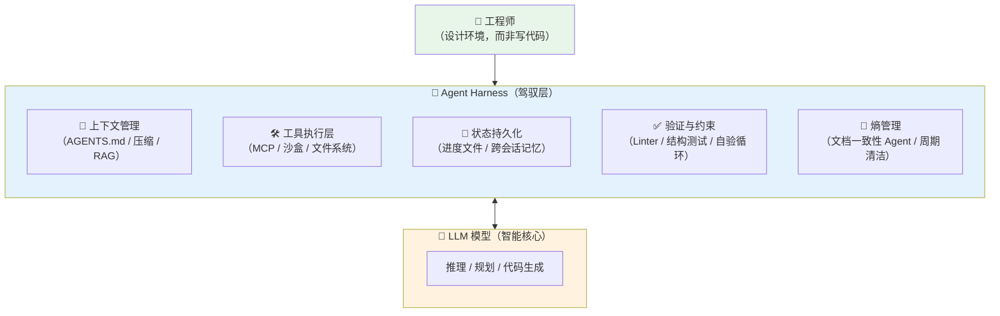
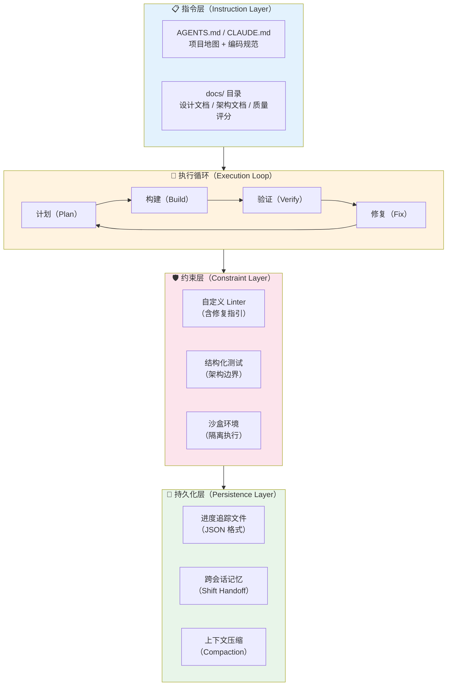
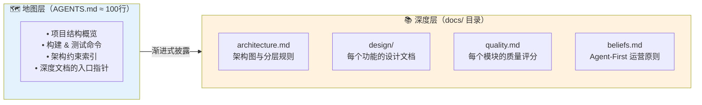
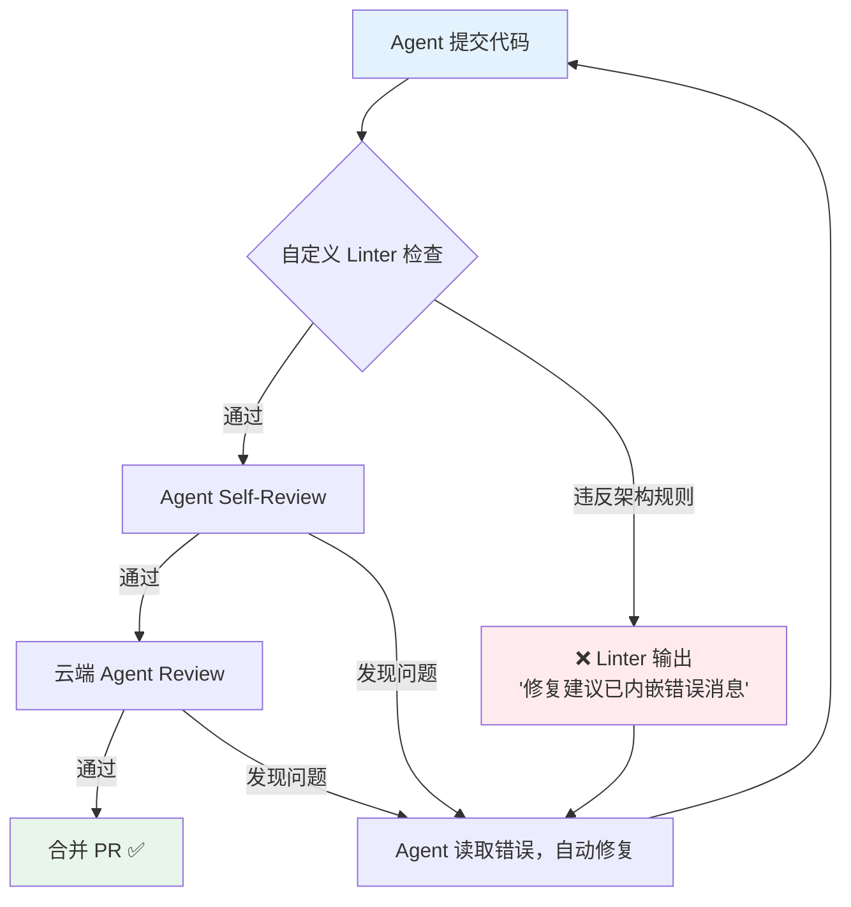
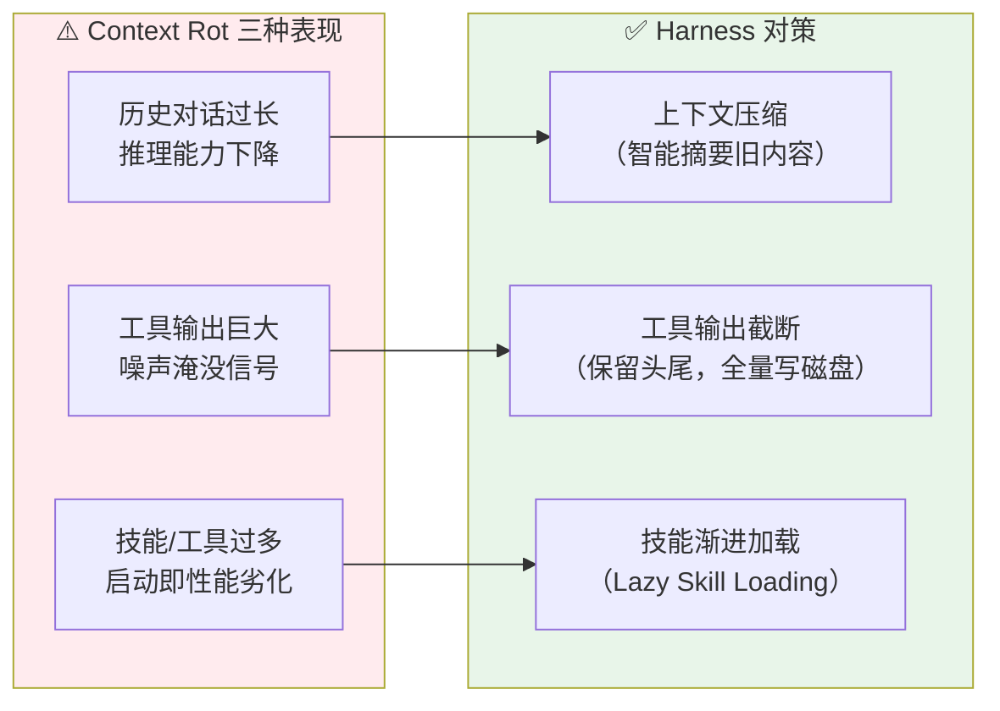
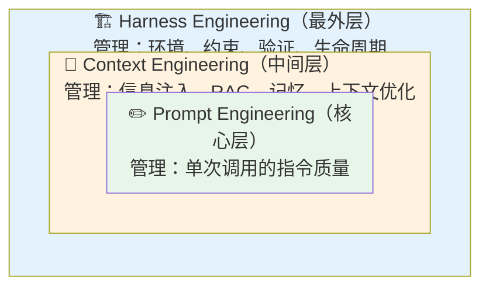
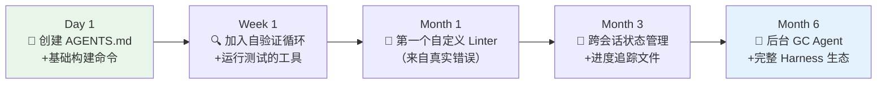
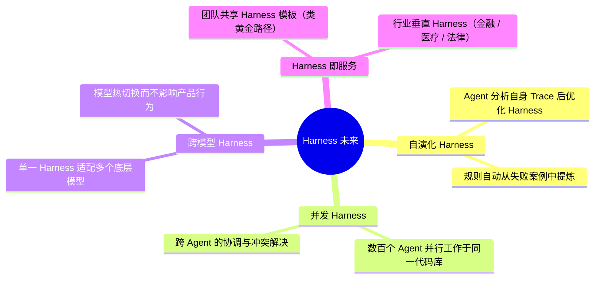

# Harness Engineering：重塑Al Agent时代的软件工程

> 模型越来越强，但决定 AI Agent 好坏的最大变量，往往不是模型本身，而是模型被放在什么样的"环境"里运行。2026年2月，一种正式命名为 **Harness Engineering（驾驭工程）** 的工程实践横扫开发者社区——它解释了为什么同一个模型在不同系统里表现天壤之别，也重新定义了软件工程师在 AI 时代的职责边界。本文从零到生产，系统讲解 Harness Engineering 的来龙去脉、核心架构与实战方法。
>
> 📌 **核心论文**：[Building Effective AI Coding Agents for the Terminal: Scaffolding, Harness, Context Engineering, and Lessons Learned](https://arxiv.org/abs/2603.05344)（arXiv:2603.05344）
>
> 📌 **适合人群**：AI 应用开发者、Coding Agent 实践者、对 LLM 工程化感兴趣的软件工程师


> 🎧 **更喜欢听？试试本文的音频版本**
<AudioPlayer 
  src="//pub.smallyoung.cn/course_slidev/harness-engineering/驾驭工程防止AI_Agent失控.m4a"
  author="SmallYoung"
/>

<VideoPlayer 
  src="//pub.smallyoung.cn/course_slidev/harness-engineering/驾驭工程：驯服AI智能体.mp4"
/>

<MindMapFloat title="Harness Engineering 知识图谱">

```mindmap-data
# Harness Engineering
## 为什么需要
- LLM 天生无状态，每次会话从零开始
- 上下文腐烂（Context Rot）问题
- 提示词/上下文工程的边界
- 同模型不同环境性能天壤之别
## 是什么
- Agent = Model + Harness 公式
- 架构定义：模型以外的一切
- 与提示词工程/上下文工程的边界
- Hashimoto 核心理念：永不重蹈覆辙
## 三大支柱
- 上下文工程：AGENTS.md 知识地图
- 架构约束：自定义 Linter + 结构测试
- 熵管理：垃圾回收 Agent 周期清洁
## 核心组件
- 工具执行层（Tool Dispatch）
- 状态持久化（State Persistence）
- 自我验证循环（Self-Verification Loop）
- 上下文压缩（Compaction）
## 实战与演进
- 渐进构建：从 AGENTS.md 起步
- 可撕裂原则（Rippable Harness）
- 模型进化时拆除脚手架
- Manus 五次重构的教训
```

</MindMapFloat>

## 关于本文档

本文系统梳理 Harness Engineering 从概念诞生到工程实践的完整知识体系，覆盖其与 Prompt Engineering、Context Engineering 的本质区别，以及三大支柱的设计方法与代码实现。

- ✅ 理解 Harness Engineering 为何在 2026 年成为最热工程范式
- ✅ 掌握"Agent = Model + Harness"的核心公式与架构组件
- ✅ 学会 Harness 三大支柱：上下文工程、架构约束、熵管理
- ✅ 看懂 OpenAI 百万行代码实验与 LangChain 排名跃升背后的 Harness 设计
- ✅ 获取可直接落地的 AGENTS.md 模板与最佳实践

## 1. 为什么"更强的模型"不够用？

### 1.1 一个价值 $50,000 的教训

想象一下：你部署了一个无人监控的 AI Agent，让它在后台自主处理任务。凌晨三点，Agent 因某个边界条件陷入了一个无限重试循环，每分钟都在不断调用付费 API。当你早上打开账单的时候，已经烧掉了 **5 万美元**。

这不是假设场景。技术播客 *Vanishing Gradients* 的一集节目《Why Agent Context Isn't Enough》真实记录了这起事故，并点出了一个关键悖论：**上下文窗口的扩大，并不等于 Agent 性能的线性提升。** 即便模型理论上支持 100 万 Token 的上下文，性能衰减往往在 25.6 万 Token 左右便已出现。这种现象被称为 **Context Rot（上下文腐烂）**——随着对话历史和工具输出不断堆积，模型的指令跟随能力会显著下降。

更深层的问题在于：LLM 天生是**无状态**的（Stateless）。每一次新会话对它来说都是白板一张，不记得上次做了什么、犯了什么错。这意味着：

- 你无法依靠"让模型学聪明了"来解决系统性失败
- 同样的错误会在不同会话中一遍遍重演
- 没有外部机制，你永远无法"防止 Agent 做不该做的事"



> [!IMPORTANT]
> 上下文工程（Context Engineering）可以告诉 Agent **"知道什么"**，但无法阻止 Agent **"做不该做的事"**。在环境层面的约束与验证，才是系统可靠性的真正来源。


### 1.2 "提示词/上下文工程"的边界在哪里？

在 Harness Engineering 出现之前，开发者经历了两个工程范式的演进：

| 范式 | 核心问题 | 主要手段 | 能解决什么 | 解决不了什么 |
|------|---------|---------|----------|------------|
| **Prompt Engineering** | 怎么"说"得好 | 精心设计指令、少样本示例 | 单次调用质量 | 多步骤任务的一致性 |
| **Context Engineering** | "知道"什么 | RAG、MCP、Memory、AGENTS.md | 信息检索与注入 | 架构级的行为约束 |
| **Harness Engineering** | 在什么"环境"里做事 | 约束、验证、反馈回路、状态管理 | 系统可靠性与长期维护性 | ——（当前最前沿） |

Martin Fowler 在他的分析文章中一针见血地总结：Harness 包含上下文工程，但走得更远——它管理的是**工具执行、状态持久化、架构约束和垃圾回收**，让 Agent 生成的代码在架构层面保持长期一致性。


### 1.3 Harness Engineering 的诞生时刻

这个术语的历史出奇地短暂，但崛起极其迅速：



2026 年 2 月 5 日，HashiCorp 联合创始人、Terraform 创作者 **Mitchell Hashimoto** 在个人博客中写下了这个定义：

> "每当你发现 Agent 犯了一个错误，你就花时间设计一个解决方案，使 Agent **永远不再犯同样的错误**。我称之为 Harness Engineering。"

六天后，OpenAI 发布了历史性的实验报告：一个 3 人工程师团队，用 5 个月时间，借助 Codex Agent 构建了超过 **100 万行代码**的产品，**零行人工手写代码**，人均日合并 3.5 个 PR，效率约为传统模式的 10 倍。这份报告的标题直接用上了这个新词：*Harness Engineering: Leveraging Codex in an Agent-First World*。

## 2. Agent = Model + Harness：核心架构拆解

### 2.1 Harness 的本质定义

理解 Harness Engineering 最重要的公式只有一个：

> **Agent = Model + Harness**

LangChain 工程师 Vivek Trivedy 给出了最精炼的定义：**"如果你不是模型，你就是 Harness。"** Harness 是围绕 LLM 的一切代码、配置和执行逻辑——状态管理、工具调度、反馈回路、验证机制、上下文压缩……每一样都属于 Harness 的范畴。



> [!NOTE]
> 这个架构的精髓在于：**模型提供智能，Harness 让智能有用。** 正如 LangChain CEO Harrison Chase 所说，"模型是 CPU，Harness 是操作系统——CPU 再强，OS 拉胯也白搭。"


### 2.2 Harness 与传统软件工程的核心区别

Harness Engineering 借鉴了大量传统软件工程的概念：模块化设计、状态管理、输入输出处理、测试……但有一个根本性差异：

**你正在围绕一个非确定性内核进行工程。**

传统组件对相同输入产生相同输出。LLM 可能幻觉出不存在的函数调用，也可能在任务明明没完成时宣布"成功"。Harness 必须针对意外行为设计**优雅的恢复机制（Graceful Recovery）**。

| 对比维度 | 传统软件工程 | Harness Engineering |
|--------|-----------|-------------------|
| 核心对象 | 确定性算法 | 非确定性 LLM |
| 失败处理 | 异常捕获，重试 | 分析根因，修改环境，让同类失败不再发生 |
| 测试重点 | 单元测试、集成测试 | Agent Trace 分析、自验证循环 |
| 质量维护 | Code Review | Harness 约束 + 垃圾回收 Agent |
| 核心技能 | 算法与数据结构 | 环境设计、反馈回路构建 |
| 状态管理 | 数据库 / 缓存 | 跨会话进度文件 / 上下文压缩 |

> [!IMPORTANT]
> OpenAI 工程团队在报告中坦言："我们**最困难的挑战**现在集中在设计环境、反馈回路和控制系统上。" 工程师的工作，从写代码变成了**设计让 AI 能写好代码的环境**。


### 2.3 Harness 核心组件全景

一个生产级 Harness 通常由以下几个关键组件组成：



## 3. Harness 三大支柱

OpenAI 实验报告经过 Martin Fowler 团队的 Thoughtworks 工程师 Birgitta Böckeler 深度分析后，被归纳为三个彼此依存的支柱。理解这三个支柱，就理解了 Harness Engineering 的全部核心。


### 3.1 支柱一：上下文工程（Context Engineering）

**核心命题**：从 Agent 的视角，任何它在运行时无法访问的内容，**等同于不存在**。

OpenAI 团队吃过一个惨痛的教训：团队在 Slack 上就某个架构模式达成了共识，但没有写进代码仓库。结果，Codex Agent 在之后的所有会话中，完全无法"知道"这个约定，一次次地走弯路。最终的结论是：**知识必须被推送进仓库，成为版本控制下的文档。**

他们的上下文工程方案分为两层：



> [!TIP]
> **AGENTS.md 不应是百科全书，而应是导航地图。** OpenAI 团队的 AGENTS.md 大约只有 100 行，每行都是指向深度文档的指针。过长的 AGENTS.md 反而会挤占任务 Token，导致性能下降。

这里存在一个反直觉的设计原则：**约束反而提升效率**。当 Agent 面对"可以生成任何东西"的开放空间时，它会浪费 Token 探索死路。而当 Harness 通过文档和规则定义了清晰的边界后，Agent 能更快收敛到正确的解决方案。


### 3.2 支柱二：架构约束（Architectural Constraints）

**核心命题**：与其告诉 Agent "写好代码"，不如**机械地强制执行**"好代码"的样子。

OpenAI 团队发现，仅靠提示词约束架构边界是不可靠的。他们最终构建了混合执行机制：

- **LLM 驱动的代理审查**：Agent 在提交 PR 前对自己的变更进行代码审查
- **确定性自定义 Linter**：纯代码实现，当 Agent 违反架构边界时，**错误信息本身就是修复指南**

这是一个精妙的设计：错误信息变成了教学时刻（Teaching Moment）。当 Agent 违反了"domain 层不能直接引用 infrastructure 层"的规则，Linter 不只报告 "Architecture violation"，而是直接告知：

```bash
# ❌ 触发 Linter 错误的代码：
# domain/UserService.java
import com.example.infra.DatabaseRepository; # 违反架构约束！

# Linter 输出（包含修复指引）：
[ARCH-001] domain 层不得直接引用 infrastructure 层。
原则：保持依赖方向 domain → application → infrastructure。
修复建议：在 application 层定义 UserRepository 接口，
         由 infrastructure 层实现该接口。
参见：docs/architecture.md#dependency-rules
```

每一条 Linter 规则，背后都是 Agent 曾经犯过的某个错误。规则库随着项目迭代越来越健壮。




### 3.3 支柱三：熵管理（Entropy Management）

**核心命题**：AI 生成的代码库，随着时间推移会自然累积"熵"——文档与代码脱节、命名规范漂移、死代码堆积。Harness 需要内置对抗熵增的机制。

OpenAI 团队最初靠人工来解决这个问题：每周五，整个团队（20% 的工时）用于手动清理"AI 垃圾代码"。这显然不可持续。他们的解决方案是：**让 Agent 来清洁 Agent 留下的乱摊子**。

他们建立了一组**后台垃圾回收 Agent**，周期性运行：

| 垃圾回收 Agent 类型 | 任务 | 执行频率 |
|------------------|------|--------|
| 文档一致性 Agent | 验证文档与当前代码是否匹配，开修复 PR | 每日 |
| 约束违规扫描器 | 发现绕过了早期检查的约束违反 | 每 PR |
| 模式执行 Agent | 识别并修复偏离既定模式的代码 | 每周 |
| 依赖审计器 | 追踪并解决循环或不必要的依赖 | 每周 |

这些 Agent 生成的清理 PR 通常在一分钟内可以审阅完毕，大部分可以自动合并。

> [!NOTE]
> 这正是 Mitchell Hashimoto 理念的系统化体现：**"每当 Agent 犯一个新类型的错误，就回头加一条约束。"** 日积月累，Harness 越来越健壮，Agent 能犯的错越来越少——这是一个正向的复利飞轮。


## 4. 核心组件深探：让 Agent 跨越会话工作

### 4.1 LLM 无状态问题与跨会话记忆

LLM 无状态是 Harness 存在的根本原因之一。没有 Harness，每个新会话都是"失忆重启"，就像一个软件项目，每次来的工程师对之前的工作一无所知。

Anthropic 工程团队在实验中验证了这个问题：Claude 在没有 Harness 的情况下，从高层 Prompt 构建一个生产 Web 应用时持续失败，出现两种核心模式：

1. **一次性主义（One-Shot Thinking）**：Agent 尝试在单个会话中完成所有工作 → 上下文耗尽 → 代码库只完成了一半 → 下次会话浪费 Token 猜测已完成的工作
2. **幻觉式成功**：后续会话看到部分进展，直接宣布"任务完成"，而不去验证任何东西实际上能工作

解决方案是**结构化进度文件**，充当工程师交接班记录：

```json
// .agent-progress.json  — 跨会话状态追踪
{
  "feature": "用户认证模块",
  "status": "in_progress",
  "completed_steps": [
    "✅ 数据库 Schema 设计",
    "✅ UserRepository 接口定义",
    "✅ JWT 工具函数实现"
  ],
  "current_step": "🔄 LoginController 编写中",
  "next_steps": [
    "⬜ 编写单元测试",
    "⬜ 集成测试",
    "⬜ 文档更新"
  ],
  "blockers": [],
  "last_updated": "2026-03-16T14:30:00Z"
}
```

> [!TIP]
> Anthropic 团队发现，使用 **JSON** 格式追踪进度，比 Markdown 更可靠——Agent 不太会在读取 JSON 时意外覆盖结构化数据。

### 4.2 上下文压缩（Compaction）与 Context Rot

随着会话延长，上下文窗口会被工具输出、历史记录和推理过程填满。即使是号称支持 100 万 Token 的模型，实际有效上下文也远比标称值低。LangChain CEO Harrison Chase 指出：

> "有效上下文窗口通常远低于技术标称值，context rot 是生产 Agent 的隐形杀手。"

Harness 对抗 Context Rot 的三种策略：




### 4.3 自验证循环（Self-Verification Loop）

最被低估的 Harness 组件是**强制 Agent 检验自己的工作**。LangChain 的实验揭示了一个惊人的事实：Agent 如果没有外部强制，**根本不会主动测试代码**。

LangChain 在 Harness 中引入了 `PreCompletionChecklistMiddleware`：在 Agent 准备标记任务完成之前，强制执行一个四步验证清单：

1. **Plan**（计划）：任务分解是否清晰？
2. **Build**（构建）：代码是否可编译？测试是否已编写？
3. **Verify**（验证）：测试是否全部通过？是否满足任务要求？
4. **Fix**（修复）：如果不通过，回到步骤 2

这个简单的 Build-Verify 循环，直接把他们的 Coding Agent 在 Terminal Bench 2.0 上的得分从 52.8% 提升到了 66.5%，**从全球第 30 名跃升至第 5 名，底层模型一个参数都没有改变**。


## 5. 横向对比：三代工程范式全景

### 5.1 Prompt / Context / Harness Engineering 三角关系

这三种范式不是替代关系，而是**嵌套包含**的关系：



| 对比维度 | Prompt Engineering | Context Engineering | Harness Engineering |
|--------|-----------|-------------------|--------------------|
| **粒度** | 单次 LLM 调用 | 信息层 / 会话层 | 系统层 / 生命周期层 |
| **关注点** | 说什么、怎么说 | 知道什么、信息从哪来 | 在哪里工作、如何不出错 |
| **工具** | 模板、Few-shot | RAG、MCP、Memory、AGENTS.md | Linter、沙盒、验证回路、GC Agent |
| **效果半衰期** | 模型更新即失效 | 相对稳定 | 随项目迭代越来越强 |
| **技术壁垒** | 低 | 中 | 高 |

> [!IMPORTANT]
> **何时需要 Harness Engineering？**
> - ✅ 多步骤、长时运行的 Coding Agent 任务
> - ✅ 团队规模化使用 AI 生成代码的项目
> - ✅ 需要长期维护可靠性的 AI 驱动系统
> - ❌ 简单的单次问答或文本生成（过度设计）
> - ❌ 纯实验性 Prototype（过早优化）

### 5.2 主流 Harness 实现框架对比

| 框架 | 核心理念 | 上手难度 | 灵活性 | 适合场景 |
|------|---------|---------|--------|--------|
| **LangChain Deep Agents** | 可组合中间件层 | ⭐⭐⭐ | ⭐⭐⭐⭐⭐ | 通用 Coding Agent，高度定制 |
| **Claude Code SDK** | 内置上下文压缩与工具调度 | ⭐⭐ | ⭐⭐⭐⭐ | Claude 模型驱动的 Agent 任务 |
| **OpenAI Codex 框架** | 与模型深度联调 | ⭐⭐ | ⭐⭐⭐ | OpenAI 模型驱动的大规模代码生成 |
| **自定义 Harness** | 从零构建，完全掌控 | ⭐⭐⭐⭐⭐ | ⭐⭐⭐⭐⭐ | 特殊约束或企业级安全要求 |

## 6. 代码实战：从零搭建一个基础 Harness


### 6.1 第一步：编写 AGENTS.md（项目地图）

这是 Harness 最低成本、最高回报的起点。Mitchell Hashimoto 的建议是从小开始，每当 Agent 犯错就补充一条规则。

```markdown
<!-- AGENTS.md — 项目 AI 协作地图（约 100 行）-->

## 项目概览
这是一个用户认证服务，使用 Spring Boot + PostgreSQL。

## 构建命令
- 完整构建：`./gradlew build`
- 运行测试：`./gradlew test`
- 启动服务：`./gradlew bootRun`

## 架构约束
- 依赖方向严格遵循：domain → application → infrastructure
- infrastructure 层不得直接被 domain 层引用
- 所有数据库操作必须通过 Repository 接口

## 编码规范
- 使用懒加载（Lazy Loading），N+1 问题用 fetch join 解决
- 提交信息用中文，句末不加句号
- 新增 API 端点必须同时更新 docs/api.md

## 关键文档索引
- 架构图：docs/architecture.md
- API 文档：docs/api.md
- 质量评分：docs/quality.md

<!-- 每条规则背后都是一个真实的 Agent 失败案例 -->
```

### 6.2 第二步：Python 实现基础验证循环 Harness

```python
# harness.py — 基础 Agent Harness 实现
# 依赖：pip install anthropic

import json
import subprocess
import anthropic
from pathlib import Path
from datetime import datetime

client = anthropic.Anthropic()

# ─── 工具定义 ────────────────────────────────────────
tools = [
    {
        "name": "read_file",
        "description": "读取项目文件内容",
        "input_schema": {
            "type": "object",
            "properties": {
                "path": {"type": "string", "description": "相对路径"}
            },
            "required": ["path"]
        }
    },
    {
        "name": "write_file",
        "description": "写入或更新文件",
        "input_schema": {
            "type": "object",
            "properties": {
                "path": {"type": "string"},
                "content": {"type": "string"}
            },
            "required": ["path", "content"]
        }
    },
    {
        "name": "run_command",
        "description": "执行 shell 命令（构建/测试/Lint）",
        "input_schema": {
            "type": "object",
            "properties": {
                "command": {"type": "string", "description": "要执行的命令"}
            },
            "required": ["command"]
        }
    }
]


# ─── 工具执行层（Harness 核心） ───────────────────────
def execute_tool(tool_name: str, tool_input: dict) -> str:
    """工具调度：将 LLM 的工具调用映射到真实执行"""
    if tool_name == "read_file":
        try:
            return Path(tool_input["path"]).read_text()
        except FileNotFoundError:
            return f"错误：文件 {tool_input['path']} 不存在"

    elif tool_name == "write_file":
        Path(tool_input["path"]).parent.mkdir(parents=True, exist_ok=True)
        Path(tool_input["path"]).write_text(tool_input["content"])
        return f"✅ 已写入 {tool_input['path']}"

    elif tool_name == "run_command":
        result = subprocess.run(
            tool_input["command"], shell=True,
            capture_output=True, text=True, timeout=60
        )
        # 工具输出截断：只保留关键信息，防止 Context Rot
        output = result.stdout + result.stderr
        if len(output) > 2000:
            output = output[:1000] + "\n...[截断]...\n" + output[-500:]
        return output or "(无输出)"

    return f"未知工具: {tool_name}"


# ─── 跨会话状态管理 ───────────────────────────────────
def load_progress(task_id: str) -> dict:
    """加载上次会话的进度（Harness 跨会话记忆）"""
    progress_file = Path(f".progress/{task_id}.json")
    if progress_file.exists():
        return json.loads(progress_file.read_text())
    return {"completed_steps": [], "current_step": None}


def save_progress(task_id: str, progress: dict):
    """保存当前进度，供下次会话恢复"""
    Path(".progress").mkdir(exist_ok=True)
    progress["last_updated"] = datetime.now().isoformat()
    Path(f".progress/{task_id}.json").write_text(
        json.dumps(progress, ensure_ascii=False, indent=2)
    )


# ─── 核心 Harness ReAct 循环 ──────────────────────────
def run_agent(task: str, task_id: str, max_steps: int = 20):
    """
    Harness 驱动的 Agent 主循环
    关键设计：失败时分析根因，而非盲目重试
    """
    # 1. 加载跨会话进度（解决 LLM 无状态问题）
    progress = load_progress(task_id)

    # 2. 注入 AGENTS.md（上下文工程）
    agents_md = Path("AGENTS.md").read_text() if Path("AGENTS.md").exists() else ""

    # 3. 构建系统提示（内嵌 Build-Verify 强制循环）
    system_prompt = f"""
你是一位专注的工程 Agent。严格遵循以下工作流：
1. **Plan**：将任务分解为具体步骤
2. **Build**：实现代码，同时编写测试
3. **Verify**：运行测试，确认全部通过
4. **Fix**：如果测试失败，修复代码，回到步骤 3

项目规范（来自 AGENTS.md）：
{agents_md}

上次会话进度：{json.dumps(progress, ensure_ascii=False)}
已完成步骤：{progress.get('completed_steps', [])}
当前步骤：{progress.get('current_step', '未开始')}

规则：
- 完成每个步骤后，运行测试验证
- 不得在测试失败时标记步骤为完成
- 发现约束违反时，自行修复后继续
    """.strip()

    messages = [{"role": "user", "content": task}]

    # 4. Agent 执行循环（Harness 控制层）
    for step in range(max_steps):
        response = client.messages.create(
            model="claude-opus-4-6",
            max_tokens=4096,
            system=system_prompt,
            tools=tools,
            messages=messages
        )

        # 5. 处理工具调用（工具执行层）
        if response.stop_reason == "tool_use":
            tool_results = []
            for block in response.content:
                if block.type == "tool_use":
                    result = execute_tool(block.name, block.input)
                    tool_results.append({
                        "type": "tool_result",
                        "tool_use_id": block.id,
                        "content": result
                    })

            messages.append({"role": "assistant", "content": response.content})
            messages.append({"role": "user", "content": tool_results})

        # 6. 任务完成（Pre-Completion Check）
        elif response.stop_reason == "end_turn":
            # 强制最终验证：运行完整测试套件
            final_check = execute_tool("run_command", {"command": "pytest -v 2>&1 | tail -20"})
            if "FAILED" in final_check:
                # Harness 介入：不允许在测试失败时宣布完成
                messages.append({"role": "assistant", "content": response.content})
                messages.append({
                    "role": "user",
                    "content": f"⚠️ 检测到测试失败，任务未完成。\n\n{final_check}\n\n请修复所有失败的测试。"
                })
                continue

            # 保存进度并退出
            save_progress(task_id, {"completed_steps": ["ALL"], "status": "done"})
            print("✅ 任务完成，所有测试通过")
            return response

    # 超过最大步骤：保存进度，等待下次恢复
    save_progress(task_id, progress)
    print(f"⏸️ 达到最大步骤 {max_steps}，进度已保存")
    return None


# ─── 入口 ─────────────────────────────────────────────
if __name__ == "__main__":
    run_agent(
        task="实现 JWT 用户认证模块，包含登录、登出、Token 刷新，并编写完整测试",
        task_id="feature-jwt-auth"
    )
```

### 6.3 第三步：LangChain 中间件 Harness 架构

LangChain 的 Harness 采用可组合中间件模式，每层职责单一、可独立测试：

```python
# langchain_harness.py — 中间件模式 Harness 示例
# 依赖：pip install langchain langchain-core

from langchain_core.runnables import Runnable, RunnablePassthrough

class LocalContextMiddleware:
    """映射代码库结构，注入项目环境信息"""
    def invoke(self, state):
        state["context"] = {
            "dir_structure": self._scan_project(),
            "available_tools": ["python", "pytest", "git"]
        }
        return state

class LoopDetectionMiddleware:
    """检测 Agent 循环，防止无限重试"""
    def __init__(self):
        self.seen_actions = set()

    def invoke(self, state):
        action_key = str(state.get("last_action"))
        if action_key in self.seen_actions:
            state["force_break"] = True  # 触发 Harness 干预
        self.seen_actions.add(action_key)
        return state

class ReasoningSandwichMiddleware:
    """
    推理三明治：高推理力用于规划/验证，中等用于执行
    避免在简单步骤上浪费高推理 Token
    """
    def invoke(self, state):
        if state["phase"] in ("plan", "verify"):
            state["reasoning_effort"] = "high"
        else:
            state["reasoning_effort"] = "medium"
        return state

class PreCompletionChecklistMiddleware:
    """完成前强制验证清单（Harness 最关键的组件之一）"""
    def invoke(self, state):
        if state.get("agent_says_done"):
            checks = [
                self._run_tests(),      # 测试是否通过
                self._check_lint(),     # Lint 是否清洁
                self._verify_docs(),    # 文档是否已更新
            ]
            state["completion_approved"] = all(checks)
        return state
```

## 7. 最佳实践：构建可持续的 Harness

### 7.1 渐进构建：不要一步到位

初学者最常犯的错误是试图在第一天就构建完整的 Harness。正确的方式是**渐进演进**：



> [!CAUTION]
> **常见反模式**：一开始就构建复杂中间件，但底层 Agent 还很脆弱。LangChain 的 Lance Martin 和 Manus 的 Peak Ji 都强调：Manus 前五次重写都是**删除**功能，而非增加——复杂度是 Harness 的大敌。

### 7.2 常见问题与解决方案

| 问题 | 根本原因 | Harness 解决方案 |
|------|---------|---------------|
| Agent 反复犯同类错误 | AGENTS.md 未记录约束 | 提炼错误为规则，写入 AGENTS.md |
| Agent 宣布成功但代码未完成 | 缺少强制验证机制 | 加入 PreCompletionChecklistMiddleware |
| 长任务上下文耗尽 | 无状态 + 无压缩 | 引入跨会话进度文件 + Compaction |
| 代码架构随时间漂移 | 无约束执行 + 无熵管理 | 自定义 Linter + 后台 GC Agent |
| 工具输出太大撑爆上下文 | 无 Token 管理 | 工具输出截断 + 全量写磁盘 |
| Agent 陷入无限循环 | 无循环检测 | LoopDetectionMiddleware |

> [!WARNING]
> **可撕裂原则（Rippable Harness）**：随着模型能力提升，今天需要的脚手架可能明天就成了累赘。Manus 的核心团队发现，他们最大的性能提升来自于**删除**复杂的 RAG 管道和路由逻辑，转而依赖更强的基础模型。每隔 3-6 个月，重新审视 Harness 的每一个组件——如果模型已经能原生处理，果断删除。


### 7.3 Harness 健壮性自检清单

在认为 Harness 可以上生产之前，逐条检查：

| 检查项 | 说明 | 负责组件 |
|------|------|--------|
| ✅ 无状态恢复 | Agent 重启后能从上次中断点继续 | 进度追踪文件 |
| ✅ 自验证闭环 | Agent 无法在测试失败时声明完成 | PreCompletionChecklist |
| ✅ 循环检测 | 相同操作重复超过 3 次时强制中断 | LoopDetection |
| ✅ 架构约束执行 | 所有约束有 Linter 或结构测试覆盖 | 自定义 Linter |
| ✅ Context Rot 防护 | 工具输出有截断，长会话有压缩 | CompactionMiddleware |
| ✅ 费用上限 | 部署了 API 调用预算监控与硬限制 | 监控告警 |
| ✅ 人类审批节点 | 不可逆操作（部署/删除）需要人工确认 | Human-in-Loop |


## 8. 行业格局与未来展望

### 8.1 三大 Harness 流派的分歧

2026 年初，业界在 Harness Engineering 上已有若干共识，也存在若干分歧：

**已形成共识的方面：**
- 瓶颈在基础设施，不在模型智能
- AGENTS.md 是 Harness 的必要起点
- 自定义 Linter 的错误信息应内嵌修复指引
- 跨会话状态管理是长任务必需品

**仍存分歧的方面：**

| 分歧点 | 一方观点 | 另一方观点 |
|------|---------|---------|
| Harness 应该多厚？ | 尽量简单，随模型进化持续精简 | 越完备越好，约束越多越可靠 |
| Harness 与 Context Engineering 边界 | Harness 包含上下文工程 | 是并列关系，各有侧重 |
| 遗留代码库改造 | 增量引入，从关键约束开始 | 可能经济上不可行，新项目优先 |
| 模型进化影响 | 好 Harness 随模型变强而精简 | Harness 价值与模型能力无关 |

### 8.2 Harness Engineering 的未来方向



LangChain 正在探索让 Agent 分析自身执行 Trace，自动识别并修复 Harness 层面的失败模式；而"百 Agent 并发共享代码库"的协调问题，将成为下一个重大工程挑战。

> [!NOTE]
> Martin Fowler 在分析中提出了一个值得思考的问题：OpenAI 的 Harness 聚焦于内部代码质量和可维护性，但对于"代码是否真的实现了用户需要的功能"，目前仍缺乏有效的验证机制。功能正确性的验证，是整个领域尚待解决的开放课题。


## 9. 总结

| 核心概念 | 一句话解释 |
|---------|-----------|
| **Harness** | 围绕 LLM 的一切代码、配置和执行逻辑 |
| **Harness Engineering** | 每当 Agent 犯错，就设计让它永远不再犯同类错误的系统工程实践 |
| **Context Rot** | 随上下文增长，LLM 的指令跟随能力逐渐劣化的现象 |
| **AGENTS.md** | 作为项目"导航地图"的指令文件，约 100 行，含深度文档索引 |
| **上下文压缩（Compaction）** | 智能摘要旧上下文，防止 Context Rot 的 Harness 机制 |
| **可撕裂原则** | 随模型能力提升主动删除不再需要的 Harness 组件 |
| **垃圾回收 Agent** | 周期性运行、对抗代码库熵增的后台清洁 Agent |
| **架构约束** | 通过 Linter + 结构测试机械执行的架构规则，错误消息内嵌修复指引 |

> [!TIP]
> **学习路径建议**：
> 1. **第一步**：在现有项目中创建 AGENTS.md，记录下一周 Agent 犯的每一个错误
> 2. **第二步**：为最高频的错误添加 Linter 规则或文档约束，验证 Agent 不再重蹈覆辙
> 3. **第三步**：为多步骤任务添加跨会话进度追踪，引入 Build-Verify 强制循环
> 4. **第四步**：部署后台 GC Agent，观察代码库的长期一致性变化
> 5. **第五步**：随着模型能力提升，周期性审视并精简 Harness，拥抱"可撕裂"原则

## 10. 参考资料

### 核心文献

| 论文 / 文章 | 作者/机构 | 年份 | 主要贡献 |
|---------|---------|------|--------|
| [Building Effective AI Coding Agents for the Terminal](https://arxiv.org/abs/2603.05344) | Nghi D. Q. Bui 等 | 2026 | Scaffolding + Harness 双阶段架构的学术分析 |
| [Agentic Context Engineering: Evolving Contexts for Self-Improving Language Models](https://arxiv.org/abs/2510.04618) | Qizheng Zhang 等（ICLR 2026） | 2025 | ACE 框架：Context 演化框架，+10.6% 性能提升 |
| [Context Engineering for AI Agents in Open-Source Software](https://arxiv.org/abs/2510.21413) | Mohsenimofidi 等 | 2025 | AGENTS.md 格式在开源项目中的采用研究 |
| [Harness Engineering: Leveraging Codex in an Agent-First World](https://openai.com/index/harness-engineering/) | OpenAI | 2026 | 百万行代码实验的完整工程实践报告 |
| [My AI Adoption Journey（Harness Engineering 术语原始命名）](https://mitchellh.com/writing/my-ai-adoption-journey) | Mitchell Hashimoto | 2026 | Harness Engineering 概念的首次正式命名 |

### 推荐阅读

- [The Anatomy of an Agent Harness（LangChain 官方分析）](https://blog.langchain.com/the-anatomy-of-an-agent-harness/)
- [Harness Engineering（Martin Fowler 深度分析）](https://martinfowler.com/articles/exploring-gen-ai/harness-engineering.html)
- [Improving Deep Agents with Harness Engineering（LangChain 排名跃升实验）](https://blog.langchain.com/improving-deep-agents-with-harness-engineering/)