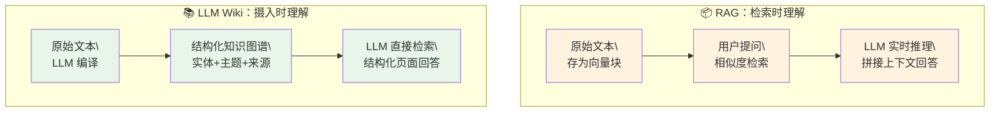
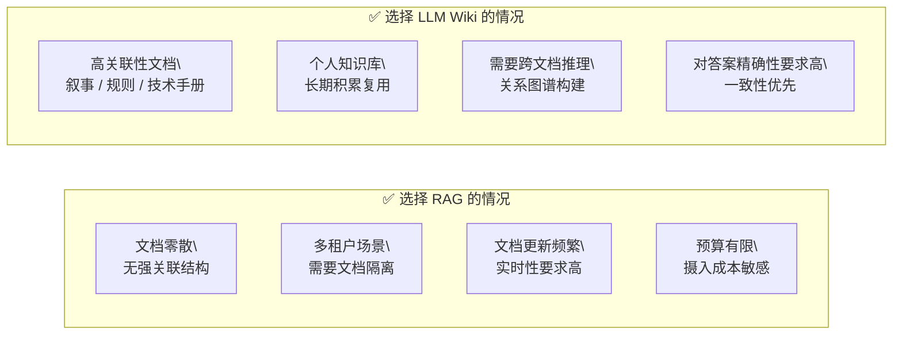

> LLM Wiki 的核心假设非常简单：**让 LLM 在摄入文档时就完成推理与结构化，而不是在检索时再试图理解**。这与 Karpathy 将 LLM 类比为"新型操作系统"的洞见一脉相承——知识不应该是被检索的原始块，而应该是被编译好的、可随时执行的结构化程序。

## 关于本文

本文记录了一次以《西游记》完整原文（100 回、约 60 万字）为数据源，使用 [llm-wiki Skill](https://github.com/Thrimbda/legion-mind/blob/master/skills/llm-wiki/SKILL.md) 构建结构化知识库的完整实验。实验分为两个平行轨道：

- ✅ **轨道一（LLM Wiki）**：将原始文本通过 Skill 逐步编译为由 `sources/`、`entities/`、`themes/` 三层组成的 Wiki 图谱
- ✅ **轨道二（RAG）**：将相同文本导入 Dify，使用默认配置进行向量检索

最终针对相同问题进行对比，观察两种范式在**知识关联性、跨章节推理、精细化回答**维度上的差异。

> [!NOTE]
> 本文与[《Kimi Attention Residuals 深度解析》](/docs/Kimi-Attention-Residuals深度解析)在理论上有一个有趣的呼应：AttnRes 解决了 Transformer **深度方向的信息稀释**问题，而 LLM Wiki 解决的是知识系统在**检索阶段的语义稀释**问题。两者都在尝试将"等权累加式"的被动聚合替换为"按需检索式"的主动调度。

## 实验过程

### 数据源

- **原始文本**：[西游记.txt](https://github.com/tennessine/corpus)（完整 100 回，约 60 万字）
- **编译工具**：[llm-wiki Skill](https://github.com/Thrimbda/legion-mind/blob/master/skills/llm-wiki/SKILL.md)
- **对照工具**：Dify 知识库（全部默认设置，1000 tokens/chunk，overlap 200）

> [!NOTE]
> 本次实验中的 RAG 仅代表**最基础形态**的向量检索管道，未进行任何工程优化（如 HyDE、Rerank、Query Rewriting、混合检索、Chunk 策略调优等）。实际部署中，经过精心优化的 RAG 系统效果会显著优于此处的对照结果。本文的对比旨在展示两种**范式**的设计逻辑差异，而非评判 RAG 技术的上限。

### LLM Wiki 轨道

本次实验将 100 回原文分为 10 个阶段（每次 10 回）进行摄入，由 LLM Agent 自动完成读取、理解、实体提取与页面生成。


每次摄入后，Skill 会自动更新：
- `sources/西游记_XX-XX.md`：该章节的关键事实摘要
- 相关 `entities/` 页面（新增或追加）
- 相关 `themes/` 页面（新增或追加）
- `log.md`：维护记录追加一条

#### 规则配置（schema.md）

``` markdown
# llm-wiki Schema

本文定义了 `llm-wiki` 存储库的命名规范、分类结构与维护约定。

## 1. 目录结构

- `wiki/index.md`: 全库索引。
- `wiki/log.md`: 维护记录。
- `wiki/sources/`: 原始资料的摘要与元数据。文件名格式：`<source_id>.md`。
- `wiki/entities/`: 角色、地点、物品等实体。文件名格式：`<entity_name>.md`。
- `wiki/themes/`: 核心主题、情节、概念。文件名格式：`<theme_name>.md`。

## 2. 命名规范

- 页面标题：使用中文全称，不带特殊符号。
- 内部链接：使用 `[[页面名称]]` 或 `[显示文本](path/to/page.md)`。

## 3. 内容模板

### 来源页 (Sources)
- **元数据**: 作者、版本、来源路径。
- **摘要**: 简明内容。
- **关键事实**: 提取出的原子化信息。
- **页面链接**: 该源涉及到的实体与主题。

### 实体页 (Entities)
- **定义**: 简要说明。
- **属性**: 核心特征。
- **关联事实**: 带有来源引用的描述。
- **待确认项**: 证据不足的推测。

### 主题页 (Themes)
- **概述**: 概念解析。
- **发展过程**: 情节演变。
- **相关实体**: 深度关联的页面。

## 4. 维护记录格式 (Log)
引用 `workflows.md` 的约定：
`## [YYYY-MM-DD] <action> | <target>`
```

#### 导航索引（index.md）

```markdown
# 西游记 Wiki 索引

## 来源列表 (Sources)

- [[西游记_01-10.md]]: 创始卷。
- [[西游记_11-20.md]]: 团队集成卷。
- [[西游记_21-30.md]]: 劫难升级卷。
- [[西游记_31-40.md]]: 法宝博弈卷。
- [[西游记_41-50.md]]: 佛道争衡卷。
- [[西游记_51-60.md]]: 情义决绝卷（火焰山）。
- [[西游记_61-70.md]]: 乱石扫塔卷（小雷音、朱紫国）。
- [[西游记_71-80.md]]: 狮驼城劫难卷。
- [[西游记_81-90.md]]: 九灵震怒卷。
- [[西游记_91-100.md]]: 功成名就卷（最终章）。

## 核心实体 (Entities)

### 角色
- [[唐僧.md]]: 陈玄奘，取经人。
- [[孙悟空.md]]: 齐天大圣，法号悟空。
- [[猪八戒.md]]: 猪悟能，高老庄二徒弟。
- [[沙和尚.md]]: 卷帘大将，流沙河三徒弟。
- [[白龙马.md]]: 敖烈，西海龙王三太子。
- [[如来佛祖.md]]: 灵山法王，降魔大圣。
- [[观音菩萨.md]]: 南海菩萨，寻亲人。
- [[牛魔王.md]]: 大力王，昔日结拜兄。
- [[铁扇公主.md]]: 罗刹女，芭蕉扇主。
- [[六耳猕猴.md]]: 假行者，乱二心。
- [[红孩儿.md]]: 圣婴大王，善财童子。
- [[大鹏金翅雕.md]]: 狮驼岭三魔，速度之王。
- ... （共 30+ 实体页）

## 主题与事件 (Themes)

- [[大闹天宫.md]]: 孙悟空反抗天庭的重大事件。
- [[紧箍咒.md]]: 约束心猿的关键法门。
- [[人参果.md]]: 万寿山灵根万寿草还丹。
- [[三昧真火.md]]: 枯松涧红孩儿的致命真火。
- [[长生之道.md]]: 贯穿全书的修仙与因果法则。
```

#### 工程日志（log.md）

```markdown
# 西游记 Wiki 维护日志

## [2026-04-09] ingest | Phase 1 (01-10 回) 全本摄入启动

- **动作摘要**: 建立 `index.md`, `log.md`, `schema.md`。完成首个分卷 `sources/西游记_01-10.md`。
- **成果**: 实现了从石猴出世到水陆大会、观音显圣的完整知识摄入。

## [2026-04-09] ingest | Phase 2 (11-20 回) 团队集成

- **动作摘要**: 完成 `sources/西游记_11-20.md`。核心收徒环节闭环。
- **成果**: 取经团队核心成员（唐僧、悟空、八戒、白龙马）实体全部建立，契约机制（紧箍咒）文档化。

## [2026-04-09] ingest | Phase 3 (21-30 回) 磨难与成军

- **动作摘要**: 完成 `sources/西游记_21-30.md`。沙僧加入，团队最终成型；经历人参果、白骨精、波月洞重大劫难。
- **成果**: 确认了团队完整名单；记录了首次严重的师徒信任破裂（三打白骨精）。

## ...（共 10 个阶段，详见 log.md）

## [2026-04-09] ingest | Phase 10 (91-100 回) 脱胎换骨与大圆满

- **动作摘要**: 完成 `sources/西游记_91-100.md`。涵盖金平府降犀、玉兔归宫、寇员外复生、灵山取经。
- **成果**:
    - 完成了全书 100 回的结构化摄入。
    - 记录了从凡僧到佛果的本质转变（凌云渡脱壳）。
    - 建立了灵山传经过程中的「礼物法则」与「无字真经」逻辑模型。
```

#### 资源目录（sources/西游记_01-10.md）

```markdown
# 来源页 | 西游记 第 01-10 回

本文档摘录《西游记》第 01 至 10 回的核心事实、情节梗概与关键规则。

## 章节梗概

### 第 01-02 回：灵根孕育与访道
- **核心事件**: 石猴出世，寻长生之道，拜入[[菩提祖师.md]]门下，获名[[孙悟空.md]]，习得七十二变与筋斗云。
- **关键地点**: 花果山水帘洞、灵台方寸山斜月三星洞。

### 第 03-04 回：龙宫索宝与初登天界
- **核心事件**: 悟空下海向东海龙王索要[[如意金箍棒.md]]。入冥司强销死籍。受天庭招安，封为「弼马温」。因嫌官小自封「齐天大圣」。
- **关键规则**: 幽冥界持有「生死簿」，规定万物寿数。

### 第 05-07 回：大闹天宫与五行山
- **核心事件**: 管理蟠桃园，偷吃蟠桃、仙酒、[[太上老君.md]]的金丹。打败十万天兵。被[[二郎神.md]]与老君合力擒拿。八卦炉炼出金睛。最终被[[如来佛祖.md]]压于[[五行山.md]]下。
- **安天大会**: 众神庆贺擒拿妖猴。

### 第 08-10 回：取经之由与地府还魂
- **核心事件**: 如来传经大愿，观音东寻取经人。[[泾河龙王.md]]违抗敕令遭斩。[[唐太宗.md]]游历地府，借相良金银并允诺举办水陆大会度幽魂。
- **人曹官**: 魏征具有梦斩神灵的能力。

## 关键事实提取

- **寿数设定**: 孙悟空在生死簿上原本注定该寿 342 岁，后被其勾除。
- **三灾利害**: 修成非常之道需躲避天降之雷灾、火灾、风灾。
- **地府架构**: 十代冥王掌管阴司，崔判官负责生死簿。
- **大乘佛法**: 观音指点，大乘佛法可度亡脱苦，现存于西天大雷音寺。

## 关联页面
- [[孙悟空.md]]
- [[唐僧.md]]
- [[如来佛祖.md]]
- [[大闹天宫.md]]
```

#### 核心实体（entities/孙悟空.md）

```markdown
# 孙悟空 | Sun Wukong

孙悟空（法号**悟空**，自封**齐天大圣**，又称**美猴王**、**行者**）是《西游记》的核心人物，天产石猴，融合天地精华而成。

## 属性与能力

- **姓名**: 孙悟空、美猴王、齐天大圣、弼马温（禁忌）、孙行者。
- **武器**: [[如意金箍棒.md]] (一万三千五百斤，重于东海，能随心变化)。
- **师承**: [[菩提祖师.md]] (教导于灵台方寸山斜月三星洞)。
- **技能**: 大般若长生术、七十二般变化、筋斗云 (十万八千里)、火眼金睛 (八卦炉中煅炼而成)。

## 关键经历

### 1. 求道与大闹天宫 (第 01-07 回)
- **学道**: 在菩提祖师处学得长生之道与神通。
- **索宝**: 闯龙宫取走定海神针，下地府抹除生死簿猴属之名。
- **反天**: 因不满官职（弼马温）而自封齐天大圣，搅乱蟠桃盛会，吞食老君金丹。
- **伏诛**: 终被如来佛祖压于五行山下，受铁丸铜汁度日近五百年。

### 2. 脱困与皈依 (第 14-22 回)
...（后续章节持续追加）

## 来源索引
- (见 [[西游记_01-10.md]])
- (见 [[西游记_11-20.md]])
- ... （随摄入进度同步追加）
```

#### 核心主题（themes/大闹天宫.md）

```markdown
# 大闹天宫 | Havoc in Heaven

「大闹天宫」是《西游记》全书最重要的序幕性事件，由[[孙悟空.md]]在天庭反抗仙家秩序而引发。

## 事件阶段

- **1. 弼马温反下天庭**: 孙悟空因不满御马监官职卑微（未入流），反出南天门，自封「齐天大圣」。
- **2. 第一次征讨**: 巨灵神、哪吒战败，太白金星提议招安，封悟空为齐天大圣（有官无禄）。
- **3. 偷桃盗丹**: 悟空代管蟠桃园，偷食九千年熟之大桃，随后搅乱蟠桃盛会，偷饮御酒，误入离恨天兜率宫盗取[[太上老君.md]]金丹五壶。
- **4. 十万天兵围困**: 玉帝大怒，差遣四大天王、二十八宿等十万天兵布下十八架天罗地网，最终被[[二郎神.md]]与老君（金钢琢）擒拿。
- **5. 八卦炉与反出**: 悟空在老君八卦炉中被煅炼四十九日，修成「火眼金睛」，反出八卦炉，直捣灵霄殿外。
- **6. 佛祖收降**: 如来佛祖最终将其压于[[五行山.md]]下。

## 来源索引
- (见 [[西游记_01-10.md]])
```

经过 10 个阶段的摄入，最终生成了覆盖全书的 Wiki 图谱，文件结构如下：


### RAG 轨道

在 Dify 中配置好知识库（本次实验全部使用默认设置）：


## 对比测试

两条轨道构建完毕后，针对相同问题进行了对比查询。

### 测试一：关联性强的聚合查询

**问题一**：统计孙悟空、猪八戒、沙僧，在 81 难中，分别打过哪几个妖怪？

#### LLM Wiki 的回答一

```markdown
根据《西游记》Wiki 记录及原始文本分析，师徒三人在"八十一难"中对阵妖怪的情况统计如下：

### 1. 孙悟空 (核心战力/降魔主力)

| 妖怪/难关 | 结果 | 关键动作 |
| :--- | :--- | :--- |
| **黑熊精** | 胜/收伏 | 斗武不分胜负，后请观音菩萨收为守山大神。 |
| **白骨精** | **击杀** | 三次看穿真身，最终将其打杀（导致自己被逐）。 |
| **红孩儿** | 战败请援 | 败于三昧真火，请观音菩萨收为善财童子。 |
| **青牛精 (独角兕大王)** | 败战请授 | 兵器被夺，请下满天神将无效，最终由太上老君收回。 |
| **六耳猕猴** | **击杀** | 经历五处辨真假，最终在如来处将其打死。 |
| **狮驼岭三魔** | 苦战/收伏 | 经历阴阳二气瓶，最终由如来、文殊、普贤三人收服。 |
| ... | | |

### 2. 猪八戒 (主要副手/补刀能手)

*   **红鳞大蟒 (驼罗庄)**：**主攻/击杀**。八戒在悟空协助下，用钉耙将蟒蛇精筑死。
*   **荆棘岭树精**：**主铲除者**。八戒现原身使耙将松、柏、桧等树精连根拔起铲除。
*   **南山大王 (豹子精)**：**最终击杀者**。在悟空施法后，八戒一耙将其筑死。

### 3. 沙和尚 (防御/看护)

*   **真假美猴王**：在花果山与"假沙僧"交手并将其打死。

### 总结
*   **击杀率最高**：**孙悟空**
*   **开路/清障**：**猪八戒**
*   **稳健防守**：**沙和尚**
```


#### RAG 的回答一

``` markdown
根据您提供的文本内容，无法统计孙悟空、猪八戒和沙僧在“八十一难”中分别打过的所有妖怪。

原因如下：
1.  **信息有限**：提供的文本仅涵盖了两个具体的战斗片段（涉及豹头山的妖精和毒敌山琵琶洞的女怪），并没有包含《西游记》全书中八十一难的完整名单或详细记录。
2.  **非完整列表**：文中提到的妖怪只是他们漫长取经路上遇到的众多妖怪中的极小部分，不足以代表全部经历。

基于这段文字，只能确认他们共同或部分参与了对以下妖怪的战斗：
*   **豹头山的妖精**（文中描述其现出原形为虎狼彪豹等兽类）。
*   **毒敌山琵琶洞的女怪**（蝎子精，文中提到她用倒马毒桩扎了孙悟空）。

若要获取完整的八十一难及对应妖怪的统计，需要查阅《西游记》原著的全本内容。
```


**点评**：两者结果差距悬殊。LLM Wiki 给出了覆盖全书的完整统计表，精准区分了「击杀」、「请援收伏」、「副手辅助」等不同战斗角色，数据来自摄入阶段提炼的结构化实体页，可直接复用。而 RAG 的回答令人意外地「诚实」——它坦言**无法作答**，只命中了豹头山妖精和蝎子精扎悟空两个零散片段，完全未覆盖孙悟空的主要妖怪战役。这正是 RAG 在超长叙事文本上的典型痛点：「统计孙悟空打过的全部妖怪」是一个**跨越全书 100 回的关联性问题**，没有任何单一文本块与之高度相似，TopK 检索自然返回不相干结果，最终只能如实承认「信息不足」。

---

### 测试二：细节深挖查询

**问题**：白骨精是哪里的妖怪，都做过什么？

#### LLM Wiki 的回答二

```markdown
白骨精（又称"白骨夫人"、"尸魔"）是《西游记》第 27 回登场的经典妖怪。

### 1. 领地与身份
*   **所在地**：**白虎岭**。该地怪石嶙峋，荒无人烟，是她的地盘。
*   **真实身份**：一具化为白骨的阴灵，在白虎岭吸取天地灵气、受日月精华，修炼成形的**尸魔**。

### 2. 核心事迹：尸魔三戏唐三藏

1.  **一变村姑**：变作妙龄村姑，悟空一棒打死，魔留假尸，真灵逃走。
2.  **二变婆婆**：变作寻女老婆婆，悟空再次看穿打杀，再次"解尸法"脱身。
3.  **三变公公**：最后一变，悟空叫土地神作证，一棒彻底打死，现出刻有"白骨夫人"四字的脊梁骨原形。

### 3. 后果与影响
*   **师徒决裂**：猪八戒谗言，唐僧误认悟空滥杀，当场写贬书将孙悟空驱逐回花果山。
*   **文学地位**：取经团队最大的一次内部信任危机，确立了"白骨精"作为阴险、善变形象的代名词。
```


#### RAG 的回答二

```markdown
根据您提供的上下文，其中**并没有提到“白骨精”**，因此无法回答她是哪里的妖怪或做过什么。

文中主要描述了以下两个妖怪及其事迹：
1.  **使用铜锤的妖邪**：被猪八戒认出是半路上成精的邪魔，自称武器出自仙苑。他哄骗村民说是斋僧，实则是想吃唐僧肉，并与猪八戒发生打斗。
2.  **黑水河的老怪（小鼍龙）**：居住在“衡阳峪黑水河神府”，捉拿了唐僧和猪八戒，打算将他们蒸熟吃以求长生不老，并准备请他的“二舅爷”来暖寿。后来与沙僧发生冲突。

如果您想了解关于白骨精的具体信息，可能需要提供包含该角色的其他文本内容。
```


``` markdown
根据提供的上下文，**无法回答**白骨夫人是哪里的妖怪以及她具体做过什么。

原因如下：
1.  **文中未提及“白骨夫人”**：提供的文本中虽然出现了妖精变化成老公公、小妖汇报抓和尚等情节，但从未出现“白骨夫人”这个名字或明确指代她的身份。
2.  **情节不匹配**：文中描述的主要冲突是猪八戒（呆子）与一个使用铁杵（棒槌）的妖精打斗，以及孙悟空变成女子在房内戏弄另一个长嘴大耳的妖精（看起来像是猪八戒自己或者另一个类似的妖，文中描述该妖“黑脸短毛，长喙大耳”，且行者暗笑“原来是这个买卖”，随后将其摔下床）。这些情节与《西游记》中著名的“三打白骨精”故事（白骨夫人变少女、老妇、老翁）在细节上有所不同，且提供的片段并未完整讲述白骨夫人的背景或全部罪行。

因此，仅凭这段文字，不知道白骨夫人的籍贯和具体事迹。
```


**点评**：本题是两个测试中 RAG 表现最糟糕的案例——**连续两次检索均未命中白骨精相关内容**。第一次返回了铜锤妖邪和黑水河小鼍龙的情节，第二次返回了猪八戒与某妖怪的打斗场景，两次均结论为「文中未提及白骨精，无法回答」。根本原因在于：Dify 默认的 Chunk 切割策略将 60 万字原文切成了若干固定大小的文本块，而当用户问「白骨精」时，检索到的却是其他章节中「妖怪」相关的高频词聚集块——白骨精的专属章节（第 27 回）恰好在这次检索中完全落榜于 TopK 之外。相比之下，LLM Wiki 在摄入第 21-30 回时已将白骨精的全部事迹结构化写入 `entities/白骨精.md`，并建立了「三打白骨精 → 师徒决裂 → 悟空被贬 → 波月洞救师」的跨回因果链，查询时直接定位该实体页，回答完整精准。**这个对比揭示了两种方案的核心差异：LLM Wiki 按「实体名」检索，准确率几乎不受文档长度影响；RAG 按「语义相似度」检索，命中率随文档长度和 Chunk 质量剧烈波动。**

## 深度对比

### 两种范式的本质差异



> [!NOTE]
> 下表中 RAG 一列基于**零优化的基线配置**进行评估。经过 Rerank、混合检索、查询改写等优化后，RAG 在跨章节关联、答案一致性等维度的表现可以得到显著提升。实际选型时应以经过调优的 RAG 系统作为对照基准。

| 对比维度 | RAG（向量检索） | LLM Wiki（结构化编译） |
|----------|----------------|------------------------|
| **知识存储形式** | 原始文本块（向量化） | LLM 推理结果（结构化 Markdown） |
| **推理时机** | 检索后，实时推理 | 摄入时，一次性推理 |
| **跨章节关联** | ⚠️ 依赖检索命中率 | ✅ 摄入时已提取并存储 |
| **答案一致性** | ⚠️ 多次查询可能不一致 | ✅ 结构化页面保证一致性 |
| **知识更新成本** | 低（追加文档重新向量化） | 中（需要 LLM 重新摄入相关页面） |
| **多租户支持** | ✅ 天然支持（独立知识库） | ❌ 不原生支持（需手动隔离） |
| **摄入成本** | 低（仅向量化） | 高（需大量 LLM token） |
| **最适合场景** | 零散文档、多用户、实时性要求高 | 结构化叙事、个人知识库、关联推理 |

### 适用场景边界总结



> [!TIP]
> **工程实践建议**：两种范式并非互斥。可以将 LLM Wiki 作为"精炼知识层"，覆盖核心领域文档（如内部规范、专业手册）；同时用 RAG 处理长尾、频繁更新的零散文档。让结构化知识与原始文本各司其职，而不是强迫一种方案覆盖所有场景。

### 关于多租户的局限性

这是 LLM Wiki 目前最明显的工程短板：**所有知识页面共享同一个命名空间**，不同用户的文档摄入结果会相互污染。例如：

- 用户 A 摄入了《西游记》，产生了 `entities/孙悟空.md`
- 用户 B 摄入了《封神演义》，若涉及孙悟空，可能直接追加到同一个实体页

这与 RAG 的天然隔离（每个用户维护独立的向量数据库/知识库 ID）存在本质差距，决定了 LLM Wiki 目前**更适合作为个人知识库工具**，而非多用户共享平台。

> [!WARNING]
> 若要在团队或 SaaS 场景中部署 LLM Wiki，需要在架构层面引入知识库隔离机制（如按用户ID 前缀命名空间、独立 Git 仓库等），否则存在知识混淆的风险。

## 结语

这次实验验证了 LLM Wiki 在**高关联性、结构化叙事文档**上的显著优势：编译一次、多次复用、跨章节推理天然成立。其核心价值不在于"比 RAG 更好"，而在于**将 LLM 的推理时机前移**——从"检索后推理"到"摄入时推理"，本质上是以更高的一次性摄入成本，换取后续每次查询的更低推理成本和更高一致性。

从更宏观的视角来看，这与大语言模型领域正在发生的另一场革命有着有趣的类比关系：正如 [Kimi Attention Residuals](/docs/Kimi-Attention-Residuals深度解析) 用"深度方向的动态注意力"取代"等权固定累加的残差连接"，LLM Wiki 同样在尝试用"摄入时的主动推理结构化"取代"检索时的被动等权拼接"。两者解决的问题层级不同，但背后的设计哲学高度一致：**以结构代替堆砌，以按需检索代替等权累加**。

---

## 参考资料

- [llm-wiki Skill 原始定义](https://github.com/Thrimbda/legion-mind/blob/master/skills/llm-wiki/SKILL.md)
- [西游记.txt 数据源](https://github.com/tennessine/corpus)
- [Karpathy：LLM OS 理念](https://x.com/karpathy/status/1707437820045062561)
- [Dify 知识库文档](https://docs.dify.ai/zh-hans/guides/knowledge-base)