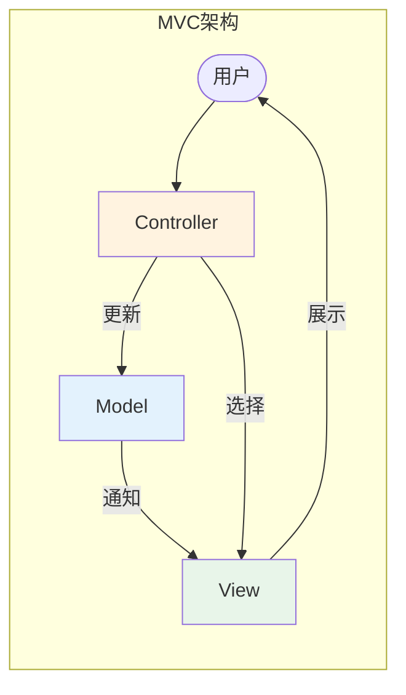
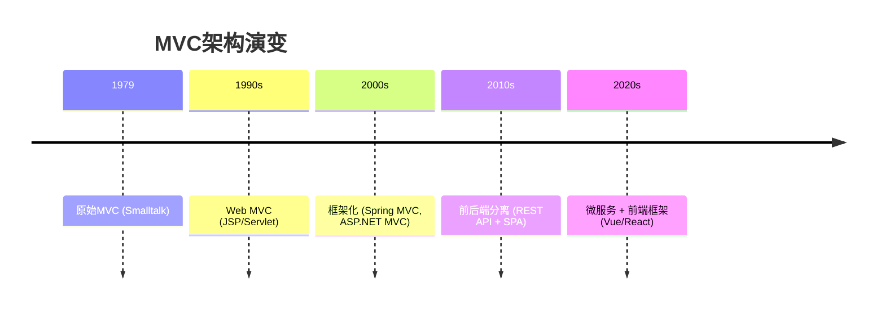
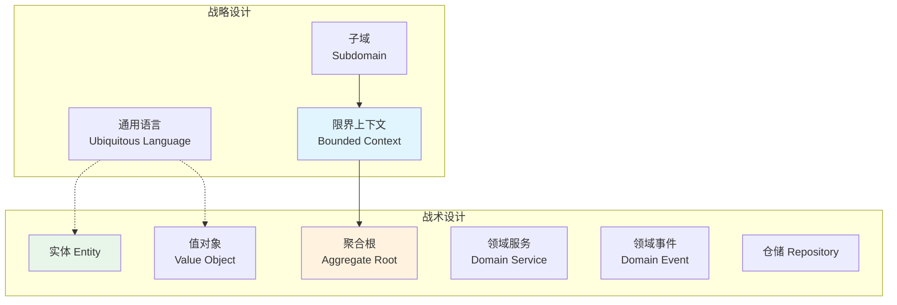
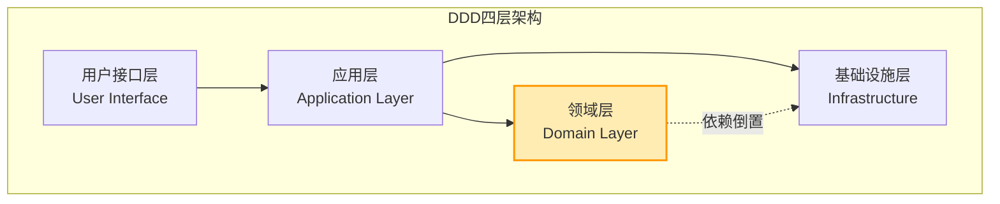
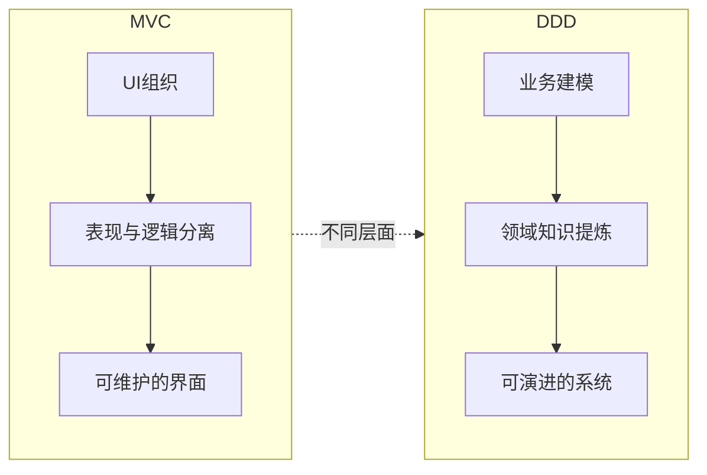
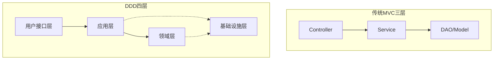
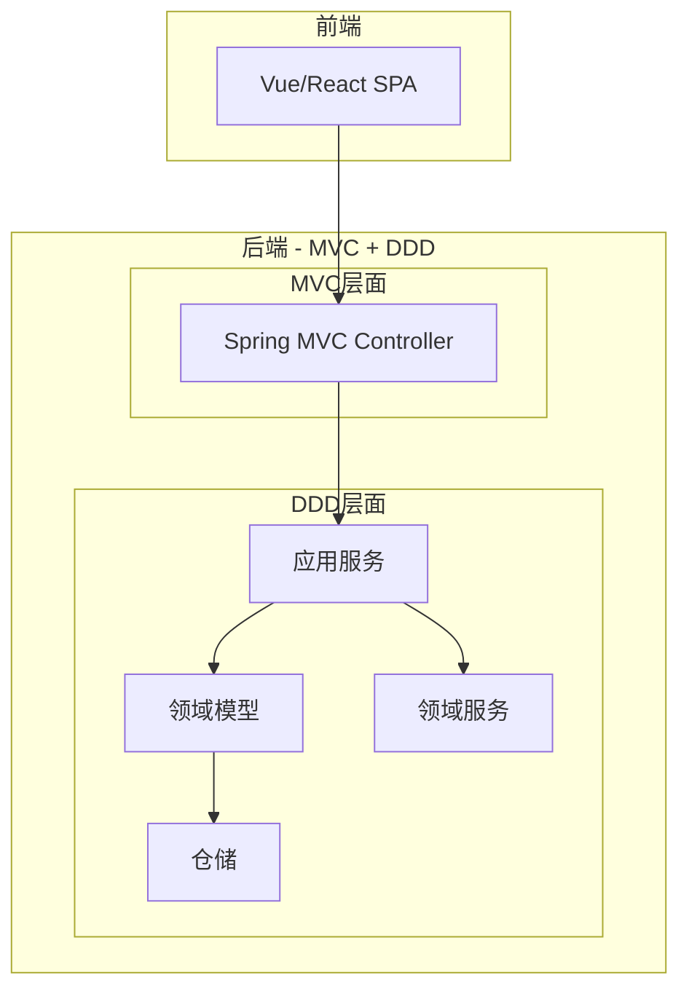

# MVC与DDD架构模式：从UI分离到领域建模的演进之路

> 当你的项目从简单的CRUD逐渐演变成复杂的业务系统时，传统的MVC架构是否已经力不从心？本文将带你理解MVC与DDD两种架构模式的本质区别，帮助你在正确的场景选择正确的架构方案。
>
> 📌 **核心著作**：[《领域驱动设计：软件核心复杂性应对之道》](https://www.amazon.com/Domain-Driven-Design-Tackling-Complexity-Software/dp/0321125215) - Eric Evans  
> 📌 **适合人群**：后端开发者、架构师、技术负责人


> 🎧 **更喜欢听？试试本文的音频版本**
<AudioPlayer 
  src="//pub.smallyoung.cn/course_slidev/mvc-ddd/从MVC贫血到DDD充血模型转型实战.m4a"
  author="SmallYoung"
/>

<VideoPlayer 
  src="//pub.smallyoung.cn/course_slidev/mvc-ddd/MVC_与_DDD：驯服复杂性.mp4"
/>

<MindMapFloat title="MVC与DDD知识图谱">

```mindmap-data
# MVC与DDD
## MVC架构
- Model 数据模型
- View 视图
- Controller 控制器
- 关注UI分离
## DDD领域驱动
- 实体 Entity
- 值对象 Value Object
- 聚合根 Aggregate Root
- 领域服务
- 限界上下文
## 核心区别
- 设计焦点不同
- 抽象层次不同
- 模型丰富度不同
## 适用场景
- MVC：简单应用
- DDD：复杂业务
```

</MindMapFloat>

## 1. 核心问题导入

想象这样一个场景：你负责维护一个电商系统，最初只是简单的商品展示和下单功能，采用经典的MVC三层架构，一切运行良好。

但随着业务发展，需求越来越复杂：
- 订单需要支持拆单、合单、部分退款
- 促销规则多达几十种，还要支持叠加计算
- 库存涉及预占、锁定、分仓等多种状态
- 支付需要对接多个渠道，处理各种异常

你发现代码变成了这样：

```java
// 一个"典型"的Service类
public class OrderService {
    public void createOrder(OrderDTO dto) {
        // 参数校验 50行
        // 库存检查 30行
        // 促销计算 100行
        // 优惠券使用 50行
        // 订单拆分逻辑 80行
        // 支付处理 60行
        // 消息通知 40行
        // 日志记录 20行
        // ... 总计800+行
    }
}
```


**这就是典型的"贫血模型"困境**：业务逻辑全部堆积在Service层，Entity只是数据容器，系统越来越难以维护。

> [!IMPORTANT]
> **MVC解决的是UI与业务的分离问题，DDD解决的是复杂业务的建模问题。** 两者不是替代关系，而是在不同层面发挥作用。


## 2. MVC架构模式：经典的关注点分离

### 2.1 什么是MVC？

MVC（Model-View-Controller）是一种软件架构模式，最早由挪威计算机科学家 Trygve Reenskaug 在1979年提出，用于Smalltalk-80语言。它的核心思想是**分离关注点**，将应用程序分为三个相互独立的组件：



| 组件 | 职责 | 生活类比 |
|------|------|----------|
| **Model（模型）** | 管理数据和业务逻辑 | 餐厅的厨房和食材仓库 |
| **View（视图）** | 负责数据的展示 | 餐厅的装修和餐具摆设 |
| **Controller（控制器）** | 接收用户输入，协调Model和View | 餐厅的服务员 |

### 2.2 MVC的核心价值

MVC带来的最大价值是**并行开发**和**代码复用**：

- **前后端分离**：设计师可以专注于View，开发者可以专注于Model和Controller
- **组件复用**：同一个Model可以对应多个View（网页、APP、API）
- **独立测试**：业务逻辑可以独立于界面进行单元测试

### 2.3 MVC在Web开发中的演变


随着Web技术的发展，MVC模式也在不断演变：



现代Web开发中，MVC通常表现为：

| 层次 | 传统MVC | 现代实践 |
|------|---------|----------|
| View | JSP/Thymeleaf | React/Vue SPA |
| Controller | Spring MVC Controller | REST API |
| Model | Entity + Service | 分层更细致 |

### 2.4 MVC的局限性


当业务复杂度上升时，MVC会暴露出明显的问题：

> [!CAUTION]
> **MVC三大陷阱**
> 1. **Fat Controller**：控制器承担过多职责，变成数百行的"上帝类"
> 2. **Anemic Model**：模型只有getter/setter，业务逻辑全在Service层
> 3. **Service Layer膨胀**：Service类动辄上千行，难以测试和维护

这些问题的根源在于：**MVC是一种UI架构模式，它关注的是如何组织用户界面，而不是如何组织业务逻辑。**

## 3. DDD领域驱动设计：复杂业务的应对之道

### 3.1 什么是DDD？


DDD（Domain-Driven Design，领域驱动设计）是由Eric Evans在其2003年的同名著作中提出的软件开发方法论。它的核心思想是：**软件的核心复杂性在于业务领域本身，因此应该以领域模型为核心来驱动软件设计。**

> [!NOTE]
> DDD不是一种具体的架构，而是一套方法论和模式集合。它可以与MVC、六边形架构、微服务等结合使用。

### 3.2 DDD的核心概念


DDD引入了一系列概念来帮助建模复杂业务：



#### 战术设计概念

| 概念 | 定义 | 代码示例 |
|------|------|----------|
| **实体（Entity）** | 具有唯一标识和生命周期的对象 | `Order`、`User` |
| **值对象（Value Object）** | 无标识、不可变，用属性描述 | `Money`、`Address` |
| **聚合根（Aggregate Root）** | 一组相关对象的入口，保证一致性 | `Order`（包含OrderItem） |
| **领域服务（Domain Service）** | 不属于任何实体的业务逻辑 | `TransferService` |
| **仓储（Repository）** | 聚合的持久化接口 | `OrderRepository` |

#### 战略设计概念


| 概念 | 定义 | 示例 |
|------|------|------|
| **限界上下文（Bounded Context）** | 领域模型的边界，术语含义一致的范围 | 订单上下文、库存上下文 |
| **通用语言（Ubiquitous Language）** | 团队共享的精确术语 | "发货" vs "出库" |
| **上下文映射（Context Map）** | 不同限界上下文间的关系 | 防腐层、共享内核 |

### 3.3 DDD的分层架构


DDD推荐的分层架构比传统三层更加精细：



| 层次 | 职责 | 对应MVC |
|------|------|---------|
| **用户接口层** | 接收请求，返回响应 | Controller |
| **应用层** | 编排用例，事务管理，不含业务逻辑 | Service（薄） |
| **领域层** | 核心业务逻辑，领域模型 | Model（富） |
| **基础设施层** | 技术实现（数据库、消息队列等） | DAO/Repository实现 |

> [!TIP]
> **关键区别**：在DDD中，领域层是核心，不依赖于基础设施层（依赖倒置）。领域模型只关注业务规则，不关心数据如何存储。

### 3.4 贫血模型 vs 充血模型


理解DDD的关键在于理解"充血模型"：

```java
// ❌ 贫血模型（Anemic Model）- 传统MVC常见
public class Order {
    private Long id;
    private BigDecimal amount;
    private String status;
    // 只有getter/setter，没有业务逻辑
}

public class OrderService {
    public void cancel(Long orderId) {
        Order order = orderRepository.findById(orderId);
        if ("PAID".equals(order.getStatus())) {
            throw new Exception("已支付订单不能取消");
        }
        order.setStatus("CANCELLED");
        orderRepository.save(order);
    }
}
```

```java
// ✅ 充血模型（Rich Model）- DDD推荐
public class Order {
    private OrderId id;
    private Money amount;
    private OrderStatus status;
    
    // 业务逻辑封装在实体内部
    public void cancel() {
        if (this.status == OrderStatus.PAID) {
            throw new OrderCannotBeCancelledException("已支付订单不能取消");
        }
        this.status = OrderStatus.CANCELLED;
        // 发布领域事件
        registerEvent(new OrderCancelledEvent(this.id));
    }
    
    public void pay(Money payment) {
        if (!this.amount.equals(payment)) {
            throw new PaymentMismatchException();
        }
        this.status = OrderStatus.PAID;
    }
}
```

## 4. MVC与DDD核心对比

### 4.1 设计焦点对比



| 对比维度 | MVC | DDD |
|----------|-----|-----|
| **设计焦点** | UI与业务逻辑的分离 | 复杂业务领域的建模 |
| **抽象层次** | 表现层架构模式 | 全系统设计方法论 |
| **模型定位** | 数据载体（贫血） | 业务核心（充血） |
| **驱动方式** | 技术驱动 | 业务驱动 |
| **适用规模** | 中小型应用 | 中大型复杂系统 |

### 4.2 层次结构对比



### 4.3 代码组织对比

**传统MVC项目结构**：
```
src/
├── controller/
│   └── OrderController.java
├── service/
│   └── OrderService.java      # 业务逻辑在这里
├── dao/
│   └── OrderMapper.java
└── model/
    └── Order.java             # 只有字段和getter/setter
```

**DDD项目结构**：
```
src/
├── interfaces/                 # 用户接口层
│   └── OrderController.java
├── application/               # 应用层
│   └── OrderApplicationService.java  # 编排用例
├── domain/                    # 领域层（核心）
│   ├── model/
│   │   ├── Order.java         # 聚合根，含业务逻辑
│   │   ├── OrderItem.java     # 实体
│   │   └── Money.java         # 值对象
│   ├── service/
│   │   └── PricingService.java  # 领域服务
│   └── repository/
│       └── OrderRepository.java  # 仓储接口
└── infrastructure/            # 基础设施层
    └── persistence/
        └── OrderRepositoryImpl.java  # 仓储实现
```

## 5. 实际应用场景


### 5.1 何时使用MVC？

MVC适合以下场景：

✅ **简单CRUD应用**：博客系统、个人网站、管理后台  
✅ **业务逻辑简单**：数据校验、简单查询、基础增删改  
✅ **快速原型开发**：MVP验证、Demo项目  
✅ **小团队项目**：2-3人的小型团队

```java
// MVC风格的简单示例 - 博客管理
@RestController
@RequestMapping("/posts")
public class PostController {
    
    @Autowired
    private PostService postService;
    
    @PostMapping
    public Post createPost(@RequestBody PostDTO dto) {
        return postService.create(dto);
    }
    
    @GetMapping("/{id}")
    public Post getPost(@PathVariable Long id) {
        return postService.findById(id);
    }
}
```

### 5.2 何时使用DDD？

DDD适合以下场景：

✅ **复杂业务域**：金融交易、电商订单、保险理赔  
✅ **业务规则多变**：促销计算、风控策略、合规审核  
✅ **多团队协作**：需要清晰的边界和接口契约  
✅ **长期演进系统**：预期持续迭代3年以上

```java
// DDD风格的复杂业务示例 - 订单支付
@Service
public class OrderApplicationService {
    
    private final OrderRepository orderRepository;
    private final PaymentGateway paymentGateway;
    
    @Transactional
    public void payOrder(OrderId orderId, PaymentMethod method) {
        // 1. 获取聚合根
        Order order = orderRepository.findById(orderId)
            .orElseThrow(() -> new OrderNotFoundException(orderId));
        
        // 2. 调用领域方法（业务逻辑在聚合内部）
        PaymentResult result = paymentGateway.process(
            order.getTotalAmount(), 
            method
        );
        
        order.confirmPayment(result);  // 领域行为
        
        // 3. 持久化
        orderRepository.save(order);
        
        // 4. 发布领域事件
        eventPublisher.publish(order.getDomainEvents());
    }
}
```

### 5.3 MVC与DDD的结合

在实际项目中，MVC和DDD可以**结合使用**：



> [!TIP]
> **最佳实践**：对于简单模块使用MVC快速实现，对于核心复杂业务使用DDD深度建模。两者完全可以在同一个项目中共存。

## 6. DDD最新趋势（2024-2025）


### 6.1 AI增强的领域建模

Eric Evans在2024年的DDD欧洲大会上鼓励开发者尝试将大语言模型（LLM）应用于DDD实践：

- **AI辅助事件风暴**：LLM分析工作坊记录，自动识别领域事件和聚合
- **通用语言提炼**：AI帮助统一团队术语，发现不一致的概念定义
- **代码生成**：基于领域模型自动生成基础代码框架

### 6.2 社会技术设计

DDD越来越被视为**社会技术设计**的基础：

- **上下文映射**揭示团队边界和协作模式
- **限界上下文**与**团队拓扑**（Team Topologies）结合
- 康威定律的实践应用

### 6.3 与微服务的持续融合

大型科技公司（Netflix、Uber、Amazon）继续使用DDD指导微服务拆分：

| 公司 | DDD实践 |
|------|---------|
| Netflix | 用限界上下文定义服务边界 |
| Uber | 领域事件驱动的异步架构 |
| Fiverr | 独立部署的限界上下文 |

## 7. 最佳实践与常见问题

### 7.1 选择建议

| 场景 | 推荐方案 | 理由 |
|------|----------|------|
| 博客/CMS系统 | MVC | 业务简单，无需过度设计 |
| 企业ERP | DDD | 业务复杂，需要精确建模 |
| API网关 | MVC | 主要是路由转发，无复杂业务 |
| 订单/交易系统 | DDD | 状态机复杂，规则多变 |
| 快速原型 | MVC | 优先验证产品假设 |
| 长期演进系统 | DDD | 投资回报率高 |

### 7.2 常见误区

| 误区 | 正确理解 |
|------|----------|
| DDD是一种架构 | DDD是方法论，可搭配多种架构 |
| DDD必须用微服务 | 单体应用同样适用DDD |
| MVC过时了 | MVC在UI层依然是最佳实践 |
| DDD适用于所有项目 | 简单项目使用DDD是过度设计 |
| 学会模式就掌握DDD | 战略设计（限界上下文）更重要 |

### 7.3 从MVC迁移到DDD的路径


> [!WARNING]
> **渐进式迁移，避免大爆炸重写！**

1. **识别核心域**：找出业务最复杂、变化最频繁的模块
2. **引入值对象**：将原始类型替换为有意义的值对象
3. **充血化实体**：将Service中的业务逻辑迁移到实体中
4. **定义聚合边界**：识别事务一致性的边界
5. **抽象仓储接口**：分离领域层和基础设施层
6. **逐步扩展**：在新功能中应用完整DDD

## 8. 总结


| 概念 | 一句话解释 |
|------|-----------|
| **MVC** | 分离UI与业务逻辑的架构模式 |
| **DDD** | 以领域模型驱动软件设计的方法论 |
| **贫血模型** | 实体只有数据，逻辑在Service |
| **充血模型** | 实体包含数据和业务行为 |
| **限界上下文** | 领域模型的适用边界 |
| **聚合根** | 一组相关对象的一致性边界 |

**核心因果链**：

```
业务复杂度上升 
  → MVC的Model层膨胀 
  → Service变成"上帝类" 
  → 维护困难 
  → 引入DDD进行领域建模 
  → 充血模型封装业务规则 
  → 聚合保证一致性 
  → 限界上下文划分团队边界 
  → 系统可持续演进
```


## 9. 参考资料

### 经典著作

| 资料 | 作者 | 说明 |
|------|------|------|
| 《领域驱动设计：软件核心复杂性应对之道》 | Eric Evans | DDD奠基之作，中文版由人民邮电出版社出版 |
| 《实现领域驱动设计》 | Vaughn Vernon | DDD落地实践指南，更注重代码实现 |
| 《企业应用架构模式》 | Martin Fowler | 经典架构模式集，理解贫血/充血模型的基础 |

### 国内技术实践

| 资料 | 来源 | 说明 |
|------|------|------|
| [领域驱动设计在互联网业务开发中的实践](https://tech.meituan.com/2017/12/22/ddd-in-practice.html) | 美团技术团队 | 美团DDD落地实践，含抽奖平台案例 |
| [DDD在大众点评交易系统演进中的应用](https://tech.meituan.com/2024/05/09/ddd-practice-trading-system.html) | 美团技术团队 | 2024年最新实践，交易系统DDD演进 |
| [阿里盒马领域驱动设计实践](https://www.infoq.cn/article/alibaba-freshhema-ddd-practice) | InfoQ中文站 | 盒马真实业务DDD落地案例 |


### 开源项目

| 项目 | 地址 | 说明 |
|------|------|------|
| DDD Reference 中文翻译 | [GitHub - citerus/dddsample-core](https://github.com/citerus/dddsample-core) | Eric Evans官方示例项目 |
| Cola 框架 | [GitHub - alibaba/COLA](https://github.com/alibaba/COLA) | 阿里开源的DDD脚手架 |
