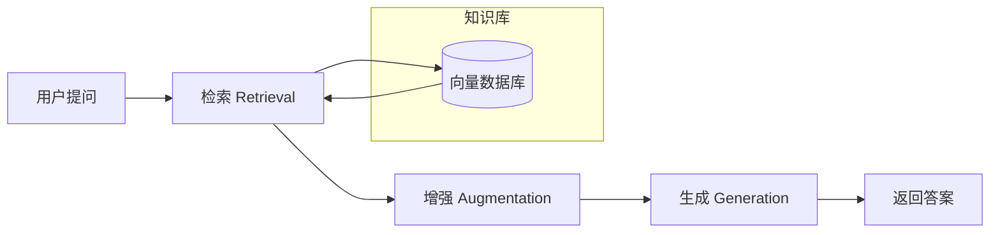
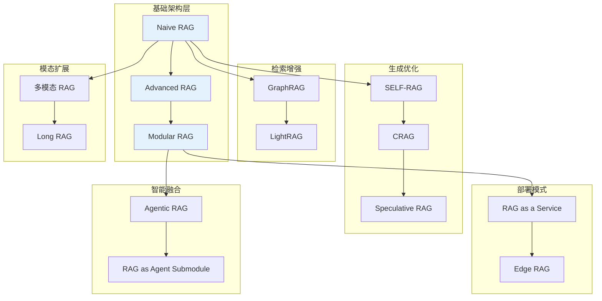
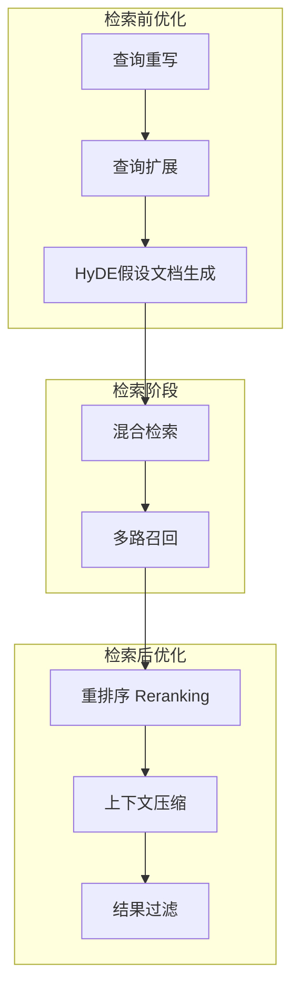
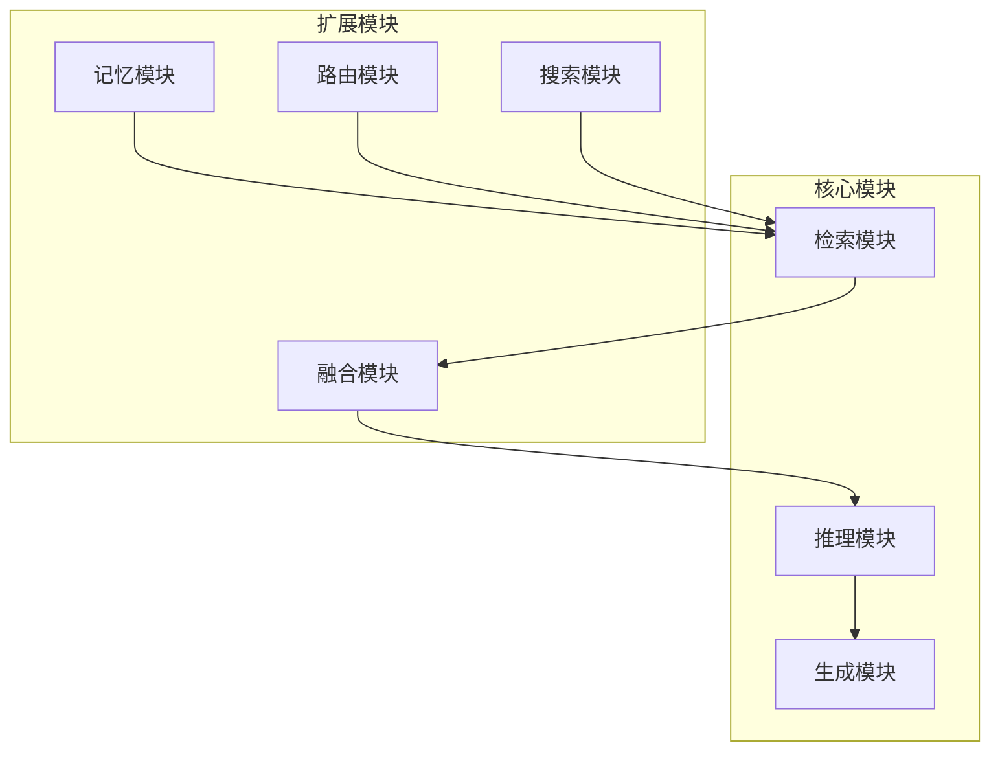
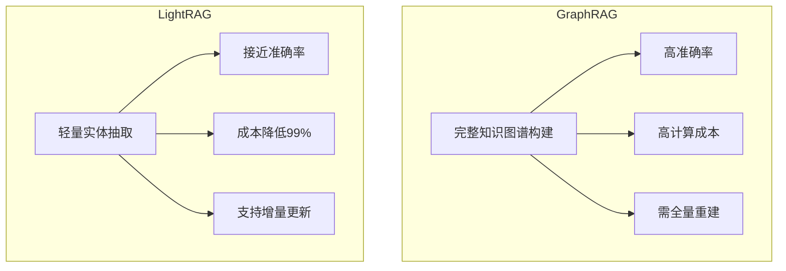
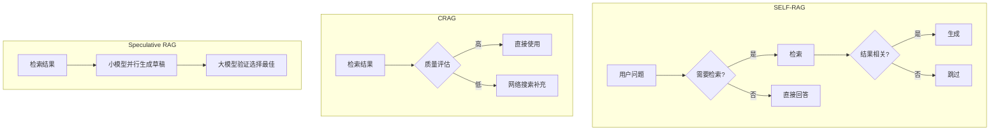
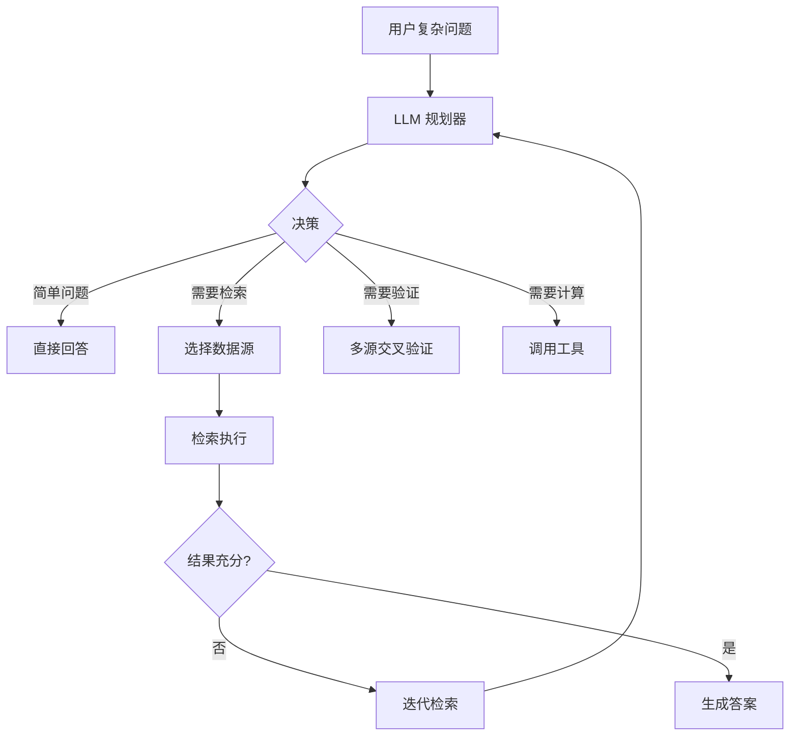

# RAG 检索增强生成入门指南

> **检索增强生成（Retrieval-Augmented Generation, RAG）** 是当前大语言模型（LLM）领域最热门的技术之一。本文将从理论基础到实践应用，全面介绍 RAG 的核心概念、主流架构及最新发展趋势。
>
> 📌 **原始论文**：[Retrieval-Augmented Generation for Knowledge-Intensive NLP Tasks](https://arxiv.org/abs/2005.11401)（arXiv:2005.11401）  
> 📌 **发布时间**：2020 年 5 月（Meta AI / Facebook AI Research）  
> 📌 **适合人群**：AI 应用开发者、后端工程师、对 LLM 应用感兴趣的技术人员

## 关于本文档

本文档是 **RAG 技术的中文权威指南**，基于 Meta 原始论文及 2024 年最新学术综述整理，覆盖以下核心知识：

- ✅ RAG 的起源、核心思想与工作流程
- ✅ 三种 RAG 架构详解与对比（Naive / Advanced / Modular）
- ✅ 2024 年前沿技术（GraphRAG、SELF-RAG、CRAG、Agentic RAG）
- ✅ 评估指标与常见挑战
- ✅ 实践指南：技术栈选择、分块策略、问题排查

<MindMapFloat title="RAG 检索增强生成知识图谱">

```mindmap-data
# RAG 检索增强生成
## 基础概念
- 核心思想: 检索 + 生成
- 解决问题: 幻觉、知识过时、可解释性
## 工作流程
- 离线阶段: 分块 → 向量化 → 存储
- 在线阶段: 检索 → 增强 → 生成
## 技术体系
- 基础架构
  - Naive RAG → Advanced RAG → Modular RAG
- 检索增强: GraphRAG → LightRAG
- 生成优化: SELF-RAG → CRAG → Speculative RAG
- 智能融合: Agentic RAG → Agent子模块
- 模态扩展: 多模态RAG / Long RAG
- 部署模式: RaaS / Edge RAG
## 评估指标
- 检索质量: Hit Rate, MRR
- 生成质量: Faithfulness, Relevance
## 技术栈
- 向量库: Milvus, Chroma
- 框架: LangChain, LlamaIndex
```

</MindMapFloat>


> 🎧 **更喜欢听？试试本文的音频版本**
<AudioPlayer 
  src="//pub.smallyoung.cn/course_slidev/rag/RAG.m4a" author="SmallYoung"
/>

<VideoPlayer 
  src="//pub.smallyoung.cn/course_slidev/rag/RAG.mp4"
/>

## 1. 什么是 RAG？

### 1.1 RAG 的起源

RAG 最早由 **Meta（原 Facebook）在 2020 年 5 月** 提出，论文标题为 *"Retrieval-Augmented Generation for Knowledge-Intensive NLP Tasks"*（arXiv:2005.11401）。该论文首次将**信息检索**与**文本生成**相结合，开创了一种全新的 AI 范式。

> [!NOTE]
> RAG 论文的第一作者是 **Patrick Lewis**，该工作后续被 NeurIPS 2020 会议接收。2024 年被誉为"RAG 突破年"，仅 arXiv 上就发布了超过 1200 篇相关论文。

### 1.2 为什么需要 RAG？


大语言模型（如 GPT、Claude、Gemini）虽然功能强大，但存在几个关键问题：

| 问题 | 描述 | RAG 如何解决 |
|------|------|-------------|
| **幻觉（Hallucination）** | LLM 可能生成看似真实但完全虚构的信息 | 通过检索真实文档作为依据，减少凭空捏造 |
| **知识过时** | 模型训练完成后无法获取新知识 | 外部知识库可实时更新 |
| **缺乏可解释性** | 无法知道答案来源 | 可追溯到具体的源文档 |
| **领域知识不足** | 对私有或专业领域知识了解有限 | 可接入企业私有知识库 |

### 1.3 RAG 的核心思想


简单来说，RAG 就是：

```
用户问题 → 检索相关文档 → 将文档作为上下文 → LLM 生成答案
```

这就像考试时可以"开卷"——不需要死记硬背所有知识，只需在需要时查阅参考资料。
## 2. RAG 的工作流程


一个标准的 RAG 系统包含三个核心阶段：



### 2.1 离线准备阶段（Indexing）

在系统运行之前，需要预先处理知识库：

1. **数据收集**：收集 PDF、网页、Word 文档等原始数据
2. **文档分块（Chunking）**：将长文档切分为小段落
3. **向量化（Embedding）**：使用嵌入模型将文本转换为向量
4. **存储**：将向量存入向量数据库（如 Chroma、Milvus、Weaviate）

### 2.2 在线服务阶段

1. **检索（Retrieval）**：将用户问题转换为向量，在数据库中查找最相似的文档块
2. **增强（Augmentation）**：将检索到的文档与用户问题组合成提示词（Prompt）
3. **生成（Generation）**：LLM 根据增强后的提示词生成最终答案
## 3. RAG 技术体系：完整演进图谱


RAG 技术形成了一个**多维度演进的技术体系**，从基础架构到专项优化，每个方向都在解决特定的核心问题。下图展示了完整的技术演进脉络：


### 3.1 基础架构：从简单到模块化

#### Naive RAG（基础 RAG）


最简单的 RAG 实现方式，直接将检索结果拼接到 Prompt 中。

```python
# Naive RAG 伪代码
def naive_rag(query, vector_db, llm):
    # 1. 检索
    docs = vector_db.similarity_search(query, top_k=3)
    
    # 2. 增强
    context = "\n".join([doc.content for doc in docs])
    prompt = f"根据以下内容回答问题：\n{context}\n\n问题：{query}"
    
    # 3. 生成
    answer = llm.generate(prompt)
    return answer
```

| 特点 | 说明 |
|------|------|
| **优势** | 实现简单、响应快、适合 MVP |
| **局限** | 检索精度有限、无法处理复杂查询 |
| **适用场景** | FAQ、简单知识库、内部搜索 |

#### Advanced RAG（高级 RAG）


在基础 RAG 上增加**检索前优化、检索中增强、检索后处理**三个环节：



**关键技术：**

| 技术 | 描述 | 效果 |
|------|------|------|
| **查询重写** | 用 LLM 重新表述用户问题 | 提高问题清晰度 |
| **HyDE** | 先生成假设性答案，用它来检索 | 弥合问题与答案的语义差距 |
| **混合检索** | 向量检索 + 关键词检索（BM25） | 兼顾语义与精确匹配 |
| **重排序** | 专门的重排序模型重新排序 | 最相关文档排在前面 |

#### Modular RAG（模块化 RAG）


将系统拆分为独立模块，像"乐高积木"一样灵活组合：



| 模块 | 功能 | 示例 |
|------|------|------|
| **路由模块** | 决定查询走哪条路径 | 简单问题直接回答，复杂问题走检索 |
| **记忆模块** | 存储对话历史和偏好 | 多轮对话上下文管理 |
| **融合模块** | 整合多源检索结果 | 合并向量库、知识图谱、数据库结果 |

**架构对比总结：**

| 维度 | Naive RAG | Advanced RAG | Modular RAG |
|------|-----------|--------------|-------------|
| **复杂度** | ⭐ | ⭐⭐⭐ | ⭐⭐⭐⭐⭐ |
| **检索精度** | 中 | 高 | 很高 |
| **响应延迟** | 低 | 中 | 中-高 |
| **可扩展性** | 低 | 中 | 高 |
| **适合阶段** | MVP/原型 | 生产环境 | 企业级 |
### 3.2 检索增强：从平面向量到图结构


基础 RAG 将文档切分为孤立的块，无法捕捉实体之间的关系。这一方向引入**图结构**解决多跳推理问题。

| 技术 | 解决的问题 | 核心思路 |
|------|------------|----------|
| **GraphRAG** | 无法处理多跳推理 | 构建知识图谱，实体关系建模 |
| **LightRAG** | GraphRAG 成本过高 | 双层检索 + 增量更新 |

**GraphRAG vs LightRAG：**



| 维度 | GraphRAG | LightRAG |
|------|----------|----------|
| 图谱构建 | 完整构建 | 轻量抽取 |
| 更新方式 | 全量重建 | 增量更新 |
| Token 消耗 | 高 | 低（约 1/6000） |
| 适用场景 | 知识密集型任务 | 成本敏感型生产环境 |
### 3.3 生成优化：从被动拼接到自主决策


传统 RAG 的生成过程是"盲目的"——无论检索结果好坏都直接使用。这一方向引入**自我评估和纠错机制**。

| 技术 | 解决的问题 | 核心思路 |
|------|------------|----------|
| **SELF-RAG** | 不知道何时该检索 | 自我反思：评估检索必要性和结果质量 |
| **CRAG** | 检索质量差时无补救 | 质量评估 + 网络搜索补充 |
| **Speculative RAG** | 生成速度慢 | 小模型草稿 + 大模型验证 |

**机制对比：**



**Speculative RAG 效果：**
- 准确率提升最高 **12.97%**
- 响应延迟降低最高 **51%**
### 3.4 智能融合：从静态工具到智能体


这一方向代表 RAG 的**范式转变**——从被动的检索工具演变为智能体生态的核心组件。

| 技术 | 解决的问题 | 核心思路 |
|------|------------|----------|
| **Agentic RAG** | 固定检索流程无法动态决策 | LLM 作为调度员，自主规划 |
| **RAG as Submodule** | RAG 与智能体割裂 | RAG 内嵌于 Agent，成为记忆基础设施 |

**Agentic RAG 工作模式：**


### 3.5 模态扩展：从纯文本到多模态

| 技术 | 解决的问题 | 核心思路 |
|------|------------|----------|
| **多模态 RAG（MM-RAG）** | 只能处理文本 | 多模态嵌入 + 跨模态检索 |
| **Long RAG** | 长文档信息分散 | 4000+ tokens 大块检索 + 层次化策略 |

**多模态 RAG 能力：**
- 图片检索：根据图片内容查找相关文档
- 视频问答：从视频库中检索相关片段
- 音频搜索：根据语音内容检索信息
### 3.6 部署模式：从自建到服务化

| 技术 | 解决的问题 | 核心思路 |
|------|------------|----------|
| **RAG as a Service** | 基础设施运维复杂 | 云端托管，按需付费 |
| **Edge RAG** | 隐私/延迟敏感 | 设备端本地运行 |

**部署选项对比：**

| 模式 | 适用场景 | 代表方案 |
|------|----------|----------|
| **云端托管** | 快速启动、弹性扩展 | Pinecone、Zilliz Cloud |
| **混合部署** | 平衡隐私与性能 | 敏感数据本地 + 通用知识云端 |
| **边缘部署** | 隐私优先、离线可用 | Ollama + 本地向量库 |
### 3.7 技术选型指南


根据业务需求选择合适的技术组合：

| 需求场景 | 推荐架构 | 关键技术 |
|----------|----------|----------|
| **快速验证** | Naive RAG | 基础向量检索 |
| **生产环境** | Advanced RAG | 混合检索 + 重排序 |
| **复杂推理** | GraphRAG / LightRAG | 知识图谱增强 |
| **高准确性** | SELF-RAG + CRAG | 自我反思 + 纠错 |
| **低延迟** | Speculative RAG | 推测式生成 |
| **智能对话** | Agentic RAG | 智能体融合 |
| **企业级** | Modular RAG | 模块化架构 |

> [!IMPORTANT]
> **核心趋势**：RAG 正在从"独立的检索增强工具"演变为"智能体生态的核心基础设施"。关键词是：
> - **效率优化**：LightRAG、Speculative RAG 大幅降低成本和延迟
> - **智能融合**：RAG 内嵌于 Agent，实现自主决策
> - **服务化部署**：云端/边缘多模式选择
## 4. 实践指南

### 4.1 技术栈推荐


| 组件 | 推荐工具 | 说明 |
|------|----------|------|
| **向量数据库** | Milvus、Chroma、Weaviate | Milvus 适合大规模，Chroma 适合快速原型 |
| **嵌入模型** | OpenAI `text-embedding-3-small`、`bge-large-zh-v1.5` | 中文推荐 BGE 系列 |
| **LLM** | GPT-4、Claude、Qwen、DeepSeek | 根据成本和性能需求选择 |
| **框架** | LangChain、LlamaIndex、RAGFlow | LangChain 生态最丰富 |
| **重排序模型** | `bge-reranker-v2-m3`、Cohere Rerank | 显著提升检索质量 |

### 4.2 分块策略建议

| 场景 | 块大小 | 重叠 | 说明 |
|------|--------|------|------|
| 通用问答 | 256-512 tokens | 50-100 tokens | 平衡信息完整性和检索精度 |
| 长文档分析 | 1000+ tokens | 200 tokens | 保留更多上下文 |
| 精确检索 | 128-256 tokens | 50 tokens | 提高匹配精度 |

### 4.3 常见问题排查

| 问题 | 可能原因 | 解决方案 |
|------|----------|----------|
| 检索不到相关内容 | 分块太大或嵌入模型不匹配 | 调整分块策略，更换嵌入模型 |
| 答案与问题无关 | 检索到的文档不相关 | 增加重排序、混合检索 |
| LLM 幻觉严重 | 上下文不足或 Prompt 设计问题 | 优化 Prompt，增加相关文档数量 |
| 响应速度慢 | 检索或重排序耗时 | 使用缓存、减少 top_k |
## 5. RAG 评估指标

评估 RAG 系统的效果需要从**检索质量**和**生成质量**两个维度进行考量：

### 5.1 检索质量指标

| 指标 | 英文 | 定义 | 计算方式 |
|------|------|------|----------|
| **命中率** | Hit Rate | 检索结果中包含正确答案的比例 | 命中次数 / 总查询数 |
| **平均倒数排名** | MRR (Mean Reciprocal Rank) | 正确结果在排名中位置的倒数平均值 | Σ(1/rank) / n |
| **Recall@K** | Recall at K | 前 K 个结果中包含相关文档的比例 | 相关文档数 / 总相关文档数 |
| **NDCG** | Normalized DCG | 考虑排名位置的相关性加权得分 | DCG / IDCG |

### 5.2 生成质量指标

| 指标 | 英文 | 定义 | 评估方式 |
|------|------|------|----------|
| **忠实度** | Faithfulness | 生成答案是否基于检索内容 | LLM 评估 / 人工标注 |
| **答案相关性** | Answer Relevance | 答案与问题的相关程度 | 语义相似度 / LLM 评估 |
| **上下文精确度** | Context Precision | 检索上下文中相关信息的比例 | 相关句子 / 总句子数 |
| **上下文召回率** | Context Recall | 检索上下文覆盖正确答案的程度 | 覆盖率计算 |

> [!TIP]
> **推荐评估工具**：
> - [RAGAS](https://github.com/explodinggradients/ragas) - 开源 RAG 评估框架
> - [TruLens](https://www.trulens.org/) - LLM 应用评估平台
> - [LangSmith](https://smith.langchain.com/) - LangChain 官方评估工具
## 6. RAG 常见挑战


尽管 RAG 技术发展迅速，在实际应用中仍面临诸多挑战：

### 6.1 检索层面的挑战

| 挑战 | 描述 | 应对策略 |
|------|------|----------|
| **语义鸿沟** | 用户问题与文档表述不匹配 | 查询重写、HyDE、同义词扩展 |
| **多跳推理** | 需要关联多个文档才能回答 | GraphRAG、迭代检索 |
| **长上下文问题** | 相关信息分散在长文档中 | 层次化分块、递归检索 |
| **实时性要求** | 知识库更新不及时 | 增量索引、混合搜索引擎 |

### 6.2 生成层面的挑战

| 挑战 | 描述 | 应对策略 |
|------|------|----------|
| **上下文窗口限制** | 检索内容超出 LLM 处理能力 | 上下文压缩、摘要提取 |
| **信息冲突** | 多个文档信息矛盾 | 来源可信度排序、冲突检测 |
| **答案幻觉** | LLM 仍可能编造信息 | SELF-RAG、引用验证 |
| **响应延迟** | 检索+生成耗时过长 | 缓存策略、流式输出 |

> [!WARNING]
> **安全提醒**：在企业应用中，需特别注意知识库的**数据安全**和**隐私保护**，避免敏感信息泄露。可采用权限控制、数据脱敏等措施。
## 7. 未来展望


RAG 技术仍在快速发展，以下是几个值得关注的方向：

1. **端到端优化**：将检索器和生成器联合训练
2. **自适应检索**：智能决定何时需要检索
3. **跨模态理解**：图文音视频统一检索
4. **可信 RAG**：增强答案可追溯性和可解释性
5. **隐私保护 RAG**：在保护数据隐私的前提下进行检索
## 8. 参考资料

### 核心论文

| 论文 | 作者/机构 | 年份 | 主要贡献 |
|------|-----------|------|----------|
| *Retrieval-Augmented Generation for Knowledge-Intensive NLP Tasks* | Lewis et al. (Meta AI) | 2020 | RAG 奠基论文 |
| *Retrieval-Augmented Generation for Large Language Models: A Survey* | Gao et al. | 2024 | 最全面的 RAG 综述 |
| *Self-RAG: Learning to Retrieve, Generate, and Critique through Self-Reflection* | Asai et al. | 2023 | 自我反思机制 |
| *From Local to Global: A Graph RAG Approach to Query-Focused Summarization* | Microsoft Research | 2024 | GraphRAG 方法论 |
| *Corrective Retrieval Augmented Generation* | Yan et al. | 2024 | CRAG 纠错机制 |

### 推荐阅读

- [LangChain RAG 官方教程](https://python.langchain.com/docs/tutorials/rag/)
- [LlamaIndex 文档](https://docs.llamaindex.ai/)
- [RAGFlow 开源项目](https://github.com/infiniflow/ragflow)
- [RAGAS 评估框架](https://github.com/explodinggradients/ragas)
- [Microsoft GraphRAG](https://github.com/microsoft/graphrag)
