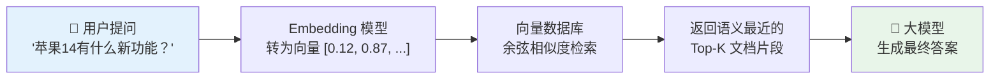
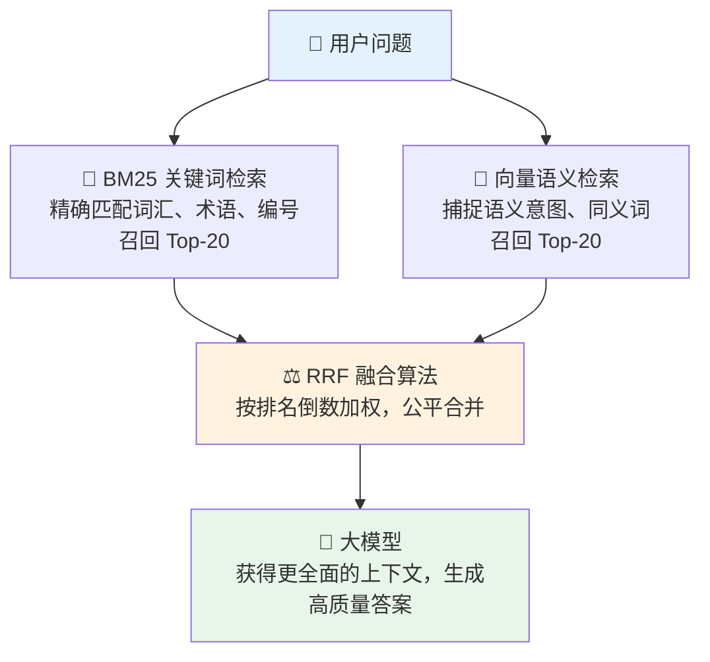
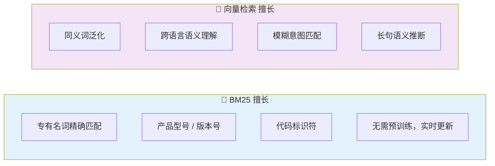
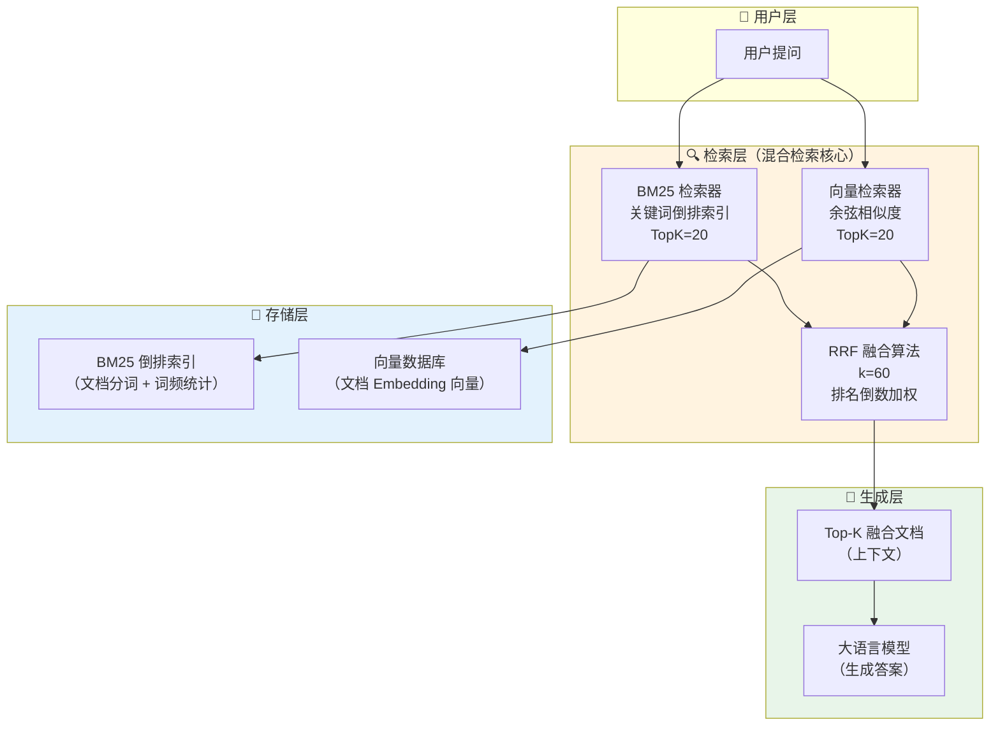
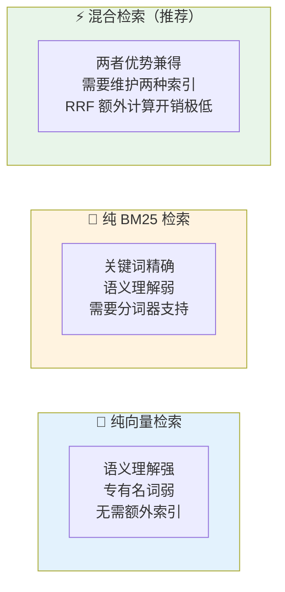

> 你是否遇到过这样的困境：明明知识库里有"iPhone 14 参数"，用户一搜，AI 却给出了"智能手机发展历史"的答案？这不是大模型的问题，是检索出了问题。本文将带你彻底理解混合检索（Hybrid Retrieval）的设计哲学，以及 RRF 算法如何公平地融合两路结果，并通过 Spring Boot + LangChain4j 的完整代码，让你当天就能落地。
>
> 📌 **适合人群**：了解 RAG 基础概念的 Java 后端开发者、AI 工程落地工程师

<!--
  MindMapFloat 写作顺序：先完成全文正文 → 再提炼节点
-->
<MindMapFloat title="混合检索知识图谱">

```mindmap-data
# 混合检索 Hybrid RAG
## 为什么需要混合
- 向量检索的语义盲点
- 专业术语/编号精确匹配失败
- 单一策略的天花板
## BM25 的原理
- 词频 TF 与饱和函数
- 逆文档频率 IDF
- 文档长度归一化
## 向量检索的原理
- Embedding 语义编码
- 余弦相似度计算
- 擅长语义泛化
## RRF 融合算法
- 不依赖原始分数
- 排名倒数加权
- 平滑常数 k=60
## 代码落地
- HybridRetriever 构建
- Spring Boot 集成配置
- 参数调优策略
```

</MindMapFloat>

## 关于本文档

本文围绕 RAG 系统中最关键的检索层展开，从单路检索的缺陷出发，逐步构建混合检索的完整理解，最终通过可运行的 Java 代码完成落地。

- ✅ 理解纯向量检索在专业术语场景下的核心缺陷
- ✅ 掌握 BM25 算法的工作原理（TF、IDF、文档长度归一化）
- ✅ 理解 RRF 算法如何做到不依赖分数而只依赖排名的公平融合
- ✅ 使用 Spring Boot + LangChain4j 构建完整混合检索器
- ✅ 掌握生产环境中 topK 与 rrfK 的调参策略

## 1. 纯向量检索为什么会"答非所问"

### 1.1 向量检索的工作方式

向量检索（Dense Retrieval）是目前 RAG 系统的主流做法。它的核心思想是：将文档和用户问题都转换成高维数值向量（Embedding），然后通过计算两个向量之间的**余弦相似度**，找出语义上最接近的文档片段。



这种方式在**语义泛化**场景下效果出色。比如你问"如何让身体更健康"，即使知识库里写的是"养生食谱"和"运动方案"，向量检索也能把它们找出来——因为它们在语义空间里距离很近。

### 1.2 向量检索的"词汇鸿沟"问题

向量检索的问题在于，它擅长理解**意思相近**的内容，却不擅长**精确匹配特定词汇**。当用户搜索：

- `iPhone 14 Pro Max` → 可能返回所有手机相关文档，而非这款机型的具体参数
- `订单号 ORD-20241201-9527` → 向量模型根本无法理解这串编号的独特性
- `Apache Kafka 2.8.0 版本变更` → 版本号"2.8.0"在语义空间里和"2.7.1"几乎一样近

> [!IMPORTANT]
> 向量模型学到的是**语义相似度**，而非**字符精确性**。对于专有名词、产品编号、版本号、人名，纯向量检索的召回率会显著下降，这是结构性缺陷，不是调参能解决的。

| 查询类型 | 向量检索效果 | BM25 效果 |
|----------|------------|----------|
| 语义问答（"如何提升免疫力"） | ✅ 优秀 | ⚠️ 一般，依赖关键词是否出现 |
| 同义词泛化（"汽车" vs "小轿车"） | ✅ 优秀 | ❌ 较差，字面不匹配则召回失败 |
| 精确专有名词（"GPT-4o"） | ⚠️ 一般 | ✅ 优秀，精确字符匹配 |
| 产品编号/型号（"ORD-9527"） | ❌ 较差 | ✅ 优秀 |
| 代码方法名（"getUserById"） | ❌ 较差 | ✅ 优秀 |

### 1.3 解决思路：两路召回，取长补短

既然每种检索各有所长，最直觉的解法就是**同时用两种方式检索**，然后把结果合并。这就是**混合检索（Hybrid Retrieval）**的核心思想。



## 2. BM25：经典关键词检索的核心原理

### 2.1 BM25 是什么

BM25（Best Match 25）是信息检索领域最经典的排序算法之一，也是 Elasticsearch、Lucene 等搜索引擎的默认排序算法。它的名字里的"25"来自算法的第 25 次迭代版本。

**一句话类比**：BM25 就像图书馆管理员。你说要找"苹果手机"，他会扫描所有书的索引，数一数每本书提到"苹果"和"手机"多少次，优先推荐那些**反复提到这两个词、且整本书不太厚**（避免被长书稀释）的书籍。

BM25 的评分综合三个核心因子：

| 因子 | 全称 | 作用 | 举例 |
|------|------|------|------|
| **TF** | Term Frequency（词频） | 词在文档中出现越多，相关性越高 | "苹果"出现 5 次 > 出现 1 次 |
| **IDF** | Inverse Document Frequency（逆文档频率） | 词在所有文档中越罕见，越有辨别力 | "苹果"比"的"更有价值 |
| **文档长度归一化** | Document Length Normalization | 长文档中词出现多次不一定比短文档更相关 | 防止长文档"霸榜" |

### 2.2 BM25 公式详解

BM25 的核心得分公式如下：

$$\text{BM25}(q, d) = \sum_{t \in q} \text{IDF}(t) \cdot \frac{f(t,d) \cdot (k_1 + 1)}{f(t,d) + k_1 \cdot (1 - b + b \cdot \frac{|d|}{\text{avgdl}})}$$

参数说明：

| 参数 | 含义 | 典型默认值 |
|------|------|----------|
| `f(t, d)` | 词 t 在文档 d 中的出现次数 | — |
| `\|d\|` | 文档长度（词数） | — |
| `avgdl` | 语料库中文档的平均长度 | — |
| `k1` | 词频饱和参数（防止高频词无限加分） | 1.2 ~ 2.0 |
| `b` | 文档长度归一化系数 | 0.75 |

> [!NOTE]
> `k1` 参数引入了"词频饱和"效应：一个词出现 1 次和出现 100 次，给文档带来的加分**不是线性增长**的，而是越来越慢趋向饱和。这避免了某个词反复堆砌就能刷高分的问题。

### 2.3 BM25 vs 向量检索：互补而非替代



## 3. RRF 算法：公平地融合两路结果

### 3.1 分数融合的难题

当 BM25 和向量检索各返回了 20 条结果后，我们面临一个棘手的问题：**两路的分数不在同一个量纲上**。

- BM25 返回的得分可能是 `12.7`、`8.3`、`5.1`……（无上限）
- 向量检索的余弦相似度是 `0.93`、`0.87`、`0.82`……（在 0~1 之间）

直接把这两个分数加权相加（如 `0.5 × BM25分 + 0.5 × 向量分`）会有严重问题：BM25 分数的绝对量级远大于余弦相似度，导致向量检索的贡献被完全淹没，且需要大量调参和归一化工作。

### 3.2 RRF 算法：只看排名，不看分数

RRF（Reciprocal Rank Fusion，倒数排名融合）是由滑铁卢大学和 Google 联合研究提出的算法，其核心思想极其优雅：

> **不管你的原始分数是多少，我只关心你在各自榜单里排第几名。**

RRF 对每个文档 `d` 的最终得分计算公式为：

$$\text{RRF\_score}(d) = \sum_{r \in R} \frac{1}{k + \text{rank}_r(d)}$$

| 符号 | 含义 |
|------|------|
| `R` | 所有检索结果列表的集合（这里是 BM25 列表和向量检索列表） |
| `rank_r(d)` | 文档 `d` 在列表 `r` 中的排名（从 1 开始） |
| `k` | 平滑常数，业界标准值为 **60**，防止低排名文档得分趋近于 0 |

### 3.3 用一个例子彻底理解 RRF

假设检索"苹果14 售价"，两路各召回 5 条结果：

| 排名 | BM25 结果 | 向量检索结果 |
|------|-----------|------------|
| 第 1 名 | 文档A（iPhone 14 参数） | 文档C（苹果产品历史） |
| 第 2 名 | 文档B（手机价格比较） | 文档A（iPhone 14 参数） |
| 第 3 名 | 文档C（苹果产品历史） | 文档D（苹果公司财报） |
| 第 4 名 | 文档D（苹果公司财报） | 文档B（手机价格比较） |
| 第 5 名 | 文档E（Android 手机推荐） | 文档E（Android 手机推荐） |

使用 `k=60` 计算各文档的 RRF 分：

| 文档 | BM25 排名 | 向量排名 | RRF 得分 | 最终排名 |
|------|----------|---------|---------|---------|
| 文档A | 1 | 2 | 1/(60+1) + 1/(60+2) = **0.0321** | 🥇 第 1 |
| 文档C | 3 | 1 | 1/(60+3) + 1/(60+1) = **0.0321** | 🥈 第 1（同分） |
| 文档B | 2 | 4 | 1/(60+2) + 1/(60+4) = **0.0317** | 🥉 第 3 |
| 文档D | 4 | 3 | 1/(60+4) + 1/(60+3) = **0.0317** | 第 4 |
| 文档E | 5 | 5 | 1/(60+5) + 1/(60+5) = **0.0308** | 第 5 |

> [!TIP]
> 文档 A（iPhone 14 参数）在两路结果中都排名靠前，RRF 算法将其综合排名拉到最高，完美体现了"两路都认可的文档更可信"的直觉。k=60 的作用是让第 1 名和第 2 名的得分差距适中，防止排名极度集中。

## 4. Spring Boot + LangChain4j 实现混合检索

### 4.1 项目依赖配置

首先在 `pom.xml` 中引入必要依赖：

```xml
<dependencies>
    <!-- Spring Boot 基础 Web -->
    <dependency>
        <groupId>org.springframework.boot</groupId>
        <artifactId>spring-boot-starter-web</artifactId>
    </dependency>

    <!-- LangChain4j 核心 -->
    <dependency>
        <groupId>dev.langchain4j</groupId>
        <artifactId>langchain4j</artifactId>
        <version>0.36.2</version>
    </dependency>

    <!-- LangChain4j Spring Boot Starter（自动配置） -->
    <dependency>
        <groupId>dev.langchain4j</groupId>
        <artifactId>langchain4j-spring-boot-starter</artifactId>
        <version>0.36.2</version>
    </dependency>

    <!-- Embedding 存储（示例使用内存版，生产替换为 Milvus/Elasticsearch） -->
    <dependency>
        <groupId>dev.langchain4j</groupId>
        <artifactId>langchain4j-embeddings-all-minilm-l6-v2</artifactId>
        <version>0.36.2</version>
    </dependency>
</dependencies>
```

### 4.2 构建 HybridRetriever（核心代码）

这是混合检索器的核心构建代码：

```java
import dev.langchain4j.model.embedding.EmbeddingModel;
import dev.langchain4j.store.embedding.EmbeddingStore;
import dev.langchain4j.rag.retriever.HybridRetriever;
import org.springframework.context.annotation.Bean;
import org.springframework.context.annotation.Configuration;

@Configuration
public class HybridRetrieverConfig {

    /**
     * 构建混合检索器
     * 同时使用 BM25 关键词检索 + 向量语义检索，通过 RRF 算法融合结果
     *
     * @param embeddingModel 向量化模型（将文本转为向量）
     * @param embeddingStore 向量数据库（存储和检索向量）
     */
    @Bean
    public HybridRetriever hybridRetriever(
            EmbeddingModel embeddingModel,
            EmbeddingStore embeddingStore) {

        return HybridRetriever.builder()
                // ── 向量检索配置 ──────────────────────────
                .embeddingModel(embeddingModel)   // 语义检索的向量化模型
                .vectorStore(embeddingStore)       // 向量数据库实例

                // ── BM25 检索配置 ──────────────────────────
                .bm25TopK(20)   // BM25 关键词检索召回前 20 条候选
                .vectorTopK(20) // 向量语义检索召回前 20 条候选

                // ── RRF 融合配置 ──────────────────────────
                // rrfK 是 RRF 公式中的平滑常数 k，业界标准值为 60
                // 值越大：低排名文档的得分被削弱越少（结果更"民主"）
                // 值越小：结果越集中于两路都排名靠前的文档
                .rrfK(60)

                .build()
                .init(); // 初始化 BM25 索引
    }
}
```

### 4.3 在 RAG Service 中使用混合检索器

```java
import dev.langchain4j.model.chat.ChatLanguageModel;
import dev.langchain4j.rag.content.retriever.ContentRetriever;
import dev.langchain4j.rag.retriever.HybridRetriever;
import dev.langchain4j.service.AiServices;
import org.springframework.stereotype.Service;

@Service
public class KnowledgeBaseService {

    private final KnowledgeAssistant assistant;

    public KnowledgeBaseService(
            ChatLanguageModel chatModel,
            HybridRetriever hybridRetriever) {

        // 将 HybridRetriever 适配为 LangChain4j 的 ContentRetriever 接口
        ContentRetriever contentRetriever = query -> {
            // hybridRetriever 内部自动完成：
            // 1. BM25 关键词检索（topK=20）
            // 2. 向量语义检索（topK=20）
            // 3. RRF 融合排序
            // 4. 返回融合后的最终结果列表
            return hybridRetriever.retrieve(query.text());
        };

        // 使用 AiServices 自动组装 RAG pipeline
        this.assistant = AiServices.builder(KnowledgeAssistant.class)
                .chatLanguageModel(chatModel)
                .contentRetriever(contentRetriever)
                .build();
    }

    /**
     * 知识库问答入口
     * @param userQuestion 用户问题
     * @return AI 生成的答案（基于混合检索的上下文）
     */
    public String ask(String userQuestion) {
        return assistant.answer(userQuestion);
    }
}
```

### 4.4 定义 AI Service 接口

```java
import dev.langchain4j.service.SystemMessage;

/**
 * 知识库问答 AI Service
 * LangChain4j 会自动将混合检索结果注入为上下文
 */
public interface KnowledgeAssistant {

    @SystemMessage("""
            你是一个专业的知识库问答助手。
            请严格根据提供的上下文内容来回答用户问题。
            如果上下文中没有相关信息，请直接告知用户，不要编造答案。
            """)
    String answer(String userQuestion);
}
```

### 4.5 REST API 层（完整接入）

```java
import org.springframework.web.bind.annotation.*;

@RestController
@RequestMapping("/api/knowledge")
public class KnowledgeController {

    private final KnowledgeBaseService knowledgeBaseService;

    public KnowledgeController(KnowledgeBaseService knowledgeBaseService) {
        this.knowledgeBaseService = knowledgeBaseService;
    }

    /**
     * 问答接口
     * POST /api/knowledge/ask
     * Body: {"question": "苹果14的屏幕分辨率是多少？"}
     */
    @PostMapping("/ask")
    public AnswerResponse ask(@RequestBody QuestionRequest request) {
        String answer = knowledgeBaseService.ask(request.question());
        return new AnswerResponse(answer);
    }

    // 请求/响应 DTO（Java 16+ record）
    record QuestionRequest(String question) {}
    record AnswerResponse(String answer) {}
}
```

## 5. 混合检索架构全局视图



## 6. 最佳实践与调参指南

### 6.1 topK 与 rrfK 参数如何设置

这两个参数是混合检索中最常调整的，理解其含义能避免踩坑：

| 参数 | 作用 | 过小的问题 | 过大的问题 | 推荐起点 |
|------|------|-----------|-----------|---------|
| `bm25TopK` | BM25 侧召回候选数量 | 漏掉关键词相关文档 | 噪声增加，后续重排负担重 | 20 |
| `vectorTopK` | 向量侧召回候选数量 | 漏掉语义相关文档 | 同上 | 20 |
| `rrfK` | RRF 平滑常数 | 结果过度集中于两路都排名 #1 的文档 | 低排名噪声文档得分变高 | 60（业界标准） |

> [!TIP]
> `bm25TopK` 和 `vectorTopK` 的值建议设为**最终返回文档数的 4~5 倍**。例如你想最终给大模型 5 条上下文，那两路各召回 20 条，经 RRF 融合后取前 5，这样有足够的候选池来保证质量。

### 6.2 常见错误：不做去重直接合并

❌ **错误做法**：直接将两路结果简单拼接，不经过 RRF 或去重

```java
// ❌ 错误：两路各 20 条，合并后 40 条全塞给大模型
List<TextSegment> bm25Results = bm25.retrieve(query);
List<TextSegment> vectorResults = vector.retrieve(query);
List<TextSegment> combined = new ArrayList<>();
combined.addAll(bm25Results);
combined.addAll(vectorResults); // 可能包含大量重复文档，且未按质量排序
```

✅ **正确做法**：通过 `HybridRetriever` 统一调用，RRF 自动处理去重与排序

```java
// ✅ 正确：HybridRetriever 内部完成两路召回 + RRF 融合 + 去重
List<TextSegment> results = hybridRetriever.retrieve(userQuery);
// results 已经是按 RRF 分数排序、去重后的结果
```

### 6.3 常见问题排查表

| 问题现象 | 可能原因 | 解决方案 |
|---------|---------|---------|
| 专业术语始终召回不到 | BM25 分词器不支持中文术语 | 接入 IK 分词器或使用 jieba 预处理 |
| 召回结果全是语义相关但不精确 | `bm25TopK` 设置过低或 BM25 索引未初始化 | 检查 `.init()` 是否调用，适当增大 `bm25TopK` |
| 两路结果高度重叠，混合意义不大 | 知识库内容同质化，或向量模型欠训练 | 评估语料多样性，换用更强的 Embedding 模型 |
| RRF 后结果与预期偏差大 | `rrfK` 设置不当 | 在 20~80 之间调参，较小的 k 让前排文档优势更大 |

> [!WARNING]
> 混合检索虽然提升了召回率，但**并不等于精排**。生产环境建议在混合检索之后再接一层**重排序（Reranker）**，使用 Cross-Encoder 模型对召回的 Top-20 候选进行精细打分，最终取 Top-5 送入大模型，可以进一步提升答案质量。

## 7. 三种检索策略横向对比



| 对比维度 | 纯向量检索 | 纯 BM25 检索 | 混合检索（推荐） |
|----------|-----------|------------|----------------|
| 语义泛化能力 | ⭐⭐⭐⭐⭐ | ⭐⭐ | ⭐⭐⭐⭐⭐ |
| 专有名词精确匹配 | ⭐⭐ | ⭐⭐⭐⭐⭐ | ⭐⭐⭐⭐⭐ |
| 系统复杂度 | ⭐⭐ | ⭐⭐ | ⭐⭐⭐（适中） |
| 索引维护成本 | 向量库 | 倒排索引 | 两者均需 |
| 2026 年生产推荐 | ❌ 不建议单独使用 | ❌ 不建议单独使用 | ✅ 强烈推荐 |

> [!IMPORTANT]
> **何时必须用混合检索？**
> - ✅ 知识库中有产品型号、订单编号、API 名称等精确标识符
> - ✅ 用户会搜索人名、地名、特定版本号
> - ✅ 知识库文档来源多样，语义分布广
> - ❌ 如果知识库非常小（< 100 条）且查询均为语义问题，纯向量检索已足够

## 8. 总结

| 核心概念 | 一句话解释 |
|---------|-----------|
| **BM25** | 基于词频（TF）和逆文档频率（IDF）的关键词精确匹配算法，擅长专有名词召回 |
| **向量检索** | 将文本转为 Embedding 向量后计算语义相似度，擅长语义泛化 |
| **混合检索** | 同时运行 BM25 和向量检索两路召回，各取所长 |
| **RRF 算法** | 不依赖原始分数，仅通过各榜单排名的倒数加权来公平融合多路结果 |
| **rrfK=60** | RRF 平滑常数的业界标准值，平衡顶部排名优势与尾部文档贡献 |
| **HybridRetriever** | LangChain4j 提供的混合检索器，内置两路召回 + RRF 融合能力 |

> [!TIP]
> **推荐学习路径**：
> 1. 先用纯向量检索搭起 RAG 基础框架，体验其优缺点
> 2. 引入 BM25，对比两者在专业术语场景下的召回差异
> 3. 接入 `HybridRetriever` + RRF，观察综合召回率的提升
> 4. 在混合检索之后再接 Reranker 重排模型，追求极致的答案质量

## 9. 参考资料

### 核心论文

| 论文 | 作者/机构 | 年份 | 主要贡献 |
|------|-----------|------|----------|
| [Reciprocal Rank Fusion outperforms Condorcet and individual Rank Learning Methods](https://dl.acm.org/doi/10.1145/1571941.1572114) | Gordon V. Cormack 等，滑铁卢大学 / Google | 2009 | 提出 RRF 算法，证明其优于单一排序方法 |
| [Okapi BM25: a Non-Binary Model of Document Indexing and Retrieval](https://dl.acm.org/doi/10.5555/188490.188561) | Robertson 等 | 1994 | BM25 算法原始论文 |

### 推荐资源

- [LangChain4j 官方文档 - RAG 模块](https://docs.langchain4j.dev/tutorials/rag)
- [Elasticsearch RRF 官方文档](https://www.elastic.co/guide/en/elasticsearch/reference/current/rrf.html)
- [Building a Cost-Free Local Hybrid RAG with LangChain4j and OpenSearch](https://medium.com/gitconnected/building-a-cost-free-local-hybrid-rag-knowledge-base-with-langchain4j-and-opensearch-d33f0661f188)
