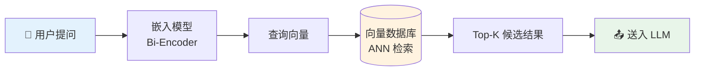
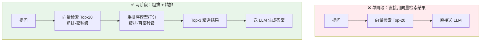
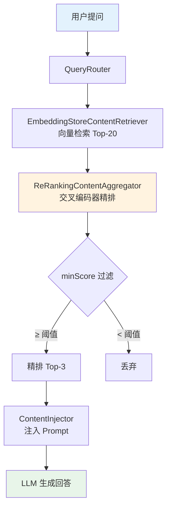

> 向量检索像大海捞针——能捞出几十根针，但哪根最锋利？重排序（Reranking）正是专门解决这个问题的精排技术。本文从原理出发，带你彻底理解"粗排 → 精排"两阶段检索模式，并通过 Spring Boot 4 + LangChain4j 1.13.1 原生 API（非 langchain4j-spring 包）实现完整的本地 ONNX 重排序流水线，提供开箱即用的 JUnit 5 测试代码。
>
> 📌 **适合人群**：有 Spring Boot 基础、正在构建或优化 RAG 系统的 Java 开发者


<!--
  MindMapFloat 知识维度说明：
  先完成全文正文 → 再提炼节点
-->
<MindMapFloat title="RAG 重排序知识图谱">

```mindmap-data
# RAG 重排序
## 为什么需要精排
- 向量检索的"相似≠相关"陷阱
- 上下文窗口污染与幻觉风险
- 粗排与精排的职责分离
## 核心模型对比
- 双编码器（Bi-Encoder）独立编码
- 交叉编码器（Cross-Encoder）联合建模
- ONNX 本地推理 vs 云端 API
## 重排序工作机制
- 两阶段检索流水线
- 相关性打分与 topK 过滤
- minScore 阈值控制
## LangChain4j 实现方式
- ScoringModel 接口
- OnnxScoringModel 本地模型
- ReRankingContentAggregator 集成 RAG
## 生产调优要点
- topK 与 minScore 的权衡
- 模型大小与延迟的取舍
- 常见陷阱与排查思路
```

</MindMapFloat>

## 关于本文档

本文覆盖 RAG 重排序从理论到落地的完整链路，重点聚焦 LangChain4j 1.13.1 原生 Java API，不依赖 langchain4j-spring 自动装配，让你对每一行代码都有完全的掌控。

- ✅ 重排序（Reranking）原理与"粗排-精排"两阶段架构解析
- ✅ 双编码器 vs 交叉编码器的本质区别与性能对比
- ✅ 使用 OnnxScoringModel 在 JVM 内运行本地 ONNX 重排序模型
- ✅ 将 ReRankingContentAggregator 接入 DefaultRetrievalAugmentor 完整 RAG 流水线
- ✅ 可直接运行的 JUnit 5 测试代码与 Maven 依赖配置

## 1. 向量检索为什么还不够准

### 1.1 向量检索是怎么工作的

RAG 的第一步是把知识库文本切分成小块（Chunk），每块用嵌入模型转换为高维向量并存入向量数据库。用户提问时，提问同样被转化为向量，再通过近似最近邻（ANN）算法从库中找出"距离最近"的 K 条结果。



这套流程非常高效：文档向量在入库时预计算好，检索时只需一次 ANN 查找，延迟通常在毫秒级。

### 1.2 "相似度高"不等于"真的相关"

向量相似度衡量的是语义方向的接近程度，而不是对"这个问题"的实际回答质量。来看一个典型的反例：

| 用户问题 | 检索命中内容 | 向量相似度 | 实际相关性 |
|---------|------------|-----------|-----------|
| "Java 如何关闭线程池？" | "Python 中如何关闭线程池" | 0.92（极高） | ❌ 语言不符 |
| "Java 如何关闭线程池？" | "Java 线程池 shutdown() 方法详解" | 0.87 | ✅ 正确答案 |
| "Redis 缓存穿透怎么解决？" | "Redis 性能调优：内存优化技巧" | 0.85 | ⚠️ 部分相关 |
| "Redis 缓存穿透怎么解决？" | "布隆过滤器解决缓存穿透原理" | 0.81 | ✅ 核心答案 |

排名靠前的结果反而不是最佳答案——这就是向量检索的"相似度陷阱"。

> [!IMPORTANT]
> **核心矛盾**：向量检索在"大海中捞针"这件事上效率极高，但排序依据（余弦相似度）无法准确衡量"这段文字能不能回答用户的问题"。把低质量上下文送给 LLM，轻则降低回答质量，重则引发幻觉（Hallucination）。

### 1.3 重排序的核心思想：用更贵的模型做精排

重排序的本质是一个两阶段策略——让快速的模型先做粗粒度召回，再让精准的模型做细粒度打分。



## 2. 双编码器 vs 交叉编码器：两种模型的本质差异

### 2.1 双编码器（Bi-Encoder）：向量检索的引擎

双编码器将查询和文档分别独立编码成向量，通过余弦相似度计算匹配程度。

```
Query  ──[Encoder]──> 向量 q
Doc    ──[Encoder]──> 向量 d
Score  = cosine(q, d)
```

核心优势是文档向量可以**离线预计算**，检索时只需对查询做一次编码，然后做 ANN 查找，时间复杂度接近 O(1)，因此能处理数百万级文档库。

### 2.2 交叉编码器（Cross-Encoder）：重排序的精准引擎

交叉编码器将查询和文档**拼接后**同时输入模型，利用 Transformer 的自注意力机制让两段文本充分交互，最终输出一个标量相关性分数。

```
Input  = [CLS] query [SEP] document [SEP]
Output = 一个 0~1 的相关性分数（越高越相关）
```

因为查询和文档在每一层 Transformer 中都相互"看"彼此，模型能捕捉到细粒度的语义关联——比如判断"这段文字是否直接回答了这个问题"，而非仅仅"这两段文字的话题是否相近"。

> [!NOTE]
> 交叉编码器的代价是**无法预计算**：每次检索都需要对所有候选文档重新推理。这也是为什么它只适合对粗排的少量结果（20~100条）做精排，而不能直接用于全量检索。

### 2.3 全面对比

| 对比维度 | 双编码器（Bi-Encoder） | 交叉编码器（Cross-Encoder） |
|---------|----------------------|--------------------------|
| 工作方式 | 独立编码，计算向量距离 | 联合编码，输出相关性分数 |
| 推理时机 | 文档可离线预计算 | 每次检索实时推理 |
| 检索延迟 | O(1)，毫秒级 | O(n)，百毫秒~秒级 |
| 精度 | 中等（语义方向相似） | 高（深度理解相关性） |
| 典型模型 | bge-small-en, text-embedding-3 | BGE-Reranker-v2-m3, Cohere Rerank |
| 适用阶段 | 粗排（全库检索） | 精排（少量候选重排） |
| 内存占用 | 小（只需存向量） | 中等（模型本身） |

> [!TIP]
> 实际生产中，两种模型是互补关系，不是竞争关系。标准做法：双编码器召回 Top-20 到 Top-50，交叉编码器从中精排取 Top-3 送给 LLM。

## 3. LangChain4j 重排序核心 API 解析

### 3.1 ScoringModel：统一的打分接口

LangChain4j 用 `ScoringModel` 接口统一抽象了所有重排序模型，无论是本地 ONNX 模型还是 Cohere 云端 API，都实现同一套接口：

```java
// ScoringModel 核心方法
public interface ScoringModel {

    // 对单个文本段打分
    Response<Double> score(TextSegment segment, String query);

    // 批量打分（推荐使用，一次推理多条）
    Response<List<Double>> scoreAll(List<TextSegment> segments, String query);
}
```

这种统一接口设计让你可以在开发阶段用本地 ONNX 模型（零费用），生产阶段切换到 Cohere 云端（更高精度），只需替换一个 Bean，其余代码完全不变。

### 3.2 OnnxScoringModel：本地 ONNX 重排序模型

`OnnxScoringModel` 基于 ONNX Runtime 在 JVM 内做本地推理，无需调用外部 API，数据不出服务器，非常适合对数据隐私有要求的场景。

| 参数 | 说明 | 示例 |
|------|------|------|
| `pathToModel` | ONNX 模型文件路径 | `/models/bge-reranker/model.onnx` |
| `pathToTokenizer` | 分词器配置文件路径 | `/models/bge-reranker/tokenizer.json` |
| `sessionOptions` | ONNX 推理会话配置（可选，用于 GPU） | `new OrtSession.SessionOptions()` |

### 3.3 ReRankingContentAggregator：接入 RAG 流水线

`ReRankingContentAggregator` 是将 `ScoringModel` 接入 LangChain4j RAG 流水线的桥梁，它替换掉默认的 `DefaultContentAggregator`，在 `ContentRetriever` 检索到候选结果后自动执行重排序：



## 4. Maven 依赖配置

### 4.1 核心依赖

使用 LangChain4j 1.13.1 的 BOM 统一管理版本，避免各子模块版本不一致导致的冲突：

```xml
<!-- pom.xml -->
<properties>
    <java.version>21</java.version>
    <!-- langchain4j 1.13.1：BOM 版本，统一管理所有稳定子模块 -->
    <langchain4j.version>1.13.1</langchain4j.version>
    <!-- beta 子模块版本（onnx-scoring 等尚未进入稳定版 BOM） -->
    <langchain4j.beta.version>1.13.1-beta23</langchain4j.beta.version>
</properties>

<!-- LangChain4j BOM，统一管理所有子模块版本 -->
<dependencyManagement>
    <dependencies>
        <dependency>
            <groupId>dev.langchain4j</groupId>
            <artifactId>langchain4j-bom</artifactId>
            <version>${langchain4j.version}</version>
            <type>pom</type>
            <scope>import</scope>
        </dependency>
    </dependencies>
</dependencyManagement>

<dependencies>
    <!-- Spring Boot 4 Web（需要 JDK 21+） -->
    <dependency>
        <groupId>org.springframework.boot</groupId>
        <artifactId>spring-boot-starter-web</artifactId>
    </dependency>

    <!-- LangChain4j 核心：使用原始工具包，不引入 langchain4j-spring 自动装配 -->
    <dependency>
        <groupId>dev.langchain4j</groupId>
        <artifactId>langchain4j</artifactId>
        <!-- 版本由 BOM 管理，无需显式声明 -->
    </dependency>


    <!-- 本地 ONNX 嵌入模型（bge-small-en-v1.5 量化版，24MB） -->
    <dependency>
        <groupId>dev.langchain4j</groupId>
        <artifactId>langchain4j-embeddings-bge-small-en-v15-q</artifactId>
        <version>${langchain4j.beta.version}</version>
    </dependency>

    <!-- 内存向量库（开发测试用，生产替换为 Milvus/Qdrant/PgVector） -->
    <dependency>
        <groupId>dev.langchain4j</groupId>
        <artifactId>langchain4j-embeddings</artifactId>
    </dependency>

    <!-- 测试依赖 -->
    <dependency>
        <groupId>org.springframework.boot</groupId>
        <artifactId>spring-boot-starter-test</artifactId>
        <scope>test</scope>
    </dependency>
</dependencies>
```

### 4.2 阿里云百炼重排序 API 准备

本项目不再需要在本地下载动辄几百 MB 的模型文件，而是直接通过网络调用阿里云百炼（Model Studio）提供的 `gte-rerank` 重排序模型 API。这种方式不仅降低了服务器配置要求（无需 GPU，甚至无需高配 CPU），而且接入极其轻量。

#### 获取 API Key：
1. 访问 [阿里云百炼控制台](https://bailian.console.aliyun.com/)。
2. 在左侧导航栏中，点击 **API Key**。
3. 点击 **创建 API Key**（如果已有可以直接复制）。
4. 保存该 Key（例如 `sk-xxxxxxxxxxxxxxxx`），稍后将配置在代码中。

> [!TIP]
> 阿里云百炼的 `gte-rerank` 模型在通用中文检索上表现极佳，单次调用限制为文档总 token 数不超过限制（详情请参考阿里云官方配额）。本示例将自己实现一个简单的 `ScoringModel` 对接该 API。

## 5. 代码实现

### 5.1 自定义 DashScopeScoringModel 对接百炼 API

由于 LangChain4j 原生暂未提供阿里云重排序的直接实现，我们需要根据其 `ScoringModel` 接口自行封装一个 HTTP 客户端调用百炼 API。

```java
// DashScopeScoringModel.java
package com.example.rag.model;

import com.fasterxml.jackson.databind.ObjectMapper;
import dev.langchain4j.data.segment.TextSegment;
import dev.langchain4j.model.output.Response;
import dev.langchain4j.model.scoring.ScoringModel;

import java.net.URI;
import java.net.http.HttpClient;
import java.net.http.HttpRequest;
import java.net.http.HttpResponse;
import java.util.HashMap;
import java.util.List;
import java.util.Map;
import java.util.stream.Collectors;

public class DashScopeScoringModel implements ScoringModel {

    private final String apiKey;
    private final String modelName;
    private final HttpClient httpClient;
    private final ObjectMapper objectMapper;
    private static final String API_URL = "https://dashscope.aliyuncs.com/api/v1/services/rerank/text-rerank/text-rerank";

    public DashScopeScoringModel(String apiKey, String modelName) {
        this.apiKey = apiKey;
        this.modelName = modelName;
        this.httpClient = HttpClient.newHttpClient();
        this.objectMapper = new ObjectMapper();
    }

    @Override
    public Response<Double> score(TextSegment textSegment, String query) {
        return Response.from(scoreAll(List.of(textSegment), query).content().get(0));
    }

    @Override
    public Response<List<Double>> scoreAll(List<TextSegment> textSegments, String query) {
        try {
            List<String> docs = textSegments.stream().map(TextSegment::text).collect(Collectors.toList());

            Map<String, Object> input = new HashMap<>();
            input.put("query", query);
            input.put("documents", docs);

            Map<String, Object> requestBody = new HashMap<>();
            requestBody.put("model", this.modelName);
            requestBody.put("input", input);

            String jsonBody = objectMapper.writeValueAsString(requestBody);

            HttpRequest request = HttpRequest.newBuilder()
                    .uri(URI.create(API_URL))
                    .header("Authorization", "Bearer " + apiKey)
                    .header("Content-Type", "application/json")
                    .POST(HttpRequest.BodyPublishers.ofString(jsonBody))
                    .build();

            HttpResponse<String> response = httpClient.send(request, HttpResponse.BodyHandlers.ofString());

            if (response.statusCode() != 200) {
                throw new RuntimeException("DashScope API call failed: " + response.body());
            }

            Map<String, Object> responseMap = objectMapper.readValue(response.body(), Map.class);
            Map<String, Object> output = (Map<String, Object>) responseMap.get("output");
            List<Map<String, Object>> results = (List<Map<String, Object>>) output.get("results");

            Double[] scores = new Double[docs.size()];
            for (Map<String, Object> res : results) {
                int index = (Integer) res.get("index");
                double score = (Double) res.get("relevance_score");
                scores[index] = score;
            }

            return Response.from(List.of(scores));
        } catch (Exception e) {
            throw new RuntimeException("Failed to score texts with DashScope API", e);
        }
    }
}
```

### 5.2 核心 Bean 配置

```java
// RerankingConfig.java
package com.example.rag.config;

import com.example.rag.model.DashScopeScoringModel;
import dev.langchain4j.model.embedding.EmbeddingModel;
import dev.langchain4j.model.embedding.onnx.bgesmallenv15q.BgeSmallEnV15QuantizedEmbeddingModel;
import dev.langchain4j.model.scoring.ScoringModel;
import dev.langchain4j.rag.DefaultRetrievalAugmentor;
import dev.langchain4j.rag.RetrievalAugmentor;
import dev.langchain4j.rag.content.aggregator.ContentAggregator;
import dev.langchain4j.rag.content.aggregator.ReRankingContentAggregator;
import dev.langchain4j.rag.content.retriever.ContentRetriever;
import dev.langchain4j.rag.content.retriever.EmbeddingStoreContentRetriever;
import dev.langchain4j.store.embedding.EmbeddingStore;
import dev.langchain4j.store.embedding.inmemory.InMemoryEmbeddingStore;
import dev.langchain4j.data.segment.TextSegment;
import org.springframework.beans.factory.annotation.Value;
import org.springframework.context.annotation.Bean;
import org.springframework.context.annotation.Configuration;

/**
 * RAG 重排序核心配置类（纯 Java 风格，不依赖 langchain4j-spring 自动装配）
 *
 * <p>配置了完整的两阶段检索流水线：
 * <ol>
 *   <li>粗排：EmbeddingStoreContentRetriever 向量检索 Top-20</li>
 *   <li>精排：ReRankingContentAggregator 交叉编码器重排序，取 Top-3</li>
 * </ol>
 * </p>
 */
@Configuration
public class RerankingConfig {

    // 阿里云百炼 API Key，从 application.properties 注入
    @Value("${dashscope.api.key}")
    private String apiKey;

    /**
     * 云端重排序模型 Bean
     *
     * <p>使用自定义的 DashScopeScoringModel 对接百炼 gte-rerank 模型
     * </p>
     */
    @Bean
    public ScoringModel scoringModel() {
        return new DashScopeScoringModel(apiKey, "gte-rerank");
    }

    /**
     * 嵌入模型 Bean（用于向量化文档和查询）
     *
     * <p>bge-small-en-v1.5 量化版，24MB，内置于 JAR 中，纯本地推理，无需手动下载。</p>
     */
    @Bean
    public EmbeddingModel embeddingModel() {
        return new BgeSmallEnV15QuantizedEmbeddingModel();
    }

    /**
     * 内存向量库（生产环境替换为 Milvus / Qdrant / PgVector 等）
     */
    @Bean
    public EmbeddingStore<TextSegment> embeddingStore() {
        return new InMemoryEmbeddingStore<>();
    }

    /**
     * 向量检索器：粗排阶段，从库中捞出 Top-20 候选
     *
     * <p>maxResults(20) 故意设大，给重排序提供足够候选；minScore(0.4) 适当放宽，
     * 避免错过语义相关的文档。</p>
     */
    @Bean
    public ContentRetriever contentRetriever(
            EmbeddingStore<TextSegment> embeddingStore,
            EmbeddingModel embeddingModel) {
        return EmbeddingStoreContentRetriever.builder()
                .embeddingStore(embeddingStore)
                .embeddingModel(embeddingModel)
                .maxResults(20)          // 粗排多捞，给精排留余量
                .minScore(0.4)           // 粗排阈值适当放宽
                .build();
    }

    /**
     * 重排序内容聚合器：精排阶段，从 Top-20 中取最优 Top-3
     *
     * <p>
     * minScore(0.7)：过滤掉精排后分数仍低的结果，防止低质量上下文污染 LLM<br>
     * maxResults(3)：最终只保留 3 条最相关的内容送给 LLM
     * </p>
     */
    @Bean
    public ContentAggregator contentAggregator(ScoringModel scoringModel) {
        return ReRankingContentAggregator.builder()
                .scoringModel(scoringModel)
                .minScore(0.7)   // 精排分数阈值（0~1），低于此值的结果被丢弃
                .maxResults(3)   // 最终送给 LLM 的最大结果数
                .build();
    }

    /**
     * RAG 检索增强器：将粗排 + 精排串联为完整流水线
     */
    @Bean
    public RetrievalAugmentor retrievalAugmentor(
            ContentRetriever contentRetriever,
            ContentAggregator contentAggregator) {
        return DefaultRetrievalAugmentor.builder()
                .contentRetriever(contentRetriever)
                .contentAggregator(contentAggregator)
                .build();
    }
}
```

### 5.3 独立使用 ScoringModel 打分（不集成 RAG 流水线）

有时只需要对自定义的候选列表做重排序，可以直接调用 `ScoringModel` 的 `scoreAll` 方法：

```java
// StandaloneRerankingService.java
package com.example.rag.service;

import dev.langchain4j.data.segment.TextSegment;
import dev.langchain4j.model.output.Response;
import dev.langchain4j.model.scoring.ScoringModel;
import org.springframework.stereotype.Service;

import java.util.Comparator;
import java.util.List;
import java.util.stream.IntStream;

/**
 * 独立重排序服务（不与完整 RAG 流水线耦合）
 *
 * <p>当只需要对自定义候选列表做重排序，而不需要完整 RAG 流水线时使用此服务。
 * 直接调用 {@link ScoringModel#scoreAll(List, String)} 进行批量打分。
 * </p>
 */
@Service
public class StandaloneRerankingService {

    private final ScoringModel scoringModel;

    public StandaloneRerankingService(ScoringModel scoringModel) {
        this.scoringModel = scoringModel;
    }

    /**
     * 对候选文本列表按照与 query 的相关性重排序，返回 topK 条
     *
     * @param query      用户查询
     * @param candidates 粗排阶段返回的候选文本列表
     * @param topK       精排后保留的最大数量
     * @return 按相关性降序排列的 topK 结果
     */
    public List<ScoredText> rerank(String query, List<String> candidates, int topK) {
        // 将字符串包装为 TextSegment（LangChain4j 的文本段类型）
        List<TextSegment> segments = candidates.stream()
                .map(TextSegment::from)
                .toList();

        // 批量打分：一次推理为所有候选文本评分（比逐条调用效率高得多）
        Response<List<Double>> response = scoringModel.scoreAll(segments, query);
        List<Double> scores = response.content();

        // 将文本与分数绑定，按分数降序排列，取 topK
        return IntStream.range(0, candidates.size())
                .mapToObj(i -> new ScoredText(candidates.get(i), scores.get(i)))
                .sorted(Comparator.comparingDouble(ScoredText::score).reversed())
                .limit(topK)
                .toList();
    }

    /**
     * 打分结果封装（文本 + 相关性分数）
     */
    public record ScoredText(String text, double score) {}
}
```

### 5.4 将 RetrievalAugmentor 集成到 AiServices

使用 LangChain4j 原生的 `AiServices` API（不依赖 langchain4j-spring 自动装配），手动将 `RetrievalAugmentor` 注入：

```java
// RagServiceFactory.java
package com.example.rag.service;

import dev.langchain4j.model.chat.ChatModel;
import dev.langchain4j.rag.RetrievalAugmentor;
import dev.langchain4j.service.AiServices;
import org.springframework.stereotype.Component;

/**
 * RAG 服务工厂（不使用 langchain4j-spring 自动装配）
 *
 * <p>使用 LangChain4j 原生的 {@link AiServices} API 手动构建 RAG 服务，
 * 保持对流水线的完整控制，不依赖 {@code @AiService} 注解。
 * </p>
 */
@Component
public class RagServiceFactory {

    /**
     * 使用原始 AiServices API 手动构建 RAG 服务
     *
     * <p>这里不用 langchain4j-spring 的 @AiService 注解，保持对流水线的完整控制。</p>
     *
     * @param chatModel          对话语言模型（如 OpenAI GPT、Ollama 本地模型等）
     * @param retrievalAugmentor 带重排序的 RAG 检索增强器
     * @return 具备 RAG 能力的 Assistant 代理实例
     */
    public Assistant createAssistant(
            ChatModel chatModel,
            RetrievalAugmentor retrievalAugmentor) {

        return AiServices.builder(Assistant.class)
                .chatModel(chatModel)
                .retrievalAugmentor(retrievalAugmentor)  // 注入带重排序的增强器
                .build();
    }

    /**
     * AI 服务接口（由 AiServices 动态代理实现）
     *
     * <p>LangChain4j 会在运行时生成代理实现，自动处理 RAG 检索与 LLM 调用。</p>
     */
    public interface Assistant {
        String chat(String userMessage);
    }
}
```

## 6. 完整可运行的 JUnit 5 测试代码

### 6.1 重排序功能单元测试

以下测试代码使用内存向量库模拟完整 RAG + 重排序流程，**无需外部服务**，下载模型文件后即可直接运行：

```java
// RerankingTest.java
package com.example.rag;

import com.example.rag.model.DashScopeScoringModel;
import dev.langchain4j.data.document.Document;
import dev.langchain4j.data.document.DocumentSplitter;
import dev.langchain4j.data.document.splitter.DocumentSplitters;
import dev.langchain4j.data.segment.TextSegment;
import dev.langchain4j.model.embedding.EmbeddingModel;
import dev.langchain4j.model.embedding.onnx.bgesmallenv15q.BgeSmallEnV15QuantizedEmbeddingModel;
import dev.langchain4j.model.scoring.ScoringModel;
import dev.langchain4j.rag.content.Content;
import dev.langchain4j.rag.content.retriever.ContentRetriever;
import dev.langchain4j.rag.content.retriever.EmbeddingStoreContentRetriever;
import dev.langchain4j.rag.query.Query;
import dev.langchain4j.store.embedding.EmbeddingStore;
import dev.langchain4j.store.embedding.EmbeddingStoreIngestor;
import dev.langchain4j.store.embedding.inmemory.InMemoryEmbeddingStore;
import org.junit.jupiter.api.BeforeAll;
import org.junit.jupiter.api.DisplayName;
import org.junit.jupiter.api.Test;

import java.util.List;
import java.util.stream.IntStream;

import static org.assertj.core.api.Assertions.assertThat;
import static org.junit.jupiter.api.Assumptions.assumeTrue;

/**
 * 重排序功能集成测试
 *
 * <p><strong>运行前提：</strong></p>
 * <ol>
 *   <li>拥有阿里云百炼（DashScope）API Key</li>
 *   <li>设置环境变量 DASHSCOPE_API_KEY</li>
 * </ol>
 */
class RerankingTest {

    // ⚠️ 从环境变量获取你的 API Key
    private static final String API_KEY = System.getenv().getOrDefault("DASHSCOPE_API_KEY", "your-api-key");

    private static EmbeddingModel      embeddingModel;
    private static EmbeddingStore<TextSegment> embeddingStore;
    private static ContentRetriever    contentRetriever;

    @BeforeAll
    static void setUp() {
        // 初始化嵌入模型（本地 ONNX，内置于 JAR，无需下载）
        embeddingModel = new BgeSmallEnV15QuantizedEmbeddingModel();
        embeddingStore = new InMemoryEmbeddingStore<>();

        // 准备知识库：写入几条故意设计的"相似但相关性不同"的文本
        List<Document> docs = List.of(
            Document.from("Java 线程池的 shutdown() 方法会平滑地关闭线程池，等待已提交的任务全部完成后再终止。"),
            Document.from("Python 的 ThreadPoolExecutor 可以通过 shutdown(wait=True) 关闭线程池。"),
            Document.from("Java 线程池 shutdownNow() 方法会立即尝试停止所有活跃任务，并返回等待中的任务列表。"),
            Document.from("Java 线程池最佳实践：使用 try-finally 确保 shutdown() 总是被调用，避免资源泄漏。"),
            Document.from("线程池的核心参数：corePoolSize、maximumPoolSize、keepAliveTime 和 BlockingQueue。"),
            Document.from("Redis 缓存穿透可以通过布隆过滤器（Bloom Filter）在数据库查询前过滤掉不存在的 key。")
        );

        // 使用 EmbeddingStoreIngestor 批量向量化并存入内存库
        DocumentSplitter splitter = DocumentSplitters.recursive(200, 20);
        EmbeddingStoreIngestor ingestor = EmbeddingStoreIngestor.builder()
                .documentSplitter(splitter)
                .embeddingModel(embeddingModel)
                .embeddingStore(embeddingStore)
                .build();
        docs.forEach(ingestor::ingest);

        // 粗排检索器：最多返回 10 条候选
        contentRetriever = EmbeddingStoreContentRetriever.builder()
                .embeddingStore(embeddingStore)
                .embeddingModel(embeddingModel)
                .maxResults(10)
                .build();
    }

    @Test
    @DisplayName("嵌入模型初始化验证：BgeSmallEnV15QuantizedEmbeddingModel 应可正常加载")
    void testEmbeddingModelInit() {
        // 验证嵌入模型（内置于 JAR，无需手动下载）可以正常工作
        assertThat(embeddingModel).isNotNull();

        // 执行一次实际嵌入，确认模型可推理
        var response = embeddingModel.embed("Java 线程池关闭方法");
        assertThat(response).isNotNull();
        assertThat(response.content()).isNotNull();
        assertThat(response.content().vector().length).isGreaterThan(0);

        System.out.println("✅ 嵌入模型初始化成功，向量维度：" + response.content().vector().length);
    }

    @Test
    @DisplayName("内存向量库入库验证：知识库文档应正确入库")
    void testEmbeddingStoreIngest() {
        // 验证向量库有内容
        assertThat(embeddingStore).isNotNull();

        // 执行检索验证入库
        List<Content> results = contentRetriever.retrieve(Query.from("Java 线程池"));
        assertThat(results).isNotEmpty();

        System.out.println("✅ 向量库入库成功，检索到 " + results.size() + " 条候选结果：");
        results.forEach(c -> System.out.println("  · " + c.textSegment().text()));
    }

    @Test
    @DisplayName("对比：有无重排序的检索结果差异（使用百炼 API）")
    void testRerankingVsNoReranking() {
        // 如果没有配置真正的 API KEY，为了避免测试失败影响打包，可以跳过
        assumeTrue(!API_KEY.equals("your-api-key"), "⏭️ 跳过：请设置 DASHSCOPE_API_KEY 环境变量");

        String query = "Java 如何安全地关闭线程池？";

        // ─── 场景 A：无重排序，直接取向量检索 Top-3 ───
        List<Content> rawResults = contentRetriever.retrieve(Query.from(query));

        System.out.println("=== 无重排序结果（向量相似度排序，取前 3）===");
        rawResults.stream().limit(3).forEach(c ->
                System.out.println("  · " + c.textSegment().text()));

        // ─── 场景 B：有重排序，用 ScoringModel 对向量检索结果精排 ───
        ScoringModel scoringModel = new DashScopeScoringModel(API_KEY, "gte-rerank");

        // 提取文本段列表
        List<TextSegment> candidates = rawResults.stream()
                .map(Content::textSegment)
                .toList();

        // 批量打分
        List<Double> scores = scoringModel.scoreAll(candidates, query).content();

        // 按分数降序排列，过滤 minScore < 0.1 的结果，取 Top-3
        List<String> rerankResults = IntStream.range(0, candidates.size())
                .boxed()
                .filter(i -> scores.get(i) >= 0.1)          // minScore 过滤
                .sorted((a, b) -> Double.compare(scores.get(b), scores.get(a)))
                .limit(3)
                .map(i -> String.format("[%.4f] %s", scores.get(i), candidates.get(i).text()))
                .toList();

        System.out.println("=== 有重排序结果（交叉编码器精排，minScore=0.1）===");
        rerankResults.forEach(r -> System.out.println("  · " + r));

        // 验证：重排序后结果数量不超过 3
        assertThat(rerankResults.size()).isLessThanOrEqualTo(3);

        // 验证：重排序后第一条结果的分数应高于 0.1
        if (!rerankResults.isEmpty()) {
            assertThat(rerankResults.get(0)).contains("Java");
        }
    }

    @Test
    @DisplayName("直接使用 ScoringModel 打分验证（使用百炼 API）")
    void testScoringModelDirectly() {
        assumeTrue(!API_KEY.equals("your-api-key"), "⏭️ 跳过：请设置 DASHSCOPE_API_KEY 环境变量");

        ScoringModel scoringModel = new DashScopeScoringModel(API_KEY, "gte-rerank");

        String query = "Java 如何安全地关闭线程池？";
        List<TextSegment> candidates = List.of(
            TextSegment.from("Java 线程池的 shutdown() 方法会平滑地关闭线程池。"),     // 高度相关
            TextSegment.from("Python 的 ThreadPoolExecutor 可以通过 shutdown() 关闭。"), // 语言不符
            TextSegment.from("Redis 缓存穿透的解决方案是使用布隆过滤器。")                // 完全不相关
        );

        // 批量打分
        List<Double> scores = scoringModel.scoreAll(candidates, query).content();

        System.out.println("=== 相关性打分结果 ===");
        for (int i = 0; i < candidates.size(); i++) {
            System.out.printf("  分数: %.4f | %s%n",
                    scores.get(i), candidates.get(i).text());
        }

        // 验证：Java 线程池关闭的文本分数应明显高于 Python 和 Redis
        double javaScore   = scores.get(0);
        double pythonScore = scores.get(1);
        double redisScore  = scores.get(2);

        assertThat(javaScore).isGreaterThan(pythonScore);
        assertThat(javaScore).isGreaterThan(redisScore);
    }
}
```

运行结果

```
=== 相关性打分结果 ===
  分数: 0.6898 | Java 线程池的 shutdown() 方法会平滑地关闭线程池。
  分数: 0.4275 | Python 的 ThreadPoolExecutor 可以通过 shutdown() 关闭。
  分数: 0.0293 | Redis 缓存穿透的解决方案是使用布隆过滤器。
=== 无重排序结果（向量相似度排序，取前 3）===
  · Java 线程池的 shutdown() 方法会平滑地关闭线程池，等待已提交的任务全部完成后再终止。
  · Java 线程池最佳实践：使用 try-finally 确保 shutdown() 总是被调用，避免资源泄漏。
  · Java 线程池 shutdownNow() 方法会立即尝试停止所有活跃任务，并返回等待中的任务列表。
=== 有重排序结果（交叉编码器精排，minScore=0.1）===
  · [0.6971] Java 线程池的 shutdown() 方法会平滑地关闭线程池，等待已提交的任务全部完成后再终止。
  · [0.6786] Java 线程池最佳实践：使用 try-finally 确保 shutdown() 总是被调用，避免资源泄漏。
  · [0.6199] Java 线程池 shutdownNow() 方法会立即尝试停止所有活跃任务，并返回等待中的任务列表。
✅ 向量库入库成功，检索到 6 条候选结果：
  · Java 线程池的 shutdown() 方法会平滑地关闭线程池，等待已提交的任务全部完成后再终止。
  · Java 线程池最佳实践：使用 try-finally 确保 shutdown() 总是被调用，避免资源泄漏。
  · Java 线程池 shutdownNow() 方法会立即尝试停止所有活跃任务，并返回等待中的任务列表。
  · Redis 缓存穿透可以通过布隆过滤器（Bloom Filter）在数据库查询前过滤掉不存在的 key。
  · 线程池的核心参数：corePoolSize、maximumPoolSize、keepAliveTime 和 BlockingQueue。
  · Python 的 ThreadPoolExecutor 可以通过 shutdown(wait=True) 关闭线程池。
✅ 嵌入模型初始化成功，向量维度：384

```

### 6.2 使用 Mock ScoringModel（无需真实模型文件）

如果暂时没有 ONNX 模型文件，可以用 Mock 快速验证重排序流程的正确性：

```java
// MockScoringModelTest.java
package com.example.rag;

import dev.langchain4j.data.segment.TextSegment;
import dev.langchain4j.model.output.Response;
import dev.langchain4j.model.scoring.ScoringModel;
import dev.langchain4j.rag.content.aggregator.ContentAggregator;
import dev.langchain4j.rag.content.aggregator.ReRankingContentAggregator;
import org.junit.jupiter.api.DisplayName;
import org.junit.jupiter.api.Test;

import java.util.List;
import java.util.Map;

import static org.assertj.core.api.Assertions.assertThat;

/**
 * 使用 Mock ScoringModel 验证重排序逻辑（无需真实模型文件）
 *
 * <p>此测试类不加载 Spring 容器，也不依赖任何 ONNX 模型文件，可以直接运行。
 * 主要验证：
 * <ol>
 *   <li>ReRankingContentAggregator 能否正确构建</li>
 *   <li>Mock ScoringModel 打分逻辑是否正确</li>
 *   <li>minScore 过滤行为是否符合预期</li>
 * </ol>
 * </p>
 *
 * <p>运行命令：{@code mvn test -Dtest=MockScoringModelTest}</p>
 */
class MockScoringModelTest {

    @Test
    @DisplayName("使用 Mock ScoringModel 验证重排序聚合逻辑")
    void testWithMockScoringModel() {
        // Mock ScoringModel：根据文本内容返回预设分数（不调用真实模型）
        Map<String, Double> mockScores = Map.of(
            "Java shutdown() 关闭线程池", 0.95,
            "Python 关闭线程池",          0.40,
            "Redis 缓存穿透解决方案",      0.10
        );

        ScoringModel mockScoringModel = new ScoringModel() {
            @Override
            public Response<Double> score(TextSegment segment, String query) {
                double score = mockScores.getOrDefault(segment.text(), 0.5);
                return Response.from(score);
            }

            @Override
            public Response<List<Double>> scoreAll(List<TextSegment> segments, String query) {
                List<Double> scores = segments.stream()
                        .map(s -> mockScores.getOrDefault(s.text(), 0.5))
                        .toList();
                return Response.from(scores);
            }
        };

        // 构建 ReRankingContentAggregator，minScore=0.6 会过滤掉 Python 和 Redis 相关内容
        ContentAggregator aggregator = ReRankingContentAggregator.builder()
                .scoringModel(mockScoringModel)
                .minScore(0.6)
                .maxResults(2)
                .build();

        // 验证 aggregator 已正确创建（实际内容聚合需要配合 RetrievalAugmentor 使用）
        assertThat(aggregator).isNotNull();

        // 直接测试打分逻辑
        List<TextSegment> candidates = List.of(
            TextSegment.from("Java shutdown() 关闭线程池"),
            TextSegment.from("Python 关闭线程池"),
            TextSegment.from("Redis 缓存穿透解决方案")
        );

        List<Double> scores = mockScoringModel.scoreAll(candidates, "Java 关闭线程池").content();

        System.out.println("=== Mock ScoringModel 打分结果 ===");
        for (int i = 0; i < candidates.size(); i++) {
            System.out.printf("  分数: %.2f | %s%n", scores.get(i), candidates.get(i).text());
        }

        // 验证分数排序符合预期
        assertThat(scores.get(0)).isGreaterThan(scores.get(1)); // Java > Python
        assertThat(scores.get(0)).isGreaterThan(scores.get(2)); // Java > Redis
        assertThat(scores.get(0)).isGreaterThanOrEqualTo(0.6);  // Java 通过阈值
        assertThat(scores.get(1)).isLessThan(0.6);              // Python 被过滤
        assertThat(scores.get(2)).isLessThan(0.6);              // Redis 被过滤
    }

    @Test
    @DisplayName("验证 ScoringModel 接口：批量打分 scoreAll() 返回类型正确")
    void testScoringModelReturnType() {
        // 验证文档中对 ScoringModel 接口返回类型的描述是否正确
        // 文档声称：scoreAll() 返回 Response<List<Double>>
        ScoringModel model = new ScoringModel() {
            @Override
            public Response<Double> score(TextSegment segment, String query) {
                return Response.from(0.8);
            }

            @Override
            public Response<List<Double>> scoreAll(List<TextSegment> segments, String query) {
                return Response.from(segments.stream().mapToDouble(s -> 0.5).boxed().toList());
            }
        };

        List<TextSegment> segments = List.of(
            TextSegment.from("文本 A"),
            TextSegment.from("文本 B")
        );

        // 验证 scoreAll 返回类型
        Response<List<Double>> response = model.scoreAll(segments, "查询");
        assertThat(response).isNotNull();
        assertThat(response.content()).hasSize(2);
        assertThat(response.content().get(0)).isEqualTo(0.5);

        // 验证 score 返回类型
        Response<Double> singleResponse = model.score(segments.get(0), "查询");
        assertThat(singleResponse).isNotNull();
        assertThat(singleResponse.content()).isEqualTo(0.8);

        System.out.println("✅ ScoringModel 接口验证通过：scoreAll() 返回 Response<List<Double>>，score() 返回 Response<Double>");
    }

    @Test
    @DisplayName("验证 ReRankingContentAggregator 构建器 API（minScore + maxResults）")
    void testReRankingContentAggregatorBuilderApi() {
        // 验证文档中的构建器 API 是否正确
        // 文档声称：builder() 支持 scoringModel()、minScore()、maxResults()

        ScoringModel dummyModel = new ScoringModel() {
            @Override
            public Response<Double> score(TextSegment segment, String query) {
                return Response.from(0.9);
            }

            @Override
            public Response<List<Double>> scoreAll(List<TextSegment> segments, String query) {
                return Response.from(segments.stream().map(s -> 0.9).toList());
            }
        };

        // 正确配置（文档 7.1 节的 ✅ 做法）
        ContentAggregator aggregator = ReRankingContentAggregator.builder()
                .scoringModel(dummyModel)
                .maxResults(3)    // 精排严格，只取最优 3 条送 LLM
                .minScore(0.7)    // 精排阈值严格，过滤低质量上下文
                .build();

        assertThat(aggregator).isNotNull();
        System.out.println("✅ ReRankingContentAggregator.builder() API 验证通过");
    }
}
```

运行结果

```
=== Mock ScoringModel 打分结果 ===
  分数: 0.95 | Java shutdown() 关闭线程池
  分数: 0.40 | Python 关闭线程池
  分数: 0.10 | Redis 缓存穿透解决方案
```

## 7. 生产调优最佳实践

### 7.1 topK 与 minScore 的协同调优

粗排的 `maxResults` 与精排的 `maxResults` + `minScore` 是相互影响的，需要协同设置：

```java
// ❌ 错误做法：粗排和精排的 maxResults 设置相同
ContentRetriever retriever = EmbeddingStoreContentRetriever.builder()
        .maxResults(3)    // 粗排只捞 3 条
        .build();
ContentAggregator aggregator = ReRankingContentAggregator.builder()
        .maxResults(3)    // 精排也要 3 条，等于没有过滤
        .build();

// ✅ 正确做法：粗排多捞，精排严格过滤
ContentRetriever retriever = EmbeddingStoreContentRetriever.builder()
        .maxResults(20)   // 粗排宽松召回，给精排足够候选
        .minScore(0.4)    // 粗排阈值适当放宽，避免错过相关结果
        .build();
ContentAggregator aggregator = ReRankingContentAggregator.builder()
        .scoringModel(scoringModel)
        .maxResults(3)    // 精排严格，只取最优 3 条送 LLM
        .minScore(0.7)    // 精排阈值严格，过滤低质量上下文
        .build();
```

### 7.2 常见问题排查

| 问题 | 可能原因 | 排查方向 |
|------|---------|---------|
| 重排序结果为空 | `minScore` 设置过高 | 降低 minScore 至 0.5 观察 |
| 重排序后精度未提升 | 粗排候选质量太差 | 增大粗排 maxResults，优化 Chunk 策略 |
| 重排序延迟过高（>1s） | 候选文本过多或过长 | 减少粗排 maxResults；考虑量化模型 |
| API 调用失败 | API Key 错误或网络问题 | 检查百炼 API Key 是否有效及余额 |
| 打分结果全部相近 | 模型类型不对 | 确保使用 reranker 模型而非 embedding 模型 |

> [!WARNING]
> **重排序不是银弹**：如果知识库的 Chunk 划分质量很差（如 Chunk 太短导致上下文缺失，或 Chunk 太长导致主题混杂），重排序能提升的空间有限。**先优化 Chunking 策略，再上重排序**，效果提升往往更显著。

### 7.3 统一抽象的优势

将 `DashScopeScoringModel` 替换为其他云端模型（如 Cohere Rerank）只需改一行代码，其余流水线完全不变——这正是 `ScoringModel` 接口统一抽象的价值。

```java
// 从阿里云百炼切换到 Cohere 云端 API，只需换这一个 Bean
// （需要添加 langchain4j-cohere 依赖）
@Bean
public ScoringModel scoringModel() {
    return CohereScoringModel.builder()
            .apiKey(System.getenv("COHERE_API_KEY"))
            .modelName("rerank-multilingual-v3.0")
            .build();
}
```

> [!TIP]
> **选型建议（2026）**：通过 API 接入是目前的绝对主流。阿里云百炼、SiliconFlow、Cohere 和 Jina 都提供了极高精度的重排序服务。它们的 `ReRankingContentAggregator` 配置完全一致，随时可以热插拔。

## 8. 适用场景与局限

### 8.1 最适合引入重排序的场景

| 场景 | 为什么适合 | 预期提升 |
|------|-----------|---------|
| 企业内部知识库问答 | 文档话题混杂，向量相似度容易误判 | 精度提升 20~40% |
| 多语言文档检索 | 双编码器跨语言对齐效果弱 | 明显改善相关性 |
| 法律/医疗等专业领域 | 需要精确匹配意图，不能有误差 | 降低幻觉风险 |
| 长上下文 RAG | LLM 上下文窗口有限，精选比多选更重要 | 降低 Token 费用 |

### 8.2 不建议使用重排序的场景

> [!CAUTION]
> 以下场景引入重排序收益有限，甚至可能带来负面影响：
> - **实时性要求极高（< 100ms）**：重排序固定增加 50~300ms 延迟，与实时性需求冲突
> - **候选文档主题高度一致**：向量检索已经足够准确，重排序收益边际递减
> - **知识库极小（< 100 条）**：候选质量已经很高，重排序意义不大
> - **Chunk 长度超过 512 Token**：多数重排序模型输入长度有限制，超长文本需提前截断

## 9. 总结

| 核心概念 | 一句话解释 |
|---------|-----------|
| 重排序（Reranking） | 对粗排结果用交叉编码器精准打分并重新排序的"精排"技术 |
| 双编码器（Bi-Encoder） | 独立编码查询和文档，适合大规模粗排 |
| 交叉编码器（Cross-Encoder） | 联合编码查询和文档，精度高但只适合少量候选精排 |
| DashScopeScoringModel | 自定义对接阿里云百炼重排序 API 的模型实现 |
| ReRankingContentAggregator | 将重排序集成到 LangChain4j RAG 流水线的核心组件 |
| minScore | 精排阈值，低于此值的候选结果被过滤，防止低质量上下文污染 LLM |

> [!TIP]
> **上手学习路径**：
> 1. 先申请阿里云百炼 API Key
> 2. 运行 `DashScopeScoringModel` 跑通 ReRankingContentAggregator 的流水线逻辑（5 分钟）
> 3. 对比 `maxResults=20 + minScore=0.7 精排` 与 `maxResults=3 纯向量` 的 RAG 回答质量
> 4. 生产环境根据延迟和成本预算，决定最适合的重排序接口方案

## 10. 参考资料

### 核心论文

| 论文 | 作者/机构 | 年份 | 主要贡献 |
|------|-----------|------|---------|
| [BERT: Pre-training of Deep Bidirectional Transformers](https://arxiv.org/abs/1810.04805) | Google | 2018 | 奠定交叉编码器的基础架构 |
| [BGE M3-Embedding](https://arxiv.org/abs/2309.07597) | BAAI | 2023 | BGE 系列嵌入与重排序模型 |
| [Retrieval-Augmented Generation for Knowledge-Intensive NLP Tasks](https://arxiv.org/abs/2005.11401) | Facebook AI | 2020 | RAG 奠基论文 |

### 推荐资源

- [LangChain4j 官方文档 - RAG 教程](https://docs.langchain4j.dev/tutorials/rag/)
- [LangChain4j 官方文档 - Scoring/Reranking 模型集成](https://docs.langchain4j.dev/category/scoring-reranking-models/)
- [LangChain4j GitHub 示例 - Advanced RAG with ReRanking](https://github.com/langchain4j/langchain4j-examples/blob/main/rag-examples/src/main/java/_3_advanced/_03_Advanced_RAG_with_ReRanking_Example.java)
- [阿里云百炼 Rerank API 官方文档](https://help.aliyun.com/zh/model-studio/developer-reference/text-rerank)