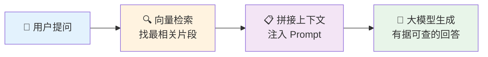
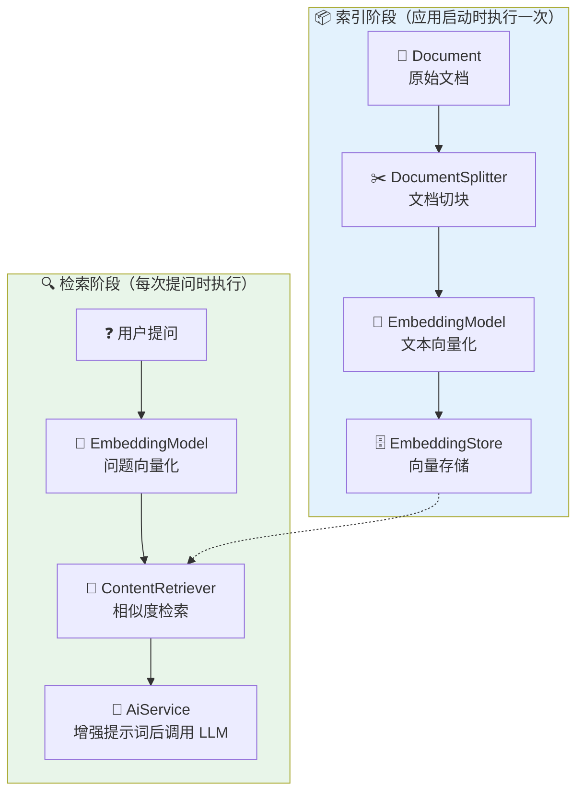
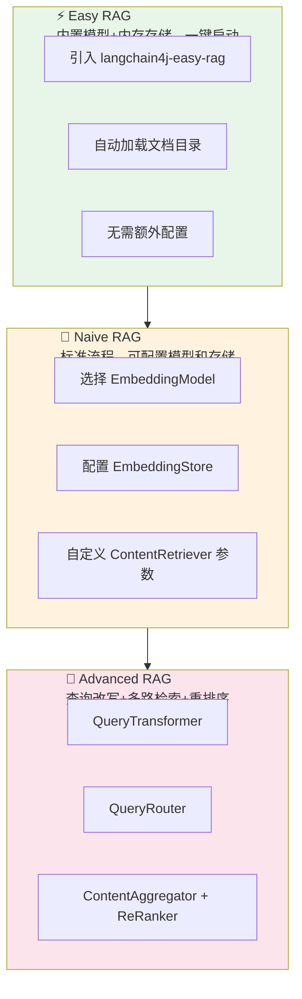
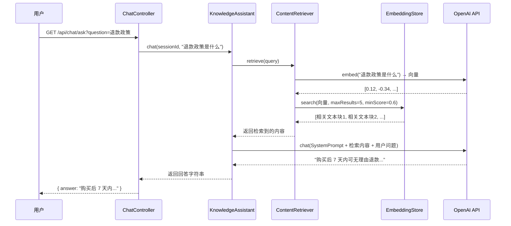
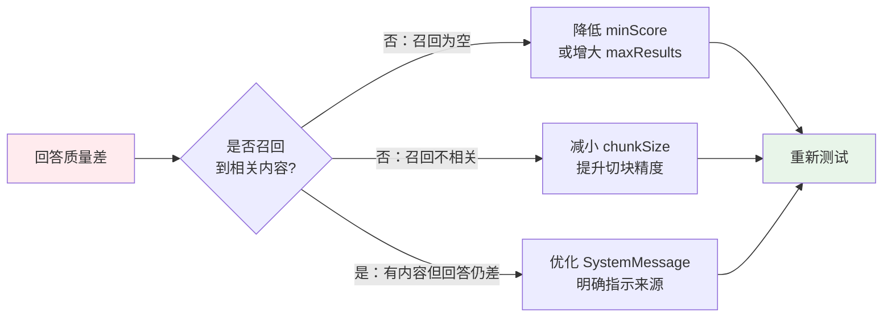
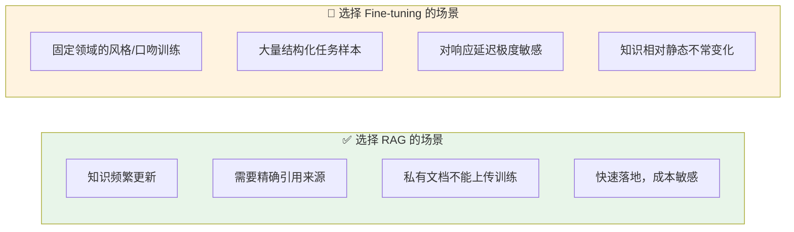

> 你是否遇到过这样的场景：公司有一大堆内部文档、产品手册、FAQ，但每次员工提问都要人工翻找？把这些文档"喂"给大模型，让它像一个全知的客服一样实时回答——这正是 RAG（Retrieval-Augmented Generation）的核心价值。
> 本文将带你用 **Spring Boot 3 + LangChain4j-spring-boot-starter 1.x** 从零搭建一个可运行的 RAG Demo，无需外部向量数据库，10分钟内跑通第一个知识库问答接口。
>
> 📌 **官方文档**：[LangChain4j Spring Boot Integration](https://docs.langchain4j.dev/tutorials/spring-boot-integration/)
>
> 📌 **适合人群**：有 Spring Boot 基础的 Java 后端开发者，想快速上手 RAG 应用开发


<MindMapFloat title="LangChain4j RAG 知识图谱">

```mindmap-data
# LangChain4j RAG
## 为什么需要 RAG
- 大模型知识有截止日期
- 企业私有知识无法训练进模型
- 直接塞文档超出上下文限制
## 核心组件
- EmbeddingModel（将文本变向量）
- EmbeddingStore（向量存储与检索）
- ContentRetriever（检索相关片段）
- AiService（声明式 AI 接口）
## RAG 三种模式
- Easy RAG（一键开箱）
- Naive RAG（标准实现）
- Advanced RAG（高级流水线）
## 关键配置
- application.yml API 密钥配置
- RagConfig Bean 装配
- DocumentSplitter 分块策略
## 常见坑点
- 版本组合不兼容
- Spring Boot 版本要求 3.5+
- 向量维度与模型不匹配
```

</MindMapFloat>

## 关于本文档

本文聚焦实战，帮你快速搭建一个基于 Spring Boot 3 + LangChain4j 的本地 RAG Demo。文档内容覆盖：

- ✅ RAG 原理与 LangChain4j 核心组件说明
- ✅ 完整 pom.xml 依赖配置（含版本号）
- ✅ application.yml 配置文件示例（OpenAI API）
- ✅ RagConfig + AiService 完整可运行代码
- ✅ 文档摄入、REST 接口调用全流程演示
- ✅ 常见报错与解决方案

## 1. 为什么大模型直接对话不够用

### 1.1 大模型的知识边界问题

大语言模型的训练数据有截止日期。如果你问 GPT-4 "我们公司 2025 年的退货政策是什么"，它根本无从得知——因为这是私有信息，从未出现在公开训练数据中。

传统的解决思路是：把整篇文档塞进 Prompt。但一篇内部手册可能有几百页，直接塞进去会：

| 问题 | 具体表现 | 量化影响 |
|------|----------|----------|
| 超出上下文窗口 | 文档被截断，信息丢失 | 4o-mini 仅支持 ~128K token |
| 费用暴增 | 每次请求都发送全文 | Token 成本线性增长 |
| 回答质量下降 | 模型在海量文本中"迷路" | 准确率明显降低 |
| 实时性差 | 文档更新后要重新拼 Prompt | 维护成本高 |

> [!IMPORTANT]
> **核心矛盾**：大模型擅长推理，但不擅长记忆私有、实时的知识。RAG 的核心思想是：**先检索，再生成**——只把最相关的片段塞给模型，而不是全部文档。


### 1.2 RAG 如何解决这个问题

可以把 RAG 比作一个"开卷考试"的流程：普通对话是让模型凭记忆作答（闭卷），RAG 则是让模型先去查书（检索），找到相关段落后再作答（开卷）。




### 1.3 LangChain4j 在 RAG 中的角色

LangChain4j 是 Java 生态中最成熟的 LLM 应用开发框架（对标 Python 的 LangChain）。它提供了 RAG 完整流水线的开箱即用实现：文档加载 → 分块 → 向量化 → 存储 → 检索 → 注入 Prompt → 生成回答，开发者只需声明接口，框架自动串联。

## 2. LangChain4j RAG 核心架构

### 2.1 六大核心组件

在动手写代码之前，先理解 LangChain4j RAG 管道中的六个角色。把它们想象成一条流水线上的工人：



| 组件 | 类名 | 职责 |
|------|------|------|
| Document | `Document` | 原始文档的抽象，包含文本内容和元数据 |
| DocumentSplitter | `DocumentSplitters` | 将长文档切割为适合嵌入的小块（Chunk） |
| EmbeddingModel | `EmbeddingModel` | 将文本块转为高维向量（语义表示） |
| EmbeddingStore | `InMemoryEmbeddingStore` 等 | 存储向量并支持相似度搜索 |
| ContentRetriever | `EmbeddingStoreContentRetriever` | 将用户问题向量化后检索最相关的文本块 |
| AiService | `@AiService` 接口 | 声明式 AI 服务，框架自动注入检索结果 |


### 2.2 Embedding 向量是什么（一分钟类比）

"向量化"是 RAG 的核心技术，听起来高深，其实类比很简单：

想象给每道菜打"口味标签"，辣度=8、甜度=2、咸度=5……这串数字就是菜品的向量。"宫保鸡丁"和"麻婆豆腐"的向量很接近（都辣），而"草莓蛋糕"的向量差很远。**EmbeddingModel 做的事就是把文字变成这样的多维"口味标签"**，语义相近的句子，向量距离也近。

> [!NOTE]
> 在 LangChain4j 中，`EmbeddingModel` 接口统一封装了各家模型的向量化 API。OpenAI 的 `text-embedding-3-small` 是性价比最高的选择之一，生成 1536 维向量，费用极低。


### 2.3 三种 RAG 实现模式对比

LangChain4j 提供了三种粒度的 RAG 实现方式，按复杂度递增：



| 维度 | Easy RAG | Naive RAG | Advanced RAG |
|------|----------|-----------|--------------|
| 上手难度 | ⭐ | ⭐⭐⭐ | ⭐⭐⭐⭐⭐ |
| 可定制性 | ❌ 无 | ✅ 中等 | ✅✅ 高 |
| 生产适用性 | 仅 Demo | ✅ 可用 | ✅ 推荐 |
| 外部依赖 | 无 | 需要 API Key | 需要 API Key + 可选向量 DB |
| 检索质量 | 一般 | 良好 | 优秀 |

本文重点讲解 **Naive RAG**（标准版实现），它是生产环境中最常用的起点。


## 3. 环境准备与项目初始化

### 3.1 前置条件

在开始之前，请确认本地环境满足以下要求：

| 依赖 | 版本要求 | 说明 |
|------|----------|------|
| JDK | 17 或以上 | LangChain4j 最低支持 Java 17 |
| Spring Boot | 3.5.x | LangChain4j Spring Starter 官方要求 |
| Maven | 3.8+ | 依赖管理 |
| OpenAI API Key | 有效 Key | 用于 Chat Model + Embedding Model |

> [!WARNING]
> LangChain4j Spring Boot Starter 从 1.x 版本起**要求 Spring Boot 3.5 及以上**。如果使用 3.3 或 3.4，需要降级使用 `1.0.0-beta` 系列版本，但不推荐长期维护。


### 3.2 完整 pom.xml 依赖配置

新建 Spring Boot 项目后，替换 `pom.xml` 为以下内容。注意：`langchain4j.version` 使用 **`1.12.2`**（核心库），Spring Starter 使用对应的兼容版本。

```xml
<?xml version="1.0" encoding="UTF-8"?>
<project xmlns="http://maven.apache.org/POM/4.0.0" xmlns:xsi="http://www.w3.org/2001/XMLSchema-instance"
         xsi:schemaLocation="http://maven.apache.org/POM/4.0.0 https://maven.apache.org/xsd/maven-4.0.0.xsd">
    <modelVersion>4.0.0</modelVersion>

    <parent>
        <groupId>org.springframework.boot</groupId>
        <artifactId>spring-boot-starter-parent</artifactId>
        <!-- Spring Boot 3.5.x，与 LangChain4j 1.x Spring Starter 兼容 -->
        <version>3.5.13</version>
        <relativePath/>
    </parent>

    <groupId>cn.smallyoung</groupId>
    <artifactId>naive-rag</artifactId>
    <version>0.0.1-SNAPSHOT</version>
    <name>naive-rag</name>
    <description>naive-rag</description>

    <properties>
        <java.version>17</java.version>
        <!-- LangChain4j 稳定版 -->
        <langchain4j.version>1.12.2</langchain4j.version>
    </properties>

    <dependencyManagement>
        <dependencies>
            <dependency>
                <groupId>dev.langchain4j</groupId>
                <artifactId>langchain4j-bom</artifactId>
                <version>${langchain4j.version}</version>
                <type>pom</type>
                <scope>import</scope>
            </dependency>
        </dependencies>
    </dependencyManagement>

    <dependencies>
        <!-- Spring Web -->
        <dependency>
            <groupId>org.springframework.boot</groupId>
            <artifactId>spring-boot-starter-web</artifactId>
        </dependency>

        <!--
          LangChain4j OpenAI Spring Boot Starter
          自动装配 ChatModel 和 EmbeddingModel Bean
        -->
        <dependency>
            <groupId>dev.langchain4j</groupId>
            <artifactId>langchain4j-open-ai-spring-boot-starter</artifactId>
        </dependency>

        <!--
          LangChain4j Spring Boot Starter
          提供 @AiService 注解自动扫描与注册
        -->
        <dependency>
            <groupId>dev.langchain4j</groupId>
            <artifactId>langchain4j-spring-boot-starter</artifactId>
        </dependency>

        <!-- Lombok：简化 POJO 代码 -->
        <dependency>
            <groupId>org.projectlombok</groupId>
            <artifactId>lombok</artifactId>
            <optional>true</optional>
        </dependency>

        <!-- 测试依赖 -->
        <dependency>
            <groupId>org.springframework.boot</groupId>
            <artifactId>spring-boot-starter-test</artifactId>
            <scope>test</scope>
        </dependency>
    </dependencies>

    <build>
        <finalName>${project.artifactId}</finalName>
        <plugins>
            <plugin>
                <groupId>org.springframework.boot</groupId>
                <artifactId>spring-boot-maven-plugin</artifactId>
                <configuration>
                    <excludes>
                        <exclude>
                            <groupId>org.projectlombok</groupId>
                            <artifactId>lombok</artifactId>
                        </exclude>
                    </excludes>
                </configuration>
            </plugin>
        </plugins>
    </build>
</project>
```

> [!TIP]
> 如果你不使用 OpenAI，可以把 `langchain4j-open-ai-spring-boot-starter` 替换为 `langchain4j-ollama-spring-boot-starter`（本地 Ollama）。切换模型只需改 pom.xml 和 application.yml，业务代码**无需改动**。

## 4. 配置文件与项目结构

### 4.1 application.yml 配置

在 `src/main/resources/application.yml` 中填入以下内容：

```yaml
server:
  port: 8080
  servlet:
    encoding:
      charset: UTF-8
      enabled: true
      force: true

spring:
  application:
    name: naive-rag
  messages:
    encoding: UTF-8


# LangChain4j OpenAI 配置，本项目使用阿里云的百炼平台的OpenAI接口
# 环境变量方式：OPENAI_API_KEY=sk-xxx 启动应用
langchain4j:
  open-ai:
    # Chat Model：负责最终生成回答
    chat-model:
      baseUrl: https://dashscope.aliyuncs.com/compatible-mode/v1
      api-key: ${API_KEY}
      model-name: qwen-plus
      temperature: 0.2              # 偏低温度让回答更精准
      log-requests: true            # 开发阶段建议开启，便于调试
      log-responses: true

    # Embedding Model：负责将文本转为向量
    embedding-model:
      baseUrl: https://dashscope.aliyuncs.com/compatible-mode/v1
      api-key: ${API_KEY}
      model-name: text-embedding-v3
```

### 4.2 项目目录结构

```
naive-rag/
├── src/
│   └── main/
│       ├── java/cn/smallyoung/naiverag/
│       │   ├── NaiveRagApplication.java      # 启动类
│       │   ├── config/
│       │   │   └── RagConfig.java           # RAG 核心 Bean 配置
│       │   ├── service/
│       │   │   └── KnowledgeAssistant.java  # @AiService 声明式接口
│       │   └── controller/
│       │       └── ChatController.java      # REST 接口
│       └── resources/
│           ├── application.yml
│           └── docs/                        # 放置你的知识库文档
│               └── product-faq.txt          # 示例知识文档
```

### 4.3 知识库示例文档

在 `src/main/resources/docs/product-faq.txt` 创建一个模拟 FAQ 文件，用于测试 RAG 效果：

```
产品名称：智能客服机器人 SmartBot Pro

退款政策：
购买后 7 天内可无理由退款，申请退款请联系 support@example.com。
超过 7 天但在 30 天内，如产品存在质量问题可以申请退款。

使用指南：
SmartBot Pro 支持接入微信、钉钉、飞书三种平台。
接入步骤：1. 登录控制台 2. 创建应用 3. 复制 AppKey 4. 按照 SDK 文档集成。

套餐说明：
基础版：每月 10,000 次调用，￥299/月
专业版：每月 100,000 次调用，￥999/月
企业版：不限调用次数，定制报价，联系 sales@example.com

技术支持：
工作时间：周一至周五 9:00-18:00
紧急问题请发邮件至 urgent@example.com，响应时间 2 小时以内。
```

## 5. 核心代码实现

### 5.1 RAG 配置类：RagConfig

`RagConfig` 是整个 RAG 流水线的"装配工厂"，它负责：初始化向量存储 → 加载文档 → 切分 → 向量化存储 → 创建检索器。


```java
package cn.smallyoung.naiverag.config;


import dev.langchain4j.data.document.Document;
import dev.langchain4j.data.document.loader.FileSystemDocumentLoader;
import dev.langchain4j.data.document.splitter.DocumentSplitters;
import dev.langchain4j.data.segment.TextSegment;
import dev.langchain4j.memory.chat.ChatMemoryProvider;
import dev.langchain4j.memory.chat.MessageWindowChatMemory;
import dev.langchain4j.model.embedding.EmbeddingModel;
import dev.langchain4j.rag.content.retriever.ContentRetriever;
import dev.langchain4j.rag.content.retriever.EmbeddingStoreContentRetriever;
import dev.langchain4j.store.embedding.EmbeddingStore;
import dev.langchain4j.store.embedding.EmbeddingStoreIngestor;
import dev.langchain4j.store.embedding.inmemory.InMemoryEmbeddingStore;
import lombok.extern.slf4j.Slf4j;
import org.springframework.context.annotation.Bean;
import org.springframework.context.annotation.Configuration;
import org.springframework.core.io.ClassPathResource;

import java.io.IOException;
import java.nio.file.Path;
import java.util.List;

/**
 *
 * @author smallyoung
 * @date 2026/4/8
 *
 */

@Slf4j
@Configuration
public class RagConfig {

    /**
     * 1. 创建内存向量存储（开发/演示阶段使用）
     * 生产环境可替换为 Milvus、PGVector、Redis 等持久化存储
     */
    @Bean
    public EmbeddingStore<TextSegment> embeddingStore() {
        return new InMemoryEmbeddingStore<>();
    }

    /**
     * 2. 文档摄入：加载 → 切块 → 向量化 → 存储
     * 应用启动时执行一次，将文档索引到向量存储中
     *
     * @param embeddingModel Spring Starter 自动装配的 OpenAI Embedding Model Bean
     * @param embeddingStore 上方创建的内存向量存储
     */
    @Bean
    public EmbeddingStoreIngestor embeddingStoreIngestor(
            EmbeddingModel embeddingModel,
            EmbeddingStore<TextSegment> embeddingStore) throws IOException {

        // 加载 resources/docs 目录下所有文档
        Path docsPath = new ClassPathResource("docs").getFile().toPath();
        List<Document> documents = FileSystemDocumentLoader.loadDocuments(docsPath);
        log.info("📄 已加载 {} 份文档准备索引", documents.size());

        // 构建文档摄入器：递归切块，每块 500 字符，重叠 50 字符
        // 重叠（overlap）能保留块边界处的上下文，避免信息断裂
        EmbeddingStoreIngestor ingestor = EmbeddingStoreIngestor.builder()
                .documentSplitter(DocumentSplitters.recursive(500, 50))
                .embeddingModel(embeddingModel)
                .embeddingStore(embeddingStore)
                .build();

        // 执行摄入（向量化并写入存储）
        ingestor.ingest(documents);
        log.info("✅ 文档索引完成，RAG 知识库就绪");

        return ingestor;
    }

    /**
     * 3. 创建内容检索器
     * 每次用户提问时，检索器将问题向量化后在 EmbeddingStore 中找最相关的文本块
     *
     * @param embeddingModel 同一个 Embedding Model，保证问题和文档用同一模型编码
     * @param embeddingStore 已完成索引的向量存储
     */
    @Bean
    public ContentRetriever contentRetriever(
            EmbeddingModel embeddingModel,
            EmbeddingStore<TextSegment> embeddingStore) {

        return EmbeddingStoreContentRetriever.builder()
                .embeddingStore(embeddingStore)
                .embeddingModel(embeddingModel)
                // 最多返回 5 个最相关的文本块
                .maxResults(5)
                // 最低相似度得分（0~1），低于此值的结果被过滤掉
                .minScore(0.6)
                .build();
    }

    /**
     * 4. 创建对话记忆提供者
     * 用于支持 @MemoryId 实现多轮对话。
     * 每个 memoryId 将对应一个独立的 MessageWindowChatMemory，
     * 默认保留最近 10 条消息以节省内存并减少 Token 消耗。
     */
    @Bean
    public ChatMemoryProvider chatMemoryProvider() {
        return memoryId -> MessageWindowChatMemory.builder()
                .id(memoryId)
                .maxMessages(10)
                .build();
    }
}
```

### 5.2 声明式 AI 服务接口：KnowledgeAssistant

`@AiService` 是 LangChain4j Spring Starter 的核心注解。只需声明一个接口，框架会在启动时自动生成实现，并将 `ContentRetriever`、`ChatModel`、`ChatMemory` 等 Bean **自动注入**，无需手动调用 `AiServices.builder()`。


```java
package cn.smallyoung.naiverag.service;

import dev.langchain4j.service.MemoryId;
import dev.langchain4j.service.SystemMessage;
import dev.langchain4j.service.UserMessage;
import dev.langchain4j.service.spring.AiService;

/**
 * 声明式 AI 服务接口
 * 框架自动装配：
 * - ChatModel（来自 application.yml 配置）
 * - ContentRetriever（来自 RagConfig.contentRetriever Bean）
 * - ChatMemory（InMemoryMessageWindowChatMemory，默认保留最近 10 条消息）
 *
 * @author smallyoung
 * @date 2026/4/8
 *
 */
@AiService
public interface KnowledgeAssistant {

    /**
     * 基于知识库回答问题
     *
     * @param memoryId    会话 ID，同一 memoryId 共享对话历史（多轮对话）
     * @param userMessage 用户的问题
     * @return 基于知识库检索结果生成的回答
     */
    @SystemMessage("""
            你是一个专业的产品客服助手。
            请严格基于提供给你的知识库内容回答用户问题。
            如果知识库中没有相关信息，请直接告知用户"抱歉，我的知识库中没有这方面的信息"，
            不要凭空捏造答案。
            请用中文回答，保持简洁专业。
            """)
    String chat(@MemoryId String memoryId, @UserMessage String userMessage);
}
```

> [!IMPORTANT]
> `@AiService` 注解的接口会被 LangChain4j 自动扫描并注册为 Spring Bean。当 Spring 上下文中存在 `ContentRetriever` Bean 时，框架会**自动**将其绑定到所有 `@AiService` 接口，无需显式声明。

### 5.3 REST 控制器：ChatController

```java
package cn.smallyoung.naiverag.controller;

import cn.smallyoung.naiverag.service.KnowledgeAssistant;
import jakarta.annotation.Resource;
import lombok.RequiredArgsConstructor;
import lombok.extern.slf4j.Slf4j;
import org.springframework.web.bind.annotation.GetMapping;
import org.springframework.web.bind.annotation.RequestMapping;
import org.springframework.web.bind.annotation.RequestParam;
import org.springframework.web.bind.annotation.RestController;

/**
 *
 * @author smallyoung
 * @date 2026/4/8
 *
 */

@Slf4j
@RestController
@RequestMapping("/api/chat")
@RequiredArgsConstructor
public class ChatController {

    @Resource
    private KnowledgeAssistant assistant;

    /**
     * 单次问答接口
     * GET /api/chat/ask?sessionId=user001&question=退款政策是什么
     */
    @GetMapping("/ask")
    public ChatResponse ask(
            @RequestParam(defaultValue = "default-session") String sessionId,
            @RequestParam String question) {

        long startTime = System.currentTimeMillis();
        String answer = assistant.chat(sessionId, question);
        long elapsed = System.currentTimeMillis() - startTime;

        return new ChatResponse(sessionId, question, answer, elapsed);
    }

    /**
     * 响应 DTO
     */
    public record ChatResponse(
            String sessionId,
            String question,
            String answer,
            long elapsedMs) {
    }
}

```

### 5.4 启动类

```java
package cn.smallyoung.naiverag;

import org.springframework.boot.SpringApplication;
import org.springframework.boot.autoconfigure.SpringBootApplication;

@SpringBootApplication
public class NaiveRagApplication {

    public static void main(String[] args) {
        SpringApplication.run(NaiveRagApplication.class, args);
    }

}

```

## 6. 运行与测试

### 6.1 启动应用

设置 OpenAI API Key 环境变量后，运行应用：

```bash
# 方式一：环境变量（推荐）
export OPENAI_API_KEY=sk-xxxxxxxxxxxxxxxx
mvn spring-boot:run

# 方式二：命令行参数
mvn spring-boot:run -Dspring-boot.run.jvmArguments="-DOPENAI_API_KEY=sk-xxx"
```

启动成功后，你应该能在控制台看到如下日志：

```
📄 已加载 1 份文档准备索引
✅ 文档索引完成，RAG 知识库就绪
Started RagDemoApplication in 8.3 seconds
```

### 6.2 调用接口测试

使用 curl 或 Postman 测试知识库问答效果：

```bash
# 测试 1：查询退款政策（知识库中存在）
curl "http://localhost:8080/api/chat/ask?question=退款政策是什么"

# 预期输出：
# {
#   "sessionId": "default-session",
#   "question": "退款政策是什么",
#   "answer": "购买后 7 天内可无理由退款，申请退款请联系 support@example.com。30 天内如有质量问题也可申请退款。",
#   "elapsedMs": 1243
# }

# 测试 2：多轮对话（同一 sessionId 保持上下文）
curl "http://localhost:8080/api/chat/ask?sessionId=user001&question=你好，我想了解你们的套餐"
curl "http://localhost:8080/api/chat/ask?sessionId=user001&question=专业版多少钱？"

# 测试 3：问知识库中不存在的问题
curl "http://localhost:8080/api/chat/ask?question=你们支持微信支付吗"
# 预期：模型告知知识库中没有这方面信息，而不是乱编
```



## 7. 进阶：自定义 AiService 绑定（显式模式）

### 7.1 为什么需要显式绑定

默认情况下，`@AiService` 会自动绑定 Spring 上下文中**所有**同类型 Bean（如全局唯一的 `ContentRetriever`）。但如果你有多个知识库（比如售前知识库和售后知识库），就需要用显式模式精确控制绑定关系。

```java
/**
 * 显式模式下，通过 AiServices.builder() 手动绑定指定的 ContentRetriever Bean。
 * 适合在同一应用中有多个不同知识库（售前/售后）的场景。
 *
 * 注意：当使用编程式 builder 时，该接口不需要 @AiService 注解，
 * 改为在 @Configuration 中手动注册 Bean。
 */
public interface AfterSaleAssistant {
    @SystemMessage("你是售后专员，专注处理退款和投诉问题")
    String chat(@MemoryId String sessionId, @UserMessage String userMessage);
}

// --- 在 @Configuration 中注册 ---
@Bean
public AfterSaleAssistant afterSaleAssistant(
        ChatModel chatModel,
        ContentRetriever afterSaleContentRetriever) {

    return AiServices.builder(AfterSaleAssistant.class)
            .chatModel(chatModel)
            // 显式绑定售后专属的检索器，与售前知识库隔离
            .contentRetriever(afterSaleContentRetriever)
            .chatMemoryProvider(memoryId ->
                    MessageWindowChatMemory.withMaxMessages(10))
            .build();
}
```

### 7.2 生产级 RagConfig 扩展示例

当需要接入外部向量数据库（如 PGVector）时，只需替换 `EmbeddingStore` Bean 实现，其余代码不变：

```java
// 将 InMemoryEmbeddingStore 替换为 PGVectorEmbeddingStore（需引入对应依赖）
// <dependency>
//   <groupId>dev.langchain4j</groupId>
//   <artifactId>langchain4j-pgvector</artifactId>
//   <version>${langchain4j.version}</version>
// </dependency>

@Bean
public EmbeddingStore<TextSegment> embeddingStore(DataSource dataSource) {
    return PgVectorEmbeddingStore.builder()
            .dataSource(dataSource)
            .table("knowledge_embeddings")
            // 维度必须与 EmbeddingModel 输出一致
            // text-embedding-3-small → 1536
            .dimension(1536)
            .createTable(true)
            .build();
}
```

> [!TIP]
> **动态文档摄入**：如果需要在运行时上传新文档（而非仅在启动时加载），只需将 `EmbeddingStoreIngestor` 注入到一个 Service 中，在上传接口中调用 `ingestor.ingest(document)` 即可。


## 8. 常见问题与踩坑指南

### 8.1 依赖冲突与版本不兼容

LangChain4j 的 Spring Starter 与核心库版本**必须配套**，否则会报 `NoSuchMethodError` 或 Bean 注册失败。

| 症状 | 原因 | 解决方案 |
|------|------|----------|
| `NoSuchMethodError: EmbeddingModel.embed()` | 核心库与 Starter 版本不匹配 | 确保 `langchain4j` 核心与 Starter 使用同一大版本 |
| `BeanCreationException: ContentRetriever` | Spring Boot 版本过低 | 升级到 Spring Boot 3.5.x |
| `InMemoryEmbeddingStore` 找不到类 | 缺少 `langchain4j` 核心依赖 | 在 pom.xml 中显式添加 `langchain4j` 依赖 |
| `UnsatisfiedDependencyException: EmbeddingModel` | Embedding Model 未配置 | 检查 application.yml 中 `embedding-model` 配置是否完整 |

> [!CAUTION]
> **常见错误**：仅引入 `langchain4j-open-ai-spring-boot-starter` 而未引入 `langchain4j-spring-boot-starter`，会导致 `@AiService` 注解不被扫描，AI 接口 Bean 注册失败。两个 Starter **都需要引入**。

### 8.2 检索质量差的调优策略

如果发现模型回答的内容与知识库不符，或者召回了无关内容，按以下顺序排查：



**切块策略调优参考**：

| 文档类型 | 推荐 chunkSize | 推荐 overlap | 说明 |
|----------|---------------|-------------|------|
| 短 FAQ 文本 | 200~300 | 20~30 | 每条 FAQ 独立一块，避免混淆 |
| 长篇手册/报告 | 500~800 | 50~100 | 保留段落完整语义 |
| 代码文档 | 300~500 | 0~20 | 代码块不宜过度重叠 |
| 结构化表格 | 逐行切分 | 0 | 每行一个记录，保持原子性 |


### 8.3 多文档格式支持

`FileSystemDocumentLoader` 默认使用 `TextDocumentParser`，只能处理纯文本。要支持 PDF、Word、Markdown 等格式，需要引入 Apache Tika 解析器：

```xml
<!-- pom.xml 追加 Tika 支持 -->
<dependency>
    <groupId>dev.langchain4j</groupId>
    <artifactId>langchain4j-document-parser-apache-tika</artifactId>
    <version>${langchain4j.version}</version>
</dependency>
```

```java
// 使用 ApacheTikaDocumentParser 加载混合格式文档
List<Document> documents = FileSystemDocumentLoader.loadDocuments(
    docsPath,
    new ApacheTikaDocumentParser()   // 自动识别 PDF/Word/Markdown
);
```

## 9. RAG 与 Fine-tuning 的选择

很多开发者会问："我是用 RAG 还是微调（Fine-tuning）？"两者并不互斥，但适用场景不同：



| 对比维度 | RAG | Fine-tuning |
|----------|-----|-------------|
| 知识更新成本 | 低（重新摄入文档） | 高（需重新训练） |
| 知识可追溯性 | ✅ 可以溯源检索片段 | ❌ 难以追溯 |
| 实现复杂度 | 中等 | 高（需要训练数据） |
| 适合场景 | 私有知识问答、文档检索 | 语气风格、专业术语习惯 |
| 成本 | API 调用费 + 向量存储 | 训练费 + 部署费 |

> [!IMPORTANT]
> **实践建议**：优先尝试 RAG。RAG 能解决 80% 的私有知识问答需求，实现周期短、知识可维护。只有在 RAG 效果已达上限、但仍有特定风格或专业术语需求时，再考虑 Fine-tuning 作为补充。


## 10. 总结

| 核心概念 | 一句话解释 |
|---------|-----------|
| EmbeddingModel | 将文字转成向量数字，语义相近的文字向量距离近 |
| EmbeddingStore | 存储所有文档片段的向量，支持相似度搜索 |
| ContentRetriever | 把用户问题向量化后，从 EmbeddingStore 中找最相关的片段 |
| @AiService | 声明式 AI 接口，框架自动注入 RAG 管道和对话记忆 |
| DocumentSplitter | 将长文档切成小块，控制 chunkSize 和 overlap |
| InMemoryEmbeddingStore | 基于内存的向量存储，适合 Demo 和小规模场景 |

> [!TIP]
> **学习路径建议**：
> 1. 跑通本文 Demo → 理解 RAG 全流程
> 2. 替换 `InMemoryEmbeddingStore` 为 PGVector 或 Milvus → 实现持久化
> 3. 探索 Advanced RAG（QueryTransformer + ReRanker）→ 提升检索质量
> 4. 结合 `@Tool` 注解实现 Agentic RAG → 让模型自主决定何时检索


## 参考资料

### 官方文档

| 资源 | 说明 |
|------|------|
| [LangChain4j 官方文档 - RAG](https://docs.langchain4j.dev/tutorials/rag/) | RAG 完整 API 说明与示例 |
| [LangChain4j Spring Boot 集成文档](https://docs.langchain4j.dev/tutorials/spring-boot-integration/) | Spring Boot Starter 使用指南 |
| [LangChain4j GitHub 仓库](https://github.com/langchain4j/langchain4j) | 源码与 Examples |

### 推荐资源

- [LangChain4j Spring Examples](https://github.com/langchain4j/langchain4j-spring) — 官方 Spring Boot 集成示例
- [Spring Petclinic + LangChain4j](https://github.com/spring-petclinic/spring-petclinic-langchain4j) — 生产级 RAG 集成参考项目
- [OpenAI Embedding 文档](https://platform.openai.com/docs/guides/embeddings) — text-embedding-3-small 规格说明
