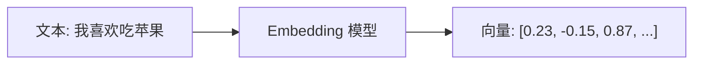
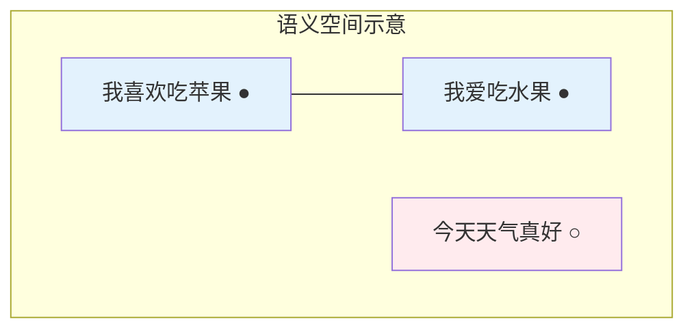
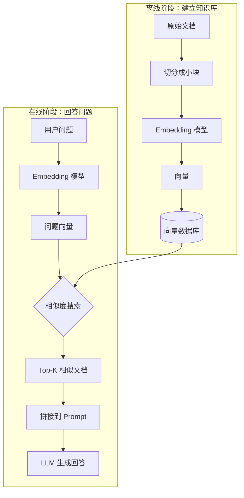
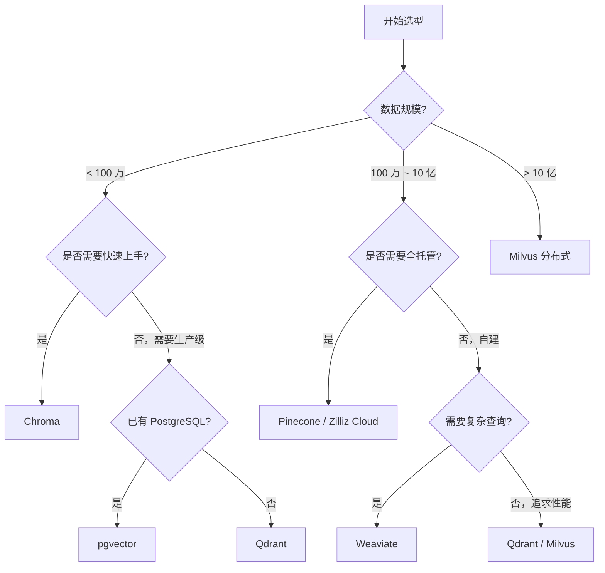
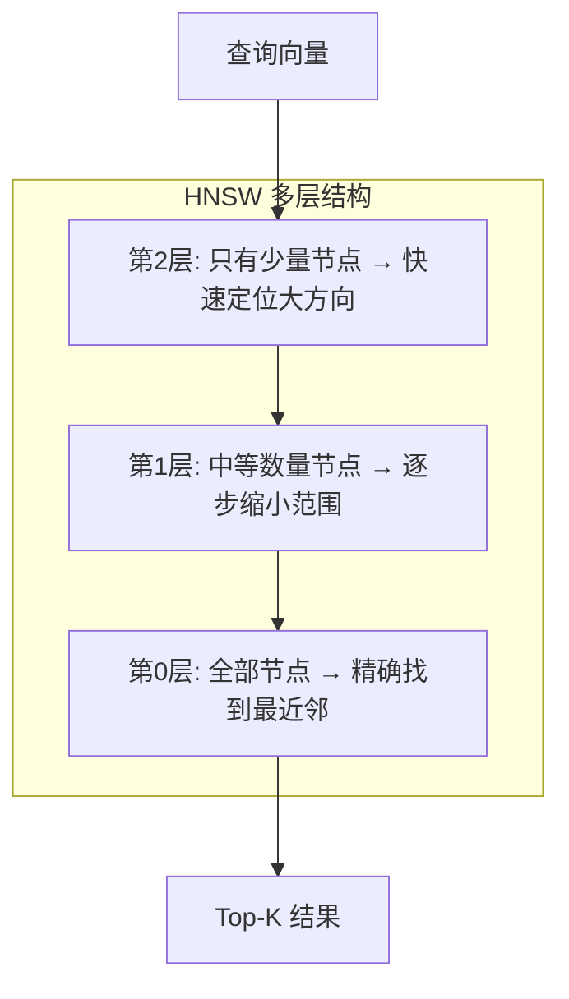

# 为什么 RAG 要使用向量数据库

> 本文**面向初学者**，从问题出发，一步步讲透 RAG 的底层核心原理。我们先提出核心问题，再逐层解构答案，让你真正理解：**为什么 RAG 离不开向量数据库？**
>
> 📌 **核心论文**：[Retrieval-Augmented Generation for Knowledge-Intensive NLP Tasks](https://arxiv.org/abs/2005.11401)（arXiv:2005.11401）  
> 📌 **发布时间**：2020 年 5 月（Meta AI / Facebook AI Research）  
> 📌 **适合人群**：AI 初学者、对 RAG 感兴趣的开发者


> 🎧 **更喜欢听？试试本文的音频版本**
<AudioPlayer 
  src="//pub.smallyoung.cn/course_slidev/rag-vector/RAG为何必须依赖向量数据库.m4a"
  \author="SmallYoung"
/>

<VideoPlayer 
  src="//pub.smallyoung.cn/course_slidev/rag-vector/为什么RAG需要向量数据库.mp4"
/>

<MindMapFloat title="RAG 与向量数据库知识图谱">

```mindmap-data
# 为什么 RAG 使用向量数据库
## 核心问题
- RAG 需要"语义搜索"
- 传统数据库只能"关键词匹配"
- → 必须引入向量数据库
## 底层原理
- 向量: 一组有序数字
- Embedding: 文本→向量
- 语义空间: 相似含义=相近距离
- 相似度: 余弦/欧氏距离
## 主流模型维度
- OpenAI: 1536/3072 维
- BGE: 1024 维
- Cohere: 1024/1536 维
- Jina: 768/1024 维
## 主流向量数据库
- 开源: Milvus, Qdrant, Chroma
- 云服务: Pinecone, Zilliz Cloud
```

</MindMapFloat>

## 1. 先问问题：RAG 到底需要什么能力？

在讲向量数据库之前，我们先思考一个问题：

> **RAG 系统的核心需求是什么？**

RAG（Retrieval-Augmented Generation，检索增强生成）的工作流程可以简化为：

```
用户问题 → 【在知识库中找到相关内容】 → 把内容给 LLM → 生成答案
```

关键在于中间那一步：**如何在知识库中找到"真正相关"的内容？**

### 1.1 两种搜索方式的对比

| 用户问题 | 传统关键词搜索 | 理想的语义搜索 |
|----------|---------------|---------------|
| "AI 是什么？" | 只能找到包含"AI"两个字母的文档 | 能找到"人工智能"、"机器学习"相关文档 |
| "苹果公司市值" | 可能匹配到"苹果营养价值" | 只匹配科技公司相关内容 |
| "手机卡顿怎么办" | 找不到"设备性能优化指南" | 能理解这是同一个问题 |

**结论**：RAG 需要的是**语义搜索**——理解问题的"含义"，而不是匹配字面关键词。

### 1.2 核心问题

> **问题**：传统数据库（MySQL、PostgreSQL）只能做关键词匹配，无法理解语义。那怎么实现语义搜索呢？
>
> **答案**：先把文本转成向量（Embedding），然后用向量数据库做相似度搜索。

这就是 RAG 必须使用向量数据库的根本原因。

接下来，我们一步步解释：什么是向量？什么是 Embedding？相似度搜索是怎么回事？
## 2. 什么是向量？

要理解向量数据库，首先要理解最基础的概念：**向量**。

### 2.1 向量的直观定义


**向量就是一组有序的数字**。就这么简单。

```
向量例子：
[3, 4]
[0.5, 0.8, 0.2]
[0.23, -0.15, 0.87, 0.42, ..., 0.31]  (可能有几百上千个数字)
```

你可以把向量想象成**描述一个东西的"特征列表"**：

| 现实场景 | 向量表示 | 含义 |
|----------|----------|------|
| 地图坐标 | [120.5, 31.2] | 经度 120.5°，纬度 31.2° |
| RGB 颜色 | [255, 0, 0] | 红色分量 255，绿色 0，蓝色 0（纯红色）|
| 学生成绩 | [85, 92, 78] | 语文 85，数学 92，英语 78 |

> [!NOTE]
> **关键概念**：向量的**维度**就是数字的个数。[3, 4] 是 2 维向量，[85, 92, 78] 是 3 维向量。后面你会看到，Embedding 模型通常生成 768~3072 维的向量。

### 2.2 向量的几何意义

**向量可以看作空间中的一个"点"**。

以 2 维向量为例：
- 向量 A = [3, 4] → 在平面上就是坐标 (3, 4) 的点
- 向量 B = [4, 3] → 在平面上就是坐标 (4, 3) 的点

两个点之间可以计算**距离**——距离越近，表示它们越"相似"。

这个简单的数学原理，就是向量数据库能够实现"相似搜索"的基础！
## 3. 什么是 Embedding？

现在问题来了：**文本不是数字，怎么变成向量？**

答案是：使用 **Embedding（嵌入）模型**。

### 3.1 Embedding 的核心思想

**Embedding = 把任意内容（文本、图片、音频）转换成向量的技术**。



以文本为例：

```python
# 伪代码演示
from openai import OpenAI
client = OpenAI()

text = "我喜欢吃苹果"
response = client.embeddings.create(input=text, model="text-embedding-3-small")
vector = response.data[0].embedding

print(len(vector))  # 输出：1536（这就是向量的维度）
print(vector[:5])   # 输出：[0.023, -0.156, 0.087, 0.421, -0.089]
```

### 3.2 Embedding 的神奇之处

Embedding 模型经过大量数据训练后，学会了一个惊人的能力：

> **语义相近的文本，会被映射到向量空间中相近的位置。**

举一个具体例子：

| 文本 | 向量（简化示意） | 与"我喜欢吃苹果"的距离 |
|------|-----------------|----------------------|
| "我喜欢吃苹果" | [0.8, 0.2, 0.1, ...] | 0（自己） |
| "我爱吃水果" | [0.75, 0.25, 0.12, ...] | **0.05**（非常近！语义相似） |
| "今天天气真好" | [0.1, 0.6, 0.9, ...] | **0.89**（很远，语义不同） |




> [!IMPORTANT]
> **核心公式**：Embedding 的本质是一个函数 `f(text) → vector`，它把文本映射到高维空间，使得**语义相似的文本在空间中距离更近**。这是 RAG 能够"理解语义"的根本原理。

### 3.3 为什么 Embedding 能捕捉语义？


Embedding 模型（如 BERT、GPT）是通过**海量文本数据训练**出来的。

训练过程中，模型学习到：
- "苹果"和"水果"经常出现在相似的语境中
- "喜欢"和"爱"表达相似的情感
- 因此它们的向量应该相近

这就像一个读过几百亿本书的人，自然理解了词语之间的关系。

### 3.4 更直观的类比：Embedding 在学什么？

想象你是一个读了几百亿本书的人：

- 当你看到"苹果公司"，你会联想到：科技、iPhone、硅谷
- 当你看到"吃苹果"，你会联想到：水果、健康、营养

虽然都有"苹果"两个字，但你的大脑会把它们放在完全不同的"概念区域"。

**Embedding 模型做的就是同样的事情**——通过阅读海量文本，学会了把：
- 相似语境的词放在向量空间的**相近位置**
- 不同语境的同一个词放在**不同位置**

> [!TIP]
> **一句话总结**：Embedding 不是简单的"翻译"，而是把文本的"意思"编码成了向量空间中的"位置"。
## 4. 主流 Embedding 模型与向量维度

不同的 Embedding 模型生成的向量维度不同。**维度越高，通常能捕捉越丰富的语义信息，但也需要更多存储空间和计算资源**。

### 4.1 主流 Embedding 模型对比（2026）


| 厂商 | 模型名称 | 向量维度 | 特点 |
|------|----------|----------|------|
| **OpenAI** | text-embedding-3-small | 1536 维 | 性价比高，支持动态降维到 512 维，$0.020/1M tokens |
| **OpenAI** | text-embedding-3-large | 3072 维 | 最高精度，支持降维到 256/1024 维，$0.130/1M tokens |
| **OpenAI** | text-embedding-ada-002 | 1536 维 | 上一代模型，仍广泛使用 |
| **阿里通义千问** | text-embedding-v4 | 64-2048 维（可调） | 性能较 v3 提升 15%-40%，多语言支持，8K 长文本 |
| **阿里通义千问** | Qwen3-Embedding-8B | 可变维度 | 开源旗舰模型，MTEB 榜单优秀 |
| **阿里通义千问** | Qwen3-VL-Embedding | 多模态 | 多模态嵌入，支持图文跨模态检索（2026 年 1 月发布）|
| **智谱 AI** | Embedding-3 | 可变维度 | 支持自定义向量维度，性能与成本平衡 |
| **百度文心** | 文心 5.0 Embedding | 多模态 | 原生全模态统一建模，2.4 万亿参数 MoE 架构 |
| **字节豆包** | doubao-embedding | 标准维度 | 中英双语支持，面向向量检索场景 |
| **Kimi (月之暗面)** | Kimi Embedding | 标准维度 | 支持超长文本，Context Caching 技术降低成本 90% |
| **BAAI** | BGE-large-zh-v1.5 | 1024 维 | 中文最佳开源模型之一 |
| **BAAI** | BGE-M3 | 1024 维 | 多语言、多功能 |
| **Cohere** | embed-v4.0 | 256-1536 维（可调）| 多模态支持，100+ 语言，128K 上下文，$0.12/1M tokens |
| **Cohere** | Embed English v3 | 1024 维 | 企业级英文模型 |
| **Jina AI** | jina-embeddings-v3 | 1024 维 | 支持 8K 长文本，可降维到 32 维 |
| **Voyage AI** | voyage-3.5-lite | 512 维 | 轻量高效，成本优化 |
| **Voyage AI** | voyage-3 | 1024 维 | 检索质量优秀 |
| **Voyage AI** | voyage-3-large | 2048 维 | 支持降维到 256/512/1024 维 |
| **Google** | Gemini text-embedding-004 | 768 维 | Google 最新模型 |
| **Mistral** | mistral-embed | 标准维度 | MTEB 榜单最高准确率 77.8%（2026 年初）|

> [!TIP]
> **选型建议（2026 年更新）**：
> - **中文场景**：优先考虑阿里通义千问 Qwen3-Embedding（开源高性能）、智谱 Embedding-3（灵活可调）或 BGE 系列（开源免费）
> - **国内部署**：百度文心 5.0（多模态）、字节豆包 doubao-embedding（中英双语）
> - **超长文本**：Kimi Embedding（Context Caching 技术）或阿里 text-embedding-v4（8K 支持）
> - **多模态需求**：阿里 Qwen3-VL-Embedding、百度文心 5.0、Cohere embed-v4.0
> - **英文场景**：OpenAI text-embedding-3-large、Voyage AI、Mistral-embed（最高准确率）
> - **成本敏感**：使用支持"动态降维"的模型（如 OpenAI text-embedding-3、阿里 text-embedding-v4、Cohere embed-v4.0），降低存储成本
> - **快速原型**：OpenAI text-embedding-3-small（性价比高）或 Voyage-3.5-lite（轻量快速）

### 4.2 向量维度的影响

| 维度 | 单向量存储 | 100 万向量存储 | 精度 |
|------|-----------|---------------|------|
| 512 维 | ~2 KB | ~2 GB | 中等 |
| 768 维 | ~3 KB | ~3 GB | 较高 |
| 1024 维 | ~4 KB | ~4 GB | 高 |
| 1536 维 | ~6 KB | ~6 GB | 很高 |
| 3072 维 | ~12 KB | ~12 GB | 最高 |

## 5. 相似度计算：向量如何比较"像不像"？

有了向量，下一步就是计算它们之间有多"相似"。

### 5.1 余弦相似度（Cosine Similarity）


**余弦相似度**是最常用的相似度指标，它测量两个向量**方向**上的相似程度。

```
余弦相似度 = cos(θ) = (A · B) / (|A| × |B|)

其中：
- A · B 是向量点积（对应元素相乘再求和）
- |A| 是向量 A 的长度（模）
- θ 是两个向量的夹角
```

**直观理解**：

| 余弦值 | 夹角 | 含义 |
|--------|------|------|
| 1 | 0° | 方向完全相同，最相似 |
| 0 | 90° | 完全正交，不相关 |
| -1 | 180° | 方向完全相反 |

### 5.2 实际计算示例

假设有两个简化的 3 维向量：

```
A = [1, 2, 3]
B = [2, 4, 6]

计算步骤：
1. 点积：A · B = 1×2 + 2×4 + 3×6 = 2 + 8 + 18 = 28
2. A 的长度：|A| = √(1² + 2² + 3²) = √14 ≈ 3.74
3. B 的长度：|B| = √(2² + 4² + 6²) = √56 ≈ 7.48
4. 余弦相似度 = 28 / (3.74 × 7.48) ≈ 1.0
```

结果为 1.0，说明 A 和 B **完全相似**（其实 B = 2×A，方向完全一致）。

> [!NOTE]
> **为什么用余弦而不是直接比较数字？**
> 
> 余弦相似度**忽略向量的"长度"，只关注"方向"**。这正好符合我们的需求：判断语义是否相似，而不是文本长度是否相同。
## 6. 把它们连起来：RAG 的完整工作原理


现在我们已经理解了所有基础概念，可以把它们串起来，看 RAG 是如何工作的。

### 6.1 RAG 的两个阶段



> [!NOTE]
> **什么是 Top-K？**
> 
> Top-K 指的是返回**最相似的 K 条结果**。比如 Top-3 就是返回相似度最高的 3 个文档块。
> 
> - **K 太小**（如 1-2）：可能漏掉相关内容
> - **K 太大**（如 20+）：可能引入无关噪音，浪费 Token
> - **常用范围**：3~10，根据具体场景调优

### 6.2 为什么必须用向量数据库？

| 步骤 | 需要的能力 | 传统数据库 | 向量数据库 |
|------|-----------|-----------|-----------|
| 存储 Embedding | 存储高维向量（768~3072维） | ❌ 不支持 | ✅ 原生支持 |
| 相似度搜索 | 计算余弦/欧氏距离 | ❌ 不支持 | ✅ 核心功能 |
| 语义匹配 | 理解"AI"≈"人工智能" | ❌ 只能关键词 | ✅ 基于向量距离 |
| 大规模检索 | 亿级向量毫秒响应 | ❌ 性能差 | ✅ ANN 算法优化 |

**结论**：向量数据库 = Embedding 存储 + 相似度搜索 + 高效索引，这三者缺一不可，而传统数据库都不支持。
## 7. 文档分块（Chunking）：被忽视的关键步骤

在 RAG 流程图中有一步"切分成小块"，这一步叫做 **Chunking（分块）**，是初学者最容易忽视但又极其重要的环节。

### 7.1 为什么需要分块？

| 原因 | 说明 |
|------|------|
| **Token 限制** | LLM 有上下文长度限制（如 4K、8K、128K），不能一次塞入整本书 |
| **语义精度** | 太长的文本向量会"稀释"语义，导致检索不精准 |
| **检索粒度** | 用户问的是具体问题，需要找到具体的段落而不是整篇文章 |

### 7.2 分块策略对比

| 策略 | 方法 | 优点 | 缺点 |
|------|------|------|------|
| **固定长度** | 每 500 字切一块 | 简单易实现 | 可能切断句子 |
| **按句子/段落** | 按自然段落分割 | 语义完整 | 长度不均匀 |
| **重叠分块** | 相邻块有 50-100 字重叠 | 防止信息丢失 | 增加存储成本 |
| **语义分块** | 用模型判断语义边界 | 效果最好 | 计算成本高 |

### 7.3 常用分块参数

```python
# 常见的分块配置
chunk_size = 512      # 每块 512 个 token（约 300-400 中文字）
chunk_overlap = 50    # 相邻块重叠 50 个 token
```

> [!IMPORTANT]
> **分块大小直接影响检索效果**：
> - **太小**（如 100 字）：上下文不完整，LLM 无法理解
> - **太大**（如 2000 字）：语义被稀释，检索不精准
> - **推荐起点**：256~512 tokens，根据实际效果调优
## 8. 检索类型：稀疏 vs 密集 vs 混合

除了本文重点讲的向量检索（密集检索），还有其他检索方式。了解它们的区别有助于在实际项目中做出更好的选择。

### 8.1 三种检索方式对比

| 类型 | 方法 | 代表算法 | 优点 | 缺点 |
|------|------|----------|------|------|
| **稀疏检索** | 关键词匹配 | BM25、TF-IDF | 精确匹配强、速度快 | 无法理解同义词 |
| **密集检索** | 向量相似度 | Embedding | 语义理解强 | 可能丢失精确匹配 |
| **混合检索** | 两者结合 | Hybrid Search | 兼顾精确+语义 | 复杂度略高 |

### 8.2 实际案例对比

用户搜索："Python 3.12 新特性"

| 检索方式 | 能否找到 |
|----------|----------|
| 稀疏检索 | ✅ 精确匹配 "Python 3.12" |
| 密集检索 | ✅ 能找到语义相关的 "Python 最新版本功能" |
| 稀疏检索 | ❌ 找不到 "Python 最新版本功能"（没有关键词匹配）|
| 密集检索 | ⚠️ 可能漏掉必须包含 "3.12" 的精确需求 |

### 8.3 实际生产建议

> [!TIP]
> **实际项目中，混合检索（Hybrid Search）往往效果最好**：
> 
> ```
> 最终得分 = α × 向量相似度 + (1-α) × BM25 分数
> ```
> 
> 其中 α 通常设为 0.5~0.7，可根据场景调优。


## 9. 主流向量数据库对比（2024）


### 7.1 开源向量数据库

| 产品 | 开发语言 | 向量规模 | 核心特点 | 适用场景 |
|------|----------|----------|----------|----------|
| **Milvus** | Go/C++ | 万亿级 | 分布式架构，功能最全面，支持多向量 | 大规模企业级部署 |
| **Qdrant** | Rust | 十亿级 | 性能极高，元数据过滤强大 | 高性能搜索、边缘部署 |
| **Weaviate** | Go | 十亿级 | AI 原生，GraphQL API，模块化强 | 知识图谱、复杂查询 |
| **Chroma** | Python | 百万级 | 轻量简单，5 分钟上手 | 原型开发、学习实验 |
| **pgvector** | C | 千万级 | PostgreSQL 扩展，无需新增组件 | 已有 PG 技术栈的项目 |

### 7.2 云托管向量数据库

| 产品 | 核心特点 | 定价模式 | 适用场景 |
|------|----------|----------|----------|
| **Pinecone** | 全托管，开箱即用，Serverless 架构 | 按向量数量+查询量计费 | 快速上线，不想运维 |
| **Zilliz Cloud** | Milvus 商业版，企业级 SLA | 按资源用量计费 | 需要 Milvus 但不想自建 |
| **Weaviate Cloud** | 托管版 Weaviate | 按节点计费 | 需要 Weaviate 特性 |
| **Qdrant Cloud** | 托管版 Qdrant，支持混合云 | 按资源计费 | 需要高性能+隐私保护 |

### 9.3 向量数据库选型指南




### 9.4 各数据库性能特点

| 对比维度 | Milvus | Qdrant | Weaviate | Chroma | Pinecone |
|----------|--------|--------|----------|--------|----------|
| **最大规模** | 万亿级 | 十亿级 | 十亿级 | 百万级 | 十亿级 |
| **查询延迟** | 极低 | 极低 | 低 | 中 | 低 |
| **元数据过滤** | ✅ 优秀 | ✅ 最强 | ✅ 优秀 | ✅ 基础 | ✅ 良好 |
| **混合搜索** | ✅ 支持 | ✅ 支持 | ✅ 支持 | ❌ 有限 | ✅ 支持 |
| **运维复杂度** | 高 | 中 | 中 | 低 | 无（托管） |
| **开源/商业** | 开源 | 开源 | 开源 | 开源 | 商业 |
## 10. 向量数据库如何实现高效搜索？

当你有 1 亿个向量时，如何在毫秒内找到最相似的 K 个？

### 8.1 暴力搜索的问题

最简单的方法：和每个向量都算一遍相似度，然后排序。

```python
# 暴力搜索（伪代码）
similarities = []
for doc_vector in all_vectors:  # 1亿次循环！
    sim = cosine_similarity(query_vector, doc_vector)
    similarities.append(sim)
    
top_k = sorted(similarities)[:k]
```

**问题**：1 亿向量 × 1024 维 × 相似度计算 = **几十秒甚至几分钟**。用户等不起！

### 8.2 ANN 算法：近似但快速


向量数据库使用 **ANN（Approximate Nearest Neighbor，近似最近邻）** 算法。

核心思想：**不需要找到绝对最相似的，找到足够相似的就行**。

用一个生活类比：

> 你要在图书馆找一本关于"机器学习"的书。
> 
> **暴力搜索**：翻遍图书馆每一本书，比较相关性。  
> **ANN 搜索**：先去"计算机科学"区，再去"人工智能"架，然后在这个小范围内找。

### 8.3 HNSW 算法（最流行）

**HNSW（Hierarchical Navigable Small World）** 是目前最广泛使用的索引算法，由 Malkov 和 Yashunin 于 2016 年提出（[Efficient and robust approximate nearest neighbor search using HNSW graphs](https://arxiv.org/abs/1603.09320)（arXiv:1603.09320））。

**核心思想**：构建一个多层的"导航图"。



**性能对比**：

| 指标 | 暴力搜索 | HNSW |
|------|----------|------|
| 时间复杂度 | O(n) | O(log n) |
| 1 亿向量搜索 | ~60 秒 | ~10 毫秒 |
| 准确率（召回率） | 100% | 95%~99% |
## 11. 从论文看：RAG 从诞生就依赖向量数据库

### 9.1 Meta 2020 年原始论文

2020 年，Meta（原 Facebook）发布了 RAG 的奠基性论文。在论文中，作者明确使用了 **FAISS** 作为向量索引：

> "We use a dense vector index of Wikipedia, accessed with a pre-trained neural retriever... We build a single MIPS index using **FAISS** for fast retrieval of documents."
>
> —— Lewis et al., 2020

| 组件 | 论文实现 | 说明 |
|------|----------|------|
| **知识源** | 整个 Wikipedia | 2100 万个文档块 |
| **分块策略** | 100 词/块 | 保证语义完整性 |
| **向量索引** | FAISS | Facebook 开源的向量检索库 |

> [!IMPORTANT]
> **结论**：从 RAG 诞生的第一天起，向量数据库（FAISS）就是其核心组件。这不是巧合，而是由 RAG 的技术本质决定的。
## 12. 常见误区澄清

初学者在学习 RAG 和向量数据库时，容易产生以下误解：

| 误区 | 正确理解 |
|------|----------|
| "向量数据库能理解语义" | ❌ 向量数据库只负责**存储和搜索**，语义理解是 **Embedding 模型**的功能 |
| "维度越高一定越好" | ❌ 高维度会增加存储和计算成本，需要在精度和效率之间**权衡** |
| "RAG 只能用向量数据库" | ❌ 也可以结合 BM25 做**混合检索**，甚至用传统搜索作为补充 |
| "Embedding 模型都一样" | ❌ 不同模型对不同语言、领域的效果差异很大，需要**针对性选择** |
| "分块越小越精确" | ❌ 太小会丢失上下文，**256~512 tokens 是常用起点** |

> [!CAUTION]
> **最常见的错误**：很多初学者把全部精力放在选择向量数据库上，却忽视了 **Embedding 模型选择**和**分块策略**。实际上，这三者对 RAG 效果的影响同样重要！
## 13. 总结：完整的因果链条

### 为什么 RAG 必须使用向量数据库？


```
1. RAG 需要"检索"外部知识来增强 LLM
   ↓
2. 检索需要"语义匹配"，而不是关键词匹配
   ↓
3. 语义匹配需要把文本转成向量（Embedding）
   ↓
4. 向量需要"相似度搜索"找到最相关的
   ↓
5. 大规模相似度搜索需要 ANN 索引算法
   ↓
6. 向量数据库 = Embedding 存储 + 相似度搜索 + ANN 索引
   ↓
7. ✅ 向量数据库是 RAG 的必选项
```

### 核心概念回顾

| 概念 | 一句话解释 |
|------|-----------|
| **向量** | 一组有序的数字，可以表示任何东西的"特征" |
| **Embedding** | 把文本转成向量的技术，语义相近的文本向量距离更近 |
| **余弦相似度** | 比较两个向量"方向"是否一致，判断语义相似性 |
| **向量数据库** | 专门存储和检索向量的数据库，支持相似度搜索 |
| **ANN / HNSW** | 快速找到近似最近邻的索引算法，实现毫秒级检索 |
## 14. 快速上手示例

### 使用 Chroma（最简单的入门）

```python
# 安装：pip install chromadb

import chromadb

# 创建客户端
client = chromadb.Client()

# 创建集合（自动使用内置 Embedding 模型）
collection = client.create_collection("my_docs")

# 添加文档
collection.add(
    documents=[
        "苹果公司是一家科技公司",
        "香蕉是一种水果",
        "人工智能正在改变世界"
    ],
    ids=["doc1", "doc2", "doc3"]
)

# 语义搜索
results = collection.query(
    query_texts=["AI 技术"],
    n_results=2
)
print(results)
# 输出：会找到 "人工智能正在改变世界" 和 "苹果公司是一家科技公司"
# 注意："香蕉是一种水果" 不会出现，因为语义距离最远
```
## 15. 参考资料

### 核心论文

| 论文 | 作者/机构 | 年份 | 主要贡献 |
|------|-----------|------|----------|
| *Retrieval-Augmented Generation for Knowledge-Intensive NLP Tasks* | Lewis et al. (Meta AI) | 2020 | RAG 奠基论文，首次使用 FAISS |
| *Efficient and robust approximate nearest neighbor search using HNSW graphs* | Malkov & Yashunin | 2016 | HNSW 算法原始论文 |
| *When Large Language Models Meet Vector Databases: A Survey* | arXiv | 2024 | LLM 与向量数据库综合综述 |

### 推荐阅读

- [FAISS: A Library for Efficient Similarity Search](https://github.com/facebookresearch/faiss) - Meta 开源向量检索库
- [Chroma 快速开始](https://docs.trychroma.com/) - 最简单的入门向量数据库
- [Milvus 官方文档](https://milvus.io/docs) - 企业级向量数据库
- [Pinecone Learning Center](https://www.pinecone.io/learn/) - 向量数据库入门教程
- [OpenAI Embeddings Guide](https://platform.openai.com/docs/guides/embeddings) - OpenAI 官方 Embedding 文档
