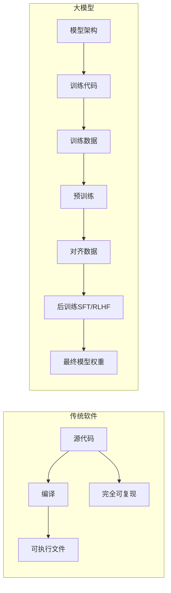
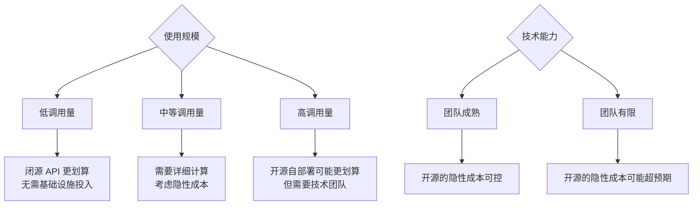
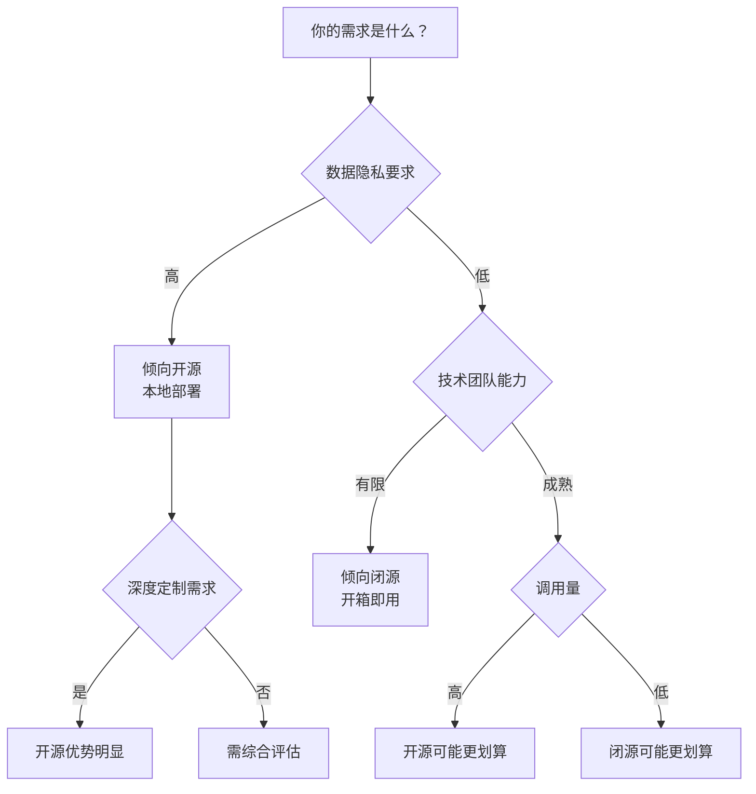

# AI大模型的航线抉择：开源与闭源的战略罗盘

> 开源与闭源之争，从来不是非黑即白的选择题。本文将以讨论的视角，客观审视两条路径的利与弊，揭示"开源"背后被忽视的真相，帮助你形成自己的判断。
>
> 📌 **适合人群**：AI 初学者、技术决策者、对大模型感兴趣的开发者  
> 📌 **阅读时长**：约 18 分钟


> 🎧 **更喜欢听？试试本文的音频版本**
<AudioPlayer 
  src="//pub.smallyoung.cn/course_slidev/rag-vector/开放权重高成本与数据泄露风险.m4a"
  \author="SmallYoung"
/>

<VideoPlayer 
  src="//pub.smallyoung.cn/course_slidev/rag-vector/开放与闭源_AI：一道日益模糊的界线.mp4"
/>


<MindMapFloat title="大模型开源与闭源知识图谱">

```mindmap-data
# 大模型开源与闭源
## 核心概念
- 什么是"开源"？
- 开放权重vs完全开源
- 许可协议差异
## 对比维度
- 透明度与可复现性
- 定制性与控制力
- 成本与资源
- 安全与风险
## 主流生态
- 开源阵营
- 闭源阵营
## 深层思考
- 训练数据争议
- 数据泄露风险
- 商业与理想的平衡
```

</MindMapFloat>

## 1. 引言：为什么这个话题值得讨论？


2024-2025 年，大模型领域最有趣的变化之一，是**开源与闭源的边界正在变得模糊**。

一方面，DeepSeek-R1、Llama 3.1 等"开源"模型在特定任务上已能与 GPT-4 等闭源模型一较高下；另一方面，关于"什么才是真正的开源"的争论也愈发激烈——**如果只开放模型权重而不公开训练数据，这还能叫"开源"吗？**

这不是一个有标准答案的问题。本文不会告诉你"开源更好"或"闭源更强"，而是尝试从多个维度展开讨论，帮助你看到问题的不同侧面。

## 2. 核心概念：重新定义"开源"


### 2.1 传统软件的开源 vs 大模型的"开源"

在传统软件领域，"开源"的定义相对清晰：公开源代码，允许任何人查看、使用、修改和分发。

但对于大模型，情况变得复杂了。一个大模型的构成远比传统软件复杂：



**问题来了**：当我们说一个大模型"开源"时，究竟开放了什么？

### 2.2 "开放权重"与"完全开源"的区别


事实上，当前大多数所谓的"开源大模型"，开放的主要是：

| ✅ 通常公开的 | ❌ 通常不公开的 |
|--------------|----------------|
| 模型权重文件 | 原始训练数据集 |
| 推理代码 | 数据处理流程 |
| 模型架构 | 完整训练代码 |
| 使用文档 | 对齐（Alignment）数据 |

这种模式更准确的称呼应该是**"开放权重"（Open Weights）**，而非传统意义上的"开源"。

> [!NOTE]
> **OSI 的新定义**：2024 年，开放源代码促进会（OSI）发布了"开源 AI 定义"（OSAID）1.0 版本。按此标准，真正的"开源 AI"必须提供足够信息以"实质性地"重建模型，包括训练数据透明性。以此标准衡量，Llama、Gemma 等模型都不符合"开源"定义。

### 2.3 训练数据为何不公开？


这不是厂商"故意藏私"那么简单。训练数据不公开，背后有多重原因：

| 原因 | 说明 | 立场 |
|------|------|------|
| **数据成本** | 高质量数据的收集、清洗、标注成本极高 | 企业视角合理 |
| **法律风险** | 训练数据可能涉及版权争议 | 现实困境 |
| **隐私问题** | 数据可能包含敏感信息 | 保护用户 |
| **商业壁垒** | 数据是难以复制的竞争优势 | 商业逻辑 |

**讨论**：这是否意味着"完全开源"只是理想？还是说，随着监管要求和社区呼声的增加，未来会有更透明的模式出现？这值得持续关注。

## 3. 开源与闭源：多维度对比


### 3.1 透明度与可复现性

| 维度 | 开源模型 | 闭源模型 |
|------|----------|----------|
| **代码透明** | 推理代码公开，架构可查 | 完全黑盒 |
| **训练透明** | 通常不透明（见上文讨论） | 完全不透明 |
| **可复现性** | 可运行和微调，但难以从头复现 | 完全无法复现 |
| **偏见审计** | 可检查输出，但无法审计训练数据 | 几乎无法审计 |

**讨论**：开源在透明度上确实优于闭源，但这种优势是有限的——没有训练数据，研究人员仍然无法完全理解模型的行为来源。

### 3.2 定制性与控制力


| 维度 | 开源模型 | 闭源模型 |
|------|----------|----------|
| **微调能力** | ✅ 可深度微调 | ⚠️ 有限（通过 API 微调） |
| **架构修改** | ✅ 完全可控 | ❌ 不可能 |
| **部署位置** | ✅ 本地/私有云/公有云 | ⚠️ 仅限厂商提供的选项 |
| **版本控制** | ✅ 自主决定何时升级 | ⚠️ 受厂商更新影响 |

**讨论**：对于需要深度定制的场景，开源模型的优势明显。但这也意味着更多的责任——安全、合规、维护都需要自己承担。

### 3.3 成本与资源


这是一个经常被简化的话题。让我们更细致地分析：



| 成本类型 | 开源模型 | 闭源模型 |
|----------|----------|----------|
| **直接费用** | 无许可费 | API 调用费/订阅费 |
| **基础设施** | 需要投入 | 无需（厂商提供） |
| **人力成本** | 需要 AI 工程能力 | 较低（开箱即用） |
| **运维成本** | 持续投入 | 无需（厂商负责） |

**讨论**：所谓"开源免费"是一个常见误解。真正的成本对比需要考虑全周期成本，包括人力、时间、机会成本。

### 3.4 安全与风险


这是一个值得深入讨论的维度。2025 年 10 月发表在 arXiv 上的论文 [Extracting alignment data in open models](https://arxiv.org/abs/2510.18554) 揭示了一个被忽视的风险：

> **核心发现**：即使训练数据不公开，攻击者仍可能从开源模型中**提取对齐训练数据**。模型在特定提示下会"吐出"与 SFT/RLHF 数据高度相似的内容，这些数据可用于训练新模型，恢复原模型大部分性能。


这带来了一个矛盾：

| 立场 | 观点 |
|------|------|
| **开源支持者** | 透明性有助于发现和修复安全漏洞 |
| **闭源支持者** | 开放权重反而增加了被滥用的风险 |
| **论文启示** | 即使不公开训练数据，数据仍可能被间接提取 |

**讨论**：这篇论文还指出，**模型蒸馏可被视为间接训练在原始数据集上**。这对使用开源模型进行商业微调的企业是一个警示——你的专有数据可能通过类似技术被提取。


| 风险类型 | 开源模型 | 闭源模型 |
|----------|----------|----------|
| **数据泄露** | ⚠️ 训练数据可能被间接提取 | ⚠️ 用户数据发送至第三方 |
| **模型滥用** | ⚠️ 任何人可下载使用 | ✅ 厂商可实施使用限制 |
| **漏洞修复** | ✅ 社区可快速响应 | ⚠️ 依赖厂商响应速度 |
| **合规审计** | ⚠️ 需自行确保合规 | ✅ 厂商已获得认证 |

## 4. 主流模型生态


### 4.1 开源阵营

| 模型 | 开发者 | 许可协议 | 特点 | 商业使用 |
|------|--------|----------|------|----------|
| **Llama 3.x** | Meta | 限制性许可 | 多语言强，生态完善 | ✅ 有条件（7亿月活限制） |
| **DeepSeek-R1** | 深度求索 | MIT | 推理能力突出，成本效益高 | ✅ 宽松 |
| **Qwen 2.5** | 阿里云 | 多种协议 | 中文能力强，规格多样 | ✅ 需查看具体协议 |
| **Mistral** | Mistral AI | Apache 2.0 | 高效多模态 | ✅ 宽松 |
| **Gemma** | Google | 限制性许可 | 指令遵循优化 | ⚠️ 有使用政策限制 |

### 4.2 闭源阵营

| 模型 | 开发者 | 定价模式 | 特点 | 适用场景 |
|------|--------|----------|------|----------|
| **GPT-4/4o/o1** | OpenAI | 按 Token 计费 | 综合能力标杆 | 复杂推理、创意写作 |
| **Gemini Pro/Ultra** | Google | 按 Token 计费 | 长上下文、多模态 | 文档分析、搜索增强 |
| **Claude 3.5** | Anthropic | 按 Token 计费 | 安全、推理强 | 安全敏感场景 |

### 4.3 性能差距的变化


学术研究显示，开源与闭源模型的性能差距正在快速缩小：

| 基准测试 | GPT-4 | Llama 3 70B | DeepSeek-R1 | 趋势 |
|----------|-------|-------------|-------------|------|
| MMLU | 86.4% | 78.5% | 接近 | 差距缩小 |
| 代码生成 | 领先 | 接近 | 可比肩 | 差距缩小 |
| 数学推理 | 领先 | 一般 | 可比肩 | 开源追赶 |

**讨论**：性能差距缩小是事实，但这不意味着开源模型已经"超越"闭源。在某些任务上开源表现出色，在另一些任务上闭源仍然领先。关键是根据具体需求选择。

## 5. 如何选择：场景化讨论

### 5.1 没有"最佳选择"，只有"合适选择"



### 5.2 场景讨论


| 场景 | 开源的适用性 | 闭源的适用性 | 建议 |
|------|-------------|-------------|------|
| **快速原型验证** | ⚠️ 需要部署时间 | ✅ 即开即用 | 先闭源验证，再考虑迁移 |
| **敏感数据处理** | ✅ 数据不出域 | ⚠️ 数据传输风险 | 倾向开源本地部署 |
| **垂直领域微调** | ✅ 可深度定制 | ⚠️ 定制受限 | 开源更灵活 |
| **追求最高性能** | ⚠️ 部分任务可比肩 | ✅ 通常领先 | 按具体任务评测 |
| **长期成本控制** | ✅ 高调用量时划算 | ✅ 低调用量时划算 | 计算临界点 |

### 5.3 混合策略：务实的选择


**越来越多的企业采用混合策略，这不是"骑墙"，而是务实**：

- **核心业务**：使用闭源 API 保证性能和稳定性
- **边缘场景**：使用开源模型控制成本
- **敏感场景**：本地部署开源模型保护数据

## 6. 常见观点的再审视

| 观点 | 讨论 |
|------|------|
| "开源=免费" | 代码开放不等于零成本。部署、运维、人力都是成本。对于缺乏技术能力的团队，开源的总成本可能更高 |
| "闭源=最强" | 在部分任务上成立，但开源在特定领域已可比肩。性能差距正在缩小 |
| "开源更透明" | 相对于闭源确实更透明，但训练数据不公开仍是"灰色地带"。透明度是相对的 |
| "闭源更安全" | 不一定。闭源的"黑盒"特性可能隐藏风险；开源的透明性有助于发现漏洞 |
| "开源更创新" | 社区贡献确实加速创新，但闭源厂商的持续投入也推动了技术边界 |

## 7. 总结：形成你自己的判断

通过本文的讨论，我们可以看到：

| 维度 | 开源 | 闭源 |
|------|------|------|
| **透明度** | 更高，但有限（训练数据不公开） | 完全黑盒 |
| **定制性** | 高，可深度微调 | 有限 |
| **成本** | 取决于规模和团队能力 | 取决于使用量 |
| **安全** | 各有风险（数据提取 vs 数据传输） | 各有风险 |
| **性能** | 快速追赶，部分任务可比肩 | 通常领先，但优势缩小 |

**没有标准答案**。开源与闭源的选择，取决于你的具体需求、资源约束和风险偏好。


> [!TIP]
> **务实建议**：不要被"开源 vs 闭源"的二元对立思维束缚。先明确你的核心需求，再评估哪种模式更能满足这些需求。很多时候，混合策略是最务实的选择。

## 8. 参考资料

| 资料 | 来源 | 说明 |
|------|------|------|
| [Llama 开源许可协议](https://llama.meta.com/) | Meta | Llama 系列模型官方授权条款 |
| [DeepSeek 官方文档](https://www.deepseek.com/) | 深度求索 | DeepSeek 模型技术文档与 API |
| [Qwen 使用政策](https://qwen.ai/) | 阿里云 | 通义千问许可与使用指南 |
| [Extracting alignment data in open models](https://arxiv.org/abs/2510.18554) | arXiv | 从开源模型提取对齐数据的风险研究 |
| [OSI 开源 AI 定义 1.0](https://opensource.org/ai) | OSI | 开放源代码促进会的 AI 开源标准 |
| [2025 LLM 发展趋势报告](https://www.tencent.com/) | 腾讯研究院 | 大模型行业发展分析 |
