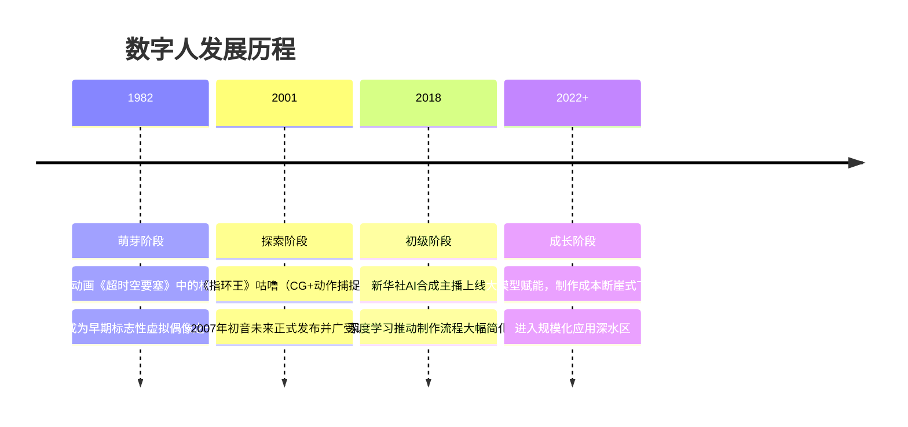
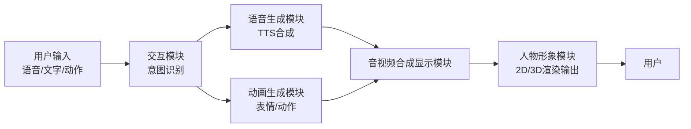
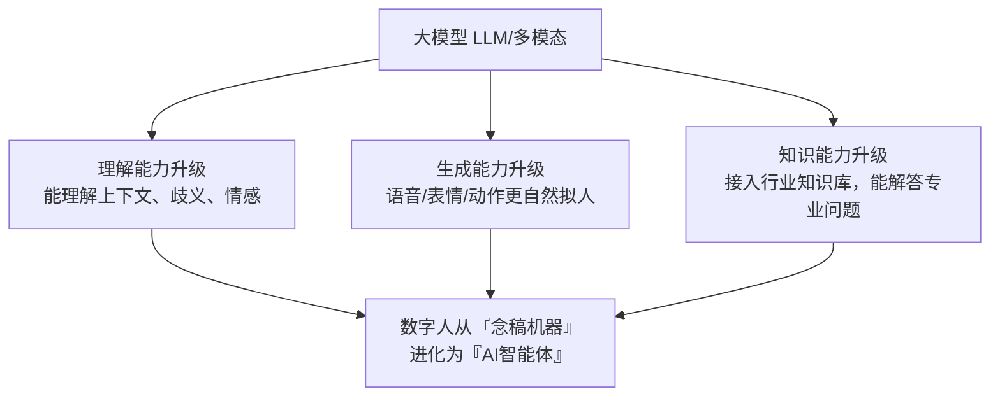
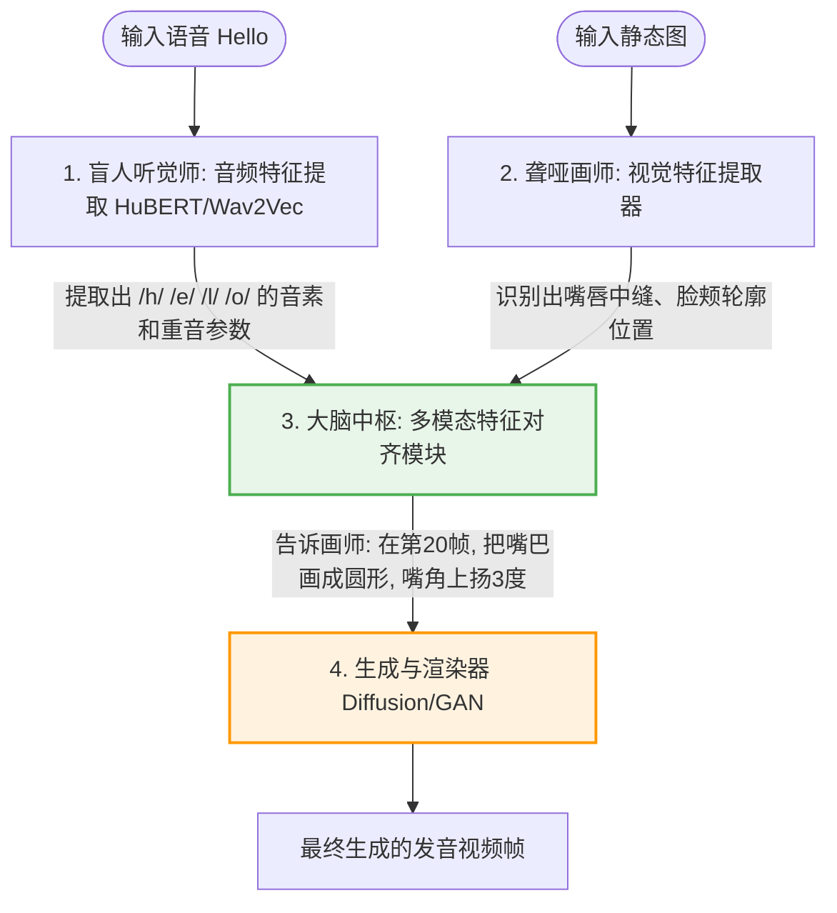
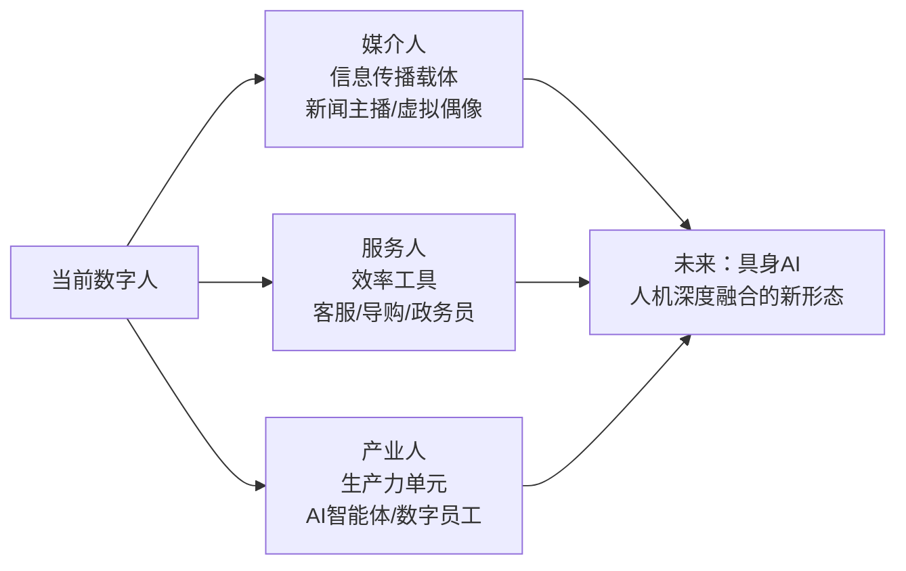

# 数字人完全指南：技术原理、主流模型与选型实战

> **数字人**（Digital Human）是通过计算机图形学、人工智能和多模态技术创造的、具有拟人化外观与交互能力的虚拟数字形象。进入2026年，数字人技术已从大厂实验室的"昂贵玩具"演变为普通人触手可及的"生产力外挂"。本文带你从零建立完整的数字人技术认知体系——从定义与历史出发，深度解剖主流AI模型，并手把手教你选择最适合的技术方案。
>
> 📌 **核心参考论文**：[A Survey on 3D Human Avatar Modeling - From Reconstruction to Generation](https://arxiv.org/abs/2406.04400)（arXiv:2406.04400）  
> 📌 **适合人群**：AI初学者、短视频创作者、对数字化感兴趣的技术从业者、产品经理及开发者

> [!TIP]
> **⚡ 速查摘要（TL;DR）**：数字人分为2D（低成本/适合直播短视频）和3D（高自由度/适合元宇宙）两条路线。主流开源模型中，**SadTalker** 适合单图激活、**MuseTalk** 适合实时直播、**Wav2Lip** 适合跨语种配音。2026年新锐模型（LatentSync、EmoDubber）正将情绪可控能力推向新高度。中国数字人核心市场规模2024年已达339.2亿元，年均增速超40%。


> 🎧 **更喜欢听？试试本文的音频版本**
<AudioPlayer 
  src="//pub.smallyoung.cn/course_slidev/digital-human/AI数字人选型避坑.m4a"
  \author="SmallYoung"
/>

<VideoPlayer 
  src="//pub.smallyoung.cn/course_slidev/digital-human/数字人完全指南.mp4"
/>

<MindMapFloat title="数字人完全知识图谱">

```mindmap-data
# 数字人
## 基础认知
- 核心定义与概念辨析
- 三大特征（虚拟化/拟人化/智能化）
- 发展四阶段（1982→2007→2018→2022至今）
## 技术路线选择
- 2D数字人（视频重绘/唇形同步）
  - 优势：低成本/快速/高真实感
  - 劣势：视角固定/动作受限
- 3D数字人（骨骼绑定/实时渲染）
  - 优势：全视角/高自由度/资产复用
  - 劣势：制作成本高/技术门槛高
## 核心底层技术（唇形同步）
- 音频特征提取（Wav2Vec/HuBERT）
- 视觉与身份编码（Landmarks）
- 跨模态对齐（Cross-modal Alignment）
- 图像渲染生成（GAN/扩散模型Diffusion）
## 五大系统模块
- 人物形象（3D建模/PBR渲染）
- 语音生成（TTS/情感合成）
- 动画生成（动捕/骨骼/唇形同步）
- 音视频合成（实时渲染/流媒体）
- 交互模块（ASR/NLP/大模型）
## 主流开源模型对比
- SadTalker（3D感知单图生成，CVPR 2023）
- MuseTalk（潜空间实时极速生成，腾讯）
- Wav2Lip（专家判别器严苛口型同步）
## 2026新锐模型
- LatentSync（字节跳动，中文优化低显存）
- EmoDubber（情绪可控配音）
## 大模型赋能三重升级
- 理解能力（上下文/歧义/情感）
- 生成能力（语音/表情/动作拟人）
- 知识能力（行业知识库接入）
## 产业链全景
- 基础层（芯片/引擎/传感器/显示）
- 平台层（建模系统/渲染/AI能力平台）
- 应用层（娱乐/电商/金融/政务/教育）
## 实战选型指南
- 三问决策树（静图？实时？算力？）
- 三大残酷真相（音频质量/调参/恐怖谷）
- 企业采购四维度评估
## 市场与趋势
- 全球市场（2024年约348.8亿美元）
- 三大演进方向（媒介人/服务人/产业人）
- 核心挑战（技术/商业/治理）
```

</MindMapFloat>

## 1. 为什么我们需要数字人？

想象以下几个让人头疼的现实场景：

**场景A（折磨的打工人）**：你是公司的新媒体运营，老板让你每天录制并剪辑5条科普短视频。你每天要化妆1小时、背稿子吃螺丝重录半天、还要面对镜头尴尬症发作。

**场景B（烧钱的电商老板）**：你开了一个网店，想雇主播做24小时日不落直播。按三班倒算，每个月光主播和场控的底薪支出就高达数万元，且主播离职还会带走好不容易沉淀的粉丝IP。

**场景C（无奈的教培机构）**：你的优质课件想要推向海外市场，但找真人外教逐行重新录制多语言版本，时间和金钱成本是一个天文数字。

这些需求有一个共同困境——**真人资源有限，但服务需求无限**。

数字人正是为了填补这道鸿沟而生。如果此刻，你可以随便拿一张自拍照，扔一段用手机录好的语音，按下回车键，AI就能在几秒钟之后生成一段逼真"念稿"的视频，甚至带上发怒、大笑或悲伤的表情——这就是数字人技术爆发的底层逻辑：**用极致的算法算力，抹平人类肉身在内容生产上的时间和空间限制**。

在2026年的今天，借由多模态大模型的发展，数字人的制作成本已经从早期的数十万元级别大幅压缩，许多开源方案甚至可以免费使用。


## 2. 什么是数字人？

### 2.1 权威定义

**数字人（Digital Human）是运用计算机图形学、人工智能、动作捕捉等技术创造的、具有人类外观特征、能够与用户进行自然交互的虚拟数字形象。** 业界从不同角度给出了多种诠释：

| 定义来源 | 核心表述 |
|----------|----------|
| 百度百科 | 运用数字技术创造的与人类形象接近的数字化人物形象，系统框架由人物形象、语音生成、动画生成、音视频合成及交互五大模块构成 |
| IDC（市场研究机构）| 采用人工智能技术驱动生成的数字化虚拟人物，具备人的外观、感知互动能力以及表达能力 |
| 韩国学界 | 用数字化技术打造的具有逼真人类长相、语言、动作姿态、身体特征的虚拟3D人体模型 |

### 2.2 相关概念辨析

初学者常常混淆"数字人"、"虚拟人"、"虚拟数字人"三个概念，它们既有重叠，也有细微差别：

| 概念 | 核心强调 | 是否必须有交互能力 |
|------|----------|--------------------|
| **数字人** | 存在于数字世界的人类形象（广义） | 不要求 |
| **虚拟人** | 身份为虚构、现实中不存在的形象 | 不要求 |
| **虚拟数字人** | 虚拟身份 + 数字化制作特性的综合体 | 通常要求 |

> [!NOTE]
> 在日常使用中，当不强调交互能力时，这三个概念可以视为等同。本文所讨论的"数字人"以AI驱动的交互型数字人为主要对象。

### 2.3 数字人的三大核心特征

数字人区别于普通动画角色的本质，在于它具备三大特征：

**虚拟化**：依托显示设备存在，不受物理空间约束，可以跨越地域、时区和场景无限复制部署。

**拟人化**：拥有人的外貌、声音、表情和肢体语言，能够在视觉和情感上拉近与用户的心理距离。

**智能化**：借助AI技术具备感知外界信息、理解语义并做出回应的能力，实现真正意义上的"人机对话"。


## 3. 数字人发展简史

从1982年早期虚拟偶像形象的出现，到今天AI大模型赋能的数字智能体，这段历史经历了四个清晰的发展阶段：



> [!IMPORTANT]
> 关键转折点发生在2022年前后：以ChatGPT为代表的大语言模型崛起，彻底改变了数字人的"智能内核"。大模型不仅让数字人学会了"思考"，更让其制作成本从数万元压缩至千元级别，使大规模商用成为可能。


## 4. 两条技术路线：2D 与 3D 数字人

在深入具体模型之前，必须先理清两条截然不同的技术路线。由于实现原理的天壤之别，2D数字人和3D数字人在成本、效果和适用场景上完全是两个物种。

### 4.1 2D 数字人：降本增效的"效率之王"

2D数字人本质上是"基于真人素材的智能视频重绘"。它不需要立体的模型空间，其运作逻辑是：用AI精准替换视频中的嘴部像素，使画面人物与目标音频保持口型同步。

**核心实现原理：**

1. **真人视频素材采集**：最常见的商用方式。让真人模特进录影棚，录制几分钟的高清视频作为基础素材。
2. **模型训练（口型特征与图像拼接）**：AI将画面中的人物"解剖"——记住身体动作规律，学习嘴巴在发不同音素时的形状特征。
3. **驱动生成**：当输入新的音频时，AI只负责替换原始视频中嘴巴那一部分的像素，并利用生成式AI（如Stable Diffusion）重绘嘴巴周围的画面，实现自然的口型同步。

**优点：**
- 制作成本极低，生成速度快；很多平台支持单张图片直接生成视频
- 皮肤纹理、衣服反光极其逼真，因为本就是基于真人画面的重绘
- 硬件要求相对亲民，普通消费级显卡即可完成视频生成

**缺点：**
- 视角固定，无法实现人物大幅转身，视角剧烈变化就会露出破绽
- 动作受限，手势往往是原始素材中的固定动作，无法真正自由交互

### 4.2 3D 数字人：虚拟世界的"未来原住民"

3D数字人是真正的"全息造物"，拥有立体的骨骼、肌肉和皮肤纹理，能够在三维空间中自由移动和交互。

**核心实现原理：**

1. **三维建模与材质雕刻**：使用Maya、Blender等专业软件，或虚幻引擎（Unreal Engine）的MetaHuman Creator，在三维空间中精细制作角色，赋予逼真的PBR材质。
2. **骨骼绑定与肌肉系统（Rigging）**：给躯壳装上虚拟骨骼。脸部需要绑定几十甚至上百块虚拟肌肉控制器（Blendshapes）来驱动细腻的表情变化。
3. **实时驱动与渲染**：输入声音或摄像头捕捉动作，AI算法将声音转化为控制虚拟肌肉收缩的数值，通过引擎（如UE5）计算光照后实时渲染输出。

**优点：**
- 可全方位旋转视角，不存在视角死角
- 可完美融入元宇宙、VR/AR设备，具备深度交互潜力
- 建好模之后资产复用度极高，可换服装、丢进任何虚拟场景

**缺点：**
- 制作成本与技术门槛极高；要做到不产生恐怖谷效应，需要极其精深的美术功底和大量的GPU算力
- 不适合普通创作者的日常短视频内容生产

> **一句话选型总结**：如果你想做知识科普短视频、卖货直播、低成本AI客服，选**2D数字人**。如果你要打造元宇宙游戏角色、全息投影交互偶像、超高预算大制作，选**3D数字人**。


## 5. 数字人的技术架构

### 5.1 五大系统模块

一个完整的数字人系统，由五大核心模块协同构成：



| 模块 | 核心功能 | 关键技术 |
|------|----------|----------|
| **人物形象** | 构建数字人的视觉外观（2D/3D） | 3D建模、PBR渲染、骨骼绑定 |
| **语音生成** | 将文本转化为自然语音 | TTS（文字转语音）、情感语音合成 |
| **动画生成** | 驱动面部表情和肢体动作 | 动作捕捉、骨骼动画、唇形同步 |
| **音视频合成** | 将语音与动画融合为连贯的视听输出 | 实时渲染、流媒体传输 |
| **交互** | 理解用户意图，驱动数字人响应 | ASR（语音识别）、NLP（自然语言处理） |

### 5.2 两种驱动方式

**① 真人驱动型**：由幕后真人实时控制数字人的表情和动作。真人通过摄像头和动作捕捉设备，将自身的声音、表情、肢体动作实时映射到数字形象上。

- 优势：交互自然灵活，情感表达真实丰富
- 劣势：依赖人工，无法7×24小时运转，成本较高
- 典型场景：高端虚拟偶像演出、重要直播活动

**② 智能驱动型（AI驱动型）**：通过AI算法自动解析用户输入，驱动预训练的TTSA（Text To Speech & Animation）人物模型生成相应的语音和动画。

- 优势：可全自动、全天候运行，可无限复制部署
- 劣势：早期情感表达生硬，复杂场景交互深度有限
- 典型场景：客服机器人、电商数字主播、虚拟政务员

> [!TIP]
> 目前行业发展方向是**两种方式的融合**：用AI处理日常高频标准化场景，真人介入处理复杂或高价值场景，实现成本与体验的平衡。

### 5.3 大模型如何改变数字人？

在大模型出现之前，数字人虽然"好看"，但往往"不够智能"——只能按照预设的脚本和规则回复，缺乏真正的理解和推理能力。

大模型的引入带来了三重升级：



以百度2025年发布的"慧播星"高说服力数字人为例，其已能做到"形神音容高度协调、会思考决策、能协作完成特定任务"，被定位为具备主动服务能力的**AI智能体**。


## 6. 深入底层：AI如何让"死照片开口说话"？

2D视频生成的唇形同步（Lip-Sync）是当前最火热的技术赛道。大模型究竟是如何做到输入一段声音，就能让图片上的人物嘴巴完美对上的？这依靠的是**多模态对齐（Multimodal Alignment）** 的硬核过程。

想象一个极其严格的"导演（AI中枢管理系统）"，手下有两个演员：一个是"盲人听觉师（音频编码器）"，一个是"聋哑画师（视觉渲染器）"。



整个过程分为四步：

1. **音频特征提取（Audio Feature Extraction）**：模型通过Wav2Vec等底层语音模型，把声音切分成极小片段，提取出代表声音特质的"声学特征"（音素、能量大小、音调等）。
2. **视觉与身份编码（Identity Encoding）**：系统识别参考图片，把眼睛、鼻子、嘴巴的坐标（Landmarks）用数学矩阵记录下来，确保不管嘴巴怎么动，这还是"你"的脸。
3. **跨模态对齐（Cross-modal Alignment）**：这是最难的一步。模型需要将无形的声音频率特征，映射为有形的肌肉移动距离。例如当音频提取器听到重音爆破音 "P" 时，对齐模块迅速反应，向面部生成模块下达指令："此时双唇必须紧闭，并在下一帧猛烈弹开"。
4. **图像渲染与生成（Image Rendering）**：利用生成对抗网络（GAN）或扩散模型（Diffusion Model），AI在原来的照片上精准"擦掉"原来的嘴巴，极其平滑地画出一个张着嘴的新脸部。

> [!IMPORTANT]
> 在2024-2026年，大模型的引入让AI学会了"察言观色"。现代模型听到的不仅是"啊"这个拼音，它还能通过大语言模型分析出这句"啊！"是惊喜还是惊吓，进而让视频里的人物带上**情绪（Emotion）**，这带来了划时代的逼真感提升。


## 7. 主流开源模型深度拆解

如果你是准备落地数字人技术的开发者或创作者，以下三个名字你绝对无法避开。它们各自代表了一种极具特色的技术解法路线。

### 7.1 SadTalker：为静态照片注入灵魂的"提线木偶大师"

SadTalker 是由西安交通大学和腾讯AI Lab联合开源的明星项目（发表于CVPR 2023）。它的杀手锏在于：**它不仅能让你的嘴巴动起来，还能让整个头部自然摇晃，甚至眨眼睛！**

**核心原理：3DMM的巧妙运用**

SadTalker走了一条"伪3D"的路线——对于一张2D的照片，它在内部脑补出其3D骨架：

1. **PoseVAE 与 ExpNet**：当输入一段声音时，它内部有一个PoseVAE（负责推演头部晃动方向）和一个ExpNet（负责推演面部表情）。它从输入的声音节奏中推测出："这个人说到这个重音时，头应该会往左偏一下"。
2. **3DMM表征（3D Morphable Models）**：它将推测出的摇头、眨眼动作生成一组3D运动系数，然后在内存里生成一个对应照片的3D隐形面具，拉扯这个面具做出动作。
3. **3D感知渲染**：最后，把原始的2D照片贴在这个隐形的3D动态面具上，录制下来，这就成了头摇晃自然、会说话的高质量视频。

| 维度 | SadTalker 详细点评 |
|------|-----------| 
| **显著优点 🌟** | 1. **超强单图激活能力**：只需一张图、一段音，就能生成附带自然头部晃动的高质感视频。<br>2. **中文口型同步出色**：对中文的咬字口型匹配度在开源界处于极高水准。<br>3. **风格化支持好**：支持多种头部晃动风格调节（如静止、自然、夸张等）。 |
| **致命局限 ⚠️** | 1. **头身分离的尴尬**：半身照中会出现头疯狂摇摆、脖子和肩膀僵硬的灵异画面（交接处像素撕裂），需配合`--still`参数或后处理修复。<br>2. **背景容易扭曲**：头的晃动会带动背景像素被扭曲拉扯。<br>3. **情绪表达受限**：只能生成通用微表情，无法针对特定台词生成大哭大笑。 |

**适用场景**：历史科普（让古人老照片"讲故事"）、文案解说号（单图动漫头像做解说员）。不适合以全身走动的真实人类视频为底料的场景。

### 7.2 MuseTalk：追求实时极限的"潜空间手术刀"

MuseTalk 是腾讯音乐娱乐Lyra实验室的开源项目。如果SadTalker的强项是静图激活，那MuseTalk的执念就是：**实时！极速！无缝换嘴！**

**核心原理：扩散模型的魔法底座**

MuseTalk直接拥抱了生成式AI界的强力架构：**Stable Diffusion（基于V1-4架构深度魔改）**。

它的做法非常"暴力美学"：
1. **潜在空间修补（Latent Inpainting）**：先在图上精准地用一个遮罩（Mask）把人物的嘴巴区域"蒙住"。
2. 然后，把剩下的半张脸以及要转换的声音压缩进高维潜空间。
3. 扩散模型像技艺极其高超的修图师，在潜空间里根据剩余的脸部信息和输入的音频指令，把那张缺失的嘴巴**重新生成出来**，面部局部生成分辨率高达256×256像素（最终合成图可通过超分辨率模块提升至更高输出规格）。

> [!TIP]
> **为什么它这么快？** 因为它没有去解算骨骼，也没有去渲染3D空间，它纯粹是在玩一种"精准填空"游戏。在企业级显卡（如NVIDIA V100/A100）上，它能做到30 FPS以上的极速修补——你刚说完一句话，画面里的虚拟人不到一秒钟就把这句话"播"出来了。

| 维度 | MuseTalk 详细点评 |
|------|-----------| 
| **显著优点 🌟** | 1. **王者的实时性能**：直播场景的核心利器，极低的端到端延迟让实时交互成为可能。<br>2. **高清晰度面部生成**：256×256的面部局部高分辨生成，大头特写也不会出现明显模糊。<br>3. **多语言全能**：中文、英语、日语均能保持一致的高口型同步率。 |
| **致命局限 ⚠️** | 1. **较高的初学者门槛**：需熟练掌握Python、Diffusers库依赖、CUDA环境配置，环境问题会劝退大量新手。<br>2. **算力要求较高**：要达到宣称的实时效果，消费级入门显卡（如RTX 3060）往往难以达到流畅帧率，建议使用RTX 4080及以上配置。<br>3. **表情较为木然**：专注于"嘴"，如果原始视频素材表情木讷，生成的成片依然木讷。 |

**适用场景**：有开发能力的企业技术团队、需要搭建24小时无人低延迟AI直播间的业务场景。不适合没有编程基础、只想快速出片的新手用户。

### 7.3 Wav2Lip：严苛的"经典口型校对员"

在所有数字人工具教程里，Wav2Lip绝对是被提及次数最多的元老。即便到了2026年，它依然有其独特的不可替代性。

**核心原理：拿着戒尺的专家判别器**

Wav2Lip之所以经典，是因为它引入了一个极其聪明的机制：**专家判别器模型（Expert Discriminator）监督机制**。

想象有两个AI在互搏：
- **生成器网络**：拼命试图画出一个和声音匹配的嘴巴。
- **专家判别器网络**：一个预先在大量演讲视频中训练出来的"唇语专家"。它不做别的，就拿着尺子量生成器画出的每一帧嘴唇张开幅度。只要嘴唇大小和当前的音素哪怕差了一点点，判别器就会严厉打低分，逼迫生成器重画。

在这种对抗训练机制下，Wav2Lip被练成了一个"口型精准对齐"的专项能手。

| 维度 | Wav2Lip 详细点评 |
|------|-----------| 
| **显著优点 🌟** | 1. **极致的口型同步精度**：对快速念白、多语言的口型咬字咬得比许多新模型还准，尤其擅长跨语种场景。<br>2. **相对亲民的显存要求**：在约4-6GB显存的显卡上即可运行，对硬件预算有限的创作者较为友好（具体配置取决于输入分辨率）。<br>3. **出海翻译利器**：极其适合拿一段现成的外文视频，替换成目标语言的配音音频后生成对应口型版本。 |
| **致命局限 ⚠️** | 1. **嘴部区域模糊**：由于原生网络架构压缩率较高，生成的嘴巴和下半脸区域往往偏模糊，通常需要叠加GFPGAN或CodeFormer等画质增强器进行修复，增加了工作流复杂度。<br>2. **只管嘴不管脸**：如果音频充满激动语调，但原视频人物面无表情，最终生成的画面会显得违和。 |

**适用场景**：短视频批量化生产、影视剧出海跨语种配音修改、硬件配置有限的创作者。不适合追求4K电影质感和极致情绪表现的高端制作场景。


### 7.4【2026前瞻】新锐模型在卷什么？

到了2025-2026年，除了上述三大经典模型，学术界和工业界又涌现出新一批值得关注的方向：

- **LatentSync（字节跳动）**：字节跳动2024年底发布的潜空间口型同步框架（[arXiv:2501.03164](https://arxiv.org/abs/2501.03164)），针对中文场景进行了专项优化，并大幅降低了显存占用，在中文数字人场景下表现出色。
- **EmoDubber（情绪可控配音）**：专注于情绪可控配音的研究方向。未来的数字人不再只管对口型——在说话前你甚至可以为台词标注一个`[怒不可遏]`的标签，模型就能生成咬牙切齿的口型和皱眉表情，真正实现情绪感知的数字人。
- **基于视频生成基座的新方案**：以Wan2.1、CogVideoX为代表的视频生成大模型，正在探索通过端到端视频生成方式驱动数字人，绕开传统唇形同步管线，代表了更长远的技术演进方向。

## 8. 模型选型决策树

面对五花八门的技术名词，新手到底该怎么选？以下是一套**实战决策树**：

**第一问：你的素材是一张静态照片，还是一段视频？**
- **手里只有一张静态照片** 👉 优先选 **SadTalker**，可获得自然的头部运动效果。
- **手里已有一段真人动态视频** 👉 往下看第二问。

**第二问：你的核心需求是实时交互，还是离线后期制作？**
- **做交互/直播，需要低延迟实时生成** 👉 选择 **MuseTalk**，或基于MuseTalk的商业闭环方案。
- **只是剪辑已录好的视频，不要求实时** 👉 往下看第三问。

**第三问：你的显卡配置和编程能力如何？**
- **有一张≥12GB显存的显卡且熟悉Python** 👉 在GitHub上部署 **LatentSync** 或高清版的MuseTalk，追求更好的画质。
- **显卡配置有限，希望尽快上手出片** 👉 使用带有一键整合包的 **Wav2Lip + GFPGAN** 组合，简单快速。

**主流方案硬件配置参考：**

| 方案 | 最低显存建议 | 推荐显存 | 适用分辨率 |
|------|------------|---------|-----------|
| Wav2Lip | 4GB | 6-8GB | 720p输入 |
| SadTalker | 6GB | 8GB | 512px人脸 |
| MuseTalk | 8GB | 16GB+ | 720p合成 |
| LatentSync | 12GB | 20GB+ | 1080p合成 |


## 9. 数字人产业链全景

数字人产业链从底层到应用，可分为三个层级：


### 主要参与者与代表产品

| 层级 | 代表企业/产品 |
|------|---------------|
| 基础层 | NVIDIA（GPU）、Epic Games（Unreal Engine）、Unity Technologies |
| 平台层 | 百度（慧播星数字人）、腾讯（智影数字人）、魔珐科技、相芯科技（FaceUnity） |
| 应用层 | 京东（言犀数字人）、新华社（AI合成主播）、各行业定制解决方案商 |

### 主流平台价格参考区间

| 类型 | 价格区间（参考） | 说明 |
|------|----------------|------|
| 开源自部署（Wav2Lip等） | 免费 + GPU算力成本 | 需自行搭建环境，技术门槛较高 |
| SaaS模版化数字人（如腾讯智影） | 免费套餐~数百元/月 | 限制分辨率与使用时长，适合个人试用 |
| 商用定制2D数字人 | 数千~数万元/次 | 含素材录制、模型训练、接口开发 |
| 高精度3D数字人（企业级） | 数十万~数百万元 | 含全套建模、渲染管线与长期维护 |

> [!NOTE]
> 以上价格区间为市场参考，实际报价因需求规模、定制程度和服务商不同而差异较大，建议在采购前向至少3家供应商询价比较。


## 10. 典型应用场景

### 10.1 电商直播：降本增效的利器

这是当前数字人商业化最成熟的赛道。京东言犀数字人的实践数据充分说明了其商业价值：

| 指标 | 真人主播 | 数字人主播 |
|------|----------|------------|
| 综合成本 | 基准（100%）| 约10%（降低约90%） |
| 工作时长 | 有限，需轮班 | 7×24小时不间断 |
| 直播间转化率 | 基准 | 较基准提升约30% |
| 规模复制性 | 1套班底 | 可同时开设多个直播间 |

> [!IMPORTANT]
> 2024年京东"618"期间，数字人直播已实现"高商业可用"，直播表现超过了80%的真人主播。这一数据标志着数字人在电商领域已从"实验品"成为"标配工具"。

### 10.2 政务与金融服务

数字人在需要"全天候、标准化"服务的场景中天然具有优势。以金融行业为例，数字人可以：

- 根据客户的风险偏好和理财目标，提供个性化金融方案
- 通过大数据分析对信用风险进行实时评估
- 提供不受时间限制的合规性客户咨询服务
- 以统一形象强化品牌专业度和信任感

### 10.3 文化旅游与教育

数字人为静态的历史文化赋予了动态的生命力。典型应用案例包括：

- **新疆伊犁将军府**：游客通过大屏与3D数字人"伊犁将军"实时问答，借助MR设备与"复活"的历史人物展开跨时空对话
- **国家自然博物馆**：数字人承担智慧化导览功能，将馆藏文物转化为可叙事的动态体验
- **智慧教育**：虚拟教师可以为每位学生提供个性化辅导，突破师资数量的物理限制


### 10.4 代码示例：调用数字人API（概念示例）

以下展示一个典型的数字人交互系统的调用逻辑：

```python
import requests

class DigitalHumanClient:
    """
    数字人API交互客户端（概念示例）
    实际产品可参考百度慧播星、腾讯智影等平台的官方SDK文档
    """
    
    def __init__(self, api_key: str, avatar_id: str):
        self.api_key = api_key
        self.avatar_id = avatar_id
        self.base_url = "https://api.digital-human.example.com/v1"
    
    def send_message(self, user_input: str, session_id: str) -> dict:
        """
        向数字人发送用户消息，获取语音+动画响应
        
        Args:
            user_input: 用户输入的文字或语音转录文本
            session_id: 会话ID（用于保持上下文连续性）
        
        Returns:
            包含语音URL、动画数据和文本回复的响应字典
        """
        payload = {
            "avatar_id": self.avatar_id,
            "session_id": session_id,
            "input": {
                "type": "text",
                "content": user_input
            },
            "output_config": {
                "voice": True,      # 生成语音
                "animation": True,  # 生成动画
                "emotion": True     # 启用情感计算（需平台支持）
            }
        }
        
        headers = {"Authorization": f"Bearer {self.api_key}"}
        response = requests.post(
            f"{self.base_url}/chat",
            json=payload,
            headers=headers,
            timeout=30  # 建议设置超时时间
        )
        response.raise_for_status()
        return response.json()
    
    def parse_response(self, response: dict) -> None:
        """解析并展示数字人回复"""
        text_reply = response.get("text", "")
        audio_url = response.get("audio_url", "")
        animation_data = response.get("animation", {})
        
        print(f"数字人回复（文本）：{text_reply}")
        print(f"音频文件：{audio_url}")
        print(f"表情/动作指令：{animation_data.get('expression')}")


# 使用示例
if __name__ == "__main__":
    client = DigitalHumanClient(
        api_key="your_api_key",
        avatar_id="financial_advisor_001"  # 金融顾问数字人
    )
    
    # 模拟用户咨询
    response = client.send_message(
        user_input="请问现在适合买基金吗？",
        session_id="user_session_123"
    )
    client.parse_response(response)
```

## 11. 常见误区、避坑指南与最佳实践

### 11.1 认知误区澄清

| 常见误区 | 正确理解 |
|----------|----------|
| 数字人 = 虚拟偶像 | 虚拟偶像只是数字人的一种应用形态；数字人更广泛地服务于政务、金融、教育等B端场景 |
| 数字人越像真人越好 | 需避免"恐怖谷效应"——接近但不完全像真人的形象会引发不适感；卡通/半写实风格有时用户体验更佳 |
| 大模型 = 数字人全部 | 大模型解决了"智能"问题，但建模、渲染、语音合成等感知层技术同样不可或缺 |
| 数字人成本已经很低 | 高质量3D数字人制作成本仍然不低；低成本通常意味着2D风格或模板化产品，个性化程度有限 |
| 数字人可以完全替代真人 | 目前适合替代标准化、重复性高的交互场景；高情感价值、高复杂度场景仍需真人介入 |

### 11.2 给初学者的3个残酷真相

| 💔 常见新手幻想 | 🔨 骨感的现实真相与最佳实践 |
|------|----------|
| **"我找个世界上最厉害的模型，一定能出好效果！"** | **真相：你的音频质量决定了最终效果的下限！** 噪音和杂音会严重干扰AI的声学特征提取，导致生成的嘴巴产生"抽搐"和"神经质抖动"。<br>👉 **最佳实践：永远先对音频进行降噪处理，或者直接使用TTS（如GPT-SoVITS、CosyVoice）合成高质量纯净语音作为驱动源。** |
| **"装上开源库就能做生意了！"** | **真相：最后一公里都是调出来的。** 开源的只是底层模型，对图片光照、角度极为敏感。直接跑出的开源结果往往存在肤色断层或明显的拼接边缘。<br>👉 **最佳实践：在工作流末尾接入画质增强算子（CodeFormer 或 GFPGAN），将模糊区域修复至更高质感。** |
| **"这技术以后一定能完全替代真人。"** | **真相：恐怖谷效应仍然存在。** 在2026年，数字人的精细微动作和深层次情感共鸣依旧与真人有明显差距。<br>👉 **最佳实践：让数字人专注播报技术科普、政策解读、流程说明等信息密集型内容，避免承担需要深刻情感共鸣的任务。** |

> [!WARNING]
> 使用数字人技术复制真人形象时，必须获得本人的明确书面授权。深度合成技术涉及肖像权和隐私权保护，未经授权的"AI换脸"或"数字分身"制作在多国已面临法律风险。中国《互联网信息服务深度合成管理规定》已于2023年1月正式施行，对深度合成内容有明确的标注义务要求。

> [!TIP]
> 企业选型数字人方案时，建议优先评估以下四个维度：**交互响应延迟**（端到端建议低于2秒）、**大模型知识库接入能力**（是否支持RAG/私有知识库）、**多终端部署支持**（H5/App/大屏/硬件一体机），以及**情绪识别与个性化表达**能力。


## 12. 市场现状与未来趋势

### 12.1 市场规模

数字人正处于爆发式增长阶段：

| 市场 | 数据 | 来源 |
|------|------|------|
| 全球数字人市场（2024年） | 约348.8亿美元 | 《2025全球数字人市场报告》 |
| 全球数字人市场（2025年预测） | 约519.4亿美元（同比增约49%） | 同上 |
| 中国数字人核心市场（2024年） | 339.2亿元 | 艾媒咨询 |
| 中国数字人核心市场（2025年预测） | 超400亿元 | 中国互联网协会 |
| 中国数字人带动产业规模（2025年预测） | 超6000亿元 | 同上 |


### 12.2 三大演进方向

根据《数字人发展报告（2025）》，数字人正沿着三个方向加速演进：



### 12.3 核心挑战

尽管前景广阔，数字人产业仍面临三重现实挑战：

**技术层面**：高质量实时渲染对算力要求极高；情感表达的细腻程度与真人仍有显著差距；多模态交互的一致性与稳定性有待提升。

**商业层面**：制作成本与收益的平衡仍是难题；2D数字人模板泛滥导致同质化竞争加剧；C端用户的变现路径尚不清晰。

**治理层面**：肖像权、隐私保护相关法规仍在完善中；深度伪造（Deepfake）技术的滥用风险持续存在；数字人内容版权归属尚待厘清。

> [!CAUTION]
> 数字人产业的健康发展离不开标准体系建设。工业和信息化部已于2024年明确提出加快数字人标准体系建设，相关的分类分级、隐私保护、伦理准则等行业标准正在加快制定中。


## 13. 常见问题解答（FAQ）

**Q1：数字人是什么？和虚拟人、虚拟数字人有什么区别？**

数字人是通过计算机图形学和AI技术创造的虚拟人类形象，具备人的外观、声音和交互能力。"虚拟人"强调身份虚构、现实中不存在；"虚拟数字人"是虚构身份与数字化制作技术的结合体，通常要求具备交互能力。日常语境中三者可互换使用。

**Q2：2D数字人和3D数字人哪个更好？**

没有绝对的"更好"，取决于使用场景。2D数字人制作成本低、生成快，适合短视频、直播、客服等需要快速规模化的场景；3D数字人自由度高、交互能力强，适合元宇宙、游戏、高端品牌形象等需要高质量沉浸体验的场景。绝大多数商业场景优先选择2D方案。

**Q3：SadTalker、MuseTalk、Wav2Lip我应该选哪个？**

- **只有一张静态照片** → 选 SadTalker
- **需要实时直播，对延迟敏感** → 选 MuseTalk
- **需要跨语种配音替换，硬件较差** → 选 Wav2Lip
- **追求最高画质，有充足算力（≥12GB显存）** → 考虑 LatentSync

**Q4：数字人制作需要多少钱？**

价格跨度非常大：开源自部署方案免费（但需GPU算力成本和技术能力），SaaS平台月费从免费到数百元不等，商用定制2D数字人一般数千到数万元，企业级高精度3D数字人可达数十万到数百万元。

**Q5：数字人会替代真人主播吗？**

短期内不会完全替代。数字人更适合标准化、重复性高的内容播报（如商品介绍、政策解读）；需要深度情感互动、即兴发挥、临场应变的场景仍需真人参与。目前行业最佳实践是"数字人承接日常场景 + 真人处理高价值场景"的混合运营模式。

**Q6：使用他人形象制作数字人合法吗？**

不经本人书面授权，不合法。中国《互联网信息服务深度合成管理规定》（2023年1月施行）明确要求，提供深度合成服务应取得被合成对象的合法授权，并对深度合成内容进行显著标注。未授权复制他人形象涉及肖像权侵权，情节严重时可能承担民事乃至刑事责任。

**Q7：大模型在数字人中起什么作用？**

大模型主要解决数字人的"智能内核"问题：提升自然语言理解能力（能理解上下文、情感、歧义）、生成能力（语音和表情更自然）、知识能力（可接入行业专属知识库）。在大模型出现之前，数字人只能按预设脚本回复，引入大模型后才实现了真正意义上的"思考与对话"。

## 14. 总结

数字人技术的演进，本质上是一场**从"好看的皮囊"到"真正的智能"**的进化之旅：

| 阶段 | 核心能力 | 代表产物 |
|------|----------|----------|
| 萌芽期（1980s-2000s）| 视觉呈现 | 手绘虚拟歌姬、CG特效角色 |
| 探索期（2000s-2018）| 动态生成 | 动作捕捉驱动的3D数字人 |
| 初级期（2018-2022）| 语音交互 | AI合成主播、TTSA人物模型 |
| 成长期（2022至今）| 智能理解与决策 | 大模型驱动的数字人智能体 |

大模型是数字人的"智能内核"；计算机图形学是它的"形体构造"；多模态交互技术（SadTalker/MuseTalk/Wav2Lip等）是它的"感官系统"。三者的深度融合，才构成了今天正在走进千行百业的数字人。

理解数字人，不只是理解一项技术，更是在理解人与数字世界之间那道正在消弭的边界。


## 15. 参考资料

| 资料名称 | 作者/机构 | 适用阶段 | 说明 |
|------|-----------|------|------|
| [中国数字人发展报告（2024）](https://www.isc.org.cn) | 中国互联网协会 | 产业研究 | 国内数字人产业权威年度报告 |
| [2025年中国数字人产业发展报告](https://www.iimedia.cn) | 艾媒咨询 | 产业研究 | 市场规模与产业图谱分析 |
| [虚拟数字人：元宇宙的主角破圈而来](https://zhidx.com/p/314280.html) | 天风证券 | 技术架构 | 数字人技术架构深度解析 |
| [2025全球数字人市场报告](https://www.infoobs.com/article/20250220/68559.html) | 信息化观察网 | 市场数据 | 全球市场规模数据 |
| [A Survey on 3D Human Avatar Modeling](https://arxiv.org/abs/2406.04400) | Ruihe Wang 等 | 高阶科研 | 涵盖建模到生成架构的深度前沿综述 |
| [SadTalker 原始论文](https://arxiv.org/abs/2211.12194) | Wenxuan Zhang 等（西安交大&腾讯）| 进阶使用 | CVPR 2023 经典论文；可配合GitHub仓库`--still`参数解决背景扭曲问题 |
| [Wav2Lip: A Lip Sync Expert Is All You Need](https://arxiv.org/abs/2008.10010) | K R Prajwal 等 | 基础原理 | 经典开源必读，深刻理解专家判别器对抗损失的底层设计 |
| [LatentSync: Audio Conditioned Latent Diffusion Models for Lip Sync](https://arxiv.org/abs/2501.03164) | ByteDance Research | 前沿追踪 | 字节跳动2024年发布的潜空间口型同步技术，针对中文场景有专项优化 |
| 数字人（Digital Human）| 百度百科 | 基础入门 | 技术概念与历史沿革综述 |
| [互联网信息服务深度合成管理规定](http://www.cac.gov.cn) | 国家互联网信息办公室 | 合规参考 | 深度合成内容的合规义务说明，2023年1月施行 |